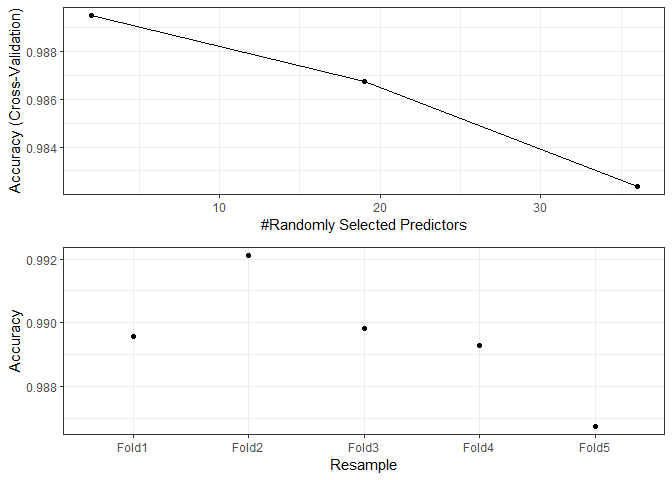
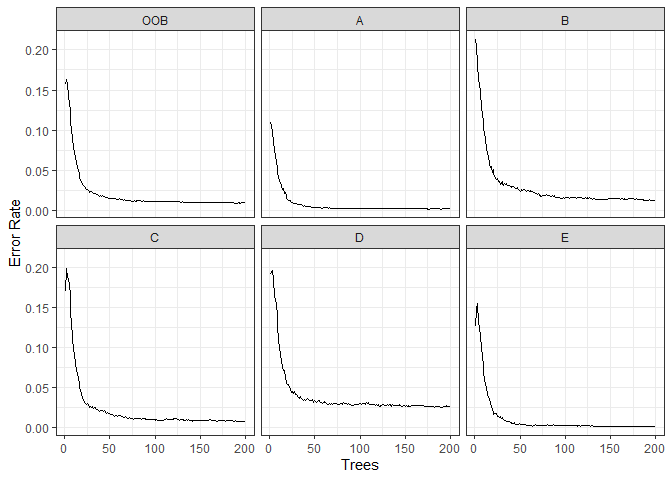

## Synopsis

We build a random forest classifier model on the Weight Lifting Exercises Dataset[^1] to predict how well an activity is done.

About the dataset:

* Six young health participants were asked to perform one set of 10 repetitions of the Unilateral Dumbbell Biceps Curl in five different fashions: exactly according to the specification (Class A), throwing the elbows to the front (Class B), lifting the dumbbell only halfway (Class C), lowering the dumbbell only halfway (Class D) and throwing the hips to the front (Class E).

[^1]:Velloso, E.; Bulling, A.; Gellersen, H.; Ugulino, W.; Fuks, H. Qualitative Activity Recognition of Weight Lifting Exercises. Proceedings of 4th International Conference in Cooperation with SIGCHI (Augmented Human '13) . Stuttgart, Germany: ACM SIGCHI, 2013. Read more: http://groupware.les.inf.puc-rio.br/har#dataset#ixzz6c6x1JE00

## Packages

Load the R packages needed further. It's also good to set system locale to avoid problems related with system differences between regions.


```r
library(data.table, quietly = T, warn.conflicts = F)
library(caret, quietly = T,warn.conflicts = F)
library(dplyr, quietly = T, warn.conflicts = F)
library(plotly, quietly = T, warn.conflicts = F)
library(doParallel, quietly = T, warn.conflicts = F)
library(ggpubr, quietly = T, warn.conflicts = F)
Sys.setlocale('LC_ALL','English')  
```

```
## [1] "LC_COLLATE=English_United States.1252;LC_CTYPE=English_United States.1252;LC_MONETARY=English_United States.1252;LC_NUMERIC=C;LC_TIME=English_United States.1252"
```

## Getting data

Start by creating a directory to store data and download it from the web. While doing it, create a text file which states the time/timezone of download for reference purposes.  


```r
datadir <- './data'
trainingurl <- 'https://d396qusza40orc.cloudfront.net/predmachlearn/pml-training.csv'
testurl <- 'https://d396qusza40orc.cloudfront.net/predmachlearn/pml-testing.csv'
trainingpath <- paste0(datadir,'/pml-training.csv')
testpath <- paste0(datadir,'/pml-testing.csv')

if(!dir.exists(datadir)){
        dir.create(datadir)
}

if(!file.exists(trainingpath)){
        
        download.file(url = trainingurl,
                      destfile = trainingpath,
                      method = 'curl')
        download.file(url = testurl,
                      destfile = testpath,
                      method = 'curl')
        
        time <- as.character(Sys.time())
        timezone <- Sys.timezone()
        
        downloadinfo <- data.frame(list(time = time, 
                             format = "%Y-%m-%d %H:%M:%S",
                             timezone = timezone))
        
        write.table(x = downloadinfo,
                    file = paste0(datadir,'/downloadinfo.txt'),
                    row.names = F)
}
```

## Brief Exploratory Data Analysis

Use fread to load data into R environment.


```r
training <- fread(file = trainingpath, data.table = F,stringsAsFactors = T)
test <- fread(file = testpath, data.table = F,stringsAsFactors = T)
```

There is lots of NA values in this dataset, so to avoid any trouble I'm gonna filter out columns that contains any of them and select the variables of interest to the model. Our response variable is named 'classe' in the dataset. For the purpose of this project, I'm gonna select only the spacial variables as explanatory variables. I expect that those variables contains enough information about the movements for the random forest's trees to be able to group them to each class. Same thing is applied to test set.


```r
training1 <- training %>% 
        select(!where(anyNA)) %>%
        select(classe,ends_with(c('x','y','z')))
test1 <- test %>% 
        select(!where(anyNA)) %>%
        select(problem_id,ends_with(c('x','y','z')))
```

Let's take a look at a 3dplot of some spatial variable to see if we are lucky to find any pattern that calls attention.


```r
training1 %>% plot_ly(
        x=.$gyros_belt_x,
        z = .$gyros_belt_z, 
        y = .$gyros_belt_y,
        type = 'scatter3d',
        color = .$classe,
        mode = 'markers')
```

<!--html_preserve--><div id="htmlwidget-7ab938af7aee7619cb65" style="width:672px;height:480px;" class="plotly html-widget"></div>
<script type="application/json" data-for="htmlwidget-7ab938af7aee7619cb65">{"x":{"visdat":{"290c33cb7cab":["function () ","plotlyVisDat"]},"cur_data":"290c33cb7cab","attrs":{"290c33cb7cab":{"x":[0,0.02,0,0.02,0.02,0.02,0.02,0.02,0.02,0.03,0.03,0.02,0.02,0.02,0,0,0,0,0,0.02,0.02,0.02,0.02,0.02,0.03,0.02,0.03,0.03,0.03,0.03,0.02,0.02,0,0.02,0,0,0,0,0.02,0.03,0.03,0,0,-0.02,-0.02,-0.02,-0.02,0.02,0.02,0,0,0,0,0,0.02,0.03,0.02,0,0,0,0,0,0,0,0,0,0,0,0,0.02,0.02,0,0.02,0.02,0.02,0.02,0.02,0.02,0.02,0.02,0.02,0.02,0.02,0.03,0.03,0.03,0.02,0,0.02,0.02,0.02,0.02,0.02,0.02,0.02,0.02,0,0,0,0.02,0.02,0.02,0.02,0.02,0.02,0.02,0.02,0.02,0.02,0.02,0.02,0.02,0.02,0,0,-0.02,0,0,0,-0.02,-0.02,0,0,0,0,0.02,0.02,0.03,0.03,0.06,0.06,0.06,0.05,0.03,0,-0.02,-0.03,-0.02,0,0,0,0,0,0,0.02,0.02,0,0,0.02,0.02,0.03,0.03,0.03,0.03,0.02,0.02,0.02,0.02,0.03,0.03,0.03,0.03,0.03,0.03,0.03,-0.51,-0.51,-0.53,-0.51,-0.51,-0.5,-0.48,-0.47,-0.47,-0.4,-0.42,-0.45,-0.47,-0.5,-0.51,-0.51,-0.45,-0.4,-0.4,-0.39,-0.39,-0.4,-0.43,-0.43,-0.42,-0.4,-0.42,-0.43,-0.43,-0.43,-0.42,-0.42,-0.4,-0.42,-0.42,-0.43,-0.43,-0.43,-0.42,-0.42,-0.42,-0.42,-0.43,-0.43,-0.43,-0.43,-0.43,-0.43,-0.43,-0.43,-0.43,-0.43,-0.45,-0.42,-0.4,-0.42,-0.43,-0.43,-0.47,-0.47,-0.47,-0.47,-0.47,-0.47,-0.47,-0.45,-0.45,-0.45,-0.45,-0.45,-0.45,-0.47,-0.47,-0.51,-0.5,-0.47,-0.47,-0.48,-0.48,-0.48,-0.48,-0.48,-0.5,-0.5,-0.5,-0.48,-0.48,-0.5,-0.48,-0.47,-0.43,-0.37,-0.32,-0.31,-0.37,-0.39,-0.39,-0.37,-0.42,-0.43,-0.43,-0.45,-0.47,-0.48,-0.5,-0.48,-0.47,-0.48,-0.5,-0.48,-0.5,-0.5,-0.5,-0.48,-0.5,-0.5,-0.47,-0.45,-0.43,-0.4,-0.4,-0.4,-0.42,-0.43,-0.45,-0.45,-0.45,-0.42,-0.4,-0.4,-0.4,-0.4,-0.39,-0.37,-0.39,-0.4,-0.45,-0.48,-0.5,-0.58,-0.58,-0.58,-0.56,-0.55,-0.58,-0.58,-0.55,-0.5,-0.5,-0.48,-0.42,-0.39,-0.37,-0.32,-0.31,-0.32,-0.34,-0.43,-0.43,-0.45,-0.45,-0.45,-0.45,-0.43,-0.42,-0.43,-0.42,-0.43,-0.42,-0.43,-0.43,-0.45,-0.43,-0.4,-0.4,-0.4,-0.42,-0.45,-0.47,-0.45,-0.43,-0.42,-0.43,-0.42,-0.39,-0.39,-0.39,-0.34,-0.35,-0.35,-0.39,-0.4,-0.4,-0.4,-0.42,-0.48,-0.51,-0.53,-0.53,-0.53,-0.51,-0.51,-0.53,-0.53,-0.56,-0.55,-0.53,-0.53,-0.53,-0.48,-0.45,-0.4,-0.37,-0.31,-0.4,-0.42,-0.43,-0.42,-0.42,-0.37,-0.37,-0.37,-0.35,-0.35,-0.35,-0.37,-0.39,-0.42,-0.43,-0.45,-0.47,-0.48,-0.5,-0.53,-0.53,-0.53,-0.55,-0.55,-0.55,-0.55,-0.55,-0.55,-0.51,-0.34,-0.32,-0.31,-0.34,-0.39,-0.37,-0.39,-0.4,-0.4,-0.39,-0.39,-0.4,-0.4,-0.42,-0.42,-0.43,-0.47,-0.5,-0.5,-0.5,-0.5,-0.48,-0.47,-0.47,-0.45,-0.43,-0.42,-0.43,-0.43,-0.43,-0.43,-0.43,-0.43,-0.43,-0.45,-0.43,-0.45,-0.45,-0.45,-0.47,-0.47,-0.47,-0.47,-0.45,-0.43,-0.4,-0.39,-0.35,-0.32,-0.32,-0.34,-0.34,-0.35,-0.35,-0.39,-0.4,-0.48,-0.51,-0.55,-0.55,-0.53,-0.51,-0.5,-0.42,-0.35,-0.34,-0.34,-0.37,-0.39,-0.4,-0.4,-0.4,-0.42,-0.45,-0.45,-0.47,-0.48,-0.48,-0.47,-0.43,-0.43,-0.43,-0.4,-0.42,-0.43,-0.43,-0.42,-0.43,-0.43,-0.43,-0.45,-0.43,-0.45,-0.43,-0.42,-0.42,-0.4,-0.39,-0.35,-0.35,-0.37,-0.39,-0.42,-0.43,-0.45,-0.47,-0.5,-0.51,-0.51,-0.5,-0.5,-0.42,-0.42,-0.4,-0.4,-0.37,-0.35,-0.35,-0.37,-0.37,-0.37,-0.37,-0.42,-0.42,-0.4,-0.39,-0.39,-0.4,-0.4,-0.4,-0.43,-0.42,-0.42,-0.43,-0.43,-0.43,-0.5,-0.5,-0.51,-0.53,-0.55,-0.55,-0.55,-0.53,-0.51,-0.51,-0.5,-0.48,-0.48,-0.47,-0.42,-0.35,-0.34,-0.35,-0.37,-0.39,-0.42,-0.47,-0.48,-0.48,-0.5,-0.5,-0.5,-0.5,-0.42,-0.4,-0.4,-0.4,-0.4,-0.4,-0.4,-0.42,-0.43,-0.47,-0.43,-0.42,-0.39,-0.37,-0.39,-0.39,-0.39,-0.4,-0.4,-0.4,-0.39,-0.4,-0.42,-0.45,-0.47,-0.51,-0.48,-0.45,-0.43,-0.4,-0.37,-0.37,-0.42,-0.4,-0.42,-0.42,-0.42,-0.43,-0.45,-0.45,-0.43,-0.43,-0.43,-0.42,-0.4,-0.4,-0.4,-0.42,-0.42,-0.42,-0.42,-0.42,-0.43,-0.43,-0.43,-0.47,-0.51,-0.51,-0.47,-0.45,-0.45,-0.42,-0.39,-0.37,-0.39,-0.4,-0.4,-0.43,-0.43,-0.42,-0.42,-0.43,-0.45,-0.45,-0.42,-0.42,-0.4,-0.43,-0.45,-0.45,-0.47,-0.45,-0.47,-0.48,-0.5,-0.42,-0.43,-0.43,-0.43,-0.42,-0.42,-0.37,-0.37,-0.39,-0.4,-0.43,-0.47,-0.47,-0.47,-0.47,-0.45,-0.45,-0.45,-0.45,-0.43,-0.43,-0.45,-0.45,-0.45,-0.43,-0.45,-0.45,-0.45,-0.43,-0.43,-0.43,-0.43,-0.45,-0.45,-0.43,-0.42,0.11,0.11,0.06,0.06,0.06,0.08,0.14,0.16,0.08,0.03,0.03,0.06,0.05,-0.02,0.02,0.05,0.06,0.06,0.11,0.14,0.18,0.19,0.19,0.16,0.13,0.13,0.11,0.1,0.1,0.08,0.08,0.08,0.08,0.06,0.06,0.05,0.05,0.03,0.03,0.02,0,-0.02,-0.02,0,0.02,0.03,0.02,0.08,0.06,0.08,0.08,0.1,0.08,0.1,0.1,0.1,0.11,0.11,0.11,0.11,0.08,0.1,0.1,0.1,0.1,0.08,0.1,0.1,0.1,0.08,0.06,0.06,0.08,0.1,0.11,0.13,0.13,0.11,0.13,0.13,0.11,0.11,0.14,0.14,0.13,0.13,0.13,0.13,0.13,0.13,0.11,0.11,0.11,0.11,0.13,0.13,0.13,0.13,0.13,0.11,0.11,0.11,0.11,0.13,0.13,0.11,0.11,0.11,0.1,0.11,0.13,0.13,0.13,0.13,0.13,0.13,0.13,0.13,0.13,0.13,0.13,0.11,0.11,0.1,0.08,0.08,0.08,0.08,0.08,0.13,0.13,0.13,0.13,0.11,0.11,0.13,0.13,0.13,0.11,0.11,0.11,0.11,0.11,0.1,0.1,0.1,0.08,0.08,0.06,0.06,0.06,0.06,0.03,0.03,0.03,0.05,0.1,0.1,0.1,0.08,0.11,0.1,0.1,0.1,0.08,0.1,0.1,0.1,0.14,0.16,0.16,0.13,0.11,0.1,0.08,0.06,0.06,0.05,0.06,0.08,0.08,0.1,0.1,0.11,0.13,0.14,0.14,0.14,0.14,0.13,0.14,0.14,0.14,0.14,0.05,0.08,0.1,0.16,0.18,0.18,0.14,0.11,0.1,0.11,0.11,0.11,0.11,0.11,0.13,0.13,0.13,0.13,0.11,0.08,0.03,0.03,0.03,0.03,0.05,0.03,0.05,0.06,0.08,0.08,0.08,0.1,0.11,0.13,0.11,0.08,0.1,0.1,0.1,0.1,0.1,0.11,0.11,0.11,0.1,0.11,0.11,0.11,0.11,0.11,0.11,0.11,0.11,0.11,0.13,0.19,0.29,0.5,0.45,0.39,0.29,0.08,0.02,-0.05,-0.13,-0.16,-0.22,-0.24,-0.22,-0.1,0.08,0.21,0.22,0.22,0.16,0.11,0.13,0.14,0.14,0.11,0.1,0.1,0.18,0.19,0.18,0.16,0.18,0.14,0.14,0.1,0.1,0.08,0.14,0.11,0.18,0.22,0.14,0.08,0.03,0.05,0.1,0.1,0.1,0.1,0.08,0.05,0.02,0,-0.02,0,0,0.02,0.03,0.06,0.06,0.06,-0.03,-0.05,-0.05,-0.05,-0.02,0,0.02,0.03,0.11,0.13,0.13,0.14,0.16,0.18,0.18,0.19,0.21,0.21,0.22,0.24,0.26,0.27,0.34,0.34,0.35,0.37,0.35,0.43,0.45,0.08,0.08,0.1,0.1,0.1,0.08,0.06,0.05,0.03,0.03,0.02,0.02,0,0,-0.03,-0.05,-0.06,-0.06,-0.06,-0.05,-0.05,-0.08,-0.08,-0.1,-0.08,-0.08,-0.06,-0.06,0,0.03,0.06,0.16,0.19,0.26,0.27,0.29,0.24,0.19,0.14,0.13,0.1,0.06,0.03,0,-0.05,-0.05,-0.03,-0.03,-0.03,0.02,0.02,0.06,0.06,0.06,0.06,0.08,0.1,0.11,0.16,0.16,0.16,0.13,0.1,0.08,0.06,0.06,0.1,0.13,0.16,0.16,0.14,0.08,0.08,0.1,0.1,0.1,0.11,0.13,0.14,0.16,0.18,0.18,0.18,0.18,0.16,0.14,0.1,0.1,0.1,0.08,0.08,0.06,0.08,0.13,0.13,0.14,0.14,0.16,0.16,0.16,0.14,0.14,0.14,0.13,0.11,0.11,0.1,0.1,0.1,0.1,0.1,0.1,0.08,0.08,0.1,0.11,0.13,0.13,0.11,0.11,0.11,0.11,0.11,0.11,0.1,0.1,0.1,0.1,0.1,0.1,0.11,0.11,0.13,0.11,0.11,0.11,0.1,0.1,0.1,0.1,0.1,0.1,0.14,0.14,0.14,0.14,0.14,0.14,0.11,0.08,0.06,0.06,0.06,0.08,0.08,0.11,0.11,0.11,0.13,0.14,0.14,0.14,0.14,0.13,0.11,0.11,0.11,0.11,0.11,0.11,0.08,0.08,0.08,0.08,0.08,0.1,0.08,0.1,0.1,0.13,0.14,0.16,0.16,0.16,0.14,0.13,0.11,0.1,0.08,0.08,0.1,0.1,0.13,0.13,0.13,0.11,0.11,0.11,0.11,0.11,0.11,0.13,0.13,0.13,0.16,0.18,0.16,0.16,0.14,0.14,0.13,0.13,0.11,0.1,0.1,0.1,0.1,0.08,0.08,0.08,0.08,0.08,0.1,0.1,0.11,0.11,0.11,0.14,0.13,0.13,0.11,0.11,0.1,0.11,0.11,0.11,0.11,0.11,0.11,0.11,0.11,0.14,0.13,0.13,0.13,0.13,0.11,0.11,0.1,0.1,0.11,0.14,0.14,0.16,0.16,0.18,0.16,0.14,0.13,0.11,0.08,0.08,0.06,0.08,0.08,0.1,0.1,0.1,0.11,0.1,0.11,0.14,0.16,0.14,0.14,0.14,0.11,0.11,0.11,0.1,0.11,0.11,0.11,0.11,0.14,0.13,0.13,0.11,0.11,0.08,0.08,0.08,0.08,0.08,0.08,0.1,0.11,0.13,0.13,0.13,0.11,0.1,0.08,0.06,0.11,0.13,0.14,0.13,0.11,0.1,0.11,0.13,0.13,0.13,0.11,0.11,0.11,0.11,0.13,0.14,0.18,0.18,0.18,0.18,0.18,0.16,0.11,0.1,0.08,0.06,0.06,0.1,0.1,0.08,0.06,0.06,0.08,0.1,0.1,0.11,0.13,0.13,0.11,0.11,0.1,0.1,0.1,0.11,0.13,0.13,0.13,0.13,0.1,0.1,0.1,0.1,0.1,0.13,0.13,0.14,0.13,0.13,0.13,0.13,0.13,0.1,0.08,0.06,0.06,0.08,0.08,0.08,0.1,0.1,0.1,0.11,0.13,0.13,0.13,0.13,0.1,0.08,0.1,0.1,0.11,0.13,0.11,0.1,0.1,0.11,0.11,0.13,0.14,0.14,0.16,0.16,0.16,0.16,0.14,0.14,0.13,0.1,0.08,0.08,0.1,0.11,0.11,0.13,0.13,0.1,0.08,0.08,0.1,0.1,0.11,0.13,0.13,0.13,0.13,0.11,0.11,0.11,0.11,0.13,0.13,0.13,0.11,0.11,0.1,0.11,0.1,0.1,0.1,0.11,0.11,0.11,0.13,0.14,0.14,0.14,0.13,0.11,0.11,0.11,0.1,0.08,0.08,0.1,0.1,0.1,0.13,0.13,0.11,0.1,0.13,0.13,0.13,0.13,0.11,0.08,0.06,0.08,0.08,0.11,0.08,0.11,0.13,0.13,0.14,0.13,0.13,0.13,0.11,0.11,0.11,0.11,0.11,0.11,0.11,0.13,0.13,0.16,0.14,0.14,0.14,0.13,0.08,0.1,0.08,0.08,0.08,0.1,0.08,0.08,0.1,0.13,0.14,0.14,0.14,0.11,0.11,0.1,0.08,0.1,0.1,0.11,0.11,0.13,0.11,0.11,0.11,0.1,0.1,0.1,0.1,0.1,0.11,0.13,0.13,0.14,0.13,0.13,0.11,0.11,0.11,0.13,0.13,0.13,0.11,0.08,0.06,0.06,0.06,0.08,0.1,0.1,0.1,0.1,0.1,0.11,0.13,0.14,0.14,0.14,0.13,0.11,0.1,0.1,0.11,0.11,0.11,0.14,0.14,0.14,0.14,0.14,0.13,0.16,0.16,0.14,0.13,0.11,0.08,0.06,0.05,0.03,0.03,0.03,0.06,0.06,0.06,0.06,0.06,0.06,0.05,0.05,0.06,0.08,0.08,0.08,0.08,0.1,0.11,0.11,0.13,0.14,0.14,0.14,-0.05,-0.06,-0.06,-0.02,-0.05,-0.05,-0.02,0.05,0.06,0.1,0.1,0.08,0.06,0.05,0.03,0.02,0.02,0.02,0.02,0.02,0,0,0.02,0,0,-0.02,-0.03,-0.03,-0.03,-0.05,-0.05,-0.05,-0.03,-0.02,-0.02,0.02,0.02,0.03,0.03,0.02,0.03,0.05,0.06,0.08,0.08,0.08,0.08,0.08,0.05,0.05,0.03,0.02,0,0,0.02,0.03,0.03,0.03,0.02,-0.05,0.02,0.03,0.03,0.03,0.02,0,-0.02,-0.03,-0.1,-0.05,-0.03,-0.03,-0.02,-0.02,-0.02,-0.02,0,0.05,0.05,0.05,0.06,0.06,0.08,0.08,0.08,0.05,0.02,0,0,0,0.02,0.02,0.02,0.02,0.06,0.06,0.08,0.08,0.1,0.08,0.06,0.05,0.05,0.03,0.02,0,-0.02,-0.03,-0.03,-0.02,-0.03,0.02,-0.02,-0.03,0.06,0.06,0.06,0.03,0.02,-0.02,-0.03,-0.06,-0.06,-0.06,-0.06,-0.06,-0.06,-0.06,-0.06,-0.06,-0.06,-0.08,-0.06,-0.06,-0.05,-0.02,0,0,0,0.02,0.03,0.03,0.08,0.08,0.08,0.05,-0.02,0.02,0.05,0.05,0.06,0.06,0.06,0.03,0.03,0.02,0.02,0.02,0.03,0.03,0.05,0.08,0.08,0.08,0.08,0.06,0.06,0.03,0.02,0.02,0,0,0,-0.02,-0.03,-0.02,-0.02,-0.02,0,-0.02,-0.05,-0.03,0.03,0.06,0.1,0.14,0.13,0.13,0.1,0.08,0.05,0.03,0.02,0.02,0.02,0.02,0.02,0.03,0.02,0.02,0.02,0,-0.02,-0.02,0.03,0.05,-0.03,-0.06,-0.08,-0.08,-0.08,-0.08,-0.06,-0.03,-0.02,-0.03,-0.02,0,0,0.02,0.05,0.03,0.02,-0.02,0,0.02,0.03,0.1,0.11,0.11,0.13,0.05,0.05,0.03,0.03,0.05,0.02,0.02,-0.02,-0.02,-0.02,-0.03,-0.03,-0.02,-0.02,0,0.02,0.03,0.05,0.06,0.06,0.05,0.05,0.05,0.03,0.02,0.03,0.05,0.03,0.03,0.03,0.03,-0.02,-0.03,-0.03,-0.03,-0.03,-0.03,0,0,0,0,0,-0.02,-0.05,-0.03,-0.02,0.1,0.13,0.13,0.08,0.06,0.02,0.02,0,-0.03,-0.03,-0.05,-0.1,-0.11,-0.1,-0.11,-0.1,-0.1,-0.03,0,0.02,0.05,0.06,0.06,0.08,0.1,0.08,0.08,0.06,0.05,0.03,0.03,0.02,0.03,0.05,0.06,0.06,0.06,0.1,0.1,0.1,0.1,0.05,0.03,0.02,0,0,0,0,0,0,0,0,-0.02,-0.05,-0.03,-0.02,0,-0.02,-0.02,0,0,-0.02,0,0.02,0.03,0.03,0,-0.02,-0.05,-0.02,-0.02,0.02,0.05,0.13,0.14,0.14,0.11,0.08,0.03,0.02,0.02,-0.05,-0.05,-0.05,-0.06,-0.08,-0.08,-0.1,-0.1,-0.1,-0.1,-0.1,-0.1,-0.08,-0.08,0,0,-0.02,-0.03,-0.05,-0.05,0,0.03,0.05,0.06,0.06,0.06,0.05,0.05,0.05,0.02,0,0,0.02,0.02,0.02,0,0,0.02,0.02,0.02,0.02,0.02,0.02,0.02,0.02,0,0.02,0,0,-0.03,-0.05,-0.06,-0.06,-0.05,0,0.02,0.06,0.16,0.13,0.11,0.1,0.08,0.06,0.05,0.02,0.02,0,-0.06,-0.06,-0.06,-0.05,-0.05,-0.05,-0.02,0,0.03,0.03,0.05,0.05,0.05,0.05,0.05,0.03,0.03,0.03,0.03,0,0.03,0.03,0.06,0.08,0.1,0.11,0.08,0.05,0.03,0.02,0.02,0,0,0,0,0,0,-0.02,-0.02,0,0,0.02,0.02,0.02,0.03,0.02,0.02,0.02,0.02,0.02,0.02,0,0.02,0.02,0.02,0.02,0.02,0.02,0.02,0.03,0.02,0,0,0,0,0.02,0.03,0.05,0.03,0,0,-0.02,-0.02,0,0.03,0.03,0.03,0.03,0.02,0.02,0,0,0.02,0.03,0.05,0.05,0.05,0.05,0.1,0.1,0.06,0,-0.05,-0.11,-0.13,-0.14,-0.13,-0.13,-0.13,-0.13,-0.11,-0.11,-0.1,-0.1,-0.11,-0.13,-0.11,-0.08,-0.02,0,0.03,0.05,0.05,0.06,0.08,0.11,0.18,0.18,0.19,0.21,0.19,0.16,0.14,0.13,0.03,0.02,0,-0.02,-0.03,-0.03,-0.05,-0.03,-0.02,0,0.06,0.06,0.05,0.05,0.13,0.14,0.06,0.05,0.02,-0.02,-0.02,-0.03,-0.03,-0.02,-0.06,-0.08,-0.1,-0.08,-0.05,-0.05,-0.08,-0.11,-0.16,-0.16,-0.16,-0.16,-0.16,-0.16,-0.14,-0.13,-0.13,-0.11,-0.1,-0.05,0.02,0.06,0.08,0.1,0.1,0.08,0.1,0.03,0.03,0,0,0,0.02,0.03,0.03,0.02,0.03,0.02,0.02,0.02,0.02,0.02,0.02,0,0.02,0.02,0.02,0.03,0.02,0.02,0.02,0,0,0,0,0,0.03,0.03,0.03,0.03,0.02,0.02,0.02,0.02,0.02,0,-0.02,-0.03,-0.02,-0.02,0,-0.02,-0.02,-0.02,-0.02,-0.02,0.03,0.03,0.03,0.03,0.03,0,-0.02,-0.02,-0.02,0,0,0.02,0.02,0.03,0.03,0.03,0.03,0.03,0.03,0.02,0,0,-0.02,0,0,0,0,0.02,0.02,0.03,0.03,0.03,0.03,0.02,0,0.02,0.02,0.02,0.02,0.02,0.02,0,0,0,0.02,0.03,0.03,0.03,0.02,0,-0.02,-0.02,-0.02,0,0,0,0.02,0.02,0.02,0.02,0.02,0.03,0,0.02,0.02,0.02,0,0,0,0,0,0.03,0.06,0.08,0.1,0.11,0.1,0.08,0.1,0.11,0.1,0.06,-0.03,-0.06,-0.11,-0.11,-0.11,-0.1,-0.1,-0.05,-0.05,-0.03,-0.02,0.02,0.03,0.05,0.08,0.11,0.08,0.06,0.05,0.05,0.02,0,0,0,0,0.02,0.05,0.05,0.05,0.05,0.06,0.06,0.05,0.05,0.02,0.02,0,0,0,0,0,0,0.02,0.02,0,0.02,0.02,0.05,0.05,0.05,0.02,0,0.02,0.02,0.02,0.02,0,-0.02,0,0.03,0.03,0.03,0,0,0,0,0.02,0.02,0.03,0.03,0.05,0.03,0.03,0.03,0.03,0.03,0,0,-0.02,0,0,0,0.02,0.03,0.05,0.06,0.05,0.02,-0.02,-0.06,-0.05,-0.03,-0.02,-0.02,0,0.02,0.02,0,0,0,0,0,-0.02,0,0.02,0.03,0.02,0.02,0.02,0.02,0.02,0.02,0,0.02,0.02,0.02,0.03,0.03,0.03,0.03,0.02,0.03,0.03,0.02,0.02,0,0.02,0.05,0.03,0.02,0.02,0.03,0.03,0.03,0,0,0.02,0,-0.02,-0.02,-0.03,-0.02,0,0,0.02,0.02,0.02,0,0,0.02,0.03,0.02,0,0,0.03,0.05,0.05,0.05,-0.03,-0.02,0.03,0.03,0.05,0.03,0.02,0,0.02,0.02,0,0.02,0.02,0.02,0.02,0.02,0.02,0.02,0.02,0.02,0.02,0.02,0,0,0.02,0.02,0.02,0.02,0.02,0.02,0.02,0.02,0.02,0.03,0.03,0.03,0.03,0.02,0.02,0.02,0.02,0.02,0.02,0.02,0.02,0.02,0.02,0.03,0.02,0.02,0.02,0.02,0,0.02,0.02,0.02,0,0,0,0.02,0.02,0.02,0.02,0.02,0.03,0.05,0.03,0.02,0,-0.02,-0.02,-0.03,0.03,0.05,0.05,0.03,0.03,0.02,0.02,0.02,0,0.03,0.03,0.02,0.02,0,-0.03,-0.06,-0.03,-0.02,-0.02,-0.03,-0.02,0.02,0.03,0.05,0.02,-0.02,-0.03,-0.03,-0.03,-0.02,-0.02,-0.02,-0.02,-0.02,0.02,0.03,0.05,0.05,0.08,0.1,0.11,0.11,0.11,0.11,0.1,0.08,0.08,0.06,0.03,0,0,-0.02,-0.03,-0.03,-0.03,0,0,0,0.02,0.02,0.03,0.03,0.02,0.02,0.02,0.03,0.06,0.08,0.11,0.1,0.08,0.06,0,-0.03,-0.05,-0.03,-0.02,0,0.02,0.02,0.02,0.02,0.02,0.02,0,0,0.02,-0.02,-0.02,-0.02,-0.03,-0.03,-0.02,-0.02,-0.02,-0.02,-0.02,-0.02,-0.02,-0.02,-0.02,-0.03,-0.03,-0.03,-0.02,-0.02,0.05,0.08,0.1,0.16,0.16,0.16,0.14,0.13,0.13,0.11,0.11,0.06,-0.02,-0.05,-0.06,-0.06,-0.06,-0.05,-0.06,-0.08,-0.08,-0.08,-0.08,-0.08,-0.06,-0.06,-0.05,-0.02,0,0.02,0.13,0.14,0.08,0.06,0.05,0.03,0.05,0.06,0.05,0.05,0.06,0.05,0.05,0,-0.02,-0.02,-0.03,-0.03,-0.02,-0.03,-0.03,-0.03,0.02,0,0,-0.03,-0.03,-0.03,-0.02,0,-0.03,-0.03,-0.02,0.03,0.06,0.08,0.08,0.06,0.06,0.05,0.03,0,-0.02,-0.03,-0.05,-0.06,-0.05,-0.03,-0.03,-0.03,-0.03,-0.02,-0.02,-0.02,-0.03,-0.02,-0.03,-0.03,0.03,0.06,0.1,0.18,0.21,0.19,0.13,0.08,0.06,0.05,0.06,0.08,0.06,0.06,0.06,0.06,0.05,0.05,0.03,0.02,-0.02,-0.02,0,0,0,0.02,0,0.02,0.02,0.03,-0.02,-0.03,-0.05,0,0.02,0.03,0.03,0.05,0.03,0.02,0.06,0.05,0.03,0.02,0.03,0.03,-0.05,-0.06,-0.08,-0.11,-0.13,-0.13,-0.1,-0.08,-0.06,-0.06,-0.05,-0.02,-0.02,-0.02,-0.03,-0.03,-0.03,-0.03,-0.03,0.02,0.14,0.18,0.18,0.16,0.13,0.1,0.08,0.06,0.08,0.08,0.08,0.06,0.02,-0.03,-0.06,-0.06,-0.11,-0.06,-0.05,-0.02,-0.02,0.02,0.02,-0.05,-0.06,-0.08,-0.08,-0.05,-0.03,-0.03,-0.02,-0.03,-0.03,-0.02,0,0.02,0.03,0.05,0.06,0.08,0.08,0.1,0.11,0.13,0.1,-0.02,-0.03,-0.02,0,0,0.02,0,0.02,0.02,0,-0.02,-0.06,-0.06,0,0.16,0.13,0.1,0.06,0.03,0.02,0,0,0,-0.02,-0.03,-0.03,0.02,0.02,0.03,0.05,0.05,0.03,0.05,0.05,0.05,0.05,0.05,0.02,0.03,0.02,0.02,-0.02,-0.02,-0.06,-0.06,-0.05,-0.06,-0.03,0.02,0.06,0.1,0.08,0.08,0.06,0.02,-0.03,-0.06,-0.08,-0.03,-0.02,0.02,0.02,0.03,0,0,-0.02,0,0.05,0.08,0.18,0.14,0.08,0.06,0.05,0.05,0.05,0.05,0.05,0.03,0.03,0.02,0.02,0.02,0.03,0.03,0.03,0.05,0.05,0.06,0.06,0.06,0.06,0.05,0.03,0.05,0.03,0.02,0,0.02,0.02,0.05,0.05,-0.05,-0.05,-0.05,-0.02,-0.02,0,0.03,0.06,0.06,0.08,0.06,0.03,-0.03,-0.05,-0.06,-0.08,-0.06,-0.03,-0.03,0,0.02,-0.02,-0.02,-0.05,-0.02,-0.02,0.02,0.13,0.14,0.05,0.02,0.03,0,-0.03,-0.02,-0.06,-0.08,-0.08,-0.06,0.02,0.06,0.06,0.06,0.08,0.08,0.1,0.08,0.03,-0.06,-0.05,0.06,0.16,0.16,0.1,0.05,-0.02,-0.03,-0.02,0,0,0.02,0.02,0.03,0.03,0.03,0.03,0.02,0,-0.02,-0.03,-0.03,-0.03,-0.02,0.02,0.05,0.03,0.02,0.02,0.02,0,0,0,-0.02,0,0,0.1,0.1,0.06,0.05,0.03,0.02,0.02,0.03,0.03,0.03,0.06,0.08,0.05,-0.02,-0.03,-0.05,-0.06,-0.06,-0.06,-0.06,-0.05,-0.02,0.02,0.02,0.02,0.02,0.03,0.03,0.05,0.05,0.03,0.02,0.02,0.02,0.14,0.14,0.11,0.05,0.03,0.02,0,0,0,0.02,0.02,0.02,0.02,0.02,0.02,0.02,0.03,-0.03,-0.08,-0.13,-0.16,-0.05,-0.02,0.02,0.02,0.02,0.02,0.03,0.03,0.05,0.02,0.03,0.03,0.03,0.05,0.06,0.06,0.06,0.03,0.03,0.02,0,0,-0.02,0,-0.02,-0.02,-0.02,0,0,0.02,0.03,0.02,0.03,0.03,0.02,0.02,0.02,0.02,0.03,0.03,0.03,0.03,0.03,0.02,0.03,0.03,0.03,0.03,0.02,0.02,0.02,0.02,0.02,0.03,0.03,0.02,0.02,0.02,0.02,0.02,0.03,0.03,0.03,0.03,0.03,0.03,0.03,0.02,0.03,0.02,0.02,0.02,0.02,0.02,0,0,0,0.02,0.02,0.02,0.02,0.02,0,0,0,0,0,0.03,0.03,0.03,0.02,0.03,0.02,0.02,0,0.02,0.02,0.02,0.02,0.02,0.02,0.02,0.02,0.02,0.02,0,0,0.02,0.02,0.02,0.02,0.02,0.02,0.02,0.02,0.02,0.02,0.02,0.02,0.02,0.02,0.02,0.02,0.02,0.02,0.02,0,0.02,0.02,0.03,0.02,0.02,0.02,0.02,0.03,0.05,0.05,0.02,0.02,0.02,0.02,0.02,0.02,0,-0.02,-0.02,-0.06,-0.05,-0.02,0,0.11,0.11,0.1,0.08,0.03,-0.03,-0.05,-0.05,-0.05,-0.05,-0.06,-0.08,-0.05,-0.03,-0.02,0,0.06,0.1,0.11,0.1,0.08,0.08,0.06,0,-0.06,-0.08,-0.06,-0.03,0.02,0.03,0.05,0.06,0.08,0.06,0.05,-0.02,-0.13,-0.06,-0.02,0,0.05,0.05,0.03,0.03,0.05,0.05,0.03,0.03,0.03,0.03,0.03,0.03,0.03,0.03,0.03,0.02,0.02,0.02,0.06,0.08,0.1,0.08,0.05,0,-0.02,0.1,0.08,0.06,0,-0.03,-0.05,-0.06,-0.08,-0.02,0.02,0.06,0.11,0.06,0.03,-0.02,-0.03,0,0.02,0.03,0.03,0.05,0.03,0.03,0.03,0.02,0.02,0.03,0.03,0.03,0.03,0.03,0.02,0,-0.02,0,0,-0.02,0.02,0.03,0.05,0.06,0.06,0.05,0,0,0,0.02,0.02,0.02,0.02,0.02,0.02,0.02,0.02,0.03,0.03,0.03,0.02,0.03,0.02,0.03,0.02,0,0,-0.02,-0.02,-0.02,-0.03,-0.03,-0.03,-0.03,-0.02,-0.02,0,0,0.02,0.03,0.02,0.03,0.02,0,-0.02,-0.03,-0.02,0.02,0.02,0.03,0.03,0.06,0.13,0.18,0.18,0.16,0.1,0.06,0,-0.08,-0.1,-0.11,-0.14,-0.13,-0.11,-0.1,-0.02,0,0.03,0.08,0.08,0.08,0.08,0.14,0.16,0.16,0.18,0.16,0.11,0.06,0.03,0,-0.02,-0.02,0,-0.02,-0.03,-0.03,-0.05,-0.1,-0.08,-0.1,-0.1,-0.05,-0.05,-0.05,-0.03,-0.05,-0.06,-0.06,-0.06,-0.08,-0.06,-0.05,-0.03,0,0.02,0.03,0.06,0.11,0.11,0.1,0.08,0.1,0.11,0.08,0.06,0.06,0.03,0,-0.02,-0.03,-0.06,-0.08,-0.1,-0.1,-0.1,-0.08,-0.03,0,0.05,0.13,0.13,0.11,0.05,0,-0.03,-0.02,-0.02,0.02,0.02,0.02,0,-0.02,-0.03,-0.03,-0.03,-0.03,-0.05,-0.06,-0.03,-0.03,-0.05,-0.02,-0.03,0.03,0,-0.11,-0.08,0.13,0.14,0.13,0.11,0.1,0.1,0.1,0.1,0.1,0.08,0.06,0.06,0.05,-0.06,-0.08,-0.06,-0.05,-0.03,-0.05,-0.06,-0.06,-0.03,-0.03,-0.03,-0.02,0.05,0.06,0.13,-0.02,0.02,0.05,0.05,0.05,0.03,0,-0.03,-0.05,-0.05,-0.06,-0.08,-0.08,-0.1,-0.11,-0.13,-0.11,-0.06,-0.11,-0.13,-0.05,0,0.03,0.08,0.13,0.18,0.21,0.21,0.21,0.19,0.19,0.13,0.1,0.05,0,0,-0.02,-0.08,-0.06,-0.05,-0.03,-0.02,-0.02,-0.02,0.05,0.08,0.1,0.03,0.05,0.05,0.05,0.05,0.05,0,-0.03,-0.06,-0.1,-0.11,-0.02,-0.02,-0.06,-0.11,-0.1,0.02,0.14,0.18,0.08,0.08,0.1,0.11,0.13,0.14,0.16,0.16,0.16,0.16,0.13,0.02,-0.06,-0.1,-0.1,-0.11,-0.11,-0.11,-0.11,-0.11,-0.08,-0.08,0.14,0.13,0.02,0.08,0.08,0.08,0.03,0,-0.05,-0.06,0,-0.02,-0.03,-0.08,-0.1,-0.1,-0.06,-0.05,-0.05,-0.03,-0.02,0.03,0.05,0.06,0.06,0.06,0.06,0.08,0.06,0.08,0.08,0.08,0.08,0.08,0.06,0.05,-0.05,-0.06,-0.03,-0.05,-0.03,-0.06,-0.05,-0.03,0.02,0.05,0.08,0.11,0.11,0.1,0.08,0.03,0,-0.02,-0.02,-0.03,-0.02,-0.02,-0.02,-0.02,-0.03,-0.03,-0.06,-0.08,-0.06,-0.1,-0.08,-0.06,-0.13,-0.14,-0.11,-0.1,0.1,0.14,0.14,0.11,0.11,0.13,0.13,0.14,0.14,0.14,0.08,0.03,-0.02,-0.02,-0.03,-0.03,-0.05,-0.02,0.02,0.03,0.05,0.08,0.11,0.11,0.11,0.05,-0.05,-0.05,-0.05,-0.03,-0.03,-0.05,-0.11,-0.1,-0.11,-0.11,-0.05,-0.03,-0.03,-0.11,-0.11,-0.11,-0.1,-0.06,-0.05,-0.02,0.05,0.08,0.14,0.16,0.19,0.21,0.14,0.1,0.08,0.1,0.11,0.13,0.16,0.18,0.18,0.18,0.16,0.14,0.13,0.06,-0.05,-0.06,-0.08,-0.1,-0.14,-0.13,-0.11,-0.11,-0.13,-0.13,-0.11,-0.05,0.11,0.1,0.06,0.02,0,-0.02,-0.02,-0.03,-0.03,-0.05,-0.05,-0.06,-0.06,-0.06,-0.06,-0.05,-0.05,-0.05,-0.08,-0.03,-0.03,-0.03,-0.03,-0.02,-0.02,-0.02,-0.02,-0.02,-0.03,-0.02,-0.02,0.03,0.11,0.11,0.13,0.1,0.1,0.11,0.11,0.11,0.03,0,-0.06,-0.06,-0.08,-0.1,-0.1,-0.08,0.1,0.16,0.19,0.22,0.06,0.05,0.1,0.11,0.08,0.05,0.03,0,-0.06,-0.1,-0.08,-0.05,-0.05,-0.05,-0.05,-0.06,-0.06,-0.08,-0.06,-0.05,-0.02,0.03,0.05,0.03,0.06,0.06,0.06,0.1,0.14,0.18,0.21,0.14,0.1,0.05,0,-0.11,-0.11,-0.11,-0.1,-0.1,-0.1,-0.1,-0.05,-0.02,0.16,0.14,0.13,0.1,0.08,0.05,0,-0.02,0.03,0.06,0.13,0.14,0.14,0.14,0.13,0.08,0.03,-0.02,-0.02,-0.05,-0.03,0,-0.02,-0.02,-0.05,-0.06,-0.11,-0.13,-0.16,-0.18,0.05,0.14,0.27,0.14,0.13,0.06,0.03,-0.06,-0.1,-0.1,-0.08,-0.08,-0.08,-0.08,-0.06,-0.05,-0.03,-0.02,0.02,0.02,0.03,0.03,0.05,0.03,0.03,0.06,0.03,0.03,0.03,0.02,0.02,0.02,0.02,0.02,0.02,0.02,0.03,0.03,0.03,0.03,0.02,0.02,0.03,0.03,0.02,0.02,0.03,0.03,0.05,0,-0.03,-0.06,0.02,0,0.02,0.02,0.06,0.08,0.08,0.06,0.02,0,0,-0.02,-0.02,-0.02,-0.02,0.02,0,-0.02,-0.02,-0.02,-0.03,-0.02,0,0.05,0.05,0.05,0.03,0.05,0.05,0.03,0,0,0.02,0.08,0.05,0.03,0.02,0.02,0,0.02,0.02,0.02,0.03,0.03,0.06,0.08,0.06,0.05,0.05,0.05,0.02,0,-0.02,-0.03,0.08,0.08,0.08,0.13,0.14,0.13,0.11,0.11,0.11,0.11,0.13,0.11,0.1,0.13,0.14,0.14,0.14,0.13,0.13,0.13,0.11,0.13,0.11,0.11,0.11,0.13,0.11,0.13,0.13,0.13,0.11,0.1,0.08,0.08,0.08,0.08,0.08,0.08,0.08,0.11,0.13,0.13,0.11,0.11,0.1,0.1,0.11,0.13,0.11,0.11,0.11,0.1,0.1,0.08,0.08,0.1,0.11,0.11,0.06,0.06,0.06,0.08,0.08,0.1,0.11,0.11,0.1,0.1,0.1,0.13,0.13,0.13,0.14,0.1,0.08,0.1,0.1,0.1,0.13,0.1,0.1,0.1,0.11,0.11,0.13,0.13,0.13,0.13,0.13,0.13,0.11,0.11,0.11,0.13,0.13,0.13,0.11,0.11,0.11,0.08,0.05,0.06,0.1,0.13,0.13,0.13,0.11,0.11,0.13,0.13,0.13,0.13,0.11,0.11,0.11,0.11,0.13,0.11,0.11,0.14,0.16,0.08,0.08,0.1,0.08,0.08,0.08,0.08,0.08,0.1,0.11,0.13,0.16,0.16,0.14,0.14,0.14,0.14,0.13,0.13,0.11,0.08,0.06,0.05,0.05,0.05,0.1,0.08,0.08,0.08,0.11,0.11,0.13,0.14,0.13,0.11,0.1,0.1,0.05,0.02,0.02,0,0.02,0.02,0.02,0.02,0.03,0.03,0.03,0.02,0.02,0.02,0.03,0.03,0.03,0.05,0.05,0.06,0.06,0.08,0.08,0.08,0.08,0.11,0.11,0.11,0.1,0.08,0.14,0.08,0.06,0.13,0.14,0.19,0.24,0.11,0.06,0.05,0.06,0.08,0.06,0.13,0.14,0.16,0.24,0.08,-0.02,0.06,0.11,0.11,0.05,0.13,0.13,0.13,0.13,0.16,0.16,0.16,0.14,0.16,0.16,0.14,0.14,0.13,0.11,0.1,0.1,0.1,0.11,0.11,0.11,0.11,0.1,0.1,0.1,0.03,0.05,0.05,0.06,0.06,0.19,0.26,0.34,0.39,0.77,0.77,0.63,0.16,0.1,-0.31,-0.35,-0.35,-0.37,-0.37,-0.37,-0.37,-0.35,-0.29,-0.21,-0.16,-0.03,0,0.03,0.05,0.06,0.08,0.08,0.1,0.11,0.11,0.11,0.13,0.13,0.13,0.13,0.13,0.13,0.13,0.13,0.13,0.11,0.13,0.13,0.13,0.16,0.18,0.18,0.18,0.16,0.13,0.1,0.08,0.05,0.03,-0.02,-0.06,-0.1,-0.1,-0.1,-0.1,-0.08,-0.06,-0.1,0.06,0.06,0.1,0.1,0.06,0.05,0.05,0.05,0.06,0.14,0.13,0.11,0.11,0.11,0.11,0.11,0.11,0.11,0.13,0.11,0.11,0.13,0.13,0.13,0.13,0.13,0.13,0.14,0.14,0.06,0.02,0.03,0.03,0.03,0.03,0.05,0.05,0.06,0.1,0.1,0.13,0.11,0.13,0.14,0.14,0.14,0.18,0.19,0.18,0.19,0.21,0.19,0.18,0.16,0.13,0.11,0.1,0.11,0.1,0.11,0.1,0.08,0.08,0.06,0.03,0,-0.03,-0.02,0,0.02,0.06,0.1,0.08,0.1,0.1,0.11,0.16,0.19,0.22,0.26,0.19,0.18,0.05,0.03,0.02,0,0.02,0.02,0.02,0.06,0.1,0.11,0.1,0.08,0.06,0.02,0.02,0.02,0.02,0.16,0.21,0.21,0.21,0.21,0.19,0.19,0.18,0.16,0.14,0.16,0.13,0.14,0.14,0.13,0.14,0.14,0.1,0.08,0.06,0.06,0.05,0.05,0.03,0.03,0.08,0.1,0.08,0.11,0.08,0.06,0.06,0.06,0.08,0.08,0.06,0.06,0.08,0.03,0.05,0.1,0.16,0.18,0.22,0.22,0.22,0.22,0.18,0.14,0.18,0.16,0.14,0.14,0.19,0.16,0.16,0.14,0.14,0.14,0.1,0.08,0.1,0.11,0.11,0.11,0.08,0.06,0.05,0.03,0.03,0.05,0.06,0.1,0.11,0.13,0.14,0.14,0.14,0.13,0.13,0.1,0.1,0.1,0.08,0.08,0.06,0.06,0.06,0.08,0.1,0.13,0.16,0.14,0.14,0.14,0.18,0.19,0.22,0.24,0.21,0.14,0.1,0.1,0.06,0.06,0.06,0.06,0.06,0.06,0.06,0.06,0.08,0.08,0.08,0.1,0.11,0.11,0.13,0.13,0.11,0.14,0.14,0.13,0.16,0.14,0.14,0.13,0.14,0.19,0.19,0.21,0.19,0.18,0.19,0.18,0.18,0.14,0.13,0.08,0,0.02,0.02,0.02,0.06,0.08,0.11,0.13,0.13,0.11,0.11,0.11,0.11,0.11,0.11,0.11,0.11,0.1,0.11,0.13,0.14,0.16,0.18,0.19,0.19,0.19,0.18,0.16,0.16,0.1,0.11,0.13,0.16,0.16,0.16,0.18,0.16,0.16,0.16,0.16,0.16,0.16,0.16,0.18,0.16,0.08,0.05,0.05,0.08,0.1,0.1,0.08,0.06,0.1,0.1,0.14,0.18,0.16,0.14,0.13,0.1,0.1,0.08,0.06,0.06,0.06,0.08,0.1,0.1,0.1,0.13,0.18,0.18,0.19,0.1,0.08,0.11,0.13,0.13,0.13,0.13,0.08,0.08,0.08,0.18,0.18,0.22,0.22,0.22,0.24,0.22,0.21,0.14,0.13,0.1,0.05,0.03,0,-0.02,-0.02,0.02,0.03,0.08,0.1,0.13,0.14,0.13,0.13,0.13,0.1,0.1,0.1,0.1,0.05,0.03,0.03,0.06,0.18,0.18,0.16,0.14,0.14,0.14,0.16,0.14,0.13,0.13,0.11,0.08,0.08,0.06,0.03,0.08,0.05,0.06,0.06,0.06,0.06,0.1,0.1,0.08,0.11,0.14,0.14,0.18,0.18,0.1,0.08,0.11,0.13,0.16,0.16,0.16,0.11,0.05,0.05,0.03,0.03,0.02,-0.02,-0.03,-0.02,0.13,0.14,0.1,0.1,0.11,0.11,0.11,0.11,0.08,0.14,0.16,0.16,0.16,0.16,0.19,0.21,0.18,0.16,0.16,0.14,0.13,0.11,0.06,0.05,0.05,0.03,-0.02,0,0,0.02,0.03,0.03,0.03,0.05,0.05,0.08,0.08,0.1,0.16,0.14,0.14,0.1,0.08,0.1,0.11,0.13,0.14,0.16,0.16,0.14,0.14,0.13,0.14,0.14,0.16,0.19,0.18,0.14,0.02,-0.02,0.03,0.06,0.08,0.08,0.16,0.18,0.19,0.19,0.19,0.19,0.14,0.13,0.13,0.13,0.08,0.13,0.13,0.14,0.16,0.18,0.18,0.19,0.19,0.22,0.22,0.22,0.19,0.19,0.18,0.16,0.14,0.16,0.14,0.14,0.11,0.1,0.05,0.05,0.05,0.03,0.05,0.03,0.05,0.06,0.06,0.08,0.14,0.13,0.18,0.16,0.13,0.11,0.13,0.11,0.13,0.14,0.14,0.14,0.14,0.14,0.14,0.14,0.13,0.11,0.1,0.06,0.06,0.06,0.1,0.1,0.11,0.16,0.18,0.18,0.13,0.11,0.11,0.08,0.06,0.05,0.02,0.03,0.03,0.05,0.06,0.08,0.08,0.18,0.18,0.13,0.11,0.08,0.05,0.08,0.11,0.11,0.11,0.1,0.1,0.08,0.11,0.11,0.11,0.11,0.11,0.1,0.06,0.06,0.08,0.1,0.11,0.11,0.11,0.13,0.13,0.11,0.1,0.11,0.1,0.1,0.11,0.1,0.11,0.13,0.14,0.14,0.13,0.11,0.13,0.11,0.11,0.11,0.11,0.11,0.11,0.1,0.1,0.1,0.1,0.1,0.14,0.13,0.13,0.11,0.11,0.1,0.1,0.11,0.13,0.13,0.13,0.11,0.1,0.1,0.14,0.14,0.13,0.13,0.11,0.13,0.13,0.13,0.13,0.11,0.11,0.11,0.13,0.13,0.13,0.14,0.14,0.11,0.1,0.08,0.08,0.08,0.08,0.08,0.06,0.06,0.08,0.1,0.11,0.13,0.14,0.14,0.14,0.14,0.08,0.1,0.14,0.18,0.18,0.19,0.19,0.19,0.18,0.16,0.13,0.08,0.08,0.1,0.13,0.13,0.13,0.13,0.14,0.16,0.16,0.16,0.16,0.18,0.18,0.18,0.18,0.18,0.18,0.16,0.14,0.16,0.14,0.14,0.13,0.1,0.08,0.1,0.08,0.08,0.08,0.06,0.06,0.08,0.11,0.16,0.18,0.18,0.18,0.16,0.14,0.14,0.14,0.13,0.08,0.05,0.14,0.13,0.13,0.1,0.08,0.08,0.08,0.1,0.08,0.14,0.19,0.18,0.18,0.16,0.16,0.16,0.18,0.18,0.16,0.16,0.14,0.18,0.16,0.13,0.11,0.08,0.08,0.06,0.08,0.08,0.06,0.06,0.06,0.06,0.08,0.08,0.08,0.08,0.1,0.08,0.1,0.08,0.1,0.11,0.13,0.13,0.11,0.11,0.1,0.08,0.1,0.16,0.14,0.14,0.13,0.11,0.08,0.1,0.06,0.05,0.05,0.02,0,0.02,0,0.05,0.06,0.11,0.11,0.1,0.11,0.11,0.1,0.11,0.05,0.03,0.03,0.03,0.05,0.06,0.08,0.11,0.1,0.1,0.13,0.16,0.16,0.21,0.14,0.1,0.1,0.06,0.03,0.03,0.02,0.14,0.14,0.13,0.14,0.13,0.13,0.11,0.11,0.13,0.14,0.16,0.18,0.19,0.21,0.19,0.18,0.18,0.08,0.03,-0.02,-0.05,-0.11,-0.13,-0.13,-0.1,-0.05,-0.13,-0.21,-0.22,0.06,0.1,0.11,0.1,0.06,0.06,0.02,0,0,0,0,0,-0.02,0,-0.02,-0.02,-0.03,-0.05,-0.05,-0.03,-0.03,-0.03,-0.03,-0.05,-0.05,-0.03,-0.05,-0.05,-0.05,-0.02,0.02,0.02,0,0.02,0.02,0.02,0.03,0.02,0.02,0.02,0.03,0.03,0.02,0.02,0,-0.02,-0.03,-0.02,0,0.03,0.08,0.06,0.06,0.03,0.02,0.02,0.02,0.05,0.03,0,0,0.02,0.05,0.05,0.03,0,0,-0.03,-0.08,-0.16,-0.1,-0.03,0.11,0.14,0.16,0.14,0.13,0.03,0.05,0.03,0,-0.05,-0.08,-0.1,-0.1,-0.1,-0.1,-0.1,-0.06,-0.03,-0.03,-0.03,-0.02,-0.02,0,0.02,0.02,0,0,-0.02,-0.02,0.02,0.03,0.03,0.03,0.02,-0.05,-0.06,-0.06,-0.03,-0.02,0.02,0.02,0.02,0.02,0,0.02,0.02,0.06,0,-0.02,-0.02,-0.02,0,0,0,0,0.02,0.02,0.02,0.02,0.02,0.03,0.05,0.05,0.06,0.06,0.06,0.05,0.03,0.02,0.02,0,0,0,0,0.02,0.02,-0.05,-0.03,-0.03,0.03,0.06,0.06,0.08,0.08,0.08,0.06,0.05,0.03,0.03,0.02,0,0,0,0.02,0.02,0,0,0.05,0.05,-0.06,-0.06,-0.08,-0.06,-0.06,-0.05,-0.05,-0.05,-0.02,-0.02,-0.02,-0.02,-0.02,-0.02,0,-0.02,0.03,0.03,-0.02,-0.03,-0.06,-0.06,0,0.06,0.1,0.05,0.05,0.06,0,-0.03,-0.05,-0.03,-0.02,-0.03,-0.03,-0.03,-0.05,-0.05,-0.08,-0.1,-0.1,-0.06,0.02,0.08,0.1,0.06,0.03,0,0,0.02,0.03,0,-0.02,-0.02,-0.02,0,0,0.02,0.02,0.02,0.02,0.02,0.02,0.02,0.02,0.02,0.02,0.02,0.02,0.02,0.05,0.05,0.05,0.06,0.02,0.02,0.02,0.02,0.02,0.02,0,0,0,-0.02,-0.02,-0.03,-0.03,-0.03,-0.03,-0.05,-0.03,0.02,0.03,0.06,0.1,0.08,0.08,0.06,-0.55,-0.53,-0.5,-0.45,-0.43,-0.32,-0.32,-0.32,-0.34,-0.34,-0.37,-0.39,-0.42,-0.45,-0.45,-0.48,-0.5,-0.48,-0.48,-0.45,-0.43,-0.43,-0.43,-0.43,-0.43,-0.43,-0.47,-0.48,-0.51,-0.53,-0.53,-0.53,-0.55,-0.55,-0.5,-0.48,-0.4,-0.37,-0.35,-0.34,-0.39,-0.39,-0.55,-0.56,-0.56,-0.53,-0.51,-0.39,-0.35,-0.31,-0.34,-0.35,-0.37,-0.4,-0.43,-0.45,-0.45,-0.48,-0.48,-0.5,-0.48,-0.51,-0.39,-0.37,-0.34,-0.35,-0.37,-0.37,-0.39,-0.39,-0.43,-0.47,-0.48,-0.51,-0.53,-0.51,-0.53,-0.53,-0.53,-0.45,-0.43,-0.37,-0.37,-0.4,-0.42,-0.43,-0.45,-0.45,-0.45,-0.47,-0.47,-0.45,-0.45,-0.47,-0.47,-0.45,-0.45,-0.47,-0.42,-0.42,-0.42,-0.42,-0.42,-0.42,-0.42,-0.45,-0.47,-0.45,-0.43,-0.4,-0.48,-0.5,-0.02,0,0.06,0.06,0.05,0.05,0,0.02,0.02,0.05,0.05,0.05,0.05,0.05,0.05,0.05,0.06,0.06,0.06,0.05,0.05,0.03,0.02,0.02,0.02,0.03,0.03,0.03,0,0,0,-0.42,-0.42,-0.4,-0.42,-0.4,-0.39,-0.39,-0.39,-0.4,-0.5,-0.55,-0.56,-0.56,-0.59,-0.63,-0.63,-0.58,-0.58,-0.63,-0.61,-0.53,-0.53,-0.51,-0.39,-0.31,-0.29,-0.27,-0.32,-0.34,-0.34,-0.34,-0.34,-0.32,-0.35,-0.47,-0.5,-0.5,-0.51,-0.5,-0.43,-0.42,-0.42,-0.43,-0.42,-0.39,-0.37,-0.37,-0.39,-0.4,-0.37,-0.34,-0.35,-0.37,-0.39,-0.47,-0.45,-0.47,-0.48,-0.5,-0.47,-0.45,-0.43,-0.43,-0.5,-0.5,-0.5,-0.51,-0.56,-0.58,-0.58,-0.58,-0.56,-0.55,-0.4,-0.37,-0.31,-0.26,-0.26,-0.29,-0.29,-0.29,-0.32,-0.34,-0.34,-0.34,-0.35,-0.39,-0.45,-0.48,-0.48,-0.47,-0.45,-0.43,-0.42,-0.42,-0.43,-0.43,-0.5,-0.51,-0.53,-0.61,-0.61,-0.55,-0.56,-0.59,-0.58,-0.56,-0.56,-0.56,-0.59,-0.58,-0.5,-0.47,-0.4,-0.27,-0.27,-0.29,-0.26,-0.26,-0.32,-0.34,-0.34,-0.34,-0.32,-0.35,-0.39,-0.45,-0.51,-0.53,-0.53,-0.47,-0.48,-0.45,-0.42,-0.39,-0.37,-0.39,-0.4,-0.4,-0.48,-0.5,-0.48,-0.4,-0.4,-0.4,-0.39,-0.39,-0.34,-0.42,-0.45,-0.48,-0.53,-0.59,-0.59,-0.58,-0.63,-0.63,-0.63,-0.63,-0.61,-0.55,-0.48,-0.45,-0.4,-0.37,-0.34,-0.32,-0.29,-0.27,-0.26,-0.24,-0.43,-0.67,-0.67,-0.67,-0.61,-0.51,-0.47,-0.4,-0.34,-0.35,-0.37,-0.35,-0.37,-0.4,-0.42,-0.42,-0.42,-0.43,-0.43,-0.45,-0.45,-0.43,-0.43,-0.42,-0.43,-0.45,-0.45,-0.43,-0.43,-0.43,-0.45,-0.45,-0.51,-0.58,-0.61,-0.64,-0.63,-0.61,-0.56,-0.5,-0.42,-0.29,-0.27,-0.27,-0.27,-0.31,-0.29,-0.24,-0.34,-0.39,-0.5,-0.56,-0.58,-0.58,-0.56,-0.45,-0.43,-0.43,-0.4,-0.43,-0.5,-0.5,-0.45,-0.37,-0.35,-0.35,-0.37,-0.42,-0.42,-0.39,-0.43,-0.47,-0.48,-0.45,-0.4,-0.37,-0.35,-0.35,-0.35,-0.39,-0.42,-0.45,-0.47,-0.56,-0.55,-0.5,-0.43,-0.27,-0.24,-0.18,-0.22,-0.24,-0.35,-0.42,-0.48,-0.5,-0.5,-0.51,-0.5,-0.47,-0.45,-0.43,-0.42,-0.35,-0.35,-0.37,-0.37,-0.45,-0.48,-0.67,-0.69,-0.64,-0.56,-0.45,-0.39,-0.34,-0.29,-0.29,-0.24,-0.22,-0.26,-0.22,-0.22,-0.22,-0.24,-0.29,-0.32,-0.42,-0.45,-0.48,-0.5,-0.51,-0.5,-0.5,-0.5,-0.43,-0.35,-0.34,-0.34,-0.35,-0.39,-0.43,-0.45,-0.45,-0.43,-0.4,-0.4,-0.42,-0.42,-0.45,-0.45,-0.43,-0.39,-0.37,-0.39,-0.4,-0.42,-0.5,-0.66,-0.71,-0.74,-0.79,-0.79,-0.79,-0.77,-0.75,-0.72,-0.32,-0.27,-0.19,-0.16,-0.13,-0.13,-0.1,-0.1,-0.22,-0.32,-0.42,-0.55,-0.5,-0.37,-0.42,-0.42,-0.4,-0.71,-0.71,-0.67,-0.27,-0.27,-0.27,-0.24,-0.24,-0.22,-0.22,-0.24,-0.27,-0.32,-0.45,-0.51,-0.58,-0.59,-0.58,-0.58,-0.58,-0.47,-0.43,-0.4,-0.35,-0.31,-0.39,-0.37,-0.32,-0.35,-0.37,-0.4,-0.39,-0.39,-0.4,-0.39,-0.37,-0.37,-0.39,-0.39,-0.39,-0.4,-0.4,-0.43,-0.45,-0.47,-0.48,-0.48,-0.51,-0.53,-0.67,-0.66,-0.55,-0.5,-0.22,-0.21,-0.14,-0.13,-0.11,-0.11,-0.13,-0.19,-0.31,-0.35,-0.39,-0.43,-0.58,-0.58,-0.56,-0.53,-0.51,-0.48,-0.48,-0.5,-0.47,-0.48,-0.48,-0.4,-0.37,-0.32,-0.27,-0.27,-0.27,-0.27,-0.26,-0.24,-0.27,0,0.11,0.13,0.14,0.13,0.11,0.11,0.08,0.03,0.03,0.02,-0.03,-0.02,-0.02,-0.03,-0.05,-0.05,-0.05,0,0.02,0.05,0.06,0.08,0.05,0.02,0.02,0.08,0.08,0.08,0.08,0.06,0.05,0.03,-0.02,-0.02,-0.05,-0.06,-0.05,-0.05,-0.05,-0.06,-0.06,0.08,0.13,0.14,0.14,0.13,0.06,0.03,0,0,0.02,0.03,0.06,0.08,0.08,0.05,0.03,0.02,0.02,0.02,0.02,0.03,0,0,-0.02,0.03,0.06,0.13,0.16,0.16,0.14,0.08,0.03,-0.02,-0.02,-0.03,-0.05,-0.05,0,0.03,0.06,0.06,0.03,0.03,0.03,0.02,0.02,-0.02,0,0,0,-0.02,-0.02,0,0.03,0.08,0.05,0.03,-0.03,-0.03,-0.05,-0.05,-0.02,0,0.02,0.03,0.05,0.02,0,-0.02,-0.02,-0.03,-0.05,-0.03,-0.03,-0.03,-0.03,-0.02,0,0.02,0.03,0.03,0.05,-0.03,-0.1,-0.1,-0.08,-0.08,-0.08,-0.06,-0.06,-0.05,-0.03,-0.02,-0.02,0,0,0,-0.02,-0.05,-0.06,-0.03,-0.02,0.08,0.1,0.1,0.08,0.06,0.05,0.06,0.06,0.06,0.06,0.08,0.08,0.06,0.05,0.03,-0.03,-0.03,-0.05,0,0.03,0.03,0.06,0.05,0.08,0.1,0.08,0.06,0.06,0.05,0.02,-0.02,-0.1,-0.1,0,0.03,0.06,0.1,0.13,0.11,0.11,0.11,0.05,0.03,0.02,-0.05,-0.06,-0.02,0.05,0.05,0.05,0.03,-0.03,-0.06,-0.06,-0.06,-0.06,-0.03,-0.02,-0.03,0.02,0.02,0,-0.02,-0.03,-0.05,-0.05,0,-0.02,-0.03,-0.08,-0.08,-0.08,-0.05,-0.03,-0.02,0.02,0.02,0.03,0.02,0,-0.03,-0.05,-0.08,-0.08,0.03,0.14,0.14,0.14,0.03,-0.03,-0.05,-0.05,0,0.02,0.05,0.05,0.05,0.05,0.02,0.02,0.02,0.02,-0.02,-0.03,-0.05,-0.06,-0.08,-0.1,-0.11,-0.06,-0.06,-0.1,-0.08,-0.08,-0.1,-0.11,-0.13,-0.1,-0.05,0,0.11,0.1,0.08,0.08,0.08,0.1,0.13,0.14,0.14,0.14,0.08,0.05,-0.06,-0.08,-0.08,-0.06,-0.02,0.03,0.08,0.11,0.1,0.03,0.11,0.14,0.21,0.21,0.16,0.06,-0.03,-0.08,-0.1,-0.13,-0.05,0.03,0.06,0.11,0.11,0.11,0.1,0.08,0.08,-0.05,-0.06,-0.08,-0.08,-0.05,-0.06,-0.06,-0.06,-0.08,-0.08,-0.08,-0.08,-0.08,-0.08,-0.08,-0.08,-0.05,0.03,0.05,0.06,0.08,0.08,0.11,0.13,0.11,0.05,-0.05,-0.05,-0.05,-0.05,-0.03,0,0,0.05,0.05,0.06,0.06,0.05,0.03,0.02,0.02,0.03,0.05,0.18,0.16,0.13,0.11,0.02,-0.02,-0.03,-0.03,-0.02,0.02,0.03,0.1,0.16,0.16,0.16,0.16,0.13,0.08,0.05,-0.02,-0.06,-0.1,-0.1,-0.03,-0.02,-0.05,0.05,0.08,0.06,0.08,0.1,0.1,0.08,0.06,0.05,0.02,-0.05,-0.06,-0.05,-0.03,-0.03,0.02,0.06,0.08,0.08,0.08,0.02,0.02,0.08,0.1,0.1,0.1,0.11,0.11,0.11,-0.05,-0.05,-0.05,-0.05,-0.06,-0.08,-0.08,-0.1,-0.11,-0.11,-0.13,-0.13,-0.13,-0.13,-0.03,-0.02,0,0,0.02,0.03,0.1,0.11,0.08,0.08,0.11,0.13,0.13,0.13,0.13,0.11,0.08,0.06,0.03,0,-0.05,-0.08,-0.05,0,0,0,0.02,0.05,0.05,0.05,0,0,0,-0.02,0,0.05,0.08,0.06,0.03,0,-0.1,-0.1,-0.1,-0.11,-0.13,-0.14,-0.13,-0.14,-0.13,-0.03,-0.02,-0.02,0,0,0.02,0.02,0,0,0,0.02,0,0,0.02,0.05,0.08,0.1,0.1,0.1,0.08,0.08,0.06,0.03,0.02,0.02,0.02,0,-0.02,-0.02,-0.02,-0.05,-0.05,-0.02,0.03,0.1,0.08,0.1,0.11,0.13,0.13,0.11,0.08,0.05,0.02,-0.03,-0.06,-0.06,-0.08,-0.1,-0.11,-0.14,-0.14,-0.11,-0.11,-0.08,-0.08,-0.03,0,0.02,0.02,0.08,0.1,0.11,0.11,0.02,-0.03,-0.02,-0.02,0.02,0.03,0.03,0.08,0.13,0.08,0.06,0.03,-0.06,-0.06,-0.05,-0.02,0,0.02,0.02,0.03,0.05,0.05,0.08,0.1,0.1,0.08,0.03,0.03,0.02,-0.03,-0.03,0,0.03,0.03,0.06,0.1,0.1,0.11,0.14,0.14,0.13,0.06,-0.02,-0.08,-0.11,-0.11,-0.06,-0.02,0.03,0.03,0.05,0.03,0.05,0.05,0.05,0.05,0.06,0.08,0.08,0.05,0,0,0.05,-0.03,-0.03,-0.03,-0.05,-0.05,-0.06,-0.08,-0.06,-0.05,-0.05,-0.03,-0.02,0,0.02,0,0.02,0.06,0.06,-0.02,-0.02,0,0,0.03,0.08,0.05,0.05,0.05,0.05,0.05,0.03,0.02,0,0,0,0.02,0,0.02,0.05,0.05,0.06,0.06,0.03,0,0,-0.02,-0.03,-0.05,-0.05,-0.05,-0.06,-0.06,-0.06,-0.06,-0.05,-0.03,0,0.05,0.06,0.06,0.06,0.03,0.02,-0.02,0.02,0.06,0.06,0.03,0.02,0.02,0.02,0.02,0.03,0.03,0.03,0.05,0.05,-0.03,-0.05,-0.03,-0.02,-0.02,0,0.02,0,0,-0.02,-0.03,-0.03,-0.02,0,0.1,0.08,0.06,0.05,0.03,0.03,-0.02,-0.02,-0.03,-0.03,-0.03,-0.03,0,0.02,0.02,0.03,0.03,0.1,0.13,0.14,0.14,0.1,0.06,0.05,0,-0.03,0.02,-0.14,-0.11,-0.08,-0.03,0,0.08,0.08,0.06,0.05,0.03,0.03,-0.02,0,0,0.03,0.05,0.05,0.03,0.03,0.03,0.03,0.05,0.06,0.08,0.11,0.16,0.21,0.19,0.11,0.08,0.03,0,-0.03,-0.1,-0.08,-0.05,-0.05,-0.03,-0.03,-0.02,0,0.02,0.05,0.08,0.08,0.06,0.06,0.05,0.03,-0.02,0.02,0.11,0.13,0.13,0.11,0.08,0.08,-0.03,-0.08,-0.1,-0.11,-0.11,-0.1,-0.1,-0.02,-0.03,-0.03,-0.03,-0.02,0.02,0.03,0.02,0.02,0.02,0.05,0.06,0.03,0.05,0.05,0.05,0.05,0.06,0.1,0.06,-0.03,-0.05,-0.05,-0.05,0.03,0.03,0.03,0.05,0.08,0.02,0.05,0.03,0.02,0,0.05,0.1,0.1,0.03,0,-0.05,-0.14,-0.16,-0.16,0.1,0.1,-0.02,-0.02,0.08,0.14,0.13,0.1,0.06,0.06,0.08,0.1,0.11,0.13,0.13,0.11,0.11,0.08,0.06,0.03,0.02,0.02,0,0,0,0.02,0.05,0.11,0,-0.02,-0.03,-0.03,-0.03,-0.03,-0.03,-0.02,0,0.02,0.03,0.03,0.02,-0.02,0,0.06,0.06,0.06,0.05,0.03,0.02,-0.02,-0.02,0.02,0,0,0,0,0.02,0.05,0.08,0.1,0.08,0.06,0.06,0.03,0.03,0.03,0.05,0.03,0.02,-0.02,-0.02,-0.02,-0.02,0,0.03,0,-0.02,-0.02,0.02,0.05,0.06,0.08,0.08,0.05,-0.02,-0.03,-0.02,-0.03,-0.05,-0.14,-0.14,-0.14,-0.13,-0.08,-0.05,-0.05,-0.08,-0.1,-0.1,-0.05,0,0,0.02,0.05,0.02,0,0.02,-0.13,-0.11,-0.1,-0.05,0.03,0.08,0.16,0.13,0.08,0,-0.05,-0.06,-0.11,-0.14,-0.16,-0.18,-0.19,-0.18,-0.16,-0.14,-0.11,-0.1,-0.08,-0.05,-0.02,0,0.03,0.06,0.1,0.11,0.11,0.11,0.11,0.13,0.18,0.19,0.21,0.21,0.21,-0.11,-0.11,-0.06,0,0.18,0.21,0.19,0.22,0.19,0.18,0.16,0.08,-0.08,-0.11,-0.13,-0.14,-0.16,-0.18,-0.16,-0.13,-0.13,-0.02,0.03,0.06,0.05,0.11,0.19,0.21,0.21,0.18,0.11,-0.06,-0.06,-0.08,-0.08,-0.08,-0.08,-0.1,-0.06,0,0.03,0.06,0.08,0.11,0.16,0.1,0.1,0.1,0.14,0.11,0.06,0.02,-0.06,-0.03,0,0,-0.02,-0.05,-0.06,-0.11,-0.13,-0.19,-0.1,-0.08,-0.05,0.08,0.16,0.22,0.21,0.21,0.26,0.21,0.19,0.13,0.06,0.03,0.03,0.03,0.05,0.06,0.05,-0.06,-0.13,-0.13,-0.14,-0.14,-0.08,0.02,0.08,0.08,0.1,0.06,-0.03,-0.06,-0.1,-0.18,-0.18,-0.16,-0.11,-0.1,-0.1,-0.1,-0.08,0.13,0.18,0.16,0.18,0.21,0.24,0.24,0.26,0.21,0.11,0.03,-0.02,-0.06,-0.11,-0.13,-0.13,-0.13,-0.13,-0.11,-0.11,-0.05,-0.05,-0.1,-0.1,-0.08,0.03,0.03,0.03,0.06,0.19,0.18,0.18,0.11,-0.11,-0.22,-0.19,-0.18,-0.14,-0.14,-0.14,-0.13,-0.08,-0.05,0.16,0.19,0.16,0.16,0.16,0.18,0.16,0.03,-0.02,-0.06,-0.18,-0.22,-0.24,-0.24,-0.24,-0.24,-0.24,-0.22,-0.13,0.02,0.11,0.14,0.13,0.13,0.27,0.29,0.29,0.26,0.05,-0.06,-0.13,0.05,0.05,0.03,0.02,0.03,0.1,0.19,0.29,0.24,0.1,-0.16,-0.16,-0.21,-0.16,-0.13,-0.02,0.11,0.16,0.21,0.18,0.18,0.18,0.16,0.13,0.08,0,-0.13,-0.13,-0.1,-0.06,-0.03,-0.05,-0.06,-0.08,-0.08,-0.02,0.03,0.08,-0.1,0.08,0.14,0.13,0.11,0.06,0.02,-0.03,-0.19,-0.18,-0.16,-0.08,0,0.03,0.06,0.1,0.16,0.18,0.18,0.18,0.18,0.18,0.19,0.24,0.24,0.21,0.29,0.29,0.19,0.16,0.03,-0.06,-0.24,-0.26,-0.18,-0.05,0.06,0.03,0.08,0.1,0.08,0.08,0.08,0.08,0.08,0.1,0.11,0.11,0.11,0,-0.05,-0.19,-0.24,-0.27,-0.27,-0.24,-0.24,-0.22,-0.16,-0.14,-0.13,-0.11,0.06,0.1,0.16,0.18,0.19,0.24,0.26,0.26,0.27,0.19,0.05,-0.13,-0.18,-0.08,-0.03,0,0.03,0.06,0.08,0.08,0.08,0.06,0.06,0.05,0.03,0.03,0.02,0.02,0.02,0,0,0,0,0.02,0.02,0.06,0.06,0.05,0.05,0.05,0.02,-0.02,-0.03,-0.05,0.13,0.13,0.16,0.18,0.19,0.19,0.19,0.18,0.13,0.1,0,0.02,0.02,0.03,0.03,0.03,0.03,0.1,0.11,0.1,0.11,0.13,0.11,0.1,0.1,0.1,0.06,0.06,0.1,0.13,0.16,0.11,0.08,0.06,0.06,0.06,0.14,0.11,0.1,0.1,0.13,0.13,0.1,0.08,0.08,0.06,0.06,0.06,0.06,0.05,0.05,0.06,0.08,0.08,0.1,0.11,0.11,0.11,0.11,0.11,0.13,0.13,0.13,0.13,0.13,0.13,0.13,0.1,0.1,0.1,0.1,0.11,0.11,0.11,0.13,0.14,0.14,0.14,0.13,0.11,0.1,0.06,0.1,0.11,0.11,0.13,0.13,0.11,0.11,0.13,0.14,0.16,0.18,0.06,0.05,0.06,0.08,0.1,0.13,0.13,0.14,0.14,0.14,0.13,0.13,0.13,0.13,0.14,0.18,0.1,0.1,0.08,0.08,0.08,0.06,0.06,0.06,0.1,0.11,0.14,0.13,0.13,0.13,0.13,0.13,0.11,0.11,0.11,0.11,0.11,0.1,0.1,0.1,0.11,0.11,0.11,0.11,0.11,0.1,0.08,0.08,0.08,0.1,0.1,0.1,0.1,0.1,0.1,0.1,0.1,0.11,0.13,0.14,0.18,0.18,0.18,0.18,0.16,0.08,0.06,0.06,0.06,0.08,0.06,0.06,0.06,0.08,0.1,0.1,0.11,0.11,0.08,0.08,0.11,0.13,0.14,0.11,0.11,0.13,0.14,0.13,0.1,0.08,0.11,0.11,0.13,0.13,0.13,0.11,0.11,0.13,0.16,0.16,0.14,0.14,0.14,0.13,0.11,0.1,0.08,0.06,0.06,0.08,0.08,0.08,0.1,0.1,0.08,0.08,0.08,0.1,0.1,0.11,0.11,0.13,0.13,0.13,0.11,0.11,0.11,0.14,0.14,0.13,0.11,0.1,0.1,0.08,0.08,0.08,0.1,0.11,0.11,0.11,0.11,0.1,0.1,0.1,0.08,0.06,0.06,0.08,0.13,0.13,0.1,0.1,0.1,0.08,0.08,0.11,0.11,0.11,0.13,0.13,0.13,0.13,0.13,0.11,0.11,0.11,0.13,0.14,0.14,0.13,0.13,0.11,0.14,0.13,0.11,0.11,0.11,0.13,0.13,0.13,0.11,0.11,0.11,0.1,0.1,0.08,0.08,0.08,0.08,0.11,0.14,0.14,0.11,0.1,0.1,0.11,0.1,0.08,0.08,0.05,0.1,0.13,0.13,0.18,0.18,0.16,0.16,0.1,0.06,0.05,0.06,0.08,0.1,0.1,0.11,0.13,0.13,0.13,0.11,0.11,0.13,0.13,0.13,0.13,0.13,0.13,0.13,0.13,0.16,0.14,0.14,0.13,0.11,0.11,0.1,0.11,0.14,0.16,0.16,0.18,0.19,0.16,0.16,0.14,0.14,0.13,0.13,0.11,0.11,0.11,0.1,0.1,0.1,0.1,0.13,0.13,0.14,0.14,0.14,0.16,0.16,0.16,0.14,0.11,0.1,0.11,0.11,0.11,0.1,0.08,0.08,0.08,0.08,0.08,0.08,0.08,0.08,0.1,0.19,0.19,0.14,0.08,0.06,0.05,0.03,0.02,0.05,0.05,0.03,0.03,0.03,0.03,0.05,0.08,0.1,0.1,0.11,0.11,0.13,0.13,0.13,0.13,0.13,0.13,0.13,0.14,0.13,0.11,0.13,0.14,0.18,0.19,0.21,0.21,0.21,0.21,0.21,0.18,0.14,0.11,0.1,0.06,0.08,0.11,0.14,0.22,0.29,0.31,0.34,0.35,0.39,0.5,0.53,0.66,0.63,0.64,0.63,0.59,0.58,0.56,0.32,0.31,0.34,0.34,0.34,0.34,0.35,0.32,0.27,0.24,0.24,0.22,0.21,0.19,0.16,0.18,0.16,0.18,0.16,0.16,0.11,0.06,0.05,0.03,0.03,0.03,0.08,0.1,0.1,0.06,-0.08,-0.1,-0.13,-0.13,-0.13,-0.11,-0.08,-0.05,-0.03,-0.03,-0.06,-0.11,-0.14,-0.18,-0.21,-0.22,-0.11,-0.13,-0.22,-0.21,0,0.02,0.05,0.08,0.18,0.18,0.18,0.18,0.22,0.29,0.34,0.34,0.34,0.34,0.32,0.34,0.35,0.35,0.34,0.34,0.32,0.27,0.26,0.22,0.19,0.16,0.11,0.05,0.05,0.06,0.06,0.06,0.08,0.1,0.14,0.16,0.14,0.14,0.13,0.14,0.14,0.16,0.13,0.11,0.06,0.05,0.05,0.05,0.05,0.06,0.06,0.06,0.06,0.05,0.11,0.1,0.1,0.1,0.14,0.14,0.16,0.18,0.16,0.11,0.08,0.05,0.05,0.06,0.11,0.13,0.13,0.14,0.14,0.14,0.14,0.14,0.13,0.14,0.16,0.16,0.14,0.11,0.1,0.1,0.1,0.1,0.1,0.08,0.08,0.06,0.08,0.06,0.08,0.08,0.08,0.08,0.11,0.11,0.13,0.13,0.14,0.14,0.13,0.11,0.14,0.11,0.1,0.11,0.11,0.11,0.1,0.1,0.13,0.13,0.13,0.13,0.13,0.13,0.13,0.1,0.1,0.13,0.14,0.11,0.11,0.1,0.1,0.13,0.14,0.11,0.11,0.1,0.1,0.1,0.08,0.08,0.1,0.11,0.13,0.13,0.11,0.1,0.06,0.02,0.05,0.14,0.13,0.1,0.1,0.11,0.1,0.08,0.08,0.06,0.08,0.08,0.1,0.11,0.14,0.14,0.13,0.11,0.11,0.11,0.02,0.02,0.02,0.05,0.14,0.21,0.22,0.21,0.16,0.11,0.1,0.02,0,-0.03,-0.06,-0.06,-0.06,-0.05,-0.05,-0.05,-0.03,-0.02,0.02,0.06,0.08,0.1,0.14,0.16,0.16,0.1,0.11,0.11,0.11,0.11,0.13,0.11,0.11,0.11,0.13,0.13,0.11,0.1,0.06,-0.03,-0.06,-0.11,-0.1,-0.08,-0.05,-0.02,0.08,0.14,0.16,0.14,0.16,0.16,0.21,0.22,0.22,0.19,0.18,0.16,0.13,0.03,0.02,0.03,0.03,0.03,0.05,0.06,0.08,0.11,0.13,0.13,0.13,0.13,0.14,0.16,0.16,0.11,0.13,0.18,0.18,0.19,0.21,0.21,0.21,0.19,0.19,0.18,0.13,0.03,0,0,-0.02,0,0.03,0.03,0.03,0.03,0.03,0.03,0.02,0.03,0.05,0.05,0.05,0.05,0.05,0.06,0.06,0.11,0.11,0.14,0.16,0.16,0.16,0.13,0.13,0.13,0.13,0.13,0.14,0.16,0.18,0.18,0.18,0.16,0.14,0.14,0.13,0.13,0.16,0.18,0.21,0.21,0.21,0.21,0.18,0.13,0.13,0.05,0.08,0.1,0.08,0.1,0.11,0.13,0.16,0.16,0.16,0.14,0.14,0.13,0.14,0.18,0.18,0.19,0.19,0.18,0.16,0.16,0.14,0.11,0.1,0.08,0.06,0,-0.02,0,-0.02,-0.02,-0.02,0.02,0.02,0.05,0.1,0.13,0.08,0.06,0.05,0.05,0.05,0.05,0.05,0.08,0.1,0.1,0.13,0.14,0.16,0.14,0.16,0.14,0.14,0.14,0.13,0.08,0.1,0.11,0.19,0.19,0.19,0.19,0.18,0.18,0.18,0.16,0.18,0.16,0.14,0.13,0.11,0.11,0.11,0.13,0.11,0.1,0.1,0.1,0.05,0.03,-0.02,-0.03,-0.03,-0.06,-0.1,-0.1,-0.1,-0.06,-0.05,-0.02,0.05,0.08,0.1,0.13,0.18,0.18,0.16,0.16,0.14,0.13,0.14,0.14,0.16,0.05,0.05,0.03,0.03,0.05,0.18,0.19,0.14,0.14,0.13,0.13,0.14,0.14,0.16,0.13,0.16,0.16,0.18,0.16,0.14,0.13,0.08,0.08,0.06,0.06,0.03,0.05,0.03,0.03,0.05,0.05,0.05,0.05,0.06,0.11,0.13,0.13,0.13,0.1,0.1,0.08,0.08,0.1,0.1,0.1,0.13,0.13,0.11,0.13,0.11,0.11,0.11,0.11,0.11,0.13,0.14,0.11,0.11,0.1,0.1,0.13,0.16,0.18,0.21,0.16,0.06,0.02,0.02,0.03,0.03,0.06,0.08,0.08,0.08,0.1,0.1,0.1,0.1,0.11,0.08,0.08,0.08,0.11,0.14,0.16,0.19,0.19,0.21,0.21,0.21,0.18,0.16,0.11,0.1,0.08,0.05,0.03,0.03,0.03,0.03,0.03,0.05,0.11,0.13,0.13,0.13,0.13,0.13,0.13,0.11,0.11,0.13,0.13,0.13,0.13,0.11,0.06,0.06,0.06,0.06,0.13,0.14,0.16,0.19,0.19,0.19,0.18,0.16,0.13,0.13,0.11,0.1,0.08,0.1,0.1,0.14,0.14,0.16,0.16,0.16,0.18,0.21,0.21,0.1,0.03,0.02,0.02,-0.02,-0.03,-0.03,-0.02,-0.02,0.03,0.05,0.06,0.06,0.03,0.03,0.03,0.03,0.03,0.1,0.16,0.18,0.22,0.22,0.21,0.21,0.22,0.22,0.24,0.22,0.19,0.14,0.06,-0.03,-0.05,-0.03,-0.02,0.03,0.05,0.08,0.08,0.1,0.1,0.11,0.13,0.24,0.24,0.27,0.29,0.31,0.27,0.14,0.11,0.08,0.03,0.02,0.02,0.02,0.02,0.08,0.08,0.08,0.05,0.06,0.05,0.05,0.05,0.02,0.02,0.02,0.06,0.1,0.13,0.16,0.19,0.21,0.22,0.26,0.26,0.29,0.31,0.29,0.26,0.16,0.05,0.03,0.02,-0.02,0,0.02,0.03,0.1,0.1,0.11,0.11,0.11,0.11,0.11,0.11,0.11,0.1,0.08,0.06,0.06,0.06,0.06,0.08,0.1,0.13,0.14,0.16,0.16,0.16,0.08,0.06,0.02,0.02,0.02,0.03,0.14,0.14,0.14,0.24,0.22,0.19,0.14,0.14,0.14,0.1,0.1,0.11,0.13,0.13,0.13,0.16,0.19,0.21,0.22,0.21,0.21,0.19,0.13,0.05,0.02,-0.03,0,0.02,0.05,0.08,0.08,0.08,0.06,0.06,0.06,0.08,0.13,0.21,0.22,0.24,0.24,0.18,0.16,0.16,0.16,0.13,0.11,0.11,0.11,0.11,0.1,0.08,0.1,0.11,0.13,0.16,0.18,0.18,0.18,0.19,0.16,0.13,0.11,0.08,0.1,0.1,0.13,0.1,0.1,0.06,0.06,0.1,0.1,0.08,0.08,0.1,0.19,0.21,0.26,0.26,0.27,0.26,0.24,0.16,0.14,0.14,0.08,0.05,0.02,0.02,0.02,0,-0.02,-0.05,-0.05,-0.05,-0.06,-0.03,-0.02,0.02,0.03,0.02,0.06,0.14,0.13,0.13,0.13,0.13,0.14,0.14,0.13,0.13,0.13,0.11,0.1,0.08,0.08,0.08,0.1,0.1,0.11,0.13,0.13,0.14,0.16,0.16,0.14,0.13,0.14,0.14,0.14,0.14,0.13,0.13,0.1,0.05,0.05,0.06,0.06,0.08,0.11,0.16,0.13,0.11,0.14,0.14,0.16,0.18,0.14,0.16,0.18,0.18,0.11,0.11,0.13,0.14,0.16,0.16,0.18,0.19,0.03,0.03,0.02,0,0,0.16,0.16,0.16,0.14,0.14,0.14,0.14,0.11,0.1,0.08,0.08,0.1,0.11,0.08,0.06,0.06,0.08,0.11,0.11,0.13,0.14,0.11,0.13,0.13,0.16,0.18,0.18,0.16,0.19,0.18,0.18,0.16,0.16,0.14,0.1,0.1,0.1,0.1,0.11,0.1,0.08,0.05,0.06,0.1,0.1,0.11,0.11,0.11,0.11,0.11,0.11,0.16,0.18,0.16,0.14,0.19,0.19,0.18,0.18,0.14,0.1,0.08,0.1,0.1,0.1,0.1,0.13,0.14,0.11,0.08,0.08,0.1,0.1,0.11,0.11,0.11,0.13,0.13,0.13,0.11,0.11,0.08,0.1,0.1,0.1,0.11,0.16,0.18,0.19,0.14,0.06,0.06,0.08,0.1,0.11,0.1,0.1,0.13,0.16,0.18,0.22,0.22,0.24,0.21,0.19,0.18,0.14,0.05,0.02,-0.02,-0.02,-0.03,-0.02,0,0.02,0.02,0.11,0.11,0.11,0.13,0.11,0.11,0.11,0.11,0.11,0.1,0.11,0.11,0.13,0.13,0.13,0.13,0.11,0.13,0.13,0.13,0.14,0.18,0.18,0.16,0.18,0.16,0.19,0.18,0.19,0.19,0.19,0.18,0.19,0.18,0.16,0.14,0.11,0.11,0.11,0.11,0.1,0.1,0.08,0.06,0.05,0.05,0.03,0.02,0,0,0.02,0.02,0.05,0.08,0.14,0.18,0.24,0.26,0.26,0.21,0.19,0.18,0.16,0.16,0.16,0.14,0.1,0.1,0.11,0.13,0.13,0.08,0.06,0.05,-0.02,0.02,0.11,0.08,0.08,0.08,0.08,0.11,0.11,0.1,0.1,0.1,0.11,0.03,0.03,0.03,0.03,0.03,0,0,0,-0.02,0.02,0.03,0.05,0.13,0.18,0.21,0.22,0.21,0.13,0.1,0.02,-0.18,-0.16,-0.13,-0.08,-0.06,0.03,0.06,0.06,0.08,0.11,0.13,0.18,0.19,0.21,0.21,0.18,0.13,0.13,0.11,0.13,0.13,0.14,0.13,0.11,-0.06,-0.1,-0.11,-0.16,-0.14,-0.14,-0.06,-0.02,0,0,0.06,0.11,0.22,0.27,0.35,0.32,0.31,0.31,0.29,0.29,0.26,0.18,0.02,-0.03,-0.18,-0.14,-0.13,-0.16,-0.26,-0.27,-0.21,-0.1,-0.06,-0.13,-0.11,-0.02,0.02,0.1,0.11,0.11,0.18,0.18,0.14,0.11,-0.08,-0.19,-0.22,-0.24,-0.26,-0.22,-0.19,-0.18,-0.14,-0.13,-0.11,0.18,0.14,0.03,-0.02,-0.03,-0.05,-0.1,-0.16,-0.19,-0.19,-0.16,-0.14,-0.14,-0.1,0.08,0.05,0.02,0.02,0.05,0.1,0.13,0.11,0.1,0.02,-0.06,-0.16,-0.18,-0.19,-0.13,-0.11,0.08,0.11,0.1,0.1,0.08,0.03,-0.05,-0.1,-0.11,-0.1,-0.06,0,0.05,0.06,0.06,0.06,0.06,0.06,0.05,0.06,0.05,0.02,0,0,0,0,-0.05,-0.05,-0.05,-0.06,-0.06,-0.05,0.03,0.06,0.08,0.08,0.08,0.06,0.06,0.06,0.06,0.08,0.08,0.06,0.05,-0.02,-0.1,-0.13,-0.14,-0.14,-0.08,-0.05,-0.02,0.02,-0.05,-0.05,-0.08,-0.08,-0.06,-0.06,-0.02,0.05,0.06,0.08,0.1,0.06,0.02,0.03,0.06,0.08,0.11,0.11,0.11,0.05,0.03,0.08,0.11,0.1,0.03,0,0.02,0.05,0.06,0.06,0.06,0.05,0.05,0.02,-0.02,-0.03,-0.05,-0.05,-0.02,0.02,0.05,0.08,0.08,0.08,0.08,0.08,0.05,0,0.05,0.06,0.06,0.03,0.02,-0.05,-0.06,-0.08,-0.06,0,0.02,-0.02,-0.02,-0.02,0,-0.02,-0.03,-0.06,-0.11,-0.08,0.03,0.05,0.1,0.1,0.05,0.05,0.03,0.03,0.03,0.06,0.06,0.08,0.08,0.05,0.03,0.03,0.02,-0.02,-0.02,-0.03,0,-0.48,-0.51,-0.51,-0.5,-0.5,-0.47,-0.47,-0.45,-0.43,-0.43,-0.47,-0.47,-0.45,-0.45,-0.45,-0.43,-0.42,-0.42,-0.45,-0.48,-0.51,-0.56,-0.58,-0.59,-0.59,-0.61,-0.63,-0.67,-0.69,-0.56,-0.61,-0.61,-0.71,-0.71,-0.69,-0.66,-0.59,-0.55,-0.32,-0.29,-0.27,-0.24,-0.21,-0.24,-0.24,-0.26,-0.27,-0.35,-0.37,-0.37,-0.42,-0.45,-0.48,-0.51,-0.5,-0.48,-0.43,-0.39,-0.39,-0.37,-0.39,-0.4,-0.42,-0.37,0.05,0.05,0.02,0.02,0.03,0.03,0.02,0.02,0.02,0.02,0.03,0.02,0.02,0.03,0.02,0.03,0.03,0.03,0.03,0.05,0.11,0.13,0.11,0.1,0.11,0.11,0.08,0.05,-0.02,-0.05,-0.06,-0.06,-0.05,0,0.03,0.05,0.05,0.03,0.03,0.03,0.06,0.06,0.06,0.02,0.02,-0.05,0,0.05,0.05,0.05,0.06,0.05,0.02,0.02,0.03,0.05,0.06,0.06,0,-0.08,-0.08,-0.06,0,0.02,0.03,0.05,0.08,0.03,0.03,0.02,0,0,-0.02,0,0.02,0.02,0.03,0.05,0.05,0.05,0.03,0.02,0.02,0.02,-0.03,-0.03,-0.02,0.02,-0.03,-0.05,-0.08,-0.05,-0.05,-0.06,-0.06,-0.06,-0.06,-0.03,-0.02,0.05,0.06,0.08,0.05,-0.03,-0.05,-0.05,0,0.02,0.03,0.06,0.06,0.06,0.1,0.1,0.02,0,-0.02,-0.02,0,0.02,0.05,0.03,0.03,0.02,0.02,0.03,0.06,0.06,-0.02,-0.03,-0.08,-0.13,-0.11,-0.1,-0.06,-0.05,0.11,0.03,0.05,0.08,0.06,0.06,0.05,0.06,0.05,0.02,-0.02,-0.05,-0.08,-0.08,-0.1,-0.1,-0.1,-0.06,-0.05,-0.05,0,0.03,0.05,0.06,0.05,0.08,0.08,0.06,0.05,0.05,0.03,-0.05,-0.05,-0.03,0,0.02,0.05,0.06,0.08,0.11,0.14,0.16,0.18,0.13,0.1,0.06,0.03,0.03,0.02,-0.02,-0.03,-0.05,-0.05,-0.05,-0.08,-0.06,-0.05,-0.05,-0.03,0,0,0.02,0,-0.02,-0.02,-0.02,0.02,0.03,0.1,0.08,0.05,0.03,0.03,0.03,0.02,-0.02,0,0.02,0,-0.32,-0.35,-0.39,-0.5,-0.5,-0.51,-0.53,-0.55,-0.55,-0.53,-0.5,-0.5,-0.48,-0.48,-0.5,-0.5,-0.5,-0.5,-0.5,-0.51,-0.48,-0.47,-0.48,-0.5,-0.48,-0.48,-0.43,-0.43,-0.45,-0.45,-0.45,-0.43,-0.42,-0.42,-0.4,-0.4,-0.42,-0.4,-0.39,-0.4,-0.42,-0.47,-0.45,-0.43,-0.42,-0.42,-0.4,-0.4,-0.39,-0.4,-0.42,-0.43,-0.43,-0.39,-0.35,-0.34,-0.35,-0.37,-0.4,-0.42,-0.42,-0.4,-0.39,-0.4,-0.4,-0.39,-0.4,-0.4,-0.4,-0.39,-0.42,-0.43,-0.48,-0.53,-0.55,-0.58,-0.58,-0.56,-0.45,-0.43,-0.42,-0.4,-0.42,-0.43,-0.43,-0.43,-0.42,-0.4,-0.39,-0.39,-0.4,-0.39,-0.42,-0.43,-0.43,-0.43,-0.48,-0.48,-0.47,-0.47,-0.42,-0.43,-0.43,-0.43,-0.45,-0.45,-0.43,-0.4,-0.4,-0.4,-0.45,-0.47,-0.43,-0.42,-0.4,-0.37,-0.39,-0.42,-0.4,-0.31,-0.31,-0.42,-0.45,-0.45,-0.45,-0.48,-0.51,-0.53,-0.55,-0.56,-0.58,-0.58,-0.5,-0.51,-0.48,-0.47,-0.45,-0.45,-0.43,-0.4,-0.4,-0.43,-0.42,-0.42,-0.43,-0.45,-0.45,-0.42,-0.4,-0.42,-0.43,-0.43,-0.42,-0.43,-0.47,-0.47,-0.47,-0.45,-0.42,-0.47,-0.48,-0.48,-0.5,-0.53,-0.53,-0.53,-0.53,-0.48,-0.48,-0.47,-0.42,-0.43,-0.42,-0.45,-0.47,-0.43,-0.42,-0.39,-0.39,-0.37,-0.37,-0.43,-0.47,-0.45,-0.45,-0.47,-0.48,-0.47,-0.45,-0.43,-0.4,-0.39,-0.37,-0.37,-0.37,-0.39,-0.4,-0.42,-0.42,-0.39,-0.37,-0.37,-0.37,-0.39,-0.45,-0.48,-0.5,-0.48,-0.48,-0.47,-0.39,-0.4,-0.39,-0.39,-0.42,-0.43,-0.43,-0.48,-0.51,-0.53,-0.55,-0.51,-0.5,-0.48,-0.47,-0.45,-0.43,-0.43,-0.4,-0.43,-0.43,-0.43,-0.4,-0.42,-0.4,-0.4,-0.42,-0.43,-0.43,-0.45,-0.47,-0.43,-0.45,-0.42,-0.39,-0.37,-0.37,-0.37,-0.34,-0.34,-0.34,-0.35,-0.35,-0.39,-0.43,-0.47,-0.47,-0.48,-0.55,-0.55,-0.55,-0.55,-0.55,-0.51,-0.5,-0.47,-0.45,-0.42,-0.4,-0.45,-0.47,-0.47,-0.47,-0.43,-0.43,-0.42,-0.4,-0.43,-0.45,-0.48,-0.48,-0.45,-0.45,-0.45,-0.42,-0.34,-0.34,-0.35,-0.4,-0.42,-0.45,-0.45,-0.4,-0.39,-0.4,-0.42,-0.42,-0.4,-0.4,-0.39,-0.35,-0.31,-0.42,-0.47,-0.48,-0.48,-0.5,-0.53,-0.55,-0.58,-0.55,-0.47,-0.45,-0.42,-0.4,-0.45,-0.42,-0.42,-0.42,-0.43,-0.45,-0.43,-0.45,-0.45,-0.43,-0.4,-0.39,-0.39,-0.39,-0.37,-0.42,-0.42,-0.45,-0.43,-0.43,-0.42,-0.4,-0.42,-0.42,-0.42,-0.4,-0.39,-0.4,-0.43,-0.47,-0.48,-0.48,-0.47,-0.47,-0.5,-0.55,-0.58,-0.58,-0.56,-0.55,-0.5,-0.47,-0.47,-0.42,-0.42,-0.4,-0.42,-0.43,-0.43,-0.43,-0.42,-0.45,-0.43,-0.43,-0.45,-0.45,-0.45,-0.45,-0.42,-0.42,-0.42,-0.42,-0.43,-0.43,-0.43,-0.45,-0.45,0.13,0.14,0.06,0.02,0,-0.02,-0.02,-0.02,0,0.06,0.02,0,-0.02,-0.02,0,0.02,-0.02,-0.02,-0.03,-0.05,-0.06,-0.06,-0.03,-0.02,0,0,-0.02,-0.02,-0.03,-0.03,-0.02,0.02,0.02,0.05,0.05,0.03,0.02,0.03,0.05,0.06,0.1,0.1,0.1,0.1,0.05,0.03,0,0,0.02,0.08,0.08,0.02,-0.02,-0.06,-0.1,-0.11,-0.11,-0.11,-0.1,-0.1,-0.05,-0.02,0,0,0,0.02,0.02,0.05,0.05,0.02,-0.03,-0.05,-0.06,-0.05,0,0.03,0.05,0.05,0.05,0.03,0.02,0,0,0.02,0.03,0.03,0.05,0.06,0.06,0.06,0.05,0.05,0.02,-0.02,0,0.05,0.08,0.1,0.1,0.06,0.05,0.05,-0.02,-0.03,-0.02,-0.03,-0.05,-0.03,-0.06,-0.05,-0.03,-0.02,0,0.08,0.08,0.08,0.03,0.03,0.03,0.02,0,-0.05,-0.02,-0.03,-0.03,-0.02,-0.03,-0.03,-0.03,-0.02,-0.02,0.02,0.02,0.02,0.03,0.05,0.06,0.06,0.08,0.06,0.06,0.05,0.03,0.03,0,0,0.02,0.03,0.06,0.08,0.08,0.1,0.08,0.08,0.08,0.06,-0.02,-0.05,-0.1,-0.1,-0.16,-0.14,-0.13,-0.1,-0.05,0.02,0.02,0.02,0.03,0.03,0.05,0.05,0.03,0,-0.02,-0.05,-0.06,-0.13,-0.14,0.06,0.05,0.03,0.02,-0.03,-0.11,-0.13,-0.05,-0.02,0.03,0.03,0.02,-0.05,0.03,0.03,0.06,0.08,0.08,0.1,0.08,0.08,0.08,0.06,0.02,0,0,-0.02,-0.02,-0.02,-0.02,-0.02,-0.02,-0.02,-0.02,0,0.03,0,0,-0.02,-0.06,-0.06,-0.08,-0.03,0.02,0.03,0.06,0.05,0.03,0.02,0.02,0.05,0.11,0.13,0.1,0.08,0.06,0.03,0.03,0.05,0.08,0.13,0.13,0.14,0.1,0.05,0.03,0,-0.06,-0.08,-0.1,-0.11,-0.06,0,0.02,0.05,0.06,0.05,0.05,0,0,0,-0.02,-0.03,-0.08,-0.08,-0.08,-0.06,-0.03,0.03,0.03,0.03,0.03,0.05,0.05,0.06,0.1,0.11,0.11,0,0.02,0.05,0.08,0.1,0.08,0.05,0.02,0.02,-0.03,-0.08,-0.11,-0.13,-0.11,-0.08,-0.03,0,0.03,0.03,0.03,0.03,0.03,0.03,0.05,0.05,0.03,0.03,0.02,0,0,-0.06,-0.08,-0.08,-0.08,-0.1,-0.08,-0.08,-0.06,-0.06,-0.05,-0.02,-0.02,0,0,0.02,0,0.06,0.18,0.19,0.16,0.08,0.06,0.05,0.11,0.08,0.05,-0.03,-0.06,-0.05,-0.03,-0.05,-0.05,0,0.02,0.05,0.08,0.06,0.05,0.05,0.02,0,0.02,0,0.02,0.02,0.03,0.03,0.03,0.03,0.02,0,0,-0.02,0.05,0.02,0.02,0.02,0.03,0.05,0.05,0.06,0.06,0.03,0,-0.02,-0.02,-0.03,-0.03,-0.05,-0.05,-0.05,0.03,0.05,0.05,0.06,0.06,0.06,0.08,0.1,0.1,0.06,0,-0.02,-0.03,-0.03,-0.05,-0.03,-0.02,0,0.03,0.02,0.02,0.02,0.03,0.06,0.08,0.08,0.06,0.05,0.03,0.02,0,0.02,0.08,0.08,0.06,0.05,0.03,0.03,0.05,0.06,0.06,0.08,0.06,0.05,0.06,0.06,0.06,0.05,0.03,0.03,0.02,-0.03,-0.02,-0.02,0,0,0.02,0.02,-0.02,-0.02,-0.03,-0.02,0.03,0.05,0.08,0.08,0.05,0,-0.02,-0.05,-0.05,-0.05,-0.05,-0.05,-0.06,-0.06,-0.06,-0.05,-0.02,-0.02,0,-0.02,-0.03,-0.02,0,-0.02,0,0,0,-0.03,-0.03,-0.02,0.02,0.02,0.06,0.1,0.1,0.1,0.08,0.05,0.05,0.05,0.05,0.05,0.05,0.05,0.03,0.03,0,0,0.02,0.05,0.03,0.05,0.05,0.02,0,0.03,-0.02,-0.11,-0.11,-0.14,-0.13,-0.13,-0.13,-0.08,-0.05,-0.02,-0.02,0.03,0.08,0.08,0.1,0.08,0.08,0.08,0.1,0.1,0.1,0.08,0.08,0.06,0.08,0.1,0.13,0.13,0.1,0.08,0.06,0.05,0.02,0,0,0,-0.02,-0.02,0,0.05,0.05,0.05,0.03,0.05,0.05,0.05,0.05,0.03,0.03,0.03,0.02,-0.02,-0.03,-0.02,-0.02,0.02,0.05,0.05,0.05,0.05,0.05,0.05,0.05,0.03,0.02,0.02,0.03,0.02,0.02,0,-0.02,-0.05,-0.06,-0.06,-0.06,-0.08,-0.08,-0.05,-0.05,0,0,0.03,0.02,0.02,0,-0.02,-0.02,-0.02,0,0,-0.02,-0.02,0,0.02,0.02,0.02,0.03,0.05,0.06,0.08,0.08,0.03,0.02,0.02,0,-0.02,0,0.03,0.08,0.08,0.08,0.08,0.08,0.03,0.02,-0.03,-0.03,-0.02,-0.05,-0.05,-0.06,-0.06,-0.05,-0.05,-0.05,-0.06,0.1,0.14,0.14,0.1,0.1,0.06,0.08,0.1,0.11,0.11,0.1,0.08,0.06,-0.06,-0.05,-0.03,-0.06,-0.05,-0.03,0,0.06,0.05,0.02,-0.02,-0.08,-0.08,-0.11,-0.13,-0.08,-0.05,0.02,0.05,0.06,0.08,0.11,0.11,0.08,0.06,0.03,0.02,0.03,0.05,0.06,0.08,0.06,0.05,0.05,0.05,0.05,0.06,0.06,0.06,0.06,0.06,0.08,0.06,0.06,0.03,0.03,0.02,0.02,0.02,0.03,0.05,0.05,0.05,-0.02,-0.02,-0.05,-0.05,-0.03,0.05,0,0,-0.02,-0.05,-0.06,-0.06,-0.06,0,0.06,0.1,0.1,0.1,0.1,0.1,0.1,0.08,0.06,0.05,0.03,0.02,0,0,0,0,0,0,0,0,-0.03,-0.05,-0.06,-0.06,-0.05,0,0.02,0.03,0.03,0.03,0.03,0.03,0.02,0.03,0.03,0.06,0.06,0.05,0.03,-0.03,-0.03,0.02,0.05,0.05,0.06,0.06,-0.03,-0.03,-0.03,-0.05,-0.05,-0.05,-0.03,-0.03,-0.02,0,-0.03,-0.03,-0.02,-0.05,-0.05,-0.06,-0.05,-0.06,0,0.05,0.06,0.06,0.08,0.08,0.1,0.1,0.06,0.02,-0.02,-0.03,-0.06,-0.08,-0.08,-0.08,-0.05,-0.03,0.02,0.03,0.03,0.11,0.13,0.13,0.13,0.11,0.1,0.06,0.03,0,0,-0.03,-0.05,-0.06,-0.11,-0.13,-0.11,-0.13,-0.11,-0.08,-0.05,-0.03,-0.02,-0.02,0.03,0.05,0.08,0.1,0.1,0.08,0.08,0.06,0.06,0.05,0.03,0.02,0,0,0,0,0,0,0.02,0.02,0.03,0.02,0.02,0.02,0.03,0.03,0.03,0.05,0.05,0.05,0.02,0.03,0.02,0.02,0.02,0.02,0.03,0.02,0.06,0.06,0.06,0.06,0.06,0.02,-0.02,-0.02,-0.02,-0.03,0.02,0.03,0.03,0.02,-0.02,-0.06,-0.05,-0.05,-0.03,-0.02,-0.02,-0.06,-0.1,-0.13,-0.13,-0.13,-0.06,-0.05,0.02,0.03,0.03,0.02,0,0,0,0.02,0.03,0.03,0.03,0.05,0.05,0.05,0.03,0.03,0.06,0.11,0.1,0.1,0.1,0.06,0.02,-0.02,-0.03,-0.06,-0.06,-0.1,-0.08,-0.06,-0.05,-0.03,0.02,0.03,0.05,0.03,0.03,0.02,0,0.03,0.05,0.05,0.03,0.05,0.05,0.03,0.02,0,-0.02,-0.02,-0.02,-0.02,-0.02,0,0.02,0,0,0,0.02,0.03,0.06,0.06,0.02,0,0.02,0.02,0.05,0.08,0.03,0,-0.06,-0.13,0.02,0.05,0.03,0.03,0.05,0.03,0.03,0.03,0.11,0.1,0.08,0.08,0.03,0.02,-0.02,0.02,0.03,0.05,0.03,0.03,0.03,0.05,0.08,0.11,0.1,0.08,0.05,0.02,0,0.02,0,0.02,0.02,0.03,0,0.02,-0.02,-0.03,-0.05,0.03,0.05,0.08,0.1,0.1,0.08,0.06,0.02,0,0.02,0.03,0.11,0.14,0.14,0.13,-0.05,-0.1,-0.11,-0.11,-0.1,-0.03,-0.02,0,0.02,0.06,0.05,0.05,0.05,0.06,0.08,0.08,0.06,0.06,-0.03,-0.06,-0.14,-0.11,-0.1,-0.03,0,0.02,-0.02,-0.03,0.06,0.03,0.02,0.02,0.02,0.02,0.03,0.1,0.11,0.08,0.02,-0.11,-0.14,-0.14,-0.13,-0.08,-0.06,-0.02,0.02,0.03,0.08,0.1,0.1,0.1,0.11,0.1,0.1,0.1,0.08,0.03,-0.02,-0.03,-0.06,-0.1,-0.1,-0.1,-0.08,-0.02,-0.03,-0.02,-0.03,-0.03,0,0,0,0.02,0.02,0.06,0.11,0.11,0.13,0.11,0.05,-0.05,-0.06,-0.08,-0.1,-0.11,0,0.08,0.1,0.1,0.08,0.06,0.05,0.03,0.03,0.05,0.05,0.05,0.05,0.05,0.02,0.02,-0.03,-0.05,-0.05,-0.03,-0.02,-0.02,0.06,0.1,0.1,0.11,0.08,0.1,0.1,0.05,0.02,-0.06,-0.08,-0.08,-0.06,-0.08,-0.05,-0.02,0.06,0.08,0.03,0.03,0,-0.02,0,-0.1,-0.13,-0.13,-0.13,-0.13,0.08,0.1,0.13,0.13,0.13,0.13,0.14,0.14,0.16,0.11,0.08,0,-0.08,-0.13,-0.08,-0.02,0,0.03,0.06,0.05,0.05,0.05,0.05,0.03,0.02,0,-0.02,-0.02,-0.02,-0.05,-0.06,-0.08,-0.1,-0.1,-0.1,-0.08,-0.03,-0.05,0,0.05,0.05,0.05,0.08,0.08,0.13,0.16,0.16,0.14,0.11,0.1,-0.02,-0.05,-0.1,-0.11,-0.06,0.06,0.06,0.05,0.05,0.02,0.03,0.1,0.1,0.1,0.08,0.08,0.05,0.02,-0.05,-0.05,-0.03,-0.03,-0.03,-0.03,-0.02,0,0.11,0.11,0.16,0.16,0.14,0.11,0.08,0.06,0.05,0.03,0.02,-0.02,-0.03,-0.05,-0.03,-0.03,-0.03,-0.03,-0.03,0.02,0.03,0.03,0.03,0.03,0.02,0.02,0.02,0.02,0.02,0.02,0.02,0.02,0.02,0.02,0.02,0.03,0.03,0.02,0.03,0.03,0.02,0.02,0.02,0,0.03,0.05,-0.02,-0.05,-0.05,-0.06,-0.08,-0.11,-0.11,-0.05,0,0.08,0.13,0.14,0.13,0.11,0.06,0.02,-0.06,-0.1,-0.1,-0.13,-0.11,-0.11,-0.08,-0.05,-0.03,-0.02,0,0.02,0.1,0.06,0.05,0.05,0.06,0.11,0.13,0.11,-0.06,-0.1,-0.19,-0.19,-0.18,-0.16,-0.16,-0.1,0.11,0.16,0.14,0.18,0.16,0.14,0.16,0.18,0.18,0.02,-0.13,-0.18,-0.19,-0.21,-0.21,-0.22,-0.26,-0.27,-0.27,-0.21,-0.14,-0.06,0.18,0.14,0.11,0.11,0.19,0.22,0.22,0.18,-0.05,-0.06,-0.11,-0.11,-0.1,-0.05,0.06,0.11,0.14,0.13,0.05,0.03,0,-0.05,-0.1,-0.11,-0.11,-0.08,-0.06,-0.05,0,0.03,0.05,0.05,0.06,0.06,0.06,0.05,0.03,0.02,0.02,0.03,0.03,0.05,0.05,0.05,0.03,0.05,0.06,0.06,0.05,0.05,0.05,0.03,0.02,0.03,0.03,0.03,0.03,0.1,0.1,0.1,0.1,0.1,0.1,0.1,0.1,0.11,0.11,0.11,0.11,0.11,0.1,0.11,0.1,0.11,0.13,0.13,0.13,0.11,0.1,-0.1,-0.08,-0.08,-0.06,-0.05,-0.06,-0.13,-0.19,-0.22,-0.21,-0.11,0.03,0.03,0.02,0.03,0.03,0.02,0.03,0.05,0.05,-0.11,-0.08,-0.06,-0.05,0,0,0,0.02,0.02,0.02,0,0,0,0,0,0,-0.02,-0.02,0,-0.02,-0.02,-0.03,-0.03,0.03,0.02,0.06,0.11,0.13,0.13,0.13,0.16,0.14,0.14,0.08,0.05,0.03,0.03,0.03,0.05,0.05,0.05,0.11,0.13,0.14,0.14,0.14,0.14,0.13,0.13,0.13,0.13,0.13,0.13,0.1,0.08,0.06,0.06,0.08,0.11,0.13,0.13,0.14,0.13,0.11,0.13,0.11,0.11,0.11,0.11,0.11,0.11,0.11,0.1,0.1,0.1,0.11,0.08,0.08,0.08,0.08,0.1,0.1,0.1,0.1,0.1,0.11,0.11,0.11,0.11,0.13,0.19,0.19,0.19,0.19,0.18,0.18,0.16,0.13,0.1,0.08,0.08,0.08,0.08,0.08,0.1,0.1,0.11,0.11,0.11,0.13,0.14,0.14,0.13,0.13,0.11,0.1,0.11,0.1,0.1,0.11,0.11,0.11,0.1,0.11,0.1,0.1,0.08,0.06,0.05,0.03,0.03,0.06,0.1,0.11,0.13,0.11,0.11,0.08,0.08,0.08,0.08,0.1,0.1,0.11,0.1,0.13,0.11,0.1,0.08,0.16,0.18,0.18,0.18,0.16,0.16,0.18,0.16,0.11,0.05,0.03,0.03,0.05,0.06,0.08,0.1,0.1,0.1,0.11,0.11,0.13,0.11,0.11,0.1,0.1,0.1,0.11,0.13,0.13,0.14,0.14,0.13,0.13,0.14,0.14,0.18,0.16,0.14,0.14,0.13,0.1,0.08,0.08,0.06,0.08,0.06,0.03,0.03,0.06,0.08,0.1,0.11,0.13,0.13,0.13,0.13,0.14,0.16,0.14,0.14,0.14,0.14,0.13,0.11,0.1,0.1,0.08,0.06,0.05,0.05,0.06,0.06,0.1,0.11,0.11,0.11,0.1,0.1,0.11,0.11,0.13,0.13,0.14,0.16,0.16,0.11,0.11,0.13,0.16,0.14,0.14,0.13,0.11,0.11,0.11,0.1,0.11,0.11,0.11,0.13,0.11,0.11,0.13,0.11,0.11,0.06,0.06,0.06,0.08,0.08,0.08,0.08,0.1,0.1,0.1,0.1,0.1,0.11,0.11,0.13,0.14,0.13,0.1,0.1,0.11,0.11,0.11,0.11,0.11,0.13,0.11,0.13,0.13,0.11,0.05,0.03,0.02,0.03,0.05,0.13,0.14,0.13,0.13,0.11,0.1,0.1,0.1,0.1,0.1,0.1,0.1,0.11,0.11,0.11,0.11,0.11,0.13,0.14,0.14,0.16,0.14,0.13,0.13,0.11,0.11,0.11,0.11,0.13,0.11,0.1,0.08,0.1,0.1,0.1,0.08,0.06,0.08,0.08,0.11,0.11,0.1,0.11,0.13,0.14,0.16,0.16,0.16,0.16,0.14,0.13,0.13,0.13,0.13,0.13,0.11,0.11,0.1,0.08,0.1,0.1,0.11,0.13,0.13,0.13,0.14,0.13,0.13,0.11,0.1,0.08,0.08,0.08,0.06,0.06,0.06,0.1,0.11,0.13,0.14,0.16,0.16,0.14,0.13,0.08,0.06,0.06,0.08,0.11,0.11,0.13,0.14,0.14,0.14,0.13,0.08,0.06,0.06,0.06,0.08,0.1,0.08,0.08,0.08,0.06,0.08,0.1,0.11,0.18,0.13,0.11,0.08,0.08,0.1,0.13,0.14,0.14,0.13,0.11,0.13,0.16,0.14,0.14,0.11,0.1,0.1,0.1,0.1,0.11,0.14,0.14,0.16,0.13,0.1,0.08,0.08,0.08,0.06,0.08,0.1,0.11,0.13,0.13,0.13,0.14,0.14,0.13,0.11,0.11,0.11,0.13,0.11,0.11,0.11,0.11,0.13,0.13,0.11,0.1,0.08,0.08,0.08,0.08,0.08,0.1,0.1,0.18,0.18,0.14,0.14,0.13,0.13,0.11,0.1,0.08,0.06,0.05,0.05,0.05,0.05,0.05,0.05,0.06,0.06,0.06,0.06,0.1,0.11,0.11,0.13,0.13,0.13,0.13,0.13,0.13,0.13,0.11,0.11,0.1,0.1,0.1,0.1,0.1,0.11,0.11,0.11,0.11,0.11,0.13,0.14,0.13,0.13,0.11,0.11,0.11,0.11,0.11,0.1,0.1,0.11,0.11,0.1,0.11,0.11,0.16,0.21,0.22,0.24,0.26,0.26,0.27,0.27,0.26,0.26,0.24,0.22,0.21,0.21,0.19,0.18,0.13,0.11,0.1,0.08,0.08,0.06,0.08,0.08,0.06,0.05,0.06,0.06,0.06,0.05,0.05,0.05,0.06,0.08,0.08,0.08,0.1,0.11,0.13,0.14,0.16,0.18,0.19,0.19,0.18,0.16,0.06,0.02,-0.05,-0.05,-0.02,0.03,0.11,0.16,0.19,0.22,0.22,0.22,0.22,0.21,0.19,0.18,0.18,0.18,0.21,0.19,0.16,0.11,0.1,0.08,0.05,0.05,0.05,0.05,0.05,0.06,0.08,0.08,0.08,0.06,0.05,0.05,0.11,0.11,0.08,0.08,0.06,0.06,0.06,0.08,0.1,0.11,0.13,0.14,0.16,0.13,0.11,0.11,0.1,0.11,0.11,0.11,0.11,0.11,0.1,0.08,0.08,0.08,0.1,0.11,0.1,0.11,0.13,0.11,0.11,0.11,0.11,0.1,0.1,0.1,0.1,0.11,0.11,0.1,0.1,0.1,0.1,0.1,0.11,0.1,0.1,0.1,0.11,0.14,0.14,0.14,0.13,0.13,0.13,0.11,0.11,0.11,0.13,0.11,0.1,0.1,0.11,0.13,0.13,0.13,0.13,0.08,0.11,0.13,0.13,0.13,0.13,0.11,0.1,0.13,0.16,0.11,0.1,0.14,0.13,0.11,0.11,0.11,0.13,0.13,0.13,0.13,0.13,0.13,0.13,0.13,0.11,0.11,0.1,0.1,0.1,0.08,0.08,0.06,0.08,0.08,0.08,0.08,0.1,0.11,0.13,0.14,0.14,0.16,0.16,0.16,0.14,0.11,0.1,0.1,0.1,0.08,0.06,0.03,0.03,0.06,0.08,0.1,0.13,0.14,0.14,0.14,0.14,0.14,0.13,0.11,0.11,0.11,0.11,0.1,0.13,0.13,0.13,0.13,0.11,0.1,0.06,0.06,0.06,0.08,0.08,0.1,0.11,0.16,0.16,0.13,0.13,0.13,0.13,0.11,0.1,0.1,0.08,0.08,0.08,0.08,0.08,0.08,0.1,0.1,0.1,0.1,0.1,0.1,0.1,0.08,0.06,0.06,0.08,0.1,0.11,0.16,0.14,0.16,0.18,0.18,0.18,0.13,0.13,0.11,0.11,0.11,0.08,0.06,0.1,0.11,0.11,0.11,0.13,0.06,0.08,0.1,0.11,0.14,0.16,0.16,0.14,0.14,0.14,0.14,0.14,0.13,0.13,0.13,0.13,0.11,0.11,0.11,0.11,0.11,0.11,0.11,0.11,0.08,0.06,0.08,0.1,0.1,0.13,0.14,0.14,0.16,0.14,0.14,0.13,0.11,0.11,0.11,0.11,0.11,0.11,0.11,0.13,0.11,0.11,0.11,0.1,0.1,0.1,0.11,0.1,0.1,0.1,0.1,0.1,0.08,0.08,0.08,0.08,0.1,0.1,0.1,0.11,0.11,0.13,0.13,0.11,0.11,0.11,0.11,0.11,0.11,0.1,0.08,0.1,0.1,0.11,0.13,0.13,0.13,0.13,0.16,0.16,0.18,0.18,0.14,0.1,0.08,0.06,0.06,0.06,0.06,0.06,0.11,0.13,0.13,0.13,0.13,0.13,0.13,0.13,0.13,0.14,0.14,0.16,0.16,0.14,0.14,0.14,0.13,0.11,0.1,0.1,0.08,0.08,0.08,0.06,0.08,0.1,0.13,0.13,0.13,0.13,0.13,0.11,0.11,0.11,0.13,0.11,0.1,0.1,0.1,0.11,0.11,0.13,0.11,0.06,0.06,0.06,0.08,0.1,0.1,0.11,0.13,0.14,0.16,0.18,0.16,0.18,0.16,0.14,0.13,0.06,0.06,0.06,0.06,0.06,0.1,0.16,0.14,0.13,0.14,0.13,0.11,0.13,0.14,0.13,0.11,0.13,0.11,0.14,0.18,0.18,0.16,0.14,0.13,0.13,0.13,0.13,0.13,0.14,0.14,0.13,0.13,0.14,0.13,0.11,0.11,0.08,0.08,0.08,0.06,0.06,0.03,0.11,0.08,0.1,0.11,0.11,0.1,0.08,0.06,0.05,0.06,0.06,0.05,0.05,0.06,0.08,0.1,0.11,0.13,0.13,0.14,0.13,0.11,0.11,0.13,0.18,0.14,0.13,0.13,0.13,0.11,0.1,0.1,0.11,0.14,0.14,0.11,0.1,0.06,0.05,0.03,0.03,0,-0.02,-0.02,0.03,0.06,0.1,0.11,0.14,0.16,0.13,0.16,0.16,0.16,0.14,0.14,0.13,0.11,0.11,0.1,0.11,0.13,0.11,0.11,0.11,0.1,0.11,0.08,0.13,0.13,0.14,0.14,0.14,0.13,0.13,0.13,0.11,0.1,0.1,0.08,0.1,0.1,0.1,0.13,0.14,0.14,0.13,0.13,0.13,0.11,0.11,0.13,0.16,0.16,0.18,0.19,0.19,0.18,0.16,0.13,0.03,0.03,0.03,0.06,0.08,0.08,0.1,0.1,0.13,0.13,0.14,0.13,0.11,0.11,0.11,0.11,0.11,0.13,0.11,0.11,0.11,0.13,0.13,0.11,0.11,0.13,0.14,0.13,0.11,0.08,0.06,0.05,0.05,0.11,0.1,0.11,0.11,0.06,0.05,0.05,0.03,0.03,0.05,0.06,0.11,0.14,0.14,0.14,0.16,0.16,0.18,0.14,0.14,0.14,0.13,0.08,0.1,0.11,0.1,0.1,0.18,0.16,0.14,0.13,0.1,0.11,0.11,0.06,0,-0.02,-0.02,-0.03,-0.02,0,0.05,0.06,0.08,0.11,0.13,0.14,0.16,0.18,0.19,0.18,0.18,0.18,0.11,0.13,0.13,0.13,0.13,0.11,0.11,0.11,0.11,0.06,0.05,0.05,0.06,0.05,0.06,0.05,0.06,0.1,0.11,0.13,0.14,0.13,0.11,0.14,0.16,0.16,0.16,0.18,0.18,0.18,0.06,0.05,0.05,0.06,0.06,0.08,0.08,0.08,0.1,0.11,0.11,0.13,0.14,0.14,0.13,0.13,0.14,0.13,0.21,0.16,0.19,0.19,0.18,0.18,0.14,0.13,0.11,0.11,0.11,0.13,0.13,0.13,0.13,0.14,0.14,0.11,0.11,0.1,0.1,0.1,0.1,0.1,0.06,0.05,0.13,0.14,0.16,0.18,0.16,0.16,0.16,0.14,0.14,0.11,0.11,0.1,0.1,0.11,0.11,0.13,0.13,0.13,0.13,0.14,0.13,0.13,0.13,0.13,0.11,0.11,0.11,0.1,0.1,0.1,0.1,0.1,0.08,0.08,0.08,0.1,0.08,0.1,0.13,0.13,0.1,0.1,0.11,0.13,0.14,0.14,0.16,0.14,0.14,0.11,0.1,0.1,0.08,0.08,0.11,0.11,0.11,0.1,0.1,0.08,0.08,0.08,0.08,0.08,0.06,0.06,0.02,0,0,0.02,0.03,0.03,0.02,0.02,0.02,0.02,0,0,0,-0.02,0,0,0,0,0.02,0.03,0.03,0.03,0.03,0.03,0.05,0.06,0.05,0.03,0.05,0.03,0.03,0.03,0.05,0.05,0.05,0.02,0.03,0.05,0.05,0.06,0.1,0.02,-0.05,-0.08,-0.08,-0.1,-0.1,-0.06,-0.05,-0.03,0,0,0.08,0.1,0.08,0.02,-0.02,-0.02,0,0.02,0.02,-0.02,-0.02,0,0.03,0.02,0.02,0.02,0.02,0.02,0,0,-0.02,-0.02,0,0.08,0.1,0.11,0.11,-0.1,-0.11,-0.11,-0.1,-0.1,-0.03,-0.02,0.02,0.03,0.05,0.05,0.05,0.02,0.03,0.03,0.03,0.05,0.06,0.06,0.1,0.1,0.08,0.03,0.02,0,0,-0.13,-0.11,-0.08,-0.06,-0.03,-0.02,-0.02,-0.02,-0.02,-0.02,-0.03,-0.03,-0.02,0.02,0.03,0.1,0.14,0.14,0.13,0.1,0.08,0.06,0.05,0.06,0.08,0.08,0.18,0.16,0.14,-0.43,-0.45,-0.45,-0.45,-0.39,-0.39,-0.47,-0.47,-0.45,-0.39,-0.37,-0.37,-0.4,-0.42,-0.4,-0.42,-0.42,-0.39,-0.37,-0.39,-0.39,-0.35,-0.34,-0.35,-0.4,-0.45,-0.47,-0.45,-0.39,-0.39,-0.37,-0.39,-0.42,-0.37,-0.39,-0.4,-0.42,-0.43,-0.47,-0.48,-0.48,-0.48,-0.51,-0.5,-0.5,-0.5,-0.53,-0.56,-0.55,-0.48,-0.47,-0.45,-0.45,-0.45,-0.45,-0.45,-0.48,-0.5,-0.5,-0.48,-0.47,-0.35,-0.37,-0.37,-0.37,-0.35,-0.4,-0.43,-0.42,-0.42,-0.4,-0.39,-0.39,-0.4,-0.39,-0.45,-0.43,-0.43,-0.4,-0.4,-0.4,-0.42,-0.4,-0.4,-0.39,-0.37,-0.37,-0.39,-0.4,-0.39,-0.39,-0.39,-0.35,-0.35,-0.39,-0.47,-0.5,-0.48,-0.45,-0.42,-0.42,-0.42,-0.47,-0.47,-0.45,-0.43,-0.42,-0.4,-0.42,-0.43,-0.45,-0.43,-0.43,-0.39,-0.4,-0.4,-0.47,0.05,0.06,0.08,0.11,0.11,0.11,0.1,0.08,0.08,0.06,0.05,0.05,0.03,0,-0.02,-0.02,-0.02,0,0,0.02,0.03,0.05,0.08,0.1,0.1,0.11,0.1,0.1,0.06,0.05,0.02,-0.02,0.02,0.03,0.05,0.05,0.05,0.05,0.02,-0.02,-0.03,-0.05,-0.06,-0.06,-0.08,-0.05,-0.05,-0.05,-0.03,0.02,0.03,0.03,-0.02,-0.02,-0.02,-0.03,-0.02,0.03,0.05,0.1,0.1,0.08,0.03,0,-0.02,-0.02,0,0,0.02,0.02,0,0,0.02,0,0.03,0,0.02,0.02,0,-0.02,0,0.02,0.03,0.03,-0.02,0,0,-0.03,-0.06,-0.06,-0.06,-0.06,-0.02,0,0.02,0.03,0.05,0.06,0.05,-0.02,-0.02,0.1,0.11,0.1,0.02,0,-0.02,-0.03,-0.05,-0.03,-0.02,-0.02,0,-0.02,-0.02,0,0.03,0.03,0.03,0.03,0.02,0.05,0.05,0.03,0.02,0,0,0,0,0,0,0.03,0,-0.02,-0.05,-0.05,-0.05,-0.08,-0.03,0,0.02,0.02,0.02,0.03,0.05,0.05,0.03,0.05,0.05,0.05,0.06,0.06,0.08,0.06,0.06,0.06,0.05,0.05,0.03,0.03,0.05,0.05,0.05,0.06,0.06,0.08,0.1,0.1,0.11,0.11,0.11,0.11,0.11,0.11,0.06,0.03,0.02,0,0.02,0.02,0.02,0.03,0.03,0.02,0.03,0.02,0,0.02,0.03,0.02,0.02,0,0.02,0.05,0.05,0.02,-0.02,-0.03,-0.37,-0.37,-0.37,-0.39,-0.4,-0.43,-0.43,-0.45,-0.43,-0.43,-0.42,-0.39,-0.37,-0.39,-0.42,-0.45,-0.48,-0.48,-0.48,-0.48,-0.5,-0.48,-0.48,-0.45,-0.42,-0.43,-0.39,-0.37,-0.39,-0.39,-0.4,-0.4,-0.4,-0.42,-0.48,-0.47,-0.47,-0.47,-0.5,-0.5,-0.48,-0.45,-0.42,-0.39,-0.37,-0.35,-0.37,-0.39,-0.4,-0.42,-0.42,-0.45,-0.48,-0.48,-0.55,-0.47,-0.39,-0.42,-0.47,-0.32,-0.31,-0.31,-0.32,-0.34,-0.37,-0.42,-0.42,-0.45,-0.5,-0.5,-0.5,-0.5,-0.5,-0.5,-0.43,-0.43,-0.43,-0.45,-0.45,-0.43,-0.4,-0.4,-0.42,-0.4,-0.45,-0.43,-0.43,-0.43,-0.45,-0.5,-0.5,-0.51,-0.51,-0.55,-0.55,-0.55,-0.55,-0.5,-0.48,-0.43,-0.4,-0.39,-0.39,-0.39,-0.37,-0.4,-0.42,-0.43,-0.43,-0.45,-0.48,-0.47,-0.47,-0.47,-0.39,-0.39,-0.39,-0.35,-0.34,-0.34,-0.35,-0.42,-0.43,-0.45,-0.43,-0.43,-0.43,-0.4,-0.43,-0.42,-0.42,-0.43,-0.43,-0.45,-0.45,-0.48,-0.48,-0.5,-0.5,-0.48,-0.43,-0.43,-0.43,-0.45,-0.45,-0.42,-0.42,-0.42,-0.39,-0.39,-0.39,-0.4,-0.42,-0.43,-0.43,-0.42,-0.42,-0.42,-0.42,-0.4,-0.42,-0.43,-0.45,-0.47,-0.48,-0.48,-0.48,-0.5,-0.51,-0.51,-0.51,-0.45,-0.42,-0.37,-0.34,-0.34,-0.34,-0.34,-0.39,-0.45,-0.48,-0.56,-0.51,-0.47,-0.43,-0.43,-0.42,-0.4,-0.32,-0.34,-0.35,-0.35,-0.39,-0.45,-0.47,-0.47,-0.48,-0.48,-0.48,-0.48,-0.47,-0.47,-0.47,-0.48,-0.48,-0.5,-0.42,-0.43,-0.45,-0.45,-0.45,-0.47,-0.45,-0.43,-0.43,-0.45,-0.43,-0.43,-0.43,-0.43,-0.4,-0.4,-0.42,-0.43,-0.43,-0.45,-0.47,-0.5,-0.5,-0.5,-0.5,-0.48,-0.48,-0.47,-0.47,-0.39,-0.35,-0.34,-0.35,-0.35,-0.35,-0.37,-0.39,-0.39,-0.37,-0.39,-0.37,-0.39,-0.42,-0.48,-0.48,-0.5,-0.48,-0.48,-0.48,-0.48,-0.48,-0.43,-0.42,-0.4,-0.4,-0.4,-0.4,-0.42,-0.4,-0.42,-0.39,-0.39,-0.39,-0.39,-0.37,-0.39,-0.43,-0.43,-0.48,-0.48,-0.5,-0.5,-0.48,-0.47,-0.43,-0.43,-0.4,-0.39,-0.39,-0.39,-0.4,-0.4,-0.4,-0.39,-0.4,-0.42,-0.42,-0.43,-0.43,-0.47,-0.48,-0.51,-0.53,-0.53,-0.53,-0.51,-0.5,-0.48,-0.47,-0.4,-0.37,-0.32,-0.32,-0.34,-0.34,-0.35,-0.34,-0.34,-0.35,-0.37,-0.4,-0.48,-0.51,-0.5,-0.55,-0.55,-0.5,-0.43,-0.42,-0.42,-0.4,-0.39,-0.35,-0.35,-0.39,-0.39,-0.39,-0.45,-0.48,-0.48,-0.47,-0.47,-0.48,-0.47,-0.48,-0.48,-0.48,-0.5,-0.5,-0.51,-0.51,-0.55,-0.34,-0.35,-0.42,-0.5,-0.51,-0.53,-0.58,-0.56,-0.5,-0.53,-0.48,-0.42,-0.4,-0.4,-0.43,-0.43,-0.43,-0.42,-0.43,-0.43,-0.4,-0.39,-0.39,-0.39,-0.4,-0.5,-0.51,-0.5,-0.5,-0.42,-0.4,-0.34,-0.29,-0.26,0.14,0.14,0.14,0.11,0.11,0.13,0.13,0.11,0.1,0.1,0.1,0.11,0.11,0.1,0.1,0.08,0.11,0.14,0.14,0.14,0.13,0.11,0.13,0.13,0.13,0.16,0.14,0.13,0.13,0.08,0.08,0.08,0.1,0.08,0.08,0.08,0.08,0.1,0.1,0.11,0.1,0.06,0.08,0.1,0.14,0.14,0.16,0.16,0.16,0.13,0.11,0.1,0.08,0.1,0.11,0.13,0.11,0.08,0.06,0.08,0.1,0.1,0.1,0.11,0.11,0.11,0.11,0.1,0.11,0.11,0.1,0.11,0.11,0.11,0.13,0.13,0.13,0.13,0.13,0.13,0.16,0.18,0.18,0.18,0.13,0.1,0.06,0.08,0.08,0.1,0.1,0.1,0.1,0.1,0.11,0.1,0.08,0.08,0.08,0.08,0.1,0.1,0.11,0.1,0.1,0.11,0.11,0.11,0.08,0.08,0.08,0.06,0.06,0.03,0.03,0.05,0.06,0.08,0.1,0.11,0.14,0.14,0.14,0.14,0.16,0.14,0.13,0.11,0.1,0.08,0.06,0.06,0.06,0.06,0.05,0.05,0.05,0.05,0.06,0.1,0.11,0.11,0.13,0.18,0.19,0.14,0.13,0.1,0.08,0.08,0.1,0.13,0.14,0.14,0.16,0.16,0.18,0.16,0.16,0.18,0.14,0.13,0.11,0.08,0.06,0.08,0.13,0.14,0.13,0.13,0.11,0.1,0.08,0.06,0.06,0.05,0.08,0.11,0.13,0.13,0.16,0.16,0.14,0.13,0.13,0.1,0.06,0.08,0.08,0.06,0.06,0.08,0.08,0.1,0.1,0.1,0.1,0.1,0.1,0.11,0.13,0.16,0.18,0.19,0.18,0.1,0.08,0.06,0.08,0.08,0.1,0.1,0.13,0.14,0.14,0.13,0.19,0.16,0.13,0.11,0.11,0.1,0.02,0.02,0.03,0.08,0.11,0.13,0.13,0.13,0.11,0.11,0.11,0.1,0.11,0.08,0.06,0.05,0.03,0.05,0.06,0.18,0.19,0.13,0.13,0.06,0.06,0.1,0.1,0.1,0.1,0.11,0.1,0.06,0.06,0.06,0.08,0.1,0.11,0.11,0.11,0.13,0.16,0.18,0.16,0.14,0.11,0.1,-0.02,-0.02,-0.02,0.03,0.05,0.06,0.08,0.1,0.11,0.11,0.08,0.08,0.08,0.1,0.14,0.18,0.19,0.21,0.24,0.32,0.29,0.26,0.24,0.24,0.24,0.18,0.14,0.13,0.13,0.11,0.1,0.02,0.02,0.05,0.02,0,0,0,0,0.02,0.03,0.03,0,-0.02,-0.05,-0.14,-0.19,-0.18,-0.18,-0.16,-0.1,-0.1,0.02,0.05,-0.02,0.02,0.06,0.14,0.16,0.14,0.14,0.18,0.21,0.22,0.26,0.21,0.18,0.13,0.06,-0.11,-0.14,-0.16,-0.1,-0.05,0,0.11,0.18,0.21,0.21,0.22,0.22,0.21,0.14,0.14,-0.03,-0.03,-0.08,-0.08,-0.06,0.02,0.06,0.08,0.03,0.02,-0.02,-0.03,-0.02,0,0,0,0,-0.18,-0.24,-0.24,-0.31,-0.26,-0.16,-0.13,-0.1,-0.05,0.03,0.14,0.16,0.14,0.14,0.18,0.19,0.21,0.22,0.21,0.16,0.1,0.08,0.05,0.02,-0.02,-0.02,-0.11,-0.18,-0.21,-0.19,-0.21,-0.21,-0.21,-0.18,-0.11,0.06,0.13,0.11,-0.14,-0.1,-0.1,-0.13,-0.11,-0.02,0.03,0.11,0.16,0.34,0.32,0.29,0.16,0.14,0.08,0.05,-0.02,-0.05,-0.08,-0.06,-0.08,-0.1,-0.11,-0.11,-0.13,-0.13,0.02,0.06,0.1,0.02,-0.06,-0.13,-0.19,-0.11,0.11,0.14,0.13,0.1,0.05,0.02,0.02,0.03,0.06,0.1,0.14,0.13,0.03,-0.13,-0.21,-0.26,-0.24,-0.05,-0.1,-0.16,-0.18,-0.18,-0.18,-0.22,-0.11,-0.05,0,-0.08,0.03,0.1,0.21,0.24,0.24,0.19,0.1,0.03,-0.02,-0.08,-0.06,-0.03,0,0.02,0.03,0.05,0,-0.03,-0.11,-0.14,-0.13,-0.11,-0.1,-0.1,-0.1,-0.06,0.13,0.21,0.14,0.1,0.06,0.06,0.08,0.08,0.1,0.1,0.08,0.05,0,-0.02,-0.02,-0.02,0,0,0.02,0.02,-0.05,-0.1,-0.18,-0.16,-0.14,0.03,-0.05,-0.14,-0.19,-0.08,-0.05,-0.05,0.02,0.08,0.13,0.14,0.13,0.11,0,0,0.02,0.05,0.08,0.1,0.1,0.05,0.03,-0.02,-0.06,-0.14,-0.13,-0.11,-0.03,0.05,0.11,0.18,0.19,0.02,0.05,0.08,0.1,0.1,0.11,0.1,0.08,0.06,0.05,0.03,0.02,0,0,0.06,0.11,0.13,0.13,0.13,0.14,0.11,0.02,-0.03,-0.06,-0.08,-0.02,0.03,0.02,-0.03,-0.02,0.08,0.14,0.18,0.14,0.11,0.08,0.05,0.03,0.05,0.06,0.05,-0.02,-0.18,-0.21,-0.26,-0.27,-0.29,-0.26,-0.24,-0.19,-0.08,-0.08,-0.13,-0.24,-0.19,-0.13,-0.02,0.05,0.13,0.21,0.19,0.26,0.26,0.26,0.24,0.26,0.21,0.13,0.03,0,-0.03,-0.08,-0.11,-0.02,0.02,0.06,-0.02,-0.05,-0.03,0.1,0.08,0.06,0.06,0.08,0.1,0.06,0.02,-0.02,-0.02,0.05,0.06,0.08,0,-0.08,-0.13,-0.18,-0.27,-0.31,-0.27,-0.26,-0.22,-0.22,-0.22,0.05,0.06,0.05,0.02,-0.1,-0.13,-0.16,-0.16,-0.13,-0.1,0.02,0.1,0.13,0.14,0.14,0.16,0.22,0.26,0.29,0.29,0.26,0.22,0.06,0,-0.05,-0.11,-0.11,-0.05,0.03,0.06,0,-0.14,-0.11,-0.06,-0.03,-0.02,-0.05,-0.06,0.03,0.08,0.16,0.16,0.14,0.08,0.06,0.08,0.1,0.11,0.14,0.1,0.1,0.1,0.08,0.05,0.02,-0.02,0.02,0.05,0.05,-0.02,-0.06,-0.14,-0.11,-0.02,0,0,0.02,0.02,-0.08,-0.08,0.02,0.06,0.13,0.22,0.31,0.29,0.26,0.22,0.19,0.19,0.11,-0.02,0.02,0.02,0.02,0.02,0.03,0.03,0.03,0.03,0.1,0.14,0.16,0.18,0.16,0.14,0.11,0.1,0.05,0.03,0.02,-0.02,-0.02,-0.02,0,0,-0.02,-0.02,-0.02,0.13,0.14,0.06,0.02,0,0,-0.05,-0.05,-0.05,-0.06,-0.06,-0.05,-0.03,-0.02,0,-0.02,0,0,0,0.05,0.06,0.06,0.06,0.05,0.05,0,-0.02,-0.02,-0.03,-0.03,-0.06,-0.06,-0.05,-0.03,-0.02,0,0.02,0.03,0.05,0.14,0.18,0.18,0.14,0.11,0.08,0.02,-0.02,-0.06,-0.06,-0.03,-0.03,-0.03,0,0.02,0.03,0.03,0.02,0,-0.02,-0.02,-0.02,-0.02,0.02,0.02,0.03,0.05,0.06,0.06,0.05,0.03,0.03,0.03,0.03,0.03,0.02,0.02,0.02,0,0,0,0,0,0,-0.02,0,-0.02,0,-0.03,-0.03,-0.05,-0.05,-0.03,-0.03,0,0.03,0.06,0.13,0.14,0.08,0.06,-0.02,-0.03,-0.02,0,0,0,0,0.02,0.02,0.02,0,-0.05,-0.05,-0.05,-0.03,0.02,0.08,0.1,0.11,0.14,0.11,0.1,0.08,0.08,0.06,0.05,0.02,-0.02,-0.02,-0.05,-0.05,-0.05,-0.03,-0.08,-0.06,-0.08,-0.08,-0.05,-0.02,0.06,0.1,0.13,0.11,0.08,0.05,0.05,0.05,0,0,0.03,0,-0.02,0,0.02,-0.03,-0.02,-0.02,0.02,0.03,0.06,0.1,0.1,0.08,0.06,0.06,0.02,0.02,-0.02,-0.03,-0.06,-0.05,-0.03,-0.02,-0.03,-0.05,-0.06,-0.05,-0.02,0.1,0.08,0.03,-0.03,-0.02,-0.02,-0.02,-0.02,-0.02,-0.02,-0.03,-0.06,-0.06,-0.06,-0.05,-0.02,0.02,0.05,0.08,0.1,0.1,0.11,0.11,0.11,0.11,0.1,0.06,0.03,-0.02,-0.06,-0.06,-0.06,-0.05,-0.03,-0.02,0,-0.02,-0.02,0,0.06,0.08,0.08,0.05,0.03,0.02,0.02,0,-0.02,-0.05,-0.06,-0.06,-0.06,-0.05,-0.03,-0.02,0,0.03,0.05,0.05,0.02,-0.03,-0.05,-0.05,-0.03,0.02,0.1,0.1,0.05,0.03,0.03,0.02,0.03,0.06,0.03,0.02,0,0,0.02,0.03,0.02,0,-0.03,-0.03,-0.02,0,0.02,0.03,0.1,0.1,0.08,0,0,-0.03,-0.05,-0.06,-0.08,-0.06,-0.06,-0.05,-0.03,-0.03,-0.02,-0.02,0.05,0.03,0.02,-0.02,0,-0.03,0.03,0.11,0.14,0.19,0.21,0.21,0.19,0.06,0.02,0.02,-0.03,-0.05,-0.05,-0.03,-0.02,-0.02,0,0,0.02,0.03,0.02,0.02,0.03,0.03,0.03,0,-0.02,-0.03,-0.05,-0.03,-0.02,0.02,0.18,0.05,-0.05,-0.05,-0.03,-0.03,-0.02,-0.05,-0.06,-0.08,-0.1,-0.08,-0.06,-0.05,0,0.02,0.06,0.1,0.11,0.08,0.06,0.03,0.03,0.06,0.05,0,-0.02,-0.02,-0.03,-0.03,-0.05,-0.06,-0.05,-0.03,0.13,0.16,0.19,0.18,-0.02,0,0.02,-0.02,-0.02,-0.03,-0.05,-0.06,-0.03,0.02,0.02,0.03,0.05,0.05,0.05,0.05,0.03,0.02,0,0,0,0.02,0.02,0.02,0.02,0.02,0,0.02,0.03,0,-0.02,-0.02,-0.03,-0.03,-0.02,0,0.02,0.03,0.1,0.13,0.16,0.13,0.11,0.06,0.03,0,0,-0.02,-0.02,-0.02,-0.06,-0.08,0,0.1,0.21,0.21,0.14,0.06,0.05,0.03,0.03,0.02,0,-0.02,-0.05,-0.05,-0.05,-0.05,-0.06,-0.06,-0.06,-0.05,-0.03,0,0.02,0.08,0.06,0.06,0.05,0.03,-0.02,-0.02,-0.03,-0.02,0,0,0.02,0.05,0.05,0.03,0.03,0.16,0.16,0.13,0.06,0.02,0.02,0.05,0.03,-0.05,-0.11,-0.11,-0.1,-0.08,-0.08,-0.06,-0.05,-0.03,-0.02,0,0.06,0.06,0.06,0.06,0.06,0.03,0.02,-0.03,-0.03,-0.05,-0.03,-0.02,0.02,0.05,0.06,0.1,0.14,0.14,0.1,0.05,0,-0.02,0,-0.02,-0.02,-0.02,-0.03,-0.03,-0.05,-0.03,-0.03,0.02,0.02,0.03,0.05,0.05,0.03,0.02,0,0,0,0,0,0.02,0.02,0.02,0.03,0.11,0.13,0.02,0,0.02,0.03,0.03,0.03,0.03,0.03,0,-0.05,-0.08,-0.08,-0.08,-0.1,-0.1,-0.08,-0.03,-0.03,0.06,0.1,0.1,0.06,0.05,0.05,0.03,0.03,0.02,0.02,0.02,0.02,0.02,-0.02,0,0.02,0.06,0.13,0.22,0.11,0.03,0.02,0.02,0.02,0.03,0.03,0.03,0.03,0.03,0.03,0.05,0.05,0.06,0.06,0.06,0.03,0.02,0,-0.02,0.02,0.03,0.05,0.06,0.1,-0.03,-0.08,-0.08,-0.11,-0.08,-0.03,0.03,0.1,0.13,0.05,0.02,-0.03,-0.03,-0.02,-0.02,0.03,0.03,0.03,0.02,0.02,0.02,0.02,0.02,0,-0.02,-0.02,0,0,0.02,0.02,0.02,0.02,0.02,0.02,0.02,0.02,0.02,0.02,0.02,0.02,0.02,0.03,0.02,0.02,0,0,0,0.02,0.02,0,0,0,0.02,0.02,0.03,0.02,0.03,0.02,0.03,0.02,0.02,0.02,0.02,0.02,0.02,0.02,0,0.02,0.02,0.02,0.02,0.02,0.02,0.03,-0.02,-0.03,-0.03,-0.03,0,0.02,0.03,0,0,0,-0.02,0,-0.02,-0.03,-0.05,-0.05,-0.05,-0.05,-0.02,0,0.02,0.02,0.03,0.05,0.05,0.05,0.03,0.05,0.06,0.08,0.08,0.1,0.06,0.05,0.02,0.11,0.16,0.16,0.02,-0.08,-0.06,-0.06,-0.05,0.05,0.1,0.08,-0.02,0,0,0.02,0.02,0.03,0.03,0.02,0,0.1,0.08,0.08,0.08,0.1,0.11,0.11,0.11,0.11,0.1,0.1,0.1,0.11,0.11,0.11,0.14,0.14,0.14,0.13,0.1,0.14,0.16,0.14,0.11,0.13,0.11,0.11,0.1,0.08,0.1,0.1,0.11,0.11,0.1,0.1,0.1,0.1,0.1,0.11,0.13,0.13,0.11,0.11,0.11,0.11,0.11,0.13,0.14,0.14,0.14,0.14,0.14,0.13,0.1,0.1,0.1,0.1,0.11,0.11,0.11,0.11,0.06,0.06,0.06,0.08,0.1,0.11,0.13,0.13,0.13,0.11,0.11,0.11,0.11,0.11,0.13,0.13,0.13,0.13,0.11,0.11,0.11,0.13,0.14,0.13,0.11,0.11,0.13,0.14,0.14,0.13,0.13,0.1,0.06,0.1,0.1,0.11,0.13,0.13,0.14,0.16,0.14,0.13,0.11,0.1,0.11,0.1,0.1,0.1,0.11,0.11,0.11,0.13,0.13,0.11,0.11,0.11,0.1,0.1,0.08,0.06,0.06,0.11,0.11,0.13,0.11,0.16,0.16,0.13,0.14,0.19,0.18,0.19,0.19,0.19,0.18,0.18,0.16,0.14,0.14,0.14,0.14,0.16,0.16,0.14,0.14,0.13,0.11,0.08,0.08,0.08,0.08,0.06,0.06,0.08,0.06,0.06,0.08,0.08,0.1,0.1,0.1,0.11,0.11,0.11,0.13,0.11,0.1,0.11,0.11,0.11,0.11,0.14,0.13,0.13,0.11,0.1,0.1,0.11,0.11,0.1,0.1,0.1,0.1,0.1,0.1,0.11,0.13,0.13,0.13,0.11,0.13,0.13,0.13,0.13,0.11,0.1,0.08,0.1,0.11,0.1,0.1,0.13,0.13,0.14,0.14,0.14,0.11,0.1,0.1,0.11,0.11,0.13,0.13,0.13,0.13,0.13,0.13,0.11,0.11,0.11,0.11,0.11,0.13,0.13,0.14,0.14,0.14,0.13,0.1,0.08,0.06,0.06,0.06,0.06,0.08,0.11,0.14,0.16,0.16,0.14,0.14,0.11,0.1,0.1,0.08,0.1,0.1,0.1,0.11,0.13,0.11,0.11,0.11,0.1,0.08,0.1,0.1,0.1,0.1,0.1,0.13,0.18,0.19,0.21,0.21,0.18,0.14,0.1,0.06,0.06,0.08,0.11,0.11,0.11,0.1,0.1,0.11,0.1,0.1,0.1,0.1,0.1,0.08,0.06,0.05,0.03,0.14,0.16,0.18,0.18,0.18,0.16,0.16,0.1,0.08,0.06,0.06,0.05,0.05,0.08,0.06,0.02,0.06,0.14,0.26,0.37,0.4,0.42,0.43,0.43,0.42,0.4,0.37,0.34,0.4,0.4,0.39,0.37,0.31,0.27,0.24,0.18,0.11,0.05,0.05,0.03,0.14,0.16,0.22,0.24,0.24,0.21,0.19,0.14,0.14,0.02,0,0.02,0.03,0.05,0.05,0.08,0.06,0.13,0.13,0.1,0.1,0.1,0.08,0.08,0.1,0.13,0.14,0.16,0.16,0.19,0.19,0.19,0.05,-0.02,0.02,0.03,0.02,-0.03,-0.06,-0.05,0.08,0.1,0.1,0.08,0.08,0.08,0.08,0.1,0.16,0.16,0.16,0.16,0.16,0.16,0.16,0.13,0.11,0.11,0.1,0.1,0.16,0.16,0.13,0.11,0.1,0.1,0.1,0.1,0.13,0.13,0.1,0.08,0.06,0.08,0.08,0.08,0.08,0.08,0.08,0.06,0.06,0.06,0.06,0.1,0.11,0.11,0.11,0.13,0.11,0.11,0.11,0.11,0.11,0.11,0.08,0.1,0.1,0.1,0.1,0.1,0.1,0.11,0.11,0.13,0.14,0.14,0.14,0.14,0.13,0.11,0.11,0.05,0.06,0.08,0.1,0.1,0.11,0.14,0.14,0.13,0.11,0.11,0.11,0.11,0.1,0.11,0.13,0.11,0.11,0.13,0.11,0.11,0.11,0.14,0.16,0.16,0.16,0.14,0.13,0.11,0.1,0.1,0.08,0.1,0.1,0.11,0.1,0.11,0.11,0.1,0.11,0.11,0.11,0.1,0.08,0.06,0.1,0.11,0.13,0.13,0.11,0.11,0.13,0.13,0.13,0.13,0.13,0.13,0.13,0.13,0.11,0.13,0.13,0.13,0.11,0.11,0.08,0.08,0.08,0.08,0.08,0.1,0.11,0.13,0.13,0.13,0.11,0.11,0.18,0.16,0.16,0.14,0.11,0.05,0,-0.03,0,0.02,0.03,0.13,0.14,0.16,0.21,0.22,0.27,0.27,0.18,0.14,0.11,0.08,0.1,0.11,0.11,0.13,0.13,0.34,0.22,0.21,0.19,0.18,0.13,0.08,0.03,0,-0.02,-0.02,-0.03,-0.05,-0.05,-0.06,-0.05,-0.03,0,0.05,0.05,0.08,0.08,0.08,0.08,0.06,0.03,0.03,0.06,0.06,0.06,0.08,0.13,0.21,0.22,0.21,0.19,0.18,0.13,0.13,0.11,0.13,0.11,0.11,0.08,0.06,0.05,0.05,0.05,0.06,0.1,0.1,0.1,0.11,0.11,0.13,0.14,0.13,0.14,0.14,0.14,0.14,0.14,0.13,0.1,0.05,0.03,0.05,0.05,0.05,0.08,0.08,0.08,0.08,0.08,0.08,0.13,0.13,0.14,0.16,0.19,0.21,0.22,0.22,0.21,0.21,0.18,0.14,0.1,0.1,0.08,0.06,0.06,0.06,0.05,0.08,0.06,0.06,0.05,0.05,0.05,0.06,0.08,0.06,0.08,0.08,0.08,0.1,0.1,0.1,0.11,0.11,0.11,0.13,0.14,0.14,0.18,0.18,0.18,0.18,0.18,0.18,0.16,0.14,0.11,0.1,0.08,0.08,0.11,0.13,0.13,0.11,0.1,0.1,0.08,0.06,0.08,0.08,0.08,0.1,0.1,0.08,0.08,0.06,0.06,0.08,0.1,0.1,0.11,0.11,0.13,0.16,0.16,0.16,0.14,0.13,0.11,0.11,0.1,0.11,0.11,0.1,0.1,0.11,0.11,0.06,0.08,0.1,0.21,0.21,0.19,0.14,0.03,0.05,0.06,0.11,0.08,0.08,0.08,0.08,0.1,0.11,0.11,0.11,0.13,0.14,0.14,0.16,0.16,0.16,0.13,0.16,0.14,0.16,0.16,0.18,0.16,0.14,0.11,0.11,0.11,0.13,0.11,0.11,0.11,0.13,0.11,0.13,0.13,0.13,0.14,0.14,0.13,0.14,0.14,0.13,0.13,0.13,0.11,0.08,0.1,0.1,0.06,0.08,0.1,0.11,0.13,0.13,0.13,0.14,0.14,0.14,0.13,0.11,0.11,0.11,0.11,0.1,0.1,0.08,0.1,0.08,0.08,0.08,0.08,0.08,0.08,0.08,0.08,0.08,0.1,0.08,0.08,0.1,0.1,0.1,0.1,0.1,0.06,0.06,0.06,0.08,0.08,0.11,0.16,0.16,0.14,0.13,0.13,0.11,0.06,0.08,0.08,0.1,0.1,0.11,0.11,0.13,0.11,0.14,0.16,0.16,0.14,0.11,0.13,0.11,0.11,0.11,0.11,0.1,0.1,0.08,0.13,0.13,0.13,0.13,0.16,0.13,0.11,0.08,0.05,0.03,0.03,0,0.03,0.03,0.02,0.05,0.06,0.08,0.13,0.18,0.21,0.26,0.05,0.03,0.03,0.03,0.02,-0.02,-0.02,-0.03,-0.02,-0.02,0,0.02,0.02,0.03,0.03,0.03,0.02,0.02,0.03,0.03,0.03,0.03,0.03,0,0.02,0.06,0.02,-0.05,-0.06,-0.13,-0.11,-0.1,-0.03,-0.02,-0.02,-0.02,-0.03,-0.03,-0.03,-0.02,0.02,0.03,0.03,0.02,0.02,0.02,-0.03,-0.03,-0.03,-0.06,-0.08,-0.08,-0.1,-0.05,-0.05,-0.03,-0.03,-0.03,-0.03,-0.03,-0.03,0,0,0,0.03,-0.02,-0.06,-0.06,-0.05,-0.03,-0.02,-0.02,0.05,0.11,0.16,0.19,0.18,0.14,0,-0.02,-0.03,-0.03,0.02,0.02,0.02,0.02,-0.02,-0.02,-0.03,-0.03,0,0.02,0,-0.13,-0.11,-0.14,-0.14,0.11,0.06,0.03,0.06,0.19,0.13,0.1,0.08,0.06,0.05,0.03,0.05,0.06,0.1,0.05,-0.21,-0.19,-0.18,-0.08,0.05,0.08,0.08,0.13,0.16,0.24,0.24,0.21,0.18,0.03,0,0,0.03,0.05,0,-0.05,-0.06,-0.1,-0.13,-0.13,-0.13,-0.14,-0.08,-0.02,0.11,0.26,0.29,0.29,0.24,0.06,-0.05,-0.11,-0.08,-0.02,0.1,0.11,0.13,0.11,0.1,0.06,0.03,0,0,0,0.03,0.06,0.1,0.05,0.03,-0.02,0,0,0.02,-0.16,-0.03,-0.05,-0.02,0.06,0.1,0.11,0.11,0.11,0.13,0.11,0.1,0.1,0.08,0.11,0.11,0.08,0.05,-0.05,-0.11,-0.1,-0.08,0.02,0,-0.06,-0.1,0.02,0.03,0.16,0.16,0.13,0.11,0.1,0.1,0.06,0.06,0.06,0.03,0.1,0.1,0.08,0.05,-0.03,-0.03,-0.06,-0.13,-0.08,-0.05,-0.08,-0.1,-0.11,-0.08,-0.43,-0.45,-0.43,-0.43,-0.43,-0.43,-0.43,-0.42,-0.42,-0.42,-0.43,-0.45,-0.48,-0.51,-0.51,-0.53,-0.51,-0.5,-0.5,-0.48,-0.47,-0.39,-0.35,-0.37,-0.39,-0.39,-0.48,-0.48,-0.53,-0.5,-0.42,-0.32,-0.32,-0.35,-0.39,-0.39,-0.37,-0.4,-0.43,-0.5,-0.47,-0.5,-0.47,-0.45,-0.45,-0.47,-0.47,-0.47,-0.43,-0.43,-0.5,-0.5,-0.51,-0.51,-0.51,-0.48,-0.47,-0.43,-0.39,-0.42,-0.43,-0.45,-0.43,-0.39,-0.35,-0.37,-0.42,-0.42,-0.45,-0.42,-0.4,-0.4,-0.39,-0.37,-0.39,-0.4,-0.42,-0.42,-0.42,-0.43,-0.43,-0.47,-0.48,-0.5,-0.51,-0.53,-0.51,0.08,0.1,0.11,0.08,0.08,0.08,0.08,0.06,0.06,0.06,0.03,0.02,0.02,0,-0.02,-0.05,-0.06,-0.08,-0.1,-0.11,-0.02,0.06,0.06,0.03,0.02,0.02,0.05,0.11,0.08,0.06,0.02,0.02,0.03,0.03,0.02,0.02,0.02,0,0.02,0.02,0.03,0,0.02,0.03,0.03,0.1,0.06,0.06,0.06,0.08,0.08,0.06,0.05,0.03,1.88,1.8,1.77,1.78,1.65,1.3,1.49,1.51,1.38,1.2,1.01,1.12,0.55,0.53,0.51,0.8,0.82,0.77,0.71,0.63,0.53,0.5,0.42,0.37,0.32,0.26,0.21,0.18,0.13,0.11,-0.02,-0.05,-0.02,0.02,0.08,0.11,0.1,0.1,0.1,0.11,0.13,0.02,0.03,0.05,0.37,0.32,0.31,0.31,0.29,0.22,0.14,-0.02,-0.03,-0.05,-0.02,0.02,0.05,0.1,0.14,0.16,0.29,0.27,0.22,0.13,0.08,-0.05,-0.11,-0.21,-0.19,-0.02,-0.02,-0.03,-0.03,-0.05,-0.13,-0.16,-0.16,-0.16,-0.13,-0.08,-0.03,-0.03,0,0.11,0.08,0.06,0.13,0.11,0.11,0.11,0.11,0.16,0.18,0.19,0.18,0.22,0.37,0.39,0.32,0.27,0.26,0.21,0.19,0.19,0.26,0.29,0.29,0.24,0.06,0.03,0.03,0.06,0.26,0.32,0.51,0.61,0.64,0.72,0.63,0.55,0.45,0.4,-0.02,-0.08,-0.18,-0.19,-0.24,-0.24,-0.24,-0.22,-0.19,-0.11,-0.08,0.45,0.43,0.32,0.27,0.19,0.11,0.08,0.11,0.08,0.06,-0.02,-0.1,-0.11,-0.08,-0.1,-0.11,-0.1,-0.08,-0.13,-0.03,0.06,0.11,0.29,0.51,0.59,0.67,0.75,0.77,0.8,0.8,0.85,0.88,0.92,0.95,1.01,1.17,1.22,1.12,1.08,0.85,0.85,1.08,1.08,0.47,0.27,0.27,0.24,0.16,0.11,0.06,0.35,0.31,0.21,0.11,0.02,0,0.03,0.05,0.08,0.16,0.21,0.26,-0.13,-0.32,-0.32,-0.31,-0.21,-0.19,-0.21,-0.21,-0.21,-0.22,-0.18,-0.13,0.13,0.18,0.22,0.26,0.24,0.03,0,-0.02,-0.06,-0.08,-0.08,-0.1,-0.08,-0.06,-0.05,-0.03,-0.02,0,0.03,0.05,0.13,0.11,0.06,0.02,-0.03,-0.11,-0.14,-0.16,-0.19,-0.18,-0.13,-0.06,0.19,0.22,0.27,0.27,0.26,0.24,0.24,0.22,0.19,0.21,0.19,0.19,0.16,0.13,0.11,0.05,0.03,0,-0.08,-0.1,-0.1,-0.1,-0.1,-0.13,-0.14,-0.14,-0.13,-0.11,-0.08,-0.05,-0.03,0,0.03,0.06,0.14,0.18,0.16,0.16,0.13,-0.06,-0.13,-0.16,-0.14,-0.14,-0.14,-0.16,-0.1,0.18,0.24,0.31,0.37,0.37,0.27,0.1,0.1,0.08,0.03,-0.08,-0.16,-0.21,-0.26,-0.19,-0.13,0.03,0.08,0.14,0.22,0.22,0.19,0.16,0.11,0.1,0.08,0.03,0.05,0.08,0.1,0.11,0.08,0.1,0.05,-0.05,-0.06,-0.06,-0.11,-0.16,-0.21,-0.22,-0.22,-0.24,-0.19,-0.06,0.05,0.16,0.14,0.13,0.11,0.08,0.06,0.05,0.06,0.08,0.13,0.18,0.31,0.31,0.31,0.29,0.26,0.22,0.19,0.13,0.03,-0.02,-0.11,-0.16,-0.19,-0.26,-0.29,-0.31,-0.29,-0.27,-0.22,-0.14,0.03,0.13,0.05,0.05,0.08,0.1,0.11,0.19,0.16,0.14,0.14,0.14,0.11,0.05,-0.02,-0.06,-0.11,-0.14,-0.06,-0.03,0.06,0.08,0.02,0.02,-0.02,-0.02,-0.02,-0.02,0,0,-0.08,-0.13,-0.1,0,0.06,0.18,0.21,0.21,0.21,0.11,0,-0.03,-0.03,0,0.05,0.1,0.1,0.1,0.13,0.16,0.18,0.19,0.21,0.21,0.19,0.05,-0.06,-0.11,-0.18,-0.19,-0.18,-0.14,-0.13,-0.1,-0.06,0.02,0.05,0.05,0.03,0.03,0.05,0.05,0.18,0.18,0.16,0.13,0.06,0.05,-0.03,-0.08,-0.13,-0.19,-0.19,-0.13,-0.06,-0.03,0.02,0.05,0.08,0.13,0.16,0.05,0.06,0.06,0.08,0.08,0.05,0.03,0.02,0.02,0.02,0.02,0.03,0.1,0.05,0.02,-0.03,-0.08,-0.13,-0.16,-0.14,-0.13,-0.1,-0.06,-0.03,-0.03,0,-0.03,-0.08,-0.1,-0.06,-0.03,-0.02,-0.02,0.02,0.08,0.1,0.11,0.13,0.13,0.1,0.13,0.11,0.08,0.06,0.05,0.03,0.03,0.05,0.05,0.03,0.02,-0.08,-0.16,-0.1,-0.11,-0.08,-0.06,0.1,0.13,0.13,0.16,0.18,0.18,0.18,0.26,0.32,0.31,0.22,0.18,0.03,-0.08,-0.16,-0.11,-0.11,-0.11,0.02,0.1,0.11,0.08,0.08,0.11,0.05,0.02,0,-0.02,-0.02,-0.06,-0.08,-0.06,-0.05,-0.08,-0.14,-0.18,-0.22,-0.27,-0.31,-0.35,-0.31,-0.26,-0.22,-0.14,-0.11,-0.05,0,0.02,0.02,0.03,0.08,0.16,0.14,0.16,0.06,0.05,0.05,0.06,0.06,0.06,0.08,0.08,0.11,0.06,0.05,0.05,0.03,0.02,0.02,0,0,0.03,0,-0.1,-0.13,-0.11,0.03,0.08,0.21,0.24,0.24,0.19,0.08,0.05,0.02,0,-0.03,-0.03,-0.05,-0.05,-0.02,-0.02,0,0.02,-0.08,-0.1,-0.1,-0.13,-0.16,-0.18,-0.16,-0.16,-0.16,-0.18,-0.18,-0.13,-0.05,-0.02,0.02,0.02,0.03,0.08,0.11,0.14,0.19,0.21,0.19,0.05,0.02,0,0,0,0,0,0.02,0.03,0.05,0.06,0.06,0.06,0.06,0.05,0.05,0.05,0.06,0.06,0.05,0.05,0.05,0.05,0.06,0.08,0.08,0.08,0.06,0.03,0.03,0.03,0.05,0.05,0.05,0.05,0.06,0.06,0.1,0.11,0.11,0.08,0.1,0.1,0.11,0.13,0.1,0.02,0.02,0.02,0,0,0,0,0,0,-0.02,-0.02,-0.02,-0.02,-0.02,-0.02,-0.02,0,0.02,0.05,0.06,0.06,0.08,0.06,0.06,0.08,0.06,0.06,0.06,0.05,-0.43,-0.45,-0.66,-0.58,-0.55,-0.53,-0.45,-0.39,-0.32,-0.56,-0.63,-0.66,-0.75,-0.82,-0.87,-0.85,-0.83,-0.83,-0.8,-0.72,-0.64,-0.08,-0.08,-0.14,-0.13,-0.4,-0.53,-0.71,-0.64,-0.59,-0.43,-0.19,-0.13,-0.11,-0.11,-0.21,-0.21,-0.22,-0.5,-0.53,-0.55,-0.59,-0.61,-0.63,-0.66,-0.69,-0.9,-0.96,-0.95,-0.92,-0.77,-0.67,-0.56,-0.21,0.02,-0.06,-0.11,-0.1,-0.1,-0.06,-0.06,-0.08,-0.13,-0.24,-0.32,-0.42,-0.56,-0.53,-0.5,-0.55,-0.58,-0.55,-0.32,-0.31,-0.32,-0.27,-0.21,-0.19,-0.22,-0.31,-0.34,-0.39,-0.51,-0.53,-0.5,-0.48,-0.48,-0.48,-0.48,-0.47,-0.45,-0.47,-0.5,-0.55,-0.69,-0.82,-0.87,-0.96,-0.88,-0.82,-0.61,-0.24,-0.08,-0.08,-0.13,-0.13,-0.13,-0.18,-0.19,-0.32,-0.32,-0.37,-0.43,-0.39,-0.29,-0.29,-0.31,-0.37,-0.55,-0.47,-0.45,-0.47,-0.47,-0.37,-0.32,-0.34,-0.51,-0.53,-0.53,0.05,0.06,0.05,0.06,0.1,0.08,0,-0.06,-0.11,-0.16,-0.18,-0.11,-0.06,-0.03,0.03,0.11,0.11,0.11,0.11,0.16,0.18,0.16,0.16,0.14,0.13,0.16,0.27,0.26,0.21,0.16,0.13,0.11,0.11,0.08,0.08,-0.1,-0.11,-0.1,0.02,0.08,0.11,0.06,0.02,-0.14,-0.21,-0.18,-0.08,-0.05,-0.03,0,0.05,0.14,0.19,0.22,0.21,0.19,0.21,0.21,0.21,0.19,0.21,0.21,0.24,0.29,0.31,0.29,0.14,-0.03,-0.13,-0.02,0.02,0.03,0.05,0.06,0.08,0.18,0.22,0.24,0.29,0.29,0.27,0.27,0.26,0.27,0.27,0.24,0.18,0.19,0.21,0.21,0.21,0.05,0.02,0.02,0,0,0,0.02,0.02,0.02,0.03,0.02,0.02,0.02,0.02,-0.03,-0.03,0.05,0.1,0.13,0.11,0.16,0.21,0.22,0.24,0.21,0.19,0.18,0.16,0.14,0.13,0.06,0.06,0.08,0.06,0.05,0.03,0.02,0,-0.02,-0.03,0.02,0.05,0.08,0.18,0.19,0.21,0.19,0.21,0.16,0.14,0.13,0.13,0.14,0.13,0.14,0.16,0.21,0.22,0.22,0.22,0.21,0.21,0.19,0.21,0.19,0.19,0.13,0.11,0.06,0.03,0.02,0.02,0,0,-0.02,-0.02,-0.02,0,-0.02,-0.02,-0.03,-0.03,-0.03,0.06,0.05,0.1,0.1,0.1,0.1,0.06,0.08,0.1,0.13,0.18,0.19,0.16,0.16,0.16,0.13,0.14,0.16,0.19,0.19,0.1,0.1,0.11,0.08,0.05,-0.05,-0.06,-0.06,-0.06,-0.03,-0.03,-0.03,-0.03,-0.03,0.02,0,0.05,0.19,0.21,0.29,0.35,0.37,0.43,0.4,0.34,0.29,0.22,0.21,0.24,0.24,0.19,0.21,0.21,0.22,0.27,0.29,0.27,0.19,0.05,0.02,-0.02,-0.03,-0.08,-0.14,-0.13,-0.11,-0.06,-0.05,-0.02,-0.02,0.02,0.1,0.14,0.18,0.21,0.18,0.18,0.18,0.18,0.16,0.08,0.05,0.06,0.1,0.14,0.11,0.1,0.05,0.06,0.08,-0.02,-0.21,-0.19,-0.18,-0.1,0.06,0.13,0.22,0.19,0.11,0.22,0.24,0.29,0.31,0.32,0.32,0.34,0.35,0.37,0.35,0.34,0.34,0.31,0.27,0.21,0.19,0.18,0.14,0.13,0.13,0.1,0.08,0.08,0.08,0,-0.02,-0.05,0.02,0.03,0.03,0.05,0.11,0.19,-0.03,-0.03,-0.02,0,-0.02,-0.02,-0.03,-0.02,0.02,-0.02,-0.05,-0.14,-0.19,-0.21,-0.24,-0.21,-0.1,0.02,0.03,0.06,0.11,0.16,0.1,0.13,0.16,0.16,0.16,0.21,0.29,0.4,0.47,0.53,0.47,0.35,0.24,0,-0.05,-0.06,-0.08,-0.06,-0.03,0.06,0.1,0.13,0.16,0.18,0.16,0.18,0.19,0.16,0.16,0.16,0.16,0.14,0.11,0.1,0.06,-0.02,-0.06,-0.08,-0.06,-0.06,-0.05,-0.02,0.02,0.06,0.08,0.1,0.19,0.11,0.18,0.18,0.19,0.14,0.11,0.06,0.03,0.02,-0.02,-0.02,0.21,0.24,0.26,0.29,0.22,0.19,0.14,0.13,0.1,0.06,0.14,0.18,0.24,0.22,0.24,0.16,0.08,0.1,0.08,0.14,0.18,0.21,0.14,0.13,0.14,0.13,0.08,0.1,0.13,0.14,0.21,0.22,0.27,0.22,0.29,0.34,0.27,0.22,0.22,0.19,0.16,0.02,-0.05,-0.03,0,0.05,0.06,0.11,0.13,0.14,0.19,0.19,0.21,0.22,0.24,0.24,0.21,0.24,0.22,0.11,0.06,0.02,-0.03,-0.02,-0.03,-0.05,-0.06,-0.08,-0.11,0.22,0.21,0.19,0.19,0.18,0.18,0.18,0.18,0.16,0.19,0.19,0.16,0.1,0.08,0.02,0,-0.03,-0.08,0.03,0.08,0.13,0.21,0.22,0.22,0.26,0.26,0.29,0.31,0.31,0.29,0.24,0.19,0.18,0.18,0.14,0.13,0.1,0.06,0.06,0.03,-0.02,-0.06,-0.06,-0.05,-0.03,0.02,0,-0.21,-0.08,-0.08,-0.02,0.02,0.18,0.19,0.19,0.14,0.05,0.02,0,0.21,0.19,0.18,0.18,0.16,0.18,0.22,0.24,0.26,0.4,0.35,0.34,0.29,0.24,0.05,-0.08,-0.16,-0.14,-0.05,-0.02,-0.05,0,0.02,0.13,0.29,0.34,0.35,0.35,0.35,0.29,0.22,0.16,0.13,0.14,0.14,0.14,0.16,0.11,-0.03,-0.13,0.13,0.1,0.06,0.03,0.03,0.02,-0.03,-0.08,-0.11,-0.06,-0.02,0.03,0.08,0.18,0.22,0.26,0.26,0.24,0.24,0.31,0.35,0.4,0.4,0.39,0.35,0.32,0.29,0.27,0.19,0.14,0.08,0.06,0.05,0.05,0.05,0.05,-0.08,-0.24,-0.27,-0.13,-0.08,-0.06,-0.06,0.06,0.1,0.16,0.21,0.24,0.22,0.24,0.19,0.19,0.21,0.26,0.29,0.31,0.29,0.29,0.29,0.29,0.18,0.14,0.11,-0.02,-0.06,-0.08,-0.11,-0.18,-0.08,-0.03,0.11,0.37,0.45,0.48,0.48,0.45,0.42,0.43,0.47,0.45,0.42,0.39,0.22,0.19,0.29,0.42,0.5,0.53,0.39,0.29,0.13,0.08,0.1,0.14,0.24,0.26,0.32,0.24,0.19,0.02,0.03,0.06,0.08,0.1,0.1,0.03,0.02,0.08,0.11,0.13,0.14,0.18,0.19,0.21,0.26,0.26,0.27,0.29,0.27,0.35,0.34,0.35,0.34,0.34,0.32,0.29,0.27,0.26,0.26,0.26,0.26,0.26,0.24,0.24,0.22,0,0,-0.02,-0.03,-0.05,-0.05,-0.06,-0.08,-0.11,-0.13,-0.13,-0.05,-0.02,0.03,0.03,0.02,0,-0.05,-0.02,0,0.02,0,-0.02,-0.05,-0.06,-0.06,-0.08,-0.06,0.02,0.03,0.05,0.06,0.08,0.08,0.05,0.03,0.03,0.02,-0.03,-0.06,-0.08,-0.08,-0.06,-0.06,-0.05,-0.03,-0.03,-0.02,0.08,0.08,0.06,0.02,-0.02,-0.06,-0.08,-0.02,-0.06,-0.06,-0.08,-0.11,-0.13,-0.1,-0.08,-0.06,-0.06,-0.05,0,0.05,0.08,0.08,0.08,0.05,0.03,0.02,-0.06,-0.08,-0.08,-0.06,-0.06,-0.06,-0.05,-0.02,0.03,0.11,0.06,0.02,-0.02,0,-0.08,-0.06,-0.06,-0.06,0,0.1,0.11,0.13,0.11,0.1,0.08,0.05,0.03,0.02,0.03,0.05,0.1,0.1,-0.03,-0.06,-0.08,-0.1,-0.06,-0.06,-0.02,-0.02,0,0.02,0.06,0.08,0.11,0.13,0.13,0.1,0.06,0.06,0.05,0.05,0.05,0.03,0.02,-0.03,-0.05,-0.05,-0.05,-0.05,-0.06,-0.08,-0.08,-0.02,0.03,0.11,0.16,0.11,0.1,0.05,0.03,0.03,0.05,0.06,-0.03,-0.08,-0.08,-0.06,-0.05,-0.03,-0.03,-0.03,-0.03,-0.02,-0.05,-0.06,-0.03,-0.02,0.05,0.14,0.18,0.06,-0.02,-0.05,-0.08,-0.08,-0.08,-0.06,-0.06,-0.05,-0.03,0.02,0.03,0.05,0.06,0.1,0.14,0.16,0.14,0.13,0.08,0.05,0.05,0.06,0.06,0.06,0,-0.02,-0.03,-0.06,-0.06,-0.05,-0.02,0,0,-0.03,-0.03,-0.05,-0.05,-0.05,0.02,0.05,0.08,0.08,0.06,0.02,0,-0.06,-0.1,-0.11,-0.1,-0.03,-0.02,0.02,0.08,0.13,0.16,0.14,0.11,0.1,0.08,0.06,0.08,0.08,0.11,0.11,0.06,-0.06,-0.1,-0.14,-0.13,-0.08,-0.06,-0.05,-0.02,0.08,0.14,0.13,0.1,0.08,0.05,0.05,0.03,0.02,0.02,0,-0.02,-0.06,-0.06,-0.08,-0.08,-0.08,-0.06,0.03,0.05,0.06,0.05,0.03,0,-0.02,-0.03,0.02,0.02,0.03,0.03,0.02,0,-0.03,-0.05,0.03,0.05,0.03,0.03,0.02,0,-0.05,-0.08,-0.08,-0.08,-0.08,-0.06,-0.03,-0.03,-0.03,-0.02,-0.03,0.02,0.06,0.06,0.11,0.11,0.08,0.06,0.06,0.05,-0.02,-0.03,-0.05,-0.03,-0.02,-0.02,-0.02,0.02,0.08,0.08,0.08,0.08,0.1,0.16,0.16,0.14,0.13,0.08,0.06,0.06,0.06,0.05,0.05,0.08,0.08,0.05,0,-0.05,-0.06,-0.1,-0.11,-0.13,-0.13,-0.11,-0.08,-0.1,-0.16,-0.18,-0.14,-0.1,-0.08,-0.03,0,0.02,0.05,0.08,0.11,0.11,0.11,0.1,0.1,0.1,0.06,0.05,0.03,0,0.02,0.02,0.02,0.02,0.02,0.03,0.02,0,0.02,0.02,0.02,0,0.02,0,0.02,0.02,0.03,0.03,0.03,0.03,0.03,0.02,0.03,0.03,0.02,0.02,0.02,0,-0.02,0,0,0,0,0.02,0.02,0.02,0.02,0,0.02,0.02,0.02,0.02,0.02,0.02,0.02,0,0,0,0.02,0.02,0.02,0.02,0.58,0.67,0.8,0.69,0.58,0.58,0.5,0.48,0.39,0.39,0.02,0.37,1.38,1.33,1.28,1.22,1.27,1.54,1.98,2.02,2.2,2.22,0,-0.02,0,0,0,0,0,0.02,0,0.02,0.02,0.02,0.02,0.02,0.02,0.02,0.02,0,0.02,0.03,0.02,0.03,0.02,0.03,0.03,0.03,0.03,0.03,0.03,0.02,0.02,0.02,0,0,0,0,0,0.03,-0.03,-0.02,0.02,0.03,-0.11,0,0.05,0.06,0.02,-0.11,-0.22,-0.61,-0.59,-0.22,-0.21,-0.14,-0.11,0.06,0.16,0.16,0.16,0.16,0.19,0.21,0.22,0.22,0.1,-0.24,-0.29,-0.31,-0.18,-0.21,-0.21,-0.16,-0.02,0.32,0.34,0.31,0.27,0.24,0.24,0.08,-0.08,-0.24,-0.27,-0.29,-0.21,-0.03,-0.05,-0.06,-0.22,-0.19,0.14,0.34,0.39,0.37,0.34,0.27,0.21,0.18,0.13,0.1,0.1,0.08,0.13,0.1,-0.1,-0.18,-0.21,-0.29,-0.35,-0.37,-0.19,-0.05,0.02,0.24,0.29,0.24,0.22,0.21,0.21,0.22,0.19,0.08,-0.03,-0.08,-0.22,-0.29,-0.43,-0.51,-0.43,-0.35,0.02,0.13,0.21,0.24,0.29,0.37,0.39,0.34,0.29,0.26,0.16,0,0.02,0.05,0.08,0.11,0.11,-0.05,-0.1,0.11,0.18,0.18,0.18,0.18,0.16,0.16,0.16,0.18,0.18,0.1,-0.03,-0.34,-0.39,-0.53,-0.4,-0.37,0.21,0.26,0.29,0.27,0.14,0.14,0.16,0.16,0.16,0.11,0.13,0.14,0.06,0.06,-0.1,-0.1,-0.06,0.03,0.05,0.16,0.19,0.14,0.13,0.05,0.03,0.02,-0.02,-0.1,-0.34,-0.29,-0.26,-0.13,0.08,0.16,0.21,0.27,0.29,0.34,0.4,0.31,0.24,0,-0.03,-0.03,-0.08,-0.1,-0.05,-0.06,-0.08,-0.11,-0.08,0,0.05,0.14,0.16,0.19,0.19,0.21,0.19,0.16,0.14,0.14,0.13,-0.02,-0.05,-0.1,-0.16,-0.24,-0.31,-0.4,-0.45,-0.4,-0.4,-0.4,-0.06,-0.02,0,0,0.05,0.1,0.11,0.11,0.11,0.13,0.14,0.22,0.19,0.13,0.08,0.02,0,0,0.02,0.02,-0.06,-0.13,-0.1,-0.03,0.19,0.22,0.24,0.22,0.18,0.14,0.14,0.16,0.16,0.03,-0.18,-0.22,-0.32,-0.39,-0.4,-0.42,-0.45,-0.02,0.05,0.26,0.27,0.32,0.27,0.24,0.24,0.24,0.29,0.26,0.22,0.13,0.05,0,-0.1,-0.22,-0.06,0.06,0.06,0.06,0.06,0.08,0.11,0.14,-0.29,-0.13,-0.02,0.03,0.11,0.13,0.14,0.16,0.16,0.06,-0.03,-0.14,-0.19,-0.27,-0.32,-0.32,-0.27,-0.16,-0.02,0.34,0.39,0.37,0.37,0.37,0.35,0.35,0.21,0.16,-0.06,-0.11,-0.14,-0.19,-0.19,-0.18,-0.11,-0.05,0.02,0.11,-0.16,-0.14,-0.18,-0.19,0.03,0.21,0.22,0.19,0.13,0.08,-0.1,-0.1,-0.06,-0.05,-0.08,0.02,0.02,0,0.02,0.02,0.02,0.03,0.03,0.03,0.05,0.05,0.06,0.06,0.06,0.06,0.05,0,-0.02,-0.03,-0.03,-0.02,0.02,0.06,0.08,0.1,0.11,0.05,0.02,0,0.02,0.03,0.03,0.03,0.03,0.03,0.03,0.03,0.02,0.02,0,0.03,0,0,0,0.02,-0.02,-0.08,-0.1,-0.1,-0.13,-0.14,-0.16,-0.18,-0.18,-0.13,-0.08,-0.03,-0.14,-0.14,-0.05,0,0.03,0.05,0.05,0.1,0.1,0.06,0.06,0.03,0.03,0.06,0.05,0.02,0,-0.03,-0.08,-0.06,0.06,0.1,0.11,0.13,0.18,0.21,0.22,0.26,0.27,0.29,0.32,0.35,0.39,0.42,0.39,0.4,0.37,0.35,0.35,0.35,0.35,0.39,0.4,0.4,0.4,0.4,0.39,0.34,0.29,0.26,0.24,0.21,0.14,0.13,0.1,0,0.02,0.02,0.13,0.14,0.14,0.19,0.22,0.03,-0.03,-0.14,-0.1,-0.08,-0.06,-0.05,-0.1,-0.13,-0.22,-0.16,-0.14,-0.13,-0.11,-0.05,-0.03,-0.06,-0.03,0.02,0.03,0.06,0.06,0.06,0.08,0.1,0.13,0.14,0.18,0.26,0.39,0.4,0.4,0.42,0.42,0.42,0.42,0.35,0.31,0.27,0.27,0.29,0.31,0.32,0.27,0.27,0.27,0.26,0.24,0.21,0.11,0.08,0.03,-0.05,-0.02,-0.03,0.03,0.06,0.1,0.1,0.06,0.06,0.05,0.02,0,-0.03,-0.03,-0.02,-0.02,-0.03,-0.03,-0.06,-0.11,-0.14,-0.11,-0.11,0,-0.02,0,0.02,0.03,0.08,0.1,0.11,0.11,0.11,0.18,0.19,0.21,0.22,0.29,0.32,0.42,0.43,0.43,0.42,0.4,0.4,0.39,0.37,0.34,0.34,0.32,0.34,0.31,0.24,0.22,0.22,0.19,0.19,0.14,0.11,0.11,0.11,0.11,0.13,0.1,0,-0.03,-0.05,-0.06,-0.08,-0.11,-0.11,-0.08,-0.06,-0.08,-0.1,-0.08,-0.05,-0.06,0.02,0,0,-0.03,-0.03,-0.06,-0.08,-0.1,-0.06,0,0.02,0.03,0.03,0.1,0.11,0.13,0.18,0.21,0.29,0.31,0.31,0.35,0.37,0.39,0.4,0.4,0.4,0.37,0.34,0.32,0.31,0.31,0.29,0.31,0.06,0.11,0.22,0.19,0.14,0.1,-0.02,-0.08,-0.05,-0.06,-0.05,0.02,0.03,0.06,0.19,0.19,0.18,0.18,0.18,0.19,0.21,0.29,0.31,0.31,0.31,0.32,0.32,0.32,0.37,0.34,0.34,0.34,0.35,0.34,0.31,0.29,0.18,0.03,0,0,0.02,0.03,0,0,-0.02,0.05,0.16,0.03,0,-0.13,-0.14,-0.16,-0.21,-0.18,-0.11,-0.06,-0.05,0.03,0.08,0.03,-0.05,0.05,0.06,0.06,0.06,0.03,0.02,0,-0.02,-0.06,-0.06,-0.03,0.1,0.13,0.14,0.14,0.16,0.18,0.24,0.27,0.39,0.37,0.39,0.4,0.39,0.34,0.32,-0.13,-0.11,-0.08,-0.08,-0.06,-0.02,0.05,0.05,0.03,-0.06,-0.1,-0.1,-0.1,-0.06,-0.02,0,0.05,0.1,0.1,0.08,0.13,0.18,0.21,0.21,0.26,0.26,0.24,0.24,0.24,0.24,0.27,0.29,0.27,0.27,0.24,0.22,0.24,0.24,0.22,0.24,0.24,0.26,0.21,0.18,0.13,0.08,0.05,0.03,0,-0.02,0.02,0.02,0,0.02,0.13,0.1,-0.05,-0.11,-0.1,-0.08,0.08,0.14,0.1,0.05,0.03,0.02,0.03,0.02,0,-0.06,-0.05,-0.05,-0.05,-0.03,-0.02,0.02,0.08,0.08,0.11,0.14,0.11,0.13,0.22,0.24,0.24,0.27,0.27,0.27,0.26,0.26,0.26,0.31,0.32,0.34,0.35,0.11,0.11,0.13,0.11,0.18,0.13,0.03,0,-0.13,-0.18,-0.19,-0.1,0.05,0.03,-0.18,-0.16,-0.16,-0.02,0.06,0.11,0.14,0.16,0.39,0.39,0.4,0.4,0.39,0.37,0.34,0.31,0.29,0.27,0.24,0.22,0.21,0.24,0.22,0.16,0.16,0.16,0.34,0.35,0.35,0.35,0.32,0.32,0.32,0.32,0.29,0.27,0.24,0.1,0.06,0.1,0.1,0.1,0.06,0.06,0.05,0.03,-0.02,-0.03,-0.06,-0.14,-0.16,-0.16,-0.16,0.27,0.26,0.24,0.21,0.18,0.16,0.13,0.08,-0.05,-0.06,0.06,0.08,0.05,0,-0.05,-0.1,-0.31,-0.32,-0.32,-0.24,-0.29,-0.56,-0.66,-0.77,-0.82,-0.82,-0.72,-0.64,-0.58,-0.5,-0.43,-0.43,-0.42,-0.4,-0.4,-0.35,-0.4,-0.42,-0.45,-0.4,-0.37,-0.26,-0.19,-0.24,-0.45,-0.58,-0.58,-0.67,-0.77,-0.72,-0.67,-0.66,-0.03,-0.14,-0.37,-0.39,-0.42,-0.53,-0.53,-0.64,-0.69,-0.67,-0.56,-0.47,-0.32,-0.21,-0.19,-0.27,-0.26,-0.14,-0.11,-0.08,-0.1,-0.13,-0.24,-0.56,-0.63,-0.66,-0.67,-0.59,-0.55,-0.55,-0.19,-0.26,-0.37,-0.45,-0.48,-0.22,-0.14,-0.16,-0.18,-0.29,-0.35,-0.43,-0.45,-0.48,-0.51,-0.51,-0.45,-0.37,-0.35,-0.35,-0.35,-0.37,-0.42,-0.5,-0.66,-0.74,-0.71,-0.63,-0.64,-0.63,-0.58,-0.08,-0.14,-0.21,-0.24,-0.22,-0.22,-0.24,-0.31,-0.4,-0.53,-0.61,-0.66,-0.69,-0.71,-0.71,-0.74,-0.72,-0.5,-0.53,-0.58,-0.59,-0.58,-0.35,-0.29,-0.31,-0.13,-0.11,-0.39,-0.42,-0.4,-0.37,-0.37,-0.32,-0.24,-0.16,-0.5,-0.58,-0.58,-0.59,-0.66,-0.75,-0.61,-0.32,-0.31,-0.27,-0.22,-0.21,-0.21,-0.21,-0.26,-0.31,-0.37,-0.43,-0.63,-0.82,-0.85,-0.9,-0.96,-1.04,-0.98,-0.88,-0.56,-0.42,-0.14,-0.21,-0.19,-0.22,-0.29,-0.27,-0.26,-0.21,-0.11,0.1,0.1,0.02,-0.19,-0.31,-0.45,-0.59,-0.69,-0.88,-0.92,-0.93,-0.95,-1,-1,-0.96,-0.92,-0.77,-0.72,-0.64,-0.56,-0.43,-0.19,-0.21,-0.22,-0.22,-0.29,-0.5,-0.61,-0.79,-0.74,-0.67,-0.67,-0.63,-0.56,-0.37,-0.13,-0.03,0.05,-0.51,-0.47,-0.39,-0.35,-0.48,-0.48,-0.5,-0.5,-0.5,-0.5,-0.5,-0.51,-0.51,-0.51,-0.45,-0.5,-0.51,-0.55,-0.55,-0.53,-0.53,-0.51,-0.48,-0.47,-0.47,-0.47,-0.45,-0.43,-0.42,-0.39,-0.39,-0.42,-0.43,-0.45,-0.48,-0.5,-0.47,-0.43,-0.4,-0.42,0,-0.02,-0.03,-0.05,-0.05,-0.05,-0.05,-0.05,-0.03,-0.03,-0.03,-0.02,-0.03,-0.02,0.02,0.06,0.06,0.08,0.1,0.1,0.1,0.1,0.08,0.06,0.05,0.05,0.05,0.06,0.08,0.08,0.08,0.08,0.06,0.06,0.06,0.06,0.05,0.05,0.03,0,0,0.02,0.02,0.03,0.03,0.02,0,-0.03,-0.03,-0.02,-0.13,-0.18,-0.19,-0.26,-0.11,0.02,0.05,0.05,0.05,0.05,0.08,0.13,0.14,0.16,0.18,0.19,0.21,0.27,0.31,0.29,0.27,-0.02,-0.02,0.03,0.05,0.08,0.08,0.06,0.06,0.06,0.08,0.06,0.06,0.05,0.03,0.03,0.05,0.03,0.03,0.03,0.02,0.02,0.03,0.03,0.03,0.02,0.16,0.13,0.1,0.05,0.02,-0.02,-0.05,-0.11,-0.22,-0.26,-0.26,-0.24,-0.21,-0.16,-0.13,0.08,0.21,0.32,0.37,0.35,0.34,0.29,0.26,0.27,0.26,0.22,0.14,0.13,0.1,-0.05,-0.06,-0.1,-0.35,-0.35,-0.37,-0.22,-0.14,-0.06,0.02,0.13,0.18,0.19,0.29,0.32,0.32,0.34,0.34,0.14,0,-0.16,-0.21,-0.22,0.06,0.06,0.05,0.03,0.03,0.03,0.03,0.03,0.06,0.05,0.05,0.05,0.05,0.06,0.06,0.08,0.08,0.08,0.08,0.06,0.03,0.02,0,0.02,0.02,0.02,0,-0.02,-0.02,0.02,0.02,0.02,0.02,0.02,0.02,0.02,0,-0.02,-0.03,-0.03,0,0,0,-0.1,-0.18,-0.13,-0.06,-0.02,0.05,0.08,0.13,0.1,0.11,0.1,0.06,0.02,0.02,0,0,0,0.02,0.02,0.02,0.03,0.06,0.1,0.06,0.05,0.03,0,0,-0.02,-0.02,0.02,0.03,0.02,0.02,0.03,0.02,0,0,-0.03,-0.05,-0.08,-0.08,-0.08,-0.1,-0.08,-0.05,-0.03,-0.02,-0.02,-0.02,-0.02,0.02,0.03,0.08,0.08,0.02,-0.06,-0.08,0.03,0.02,0.02,-0.11,-0.11,-0.37,-0.35,-0.5,-0.5,-0.5,-0.5,-0.48,-0.47,-0.47,-0.5,-0.51,-0.51,-0.5,-0.48,-0.48,-0.48,-0.48,-0.48,-0.45,-0.48,-0.5,-0.5,-0.47,-0.45,-0.47,-0.03,-0.06,-0.18,-0.18,-0.14,-0.14,-0.22,-0.26,-0.35,-0.42,-0.5,-0.61,-0.66,-0.72,-0.71,-0.56,-0.48,-0.45,-0.48,-0.35,-0.29,-0.29,-0.29,-0.59,-0.59,-0.55,-0.32,-0.19,-0.29,-0.27,-0.26,-0.43,-0.47,-0.51,-0.61,-0.85,-0.42,-0.34,-0.47,-0.4,-0.43,-0.37,-0.24,-0.34,-0.4,-0.16,-0.18,-0.18,-0.21,-0.22,-0.27,-0.29,-0.32,-0.51,-0.59,-0.67,-0.58,-0.59,-0.8,-0.9,-0.74,-0.66,-0.55,-0.39,-0.32,-0.27,-0.29,-0.27,-0.22,-0.22,-0.35,-0.47,-0.43,-0.26,-0.22,-0.22,-0.26,-0.32,-0.37,-0.5,-0.55,-0.59,-0.69,-0.69,-0.72,-0.74,-0.69,-0.66,-0.58,-0.59,-0.31,-0.16,-0.16,-0.18,-0.21,0.02,0.05,0.03,0,-0.02,0.05,0.1,0.13,0.13,0.05,0.02,0.02,0.02,-0.02,-0.05,-0.1,-0.11,-0.14,-0.18,-0.19,-0.19,-0.24,-0.24,-0.27,-0.18,-0.18,-0.19,-0.13,-0.06,0.08,0.06,0.05,0.05,0.1,0.14,0.14,0.16,0.18,0.19,0.21,0.22,0.26,0.29,0.22,0.16,-0.06,-0.11,-0.11,-0.13,-0.14,-0.03,0.19,0.1,0.14,0.16,0.16,0.11,0.11,0.06,0.03,0.03,0.02,-0.03,-0.05,-0.05,-0.1,-0.14,-0.18,-0.19,-0.16,-0.06,0.02,0.16,0.11,0.08,0.06,0.08,0.06,0.05,0.05,0.06,0.06,0.05,0.02,0,-0.06,-0.1,-0.14,-0.18,-0.18,-0.18,-0.16,-0.08,-0.05,-0.03,0,0.06,0.1,0.1,0.08,0.06,-0.42,-0.47,-0.43,-0.42,-0.37,-0.39,-0.42,-0.45,-0.39,-0.42,-0.37,-0.22,0.18,0.21,0.22,0.26,0.27,0.29,0.31,0.35,0.37,0.37,0.39,0.37,0.37,0.35],"z":[-0.02,-0.02,-0.02,-0.03,-0.02,-0.02,-0.02,-0.02,-0.02,0,-0.02,-0.02,0,-0.02,0,0,-0.02,0,-0.02,-0.02,-0.02,-0.02,-0.02,-0.02,0,0,-0.02,-0.02,-0.02,-0.02,-0.02,-0.03,-0.03,-0.02,-0.03,-0.02,-0.02,-0.02,-0.02,-0.02,-0.03,-0.03,-0.03,-0.03,0,0,0,-0.02,-0.03,-0.02,-0.03,-0.03,-0.03,-0.02,-0.02,-0.02,-0.02,-0.02,-0.02,-0.02,-0.02,-0.02,-0.03,-0.02,-0.03,-0.03,-0.03,-0.03,-0.03,-0.02,-0.02,-0.02,-0.03,-0.02,-0.02,-0.03,-0.02,-0.03,-0.03,-0.02,-0.03,-0.02,-0.03,-0.03,-0.02,-0.02,-0.03,-0.03,-0.03,-0.03,-0.03,-0.03,-0.03,-0.02,-0.03,-0.03,-0.03,-0.02,-0.02,-0.02,-0.03,-0.03,-0.03,-0.02,-0.02,-0.02,-0.02,-0.03,-0.03,-0.03,-0.03,-0.02,-0.02,0,0,0.02,0,0,-0.03,-0.05,-0.05,-0.05,-0.02,-0.02,-0.02,-0.02,-0.02,-0.02,-0.02,0,0,-0.02,-0.02,-0.02,-0.02,-0.02,-0.02,-0.03,-0.03,-0.03,-0.03,-0.03,-0.03,-0.03,-0.03,-0.03,-0.03,-0.05,-0.05,-0.05,-0.05,-0.03,-0.03,-0.03,-0.02,-0.05,-0.03,-0.05,-0.03,0,0,-0.02,-0.02,-0.02,-0.02,-0.43,-0.43,-0.46,-0.48,-0.48,-0.46,-0.46,-0.48,-0.48,-0.46,-0.44,-0.46,-0.46,-0.46,-0.46,-0.46,-0.44,-0.44,-0.44,-0.44,-0.44,-0.43,-0.46,-0.44,-0.46,-0.46,-0.48,-0.46,-0.44,-0.44,-0.46,-0.43,-0.43,-0.44,-0.46,-0.46,-0.44,-0.43,-0.44,-0.44,-0.44,-0.44,-0.44,-0.46,-0.44,-0.46,-0.46,-0.44,-0.44,-0.44,-0.44,-0.46,-0.44,-0.44,-0.44,-0.43,-0.44,-0.46,-0.44,-0.44,-0.46,-0.46,-0.46,-0.46,-0.46,-0.43,-0.43,-0.44,-0.46,-0.44,-0.44,-0.44,-0.44,-0.48,-0.46,-0.48,-0.46,-0.46,-0.48,-0.48,-0.48,-0.46,-0.48,-0.48,-0.48,-0.48,-0.48,-0.49,-0.51,-0.52,-0.49,-0.44,-0.41,-0.41,-0.41,-0.43,-0.43,-0.43,-0.43,-0.43,-0.43,-0.44,-0.44,-0.44,-0.46,-0.44,-0.44,-0.44,-0.46,-0.44,-0.44,-0.44,-0.46,-0.46,-0.48,-0.49,-0.49,-0.48,-0.48,-0.48,-0.46,-0.46,-0.46,-0.49,-0.49,-0.49,-0.49,-0.46,-0.44,-0.44,-0.44,-0.44,-0.41,-0.41,-0.41,-0.41,-0.46,-0.48,-0.46,-0.46,-0.48,-0.49,-0.48,-0.48,-0.51,-0.52,-0.51,-0.51,-0.51,-0.51,-0.49,-0.48,-0.44,-0.43,-0.41,-0.41,-0.41,-0.44,-0.43,-0.43,-0.46,-0.43,-0.46,-0.43,-0.43,-0.44,-0.44,-0.43,-0.44,-0.46,-0.46,-0.44,-0.49,-0.48,-0.48,-0.48,-0.49,-0.48,-0.48,-0.46,-0.46,-0.44,-0.46,-0.44,-0.44,-0.43,-0.43,-0.41,-0.41,-0.41,-0.43,-0.43,-0.44,-0.44,-0.44,-0.44,-0.44,-0.46,-0.46,-0.46,-0.44,-0.44,-0.44,-0.46,-0.46,-0.46,-0.48,-0.48,-0.48,-0.49,-0.49,-0.44,-0.43,-0.41,-0.43,-0.44,-0.44,-0.43,-0.43,-0.43,-0.43,-0.41,-0.43,-0.43,-0.44,-0.43,-0.44,-0.44,-0.43,-0.44,-0.46,-0.44,-0.44,-0.46,-0.48,-0.49,-0.49,-0.51,-0.51,-0.51,-0.52,-0.51,-0.49,-0.41,-0.41,-0.39,-0.43,-0.46,-0.44,-0.44,-0.44,-0.44,-0.44,-0.44,-0.43,-0.44,-0.43,-0.43,-0.44,-0.44,-0.48,-0.46,-0.46,-0.49,-0.49,-0.48,-0.46,-0.48,-0.48,-0.46,-0.48,-0.48,-0.46,-0.46,-0.46,-0.44,-0.44,-0.46,-0.48,-0.44,-0.43,-0.44,-0.44,-0.43,-0.43,-0.43,-0.44,-0.44,-0.44,-0.43,-0.43,-0.46,-0.44,-0.43,-0.43,-0.44,-0.43,-0.43,-0.43,-0.44,-0.44,-0.46,-0.51,-0.51,-0.52,-0.51,-0.43,-0.39,-0.39,-0.43,-0.41,-0.41,-0.41,-0.41,-0.41,-0.44,-0.44,-0.43,-0.44,-0.46,-0.48,-0.46,-0.43,-0.43,-0.43,-0.43,-0.44,-0.46,-0.48,-0.46,-0.44,-0.46,-0.44,-0.46,-0.46,-0.44,-0.44,-0.46,-0.46,-0.44,-0.43,-0.41,-0.39,-0.41,-0.41,-0.41,-0.43,-0.41,-0.43,-0.44,-0.43,-0.43,-0.44,-0.46,-0.49,-0.49,-0.49,-0.49,-0.49,-0.46,-0.46,-0.46,-0.46,-0.46,-0.44,-0.46,-0.46,-0.46,-0.46,-0.46,-0.44,-0.44,-0.46,-0.44,-0.43,-0.46,-0.44,-0.46,-0.46,-0.46,-0.46,-0.46,-0.46,-0.48,-0.48,-0.48,-0.48,-0.49,-0.49,-0.49,-0.49,-0.48,-0.48,-0.46,-0.43,-0.43,-0.41,-0.43,-0.41,-0.43,-0.48,-0.48,-0.46,-0.48,-0.49,-0.49,-0.46,-0.46,-0.44,-0.44,-0.48,-0.46,-0.44,-0.44,-0.46,-0.43,-0.41,-0.44,-0.43,-0.44,-0.44,-0.41,-0.43,-0.43,-0.44,-0.43,-0.41,-0.43,-0.44,-0.44,-0.43,-0.43,-0.46,-0.48,-0.49,-0.48,-0.48,-0.46,-0.44,-0.46,-0.44,-0.44,-0.44,-0.44,-0.43,-0.44,-0.44,-0.44,-0.44,-0.44,-0.44,-0.43,-0.43,-0.43,-0.43,-0.43,-0.41,-0.41,-0.41,-0.43,-0.43,-0.43,-0.44,-0.49,-0.48,-0.48,-0.46,-0.46,-0.48,-0.48,-0.46,-0.46,-0.46,-0.48,-0.46,-0.48,-0.46,-0.44,-0.46,-0.44,-0.44,-0.43,-0.43,-0.44,-0.43,-0.43,-0.43,-0.43,-0.43,-0.44,-0.44,-0.46,-0.43,-0.39,-0.39,-0.39,-0.41,-0.39,-0.41,-0.41,-0.39,-0.39,-0.41,-0.43,-0.46,-0.44,-0.43,-0.43,-0.44,-0.46,-0.43,-0.43,-0.44,-0.43,-0.43,-0.44,-0.46,-0.46,-0.46,-0.44,-0.46,-0.44,-0.46,-0.44,-0.46,-0.44,-0.44,-0.44,-0.16,-0.18,-0.13,-0.13,-0.11,-0.08,-0.08,-0.11,-0.08,-0.08,-0.15,-0.16,-0.16,-0.08,-0.16,-0.2,-0.08,-0.05,-0.08,-0.11,-0.11,-0.11,-0.11,-0.11,-0.11,-0.11,-0.11,-0.11,-0.13,-0.13,-0.13,-0.15,-0.15,-0.16,-0.18,-0.18,-0.18,-0.18,-0.2,-0.21,-0.2,-0.23,-0.23,-0.23,-0.21,-0.2,-0.2,-0.2,-0.2,-0.2,-0.2,-0.2,-0.18,-0.18,-0.18,-0.18,-0.18,-0.16,-0.16,-0.16,-0.13,-0.16,-0.15,-0.16,-0.16,-0.2,-0.21,-0.21,-0.2,-0.21,-0.2,-0.21,-0.2,-0.2,-0.18,-0.18,-0.18,-0.16,-0.16,-0.18,-0.18,-0.18,-0.18,-0.16,-0.18,-0.18,-0.18,-0.18,-0.2,-0.18,-0.18,-0.18,-0.18,-0.18,-0.18,-0.18,-0.18,-0.18,-0.18,-0.18,-0.18,-0.18,-0.18,-0.18,-0.18,-0.18,-0.18,-0.18,-0.18,-0.2,-0.18,-0.16,-0.16,-0.16,-0.16,-0.16,-0.16,-0.16,-0.16,-0.16,-0.16,-0.16,-0.16,-0.16,-0.16,-0.18,-0.18,-0.16,-0.16,-0.16,-0.15,-0.16,-0.16,-0.16,-0.16,-0.16,-0.16,-0.16,-0.18,-0.16,-0.16,-0.18,-0.18,-0.18,-0.18,-0.18,-0.16,-0.16,-0.18,-0.18,-0.18,-0.2,-0.2,-0.21,-0.21,-0.2,-0.18,-0.18,-0.16,-0.18,-0.18,-0.16,-0.16,-0.18,-0.18,-0.18,-0.18,-0.16,-0.13,-0.15,-0.16,-0.16,-0.15,-0.16,-0.16,-0.2,-0.2,-0.2,-0.2,-0.18,-0.18,-0.18,-0.18,-0.18,-0.18,-0.18,-0.18,-0.16,-0.18,-0.18,-0.18,-0.18,-0.16,-0.16,-0.2,-0.18,-0.18,-0.16,-0.16,-0.16,-0.15,-0.13,-0.15,-0.18,-0.18,-0.18,-0.18,-0.2,-0.15,-0.16,-0.15,-0.15,-0.15,-0.2,-0.2,-0.21,-0.2,-0.2,-0.2,-0.25,-0.2,-0.2,-0.21,-0.25,-0.23,-0.2,-0.21,-0.13,-0.16,-0.15,-0.13,-0.16,-0.18,-0.18,-0.16,-0.18,-0.16,-0.16,-0.16,-0.16,-0.16,-0.16,-0.16,-0.16,-0.16,-0.18,-0.16,-0.16,-0.18,-0.21,-0.18,-0.23,-0.05,0.03,-0.02,-0.21,-0.23,-0.26,-0.28,-0.3,-0.3,-0.28,-0.31,-0.26,-0.21,-0.18,-0.16,-0.15,-0.16,-0.16,-0.16,-0.16,-0.16,-0.16,-0.16,-0.16,-0.15,-0.15,-0.13,-0.13,-0.15,-0.15,-0.13,-0.11,-0.16,-0.16,-0.18,-0.18,-0.34,-0.25,-0.25,-0.23,-0.15,-0.07,-0.16,-0.16,-0.18,-0.18,-0.18,-0.18,-0.21,-0.21,-0.23,-0.25,-0.25,-0.25,-0.23,-0.23,-0.23,-0.21,-0.16,-0.15,-0.13,-0.13,-0.15,-0.15,-0.15,-0.16,-0.15,-0.15,-0.13,-0.13,-0.11,-0.1,-0.1,-0.1,-0.11,-0.11,-0.08,-0.08,-0.08,-0.1,-0.13,-0.13,-0.15,-0.15,-0.11,-0.1,-0.08,-0.13,-0.13,-0.15,-0.15,-0.15,-0.16,-0.18,-0.18,-0.2,-0.2,-0.21,-0.21,-0.21,-0.23,-0.21,-0.25,-0.26,-0.25,-0.23,-0.23,-0.25,-0.28,-0.26,-0.26,-0.25,-0.25,-0.23,-0.25,-0.2,-0.2,-0.16,-0.11,-0.08,-0.05,-0.05,-0.03,0.02,-0.03,-0.1,-0.15,-0.21,-0.25,-0.25,-0.25,-0.25,-0.26,-0.3,-0.3,-0.3,-0.34,-0.38,-0.43,-0.43,-0.43,-0.43,-0.39,-0.39,-0.39,-0.34,-0.31,-0.26,-0.28,-0.26,-0.25,-0.23,-0.16,-0.16,-0.15,-0.13,-0.13,-0.13,-0.16,-0.16,-0.16,-0.16,-0.15,-0.15,-0.15,-0.15,-0.13,-0.11,-0.1,-0.1,-0.11,-0.11,-0.15,-0.16,-0.2,-0.21,-0.21,-0.2,-0.21,-0.21,-0.18,-0.16,-0.16,-0.15,-0.13,-0.13,-0.13,-0.15,-0.15,-0.15,-0.15,-0.16,-0.16,-0.16,-0.16,-0.16,-0.18,-0.16,-0.18,-0.18,-0.18,-0.18,-0.18,-0.18,-0.16,-0.16,-0.18,-0.18,-0.16,-0.18,-0.18,-0.18,-0.18,-0.16,-0.16,-0.18,-0.18,-0.18,-0.18,-0.16,-0.15,-0.16,-0.18,-0.16,-0.18,-0.16,-0.18,-0.18,-0.18,-0.16,-0.15,-0.15,-0.15,-0.13,-0.15,-0.18,-0.2,-0.2,-0.2,-0.21,-0.2,-0.2,-0.2,-0.2,-0.2,-0.16,-0.16,-0.16,-0.16,-0.16,-0.16,-0.16,-0.16,-0.16,-0.18,-0.16,-0.18,-0.18,-0.2,-0.18,-0.18,-0.18,-0.16,-0.18,-0.18,-0.16,-0.16,-0.16,-0.15,-0.15,-0.15,-0.16,-0.16,-0.16,-0.18,-0.18,-0.18,-0.18,-0.18,-0.15,-0.15,-0.15,-0.16,-0.16,-0.16,-0.16,-0.16,-0.16,-0.16,-0.18,-0.18,-0.15,-0.13,-0.13,-0.13,-0.13,-0.13,-0.15,-0.15,-0.16,-0.18,-0.2,-0.2,-0.18,-0.2,-0.2,-0.2,-0.23,-0.21,-0.2,-0.2,-0.2,-0.18,-0.16,-0.15,-0.15,-0.15,-0.16,-0.16,-0.18,-0.16,-0.15,-0.16,-0.16,-0.16,-0.16,-0.16,-0.15,-0.15,-0.15,-0.15,-0.15,-0.15,-0.16,-0.15,-0.15,-0.16,-0.16,-0.15,-0.15,-0.15,-0.13,-0.13,-0.13,-0.15,-0.16,-0.18,-0.2,-0.2,-0.21,-0.2,-0.2,-0.2,-0.18,-0.2,-0.2,-0.21,-0.2,-0.16,-0.16,-0.16,-0.15,-0.16,-0.16,-0.16,-0.16,-0.18,-0.16,-0.16,-0.16,-0.16,-0.13,-0.15,-0.16,-0.16,-0.16,-0.16,-0.16,-0.18,-0.2,-0.18,-0.18,-0.16,-0.18,-0.16,-0.16,-0.16,-0.16,-0.16,-0.18,-0.18,-0.15,-0.15,-0.15,-0.16,-0.16,-0.16,-0.16,-0.15,-0.16,-0.16,-0.16,-0.16,-0.16,-0.16,-0.18,-0.16,-0.15,-0.15,-0.13,-0.11,-0.11,-0.11,-0.16,-0.16,-0.18,-0.2,-0.18,-0.18,-0.2,-0.2,-0.2,-0.21,-0.2,-0.2,-0.2,-0.18,-0.16,-0.16,-0.16,-0.16,-0.16,-0.16,-0.16,-0.16,-0.16,-0.15,-0.15,-0.15,-0.16,-0.16,-0.16,-0.16,-0.15,-0.15,-0.13,-0.11,-0.16,-0.15,-0.16,-0.16,-0.16,-0.16,-0.2,-0.2,-0.2,-0.2,-0.18,-0.18,-0.18,-0.18,-0.18,-0.18,-0.18,-0.16,-0.15,-0.16,-0.18,-0.18,-0.18,-0.16,-0.15,-0.15,-0.16,-0.18,-0.18,-0.16,-0.16,-0.16,-0.16,-0.15,-0.15,-0.15,-0.15,-0.13,-0.13,-0.13,-0.15,-0.16,-0.16,-0.18,-0.16,-0.18,-0.18,-0.18,-0.16,-0.2,-0.2,-0.21,-0.2,-0.18,-0.18,-0.16,-0.16,-0.16,-0.16,-0.18,-0.18,-0.16,-0.16,-0.16,-0.16,-0.16,-0.18,-0.16,-0.18,-0.18,-0.18,-0.18,-0.18,-0.18,-0.18,-0.16,-0.16,-0.16,-0.15,-0.15,-0.15,-0.15,-0.16,-0.16,-0.18,-0.18,-0.18,-0.18,-0.18,-0.16,-0.18,-0.16,-0.18,-0.18,-0.16,-0.16,-0.16,-0.16,-0.18,-0.18,-0.18,-0.18,-0.18,-0.16,-0.16,-0.18,-0.16,-0.16,-0.16,-0.16,-0.16,-0.15,-0.16,-0.16,-0.16,-0.16,-0.16,-0.16,-0.15,-0.15,-0.15,-0.15,-0.15,-0.15,-0.15,-0.16,-0.18,-0.2,-0.18,-0.18,-0.2,-0.2,-0.2,-0.2,-0.2,-0.16,-0.15,-0.16,-0.18,-0.18,-0.2,-0.2,-0.2,-0.2,-0.18,-0.16,-0.16,-0.18,-0.15,-0.16,-0.18,-0.16,-0.18,-0.18,-0.16,-0.18,-0.16,-0.16,-0.15,-0.15,-0.15,-0.16,-0.15,-0.15,-0.15,-0.15,-0.15,-0.15,-0.16,-0.2,-0.21,-0.2,-0.21,-0.2,-0.18,-0.18,-0.21,-0.2,-0.2,-0.18,-0.16,-0.16,-0.16,-0.16,-0.18,-0.18,-0.18,-0.18,-0.18,-0.16,-0.15,-0.15,-0.15,-0.13,-0.16,-0.16,-0.15,-0.13,-0.13,-0.15,-0.15,-0.15,-0.16,-0.18,-0.18,-0.2,-0.21,-0.2,-0.18,-0.2,-0.2,-0.2,-0.2,-0.2,-0.23,-0.21,-0.2,-0.18,-0.18,-0.18,-0.2,-0.18,-0.16,-0.18,-0.16,-0.15,-0.15,-0.15,-0.02,-0.02,-0.03,-0.03,-0.07,-0.07,-0.03,-0.02,-0.02,0,0.02,0.03,0,0,-0.02,0,0,0,0.02,0,0,0,0.02,0.02,0,0.02,0.02,0.02,0,0,-0.02,-0.02,-0.02,-0.02,-0.02,-0.03,-0.05,-0.05,-0.03,-0.07,-0.02,-0.02,-0.02,-0.02,-0.02,-0.03,-0.03,-0.03,-0.03,-0.03,-0.02,-0.02,-0.02,-0.02,-0.02,-0.02,0,0.02,0.02,-0.02,0,0,0,0,0,0.02,0,0,-0.02,-0.03,-0.02,-0.02,-0.05,-0.05,-0.05,-0.07,-0.05,-0.05,-0.02,-0.02,0,0.02,0,-0.02,-0.02,-0.02,-0.03,-0.02,-0.02,-0.02,-0.02,-0.02,-0.02,0,-0.02,-0.02,0.02,0.02,0.02,0.02,0.02,0.02,0.02,0.02,0,0,0,-0.03,-0.03,-0.05,-0.05,-0.07,-0.1,-0.08,-0.03,-0.05,-0.03,-0.02,0,0.05,0.07,0.03,0.03,0.03,0.05,0.03,0.03,0.03,0.02,0.02,0.02,0,-0.02,-0.02,-0.03,-0.03,-0.03,-0.03,-0.05,-0.03,-0.03,-0.05,-0.05,-0.05,-0.05,-0.07,-0.05,-0.03,-0.05,-0.05,-0.03,-0.03,-0.03,0,-0.02,-0.02,0,0,0,0,0,0.02,0.03,0.03,0.02,0.03,0.02,0.02,0.02,0.02,0.02,0.02,0.02,0.02,-0.02,-0.03,-0.03,-0.05,-0.08,-0.08,-0.07,-0.05,-0.03,-0.03,-0.03,-0.03,-0.03,-0.03,-0.03,-0.02,-0.02,0,0,0.02,0.02,0.02,0.02,0.02,0.02,0.02,0,-0.02,-0.02,-0.02,-0.05,0.02,0,-0.02,-0.03,-0.02,-0.03,-0.02,0,-0.03,-0.03,-0.03,-0.08,-0.07,-0.07,-0.07,-0.08,-0.08,-0.08,-0.07,-0.03,-0.02,0,0.02,0.02,0.02,0.02,-0.02,0,0,0.03,0.03,0.02,0.02,0.03,0.03,0.03,0.02,0,-0.02,-0.02,-0.05,-0.03,-0.05,-0.05,-0.07,-0.07,-0.07,-0.03,-0.03,-0.03,-0.03,-0.03,-0.03,-0.05,-0.03,-0.03,-0.02,0,-0.02,-0.02,-0.02,-0.02,-0.02,-0.03,-0.05,-0.07,-0.07,-0.08,-0.08,-0.08,-0.08,-0.03,0,0.03,0.02,0.02,0.02,0,0.02,0.02,0.02,0.02,0.02,0.03,0.03,0.02,0.02,-0.02,-0.02,-0.05,-0.07,-0.07,-0.05,-0.07,-0.05,-0.05,-0.05,-0.03,-0.03,-0.03,-0.03,-0.03,-0.02,-0.03,-0.05,-0.03,-0.02,-0.05,-0.05,-0.02,-0.02,-0.02,-0.03,-0.02,-0.02,-0.02,0,-0.02,0,0,0,0.03,0.03,0.02,0.02,0.02,0.02,0.02,0.02,0,0,-0.02,-0.02,-0.03,-0.07,-0.07,-0.05,-0.07,-0.08,-0.08,-0.08,-0.08,-0.07,-0.05,-0.03,0.02,0.03,0.03,0.03,0.02,0,0,-0.02,0.02,0.02,0.02,0.02,0.02,0.02,0.02,0,0,0,0,0,0,-0.03,-0.07,-0.08,-0.07,-0.07,-0.05,-0.05,-0.03,-0.03,-0.03,-0.05,-0.05,-0.02,-0.03,-0.03,-0.02,0,0,0,0.02,0.02,0.03,0.02,0,-0.02,0,-0.02,-0.03,-0.05,-0.07,-0.07,-0.05,-0.05,-0.07,-0.07,-0.08,-0.07,-0.08,-0.08,-0.08,-0.05,-0.03,-0.02,0,0.03,0,0.02,0.02,0,0.03,0.05,0.05,0.05,0.03,0.03,0,-0.02,-0.02,-0.03,-0.03,-0.05,-0.07,-0.07,-0.08,-0.08,-0.08,-0.07,-0.07,-0.07,-0.05,-0.05,-0.05,-0.05,-0.05,-0.03,-0.03,-0.02,-0.02,-0.03,-0.02,-0.03,-0.02,-0.03,-0.02,0,-0.02,0,-0.02,-0.02,-0.02,-0.02,-0.02,0,-0.02,-0.02,0,-0.02,0,-0.02,-0.02,-0.03,-0.02,-0.03,-0.02,-0.02,-0.02,-0.02,-0.02,-0.02,-0.02,-0.02,-0.02,-0.02,-0.02,-0.02,-0.02,-0.02,-0.02,-0.02,-0.02,-0.03,-0.02,-0.02,-0.02,-0.02,-0.03,-0.02,-0.03,-0.02,-0.02,0,-0.02,-0.02,0,0,-0.02,-0.02,-0.02,0,0,0,0,0,0,0.03,0,0.02,-0.02,0,0.03,0.02,0,0,0,-0.02,-0.03,-0.03,-0.03,-0.03,-0.07,-0.07,-0.05,0,0.03,0.02,-0.02,0,0,-0.02,-0.02,0.02,0.03,0.05,0.05,0.02,0,-0.02,0,0,0,0,-0.03,-0.02,-0.07,-0.07,-0.07,-0.07,-0.07,-0.07,-0.07,-0.05,-0.05,-0.07,-0.07,-0.02,-0.02,-0.02,0.03,0.05,0.05,0.05,0.05,0.02,0.02,0,0,0,-0.02,-0.07,-0.07,-0.07,-0.05,-0.05,-0.05,-0.08,-0.07,-0.07,-0.08,-0.08,-0.08,-0.07,-0.03,0.02,0.03,0.02,0,-0.03,-0.03,-0.03,-0.02,-0.02,0,0,-0.02,0,0,0,-0.02,0,0,0,-0.02,0,0,0,0,0,0.02,0,0,0,0,0,0,0.02,0.02,0,0,-0.02,-0.02,-0.02,0.02,0.02,-0.02,-0.02,-0.02,-0.03,0.02,0.02,0.02,0.02,0.02,-0.02,-0.02,0,0,0,0.02,0,0,0,0,0,-0.02,0,-0.02,-0.02,0,0,0,0.02,0,-0.02,-0.02,-0.02,0,-0.02,0,0.02,0,0,0,0,0,0,0.02,0,-0.02,0,0,0,0.02,0.02,0.02,0.02,0.02,0.02,0,0,0,0,0,0,0,0.02,0.02,0,0.02,0.02,0.02,0,0,0.02,0,-0.02,0,0,0,0,0,-0.02,-0.02,-0.02,0,0,0,0,0,0,-0.02,-0.02,0,-0.02,-0.03,-0.03,-0.02,-0.02,-0.05,-0.05,-0.07,-0.07,-0.05,-0.03,-0.02,0.02,0.02,0,0,-0.02,-0.02,-0.02,-0.02,-0.02,-0.03,-0.02,-0.02,-0.03,-0.02,0,0,0,0,-0.02,-0.02,-0.02,-0.02,-0.02,0,0,-0.02,0.02,0,0,-0.02,0.02,0,0,0,0,0,0,0,0,-0.02,-0.03,0.02,0.02,0.02,0,0,-0.03,-0.02,0.02,0,0,0,-0.02,-0.02,0,0.02,0,-0.03,-0.03,-0.02,0,-0.03,-0.03,-0.02,-0.02,-0.02,0,0,0,0.02,-0.02,0,0,0,0,0,0,0,0.02,0,-0.03,-0.03,-0.02,-0.02,-0.02,0.02,0.03,0.02,-0.02,0.02,0.02,0.02,0.02,0.02,0.02,0.02,0.02,0.02,0.02,0,0,0,0,0,0,-0.02,-0.02,0,0,-0.02,-0.03,-0.02,-0.02,-0.02,-0.02,-0.02,-0.02,-0.02,-0.02,-0.02,0,-0.02,0,0.03,-0.02,-0.05,0,0.03,0.03,0.02,0,0.02,0.02,0,-0.02,-0.05,-0.05,0,0.02,0.03,0.03,0.03,0,-0.05,-0.05,0.02,0.03,-0.02,-0.05,-0.05,0,0.03,0.07,0.08,-0.03,-0.02,0.02,0.03,-0.02,-0.05,-0.07,-0.02,0.03,0,-0.02,-0.02,0,0.02,0.02,0,0,-0.02,0.02,0.02,0.02,0.02,0,-0.02,0,0,0,0,0,0,0,0,0,0,0,0,0,0,0,0,0,-0.02,-0.02,-0.02,-0.02,-0.02,-0.02,-0.02,-0.02,0,-0.02,0,-0.02,-0.02,0.02,0,0,0.02,0,0,0,0,0,0,0,-0.02,-0.02,-0.02,-0.02,-0.02,-0.02,0,0.02,0.02,0.02,0.02,0,0,0,0,0,0,0,0,0,-0.02,-0.03,-0.03,-0.05,-0.03,-0.05,-0.03,-0.02,-0.03,-0.05,-0.05,-0.05,-0.02,-0.02,0,-0.02,-0.03,-0.05,-0.03,-0.03,-0.03,-0.03,-0.03,-0.03,-0.03,-0.02,0,-0.02,-0.03,-0.03,-0.02,0,0,0,0,0,0,0,-0.02,-0.03,0,0,0,0,-0.02,-0.05,-0.03,-0.02,0,-0.02,-0.03,-0.02,0,0,0.02,0.02,0.02,0,0,-0.03,-0.03,-0.03,-0.02,-0.02,0,0.02,0.03,0.02,0.02,0.02,0,0,0,0.02,-0.02,-0.02,0,0,-0.02,-0.02,-0.02,-0.03,-0.03,-0.03,-0.03,-0.02,-0.03,0,-0.02,-0.02,0,-0.02,-0.03,-0.02,-0.02,-0.02,-0.03,-0.02,0,-0.02,-0.03,-0.03,-0.02,-0.02,-0.03,-0.05,-0.03,-0.02,-0.02,0.02,0.02,0.02,-0.02,-0.03,-0.07,-0.07,-0.05,-0.03,-0.03,-0.03,-0.03,-0.03,-0.02,0.02,0.02,-0.02,-0.03,-0.05,-0.05,-0.02,-0.02,0,0,0,0,0,-0.02,-0.02,-0.02,-0.02,-0.02,-0.02,-0.03,-0.05,-0.03,-0.05,-0.05,-0.03,-0.02,0,-0.02,-0.03,-0.03,-0.02,-0.02,0,0.02,0.02,0.02,0,-0.02,-0.02,-0.02,-0.02,-0.02,-0.02,-0.02,-0.03,-0.05,-0.05,-0.02,0,0,0.02,0,-0.02,-0.02,-0.03,-0.05,-0.07,-0.07,-0.03,-0.02,0,0.03,0.02,0.02,-0.02,-0.07,-0.07,-0.07,-0.05,-0.02,-0.02,0,0,0,0,-0.02,-0.02,-0.02,-0.05,-0.02,-0.05,-0.05,-0.03,-0.05,-0.07,-0.03,-0.03,-0.07,-0.05,-0.05,-0.05,-0.03,-0.02,0,-0.03,-0.05,-0.07,-0.05,-0.03,0,0,0,0,-0.02,0.02,0,0,-0.03,-0.02,-0.02,-0.02,0.02,0.03,0.02,0,0.02,0.02,0.02,0.02,0,0,0,-0.03,0.02,0.03,0.02,0.02,-0.02,0,-0.02,-0.05,-0.05,-0.03,-0.03,-0.03,-0.02,-0.03,-0.05,-0.05,-0.05,-0.05,-0.02,-0.02,-0.02,-0.03,-0.07,-0.03,-0.07,-0.07,-0.05,-0.03,-0.03,-0.05,-0.05,-0.03,-0.03,-0.03,-0.03,-0.03,-0.03,-0.05,-0.03,-0.03,0,0.02,0.02,0.02,0.02,0.02,0,-0.02,-0.02,-0.03,0,0,0,0,0.02,0.02,0.03,-0.07,-0.07,-0.03,0,0,-0.02,-0.03,-0.03,-0.02,-0.02,-0.02,-0.03,-0.05,-0.03,-0.05,-0.03,-0.03,-0.05,-0.05,-0.03,-0.03,-0.03,-0.03,-0.03,-0.03,-0.05,-0.03,-0.02,-0.02,-0.03,-0.03,-0.02,-0.02,-0.02,-0.02,-0.02,-0.02,-0.03,-0.03,-0.03,-0.02,-0.02,-0.02,-0.03,-0.03,0,0,0.02,0,0,0,0,-0.03,-0.05,-0.05,-0.07,-0.02,0,0,0.02,-0.03,-0.05,-0.03,-0.02,-0.02,-0.03,-0.02,0,0,-0.02,0,0,-0.02,-0.02,-0.02,-0.03,-0.05,-0.03,-0.03,-0.05,-0.05,-0.05,-0.05,-0.05,-0.03,-0.03,-0.05,-0.05,-0.03,-0.03,-0.05,-0.03,0,0,0.02,0.03,0.02,0.03,0.03,0.02,0.02,0,0,-0.03,-0.03,-0.03,-0.03,-0.05,-0.02,0,0.02,0.03,0,0,0,-0.02,-0.05,-0.03,-0.02,0.02,-0.05,-0.05,-0.02,-0.02,-0.02,0,-0.02,-0.02,-0.02,0.02,-0.02,0.02,-0.02,0,0.02,0.03,0.03,0,0,-0.05,-0.05,0.03,0.07,0.05,0,-0.02,-0.07,-0.07,-0.05,-0.03,-0.02,-0.02,-0.03,0,-0.02,-0.03,-0.05,-0.03,-0.05,-0.05,-0.03,-0.05,-0.05,-0.05,-0.05,-0.07,-0.07,-0.07,-0.07,-0.07,-0.05,-0.05,-0.03,-0.03,-0.03,-0.02,-0.02,-0.02,-0.03,-0.02,0,0,0,0.02,0.03,0.03,0,0.02,0,-0.02,-0.02,-0.02,0,0,0.02,0,0.03,0,0.02,0,-0.02,-0.05,-0.05,-0.03,-0.02,-0.02,0,0.02,-0.02,-0.03,-0.02,0.02,-0.02,-0.03,-0.05,-0.02,-0.03,-0.05,-0.05,-0.03,0,-0.02,-0.02,-0.03,-0.02,-0.02,-0.02,-0.02,-0.03,-0.03,-0.05,-0.02,-0.07,-0.07,-0.07,-0.07,-0.07,-0.07,-0.05,-0.07,-0.07,-0.07,-0.05,-0.07,-0.05,-0.03,-0.02,-0.02,0,0,0,0,0,0,0,-0.02,0.02,0,-0.02,-0.02,-0.02,-0.02,-0.03,-0.03,-0.03,-0.02,-0.03,-0.02,-0.02,-0.03,-0.03,-0.03,-0.03,-0.02,-0.02,-0.02,-0.03,-0.02,-0.03,-0.03,-0.03,-0.02,-0.03,-0.02,-0.02,-0.02,-0.02,-0.03,-0.02,-0.02,-0.03,-0.02,-0.02,-0.02,-0.02,-0.02,-0.02,-0.02,-0.02,-0.02,-0.02,-0.02,-0.02,0,-0.02,0,-0.02,-0.02,-0.03,-0.03,-0.03,-0.03,-0.02,-0.02,-0.02,0,0,0.02,0,0,-0.02,-0.02,0,0.02,0,0,0.02,0,-0.02,-0.02,-0.02,-0.02,0,-0.02,-0.02,-0.02,-0.02,0,0,-0.02,-0.02,0,-0.02,-0.02,0,0,0,-0.02,-0.02,-0.02,0,0,-0.02,-0.02,0,0,0,0,-0.02,0,-0.02,-0.02,0,-0.02,0,0,0,-0.02,0.02,0,0,0,0,0.02,-0.02,0,0,0.02,0,0,0,-0.03,-0.03,-0.02,0,0,0.02,0.02,0,-0.02,-0.02,0.02,0.02,0,0,0,0,-0.03,-0.02,0,-0.03,0,0,0,-0.02,0,0,0,0,0,0,0,-0.03,-0.05,-0.05,-0.03,0.02,0,-0.02,0.02,0,-0.02,0,0,0,0,0.02,-0.02,-0.02,0,0,0,0.02,0,0,0,0,0,0.02,0,0,-0.02,0.03,0.03,0.05,-0.02,0,-0.02,-0.03,-0.08,-0.13,-0.11,-0.03,0,0.03,0.03,-0.02,0.02,0,-0.02,-0.02,-0.02,0,0,0,0,0.02,0,0.02,0,0.02,0.03,-0.02,0,0.03,0.05,0.05,0.03,0.07,0.08,0.08,0.05,0.03,-0.02,-0.02,-0.02,-0.02,0,0,0,-0.02,-0.02,-0.02,0,-0.02,-0.02,-0.02,-0.02,-0.02,0.02,0.02,0,0,0,0,-0.02,0,0,0,0,0,0,0,-0.02,0,0,0,0,0.02,0.02,0.02,0.02,0,0.02,0,0.02,0.03,0.05,0,0,0.02,0.02,0,-0.02,0.02,0,0.02,0.02,0.02,0.02,0,0.03,0,0,0,0,0,0,0.03,0.02,0.02,0,-0.02,0,0,0.02,-0.02,-0.02,-0.02,0.02,0,0,0.02,0.05,0,0,0.03,0.02,0,0,0.02,0.02,-0.02,-0.02,-0.02,-0.02,-0.02,-0.02,-0.03,0,-0.03,-0.05,-0.03,-0.03,-0.03,-0.03,-0.03,-0.05,-0.05,-0.03,-0.02,-0.05,-0.05,-0.07,-0.07,-0.02,0.02,0,0.02,0.03,0.03,0,-0.02,0.02,0.02,0.02,0.02,0,0.02,0,0.02,0,-0.02,0,0,0,0.02,-0.02,-0.02,-0.02,0.02,0.02,0.02,0.02,0,0,0,0,0.02,0.02,-0.02,-0.02,-0.02,-0.02,-0.02,-0.05,0,-0.02,-0.03,-0.03,0,0.02,-0.07,0.02,0,-0.02,0,0.02,0.03,0.03,0.02,0.03,0.03,0.02,0.02,0.03,0.02,0.02,0,0,0,0,0.02,-0.02,-0.02,0,0,0,0,0.03,0,0,0.02,-0.02,-0.02,0,0.02,-0.02,-0.02,0.02,0,0,0,-0.03,-0.05,-0.08,-0.07,-0.05,-0.11,-0.11,0,-0.02,-0.02,-0.02,-0.05,0.03,0,0,0.03,0.05,0.05,0.05,0.02,0.03,0.03,0.02,0.02,0.02,0.02,0.02,0,0,0.02,0.03,0.05,0.07,0.02,0.02,0,0,0,0,0,0,-0.02,-0.03,-0.02,-0.05,-0.05,-0.05,-0.07,-0.03,0,0,-0.02,-0.03,-0.05,-0.03,0.02,0.03,0.02,0,0,0,0,0.03,0.02,0.02,0,0.05,0,-0.02,0,0,0,0,-0.03,-0.05,0.02,0,0,0.03,0.05,0.02,-0.02,0,0.02,0,0.02,0,-0.02,-0.03,-0.03,-0.03,-0.03,-0.03,-0.03,-0.02,-0.03,-0.05,-0.03,-0.02,-0.05,-0.03,0,0.02,0.02,0.05,0.05,0.02,0.02,0.03,0.02,0.02,0,0,-0.02,0,-0.02,-0.05,-0.02,-0.02,-0.02,0,0.02,0,0,0,0.02,0.02,0,0,0,0,0.02,-0.02,-0.03,-0.02,-0.03,-0.03,-0.07,-0.03,-0.03,-0.05,-0.05,-0.07,-0.1,-0.08,-0.03,-0.05,-0.03,-0.02,-0.03,0.02,0.02,0.03,0.03,0.03,0.05,0.07,0.03,0.02,0.03,0.03,0.02,0,-0.03,-0.03,-0.02,-0.03,-0.02,0,0.02,0,0,0,0.02,0.02,0,0.02,0.02,-0.02,0,-0.02,-0.07,-0.05,-0.05,-0.07,-0.08,-0.1,-0.1,-0.1,-0.08,-0.07,-0.08,-0.08,-0.08,-0.05,-0.05,-0.03,-0.02,-0.02,-0.02,0,0.03,0.05,0.03,0.05,0.05,0.03,0.07,0.05,0.05,0.07,0.07,0.02,0.02,0.02,0.02,0.02,0,0,0,-0.02,-0.02,-0.03,-0.02,-0.03,0,0,0,0.02,0.03,0.05,0.03,0.03,0.02,0.02,0.02,0.05,0.02,0,0.02,0.02,0,-0.02,-0.03,-0.03,-0.03,-0.03,-0.03,-0.03,-0.03,-0.02,-0.02,-0.02,-0.02,-0.02,-0.03,-0.02,-0.03,-0.03,-0.02,0.02,0.02,0.03,0.03,0.03,0.03,0.03,0.02,0.02,0.02,0,0.03,0.03,0,0.02,0.03,0.02,0,-0.02,0.02,0,0.02,0.02,0,0,0,-0.05,-0.02,-0.03,-0.05,-0.05,-0.03,-0.05,-0.03,-0.05,-0.13,-0.11,-0.08,-0.05,-0.03,-0.02,-0.02,0,0.02,0.05,0.08,0.1,0.08,0.07,0.05,0.05,0.03,0.03,0.03,0,-0.02,-0.02,-0.05,-0.05,-0.05,-0.02,0,-0.02,0,-0.02,-0.02,-0.02,-0.02,0,0,0,0,0,0,0.02,0,0.02,0.02,0,0.02,0.02,0,0.02,0,-0.02,-0.02,-0.02,-0.05,-0.05,-0.05,-0.03,-0.02,0.02,-0.02,0,0.02,0,0.02,0.02,0,0.02,0.02,0.02,0,0.02,0.02,0.03,0.03,-0.02,0,0,-0.02,-0.03,0,-0.02,-0.02,-0.03,0,-0.02,-0.02,-0.02,-0.02,-0.02,-0.02,-0.02,-0.02,0,0,-0.02,0,0,0,0,-0.02,0,0,0,0,-0.02,-0.02,0.02,0.02,0,-0.03,-0.03,-0.03,0.05,0.03,0.03,0.03,0.02,0,0.02,0,0,0,0,0,0,-0.02,0,-0.02,0,-0.03,-0.05,-0.03,-0.03,-0.03,-0.05,-0.03,-0.03,-0.03,-0.03,-0.02,-0.03,-0.03,-0.07,-0.05,-0.05,-0.03,-0.03,-0.02,-0.02,-0.02,0.02,0,0,-0.02,0,0,0,0,0.02,0,0,0,0,-0.2,-0.2,-0.2,-0.16,-0.16,-0.18,-0.16,-0.16,-0.16,-0.16,-0.16,-0.16,-0.18,-0.16,-0.15,-0.15,-0.15,-0.15,-0.15,-0.15,-0.16,-0.16,-0.16,-0.16,-0.15,-0.16,-0.15,-0.16,-0.16,-0.16,-0.18,-0.16,-0.18,-0.18,-0.18,-0.18,-0.2,-0.21,-0.16,-0.15,-0.15,-0.15,-0.15,-0.15,-0.18,-0.18,-0.16,-0.16,-0.15,-0.15,-0.16,-0.2,-0.2,-0.21,-0.2,-0.2,-0.2,-0.18,-0.2,-0.2,-0.2,-0.2,-0.18,-0.18,-0.18,-0.16,-0.18,-0.2,-0.18,-0.16,-0.18,-0.16,-0.16,-0.18,-0.18,-0.2,-0.18,-0.16,-0.15,-0.18,-0.2,-0.2,-0.18,-0.18,-0.16,-0.16,-0.16,-0.15,-0.15,-0.16,-0.18,-0.16,-0.16,-0.15,-0.15,-0.15,-0.16,-0.16,-0.16,-0.18,-0.23,-0.21,-0.2,-0.16,-0.15,-0.13,-0.15,-0.15,-0.15,-0.15,-0.15,-0.15,-0.15,-0.16,-0.16,-0.16,-0.16,-0.16,-0.16,-0.15,-0.15,-0.16,-0.16,-0.16,-0.16,-0.16,-0.16,-0.18,-0.16,-0.18,-0.18,-0.16,-0.15,-0.15,-0.15,-0.15,-0.15,-0.15,-0.15,-0.15,-0.18,-0.18,-0.2,-0.21,-0.21,-0.21,-0.18,-0.2,-0.18,-0.2,-0.18,-0.18,-0.15,-0.16,-0.16,-0.16,-0.16,-0.18,-0.13,-0.16,-0.2,-0.2,-0.2,-0.18,-0.18,-0.16,-0.16,-0.15,-0.15,-0.16,-0.15,-0.18,-0.18,-0.16,-0.16,-0.16,-0.16,-0.16,-0.16,-0.16,-0.16,-0.16,-0.16,-0.16,-0.15,-0.15,-0.15,-0.15,-0.05,-0.23,-0.21,-0.05,-0.03,-0.03,-0.07,-0.05,-0.05,-0.05,-0.03,-0.03,-0.03,-0.34,-0.46,-0.51,-0.43,-0.16,-0.08,-0.1,-0.15,-0.18,-0.18,-0.13,-0.13,-0.15,-0.16,-0.15,-0.16,-0.16,-0.15,-0.16,-0.18,-0.18,-0.16,-0.16,-0.16,-0.18,-0.18,-0.16,-0.16,-0.16,-0.16,-0.16,-0.16,-0.18,-0.18,-0.21,-0.23,-0.21,-0.18,-0.18,-0.13,-0.11,-0.1,-0.07,0.03,-0.05,-0.03,-0.13,-0.18,-0.34,-0.36,-0.36,-0.36,-0.38,-0.36,-0.38,-0.36,-0.31,-0.25,-0.23,-0.18,-0.16,-0.16,-0.13,-0.13,-0.13,-0.11,-0.11,-0.1,-0.1,-0.11,-0.15,-0.2,-0.26,-0.23,-0.13,-0.13,-0.13,-0.13,-0.13,-0.11,-0.16,-0.2,-0.2,-0.2,-0.21,-0.23,-0.21,-0.21,-0.2,-0.21,-0.21,-0.21,-0.21,-0.23,-0.23,-0.25,-0.21,-0.18,-0.16,-0.2,-0.15,-0.2,-0.18,-0.18,-0.16,-0.11,-0.16,-0.15,-0.1,-0.15,-0.15,-0.15,-0.18,-0.18,-0.16,-0.15,-0.16,-0.23,-0.25,-0.23,-0.21,-0.23,-0.23,-0.23,-0.21,-0.16,-0.13,-0.13,-0.13,-0.15,-0.16,-0.15,-0.13,-0.13,-0.13,-0.15,-0.13,-0.13,-0.15,-0.16,-0.15,-0.16,-0.15,-0.16,-0.13,-0.11,-0.11,-0.11,-0.1,-0.11,-0.15,-0.13,-0.15,-0.16,-0.15,-0.15,-0.16,-0.16,-0.18,-0.16,-0.15,-0.18,-0.2,-0.2,-0.2,-0.21,-0.23,-0.21,-0.23,-0.18,-0.16,-0.18,-0.18,-0.2,-0.21,-0.2,-0.16,-0.15,-0.11,-0.11,-0.1,-0.11,-0.11,-0.11,-0.15,-0.13,-0.13,-0.18,-0.16,-0.16,-0.25,-0.23,-0.16,-0.18,-0.16,-0.16,-0.18,-0.25,-0.26,-0.23,-0.23,-0.1,-0.08,-0.1,-0.11,-0.13,-0.15,-0.15,-0.15,-0.15,-0.16,-0.13,-0.15,-0.16,-0.16,-0.2,-0.16,-0.15,-0.16,-0.21,-0.21,-0.21,-0.21,-0.21,-0.21,-0.23,-0.23,-0.23,-0.25,-0.23,-0.26,-0.28,-0.21,-0.21,-0.21,-0.18,-0.2,-0.23,-0.21,-0.2,-0.16,-0.1,-0.13,-0.11,-0.15,-0.15,-0.15,-0.15,-0.16,-0.15,-0.13,-0.15,-0.18,-0.16,-0.1,-0.13,-0.13,-0.15,-0.15,-0.15,-0.18,-0.18,-0.13,-0.1,-0.1,-0.1,-0.18,-0.2,-0.21,-0.25,-0.18,-0.18,-0.2,-0.23,-0.21,-0.25,-0.21,-0.21,-0.2,-0.21,-0.2,-0.18,-0.2,-0.18,-0.18,-0.18,-0.2,-0.18,-0.2,-0.18,-0.15,-0.05,-0.07,-0.13,-0.15,-0.15,-0.18,-0.16,-0.16,-0.13,-0.15,-0.16,-0.16,-0.18,-0.18,-0.18,-0.18,-0.16,-0.16,-0.18,-0.2,-0.18,-0.16,-0.16,-0.18,-0.21,-0.18,-0.21,-0.18,-0.18,-0.21,-0.2,-0.2,-0.18,-0.16,-0.16,-0.18,-0.18,-0.15,-0.11,-0.11,-0.1,-0.13,-0.16,-0.13,-0.13,-0.15,-0.16,-0.16,-0.2,-0.23,-0.18,-0.2,-0.23,-0.18,-0.2,-0.16,-0.16,-0.16,-0.21,-0.21,-0.18,-0.2,-0.18,-0.15,-0.16,-0.16,-0.16,-0.15,-0.13,-0.15,-0.13,-0.15,-0.15,-0.13,-0.11,-0.15,-0.15,-0.13,-0.15,-0.16,-0.15,-0.15,-0.15,-0.15,-0.15,-0.13,-0.13,-0.11,-0.11,-0.11,-0.11,-0.1,-0.05,-0.07,-0.15,-0.18,-0.18,-0.18,-0.16,-0.13,-0.2,-0.21,-0.21,-0.21,-0.16,-0.15,-0.18,-0.18,-0.2,-0.2,-0.2,-0.2,-0.2,-0.2,-0.18,-0.16,-0.15,-0.13,-0.15,-0.15,-0.13,-0.16,-0.16,-0.2,-0.2,-0.15,-0.13,-0.13,-0.16,-0.18,-0.23,-0.2,-0.16,-0.13,-0.1,-0.08,-0.11,-0.1,-0.08,-0.08,-0.08,-0.15,-0.15,-0.2,-0.2,-0.2,-0.21,-0.21,-0.23,-0.23,-0.23,-0.2,-0.2,-0.2,-0.18,-0.18,-0.16,-0.16,-0.21,-0.2,-0.16,-0.16,-0.16,-0.18,-0.18,-0.15,-0.11,-0.16,-0.16,-0.18,-0.15,-0.13,-0.11,-0.13,-0.13,-0.13,-0.13,-0.15,-0.18,-0.18,-0.26,-0.23,-0.28,-0.23,-0.18,-0.18,-0.18,-0.16,-0.18,-0.23,-0.2,-0.18,-0.2,-0.15,-0.13,-0.23,-0.23,-0.18,-0.16,-0.05,-0.07,-0.1,-0.15,-0.18,-0.18,-0.18,-0.18,-0.18,-0.23,-0.2,-0.2,-0.2,-0.18,-0.2,-0.21,-0.23,-0.26,-0.26,-0.25,-0.21,-0.11,-0.1,-0.08,-0.1,-0.11,-0.16,-0.15,-0.13,-0.11,-0.13,-0.15,-0.16,-0.18,-0.28,-0.3,-0.28,-0.28,-0.26,-0.21,-0.21,-0.18,-0.16,-0.16,-0.18,-0.16,-0.16,-0.16,-0.16,-0.18,-0.23,-0.2,-0.18,-0.21,-0.21,-0.21,-0.2,-0.16,-0.21,-0.2,-0.18,-0.18,-0.16,-0.13,-0.11,-0.13,-0.1,-0.08,-0.11,-0.11,-0.13,-0.2,-0.15,-0.15,-0.16,-0.15,-0.11,-0.11,-0.08,-0.08,-0.08,-0.1,-0.13,-0.15,-0.15,-0.13,-0.23,-0.11,-0.13,-0.13,-0.13,-0.13,-0.13,-0.15,-0.15,-0.15,-0.16,-0.16,-0.15,-0.15,-0.16,-0.18,-0.18,-0.21,-0.26,-0.21,-0.23,-0.13,-0.2,-0.15,-0.13,-0.15,-0.18,-0.21,-0.2,-0.11,-0.2,-0.21,-0.15,-0.18,-0.11,-0.11,-0.16,-0.16,-0.15,-0.16,-0.18,-0.18,-0.2,-0.21,-0.2,-0.18,-0.16,-0.16,-0.18,-0.16,-0.15,-0.16,-0.11,-0.13,-0.13,-0.1,-0.11,-0.13,-0.1,-0.1,-0.13,-0.13,-0.16,-0.18,-0.18,-0.23,-0.23,-0.16,-0.21,-0.18,-0.18,-0.18,-0.18,-0.13,-0.15,-0.16,-0.16,-0.16,-0.18,-0.18,-0.18,-0.16,-0.18,-0.21,-0.21,-0.23,-0.16,-0.18,-0.2,-0.2,-0.18,-0.16,-0.18,-0.18,-0.2,-0.18,-0.2,-0.2,-0.21,-0.18,-0.18,-0.21,-0.23,-0.2,-0.23,-0.23,-0.23,-0.23,-0.21,-0.18,-0.2,-0.21,-0.18,-0.18,-0.18,-0.18,-0.18,-0.18,-0.18,-0.18,-0.2,-0.18,-0.18,-0.18,-0.18,-0.18,-0.15,-0.15,-0.15,-0.15,-0.15,-0.16,-0.15,-0.15,-0.13,-0.13,-0.15,-0.15,-0.15,-0.16,-0.15,-0.16,-0.16,-0.16,-0.16,-0.16,-0.16,-0.16,-0.16,-0.18,-0.18,-0.21,-0.18,-0.16,-0.15,-0.13,-0.13,-0.15,-0.16,-0.18,-0.16,-0.16,-0.16,-0.18,-0.18,-0.21,-0.21,-0.2,-0.18,-0.16,-0.16,-0.16,-0.15,-0.15,-0.18,-0.18,-0.15,-0.15,-0.15,-0.13,-0.13,-0.13,-0.15,-0.15,-0.16,-0.18,-0.2,-0.18,-0.16,-0.18,-0.16,-0.16,-0.13,-0.11,-0.11,-0.11,-0.11,-0.1,-0.11,-0.13,-0.13,-0.13,-0.13,-0.15,-0.15,-0.15,-0.15,-0.16,-0.16,-0.16,-0.18,-0.18,-0.18,-0.18,-0.18,-0.2,-0.21,-0.2,-0.2,-0.16,-0.15,-0.15,-0.13,-0.15,-0.15,-0.16,-0.16,-0.16,-0.2,-0.2,-0.21,-0.2,-0.2,-0.16,-0.18,-0.15,-0.1,-0.11,-0.15,-0.16,-0.15,-0.16,-0.15,-0.13,-0.15,-0.16,-0.15,-0.16,-0.16,-0.16,-0.16,-0.15,-0.15,-0.15,-0.13,-0.16,-0.16,-0.16,-0.16,-0.16,-0.18,-0.2,-0.18,-0.2,-0.18,-0.2,-0.18,-0.2,-0.2,-0.18,-0.16,-0.18,-0.2,-0.18,-0.15,-0.15,-0.18,-0.16,-0.2,-0.21,-0.2,-0.15,-0.15,-0.16,-0.16,-0.16,-0.18,-0.15,-0.16,-0.18,-0.16,-0.21,-0.23,-0.2,-0.23,-0.21,-0.2,-0.18,-0.15,-0.16,-0.13,-0.13,-0.15,-0.11,-0.2,-0.21,-0.23,-0.21,-0.2,-0.18,-0.18,-0.15,-0.16,-0.15,-0.13,-0.1,-0.08,-0.07,-0.13,-0.15,-0.13,-0.13,-0.18,-0.2,-0.21,-0.18,-0.2,-0.2,-0.18,-0.2,-0.18,-0.18,-0.16,-0.15,-0.13,-0.15,-0.16,-0.16,-0.15,-0.16,-0.15,-0.15,-0.15,-0.1,-0.11,-0.11,-0.21,-0.26,-0.23,-0.21,-0.2,-0.2,-0.31,-0.44,-0.39,-0.38,-0.48,-0.26,-0.21,-0.18,0,0,0,0,0,-0.02,-0.02,-0.03,-0.03,-0.03,-0.02,-0.03,-0.03,-0.03,-0.02,0,0,0,0,0.02,0.02,0.02,0,0,-0.02,-0.02,-0.03,0,0,0,-0.02,-0.02,-0.02,-0.02,-0.02,0,0.02,-0.02,-0.02,-0.02,0,0.02,0.02,0.02,0.02,0,-0.02,-0.03,-0.02,-0.02,-0.02,0.03,-0.05,-0.03,-0.05,-0.05,-0.05,-0.03,-0.02,-0.03,-0.02,0,-0.02,0,-0.03,-0.05,0.02,0.02,0.02,0.02,0.02,0.03,0.05,0.03,0.02,0.02,0,0,0.02,0,-0.02,-0.02,-0.02,-0.03,-0.03,-0.03,-0.07,-0.07,-0.05,-0.05,-0.05,0,-0.02,0,0,0,0,0,0.02,-0.02,0,0,0,0,0,-0.02,-0.02,-0.02,-0.03,-0.07,-0.07,-0.05,-0.02,-0.02,-0.02,-0.02,-0.02,-0.02,-0.02,-0.02,-0.02,-0.02,-0.02,-0.02,-0.02,-0.02,0,0,0,0,0,0.02,0.02,0,-0.02,-0.02,0,0,0,0,-0.07,-0.05,-0.05,-0.05,-0.05,-0.03,-0.03,-0.03,-0.03,-0.05,-0.03,-0.02,-0.02,-0.03,-0.03,-0.02,-0.02,-0.03,-0.03,-0.02,-0.02,-0.02,0,0,0,0,0,0,-0.02,0,0,-0.02,-0.03,-0.08,-0.1,-0.08,-0.07,-0.05,-0.03,-0.05,-0.05,0,0.02,0.02,0,-0.02,-0.02,-0.02,0,0,-0.02,0,0,-0.02,0,-0.02,-0.03,-0.03,-0.05,-0.05,-0.05,-0.05,-0.05,-0.07,-0.08,-0.07,-0.07,-0.03,-0.02,0.05,0.05,0.02,0.02,0.02,0.03,-0.03,-0.02,-0.02,-0.02,-0.02,-0.02,-0.02,-0.02,-0.02,-0.03,-0.03,-0.03,-0.02,-0.02,-0.02,-0.03,-0.03,-0.02,-0.02,-0.02,-0.02,-0.02,0,0,-0.02,-0.02,-0.02,-0.02,-0.02,-0.02,0,-0.02,-0.02,-0.02,-0.02,-0.02,-0.02,-0.02,0,0,0,-0.03,-0.02,-0.03,-0.03,-0.03,-0.03,-0.02,-0.49,-0.51,-0.52,-0.49,-0.48,-0.43,-0.41,-0.41,-0.41,-0.41,-0.43,-0.43,-0.46,-0.49,-0.46,-0.46,-0.46,-0.48,-0.46,-0.41,-0.43,-0.43,-0.43,-0.44,-0.44,-0.43,-0.41,-0.41,-0.48,-0.48,-0.49,-0.49,-0.51,-0.52,-0.51,-0.49,-0.46,-0.44,-0.43,-0.41,-0.44,-0.43,-0.46,-0.46,-0.49,-0.51,-0.49,-0.46,-0.44,-0.41,-0.41,-0.43,-0.41,-0.43,-0.41,-0.43,-0.43,-0.43,-0.44,-0.44,-0.44,-0.48,-0.44,-0.44,-0.41,-0.43,-0.41,-0.41,-0.41,-0.41,-0.43,-0.43,-0.46,-0.46,-0.48,-0.48,-0.49,-0.51,-0.51,-0.46,-0.44,-0.41,-0.43,-0.43,-0.41,-0.44,-0.46,-0.44,-0.46,-0.46,-0.44,-0.44,-0.44,-0.44,-0.44,-0.46,-0.46,-0.46,-0.46,-0.44,-0.44,-0.44,-0.43,-0.43,-0.43,-0.43,-0.46,-0.46,-0.46,-0.43,-0.43,-0.43,0,0,-0.03,-0.05,-0.07,-0.03,-0.05,-0.07,-0.1,-0.05,-0.05,-0.05,-0.03,-0.03,-0.05,-0.05,-0.05,-0.05,-0.05,-0.03,-0.02,-0.03,-0.02,0,0.02,0.02,0.03,0.03,0.02,-0.02,0,-0.44,-0.46,-0.44,-0.43,-0.44,-0.43,-0.44,-0.44,-0.43,-0.43,-0.46,-0.44,-0.46,-0.48,-0.49,-0.49,-0.48,-0.49,-0.52,-0.52,-0.49,-0.51,-0.51,-0.43,-0.38,-0.38,-0.39,-0.44,-0.46,-0.44,-0.46,-0.44,-0.41,-0.43,-0.46,-0.48,-0.48,-0.49,-0.51,-0.48,-0.48,-0.49,-0.51,-0.51,-0.51,-0.49,-0.49,-0.49,-0.49,-0.46,-0.43,-0.41,-0.43,-0.39,-0.43,-0.41,-0.41,-0.43,-0.44,-0.43,-0.46,-0.44,-0.44,-0.46,-0.49,-0.48,-0.46,-0.48,-0.48,-0.51,-0.51,-0.51,-0.51,-0.44,-0.41,-0.38,-0.41,-0.44,-0.43,-0.44,-0.44,-0.44,-0.44,-0.43,-0.43,-0.41,-0.43,-0.43,-0.41,-0.41,-0.41,-0.41,-0.43,-0.43,-0.43,-0.41,-0.43,-0.43,-0.43,-0.43,-0.43,-0.43,-0.43,-0.44,-0.46,-0.46,-0.48,-0.48,-0.51,-0.54,-0.52,-0.44,-0.38,-0.36,-0.38,-0.38,-0.39,-0.41,-0.43,-0.41,-0.41,-0.41,-0.43,-0.41,-0.41,-0.43,-0.44,-0.46,-0.48,-0.48,-0.44,-0.51,-0.54,-0.56,-0.56,-0.52,-0.54,-0.56,-0.52,-0.46,-0.41,-0.43,-0.41,-0.41,-0.41,-0.43,-0.39,-0.39,-0.39,-0.41,-0.41,-0.43,-0.44,-0.44,-0.44,-0.49,-0.51,-0.51,-0.51,-0.52,-0.49,-0.44,-0.43,-0.41,-0.39,-0.41,-0.41,-0.41,-0.39,-0.36,-0.36,-0.41,-0.52,-0.54,-0.57,-0.59,-0.59,-0.57,-0.56,-0.49,-0.51,-0.49,-0.44,-0.43,-0.43,-0.41,-0.41,-0.39,-0.41,-0.41,-0.39,-0.43,-0.43,-0.41,-0.41,-0.41,-0.43,-0.43,-0.43,-0.41,-0.41,-0.39,-0.41,-0.43,-0.46,-0.48,-0.51,-0.48,-0.48,-0.46,-0.43,-0.41,-0.41,-0.41,-0.41,-0.41,-0.41,-0.39,-0.41,-0.44,-0.46,-0.51,-0.54,-0.54,-0.56,-0.54,-0.48,-0.49,-0.49,-0.49,-0.54,-0.57,-0.54,-0.51,-0.48,-0.46,-0.44,-0.43,-0.43,-0.43,-0.41,-0.43,-0.43,-0.41,-0.43,-0.43,-0.39,-0.39,-0.43,-0.44,-0.43,-0.41,-0.48,-0.48,-0.54,-0.52,-0.56,-0.52,-0.46,-0.46,-0.48,-0.48,-0.48,-0.46,-0.43,-0.44,-0.43,-0.43,-0.41,-0.43,-0.43,-0.41,-0.41,-0.41,-0.38,-0.41,-0.41,-0.43,-0.46,-0.46,-0.49,-0.51,-0.51,-0.48,-0.41,-0.38,-0.39,-0.41,-0.43,-0.44,-0.44,-0.44,-0.43,-0.41,-0.38,-0.36,-0.39,-0.41,-0.44,-0.44,-0.49,-0.46,-0.49,-0.51,-0.51,-0.52,-0.54,-0.49,-0.49,-0.48,-0.48,-0.46,-0.49,-0.48,-0.49,-0.48,-0.43,-0.43,-0.44,-0.44,-0.46,-0.44,-0.44,-0.41,-0.41,-0.43,-0.38,-0.38,-0.39,-0.46,-0.48,-0.51,-0.52,-0.51,-0.54,-0.56,-0.54,-0.54,-0.39,-0.39,-0.39,-0.39,-0.38,-0.38,-0.36,-0.34,-0.38,-0.43,-0.44,-0.51,-0.51,-0.51,-0.48,-0.44,-0.46,-0.54,-0.54,-0.51,-0.41,-0.43,-0.46,-0.46,-0.46,-0.44,-0.38,-0.38,-0.34,-0.34,-0.41,-0.44,-0.49,-0.49,-0.51,-0.52,-0.56,-0.54,-0.56,-0.56,-0.52,-0.51,-0.57,-0.51,-0.46,-0.46,-0.48,-0.46,-0.41,-0.41,-0.41,-0.38,-0.38,-0.38,-0.38,-0.38,-0.34,-0.36,-0.38,-0.39,-0.39,-0.39,-0.39,-0.41,-0.44,-0.46,-0.54,-0.52,-0.46,-0.44,-0.39,-0.41,-0.38,-0.38,-0.36,-0.34,-0.34,-0.38,-0.43,-0.43,-0.44,-0.46,-0.54,-0.56,-0.56,-0.54,-0.52,-0.54,-0.52,-0.52,-0.49,-0.51,-0.49,-0.44,-0.43,-0.39,-0.39,-0.38,-0.39,-0.38,-0.38,-0.38,-0.38,-0.02,-0.03,0,0.03,0.02,0.02,0,0,0.02,0.02,0.02,0.02,0,-0.02,-0.02,-0.02,-0.07,0,0.03,0.05,0.05,0.03,0.02,-0.02,-0.02,0.02,0.05,0.05,0.05,0.05,0.05,0.02,0.03,0.05,0.03,0.02,0.02,0.02,-0.02,-0.03,-0.07,-0.07,-0.07,-0.07,-0.07,-0.08,-0.08,-0.08,-0.1,-0.1,-0.08,-0.08,-0.08,-0.07,-0.05,-0.03,-0.05,-0.05,-0.02,-0.02,-0.03,-0.02,-0.03,-0.03,-0.02,0,0.03,0.03,0.03,0.07,0.05,0.07,0.02,0.02,0.02,0,0,0.02,0,0.02,0,-0.02,-0.03,-0.05,-0.05,-0.07,-0.05,-0.05,-0.05,-0.07,-0.1,-0.1,-0.05,-0.03,-0.02,0,0.05,0,-0.02,-0.03,-0.03,0,0,0,0.03,0.05,0.07,0.07,0.07,0.05,0.02,0,0,-0.05,-0.07,-0.07,-0.07,-0.08,-0.07,-0.08,-0.08,-0.08,-0.08,-0.08,0.05,0,0,-0.03,-0.07,-0.07,-0.05,-0.05,-0.07,-0.07,-0.05,-0.05,-0.07,-0.08,-0.07,-0.08,-0.1,-0.11,-0.08,-0.07,0,-0.02,-0.02,-0.02,-0.03,-0.03,-0.03,-0.03,-0.02,-0.02,0.02,0.03,0.03,0.03,0.03,0.07,0.02,0.02,0.02,-0.02,-0.02,-0.05,-0.07,-0.05,-0.05,-0.07,-0.05,-0.07,-0.07,-0.07,-0.07,-0.13,-0.13,-0.1,-0.1,-0.07,-0.07,-0.05,-0.05,-0.05,-0.05,-0.02,-0.02,-0.02,0.03,0.03,0.03,0.05,0.07,0.07,0.05,0.05,0.03,0.03,0.03,0.02,0.03,-0.02,-0.02,-0.05,-0.07,-0.07,-0.1,-0.1,-0.1,-0.1,0.07,0.07,0.05,-0.02,-0.02,-0.03,-0.08,-0.07,-0.07,-0.1,-0.08,-0.08,-0.07,-0.07,-0.07,-0.08,-0.1,-0.11,-0.07,-0.05,-0.03,-0.03,-0.02,0.05,0.05,0.07,0.07,0.05,0.05,0.05,0.05,0.07,0.05,0.03,0.03,0.02,0,0,-0.02,-0.03,-0.03,-0.05,-0.07,-0.08,-0.1,-0.1,-0.08,-0.08,-0.1,-0.08,-0.07,-0.02,0,0.02,0,-0.02,-0.03,-0.03,-0.02,0,0.02,0.03,0.03,0.05,0.05,0.05,0.05,0,0,-0.02,-0.05,-0.1,-0.08,-0.08,-0.08,-0.13,-0.11,-0.1,-0.08,-0.08,-0.07,-0.05,0.02,0.02,0.03,0.07,0.07,0.07,0.07,0.03,0.05,0.03,0,0.02,0,-0.03,-0.05,-0.03,-0.02,-0.07,-0.08,-0.08,-0.1,-0.1,-0.07,-0.05,-0.07,-0.07,-0.08,-0.08,-0.08,-0.03,0.02,0.02,-0.02,-0.02,0,0.02,0.02,0.02,0.02,-0.02,-0.02,-0.03,-0.05,-0.03,-0.08,-0.08,-0.08,-0.07,-0.05,-0.07,-0.07,-0.08,-0.11,-0.11,-0.1,-0.1,-0.05,-0.05,-0.03,-0.03,0.05,0.03,0.07,0.08,0.08,0.07,0.08,0.1,0.1,0.11,0.1,0.07,0.07,0.03,0.02,0.02,0.02,-0.02,0,-0.05,-0.05,-0.07,-0.08,-0.08,-0.08,-0.08,-0.08,-0.08,-0.08,-0.08,-0.1,-0.1,-0.13,-0.13,-0.11,-0.11,-0.11,-0.08,-0.03,-0.03,-0.02,-0.02,0.02,0.07,0.08,0.07,0.07,0.08,0.11,0.11,0.11,0.05,0.03,0.05,0.03,0.02,-0.03,-0.03,-0.07,-0.08,-0.1,-0.1,-0.1,-0.08,-0.08,-0.11,-0.08,-0.07,-0.05,-0.03,0,0,0,-0.02,-0.03,-0.02,0,0,0.05,0.05,0.05,0.05,0.05,0.03,0.03,-0.02,0,-0.02,-0.07,-0.08,-0.07,-0.07,-0.07,-0.07,-0.07,-0.1,-0.11,-0.1,-0.02,-0.02,-0.03,-0.02,-0.02,0.02,0.02,-0.03,-0.02,-0.02,-0.03,-0.02,-0.02,-0.02,-0.02,-0.05,-0.05,-0.07,-0.05,-0.05,-0.07,-0.05,-0.03,-0.03,-0.02,-0.02,0,0.02,0,0,0.03,0,0.02,0.02,-0.02,0,0.02,0.02,0,-0.02,-0.02,-0.02,-0.02,-0.02,-0.02,-0.03,-0.03,-0.07,-0.07,-0.07,-0.1,-0.05,0,0,0,0.02,0.02,0,0,0,-0.02,-0.02,0,0.02,0.03,0.03,0,0.02,-0.02,-0.02,-0.02,-0.03,-0.08,-0.05,-0.05,-0.03,0,0.02,0.02,0.02,-0.02,-0.03,-0.02,0,0.02,0.03,0.02,0.02,0.03,0.02,0.02,0,-0.03,-0.02,-0.07,-0.05,-0.05,-0.05,-0.07,-0.07,-0.07,-0.07,-0.05,-0.05,-0.05,-0.03,-0.02,-0.02,0,0,-0.02,0,0.02,0,0.02,0.03,0,0,0.03,0.02,0,-0.02,-0.05,-0.05,-0.07,-0.07,-0.03,-0.03,-0.03,-0.03,-0.03,-0.03,-0.05,-0.05,-0.05,-0.03,-0.03,-0.03,-0.02,-0.02,-0.02,-0.02,0,-0.02,-0.02,0,-0.02,-0.02,-0.02,-0.02,-0.02,-0.02,-0.02,-0.02,-0.05,-0.05,-0.07,-0.07,-0.05,-0.05,-0.05,-0.03,-0.02,-0.03,-0.03,-0.03,-0.05,-0.05,-0.05,-0.05,-0.05,-0.03,-0.03,0,0,-0.02,0,-0.02,0,0.02,0.02,0.02,0.02,0.02,0,0,0.02,-0.02,0.02,0,0.02,0,0,-0.02,0,0,-0.03,-0.05,-0.03,-0.02,0,-0.02,-0.02,-0.02,-0.02,0.02,0.02,0,-0.02,-0.02,-0.02,-0.02,-0.02,0,0,0.02,0,0,-0.02,-0.03,-0.07,-0.05,-0.07,-0.05,-0.05,-0.05,-0.03,-0.05,-0.03,-0.03,-0.03,-0.05,-0.03,-0.05,-0.05,-0.05,-0.03,-0.03,-0.03,-0.02,-0.03,-0.02,-0.02,-0.02,-0.02,0.02,0.02,0,-0.02,-0.02,0.02,0.05,0.05,0.03,0.02,0,0,0,0,-0.02,-0.02,-0.02,0,0,0,-0.02,-0.02,-0.05,-0.05,-0.03,-0.05,-0.05,-0.05,-0.03,-0.03,-0.03,-0.03,-0.03,-0.05,-0.03,-0.07,-0.07,-0.05,-0.08,-0.03,0,0,0.02,0,0,0,0.02,0,-0.02,-0.02,0,-0.02,-0.03,-0.05,-0.05,-0.05,-0.05,-0.02,-0.02,-0.02,-0.02,-0.02,0,0.02,-0.03,0,0,-0.02,0,0,0,0.02,0.02,0.02,0,0,0,0,-0.02,-0.08,-0.07,-0.07,-0.08,-0.05,-0.05,-0.05,-0.05,-0.02,-0.02,0,0,-0.02,0.02,0,0,-0.02,0,0,0,-0.05,-0.07,-0.05,-0.05,-0.05,-0.07,-0.07,-0.05,-0.08,-0.05,-0.03,-0.03,-0.02,-0.02,0.07,0.07,0.07,0.03,0.02,0,0.02,0,-0.02,0.03,0.02,-0.03,-0.02,0,0.11,-0.02,-0.07,-0.07,-0.08,-0.08,-0.08,-0.07,-0.07,-0.05,-0.02,0,0.02,0.02,0.02,0.03,0.03,0.05,0.03,0.03,0.02,0.02,0,-0.03,-0.03,-0.03,-0.03,-0.03,0,0.02,0,0,0,-0.02,0,-0.02,0,0,-0.02,0,-0.02,-0.02,-0.03,-0.03,-0.05,-0.05,-0.03,-0.02,-0.02,-0.03,-0.03,-0.05,-0.07,-0.05,-0.05,-0.03,-0.03,-0.02,-0.03,-0.03,-0.05,-0.05,-0.05,-0.03,-0.07,-0.08,-0.05,-0.05,-0.05,-0.03,-0.03,-0.05,-0.05,-0.03,-0.03,-0.07,-0.07,-0.05,-0.03,-0.05,-0.03,-0.05,-0.05,-0.03,0,-0.02,-0.07,-0.05,-0.02,0.02,0.05,0,0.02,0.03,0.03,0.02,-0.02,-0.03,-0.02,0,0,0,0.02,0,0,-0.02,-0.02,-0.02,0,0.03,0.03,0.02,0.03,0.03,0.02,0,0,0,0,0,-0.03,-0.03,-0.03,-0.03,-0.05,-0.05,-0.03,-0.05,0,0.02,0.03,0.02,0.02,0,0,0.02,0.02,0.03,0.03,0.03,0.02,-0.03,0.02,-0.02,0,0.02,0,0.02,0.02,0,0,-0.03,-0.07,-0.05,-0.07,-0.07,-0.03,-0.05,-0.05,-0.02,-0.03,-0.05,0,0.02,0.02,0.03,0.02,0.05,0.07,0.05,0.05,0.03,0.05,0.03,0.02,0.02,0.02,-0.03,-0.02,-0.03,-0.02,-0.02,-0.02,0,0.02,0.02,-0.02,-0.02,0.03,0.02,-0.02,-0.03,-0.03,-0.05,-0.07,-0.03,-0.05,-0.08,-0.1,-0.1,-0.03,-0.03,0.03,-0.02,-0.02,0,0,0,0,0.02,0.02,0,0,-0.03,-0.03,-0.08,-0.07,-0.03,-0.02,-0.07,-0.03,-0.03,-0.05,-0.03,-0.02,0,0,-0.02,0.02,0,0.02,0.07,0.05,0,0,0.03,0.02,-0.02,-0.03,-0.03,-0.03,-0.05,-0.03,-0.02,0,0.02,0.02,0,0,0,0.02,0.02,-0.02,-0.03,-0.03,-0.03,-0.05,-0.07,-0.05,-0.07,-0.08,-0.07,-0.02,-0.03,-0.05,-0.05,-0.03,0,0.02,0,0.02,0,0.03,0.05,0.05,0.05,0.02,0.02,0.02,0,-0.02,-0.05,-0.07,-0.07,-0.05,-0.02,-0.02,0.03,0,0.02,0.02,0.05,0.05,0.03,0.02,0.03,0.02,0.02,-0.03,-0.05,-0.05,-0.05,-0.05,-0.1,-0.02,-0.02,0,-0.02,0.02,-0.02,0.02,0.07,0.05,0.03,0.03,0.02,0.02,0.03,-0.05,-0.08,-0.07,-0.02,-0.02,0.02,0.02,0.03,0,0,-0.03,-0.05,-0.02,0,-0.02,0.03,0.02,0.03,0,0,0.02,0.05,0.03,0.02,0.02,0.02,-0.07,-0.02,-0.03,-0.03,-0.03,-0.07,-0.05,-0.02,-0.02,-0.05,-0.05,0,0.02,0.1,0.08,0.05,0.02,0,0.02,0.03,-0.03,-0.03,-0.03,-0.03,0,0,0,0.02,0.02,0.03,0.05,0.03,0.02,0.05,0.07,0.03,0.02,0,0.07,0.07,0.07,0.05,-0.05,-0.05,-0.02,-0.03,-0.1,-0.07,-0.03,-0.03,-0.07,-0.05,-0.02,0.02,0.02,0,0,0,-0.02,0,0,0,0,0,0,0.03,0.05,0,-0.03,-0.05,-0.02,-0.02,-0.03,-0.03,0,0,0,-0.02,-0.02,0,0,0.02,0,0,0,-0.05,-0.05,0,-0.02,0,0,-0.03,-0.02,-0.02,-0.02,-0.02,0.02,0,-0.03,-0.03,-0.02,-0.03,-0.02,-0.02,-0.02,-0.02,-0.02,-0.02,-0.03,-0.07,-0.1,-0.1,-0.02,0.02,0,0,0.02,0.02,-0.16,-0.16,-0.13,-0.11,-0.13,-0.11,-0.1,-0.1,-0.11,-0.15,-0.23,-0.21,-0.23,-0.23,-0.23,-0.23,-0.21,-0.18,-0.18,-0.16,-0.18,-0.16,-0.16,-0.18,-0.18,-0.2,-0.2,-0.16,-0.16,-0.15,-0.13,-0.2,-0.2,-0.2,-0.2,-0.18,-0.15,-0.16,-0.16,-0.16,-0.16,-0.13,-0.15,-0.13,-0.15,-0.16,-0.16,-0.2,-0.21,-0.23,-0.23,-0.23,-0.23,-0.21,-0.21,-0.16,-0.18,-0.18,-0.16,-0.16,-0.16,-0.16,-0.15,-0.16,-0.15,-0.16,-0.16,-0.18,-0.18,-0.18,-0.18,-0.16,-0.18,-0.18,-0.15,-0.13,-0.13,-0.16,-0.16,-0.16,-0.18,-0.2,-0.15,-0.16,-0.16,-0.18,-0.16,-0.18,-0.18,-0.16,-0.16,-0.15,-0.13,-0.2,-0.21,-0.21,-0.18,-0.16,-0.15,-0.13,-0.13,-0.13,-0.13,-0.1,-0.15,-0.15,-0.16,-0.15,-0.15,-0.15,-0.15,-0.13,-0.13,-0.21,-0.21,-0.23,-0.23,-0.2,-0.18,-0.16,-0.18,-0.18,-0.2,-0.18,-0.18,-0.18,-0.18,-0.18,-0.16,-0.18,-0.16,-0.18,-0.16,-0.18,-0.16,-0.16,-0.16,-0.18,-0.18,-0.18,-0.18,-0.18,-0.18,-0.18,-0.18,-0.16,-0.16,-0.18,-0.18,-0.18,-0.16,-0.15,-0.16,-0.13,-0.11,-0.11,-0.11,-0.13,-0.15,-0.16,-0.18,-0.18,-0.2,-0.2,-0.2,-0.21,-0.2,-0.2,-0.2,-0.18,-0.18,-0.18,-0.18,-0.16,-0.15,-0.15,-0.18,-0.16,-0.16,-0.15,-0.18,-0.18,-0.2,-0.16,-0.16,-0.18,-0.16,-0.16,-0.16,-0.16,-0.16,-0.18,-0.18,-0.16,-0.15,-0.15,-0.15,-0.15,-0.15,-0.18,-0.18,-0.2,-0.18,-0.2,-0.18,-0.2,-0.2,-0.21,-0.23,-0.23,-0.2,-0.2,-0.2,-0.2,-0.18,-0.18,-0.18,-0.18,-0.18,-0.16,-0.16,-0.15,-0.16,-0.16,-0.18,-0.18,-0.18,-0.18,-0.18,-0.15,-0.15,-0.13,-0.15,-0.15,-0.15,-0.16,-0.18,-0.18,-0.18,-0.2,-0.18,-0.15,-0.18,-0.18,-0.2,-0.2,-0.2,-0.18,-0.18,-0.16,-0.16,-0.15,-0.15,-0.15,-0.15,-0.15,-0.15,-0.18,-0.18,-0.15,-0.13,-0.15,-0.16,-0.16,-0.16,-0.18,-0.18,-0.2,-0.18,-0.18,-0.18,-0.15,-0.15,-0.16,-0.18,-0.16,-0.16,-0.16,-0.18,-0.16,-0.16,-0.16,-0.13,-0.13,-0.13,-0.18,-0.18,-0.18,-0.18,-0.16,-0.18,-0.2,-0.2,-0.18,-0.16,-0.16,-0.15,-0.13,-0.15,-0.15,-0.18,-0.18,-0.21,-0.21,-0.2,-0.2,-0.2,-0.18,-0.18,-0.18,-0.18,-0.18,-0.18,-0.18,-0.18,-0.18,-0.16,-0.16,-0.16,-0.16,-0.16,-0.15,-0.15,-0.15,-0.16,-0.16,-0.18,-0.18,-0.16,-0.13,-0.11,-0.11,-0.11,-0.1,-0.13,-0.13,-0.15,-0.16,-0.16,-0.16,-0.16,-0.16,-0.15,-0.15,-0.16,-0.16,-0.16,-0.16,-0.16,-0.13,-0.13,-0.16,-0.16,-0.16,-0.15,-0.15,-0.15,-0.16,-0.16,-0.16,-0.16,-0.18,-0.2,-0.18,-0.2,-0.18,-0.16,-0.18,-0.18,-0.2,-0.2,-0.13,-0.11,-0.13,-0.15,-0.18,-0.21,-0.21,-0.21,-0.21,-0.21,-0.23,-0.23,-0.25,-0.25,-0.23,-0.2,-0.2,-0.18,-0.18,-0.18,-0.18,-0.18,-0.18,-0.16,-0.16,-0.16,-0.16,-0.18,-0.16,-0.18,-0.18,-0.16,-0.11,-0.1,-0.1,-0.08,-0.08,-0.07,-0.08,-0.11,-0.16,-0.2,-0.21,-0.25,-0.25,-0.25,-0.23,-0.18,-0.16,-0.15,-0.13,-0.13,-0.11,-0.05,-0.02,-0.05,0.02,0,0.02,0.02,0.02,0.02,-0.02,-0.02,-0.05,-0.05,-0.05,-0.03,-0.02,-0.03,-0.03,-0.05,-0.05,-0.07,-0.08,-0.08,-0.07,-0.07,-0.07,-0.05,-0.07,-0.08,-0.1,-0.15,-0.16,-0.15,-0.16,-0.15,-0.13,-0.15,-0.13,-0.13,-0.21,-0.23,-0.26,-0.34,-0.39,-0.41,-0.39,-0.38,-0.34,-0.26,-0.28,-0.28,-0.36,-0.38,-0.34,-0.36,-0.33,-0.25,-0.26,-0.25,-0.21,-0.23,-0.21,-0.23,-0.08,-0.02,-0.03,-0.02,-0.07,-0.13,-0.15,-0.13,-0.11,-0.11,-0.11,-0.13,-0.15,-0.13,-0.13,-0.1,-0.08,-0.1,-0.13,-0.15,-0.15,-0.16,-0.2,-0.2,-0.18,-0.2,-0.2,-0.18,-0.18,-0.16,-0.16,-0.16,-0.16,-0.16,-0.16,-0.15,-0.15,-0.15,-0.15,-0.15,-0.16,-0.16,-0.16,-0.18,-0.18,-0.18,-0.18,-0.2,-0.21,-0.21,-0.16,-0.16,-0.18,-0.18,-0.16,-0.16,-0.15,-0.13,-0.13,-0.15,-0.2,-0.23,-0.21,-0.2,-0.2,-0.2,-0.18,-0.18,-0.16,-0.16,-0.18,-0.18,-0.18,-0.16,-0.13,-0.15,-0.15,-0.15,-0.16,-0.18,-0.18,-0.18,-0.18,-0.18,-0.18,-0.18,-0.21,-0.2,-0.18,-0.18,-0.16,-0.15,-0.15,-0.15,-0.13,-0.15,-0.16,-0.16,-0.16,-0.18,-0.15,-0.16,-0.18,-0.18,-0.16,-0.16,-0.2,-0.18,-0.18,-0.18,-0.16,-0.16,-0.16,-0.16,-0.18,-0.18,-0.18,-0.16,-0.16,-0.16,-0.16,-0.18,-0.18,-0.15,-0.15,-0.15,-0.15,-0.16,-0.16,-0.18,-0.18,-0.2,-0.18,-0.16,-0.15,-0.16,-0.16,-0.16,-0.18,-0.23,-0.21,-0.15,-0.18,-0.18,-0.16,-0.18,-0.18,-0.21,-0.23,-0.23,-0.23,-0.2,-0.2,-0.21,-0.18,-0.18,-0.16,-0.18,-0.18,-0.2,-0.25,-0.25,-0.25,-0.23,-0.18,-0.1,-0.07,-0.07,-0.07,-0.07,-0.1,-0.16,-0.2,-0.21,-0.23,-0.25,-0.26,-0.28,-0.3,-0.3,-0.28,-0.26,-0.23,-0.21,-0.2,-0.18,-0.15,-0.15,-0.15,-0.18,-0.2,-0.2,-0.18,-0.21,-0.15,-0.21,-0.2,-0.2,-0.18,-0.16,-0.16,-0.13,-0.15,-0.18,-0.2,-0.21,-0.2,-0.18,-0.16,-0.16,-0.13,-0.18,-0.16,-0.18,-0.2,-0.16,-0.13,-0.15,-0.15,-0.18,-0.18,-0.18,-0.2,-0.25,-0.25,-0.25,-0.25,-0.25,-0.25,-0.23,-0.21,-0.18,-0.21,-0.23,-0.23,-0.21,-0.2,-0.21,-0.21,-0.3,-0.21,-0.18,-0.16,-0.15,-0.15,-0.13,-0.11,-0.11,-0.13,-0.15,-0.21,-0.15,-0.15,-0.13,-0.15,-0.16,-0.16,-0.16,-0.16,-0.16,-0.16,-0.16,-0.15,-0.15,-0.15,-0.15,-0.16,-0.16,-0.16,-0.15,-0.15,-0.15,-0.15,-0.13,-0.15,-0.13,-0.16,-0.18,-0.16,-0.16,-0.16,-0.16,-0.16,-0.18,-0.18,-0.15,-0.16,-0.16,-0.18,-0.2,-0.2,-0.18,-0.16,-0.15,-0.16,-0.13,-0.11,-0.13,-0.11,-0.15,-0.16,-0.25,-0.2,-0.16,-0.23,-0.23,-0.21,-0.16,-0.18,-0.2,-0.18,-0.18,-0.18,-0.16,-0.16,-0.15,-0.16,-0.15,-0.15,-0.15,-0.13,-0.11,-0.13,-0.18,-0.16,-0.18,-0.16,-0.18,-0.2,-0.16,-0.16,-0.18,-0.18,-0.2,-0.2,-0.18,-0.16,-0.16,-0.16,-0.16,-0.16,-0.16,-0.16,-0.18,-0.16,-0.16,-0.15,-0.15,-0.15,-0.13,-0.16,-0.16,-0.15,-0.15,-0.15,-0.16,-0.18,-0.2,-0.15,-0.13,-0.16,-0.16,-0.16,-0.15,-0.15,-0.15,-0.15,-0.15,-0.15,-0.15,-0.16,-0.18,-0.18,-0.18,-0.16,-0.16,-0.18,-0.18,-0.18,-0.2,-0.18,-0.18,-0.18,-0.18,-0.16,-0.18,-0.2,-0.2,-0.2,-0.18,-0.18,-0.18,-0.18,-0.18,-0.18,-0.2,-0.18,-0.2,-0.18,-0.16,-0.15,-0.13,-0.13,-0.15,-0.15,-0.21,-0.21,-0.21,-0.2,-0.18,-0.16,-0.16,-0.15,-0.16,-0.16,-0.15,-0.15,-0.15,-0.16,-0.16,-0.11,-0.13,-0.13,-0.13,-0.13,-0.11,-0.15,-0.15,-0.18,-0.18,-0.21,-0.21,-0.2,-0.21,-0.21,-0.2,-0.18,-0.16,-0.16,-0.16,-0.16,-0.16,-0.16,-0.2,-0.2,-0.18,-0.16,-0.18,-0.16,-0.16,-0.15,-0.16,-0.16,-0.16,-0.16,-0.16,-0.15,-0.16,-0.18,-0.18,-0.15,-0.16,-0.18,-0.18,-0.18,-0.15,-0.15,-0.15,-0.15,-0.16,-0.18,-0.21,-0.2,-0.21,-0.21,-0.2,-0.2,-0.2,-0.23,-0.25,-0.25,-0.25,-0.2,-0.18,-0.18,-0.2,-0.2,-0.2,-0.18,-0.18,-0.18,-0.18,-0.18,-0.18,-0.16,-0.15,-0.15,-0.16,-0.16,-0.16,-0.18,-0.2,-0.2,-0.2,-0.2,-0.18,-0.18,-0.16,-0.18,-0.18,-0.18,-0.18,-0.18,-0.18,-0.18,-0.18,-0.16,-0.16,-0.16,-0.16,-0.16,-0.2,-0.16,-0.16,-0.18,-0.13,-0.11,-0.11,-0.1,-0.11,-0.13,-0.15,-0.15,-0.16,-0.16,-0.15,-0.15,-0.16,-0.15,-0.18,-0.15,-0.18,-0.16,-0.16,-0.15,-0.13,-0.13,-0.13,-0.18,-0.21,-0.21,-0.2,-0.25,-0.26,-0.25,-0.25,-0.21,-0.2,-0.2,-0.2,-0.18,-0.18,-0.16,-0.16,-0.16,-0.16,-0.15,-0.16,-0.16,-0.15,-0.15,-0.15,-0.15,-0.13,-0.15,-0.13,-0.13,-0.13,-0.15,-0.18,-0.21,-0.21,-0.2,-0.18,-0.16,-0.16,-0.16,-0.16,-0.18,-0.18,-0.18,-0.18,-0.13,-0.11,-0.11,-0.1,-0.13,-0.15,-0.25,-0.26,-0.28,-0.28,-0.28,-0.28,-0.26,-0.25,-0.18,-0.16,-0.16,-0.18,-0.16,-0.16,-0.16,-0.16,-0.15,-0.16,-0.16,-0.21,-0.21,-0.2,-0.16,-0.15,-0.15,-0.16,-0.15,-0.13,-0.05,-0.05,-0.08,-0.11,-0.18,-0.16,-0.15,-0.11,-0.15,-0.2,-0.2,-0.2,-0.18,-0.18,-0.15,-0.16,-0.16,-0.16,-0.16,-0.18,-0.18,-0.2,-0.2,-0.18,-0.18,-0.18,-0.16,-0.15,-0.15,-0.15,-0.15,-0.15,-0.15,-0.15,-0.16,-0.18,-0.16,-0.18,-0.18,-0.2,0.05,-0.03,-0.23,-0.15,-0.11,-0.15,-0.18,-0.18,-0.16,-0.18,-0.18,-0.16,-0.15,-0.15,-0.15,-0.18,-0.18,-0.18,-0.16,-0.16,-0.18,-0.16,-0.18,-0.18,-0.18,-0.13,-0.16,-0.15,-0.15,-0.15,-0.15,-0.13,-0.18,-0.18,-0.16,-0.2,-0.2,-0.16,-0.13,-0.13,-0.11,-0.13,-0.15,-0.15,-0.13,-0.16,-0.16,-0.16,-0.15,-0.15,-0.15,-0.13,-0.13,-0.13,-0.13,-0.11,-0.15,-0.16,-0.16,-0.16,-0.18,-0.21,-0.21,-0.18,-0.2,-0.2,-0.16,-0.2,-0.2,-0.21,-0.21,-0.2,-0.18,-0.21,-0.21,-0.2,-0.2,-0.16,-0.18,-0.16,-0.1,-0.11,-0.13,-0.15,-0.13,-0.13,-0.18,-0.2,-0.21,-0.2,-0.18,-0.16,-0.16,-0.18,-0.18,-0.18,-0.18,-0.16,-0.15,-0.15,-0.15,-0.15,-0.16,-0.15,-0.16,-0.18,-0.16,-0.16,-0.16,-0.16,-0.16,-0.16,-0.15,-0.15,-0.16,-0.18,-0.18,-0.16,-0.18,-0.18,-0.18,-0.15,-0.16,-0.16,-0.16,-0.16,-0.16,-0.16,-0.15,-0.15,-0.13,-0.15,-0.15,-0.16,-0.16,-0.21,-0.2,-0.18,-0.2,-0.25,-0.15,-0.11,-0.13,-0.23,-0.21,-0.2,-0.18,-0.18,-0.21,-0.2,-0.2,-0.2,-0.23,-0.18,-0.16,-0.15,-0.16,-0.13,-0.13,-0.11,-0.21,-0.21,-0.21,-0.23,-0.23,-0.13,-0.11,-0.11,-0.1,-0.13,-0.11,-0.15,-0.16,-0.16,-0.16,-0.18,-0.18,-0.16,-0.18,-0.18,-0.16,-0.18,-0.15,-0.15,-0.15,-0.13,-0.18,-0.18,-0.16,-0.15,-0.13,-0.11,-0.11,-0.1,-0.11,-0.1,-0.08,-0.07,-0.08,-0.11,-0.13,-0.13,-0.13,-0.15,-0.2,-0.21,-0.23,-0.2,-0.18,-0.18,-0.15,-0.13,-0.13,-0.13,-0.15,-0.15,-0.16,-0.16,-0.15,-0.13,-0.13,-0.15,-0.15,-0.16,-0.16,-0.18,-0.16,-0.16,-0.18,-0.18,-0.18,-0.15,-0.15,-0.2,-0.21,-0.2,-0.21,-0.18,-0.18,-0.2,-0.18,-0.18,-0.18,-0.18,-0.2,-0.2,-0.2,-0.21,-0.2,-0.2,-0.18,-0.16,-0.16,-0.15,-0.15,-0.2,-0.2,-0.2,-0.2,-0.18,-0.18,-0.18,-0.16,-0.15,-0.15,-0.16,-0.16,-0.18,-0.23,-0.21,-0.23,-0.21,-0.23,-0.23,-0.25,-0.25,-0.23,-0.18,-0.15,-0.15,-0.16,-0.2,-0.18,-0.18,-0.16,-0.16,-0.18,-0.18,-0.16,-0.16,-0.15,-0.15,-0.13,-0.11,-0.13,-0.11,-0.1,-0.1,-0.1,-0.11,-0.13,-0.15,-0.16,-0.15,-0.16,-0.18,-0.15,-0.15,-0.15,-0.15,-0.15,-0.15,-0.15,-0.15,-0.15,-0.18,-0.18,-0.16,-0.16,-0.16,-0.16,-0.16,-0.18,-0.21,-0.21,-0.21,-0.21,-0.21,-0.23,-0.21,-0.2,-0.21,-0.23,-0.2,-0.2,-0.16,-0.18,-0.16,-0.15,-0.16,-0.15,-0.13,-0.11,-0.11,-0.13,-0.11,-0.11,-0.15,-0.13,-0.13,-0.13,-0.13,-0.16,-0.16,-0.18,-0.18,-0.13,-0.11,-0.15,-0.15,-0.16,-0.18,-0.16,-0.18,-0.18,-0.16,-0.18,-0.16,0,-0.02,-0.03,-0.02,-0.02,0,0,0,0.02,0,0,-0.02,0,0,0.02,0.02,0.02,0.02,0.02,0.02,-0.05,-0.07,-0.07,-0.08,-0.07,-0.07,-0.08,-0.07,-0.05,-0.07,-0.1,-0.07,-0.05,-0.03,-0.03,-0.08,-0.03,0,0.02,0.02,0,-0.05,-0.05,-0.03,0.03,0.05,0.05,0.02,0.02,-0.02,-0.05,-0.05,-0.05,-0.02,0,0.02,0.07,0.07,0.02,0,0,0.05,-0.02,-0.03,-0.03,-0.02,0.07,0.07,-0.07,-0.03,-0.03,-0.05,-0.03,-0.02,0,-0.02,-0.03,-0.02,-0.02,0,0.02,0.03,0.03,0.05,0.05,0.03,0.05,0.03,0.03,-0.02,0.02,0.03,0.02,0,0,-0.02,-0.03,-0.03,-0.03,0.03,0,-0.05,-0.05,-0.03,-0.02,-0.03,-0.1,-0.13,-0.11,-0.05,-0.05,-0.05,-0.02,-0.03,-0.02,0.02,0.03,0.05,0.02,0.05,0.05,0.02,0.03,0.03,0.03,0.02,0.02,-0.02,-0.02,-0.08,-0.05,-0.05,-0.02,-0.02,0.02,0.07,0.07,0.03,0,-0.03,-0.02,-0.05,-0.07,-0.07,-0.07,-0.07,-0.07,0,-0.02,-0.02,-0.02,0,-0.02,-0.02,0,-0.08,-0.08,-0.03,-0.03,-0.05,-0.05,0.03,0.02,0.02,-0.02,-0.03,-0.03,-0.03,-0.02,0,0.02,0.03,0.03,0.03,0.03,0.05,0.02,0.02,0.03,-0.02,-0.03,-0.07,-0.08,-0.08,-0.08,-0.05,-0.05,-0.05,-0.03,0,0.03,0.03,0,-0.02,-0.03,-0.05,-0.05,0.03,0.03,0.03,0.03,0.03,0.05,0.05,-0.1,-0.07,-0.05,-0.07,-0.07,-0.08,-0.07,-0.07,-0.07,-0.07,-0.05,-0.03,0,-0.02,-0.02,0.02,0.02,0.03,0.03,0.03,0.03,0.03,0.07,0.05,0.05,0.07,0.03,0.07,0.05,0.05,0.05,0.03,0.02,0,0,0,0.02,0,-0.02,-0.03,-0.07,-0.07,-0.07,-0.08,-0.1,-0.1,-0.07,-0.08,-0.08,-0.11,-0.1,-0.08,-0.07,-0.05,-0.07,-0.05,-0.05,-0.05,-0.05,-0.05,-0.03,-0.03,-0.03,-0.02,0,0.02,0.03,0.03,-0.44,-0.43,-0.43,-0.41,-0.43,-0.41,-0.39,-0.39,-0.39,-0.38,-0.39,-0.39,-0.38,-0.39,-0.38,-0.36,-0.38,-0.39,-0.43,-0.43,-0.44,-0.43,-0.43,-0.44,-0.44,-0.48,-0.49,-0.54,-0.54,-0.44,-0.43,-0.43,-0.48,-0.49,-0.51,-0.51,-0.51,-0.49,-0.39,-0.39,-0.39,-0.39,-0.39,-0.39,-0.36,-0.36,-0.36,-0.43,-0.43,-0.41,-0.43,-0.44,-0.46,-0.44,-0.46,-0.44,-0.49,-0.46,-0.49,-0.49,-0.48,-0.48,-0.48,-0.48,-0.02,-0.03,0,-0.02,-0.05,-0.05,-0.03,-0.03,-0.02,-0.02,-0.03,-0.03,-0.02,0,-0.02,-0.02,-0.02,-0.02,-0.02,-0.02,0.02,0.03,0.02,-0.02,-0.03,-0.05,-0.07,-0.08,-0.03,0,-0.03,-0.03,-0.02,0,0,0,0,-0.03,-0.03,-0.03,0,0,0,-0.02,-0.03,0,-0.03,-0.05,-0.05,-0.05,-0.05,-0.07,-0.07,-0.05,-0.03,-0.02,-0.02,-0.02,-0.02,0,0,0.02,0.02,0.02,0.03,0.02,0.02,-0.02,-0.02,-0.02,-0.03,0,0,-0.02,0,0,-0.02,0,0,-0.02,-0.02,-0.03,-0.03,-0.05,-0.03,-0.03,-0.03,-0.03,-0.05,-0.05,0.02,-0.02,-0.02,-0.03,-0.03,-0.07,-0.08,-0.07,-0.07,-0.02,-0.02,-0.02,-0.02,-0.03,-0.02,-0.02,0.02,0.03,0.02,0,0,-0.02,0,0.02,-0.02,-0.02,-0.03,-0.03,-0.02,-0.02,0,0,0,-0.02,0,0,0.02,0.03,-0.02,-0.02,-0.05,-0.07,-0.08,-0.08,-0.07,-0.07,-0.05,-0.03,-0.02,0,-0.02,-0.03,-0.03,-0.05,-0.03,-0.02,0,-0.02,-0.03,-0.03,-0.05,-0.05,-0.05,-0.05,-0.05,-0.05,-0.03,-0.05,-0.05,-0.05,-0.05,0.02,0,-0.02,-0.05,-0.05,-0.05,-0.02,-0.02,-0.02,0,0,0,0,0,0,0,0,0,-0.02,0,-0.02,0,-0.02,-0.02,-0.03,-0.03,-0.03,-0.05,-0.05,-0.02,-0.02,0,0,0.02,0,0,-0.02,-0.03,-0.05,-0.05,-0.05,-0.05,-0.05,0.02,0,0,0,0,-0.03,-0.02,-0.02,-0.02,0,0,-0.41,-0.36,-0.39,-0.39,-0.43,-0.41,-0.41,-0.41,-0.44,-0.44,-0.46,-0.44,-0.44,-0.48,-0.46,-0.46,-0.44,-0.44,-0.46,-0.46,-0.44,-0.44,-0.46,-0.48,-0.49,-0.51,-0.48,-0.46,-0.44,-0.43,-0.44,-0.44,-0.46,-0.46,-0.44,-0.44,-0.44,-0.44,-0.46,-0.44,-0.44,-0.48,-0.48,-0.48,-0.48,-0.46,-0.46,-0.46,-0.46,-0.46,-0.44,-0.46,-0.46,-0.46,-0.46,-0.41,-0.43,-0.41,-0.41,-0.41,-0.41,-0.43,-0.43,-0.43,-0.43,-0.43,-0.44,-0.43,-0.43,-0.44,-0.46,-0.44,-0.46,-0.44,-0.46,-0.44,-0.46,-0.48,-0.44,-0.43,-0.44,-0.46,-0.44,-0.44,-0.48,-0.46,-0.44,-0.44,-0.44,-0.43,-0.41,-0.41,-0.39,-0.39,-0.41,-0.41,-0.44,-0.46,-0.48,-0.44,-0.46,-0.46,-0.44,-0.43,-0.46,-0.46,-0.46,-0.46,-0.46,-0.44,-0.44,-0.44,-0.44,-0.43,-0.43,-0.44,-0.43,-0.43,-0.41,-0.38,-0.38,-0.48,-0.49,-0.48,-0.44,-0.43,-0.44,-0.44,-0.44,-0.44,-0.44,-0.48,-0.46,-0.46,-0.48,-0.46,-0.48,-0.49,-0.48,-0.44,-0.44,-0.44,-0.44,-0.41,-0.43,-0.43,-0.44,-0.43,-0.44,-0.44,-0.46,-0.48,-0.44,-0.48,-0.48,-0.44,-0.46,-0.48,-0.44,-0.44,-0.44,-0.43,-0.43,-0.43,-0.44,-0.46,-0.46,-0.48,-0.46,-0.46,-0.46,-0.46,-0.46,-0.46,-0.48,-0.48,-0.48,-0.44,-0.46,-0.43,-0.44,-0.48,-0.48,-0.48,-0.44,-0.46,-0.44,-0.44,-0.44,-0.46,-0.48,-0.48,-0.46,-0.44,-0.44,-0.44,-0.46,-0.46,-0.43,-0.43,-0.44,-0.43,-0.44,-0.43,-0.43,-0.43,-0.41,-0.41,-0.43,-0.43,-0.39,-0.43,-0.43,-0.44,-0.44,-0.46,-0.44,-0.44,-0.48,-0.46,-0.48,-0.48,-0.46,-0.46,-0.44,-0.44,-0.44,-0.44,-0.44,-0.44,-0.44,-0.44,-0.44,-0.46,-0.44,-0.43,-0.43,-0.46,-0.43,-0.46,-0.44,-0.46,-0.48,-0.46,-0.46,-0.46,-0.44,-0.43,-0.43,-0.44,-0.41,-0.39,-0.38,-0.38,-0.43,-0.41,-0.41,-0.41,-0.43,-0.43,-0.44,-0.46,-0.46,-0.48,-0.48,-0.46,-0.44,-0.46,-0.46,-0.46,-0.46,-0.46,-0.44,-0.43,-0.43,-0.44,-0.44,-0.46,-0.44,-0.44,-0.46,-0.48,-0.48,-0.46,-0.48,-0.43,-0.46,-0.46,-0.46,-0.46,-0.48,-0.46,-0.43,-0.44,-0.44,-0.43,-0.44,-0.43,-0.43,-0.41,-0.36,-0.38,-0.46,-0.46,-0.44,-0.44,-0.43,-0.41,-0.43,-0.48,-0.48,-0.46,-0.44,-0.44,-0.43,-0.46,-0.44,-0.43,-0.44,-0.46,-0.44,-0.44,-0.46,-0.48,-0.48,-0.46,-0.48,-0.46,-0.46,-0.46,-0.44,-0.44,-0.46,-0.44,-0.46,-0.46,-0.46,-0.43,-0.43,-0.43,-0.41,-0.38,-0.43,-0.44,-0.44,-0.46,-0.44,-0.46,-0.46,-0.44,-0.49,-0.49,-0.51,-0.52,-0.49,-0.46,-0.48,-0.48,-0.46,-0.44,-0.46,-0.44,-0.43,-0.43,-0.44,-0.44,-0.43,-0.44,-0.43,-0.44,-0.44,-0.46,-0.46,-0.46,-0.44,-0.44,-0.44,-0.44,-0.44,-0.44,-0.46,-0.46,0,0.02,0.02,0.02,0.02,0,0,-0.03,-0.05,-0.05,-0.03,-0.03,0,0.02,0,-0.02,0.02,0,0,0.02,0.02,-0.02,0,-0.02,-0.02,-0.02,-0.05,-0.05,-0.05,-0.05,-0.05,-0.07,-0.05,-0.05,-0.03,-0.03,-0.05,-0.03,-0.03,-0.02,-0.03,-0.02,-0.02,-0.03,-0.03,-0.02,-0.02,-0.02,-0.02,0,0,0,-0.02,0,-0.02,-0.02,-0.03,-0.05,-0.05,-0.05,-0.07,-0.03,-0.02,0,-0.03,-0.03,-0.03,-0.03,-0.03,0,0,0.02,0.02,-0.02,-0.03,-0.03,-0.03,-0.05,-0.05,-0.03,-0.05,-0.05,-0.07,-0.05,-0.05,-0.05,-0.03,-0.03,-0.02,-0.02,-0.03,-0.03,-0.03,-0.02,0,0,0,0.02,0,0,0,-0.02,-0.03,-0.03,-0.05,-0.05,-0.08,-0.08,-0.08,-0.08,-0.08,-0.07,-0.05,-0.03,-0.03,-0.02,0,0.03,0.03,0.03,0.03,0.02,-0.02,-0.02,-0.02,-0.05,-0.05,-0.05,-0.05,-0.05,-0.05,-0.07,-0.08,-0.05,-0.03,-0.02,0,-0.02,-0.02,0,0,0,0,-0.02,0,-0.02,0.02,0.03,0.02,0.02,0,0,0,0,-0.02,-0.03,-0.02,-0.03,-0.03,-0.05,-0.1,-0.1,-0.1,-0.1,-0.07,-0.02,-0.02,-0.02,-0.02,-0.02,0,0,0.02,0.02,0.03,0.03,0.02,0.02,0,-0.02,-0.02,-0.05,-0.05,-0.08,-0.1,-0.11,-0.07,-0.05,0,0,0,0.03,0.02,0.02,0.03,0.02,0.02,0.02,0,0,-0.02,-0.02,0,-0.02,-0.02,-0.03,-0.02,-0.03,-0.03,-0.05,-0.07,-0.05,-0.03,-0.03,-0.02,0,0.02,0.02,0.02,0.02,0,-0.03,-0.05,-0.05,-0.05,-0.05,-0.05,-0.05,-0.07,-0.07,-0.05,-0.02,0,0,0,0.02,0.03,0.05,0.07,0.07,0.07,0.05,0.02,0,0,-0.02,-0.02,-0.02,-0.03,-0.05,-0.07,-0.05,-0.03,-0.02,-0.02,0,0,0,0,0,0.02,0.02,0,-0.02,-0.05,-0.03,-0.05,-0.08,-0.08,-0.08,-0.08,-0.08,-0.05,-0.05,-0.05,-0.05,-0.02,0.02,0.02,0.03,0.03,0.02,0,0,-0.02,0,0,0,-0.03,-0.05,-0.07,-0.08,-0.07,-0.07,-0.07,-0.07,-0.02,-0.02,0,0,0,0.02,0.02,0.03,0.02,0.02,0.02,0,0.02,0.02,0,-0.03,-0.03,-0.03,-0.07,-0.07,-0.08,-0.08,-0.08,-0.07,-0.07,-0.07,-0.05,-0.05,-0.03,0.02,0,0.03,0.03,0.03,0,-0.02,-0.02,-0.02,0,-0.05,-0.07,-0.07,-0.11,-0.1,-0.08,-0.07,-0.03,-0.03,-0.02,-0.02,-0.02,-0.02,0,0.02,0.02,0.02,0.02,0.03,0.05,0.03,0.03,0.05,0.03,0.02,-0.02,-0.02,0.02,0.02,0.03,0.03,0.03,0.03,0.02,0.02,-0.02,0,0,0,0,-0.02,-0.05,-0.03,-0.07,-0.05,-0.03,-0.02,-0.02,-0.02,-0.03,-0.02,0,0.02,0.02,0,0.02,0.02,-0.03,-0.05,-0.05,-0.07,-0.03,-0.05,-0.07,-0.07,-0.05,-0.05,-0.03,-0.03,-0.03,-0.05,-0.05,-0.03,-0.03,-0.03,-0.02,-0.02,-0.02,-0.02,0,0.02,-0.03,-0.03,-0.03,-0.03,-0.02,-0.02,-0.02,0.02,0,0,-0.02,-0.02,-0.02,-0.02,-0.02,0,0,0,0,0,-0.02,-0.02,-0.03,-0.03,-0.02,-0.02,-0.02,-0.05,-0.05,-0.05,-0.03,-0.03,-0.03,-0.03,0,-0.02,0,-0.02,-0.02,-0.02,-0.02,0,-0.02,-0.02,-0.03,-0.02,0,0,-0.02,-0.02,0,-0.02,-0.03,-0.02,-0.02,-0.03,-0.03,0,0.02,0.02,0.02,0.02,0.02,0.02,0.02,0.02,0.02,0.02,0.02,0.02,0,0,0,0.02,0.02,0.02,0.02,-0.03,-0.1,-0.05,-0.03,-0.03,-0.03,-0.05,-0.02,-0.02,-0.05,-0.02,-0.05,-0.02,-0.02,-0.05,-0.02,-0.05,-0.03,-0.03,-0.03,-0.03,-0.02,-0.02,-0.03,-0.03,-0.02,-0.03,-0.02,0,0.02,0,-0.02,-0.02,0,0,0,-0.02,-0.02,-0.05,-0.03,-0.03,-0.02,-0.02,-0.02,-0.02,0,0.02,0,0.02,0.02,0.02,0.02,0,0,-0.02,-0.03,-0.03,-0.02,0,0,0,0,0.02,0,0,-0.02,-0.03,-0.05,-0.07,-0.05,-0.05,-0.05,-0.05,-0.05,-0.05,-0.03,-0.03,-0.03,-0.05,-0.05,-0.02,-0.05,-0.05,-0.05,-0.05,-0.05,-0.05,-0.02,-0.02,-0.02,-0.02,-0.02,0,-0.02,-0.02,0.02,0.02,0,0,0,0,0,0.02,0,-0.02,0,0,0,-0.02,0.02,0,0,0,-0.02,-0.02,-0.02,-0.05,-0.05,-0.07,-0.03,-0.03,-0.02,-0.02,-0.03,-0.03,-0.03,-0.03,-0.05,-0.05,-0.05,-0.03,-0.03,-0.03,-0.02,0.02,0.03,0.03,0.02,0,-0.05,-0.08,-0.07,-0.03,0.03,0.07,0.03,-0.03,-0.03,-0.05,-0.05,-0.05,-0.05,-0.05,-0.05,-0.03,-0.05,-0.07,-0.05,-0.07,-0.05,-0.03,-0.07,-0.07,-0.05,-0.03,-0.03,-0.03,-0.02,0,-0.03,-0.02,-0.02,0,0,-0.02,-0.02,0,0,0.02,0,0,0.02,0.02,0.02,0.03,0.03,-0.03,0,0,0,-0.03,-0.02,-0.05,-0.03,-0.05,-0.05,-0.05,-0.05,-0.03,-0.03,-0.07,-0.07,-0.05,-0.05,-0.07,-0.05,-0.03,-0.05,-0.03,0,-0.02,0,0,0,0.02,0,0.02,0.02,0.02,0,0,0,0,-0.02,-0.02,-0.02,-0.02,0,0,0,0,0,-0.05,-0.07,-0.07,-0.05,-0.03,-0.05,-0.05,-0.03,-0.03,-0.08,-0.08,-0.11,-0.05,-0.02,-0.02,-0.02,-0.03,-0.02,-0.07,-0.07,-0.07,-0.05,0,-0.03,-0.05,-0.03,-0.03,-0.03,-0.05,0,-0.02,-0.03,-0.02,-0.05,-0.05,-0.03,-0.07,-0.05,-0.03,-0.03,-0.03,0.02,0.03,0.05,0.05,0.05,0.03,0,0.02,0.02,-0.02,-0.02,-0.02,-0.02,0.02,0.03,0.03,0.05,0.07,0.05,0.05,0.05,0,-0.03,-0.03,-0.03,-0.02,-0.03,-0.03,-0.05,-0.07,-0.02,-0.02,-0.03,-0.03,-0.02,-0.05,-0.03,-0.05,-0.07,-0.07,-0.07,-0.07,-0.08,-0.08,-0.08,-0.07,-0.05,-0.05,-0.03,-0.03,-0.03,-0.02,-0.02,-0.02,-0.03,-0.03,-0.02,-0.02,-0.03,-0.02,-0.03,-0.03,-0.02,-0.03,-0.03,-0.03,-0.02,-0.02,-0.03,-0.03,-0.02,-0.02,-0.02,-0.02,-0.02,-0.02,-0.02,-0.02,-0.02,-0.02,-0.03,-0.03,-0.02,-0.02,-0.02,0,-0.02,-0.02,-0.03,-0.03,-0.02,0,-0.02,0,0,0,0,-0.02,0,-0.02,-0.02,0.02,0.02,0.02,0,0.02,0.02,-0.02,-0.02,-0.05,-0.05,-0.05,-0.03,-0.05,-0.05,-0.03,-0.02,-0.02,-0.02,0.02,0.02,0.03,0.03,0.02,-0.02,-0.02,0,0,0.03,0.03,0.03,0.02,0.03,0.02,0,0,0.02,-0.02,0,0,0,0,0,0.02,0,0,0.02,0.03,0.02,-0.02,0,-0.02,0,0.02,0.02,0,0,-0.02,0,0,-0.02,-0.05,-0.05,-0.03,-0.03,-0.07,-0.03,-0.02,-0.03,-0.02,0,-0.02,0.02,0.02,0.02,0.02,0.03,0.03,0.05,0.03,0.03,-0.02,0,0.02,0.02,0.02,0.02,0.03,0.03,0.02,0,-0.02,-0.03,-0.05,-0.07,-0.02,-0.03,-0.03,-0.03,-0.03,-0.05,-0.03,-0.03,0,-0.03,0,0.02,0,0,0,0.02,0.03,0,0,0.03,0.03,-0.07,-0.05,-0.02,-0.02,-0.05,-0.02,0,0,0,0,0,0.02,0.02,0.02,0.02,0.02,0.05,0.03,0.03,0.02,0.03,-0.02,-0.02,0.02,-0.02,0.02,0,0,0,0.02,0.02,0.03,0.03,0.03,-0.02,-0.03,-0.05,-0.02,-0.05,-0.05,-0.07,-0.03,-0.03,-0.05,-0.05,-0.05,-0.03,-0.02,0.02,0,0,0,0.02,0.02,0.02,0.07,0.07,0.02,0.02,0,-0.02,-0.02,0.02,-0.02,-0.02,0,0,0,0,0.02,0,-0.02,-0.02,-0.02,-0.02,-0.02,0,-0.05,-0.05,-0.03,-0.02,-0.05,-0.05,-0.03,-0.05,-0.1,-0.1,-0.05,-0.03,0,0.03,0,0.02,0.02,0.02,0.03,0.08,0.1,0.05,0.03,0.03,0.03,0.02,0.02,0.02,0.02,0.02,-0.02,0,0,0,-0.02,-0.03,-0.03,-0.03,-0.02,-0.02,-0.02,-0.02,-0.05,-0.05,-0.03,0,-0.03,-0.02,0,0,-0.02,0.02,-0.02,-0.03,0.02,0.03,0,0.03,0,0,0,0,0.02,0,0.02,0.02,0.02,0,-0.02,-0.02,-0.07,-0.03,-0.07,-0.05,-0.03,-0.05,-0.05,-0.05,-0.03,0.02,0,0,0.02,0.02,0.03,0.03,0.05,0.03,0.02,0.03,0.03,0.02,0.02,0.02,0,0.02,0.03,0,0,-0.02,-0.02,-0.03,-0.02,-0.02,-0.02,-0.03,-0.07,-0.08,-0.03,0,0.03,0.03,0,-0.02,-0.02,-0.05,-0.05,0,-0.02,0,0,0.03,0.02,0.02,0.02,0.03,0.03,0.02,0,0.02,0.02,-0.02,-0.07,-0.03,0.02,0.02,0,-0.02,-0.02,0,0,0,0,-0.02,0,-0.02,-0.02,-0.03,-0.05,-0.02,-0.02,-0.03,-0.05,-0.05,-0.05,-0.02,0,0,0.02,0.02,0,0,-0.02,-0.02,0,-0.02,-0.03,-0.03,0,0,0,0,-0.02,-0.02,0,0,0,-0.02,0,0.02,0.02,0,0,0,0.03,0.03,0.03,0.02,0.02,0,0.02,0,-0.03,0.02,0,0,0,0.02,-0.02,0,0,0,0,0,0.02,0.02,0,0.02,0.02,-0.02,-0.03,0.03,0.03,0.03,0.03,0.02,0.03,0.03,0.02,0.03,-0.02,-0.02,-0.03,-0.03,-0.03,-0.03,-0.02,0,0.02,0,0,0.02,0.02,0.02,0.03,0.03,0.02,0.02,0.02,-0.03,-0.03,-0.07,-0.08,-0.03,-0.02,0.03,0,-0.02,0,-0.02,0,0,0,0.03,0.05,0.03,0.03,0.02,0.02,0.02,-0.02,-0.07,-0.07,-0.03,0,-0.03,-0.03,0.02,0.02,0,0,-0.02,0,0,-0.03,-0.05,-0.07,-0.02,0,-0.02,-0.02,0,0.02,0.02,-0.03,-0.02,0,0,0.02,0.03,0.03,0.03,0.05,0.03,0.02,-0.02,-0.02,0,0,-0.02,-0.02,0,0,0,0,0,0,0,-0.03,0,-0.02,-0.02,-0.02,-0.02,0,-0.02,-0.02,0,-0.02,-0.02,-0.02,-0.02,-0.03,-0.03,-0.05,-0.05,-0.05,-0.05,-0.05,-0.05,-0.03,0,0.02,0,0.02,0.03,0.02,0.02,0,0.02,0.02,0.02,0.02,0.05,0.05,0.05,0.03,0,-0.02,-0.03,0,0.03,-0.03,-0.05,-0.02,0,0.03,0.02,-0.03,-0.03,-0.05,0.02,0.02,0.03,0.02,0.05,-0.02,0.03,0.05,0.03,0,-0.02,0,0,0,0,0,0.02,0,0.02,0.02,0.02,0.02,0,-0.02,0,0,-0.02,-0.02,-0.2,-0.21,-0.21,-0.18,-0.2,-0.2,-0.2,-0.16,-0.16,-0.16,-0.15,-0.2,-0.21,-0.18,-0.16,-0.2,-0.21,-0.21,-0.2,-0.18,-0.16,-0.16,-0.16,-0.18,-0.18,-0.16,-0.18,-0.16,-0.15,-0.15,-0.16,-0.2,-0.2,-0.2,-0.21,-0.2,-0.16,-0.16,-0.2,-0.18,-0.18,-0.16,-0.16,-0.18,-0.16,-0.16,-0.16,-0.16,-0.16,-0.15,-0.13,-0.13,-0.13,-0.16,-0.16,-0.18,-0.16,-0.15,-0.13,-0.18,-0.2,-0.18,-0.2,-0.18,-0.2,-0.2,-0.15,-0.15,-0.15,-0.15,-0.13,-0.11,-0.11,-0.11,-0.15,-0.16,-0.16,-0.18,-0.2,-0.2,-0.18,-0.2,-0.16,-0.2,-0.21,-0.16,-0.16,-0.16,-0.15,-0.16,-0.16,-0.16,-0.16,-0.16,-0.16,-0.15,-0.16,-0.16,-0.15,-0.16,-0.16,-0.15,-0.16,-0.18,-0.18,-0.18,-0.2,-0.2,-0.18,-0.16,-0.16,-0.16,-0.15,-0.15,-0.16,-0.16,-0.2,-0.16,-0.16,-0.16,-0.16,-0.16,-0.18,-0.16,-0.18,-0.18,-0.15,-0.13,-0.15,-0.11,-0.11,-0.11,-0.11,-0.13,-0.18,-0.2,-0.21,-0.21,-0.23,-0.23,-0.21,-0.2,-0.2,-0.18,-0.18,-0.18,-0.16,-0.16,-0.15,-0.15,-0.15,-0.16,-0.15,-0.15,-0.13,-0.15,-0.15,-0.16,-0.18,-0.18,-0.21,-0.25,-0.23,-0.16,-0.16,-0.15,-0.15,-0.16,-0.16,-0.16,-0.2,-0.21,-0.23,-0.23,-0.21,-0.2,-0.2,-0.18,-0.18,-0.18,-0.16,-0.16,-0.16,-0.16,-0.18,-0.16,-0.16,-0.16,-0.15,-0.18,-0.18,-0.2,-0.2,-0.2,-0.23,-0.21,-0.16,-0.18,-0.18,-0.16,-0.16,-0.16,-0.15,-0.16,-0.16,-0.16,-0.15,-0.15,-0.15,-0.11,-0.11,-0.16,-0.16,-0.16,-0.13,-0.13,-0.15,-0.15,-0.16,-0.16,-0.16,-0.16,-0.18,-0.18,-0.15,-0.15,-0.15,-0.15,-0.15,-0.15,-0.15,-0.18,-0.2,-0.2,-0.2,-0.2,-0.2,-0.2,-0.2,-0.18,-0.2,-0.2,-0.2,-0.18,-0.18,-0.16,-0.15,-0.16,-0.2,-0.18,-0.16,-0.15,-0.15,-0.16,-0.16,-0.16,-0.16,-0.16,-0.16,-0.16,-0.2,-0.21,-0.21,-0.21,-0.21,-0.11,-0.11,-0.13,-0.13,-0.15,-0.15,-0.15,-0.18,-0.18,-0.18,-0.18,-0.2,-0.18,-0.18,-0.18,-0.2,-0.18,-0.16,-0.16,-0.15,-0.16,-0.16,-0.16,-0.16,-0.16,-0.16,-0.15,-0.16,-0.16,-0.18,-0.2,-0.18,-0.16,-0.18,-0.18,-0.2,-0.21,-0.2,-0.2,-0.18,-0.18,-0.16,-0.18,-0.18,-0.18,-0.18,-0.15,-0.13,-0.15,-0.15,-0.15,-0.15,-0.16,-0.16,-0.15,-0.16,-0.16,-0.18,-0.2,-0.18,-0.16,-0.18,-0.15,-0.15,-0.15,-0.16,-0.16,-0.15,-0.15,-0.15,-0.16,-0.16,-0.2,-0.2,-0.21,-0.21,-0.2,-0.18,-0.18,-0.15,-0.15,-0.15,-0.13,-0.16,-0.2,-0.2,-0.18,-0.2,-0.18,-0.16,-0.16,-0.15,-0.15,-0.16,-0.16,-0.18,-0.2,-0.2,-0.2,-0.18,-0.18,-0.16,-0.18,-0.21,-0.2,-0.18,-0.16,-0.15,-0.15,-0.18,-0.18,-0.2,-0.18,-0.18,-0.16,-0.15,-0.15,-0.16,-0.16,-0.18,-0.2,-0.15,-0.15,-0.15,-0.15,-0.16,-0.16,-0.15,-0.13,-0.11,-0.11,-0.13,-0.15,-0.16,-0.2,-0.2,-0.21,-0.21,-0.21,-0.2,-0.2,-0.18,-0.16,-0.16,-0.16,-0.16,-0.16,-0.16,-0.18,-0.16,-0.16,-0.16,-0.16,-0.16,-0.16,-0.16,-0.16,-0.16,-0.18,-0.18,-0.2,-0.18,-0.18,-0.18,-0.18,-0.2,-0.18,-0.13,-0.11,-0.11,-0.13,-0.13,-0.15,-0.16,-0.18,-0.18,-0.16,-0.18,-0.2,-0.2,-0.18,-0.2,-0.2,-0.2,-0.2,-0.2,-0.18,-0.18,-0.18,-0.18,-0.18,-0.18,-0.16,-0.16,-0.16,-0.16,-0.18,-0.16,-0.18,-0.18,-0.18,-0.18,-0.16,-0.15,-0.16,-0.16,-0.16,-0.16,-0.16,-0.16,-0.16,-0.16,-0.16,-0.18,-0.18,-0.18,-0.18,-0.18,-0.18,-0.18,-0.2,-0.18,-0.2,-0.18,-0.16,-0.15,-0.15,-0.13,-0.11,-0.11,-0.11,-0.1,-0.1,-0.08,-0.1,-0.1,-0.11,-0.13,-0.13,-0.18,-0.18,-0.18,-0.18,-0.18,-0.2,-0.2,-0.18,-0.2,-0.2,-0.21,-0.2,-0.2,-0.18,-0.2,-0.21,-0.21,-0.21,-0.21,-0.2,-0.21,-0.18,-0.18,-0.16,-0.16,-0.16,-0.16,-0.15,-0.15,-0.15,-0.16,-0.2,-0.23,-0.21,-0.21,-0.21,-0.2,-0.16,-0.1,-0.08,-0.08,-0.08,-0.1,-0.13,-0.16,-0.16,-0.18,-0.18,-0.16,-0.23,-0.21,-0.2,-0.16,-0.16,-0.18,-0.18,-0.16,-0.2,-0.2,-0.2,-0.2,-0.2,-0.2,-0.2,-0.18,-0.18,-0.16,-0.16,-0.18,-0.2,-0.2,-0.21,-0.2,-0.2,-0.2,-0.2,-0.18,-0.15,-0.13,-0.13,-0.15,-0.15,-0.16,-0.16,-0.16,-0.15,-0.15,-0.15,-0.15,-0.16,-0.2,-0.2,-0.18,-0.16,-0.16,-0.15,-0.16,-0.16,-0.16,-0.15,-0.16,-0.18,-0.18,-0.16,-0.15,-0.15,-0.15,-0.16,-0.16,-0.16,-0.15,-0.16,-0.16,-0.16,-0.16,-0.18,-0.18,-0.18,-0.16,-0.16,-0.18,-0.16,-0.16,-0.16,-0.16,-0.16,-0.16,-0.15,-0.15,-0.16,-0.16,-0.16,-0.16,-0.18,-0.18,-0.16,-0.2,-0.18,-0.16,-0.16,-0.16,-0.18,-0.18,-0.18,-0.16,-0.15,-0.16,-0.18,-0.15,-0.16,-0.15,-0.15,-0.11,-0.16,-0.16,-0.18,-0.18,-0.16,-0.16,-0.15,-0.15,-0.16,-0.18,-0.16,-0.18,-0.18,-0.16,-0.18,-0.18,-0.2,-0.2,-0.2,-0.18,-0.18,-0.18,-0.2,-0.18,-0.16,-0.15,-0.13,-0.13,-0.13,-0.18,-0.18,-0.2,-0.18,-0.16,-0.18,-0.2,-0.21,-0.18,-0.18,-0.18,-0.18,-0.16,-0.16,-0.16,-0.16,-0.16,-0.18,-0.18,-0.18,-0.16,-0.15,-0.15,-0.16,-0.18,-0.18,-0.15,-0.15,-0.15,-0.16,-0.18,-0.18,-0.2,-0.18,-0.18,-0.16,-0.15,-0.16,-0.15,-0.16,-0.15,-0.15,-0.16,-0.18,-0.18,-0.18,-0.18,-0.18,-0.2,-0.18,-0.18,-0.16,-0.16,-0.15,-0.15,-0.13,-0.13,-0.13,-0.13,-0.15,-0.18,-0.16,-0.16,-0.16,-0.13,-0.15,-0.11,-0.15,-0.16,-0.16,-0.2,-0.2,-0.18,-0.16,-0.13,-0.18,-0.23,-0.2,-0.18,-0.2,-0.18,-0.18,-0.18,-0.2,-0.18,-0.15,-0.15,-0.11,-0.13,-0.11,-0.11,-0.11,-0.13,-0.15,-0.15,-0.15,-0.13,-0.13,-0.15,-0.15,-0.15,-0.16,-0.15,-0.15,-0.15,-0.16,-0.18,-0.18,-0.18,-0.18,-0.18,-0.16,-0.16,-0.15,-0.15,-0.18,-0.18,-0.18,-0.18,-0.18,-0.18,-0.18,-0.18,-0.18,-0.16,-0.16,-0.16,-0.16,-0.16,-0.16,-0.18,-0.16,-0.16,-0.16,-0.16,-0.18,-0.18,-0.16,-0.18,-0.2,-0.2,-0.2,-0.16,-0.18,-0.18,-0.16,-0.16,-0.16,-0.15,-0.15,-0.16,-0.16,-0.18,-0.16,-0.18,-0.18,-0.16,-0.15,-0.11,-0.08,-0.08,-0.16,-0.18,-0.2,-0.18,-0.16,-0.13,-0.11,-0.16,-0.18,-0.18,-0.13,-0.16,-0.18,-0.16,-0.16,-0.2,-0.18,-0.16,-0.18,-0.2,-0.18,-0.18,-0.16,-0.18,-0.16,-0.15,-0.15,-0.15,-0.16,-0.18,-0.18,-0.16,-0.16,-0.16,-0.16,-0.16,-0.18,-0.18,-0.16,-0.18,-0.18,-0.16,-0.18,-0.18,-0.16,-0.16,-0.16,-0.16,-0.15,-0.16,-0.18,-0.2,-0.21,-0.2,-0.16,-0.16,-0.15,-0.2,-0.2,-0.15,-0.15,-0.13,-0.15,-0.16,-0.16,-0.16,-0.16,-0.15,-0.15,-0.15,-0.15,-0.15,-0.15,-0.18,-0.15,-0.15,-0.18,-0.2,-0.2,-0.18,-0.18,-0.18,-0.21,-0.2,-0.2,-0.23,-0.2,-0.18,-0.18,-0.18,-0.18,-0.18,-0.18,-0.15,-0.13,-0.11,-0.11,-0.15,-0.16,-0.15,-0.11,-0.11,-0.11,-0.1,-0.13,-0.15,-0.13,-0.15,-0.16,-0.15,-0.18,-0.16,-0.15,-0.18,-0.18,-0.2,-0.15,-0.18,-0.16,-0.15,-0.15,-0.15,-0.16,-0.18,-0.18,-0.18,-0.2,-0.21,-0.23,-0.21,-0.18,-0.18,-0.18,-0.2,-0.18,-0.15,-0.18,-0.18,-0.16,-0.15,-0.11,-0.15,-0.18,-0.18,-0.16,-0.18,-0.18,-0.18,-0.16,-0.13,-0.13,-0.16,-0.18,-0.2,-0.2,-0.2,-0.18,-0.21,-0.21,-0.23,-0.18,-0.18,-0.16,-0.15,-0.15,-0.18,-0.18,-0.16,-0.15,-0.16,-0.16,-0.15,-0.16,-0.16,-0.16,-0.16,-0.16,-0.16,-0.2,-0.2,-0.16,-0.18,-0.16,-0.15,-0.16,-0.16,-0.18,-0.2,-0.18,-0.18,-0.16,-0.13,-0.13,-0.13,-0.15,-0.16,-0.13,-0.15,-0.15,-0.13,-0.13,-0.16,-0.16,-0.18,-0.18,-0.18,-0.2,-0.16,-0.15,-0.13,-0.13,-0.13,-0.13,-0.15,-0.18,-0.2,-0.23,-0.25,-0.23,-0.16,-0.18,-0.18,-0.18,-0.18,-0.18,-0.18,-0.18,-0.2,-0.2,-0.2,-0.2,-0.18,-0.2,-0.2,-0.2,-0.18,-0.18,-0.16,-0.18,-0.2,-0.16,-0.16,-0.16,-0.16,-0.15,-0.15,-0.15,-0.15,-0.18,-0.18,-0.16,-0.15,-0.15,-0.15,-0.16,-0.2,-0.2,-0.21,-0.21,-0.21,-0.18,-0.16,-0.15,-0.16,-0.18,-0.15,-0.13,-0.18,-0.16,-0.16,-0.16,-0.18,-0.16,-0.15,-0.15,-0.15,-0.11,-0.11,-0.15,-0.16,-0.2,-0.15,-0.15,-0.21,-0.21,-0.2,-0.18,-0.15,-0.15,-0.16,-0.16,-0.15,-0.16,-0.18,-0.18,-0.18,-0.21,-0.2,-0.16,-0.18,-0.16,-0.16,-0.2,-0.16,-0.16,-0.16,-0.16,-0.16,-0.16,-0.16,-0.13,-0.16,-0.2,-0.18,-0.21,-0.18,-0.21,-0.2,-0.18,-0.16,-0.13,-0.15,-0.18,-0.2,-0.21,-0.16,-0.13,-0.16,-0.16,-0.13,-0.13,-0.18,-0.18,-0.18,-0.2,-0.18,-0.18,-0.18,-0.18,-0.18,-0.18,-0.16,-0.18,-0.15,-0.13,-0.15,-0.18,-0.16,-0.15,-0.18,-0.11,-0.13,-0.1,-0.13,-0.18,-0.13,-0.13,-0.13,-0.13,-0.13,-0.11,-0.11,-0.11,-0.13,-0.15,-0.13,-0.16,-0.16,-0.16,-0.16,-0.15,-0.13,-0.13,-0.15,-0.16,-0.2,-0.15,-0.13,-0.15,-0.16,-0.18,-0.16,-0.18,-0.2,-0.2,-0.2,-0.2,-0.2,-0.18,-0.16,-0.15,-0.15,-0.15,-0.16,-0.16,-0.16,-0.16,-0.16,-0.16,-0.18,-0.18,-0.18,-0.16,-0.16,-0.16,-0.16,-0.18,-0.16,-0.18,-0.16,-0.2,-0.18,-0.21,-0.18,-0.2,-0.2,-0.18,-0.18,-0.16,-0.16,-0.13,-0.13,-0.13,-0.13,-0.13,-0.16,-0.16,-0.18,-0.18,-0.18,-0.16,-0.15,-0.16,-0.18,-0.16,-0.18,-0.18,-0.2,-0.2,-0.18,-0.2,-0.18,-0.05,-0.03,0.03,0.02,0,0,0,0,-0.02,-0.02,-0.02,-0.03,-0.02,-0.02,-0.02,0,0.02,0.02,0.03,-0.02,-0.03,0,-0.02,-0.03,-0.07,-0.05,-0.05,-0.03,-0.07,-0.03,-0.03,-0.03,-0.02,-0.02,-0.05,-0.02,-0.03,0.02,0.02,0,-0.03,0.03,0.03,0.03,0.02,-0.02,0.02,0,0,0,0.02,0.03,0.02,-0.02,-0.02,-0.02,0,-0.03,-0.05,-0.05,-0.07,-0.03,-0.02,-0.05,-0.07,-0.07,-0.07,-0.07,-0.07,-0.07,-0.05,-0.05,-0.05,-0.05,-0.05,-0.05,-0.05,-0.03,-0.05,0.02,0.02,0,-0.02,-0.02,-0.05,-0.05,-0.07,-0.05,-0.07,-0.07,-0.07,-0.03,-0.03,-0.05,-0.03,-0.03,-0.03,-0.02,-0.02,-0.03,-0.02,0,0,0.02,0.02,-0.02,-0.03,-0.02,-0.02,-0.03,-0.03,-0.03,-0.07,-0.05,-0.07,-0.05,-0.07,-0.07,-0.07,-0.07,-0.07,-0.07,-0.05,-0.03,-0.02,0,0,0.02,0.03,0.03,0.03,0.02,0.02,0.03,-0.44,-0.44,-0.46,-0.48,-0.44,-0.44,-0.46,-0.48,-0.48,-0.49,-0.51,-0.46,-0.48,-0.46,-0.43,-0.44,-0.44,-0.41,-0.43,-0.44,-0.44,-0.44,-0.44,-0.44,-0.44,-0.44,-0.44,-0.44,-0.46,-0.46,-0.44,-0.44,-0.43,-0.38,-0.39,-0.43,-0.44,-0.43,-0.44,-0.43,-0.43,-0.41,-0.44,-0.46,-0.43,-0.44,-0.48,-0.48,-0.49,-0.44,-0.44,-0.44,-0.46,-0.46,-0.44,-0.44,-0.46,-0.48,-0.48,-0.49,-0.49,-0.46,-0.48,-0.48,-0.46,-0.44,-0.44,-0.44,-0.43,-0.41,-0.39,-0.39,-0.41,-0.43,-0.43,-0.48,-0.46,-0.46,-0.46,-0.46,-0.46,-0.46,-0.46,-0.46,-0.44,-0.44,-0.44,-0.44,-0.43,-0.41,-0.39,-0.39,-0.39,-0.39,-0.39,-0.43,-0.43,-0.48,-0.46,-0.44,-0.48,-0.48,-0.48,-0.48,-0.48,-0.48,-0.46,-0.44,-0.44,-0.44,-0.44,-0.48,-0.48,-0.44,-0.44,-0.46,-0.48,0,0,0,0,0.02,0.02,0,0.02,0,0,0,0.02,0,0,0,-0.02,-0.02,0,0,0.02,0.02,0.03,0.02,0.02,0.03,0.03,0,-0.02,-0.03,-0.05,0,-0.03,-0.02,-0.02,-0.05,-0.05,-0.05,-0.05,-0.05,-0.03,-0.05,-0.05,-0.05,-0.05,-0.03,-0.05,-0.03,-0.05,-0.03,-0.03,-0.05,-0.05,0,-0.02,0,-0.03,-0.03,-0.02,-0.02,0,0,0,-0.02,0,-0.02,-0.02,-0.02,-0.02,-0.02,-0.02,0,0,0.03,-0.03,0.02,-0.02,-0.02,-0.03,-0.02,-0.03,-0.02,-0.02,-0.02,0,0,0,0,-0.05,-0.05,-0.03,-0.05,-0.05,-0.03,-0.03,-0.03,-0.03,-0.03,-0.03,-0.02,-0.08,-0.11,0,0.02,0,-0.03,-0.02,-0.02,-0.02,-0.03,-0.03,-0.02,-0.05,-0.03,-0.03,-0.02,-0.03,0,-0.03,0,-0.02,-0.02,0.03,0.02,-0.02,0,0,0,0,0,0.02,0.02,0,0.02,-0.02,-0.03,-0.03,-0.03,-0.05,-0.07,-0.05,-0.05,-0.05,-0.05,-0.03,-0.02,-0.02,-0.03,-0.03,-0.02,-0.02,-0.03,-0.02,-0.03,-0.03,-0.02,-0.02,-0.02,0,-0.02,-0.02,-0.02,0,-0.02,-0.03,-0.03,-0.03,-0.03,-0.05,-0.05,-0.05,-0.05,-0.05,-0.05,-0.05,-0.03,-0.03,-0.03,-0.03,-0.03,-0.03,-0.02,-0.03,-0.03,-0.02,-0.02,-0.02,-0.02,-0.02,-0.03,-0.05,-0.07,-0.1,-0.11,-0.13,-0.11,-0.1,-0.02,0.02,-0.44,-0.44,-0.44,-0.43,-0.44,-0.44,-0.43,-0.41,-0.43,-0.41,-0.38,-0.38,-0.38,-0.41,-0.39,-0.41,-0.46,-0.46,-0.46,-0.48,-0.46,-0.44,-0.46,-0.44,-0.44,-0.46,-0.46,-0.46,-0.48,-0.46,-0.44,-0.46,-0.48,-0.46,-0.49,-0.49,-0.49,-0.49,-0.51,-0.49,-0.48,-0.46,-0.44,-0.44,-0.44,-0.43,-0.44,-0.44,-0.44,-0.41,-0.43,-0.43,-0.44,-0.46,-0.49,-0.49,-0.49,-0.52,-0.41,-0.34,-0.34,-0.38,-0.38,-0.39,-0.41,-0.41,-0.41,-0.41,-0.43,-0.43,-0.41,-0.41,-0.44,-0.46,-0.43,-0.43,-0.44,-0.46,-0.48,-0.49,-0.48,-0.46,-0.46,-0.44,-0.44,-0.44,-0.46,-0.49,-0.51,-0.51,-0.51,-0.49,-0.49,-0.49,-0.48,-0.48,-0.46,-0.46,-0.44,-0.44,-0.43,-0.46,-0.43,-0.41,-0.39,-0.41,-0.41,-0.41,-0.43,-0.43,-0.43,-0.43,-0.44,-0.44,-0.46,-0.49,-0.46,-0.48,-0.46,-0.43,-0.44,-0.43,-0.41,-0.41,-0.41,-0.41,-0.41,-0.43,-0.44,-0.46,-0.44,-0.46,-0.46,-0.44,-0.43,-0.46,-0.48,-0.48,-0.46,-0.46,-0.41,-0.44,-0.43,-0.48,-0.48,-0.46,-0.46,-0.46,-0.46,-0.44,-0.44,-0.44,-0.43,-0.43,-0.43,-0.43,-0.43,-0.44,-0.43,-0.44,-0.46,-0.46,-0.46,-0.46,-0.48,-0.46,-0.46,-0.46,-0.46,-0.46,-0.46,-0.43,-0.41,-0.41,-0.43,-0.41,-0.41,-0.41,-0.39,-0.39,-0.39,-0.43,-0.46,-0.43,-0.43,-0.46,-0.48,-0.49,-0.51,-0.48,-0.44,-0.43,-0.44,-0.43,-0.43,-0.44,-0.43,-0.41,-0.43,-0.43,-0.43,-0.43,-0.46,-0.48,-0.48,-0.48,-0.46,-0.46,-0.44,-0.43,-0.44,-0.44,-0.43,-0.44,-0.44,-0.44,-0.46,-0.46,-0.48,-0.49,-0.51,-0.49,-0.49,-0.49,-0.49,-0.49,-0.49,-0.48,-0.48,-0.46,-0.48,-0.48,-0.48,-0.48,-0.48,-0.46,-0.46,-0.44,-0.43,-0.43,-0.41,-0.41,-0.39,-0.39,-0.39,-0.38,-0.38,-0.39,-0.39,-0.41,-0.43,-0.43,-0.43,-0.43,-0.43,-0.44,-0.46,-0.44,-0.48,-0.46,-0.44,-0.44,-0.46,-0.43,-0.44,-0.44,-0.41,-0.41,-0.41,-0.39,-0.38,-0.41,-0.41,-0.41,-0.39,-0.41,-0.43,-0.48,-0.46,-0.44,-0.43,-0.41,-0.43,-0.43,-0.41,-0.41,-0.41,-0.41,-0.41,-0.41,-0.43,-0.44,-0.46,-0.44,-0.46,-0.46,-0.46,-0.44,-0.44,-0.48,-0.44,-0.46,-0.46,-0.44,-0.44,-0.44,-0.43,-0.41,-0.39,-0.41,-0.44,-0.44,-0.44,-0.44,-0.43,-0.43,-0.39,-0.44,-0.43,-0.48,-0.44,-0.51,-0.51,-0.44,-0.48,-0.49,-0.46,-0.46,-0.48,-0.46,-0.46,-0.43,-0.43,-0.36,-0.41,-0.41,-0.41,-0.46,-0.46,-0.49,-0.49,-0.48,-0.48,-0.48,-0.48,-0.48,-0.49,-0.49,-0.39,-0.46,-0.41,-0.43,-0.43,-0.43,-0.48,-0.48,-0.44,-0.49,-0.52,-0.49,-0.44,-0.43,-0.43,-0.43,-0.43,-0.43,-0.43,-0.41,-0.41,-0.41,-0.39,-0.38,-0.39,-0.49,-0.49,-0.51,-0.54,-0.61,-0.61,-0.61,-0.57,-0.62,-0.15,-0.15,-0.15,-0.16,-0.16,-0.16,-0.18,-0.16,-0.15,-0.15,-0.16,-0.18,-0.18,-0.18,-0.18,-0.18,-0.15,-0.16,-0.18,-0.18,-0.16,-0.16,-0.15,-0.15,-0.15,-0.15,-0.15,-0.15,-0.15,-0.15,-0.15,-0.15,-0.15,-0.16,-0.18,-0.18,-0.18,-0.18,-0.18,-0.2,-0.13,-0.2,-0.21,-0.2,-0.16,-0.16,-0.16,-0.15,-0.15,-0.16,-0.18,-0.2,-0.2,-0.2,-0.18,-0.15,-0.15,-0.18,-0.21,-0.21,-0.21,-0.2,-0.2,-0.16,-0.15,-0.15,-0.15,-0.15,-0.15,-0.16,-0.18,-0.18,-0.21,-0.2,-0.2,-0.18,-0.18,-0.16,-0.16,-0.16,-0.13,-0.11,-0.11,-0.15,-0.16,-0.15,-0.15,-0.15,-0.15,-0.15,-0.15,-0.15,-0.15,-0.15,-0.13,-0.13,-0.15,-0.16,-0.18,-0.2,-0.18,-0.18,-0.15,-0.16,-0.13,-0.16,-0.16,-0.16,-0.15,-0.16,-0.16,-0.15,-0.16,-0.2,-0.2,-0.21,-0.21,-0.2,-0.2,-0.2,-0.23,-0.23,-0.2,-0.13,-0.13,-0.11,-0.11,-0.13,-0.13,-0.15,-0.16,-0.2,-0.2,-0.21,-0.21,-0.26,-0.25,-0.21,-0.18,-0.18,-0.15,-0.11,-0.1,-0.13,-0.13,-0.18,-0.18,-0.18,-0.16,-0.16,-0.16,-0.13,-0.13,-0.13,-0.11,-0.13,-0.13,-0.15,-0.15,-0.16,-0.16,-0.16,-0.15,-0.15,-0.15,-0.16,-0.18,-0.18,-0.18,-0.16,-0.18,-0.18,-0.18,-0.16,-0.16,-0.2,-0.18,-0.2,-0.2,-0.21,-0.23,-0.23,-0.21,-0.2,-0.16,-0.15,-0.16,-0.11,-0.11,-0.1,-0.11,-0.13,-0.15,-0.15,-0.16,-0.16,-0.2,-0.2,-0.2,-0.2,-0.2,-0.23,-0.18,-0.18,-0.16,-0.2,-0.2,-0.2,-0.15,-0.16,-0.15,-0.13,-0.13,-0.13,-0.15,-0.15,-0.13,-0.16,-0.16,-0.16,-0.18,-0.2,-0.21,-0.2,-0.2,-0.2,-0.16,-0.16,-0.18,-0.18,-0.21,-0.23,-0.21,-0.21,-0.18,-0.16,-0.16,-0.18,-0.16,-0.15,-0.13,-0.13,-0.15,-0.18,-0.18,-0.18,-0.15,-0.16,-0.16,-0.16,-0.18,-0.15,-0.13,-0.18,-0.18,-0.18,-0.16,-0.16,-0.18,-0.18,-0.2,-0.16,-0.16,-0.18,-0.2,-0.25,-0.26,-0.23,-0.26,-0.26,-0.26,-0.18,-0.13,-0.1,-0.03,-0.05,-0.07,-0.1,-0.13,-0.15,-0.15,-0.15,-0.16,-0.16,-0.15,-0.16,-0.15,-0.02,-0.08,-0.13,-0.16,-0.21,-0.23,-0.36,-0.43,-0.48,-0.49,-0.56,-0.57,-0.46,-0.41,-0.2,-0.03,-0.05,-0.08,-0.1,-0.11,-0.26,-0.31,-0.36,-0.39,-0.46,-0.33,0,0.25,0.48,0.64,0.75,0.89,0.97,1.13,0.84,0.36,0.31,0.25,0,-0.15,-0.2,-0.23,-0.26,-0.3,-0.33,-0.38,-0.48,-0.52,-0.67,-0.75,-0.98,-1.07,-1.15,-1.13,-1.12,-1.05,-0.95,-0.92,-0.84,-0.85,-0.82,-0.77,-0.72,-0.66,-0.56,-0.26,-0.16,-0.07,0.08,0.11,0.16,0.21,0.28,0.49,0.54,0.59,0.66,0.74,0.8,0.85,0.95,1.05,1.21,1.36,1.38,1.44,0.9,0.49,0.36,0.31,0.31,0.26,0.05,0.02,-0.05,-0.08,-0.18,-0.23,-0.28,-0.36,-0.46,-0.61,-0.72,-0.77,-0.8,-0.84,-0.89,-0.95,-0.98,-0.92,-0.94,-1,-1.07,-1.08,-1.1,-1.12,-1.1,-0.9,-0.62,-0.54,1.1,1.05,0.8,0.57,0.38,-0.02,-0.08,-0.26,-0.26,-0.49,-0.59,-0.62,-0.77,-0.8,-0.98,-1.02,-1.12,-1.13,-1.15,-1.03,-0.97,-1,-1.03,-0.75,-0.74,-0.72,-0.57,-0.46,-0.41,-0.38,-0.28,-0.21,-0.2,-0.02,0.11,0.46,0.52,0.61,0.67,0.75,0.82,0.87,0.95,1.03,1.08,1.13,1.2,1.2,1.23,1.28,1.28,1.26,1.31,1.41,1.51,1.61,1.62,1.61,0.95,0.9,0.77,0.49,0.26,0.11,-0.16,-0.18,-0.25,-0.39,-0.52,-0.57,-0.61,-0.69,-0.74,-0.8,-0.82,-0.85,-0.85,-0.87,-0.85,-0.84,-0.9,-0.98,-1,-1,-1.05,-1.1,-1.13,-1.15,-0.75,-0.79,-0.64,-0.64,-0.52,-0.46,-0.39,-0.33,-0.28,-0.16,-0.05,0.11,0.49,0.56,0.62,0.71,0.94,0.98,1.07,1.1,1.2,1.25,1.33,1.31,1.28,0.95,0.84,0.77,0.52,0.39,0.1,0.03,-0.02,-0.08,-0.16,-0.21,-0.3,-0.38,-0.66,-0.74,-0.75,-0.82,-0.85,-0.87,-0.89,-0.9,-0.94,-0.97,-1.05,-1.13,-1.08,-1.05,-0.98,-0.95,-0.89,-0.82,-0.69,-0.62,-0.3,-0.18,-0.05,0.11,0.21,0.28,0.34,0.54,0.59,0.64,0.72,0.79,0.84,0.95,0.97,0.98,1.02,1.05,1.05,1.08,1.12,1.16,1.16,1,0.85,0.72,0.71,0.57,0.52,0.05,-0.16,-0.18,-0.36,-0.41,-0.46,-0.52,-0.64,-0.74,-0.84,-0.87,-0.89,-1.1,-1.08,-1.08,-1.07,-0.98,-0.92,-0.92,-0.85,-0.62,-0.57,-0.52,-0.38,-0.23,-0.1,0.05,0.1,0.21,0.71,0.77,0.89,0.89,0.94,0.94,0.9,0.92,0.95,0.98,1,1.08,1.16,1.21,1.02,0.9,0.84,0.51,0.44,0.39,0.13,0.05,-0.07,-0.07,-0.11,-0.21,-0.39,-0.44,-0.48,-0.51,-0.61,-0.64,-0.75,-0.8,-0.84,-0.92,-0.95,-1.13,-1.35,-1.33,-1.3,-1.2,-1.1,-1,-0.77,-0.79,-0.71,-0.66,-0.49,-0.41,-0.34,-0.3,-0.23,-0.15,0.07,0.25,0.3,0.39,0.66,0.71,0.85,0.87,0.89,0.98,0.98,1,1.08,1.15,1.23,1.36,1.33,1.18,1.03,0.95,0.87,0.71,0.61,0.44,0.33,0.02,-0.03,-0.1,-0.21,-0.23,-0.28,-0.34,-0.39,-0.49,-0.54,-0.57,-0.61,-0.64,-0.8,-0.84,-0.85,-0.82,-0.87,-0.92,-1,-1.05,-0.94,-0.89,-0.82,-0.66,-0.59,-0.3,-0.2,-0.07,0.02,0.08,0.16,0.18,0.21,0.13,0.08,0.08,0.08,0.11,0.1,0.1,0.03,0,0,0,-0.03,-0.03,-0.03,-0.03,-0.05,-0.05,-0.03,-0.03,-0.03,-0.03,0,0,0.03,0.02,0.02,0.03,0.03,0.02,0,0,0,-0.05,-0.05,-0.05,-0.03,-0.03,-0.02,-0.03,-0.05,0.02,0.02,-0.05,-0.03,-0.03,-0.02,-0.02,0,0,0,0.02,0.02,0.02,0,-0.02,-0.03,-0.03,-0.03,-0.05,-0.03,-0.03,-0.02,-0.03,-0.02,-0.02,-0.02,-0.02,-0.03,-0.03,-0.03,-0.03,-0.02,-0.02,0,-0.03,-0.05,-0.03,-0.02,-0.03,0.02,0.03,0.03,0.02,0,-0.02,-0.03,-0.03,-0.03,-0.02,0,-0.02,-0.02,0,0,0,0,-0.02,-0.03,-0.05,-0.05,-0.03,-0.05,-0.05,-0.05,-0.05,-0.05,-0.03,-0.02,-0.02,-0.02,-0.02,0,-0.02,-0.02,-0.02,-0.02,-0.02,-0.02,-0.02,-0.03,-0.02,-0.03,-0.02,-0.03,-0.02,-0.02,-0.02,0,-0.02,-0.05,-0.03,-0.05,-0.03,-0.03,-0.02,0,0.02,0.03,0,0,-0.02,-0.02,-0.03,-0.02,-0.02,-0.02,-0.02,-0.02,0,0,-0.02,-0.03,-0.02,-0.02,-0.02,-0.03,-0.08,-0.08,-0.07,-0.05,-0.05,-0.03,-0.03,-0.02,-0.03,-0.03,-0.03,-0.03,-0.03,-0.03,-0.03,-0.02,0,-0.05,-0.07,-0.08,-0.07,-0.07,-0.05,0.02,0.03,0.03,0,-0.02,-0.03,-0.02,-0.02,0,0,0.02,0,-0.02,-0.02,0,-0.02,-0.02,-0.03,-0.05,-0.07,-0.07,-0.03,-0.05,-0.05,-0.02,-0.03,-0.02,-0.03,-0.02,-0.03,-0.05,-0.05,-0.03,-0.03,-0.05,-0.03,-0.07,-0.05,-0.02,0.02,0,-0.03,-0.03,-0.02,0,0,0,0,0,-0.02,0.02,0.02,0,-0.02,-0.03,-0.03,-0.03,-0.03,-0.02,-0.03,-0.03,-0.03,-0.03,-0.05,-0.03,-0.05,-0.05,-0.03,0,-0.02,-0.02,-0.02,-0.02,-0.05,-0.05,-0.03,-0.02,-0.02,0,0,0,0,0,0,-0.05,-0.07,-0.08,-0.08,-0.07,-0.05,-0.03,-0.03,-0.02,-0.02,0,0,-0.02,-0.02,0,0,-0.02,-0.02,-0.02,-0.02,0,-0.02,-0.03,-0.03,0,-0.02,0,0.02,0,0,0,0.02,0.02,0.03,0.03,0,0,-0.02,-0.03,-0.02,0,0,-0.03,-0.03,-0.02,-0.03,-0.03,-0.05,-0.05,-0.07,-0.05,-0.02,0,0,0,0,-0.02,-0.02,0.02,0,0,0.02,0.02,0,0,0.02,0.03,0,-0.02,-0.02,-0.02,0.02,0,0.03,0,0,-0.02,0.02,-0.02,-0.02,-0.03,-0.05,0,0,0,0.02,0,0,0.02,0.02,0.02,0,-0.05,-0.03,-0.03,-0.02,0.03,-0.02,0.02,0.02,0.03,0.02,0.02,-0.03,0,0.02,0,-0.02,-0.02,-0.02,-0.03,-0.05,-0.02,0,0,0,0,-0.02,0,0.02,0,0,0,-0.02,-0.02,-0.02,-0.03,-0.02,-0.02,-0.02,0.05,0.03,0.02,0.02,-0.02,0,0,-0.02,0,0,0,-0.02,-0.02,-0.03,-0.03,-0.03,-0.02,-0.02,0,0,0,0.03,0,-0.03,-0.05,-0.02,0,0,0,0,0,0.02,0.02,0,0,0,-0.03,-0.03,-0.03,-0.03,-0.03,-0.03,0.03,0.03,0,0,-0.02,-0.02,-0.02,0.02,-0.02,-0.02,0.02,0.02,-0.03,-0.03,-0.03,0.02,0.02,0.02,0,-0.02,0.03,0.03,0.05,0.02,0.02,0.02,0.02,0.02,0.02,0,0,0,0,-0.03,-0.02,-0.02,-0.03,0,0,0,0.02,0.02,0,0,0,-0.02,-0.02,-0.03,-0.05,-0.07,-0.05,-0.05,-0.03,0.02,0.05,0.03,0,0,0.02,0.05,0.02,0,0,0,0.03,0,-0.03,-0.03,0,0,-0.03,-0.05,-0.02,-0.02,0,0.02,0.02,0.02,0.02,-0.02,-0.03,-0.05,-0.03,-0.03,0,0.02,0,0,-0.02,0,0.02,0,0,0.02,0.02,0.02,0.02,0.02,-0.02,-0.02,-0.03,-0.02,-0.02,-0.02,-0.02,-0.02,0,0,0,0,-0.02,0,0.02,0,-0.05,-0.05,-0.03,-0.03,-0.02,0,-0.02,0,0.02,0.03,0.05,0.05,0.03,0.03,0,0,0,0,0.02,0.02,0,0,0.02,-0.05,-0.07,-0.02,0.02,0.02,0.03,0.02,0.02,0.03,0.02,0.02,0,0.02,0.02,0.02,-0.07,-0.03,-0.02,0,0.02,0.03,0,0,-0.02,-0.02,-0.02,-0.02,-0.02,-0.02,-0.02,-0.02,-0.03,-0.03,-0.03,-0.02,-0.02,-0.03,-0.03,0,0,-0.03,-0.02,-0.02,-0.03,-0.03,-0.05,-0.02,-0.02,-0.02,-0.03,-0.02,0,0.03,0.02,-0.05,-0.03,0,-0.02,-0.02,-0.02,0,0,0.02,0.02,0.02,0.02,0.02,0,0,0,-0.02,0,-0.02,0,0.02,0,0,-0.02,-0.02,0.02,0.02,0,0,0,0,-0.02,-0.02,-0.02,-0.02,0,0,0.02,0.02,0.02,0.02,0.02,0.03,0.03,0.02,0.02,0.02,0,0.02,0,0,-0.02,-0.02,-0.02,-0.02,-0.03,-0.02,-0.02,0,-0.02,-0.03,-0.02,-0.03,-0.03,-0.03,-0.02,-0.08,-0.05,-0.07,-0.08,-0.08,-0.07,-0.05,-0.02,-0.02,-0.02,-0.02,0,0.03,0.07,0.11,0.15,0.18,0.2,0.2,0.2,0.23,0.21,0.1,-0.13,-0.15,-0.15,-0.15,-0.13,-0.15,-0.16,-0.16,-0.15,-0.1,-0.07,0.02,-0.02,-0.08,-0.07,-0.02,-0.02,0.03,0.02,0.02,-0.03,0,-0.02,-0.02,0.02,0,0,0,0,0,0,0.02,-0.18,-0.18,-0.2,-0.2,-0.18,-0.16,-0.18,-0.18,-0.18,-0.18,-0.18,-0.16,-0.16,-0.16,-0.16,-0.15,-0.13,-0.13,-0.15,-0.16,-0.16,-0.15,-0.15,-0.16,-0.16,-0.16,-0.16,-0.18,-0.16,-0.16,-0.15,-0.16,-0.16,-0.18,-0.2,-0.18,-0.2,-0.18,-0.18,-0.18,-0.16,-0.2,-0.2,-0.18,-0.18,-0.18,-0.18,-0.15,-0.15,-0.15,-0.13,-0.15,-0.16,-0.18,-0.18,-0.16,-0.16,-0.15,-0.15,-0.15,-0.15,-0.16,-0.2,-0.2,-0.2,-0.18,-0.16,-0.16,-0.16,-0.15,-0.18,-0.16,-0.18,-0.18,-0.16,-0.16,-0.16,-0.16,-0.16,-0.16,-0.2,-0.21,-0.21,-0.18,-0.16,-0.11,-0.11,-0.11,-0.13,-0.15,-0.15,-0.16,-0.18,-0.2,-0.18,-0.18,-0.18,-0.16,-0.16,-0.15,-0.16,-0.15,-0.15,-0.16,-0.18,-0.16,-0.16,-0.15,-0.16,-0.15,-0.15,-0.15,-0.15,-0.16,-0.16,-0.16,-0.16,-0.16,-0.16,-0.18,-0.18,-0.18,-0.16,-0.16,-0.16,-0.18,-0.13,-0.15,-0.16,-0.15,-0.13,-0.13,-0.13,-0.13,-0.15,-0.13,-0.13,-0.13,-0.15,-0.15,-0.15,-0.13,-0.13,-0.13,-0.15,-0.15,-0.15,-0.15,-0.16,-0.16,-0.18,-0.18,-0.16,-0.16,-0.18,-0.18,-0.18,-0.18,-0.18,-0.2,-0.18,-0.18,-0.16,-0.16,-0.16,-0.16,-0.18,-0.16,-0.16,-0.16,-0.16,-0.18,-0.21,-0.18,-0.16,-0.16,-0.16,-0.16,-0.2,-0.2,-0.2,-0.18,-0.18,-0.18,-0.18,-0.18,-0.18,-0.16,-0.16,-0.16,-0.18,-0.16,-0.16,-0.15,-0.16,-0.16,-0.16,-0.16,-0.16,-0.16,-0.18,-0.18,-0.16,-0.16,-0.16,-0.16,-0.16,-0.18,-0.2,-0.18,-0.18,-0.18,-0.16,-0.15,-0.15,-0.15,-0.13,-0.15,-0.16,-0.16,-0.15,-0.16,-0.16,-0.15,-0.13,-0.13,-0.13,-0.13,-0.15,-0.18,-0.18,-0.18,-0.2,-0.2,-0.16,-0.2,-0.18,-0.15,-0.15,-0.15,-0.16,-0.16,-0.18,-0.18,-0.18,-0.18,-0.2,-0.18,-0.18,-0.18,-0.18,-0.18,-0.18,-0.18,-0.2,-0.2,-0.18,-0.18,-0.2,-0.2,-0.18,-0.15,-0.11,-0.1,-0.08,-0.1,-0.13,-0.16,-0.16,-0.18,-0.16,-0.16,-0.18,-0.16,-0.18,-0.18,-0.16,-0.16,-0.16,-0.16,-0.16,-0.16,-0.18,-0.18,-0.18,-0.25,-0.25,-0.18,-0.18,-0.2,-0.18,-0.15,-0.15,-0.15,-0.16,-0.16,-0.18,-0.16,-0.16,-0.18,-0.16,-0.15,-0.16,-0.18,-0.15,-0.13,-0.08,-0.05,-0.03,-0.03,-0.03,-0.05,-0.03,0,-0.07,0.11,0.15,0.15,0.11,0.11,0.15,0.16,0.15,0.11,-0.11,-0.15,-0.11,-0.33,-0.34,-0.41,-0.38,-0.36,-0.3,-0.26,-0.25,-0.23,-0.08,-0.07,-0.05,-0.05,-0.08,-0.25,-0.36,-0.28,-0.33,-0.31,-0.26,-0.28,-0.28,-0.26,-0.26,-0.28,-0.18,-0.2,-0.18,-0.16,-0.18,-0.05,-0.1,-0.25,-0.23,-0.23,-0.3,-0.36,-0.39,-0.34,-0.03,-0.2,-0.2,-0.18,-0.2,-0.2,-0.2,-0.18,-0.18,-0.16,-0.15,-0.15,-0.15,-0.13,-0.13,-0.15,-0.15,-0.16,-0.16,-0.16,-0.15,-0.15,-0.16,-0.16,-0.18,-0.18,-0.18,-0.18,-0.18,-0.2,-0.21,-0.11,-0.11,-0.13,-0.11,-0.11,-0.11,-0.16,-0.2,-0.21,-0.23,-0.21,-0.21,-0.21,-0.18,-0.18,-0.16,-0.16,-0.16,-0.16,-0.16,-0.16,-0.16,-0.16,-0.16,-0.2,-0.18,-0.18,-0.18,-0.18,-0.18,-0.18,-0.18,-0.18,-0.16,-0.15,-0.15,-0.13,-0.13,-0.15,-0.15,-0.16,-0.21,-0.23,-0.18,-0.18,-0.16,-0.18,-0.13,-0.15,-0.16,-0.16,-0.18,-0.18,-0.18,-0.16,-0.16,-0.15,-0.13,-0.13,-0.16,-0.18,-0.18,-0.18,-0.15,-0.15,-0.16,-0.16,-0.16,-0.16,-0.16,-0.18,-0.2,-0.2,-0.18,-0.18,-0.2,-0.18,-0.16,-0.16,-0.16,-0.15,-0.15,-0.15,-0.16,-0.18,-0.18,-0.18,-0.16,-0.16,-0.2,-0.2,-0.18,-0.18,-0.18,-0.16,-0.18,-0.18,-0.18,-0.18,-0.18,-0.15,-0.13,-0.15,-0.15,-0.16,-0.16,-0.18,-0.2,-0.18,-0.18,-0.18,-0.18,-0.18,-0.16,-0.16,-0.16,-0.16,-0.15,-0.2,-0.21,-0.2,-0.18,-0.1,-0.16,-0.23,-0.23,-0.2,-0.2,-0.21,-0.15,-0.15,-0.16,-0.36,-0.38,-0.33,-0.16,-0.13,-0.05,-0.05,-0.11,-0.16,-0.21,-0.23,-0.16,-0.16,-0.11,-0.2,-0.2,-0.18,-0.16,-0.18,-0.2,-0.16,-0.15,-0.15,-0.11,-0.13,-0.1,-0.13,-0.15,-0.18,-0.16,-0.16,-0.16,-0.18,-0.18,-0.18,-0.16,-0.2,-0.21,-0.21,-0.2,-0.2,-0.2,-0.2,-0.18,-0.15,-0.08,-0.15,-0.15,-0.16,-0.16,-0.13,-0.13,-0.15,-0.15,-0.15,-0.15,-0.16,-0.15,-0.16,-0.16,-0.15,-0.16,-0.16,-0.15,-0.18,-0.2,-0.16,-0.16,-0.16,-0.16,-0.16,-0.18,-0.2,-0.2,-0.2,-0.16,-0.16,-0.23,-0.26,-0.23,-0.21,-0.21,-0.2,-0.18,-0.2,-0.21,-0.2,-0.21,-0.2,-0.2,-0.18,-0.18,-0.13,-0.13,-0.13,-0.13,-0.13,-0.11,-0.13,-0.15,-0.15,-0.16,-0.18,-0.18,-0.18,-0.18,-0.16,-0.18,-0.18,-0.18,-0.2,-0.2,-0.18,-0.21,-0.2,-0.18,-0.18,-0.18,-0.18,-0.16,-0.16,-0.18,-0.18,-0.18,-0.2,-0.2,-0.2,-0.2,-0.15,-0.15,-0.15,-0.11,-0.1,-0.13,-0.11,-0.15,-0.15,-0.15,-0.15,-0.15,-0.2,-0.2,-0.16,-0.15,-0.15,-0.15,-0.15,-0.18,-0.16,-0.18,-0.18,-0.16,-0.16,-0.18,-0.18,-0.16,-0.16,-0.15,-0.16,-0.16,-0.18,-0.18,-0.16,-0.18,-0.16,-0.16,-0.15,-0.15,-0.15,-0.15,-0.13,-0.15,-0.13,-0.15,-0.15,-0.18,-0.2,-0.2,-0.18,-0.15,-0.13,-0.13,-0.13,-0.16,-0.2,-0.18,-0.16,-0.13,-0.18,-0.18,-0.18,-0.18,-0.18,-0.16,-0.16,-0.16,-0.16,-0.16,-0.18,-0.2,-0.2,-0.18,-0.15,-0.11,-0.11,-0.13,-0.11,-0.11,-0.13,-0.15,-0.16,-0.16,-0.15,-0.15,-0.13,-0.15,-0.13,-0.13,-0.16,-0.16,-0.18,-0.16,-0.16,-0.16,-0.18,-0.2,-0.2,-0.18,-0.2,-0.2,-0.18,-0.2,-0.18,-0.18,-0.18,-0.18,-0.21,-0.2,-0.16,-0.18,-0.16,-0.2,-0.18,-0.2,-0.2,-0.18,-0.16,-0.16,-0.16,-0.16,-0.16,-0.16,-0.16,-0.18,-0.2,-0.2,-0.2,-0.18,-0.18,-0.16,-0.16,-0.15,-0.15,-0.16,-0.16,-0.16,-0.18,-0.2,-0.18,-0.16,-0.16,-0.16,-0.15,-0.16,-0.16,-0.18,-0.18,-0.18,-0.18,-0.16,-0.2,-0.2,-0.16,-0.16,-0.16,-0.18,-0.18,-0.2,-0.18,-0.18,-0.18,-0.16,-0.16,-0.15,-0.16,-0.2,-0.2,-0.18,-0.18,-0.2,-0.15,-0.15,-0.16,-0.18,-0.16,-0.16,-0.16,-0.18,-0.16,-0.16,-0.16,-0.15,-0.2,-0.2,-0.16,-0.18,-0.16,-0.15,-0.16,-0.16,-0.16,-0.15,-0.16,-0.13,-0.11,-0.1,-0.05,-0.02,0,0.02,0.03,0.03,0.02,-0.02,0,0.02,0.02,0,0,-0.02,-0.02,-0.03,-0.02,-0.02,0.02,0,0,0,0,0.03,0.05,0,0.02,0.02,0.02,-0.03,-0.02,-0.02,-0.02,-0.03,-0.03,-0.03,-0.02,-0.03,-0.03,-0.05,-0.02,0,0,-0.02,-0.03,-0.02,0.02,0.02,0.02,0,0,0.03,0.03,0.02,-0.05,-0.05,-0.03,-0.02,0,0,0,0.02,0.02,0,-0.02,0.02,0.02,0,0,0,-0.05,-0.05,-0.02,-0.02,0,0.03,0.03,0.02,0.03,0,0.05,0.05,0,0.02,0,-0.03,-0.03,-0.03,0,0,-0.03,-0.03,-0.02,-1.12,-1.07,-1.03,-1,-0.62,-0.54,-0.43,-0.41,-0.02,0.11,0.16,0.25,0.34,0.52,0.98,1.05,1.12,1.13,1.2,1.26,1.2,1.05,0.33,0.15,0.07,0.02,-0.02,-0.11,-0.25,-0.33,-0.43,-0.52,-0.69,-0.74,-0.77,-0.8,-0.87,-0.87,-0.89,-0.89,-0.92,-0.94,-1,-1.05,-1.05,-0.9,-0.89,-0.8,-0.74,-0.71,-0.64,-0.57,-0.52,-0.51,-0.28,-0.21,-0.16,0.1,0.16,0.2,0.23,0.3,0.39,0.46,0.69,0.77,0.87,1.05,1.12,1.18,1.16,1.15,1.28,1.31,1.33,1.38,1.2,0.28,0.23,-0.15,-0.28,-0.43,-0.44,-0.44,-0.48,-0.49,-0.52,-0.59,-0.62,-0.69,-0.74,-0.8,-0.84,-0.85,-0.95,-1.12,-1.12,-1.08,-1.02,-0.98,-0.95,-0.94,-0.43,-0.34,-0.21,-0.03,0.05,0.16,0.23,0.26,0.41,0.51,0.59,0.79,1.02,1.03,1.07,1.13,1.26,1.3,1.33,1.39,1.18,0.97,0.79,0.67,0.61,0.56,-0.44,-0.44,-0.44,-0.44,-0.44,-0.44,-0.46,-0.46,-0.49,-0.49,-0.49,-0.51,-0.51,-0.49,-0.49,-0.48,-0.49,-0.49,-0.49,-0.49,-0.48,-0.43,-0.43,-0.43,-0.43,-0.43,-0.48,-0.48,-0.49,-0.46,-0.41,-0.38,-0.39,-0.39,-0.41,-0.41,-0.41,-0.41,-0.43,-0.44,-0.44,-0.48,-0.46,-0.44,-0.48,-0.48,-0.48,-0.48,-0.49,-0.46,-0.49,-0.48,-0.49,-0.49,-0.49,-0.46,-0.44,-0.44,-0.43,-0.46,-0.44,-0.44,-0.43,-0.49,-0.48,-0.48,-0.44,-0.44,-0.44,-0.44,-0.46,-0.44,-0.43,-0.43,-0.43,-0.41,-0.43,-0.44,-0.43,-0.44,-0.44,-0.44,-0.44,-0.46,-0.48,-0.46,-0.44,-0.05,-0.03,-0.05,-0.05,-0.03,-0.03,-0.02,-0.02,-0.02,-0.02,-0.03,-0.05,-0.05,-0.07,-0.07,-0.05,-0.05,-0.05,-0.05,-0.03,-0.02,0,0,-0.02,-0.03,-0.03,-0.02,0.02,0.02,0.02,-0.03,-0.02,0,0,0,0.02,0.03,0,0.02,0.02,0,-0.02,0,-0.02,-0.03,-0.02,-0.03,-0.02,-0.02,-0.02,-0.03,-0.03,-0.03,-0.03,0.05,0.08,0.13,0.15,0.33,0.1,-0.02,-0.07,-0.23,-0.15,-0.77,-0.18,-0.03,-0.28,-0.28,-0.44,-0.41,-0.33,-0.3,-0.33,-0.2,-0.21,-0.15,-0.11,-0.07,-0.05,0,0,-0.03,-0.03,0.02,0.03,0.03,0.03,0,0,-0.02,-0.02,-0.03,-0.02,-0.02,0.02,0,0,-0.56,-0.56,-0.54,-0.52,-0.52,-0.51,-0.36,-0.3,-0.28,-0.25,-0.18,-0.16,-0.15,-0.15,-0.15,-0.11,-0.11,-0.13,-0.15,-0.15,-0.13,-0.1,-0.07,0.08,0.08,0.07,0.13,0.23,0.33,0.44,0.36,0.36,0.16,0.08,0.13,0.13,0.05,0.07,0.05,-0.02,-0.03,-0.1,-0.15,-0.13,-0.2,-0.2,-0.2,-0.28,-0.3,-0.34,-0.43,-0.57,-0.66,-0.67,-0.72,-0.74,-0.71,-0.69,-0.67,-0.59,-0.52,-0.48,-0.44,-0.46,-0.52,-0.54,-0.54,-0.54,-0.31,-0.3,-0.25,-0.07,0.02,0.13,0.18,0.16,0.13,0.11,-0.16,-0.2,-0.2,-0.21,-0.21,-0.2,-0.16,-0.15,-0.13,-0.07,0.02,0.2,0.23,0.13,0.02,0,-0.03,-0.08,-0.11,-0.18,-0.28,-0.33,-0.36,-0.41,-0.54,-0.46,-0.44,-0.41,-0.36,-0.16,-0.18,-0.11,-0.03,-0.03,0.15,0.15,0.16,0.18,0.21,0.2,0.2,0.2,0.26,0.3,0.31,0.28,0.3,0.3,0.13,0.07,0.34,0.44,0.31,0.28,0.2,0.21,0.2,0,-0.02,-0.07,-0.11,-0.3,-0.21,-0.21,-0.3,-0.3,-0.23,-0.13,-0.1,-0.08,-0.07,-0.02,-0.02,0.26,0.49,0.49,0.49,0.39,0.36,0.33,0.3,0.3,0.26,0.2,0.15,0.02,0.07,0.18,0.2,0.18,0.03,-0.13,-0.23,-0.26,-0.28,-0.39,-0.44,-0.46,-0.48,-0.49,-0.52,-0.54,-0.52,-0.59,-0.69,-0.72,-0.56,-0.49,-0.49,-0.43,-0.34,-0.28,-0.26,-0.15,-0.16,-0.13,-0.11,0.05,0.05,0.05,0.07,0.07,0.07,0.08,0.08,0.11,0.15,0.2,0.26,0.33,0.41,0.44,0.57,0.61,0.69,0.72,0.69,0.66,0.59,0.56,0.44,0.39,0.36,0.31,0.3,0.25,0.13,0.08,0.11,0.13,0.15,0.15,0.18,0.13,0.13,0.1,-0.15,-0.2,-0.26,-0.41,-0.41,-0.41,-0.48,-0.52,-0.54,-0.56,-0.56,-0.46,-0.64,-0.41,-0.33,-0.33,-0.3,-0.28,-0.26,-0.26,-0.25,-0.23,-0.25,-0.25,-0.13,-0.1,-0.07,-0.05,-0.05,-0.02,-0.02,0,0.03,0.08,0.21,0.3,0.41,0.51,0.61,0.8,0.79,0.79,0.44,0.41,0.43,0.39,0.33,0.3,0.3,0.31,0.3,0.07,0.15,0.13,0.11,0,-0.07,-0.11,-0.23,-0.28,-0.33,-0.36,-0.38,-0.36,-0.41,-0.52,-0.52,-0.54,-0.57,-0.56,-0.54,-0.52,-0.51,-0.48,-0.41,-0.36,-0.31,-0.28,-0.16,-0.16,-0.15,-0.08,-0.05,0,-0.02,0.05,0.08,-0.23,-0.28,-0.34,-0.38,-0.46,-0.44,-0.43,-0.44,-0.49,-0.51,-0.52,-0.56,-0.48,-0.44,-0.39,-0.36,-0.16,-0.16,-0.03,0.05,0.1,0.2,0.44,0.59,0.59,0.62,0.64,0.64,0.48,0.07,0.03,-0.02,-0.02,0.07,0.07,0.07,0.03,-0.05,-0.18,-0.25,-0.31,-0.38,-0.38,-0.44,-0.44,-0.44,-0.49,-0.51,-0.52,-0.52,-0.51,-0.52,-0.54,-0.72,-0.61,-0.46,-0.34,-0.33,-0.18,-0.07,-0.05,-0.03,-0.03,0.02,0.02,0.03,0.11,0.13,0.16,0.34,0.49,0.52,0.52,0.52,0.54,0.54,0.49,0.39,0.28,0.3,0.31,0.25,0.2,0.18,0.15,0.13,0.13,0.1,0.05,-0.07,-0.03,0,0.02,0.07,0.08,0.11,0.15,0.2,0.23,0.28,0.34,0.59,0.67,0.67,0.71,0.69,0.67,0.62,0.56,0.48,0.44,0.41,0.39,0.36,0.25,0.21,0.2,0.23,0.21,0.2,0.16,0.13,0.16,0.05,0.03,-0.02,-0.16,-0.3,-0.52,-0.56,-0.59,-0.62,-0.64,-0.62,-0.62,-0.64,-0.54,-0.56,-0.57,-0.61,-0.62,-0.52,-0.43,-0.36,-0.3,-0.31,0.05,0.08,0.11,0.13,0.2,0.23,0.26,0.43,0.54,0.56,0.56,0.57,0.71,0.79,0.8,0.74,0.79,0.79,0.52,0.39,0.26,0.15,0.15,-0.1,-0.25,-0.31,-0.39,-0.49,-0.54,-0.57,-0.62,-0.61,-0.59,-0.56,-0.57,-0.57,-0.57,-0.56,-0.46,-0.49,-0.54,-0.59,-0.62,-0.3,-0.31,-0.26,-0.2,-0.15,-0.11,-0.07,0,0.05,0.07,0.11,0.21,0.33,0.38,0.39,0.39,0.43,0.48,0.48,0.56,0.59,0.64,0.66,0.64,0.64,0.61,0.56,0.54,0.51,0.52,0.57,0.57,0.52,0.18,0.11,0.08,-0.02,-0.07,-0.13,-0.26,-0.31,-0.33,-0.39,-0.43,-0.44,-0.46,-0.54,-0.51,-0.52,-0.52,-0.51,-0.44,-0.43,-0.48,-0.54,-0.51,-0.39,-0.33,-0.31,-0.16,-0.16,-0.16,-0.08,-0.08,-0.05,-0.05,-0.1,-0.07,-0.05,-0.05,-0.03,0,0.02,0,-0.02,-0.02,-0.02,-0.02,-0.02,0,0,-0.02,-0.02,-0.02,-0.02,-0.03,-0.02,0,0,-0.02,0,0,0,-0.02,-0.03,-0.03,-0.02,-0.02,-0.02,0,0.02,0.02,0,0.02,0,-0.02,-0.02,-0.02,-0.02,-0.02,-0.02,-0.02,-0.03,-0.02,0,0,0.02,0.07,0.08,0.02,0.02,0.02,0.02,0.02,0,-0.02,-0.02,-0.02,-0.02,-0.02,-0.02,-0.03,-0.03,-0.05,-0.05,-0.05,-0.03,-0.03,-0.05,-0.07,-0.07,-0.05,-0.05,-0.07,-0.05,-0.05,-0.07,-0.07,-0.07,-0.69,-0.61,-0.34,0.16,0.23,0.28,0.44,0.46,0.31,0.02,0.02,-0.05,-0.07,-0.08,-0.02,-0.02,-0.08,-0.03,-0.05,-0.1,-0.23,-0.8,-0.85,-1,-1.05,-0.97,-1.15,-0.89,-0.64,-0.59,-0.48,-0.46,-0.38,-0.34,-0.41,-0.43,-0.41,-0.39,-0.33,0.05,0.08,0.13,0.11,0.11,0.16,0.21,0.07,-0.33,-0.41,-0.46,-0.49,-0.51,-0.43,-0.23,-0.21,-0.43,-0.48,-0.66,-0.69,-0.79,-0.82,-0.84,-0.89,-0.97,-0.97,-1,-1.2,-1.15,-0.94,-0.87,-0.71,-0.71,-0.48,-0.46,-0.43,-0.39,-0.39,-0.41,-0.43,-0.44,-0.39,-0.39,-0.34,-0.26,-0.21,-0.16,-0.13,-0.1,-0.05,-0.03,-0.02,-0.02,0.03,0.07,0.15,0.05,-0.05,-0.23,-0.39,-0.41,-0.38,-0.11,-0.11,-0.34,-0.41,-0.49,-0.57,-0.82,-0.84,-1,-0.98,-1.03,-1.12,-1.18,-1.15,-1.07,-0.98,-0.97,-0.98,-0.77,-0.71,-0.67,-0.61,-0.38,-0.23,-0.21,-0.2,-0.2,-0.16,-0.11,0.03,0.11,0.31,0.48,0.49,0.49,0.46,0.43,0.44,0.48,0.43,0.48,0.56,0.57,0.36,0.28,0.23,0.21,0.23,0.08,0.05,0.03,0,-0.05,-0.08,-0.21,-0.25,-0.41,-0.43,-0.46,-0.49,-0.77,-0.79,-0.8,-0.72,-0.71,-0.67,-0.49,-0.56,-0.52,-0.57,-0.61,-0.52,-0.48,-0.49,-0.44,-0.41,-0.36,-0.34,-0.34,-0.31,-0.21,-0.15,-0.15,-0.13,-0.11,-0.07,0,0.26,0.33,0.38,0.49,0.36,0.39,0.39,0.28,0.34,0.34,0.25,0.23,0.2,0.15,0.11,0.16,0.16,0.16,0.2,0.16,0.1,0.08,0.1,0.13,-0.18,-0.23,-0.33,-0.41,-0.46,-0.49,-0.54,-0.57,-0.95,-0.84,-0.79,-0.77,-0.74,-0.72,-0.71,-0.67,-0.66,-0.62,-0.61,-0.62,-0.61,-0.56,-0.52,-0.49,-0.31,-0.36,-0.33,-0.43,-0.3,-0.23,-0.15,-0.03,0.02,0.1,0.13,0.2,0.3,0.33,0.38,0.38,0.34,0.33,0.34,0.36,0.34,0.34,0.33,0.28,0.28,0.25,0.25,0.2,0.13,0.07,0.05,0.05,0,0,-0.05,-0.11,-0.13,-0.16,-0.18,-0.21,-0.25,-0.26,-0.26,-0.3,-0.36,-0.38,-0.52,-0.59,-0.64,-0.66,-0.69,-0.69,-0.66,-0.66,-0.67,-0.69,-0.67,-0.66,-0.62,-0.61,-0.62,-0.64,-0.59,-0.54,-0.56,-0.54,-0.51,-0.41,-0.38,-0.36,-0.34,-0.34,-0.3,0.03,0.08,0.07,0.03,-0.03,-0.07,-0.07,-0.05,0.02,0.03,0.11,0.2,0.2,0.13,0.07,0.08,0.1,0.1,0.08,0.07,0.13,0.23,0.23,0.3,0.33,0.31,0.28,0.26,0.28,0.23,0.18,0.18,0.25,0.15,0.08,0.07,-0.02,-0.23,-0.28,-0.28,-0.25,-0.28,-0.38,-0.38,-0.46,-0.51,-0.56,-0.62,-0.66,-0.67,-0.71,-0.71,-0.77,-0.82,-0.84,-0.85,-0.8,-0.82,-0.79,-0.8,-0.72,-0.71,-0.59,-0.44,-0.34,-0.21,-0.23,-0.2,-0.16,-0.08,-0.02,0.03,0.07,0.08,0.18,0.25,0.28,0.36,0.34,0.36,0.36,0.43,0.31,0.26,0.16,0.18,0.25,0.3,0.38,0.25,0.26,0.3,0.3,0.33,0.11,0.1,0.03,-0.02,-0.08,-0.13,-0.16,-0.21,-0.26,-0.3,-0.33,-0.41,-0.43,-0.44,-0.66,-0.74,-0.8,-0.89,-0.9,-0.9,-0.9,-0.92,-0.87,-0.84,-0.74,-0.74,-0.61,-0.64,-0.72,-0.64,-0.51,-0.49,-0.56,-0.15,-0.05,0.07,0.16,0.18,0.2,0.23,0.33,0.39,0.43,0.51,0.57,0.57,0.56,0.48,0.39,0.3,0.36,0.31,0.26,0.21,0.25,0.23,0.36,0.3,0.15,0.11,0.13,0.11,0.1,0.05,0.07,0.13,0.11,0.02,-0.13,-0.15,-0.18,-0.25,-0.25,-0.31,-0.39,-0.38,-0.36,-0.34,-0.41,-0.56,-0.61,-0.64,-0.74,-0.79,-0.84,-0.9,-0.9,-0.9,-0.9,-0.98,-0.97,-0.97,-0.87,-0.84,-0.85,-0.82,-0.82,-0.92,-1,-0.98,-0.89,-0.59,-0.41,-0.13,-0.11,-0.11,0.25,0.3,0.38,0.39,0.38,0.38,0.39,0.56,0.49,0.46,0.41,0.36,0.36,0.34,0.36,0.34,0.36,0.41,0.43,0.38,0.38,0.52,0.46,0.25,0.08,-0.1,-0.15,-0.16,-0.2,-0.13,-0.18,-0.21,-0.23,-0.33,-0.38,-0.44,-0.46,-0.57,-0.56,-0.64,-0.66,-0.54,-0.66,-0.77,-0.8,-0.84,-0.87,-0.87,-0.8,-0.98,-0.97,-0.94,-0.79,-0.62,-0.41,-0.21,-0.21,-0.1,-0.07,0.03,0.08,0.13,0.13,0.13,0.2,0.2,0.18,0.21,0.26,0.33,0.38,0.39,0.43,0.44,0.46,0.49,-0.43,-0.46,-0.49,-0.52,-0.56,-0.61,-0.69,-0.74,-0.77,-0.8,-0.8,-0.8,-0.89,-0.85,-0.82,-0.66,-0.66,-0.66,-0.67,-0.66,-0.62,-0.57,-0.52,-0.56,-0.54,-0.33,-0.16,-0.11,-0.08,-0.05,-0.02,0.07,0.08,0.08,0.11,0.11,0.15,0.23,0.26,0.3,0.3,0.34,0.41,0.48,0.67,0.66,0.66,0.33,0.26,0.21,0.26,0.25,0.11,0.18,0.2,0.15,-0.03,-0.07,-0.2,-0.28,-0.33,-0.41,-0.41,-0.41,-0.52,-0.62,-0.79,-0.82,-0.79,-0.75,-0.75,-0.74,-0.72,-0.61,-0.59,-0.51,-0.51,-0.49,-0.51,-0.44,-0.44,-0.36,-0.26,-0.02,0.05,0.07,0.1,0.1,0.13,0.15,0.16,0.23,0.23,0.25,0.3,0.38,0.44,0.66,0.57,0.13,0.1,0.07,0.11,0.13,0.13,0.25,0.2,0.08,-0.02,0,0.02,0.02,-0.05,-0.08,-0.07,-0.03,0,-0.07,-0.15,-0.18,-0.43,-0.49,-0.56,-0.61,-0.71,-0.75,-0.75,-1.02,-0.98,-1.03,-1.03,-1.02,-1,-0.79,-0.69,-0.49,-0.43,-0.33,-0.21,-0.16,-0.16,-0.13,-0.05,-0.07,-0.03,0.03,0.03,-0.05,-0.1,-0.03,-0.05,-0.07,-0.05,-0.02,0,0,-0.02,0,0,-0.03,-0.03,-0.03,-0.07,-0.08,-0.07,-0.11,-0.21,-0.11,-0.1,-0.08,-0.18,-0.23,-0.3,-0.44,-0.48,-0.31,-0.23,-0.02,0.03,0.03,0,0.05,0.11,0.03,0.02,0.02,-0.05,-0.11,-0.11,-0.13,-0.13,-0.23,-0.21,-0.13,-0.08,-0.16,-0.25,-0.25,-0.21,-0.2,-0.2,-0.18,-0.2,-0.21,-0.18,-0.18,-0.2,-0.18,-0.21,-0.2,-0.16,-0.16,-0.16,-0.15,-0.16,-0.15,-0.13,-0.16,-0.25,-0.18,-0.15,-0.13,-0.11,-0.11,-0.1,-0.1,-0.1,-0.13,-0.13,-0.15,-0.15,-0.15,-0.16,-0.16,0.02,0,0,0,0,0,-0.02,-0.02,-0.02,-0.03,-0.02,0.02,0.02,-0.05,-0.05,-0.07,-0.05,-0.03,0.03,0.03,0.05,0.03,0.03,0.02,0,0,-0.03,-0.05,-0.03,-0.02,-0.02,-0.03,-0.02,-0.02,-0.02,-0.03,-0.02,-0.02,-0.03,-0.05,-0.05,-0.07,-0.07,-0.07,-0.07,-0.07,-0.05,-0.03,0,-0.02,-0.03,-0.05,-0.05,-0.03,0,0.03,0.02,0.02,0,-0.02,-0.02,-0.07,-0.03,-0.03,-0.03,-0.03,-0.02,-0.03,0.03,0.03,0.05,0.05,0.05,0.02,-0.03,-0.05,-0.05,-0.07,-0.05,-0.03,-0.03,-0.03,0,0.02,0.02,-0.02,0.02,0.02,-0.08,-0.07,-0.07,-0.07,-0.03,0.02,0.03,0,0,0,-0.02,-0.02,-0.03,-0.02,0,0.02,0.03,0.02,-0.02,-0.05,-0.05,-0.05,-0.05,-0.05,-0.07,-0.07,-0.05,-0.05,-0.05,-0.05,-0.05,-0.03,0,0.02,0.03,0.03,0.03,-0.02,-0.05,-0.05,-0.05,-0.08,-0.08,-0.08,-0.1,-0.1,-0.08,-0.07,-0.05,-0.02,0.02,0.05,0.03,0.05,0.05,0.05,0.05,0.08,0.08,0.05,-0.03,-0.05,-0.07,-0.05,-0.03,-0.03,-0.05,-0.05,-0.03,-0.05,-0.03,-0.03,-0.07,-0.1,-0.07,0,0.03,0.02,0.02,0.02,-0.07,-0.08,-0.1,-0.1,-0.1,-0.1,-0.11,-0.1,-0.1,-0.07,-0.02,0,0.05,0.05,0.03,0.02,0,0.03,0.02,0.02,0.03,0.03,0.02,0.02,0.02,-0.03,-0.03,-0.02,-0.03,-0.03,-0.02,-0.03,-0.05,-0.07,-0.05,-0.05,-0.03,-0.02,0,0.02,0.02,0,-0.02,-0.05,-0.07,-0.1,-0.1,-0.07,-0.05,-0.03,-0.02,0,0.02,0,-0.02,-0.02,-0.02,-0.03,-0.02,0.02,0.02,0.03,0.03,-0.02,-0.02,-0.02,-0.03,-0.05,-0.07,-0.07,-0.07,-0.07,-0.02,-0.02,-0.02,-0.02,0,0,0,-0.02,-0.03,-0.05,-0.08,-0.08,-0.1,-0.1,-0.08,-0.08,0,0.02,0.02,0,-0.02,-0.02,0,0,0.02,0.05,0.05,0.05,0.05,0.05,0.03,-0.02,-0.02,-0.03,-0.05,0.05,0.05,0.02,0.02,0.02,0.02,0,-0.05,-0.05,-0.05,-0.08,-0.07,-0.07,-0.05,-0.05,-0.08,-0.07,-0.05,0.02,0.02,0,0,0,0.02,-0.07,-0.08,-0.07,-0.08,-0.08,-0.1,-0.08,-0.08,-0.05,-0.07,-0.07,-0.05,-0.05,0,0.02,0,0,0,0.03,0.03,0.03,0.03,0.07,0.07,0.07,0.07,0.07,0.03,0.02,0,0,-0.02,-0.03,-0.03,-0.05,-0.02,-0.05,-0.05,-0.08,-0.1,-0.1,-0.08,-0.07,-0.07,-0.05,-0.05,0.02,0,0.02,0,0,-0.02,-0.03,-0.02,-0.02,-0.02,0,-0.02,-0.02,-0.02,-0.02,0,0.02,0.02,0,0,-0.02,-0.02,-0.02,-0.02,0,0,0,0,0,0,-0.02,-0.02,0,0,-0.02,-0.02,-0.02,-0.03,-0.02,-0.03,-0.03,-0.02,-0.03,-0.02,-0.03,-0.02,-0.03,-0.02,-0.02,-0.02,-0.02,-0.02,-0.02,-0.02,-0.02,-0.03,-0.02,-0.02,-0.02,-0.03,-0.02,-0.02,-0.23,-0.07,-0.02,0.16,0.25,-0.23,-0.11,-0.08,-0.05,0.13,-0.02,0.71,-0.36,0.03,0.26,0.07,0.05,0.23,-0.08,0.03,-0.02,-0.08,0,0.02,0.03,0.02,0,0.02,0,0,0.02,0,-0.03,0.02,0.03,0.03,0.03,0.03,0.03,0.02,0,-0.02,-0.02,-0.03,-0.05,-0.03,-0.03,-0.02,0.02,0,0,-0.03,0.02,0.02,0.02,0,0.02,0,-0.03,-0.02,0,-0.08,-0.08,-0.11,0.03,0.15,0.18,0.23,0.33,0.36,0.31,0.59,0.48,0.15,0.15,0.16,0.11,0.26,0,-0.05,-0.13,-0.3,-0.36,-0.46,-0.56,-0.64,-0.8,-0.51,-0.48,-0.48,-0.31,-0.21,-0.11,-0.08,-0.1,0.16,0.36,0.39,0.43,0.46,0.57,0.62,0.59,0.89,1.12,0.74,0.69,0.52,0.48,0.41,0.13,0.08,-0.02,0.03,-0.02,-0.11,-0.16,-0.16,-0.18,-0.23,-0.26,-0.3,-0.33,-0.36,-0.54,-0.77,-0.74,-0.69,-0.59,-0.52,-0.44,-0.31,0.02,-0.08,-0.03,0.03,0.03,0.13,0.2,0.25,0.28,0.31,0.44,0.72,0.89,0.79,0.66,0.66,0.41,0.31,0.15,0.02,0.05,0.1,0.05,-0.05,-0.1,-0.13,-0.39,-0.49,-0.54,-0.67,-0.84,-0.62,-0.52,-0.52,-0.44,-0.36,-0.21,-0.08,-0.02,0.07,0.07,0.11,0.16,0.28,0.3,0.31,0.33,0.34,0.38,0.44,0.56,0.69,0.67,0.69,0.34,0.43,0.11,0.08,0.08,-0.2,-0.38,-0.46,-0.61,-0.67,-0.72,-0.77,-0.69,-0.67,-0.52,-0.43,0.07,0.15,0.16,-0.02,0.05,0.1,0.08,0.05,0.1,0.16,0.25,0.31,0.38,0.52,0.79,0.21,0.33,0.31,-0.02,-0.07,-0.07,-0.18,-0.28,-0.36,-0.51,-0.72,-0.85,-0.59,-0.56,-0.46,-0.38,-0.08,0.03,0.08,0.02,-0.02,-0.02,0.03,0.03,0,0.02,0.05,0.08,0.08,0.1,0.18,0.23,0.26,0.3,0.49,0.54,0.57,0.57,0.56,0.59,0.71,0.71,0.43,0.33,0.46,0.13,0.2,0.13,0.05,-0.03,-0.11,-0.21,-0.26,-0.28,-0.34,-0.39,-0.66,-0.77,-0.69,-0.61,-0.54,-0.51,-0.49,-0.31,-0.18,-0.03,0.03,0,-0.03,0,0.02,0.02,0.05,0.07,0.11,0.26,0.28,0.41,0.57,0.64,0.54,0.51,0.54,0.56,0.62,0.54,0.02,0.11,-0.07,-0.1,-0.15,-0.28,-0.46,-0.49,-0.49,-0.54,-0.69,-0.61,-0.43,-0.36,-0.36,-0.44,-0.38,-0.05,-0.08,0,0.03,0.08,0.08,0.1,0.18,-0.13,-0.13,-0.03,0.03,0.07,0.08,0.1,0.18,0.25,0.36,0.49,0.56,0.54,0.28,0.23,0.3,0.16,0.08,0.05,-0.03,-0.13,-0.18,-0.21,-0.23,-0.3,-0.36,-0.38,-0.34,-0.28,-0.3,-0.25,-0.16,-0.16,-0.1,-0.02,0.03,0.05,0.07,-0.38,-0.23,-0.23,-0.16,-0.05,0.02,0,0.05,0.03,0.03,0.02,0.02,0.02,-0.11,0.08,-0.02,-0.02,-0.02,0.02,0.02,0.02,0.02,0.02,0.02,0,0,0,0,0.02,0,0,0,-0.02,-0.03,-0.03,-0.05,0,-0.05,-0.02,-0.02,-0.02,0.02,0.03,0.02,0,0.02,0.02,0,-0.02,0,-0.02,-0.02,0.02,0,0.02,0.02,-0.02,-0.02,-0.03,-0.08,-0.1,-0.07,-0.1,-0.08,-0.02,0.02,0.02,0.07,0.16,0.2,0.21,0.23,0.25,0.11,0.02,0,0.05,0.02,0.05,0.07,0.08,0.11,0.13,0.16,0.18,0.07,0.11,0.07,0.03,0.05,0,-0.07,-0.13,-0.16,-0.18,-0.21,-0.3,-0.33,-0.36,-0.43,-0.59,-0.59,-0.62,-0.66,-0.67,-0.64,-0.59,-0.59,-0.57,-0.56,-0.62,-0.66,-0.71,-0.75,-0.74,-0.69,-0.64,-0.59,-0.51,-0.48,-0.46,-0.44,-0.39,-0.34,-0.26,-0.18,-0.13,-0.08,-0.08,-0.08,-0.07,0,0,0,0,0.03,0.07,0.28,0.33,0.36,0.39,0.43,0.46,0.43,0.18,0.13,0.15,0.08,-0.02,-0.03,-0.02,0.05,0.05,0.03,0.02,0.02,0.02,0,-0.03,-0.11,-0.2,-0.25,-0.26,-0.34,-0.48,-0.51,-0.54,-0.59,-0.66,-0.69,-0.67,-0.67,-0.69,-0.66,-0.62,-0.62,-0.59,-0.54,-0.48,-0.44,-0.41,-0.38,-0.38,-0.36,-0.3,-0.28,-0.25,-0.1,-0.18,-0.2,-0.2,-0.16,-0.08,-0.03,0,0.02,0.05,0.13,0.16,0.39,0.34,0.43,0.46,0.41,0.34,0.3,0.26,0.1,0,0.03,-0.07,-0.05,-0.07,-0.05,-0.07,-0.1,-0.11,-0.15,-0.16,-0.25,-0.33,-0.36,-0.39,-0.44,-0.57,-0.62,-0.69,-0.64,-0.67,-0.67,-0.66,-0.66,-0.69,-0.69,-0.66,-0.62,-0.59,-0.51,-0.44,-0.36,-0.33,-0.31,-0.26,-0.25,-0.21,-0.13,-0.1,-0.05,-0.03,-0.03,-0.05,-0.03,0.03,0.15,0.2,0.21,0.2,0.18,0.25,0.23,0.2,0.2,0.25,0.26,0.3,0.23,0.28,0.3,0.16,0.13,0.11,0.07,-0.03,-0.1,-0.02,-0.03,-0.02,0,-0.07,-0.11,-0.15,-0.2,-0.25,-0.41,-0.46,-0.48,-0.61,-0.64,-0.66,-0.67,-0.69,-0.67,-0.64,-0.62,-0.64,-0.62,-0.54,-0.44,-0.39,0.54,0.64,0.46,0.51,0.48,0.3,0.21,0.23,0.16,0.11,0.11,-0.07,-0.08,-0.1,-0.25,-0.26,-0.25,-0.3,-0.3,-0.31,-0.33,-0.41,-0.43,-0.43,-0.46,-0.52,-0.56,-0.59,-0.75,-0.87,-0.85,-0.8,-0.64,-0.44,-0.43,-0.43,-0.43,-0.26,-0.21,-0.11,-0.08,0.05,0.1,0.1,0.16,0.16,0,-0.07,-0.07,0.02,0.13,0.23,0.2,0.02,0.05,0.05,0.02,0.15,0.36,0.33,0.3,0.26,0.25,0.16,0.08,0.02,-0.05,-0.15,-0.21,-0.21,-0.23,-0.25,-0.28,-0.26,-0.28,-0.28,-0.28,-0.26,-0.26,-0.26,-0.34,-0.36,-0.39,-0.46,-0.59,-0.71,-0.74,0.13,0.15,0.16,0.25,0.33,0.41,0.36,0.26,0.21,0.23,0.18,0.08,0.07,0.1,0.08,0.05,0,-0.03,-0.03,0.02,-0.03,-0.11,-0.13,-0.13,-0.25,-0.36,-0.43,-0.48,-0.56,-0.67,-0.71,-0.74,-0.79,-0.8,-0.75,-0.75,-0.69,-0.67,-0.62,-0.57,-0.54,-0.52,-0.41,-0.34,-0.3,-0.28,-0.25,-0.25,-0.08,-0.02,0.02,0.03,-0.03,-0.07,-0.2,-0.18,0.1,0.25,0.33,0.39,0.43,0.44,0.41,0.38,0.31,0.34,0.31,0.23,0.23,0.13,0.1,0.11,0.05,0.11,0.07,-0.02,-0.02,0.03,-0.02,-0.13,-0.13,-0.15,-0.36,-0.39,-0.41,-0.57,-0.59,-0.67,-0.71,-0.71,-0.74,-0.87,-0.84,-0.82,-0.82,-0.08,-0.08,-0.07,-0.03,-0.03,0.03,0.08,0.11,0.18,0.26,0.34,0.49,0.38,0.31,-0.02,-0.08,-0.08,-0.11,-0.13,-0.16,-0.21,-0.2,-0.8,-0.77,-0.69,-0.66,-0.62,-0.59,-0.52,-0.52,-0.51,-0.51,-0.49,-0.48,-0.44,-0.36,-0.16,-0.13,-0.13,-0.08,-0.69,-0.67,-0.66,-0.62,-0.52,-0.51,-0.49,-0.46,-0.43,-0.43,-0.41,-0.28,-0.18,-0.07,0,0.02,0,-0.02,0,-0.03,-0.08,-0.1,-0.11,-0.15,-0.13,0,0.07,-0.38,-0.41,-0.41,-0.38,-0.36,-0.34,-0.31,-0.28,-0.23,-0.15,0,-0.15,-0.16,-0.21,-0.18,-0.11,-0.05,-0.03,0.05,0.3,-0.9,-0.97,-0.98,-1.1,-1.2,-1.15,-0.74,-0.66,-0.62,-0.59,-0.57,-0.54,-0.52,-0.51,-0.49,-0.54,-0.51,-0.51,-0.48,-0.43,-0.36,-0.1,0.03,0.1,0.07,0.03,-0.03,-0.16,-0.23,-0.23,-0.25,-0.3,-0.54,-0.61,-0.05,0.13,0.15,0.08,0.1,-0.03,-0.15,-0.28,-0.21,-0.16,-0.11,-0.15,-0.26,-0.44,-0.48,-0.59,-0.64,-0.69,-0.74,-0.82,-0.89,-1.08,-1.08,-1.12,-1.15,-0.98,-1.03,-1.08,-0.67,-0.72,-0.75,-0.72,-0.67,-0.49,-0.38,-0.33,-0.33,-0.36,-0.36,-0.33,-0.28,-0.26,-0.3,-0.28,-0.21,-0.23,-0.16,-0.08,-0.07,0.21,0.25,0.2,0.03,0.08,0.07,-0.15,-0.2,-0.3,-0.34,-0.23,-0.51,-0.52,-0.62,-0.69,-0.75,-0.77,-0.9,-0.94,-0.94,-1.02,-1.03,-1.03,-1.03,-1.02,-1.07,-1.2,-0.84,-0.84,-0.87,-0.89,-0.8,-0.64,-0.61,-0.61,-0.46,-0.52,-0.41,-0.39,-0.33,-0.03,0.07,0.15,0.3,0.31,0.13,0.1,0.03,-0.02,-0.03,-0.25,-0.39,0.05,0.2,0.26,0.33,0.38,0.48,0.41,0.39,0.33,0.23,0.13,-0.07,-0.18,-0.21,-0.25,-0.31,-0.31,-0.25,-0.18,-0.34,-0.33,-0.26,-0.44,-0.43,-0.41,-0.28,-0.2,-0.11,-0.1,-0.1,0.03,0.07,0.1,0.07,0.02,0,-0.02,-0.1,-0.15,-0.15,-0.23,-0.2,-0.13,-0.1,-0.1,-0.11,-0.11,-0.08,-0.16,-0.2,-0.23,-0.92,-1,-0.97,-0.98,-0.95,-0.98,-1,-1.46,-1.13,-0.66,-0.62,-0.64,-0.62,-0.44,-0.31,-0.31,-0.25,-0.34,-0.41,-0.48,-0.52,-0.52,-0.52,-0.52,-0.51,-0.51,-0.48,-0.48,-0.46,-0.48,-0.48,-0.54,-0.56,-0.57,-0.56,-0.57,-0.61,-0.54,-0.43,-0.43,-0.43,-0.41,-0.39,-0.41,-0.44,-0.46,-0.46,-0.46,-0.43,-0.41,-0.39,-0.41,-0.41,-0.43,-0.43,-0.43,-0.46,-0.02,-0.02,-0.02,-0.03,-0.03,-0.03,-0.02,0.02,0,0.02,0,-0.02,-0.02,-0.02,0,-0.02,-0.02,0,0,0,0.02,0.02,0.02,0.02,0.02,0.02,0.02,-0.02,0,-0.02,0,0,-0.02,0,0,0,-0.02,-0.02,-0.02,0.03,0.03,0.02,-0.02,-0.03,-0.05,-0.02,-0.02,-0.02,0.02,0.02,0.48,0.48,0.48,0.39,0.62,0.54,0.44,0.38,0.25,0.25,0.11,0.02,-0.02,-0.03,-0.07,-0.1,-0.11,-0.16,-0.3,-0.33,-0.36,-0.02,-0.02,0,-0.02,-0.05,-0.07,0,-0.02,-0.02,-0.02,-0.03,-0.03,-0.03,-0.03,0.02,0.03,0,0.02,0.02,0.03,0,-0.02,-0.02,0,-0.03,0.1,0.15,0.2,0.23,0.26,0.26,0.3,0.33,0.69,0.41,0.26,0.28,0.26,0.07,0.03,0.07,-0.03,-0.05,-0.11,-0.15,-0.16,-0.26,-0.31,-0.34,-0.39,-0.41,0.21,0.26,0.36,0.56,0.54,0.46,0.36,0.3,0.16,0.05,0.02,0.02,0.05,0.03,0.03,0.03,0.02,-0.05,-0.1,-0.16,-0.26,-0.49,-0.51,-0.43,-0.36,-0.33,-0.03,-0.05,-0.02,-0.03,-0.03,-0.03,-0.03,-0.02,-0.02,-0.02,-0.02,-0.02,-0.02,-0.02,-0.03,-0.03,-0.02,0,0.02,0.02,0.02,0.03,0.07,0.08,0.1,0.1,0.08,0.08,0.05,-0.02,-0.02,-0.02,-0.02,-0.03,-0.02,-0.02,-0.02,-0.02,0,0.02,0,0,-0.03,-0.15,0.05,0.11,0.08,0.03,-0.11,-0.11,-0.15,-0.05,-0.02,-0.02,-0.02,-0.03,-0.03,-0.03,-0.1,-0.08,-0.08,-0.07,-0.05,-0.02,-0.02,0,0.02,0.02,0.02,0.02,0.03,0.05,0.05,0.05,0.05,0.03,0.02,0.02,0,0,0,0,-0.02,-0.02,-0.03,-0.05,-0.07,-0.07,-0.07,-0.05,-0.05,-0.05,-0.07,-0.08,-0.07,-0.05,0,0,0,-0.05,-0.05,-0.23,-0.21,-0.18,-0.05,-0.11,-0.36,-0.39,-0.43,-0.44,-0.46,-0.44,-0.44,-0.43,-0.44,-0.44,-0.46,-0.46,-0.44,-0.44,-0.46,-0.46,-0.46,-0.48,-0.48,-0.48,-0.46,-0.39,-0.39,-0.38,-0.36,-0.31,-0.64,-0.8,-0.87,-0.94,-0.95,-0.97,-1.02,-1,-1,-1.03,-1.03,-0.98,-1,-0.94,-0.66,-0.57,-0.56,-0.61,-0.49,-0.48,-0.46,-0.46,-0.41,-0.44,-0.43,-0.33,-0.44,-0.66,-0.8,-0.92,-0.9,-0.98,-0.97,-1.02,-1.16,-1.28,-0.94,-0.97,-0.57,-0.56,-0.41,-0.28,-0.23,-0.11,-0.66,-0.72,-0.77,-0.79,-0.79,-0.87,-0.89,-0.89,-0.97,-0.92,-1.2,-1.25,-1.08,-0.84,-0.79,-0.62,-0.54,-0.49,-0.49,-0.44,-0.46,-0.51,-0.48,-0.44,-0.44,-0.39,-0.08,-0.03,0.18,0.2,0.2,0.21,0.18,0.15,0.07,0,-0.07,-0.08,-0.1,-0.08,-0.1,-0.21,-0.25,-0.34,-0.34,-0.38,-0.43,-0.51,-0.59,-0.67,0.59,0.51,0.33,0.25,0.15,0.11,0.07,0.02,-0.13,-0.25,-0.48,-0.54,-0.59,-0.54,-0.46,-0.44,-0.44,-0.34,-0.41,-0.56,-0.61,-0.54,-0.43,-0.44,-0.64,-0.62,-0.67,-0.48,-0.39,-0.18,-0.2,-0.21,-0.18,-0.07,0,0.02,0.05,0.13,0.18,0.23,0.3,0.41,0.52,0.51,0.46,0.46,0.48,0.49,0.52,0.52,0.61,-0.05,-0.31,-0.36,-0.38,-0.39,-0.39,-0.38,-0.41,-0.41,-0.41,-0.44,-0.56,-0.59,-0.59,-0.52,-0.52,-0.31,-0.16,-0.18,-0.13,-0.13,0.02,0.07,0.07,0.07,0.15,0.18,0.23,0.28,0.43,0.49,0.56,0.59,0.57,0.49,0.44,0.41,0.41,0.38,0.34,0.3,0.18,0.1,0.08,0.05,0,-0.03,-0.07,-0.11,-0.16,-0.43,-0.48,-0.54,-0.52,-0.46,-0.67,-0.79,-0.84,-0.62,-0.61,-0.51,-0.43,-0.23,-0.25,-0.28,-0.3,-0.36,-0.36,-0.41,-0.54,-0.62,-0.67,-0.67,-0.64,-0.59,-0.57],"y":[0,0,0,0,0.02,0,0,0,0,0,0,0,0,0,0,0,0,0.02,0,0,0,0.02,0,0,0,0,0,0,0,0,0.02,0,0,0.02,0,0,0.02,0,0,0,0,0,0.02,0.02,0.02,0.02,0.02,0,0,0,0,0,0,0,0,0,0,0,0,0,0,0,0,0,0,0,0,0,0,0,0,0,0,0,0,0,0,0,0,0,0,0,0,0,0,0,0,0,0,0,0,0,0,0,0,0,0,0,0,0,0,0,0,0,0,0,0.02,0,0,0,0,0,0,0,0,0,0,0,0,0,0,0,0.02,0,0.02,0,0,0,0,0,0.02,0,0,0,0.02,0.02,0.02,0.02,0.02,0,0,0,0,0,0,0,0.02,0,0,0,-0.02,0,0,0,0,0,-0.02,0,0.02,0,0,0,0,0,0,-0.03,-0.03,-0.02,-0.03,-0.03,-0.03,-0.03,-0.03,-0.05,-0.05,-0.05,-0.02,-0.03,-0.05,-0.03,-0.03,-0.03,-0.03,-0.03,-0.02,-0.02,-0.02,-0.03,-0.03,-0.03,-0.03,-0.03,-0.03,-0.03,-0.03,-0.03,-0.03,-0.03,-0.03,-0.03,-0.03,-0.03,-0.03,-0.03,-0.03,-0.05,-0.03,-0.03,-0.03,-0.03,-0.03,-0.03,-0.03,-0.03,-0.03,-0.03,-0.03,-0.03,-0.03,-0.02,-0.02,-0.02,-0.02,-0.02,-0.02,-0.02,-0.02,-0.02,-0.02,-0.02,-0.03,-0.02,-0.02,-0.02,-0.02,-0.02,-0.02,-0.02,0,-0.02,-0.02,-0.02,-0.02,-0.02,-0.02,-0.02,-0.03,-0.03,-0.03,-0.03,-0.03,-0.02,-0.02,-0.03,-0.02,-0.03,-0.05,-0.06,-0.06,-0.05,-0.06,-0.05,-0.05,-0.05,-0.05,-0.05,-0.03,-0.03,-0.03,-0.03,-0.03,-0.03,-0.02,-0.02,-0.02,-0.02,-0.02,-0.03,-0.02,0,0,-0.02,0,-0.02,-0.03,-0.02,-0.03,-0.02,-0.03,-0.03,-0.03,-0.03,-0.03,-0.03,-0.02,-0.02,-0.02,-0.03,-0.03,-0.03,-0.03,-0.02,-0.02,-0.02,0,0,0,0,0,0,0,0,-0.02,-0.02,-0.02,-0.03,-0.03,-0.05,-0.03,-0.03,-0.03,-0.05,-0.05,-0.05,-0.03,-0.03,-0.03,-0.05,-0.03,-0.03,-0.03,-0.03,-0.03,-0.03,-0.03,-0.03,-0.03,-0.03,-0.03,-0.03,-0.02,-0.02,-0.03,-0.03,-0.03,-0.03,-0.03,-0.03,-0.03,-0.03,-0.05,-0.03,-0.05,-0.05,-0.05,-0.05,-0.03,-0.03,-0.03,-0.03,-0.02,0,-0.02,-0.02,-0.02,-0.02,-0.02,-0.02,-0.02,-0.02,-0.02,-0.02,0,-0.02,-0.02,-0.03,-0.03,-0.05,-0.05,-0.03,-0.03,-0.03,-0.03,-0.03,-0.03,-0.03,-0.05,-0.05,-0.03,-0.03,-0.03,-0.03,-0.02,-0.02,-0.02,-0.02,-0.02,-0.02,-0.02,-0.02,-0.02,-0.02,-0.02,-0.02,-0.02,-0.02,-0.02,-0.02,-0.03,-0.05,-0.05,-0.06,-0.05,-0.05,-0.03,-0.05,-0.03,-0.05,-0.03,-0.05,-0.05,-0.03,-0.03,-0.02,-0.03,-0.03,-0.02,-0.02,-0.02,-0.02,-0.02,-0.02,-0.02,-0.03,-0.02,-0.03,-0.03,-0.05,-0.05,-0.05,-0.05,-0.05,-0.03,-0.03,-0.03,-0.03,-0.03,-0.02,-0.02,-0.02,-0.03,-0.02,-0.03,-0.03,-0.02,-0.02,-0.02,-0.03,-0.03,-0.02,-0.02,-0.03,-0.03,-0.03,-0.03,-0.02,-0.03,-0.03,-0.03,-0.03,-0.03,-0.03,-0.05,-0.03,-0.03,-0.05,-0.05,-0.03,-0.03,-0.03,-0.03,-0.03,-0.03,-0.02,-0.02,-0.03,-0.03,-0.02,-0.02,-0.02,-0.03,-0.03,-0.03,-0.05,-0.03,-0.02,-0.03,-0.03,-0.03,-0.03,-0.02,-0.03,-0.03,-0.03,-0.03,-0.03,-0.05,-0.03,-0.05,-0.05,-0.05,-0.05,-0.05,-0.05,-0.03,-0.05,-0.05,-0.05,-0.05,0,0,-0.02,0,-0.02,-0.02,-0.03,-0.03,-0.05,-0.05,-0.05,-0.02,-0.03,-0.03,-0.03,-0.03,-0.02,-0.02,-0.02,-0.02,-0.02,-0.02,-0.02,-0.02,-0.02,-0.03,-0.02,-0.02,-0.02,-0.02,-0.02,-0.02,-0.02,-0.02,-0.02,-0.03,-0.02,-0.03,-0.03,-0.03,-0.03,-0.03,-0.05,-0.05,-0.05,-0.03,-0.03,-0.03,-0.02,-0.02,-0.03,-0.03,-0.02,-0.03,-0.03,-0.03,-0.03,-0.05,-0.05,-0.03,-0.03,-0.03,-0.03,-0.03,-0.03,-0.05,-0.05,-0.03,-0.03,-0.03,-0.03,-0.03,-0.03,-0.03,-0.03,-0.03,-0.03,-0.02,-0.02,-0.03,-0.02,-0.03,-0.03,-0.05,-0.03,-0.05,-0.03,-0.03,-0.03,-0.03,-0.03,-0.03,-0.03,-0.03,-0.03,-0.03,-0.02,-0.02,-0.02,-0.02,-0.02,-0.02,-0.02,-0.02,-0.02,-0.02,-0.02,-0.02,-0.03,-0.03,-0.03,-0.03,-0.03,-0.02,-0.03,-0.03,-0.03,-0.03,-0.03,-0.03,-0.03,-0.03,-0.03,-0.03,-0.03,-0.02,-0.02,-0.03,-0.03,-0.03,-0.02,-0.02,-0.03,-0.02,-0.03,-0.02,-0.02,-0.03,-0.03,-0.03,-0.02,-0.03,-0.02,-0.03,-0.03,-0.03,-0.02,-0.02,-0.03,-0.03,-0.03,-0.05,-0.05,-0.03,-0.03,-0.03,-0.03,-0.03,-0.03,-0.03,-0.02,-0.03,-0.03,-0.03,-0.03,-0.03,-0.03,-0.03,-0.03,-0.03,-0.02,-0.02,-0.02,-0.03,0.14,0.14,0.13,0.11,0.1,0.1,0.11,0.13,0.13,0.1,0.08,0.08,0.06,0.05,0.03,0.05,0.05,0.03,0.05,0.06,0.08,0.1,0.1,0.11,0.11,0.11,0.13,0.13,0.13,0.11,0.13,0.13,0.11,0.13,0.11,0.11,0.11,0.13,0.13,0.13,0.14,0.14,0.14,0.13,0.11,0.13,0.11,0.13,0.11,0.11,0.11,0.11,0.11,0.11,0.11,0.11,0.11,0.11,0.11,0.11,0.13,0.13,0.11,0.13,0.13,0.11,0.11,0.11,0.1,0.11,0.11,0.11,0.11,0.11,0.11,0.11,0.11,0.11,0.11,0.11,0.11,0.11,0.11,0.1,0.11,0.11,0.11,0.11,0.11,0.11,0.11,0.11,0.11,0.11,0.11,0.11,0.11,0.11,0.11,0.11,0.11,0.11,0.11,0.11,0.11,0.11,0.11,0.11,0.11,0.11,0.11,0.11,0.11,0.11,0.11,0.11,0.11,0.11,0.11,0.11,0.11,0.11,0.11,0.11,0.11,0.11,0.11,0.11,0.11,0.11,0.11,0.11,0.11,0.11,0.11,0.11,0.11,0.11,0.11,0.11,0.11,0.11,0.11,0.13,0.11,0.11,0.13,0.13,0.11,0.11,0.13,0.13,0.13,0.13,0.11,0.13,0.11,0.11,0.11,0.11,0.11,0.11,0.11,0.13,0.11,0.11,0.11,0.11,0.13,0.13,0.11,0.11,0.11,0.11,0.13,0.11,0.11,0.1,0.1,0.1,0.1,0.1,0.1,0.1,0.1,0.1,0.1,0.1,0.1,0.1,0.1,0.1,0.1,0.11,0.11,0.13,0.13,0.13,0.11,0.11,0.11,0.11,0.11,0.11,0.1,0.11,0.11,0.11,0.11,0.11,0.11,0.11,0.11,0.11,0.11,0.13,0.13,0.13,0.11,0.13,0.14,0.13,0.13,0.13,0.13,0.13,0.13,0.13,0.13,0.11,0.13,0.13,0.11,0.11,0.11,0.11,0.11,0.11,0.11,0.11,0.11,0.11,0.11,0.11,0.11,0.11,0.11,0.11,0.11,0.05,0.08,0.11,0.13,0.18,0.29,0.13,0.13,0.13,0.13,0.13,0.14,0.16,0.14,0.13,0.11,0.11,0.11,0.11,0.11,0.11,0.11,0.1,0.1,0.1,0.1,0.1,0.1,0.1,0.1,0.1,0.1,0.1,0.11,0.11,0.11,0.13,0.18,0.31,0.22,0.19,0.16,0.16,0.06,0.13,0.11,0.11,0.13,0.13,0.13,0.13,0.11,0.11,0.11,0.1,0.1,0.1,0.08,0.1,0.08,0.1,0.11,0.13,0.14,0.14,0.14,0.14,0.13,0.13,0.13,0.13,0.13,0.13,0.11,0.11,0.11,0.11,0.11,0.11,0.11,0.11,0.11,0.11,0.1,0.08,0.06,0.05,0.05,0.08,0.11,0.13,0.13,0.13,0.13,0.13,0.13,0.13,0.13,0.11,0.13,0.13,0.13,0.13,0.13,0.13,0.13,0.13,0.13,0.13,0.13,0.13,0.13,0.13,0.13,0.13,0.13,0.13,0.13,0.14,0.13,0.14,0.14,0.14,0.13,0.11,0.11,0.13,0.1,0.08,0.06,0.06,0.06,0.05,0.05,0.08,0.1,0.13,0.14,0.14,0.1,0.08,0.08,0.08,0.08,0.08,0.08,0.1,0.11,0.1,0.1,0.1,0.11,0.1,0.1,0.11,0.11,0.11,0.11,0.1,0.1,0.1,0.11,0.11,0.11,0.11,0.11,0.11,0.11,0.11,0.11,0.11,0.11,0.11,0.11,0.11,0.11,0.11,0.11,0.1,0.11,0.11,0.11,0.11,0.11,0.11,0.11,0.11,0.11,0.11,0.13,0.11,0.11,0.11,0.11,0.11,0.11,0.11,0.11,0.11,0.11,0.11,0.11,0.11,0.11,0.11,0.11,0.11,0.11,0.11,0.11,0.11,0.11,0.11,0.11,0.11,0.11,0.13,0.13,0.11,0.11,0.11,0.11,0.11,0.11,0.11,0.11,0.11,0.11,0.11,0.11,0.11,0.11,0.11,0.11,0.11,0.11,0.11,0.11,0.11,0.11,0.11,0.11,0.11,0.11,0.11,0.11,0.11,0.11,0.11,0.11,0.11,0.11,0.11,0.11,0.11,0.11,0.11,0.11,0.11,0.11,0.11,0.11,0.11,0.13,0.11,0.11,0.13,0.11,0.11,0.11,0.11,0.11,0.11,0.11,0.11,0.11,0.11,0.11,0.13,0.11,0.11,0.11,0.11,0.13,0.11,0.11,0.11,0.11,0.11,0.11,0.13,0.11,0.11,0.11,0.13,0.11,0.11,0.11,0.11,0.11,0.1,0.1,0.1,0.11,0.11,0.11,0.11,0.11,0.11,0.11,0.11,0.11,0.11,0.11,0.11,0.11,0.11,0.11,0.13,0.11,0.11,0.11,0.11,0.11,0.11,0.11,0.11,0.11,0.11,0.11,0.11,0.13,0.11,0.11,0.11,0.11,0.11,0.11,0.11,0.11,0.11,0.11,0.11,0.1,0.11,0.11,0.11,0.11,0.1,0.11,0.11,0.11,0.11,0.11,0.11,0.11,0.11,0.11,0.11,0.11,0.11,0.11,0.11,0.11,0.11,0.11,0.11,0.11,0.11,0.11,0.11,0.11,0.11,0.11,0.11,0.11,0.11,0.11,0.11,0.11,0.11,0.11,0.11,0.11,0.11,0.11,0.11,0.11,0.11,0.11,0.11,0.11,0.11,0.11,0.11,0.11,0.11,0.11,0.11,0.11,0.11,0.11,0.11,0.11,0.11,0.11,0.11,0.11,0.11,0.13,0.11,0.11,0.11,0.11,0.11,0.11,0.11,0.11,0.11,0.11,0.11,0.11,0.11,0.11,0.11,0.11,0.11,0.11,0.11,0.11,0.11,0.11,0.11,0.11,0.11,0.11,0.11,0.11,0.11,0.11,0.11,0.11,0.11,0.11,0.11,0.11,0.11,0.11,0.11,0.11,0.11,0.11,0.11,0.11,0.11,0.11,0.11,0.11,0.11,0.11,0.11,0.13,0.13,0.11,0.13,0.13,0.11,0.11,0.11,0.11,0.11,0.11,0.11,0.11,0.13,0.11,0.11,0.11,0.11,0.11,0.11,0.11,0.13,0.11,0.11,0.11,0.11,0.1,0.11,0.11,0.11,0.1,0.11,0.11,0.11,0.11,0.11,0.11,0.11,0.11,0.11,0.11,0.11,0.11,0.11,0.11,0.11,0.11,0.11,0.11,0.11,0.11,0.11,0.11,0.11,0.11,0.11,0.11,0.11,0.11,0.11,0.11,0.11,0.11,0.11,0.11,0.11,0.11,0.11,0.11,0.11,0.11,0.11,0.11,0.11,0.11,0.11,0.11,0.11,0.11,0.11,0.11,0.11,0.11,0.11,0.11,0.11,0.11,0.11,0.11,0.11,0.11,0.11,0.11,0.11,0.11,0.11,0.11,0.11,0.11,0.11,0.13,0.11,0.11,0.11,0.11,0.11,0.11,0.11,0.11,0.11,0.11,0.11,0.11,0.11,0.11,0.11,0.11,0.11,0.11,0.11,0.11,0.11,0.13,0.11,0.13,0.13,0.11,0.11,0.11,0.11,0.11,0.11,0.11,0.11,0.11,0.11,0.11,0.13,0.11,0.11,0.11,0.11,0.11,0.11,0.11,0.11,0.11,0.11,0.11,0.11,0.11,0.11,0.11,0.11,0.11,0.11,0.11,0.11,0.11,0.11,0.11,0.11,0.11,0.11,0.11,0.11,0.11,0.11,0.11,0.11,0.11,0.11,0.11,0.11,0.11,0.11,0.11,0.11,0.11,0.13,0.13,0.11,0.11,0.11,0.11,0.11,0.11,0.11,0.1,0.11,0.1,0.11,0.11,0.11,0.11,0.11,0.11,0.11,0.11,0.11,0.13,0.11,0.11,0.11,0.11,0.11,0.11,0.11,0.13,0.11,0.11,0.11,0.11,0.11,0.11,0.11,0.11,0,0,0,0,0,0,0,0.02,0.02,0.03,0.02,0.02,0.02,0,0,0,-0.02,-0.02,0,0,0.02,0,0.02,0.02,0,0.02,0.02,0,0,0.02,0.02,0.02,0.02,0.02,0.02,0.02,0,0,0,0,0,0,0,0,0,0,-0.02,-0.02,0,0,0,0,0,0,0,0,0,-0.02,0.02,0.02,0,0,0.02,0,0.02,0,0.02,0,0.02,0.02,0.03,0.03,0.03,0.03,0.02,0.02,0.02,0.02,0.02,0.02,0.02,0.02,0,0,0,-0.02,0,0,-0.02,-0.02,0,0,0,0,0,-0.02,0,0,-0.02,0,0,0.02,0.02,0.02,0,0,0,0,0,0.02,0.02,0,-0.02,-0.02,0,0,0,0.02,0.02,0.02,0.02,0.02,0.02,0.02,0.02,0.02,0.02,0.02,0.02,0.03,0.03,0.03,0.03,0.03,0.03,0.03,0.03,0.03,0.02,0.02,0.02,0,-0.02,-0.02,-0.02,-0.02,0,0,0,0,-0.02,-0.02,0,0,0,0,0.02,0.02,0.02,0,0,0,0,0,0,0,0,0,0,0,0,0,0,0,-0.02,0,0,-0.02,-0.02,0,0,-0.02,-0.02,0,0,0,0,0,0,0,0,0,0,0,0,0,0.02,0.02,0,0,0,0,0,0,0,0,0.02,0.02,0.02,0.02,0.02,0.02,0,0,0,0,0,0,0,0,0,0,0,0,0,0,0,0.02,0,0,0.02,0,0,0,0,0,0.02,0.02,0,0,0,0,0,0,0,0,0,0,0.02,0,0.02,0.02,0,0,0,0,0,-0.02,0,0,0,0,0.02,0,0,0,-0.02,0,0,0,-0.02,0,-0.02,-0.02,-0.02,-0.02,0,0.03,0.03,0.03,0.02,0.02,0,0,0.02,0.02,0.02,0.02,0.03,0.02,0.02,0.02,0.02,0.02,0.02,0.02,0,-0.02,0,-0.02,-0.02,0,0,-0.02,-0.02,-0.02,0,0,0,0,0,0,0,0,0,-0.02,-0.02,-0.02,0.02,0,0,0,0,0,0,0,0.02,0,0,0,0.02,0.02,0.02,0.02,0,0,0,0,0,0,0,0,0,-0.02,-0.02,0,0,0,0.02,0.02,0.02,0.02,0.02,0.02,0,-0.02,-0.02,0,0,0,0,0.02,0.02,0.02,0.02,0.02,0.02,0.02,0.02,0.02,0.02,0.02,0,0,0,0,0.02,0.02,0.02,0,0,0,0,0,0,0,0,0,0,0,0,0,0,0,0.02,0,0,0,0,-0.02,0,0,0,0,0,0,0,0,0,0,0,0,0,0,0.02,0.02,0,0,0,-0.02,0,0,0.02,0.02,0.02,0.02,0.02,0.02,0,0,0.02,0.02,0,0,0,0,-0.02,0,0,0,-0.02,-0.02,-0.02,0,0.02,0.02,0,-0.02,-0.02,-0.02,-0.02,-0.02,-0.02,-0.02,0,0,0,0,0,0,0,0,0.02,0.02,0.02,0.02,0,0,0.02,0.02,0,0,0,0,0,0,0.02,0,0,0,0,0,0,0,0,0,0.02,0,0,0,0,0,0,0,0,0,0,-0.02,0,0,0,0,0,0,0,0,0,0,-0.02,0,0,0,-0.02,-0.02,-0.02,0.02,0.02,0.02,0.02,0.02,0.03,0.03,0.03,0.03,0.02,0.02,0.03,0.02,0.02,0.02,0,-0.02,0,0,0,0.03,0.05,0.02,0,-0.02,-0.02,-0.02,-0.02,-0.02,0,-0.02,0,0,0,0,0,0,0,0,0,0,0.02,0.02,0.02,0,0,-0.02,-0.02,-0.02,-0.02,0,0,0.02,0,0.02,0.02,0.02,0.03,0.02,0.02,0.02,0.02,0.02,0.02,0.03,0.02,0.02,0.02,0.02,0,0,0,0,-0.02,-0.02,-0.02,0,0,0.02,0.02,0.02,0.03,0.03,0.02,0,0,0,0,0,0,0,0,0,0,0,0,0,0,0,0,0,0,0.02,0,0,0,0,0,0,0,0,0.02,0,0,0,0,0,0.02,0.02,-0.02,-0.02,0,0,0.02,0.02,0,0,0,0,0,0,0,0,0,0,0.02,0,0,0,0,0,0,0,0,0.02,0,0,0,0,0,0,0,0,0,0.02,0.02,0,0,0,0.02,0,0,0,0,0,0,0.02,0.02,0,0.02,0,0,0,0,0.02,0.02,0,0,0,0,0,0,0,-0.02,-0.02,-0.02,0,0,0,0,0.02,0.02,0,0,0.02,0.02,0,0.02,0.02,0.02,0,0,0,0,0,0.02,0,0,0.02,0,0,0,0,0,0,0,-0.02,-0.03,-0.02,-0.02,0,0,-0.02,-0.02,0,0,0,0,0,0,0,0,-0.02,0,0,0,0.02,0,-0.02,0,0,0,0,0,0,0,0.02,0.02,0,0,0,0.02,0,0,0.02,0.02,0,0,0.02,-0.02,0,0,0.02,0.02,0.02,0,-0.02,0,0.02,0,0,0,-0.02,0,0,0.02,0.02,0,0,0,0,0,0,0,0.02,0,0,0.02,0.02,0,0.02,0.02,0,0.02,0,0,0,0.02,0.02,0,0,0,0,0,0,0.02,0.02,0.02,0,-0.02,0,0,0.02,0.02,0,0,0,0,0,0,0,-0.02,0,0,0,-0.02,0,0,0,0,0,0,0,0,0,0,0,0,0,0.02,0,0,0,0.02,0,-0.02,0.02,0.02,0.02,0.02,0,0.02,0.02,0,-0.02,-0.02,-0.02,0,0.02,0.02,0.02,0.02,0.02,-0.02,-0.02,0,0.03,0,-0.02,-0.02,0,0.02,0.03,0.03,-0.03,0,0.02,0.03,0,-0.02,-0.02,0,0,0,0,0,0,0.02,0.02,0,0,0,0.02,0.02,0,0,0,0.02,0,0,0,0.02,0.02,0,0,0,0.02,0,0,0,0.02,0,0,0,0,0,0,0,0,0,0,0,0,0,0,0.02,0,0,0.02,0,0,0,0,0,0.02,0.02,0,0,0.02,0.02,0,0,0,0,0,0,0,0,0,0,0,-0.02,0,0,0,0,0,0,0,0,0,0.02,0,0,0.02,0,0,0,0,0,0,0,0,0,0.02,0,0,0,0,0,0,0,0,0,0,0,-0.02,0.02,-0.02,-0.02,-0.02,-0.02,-0.02,-0.02,0,0,0,0,0,-0.02,-0.02,0,0,0,0,0,0,0,0,0,0,0,0.02,0.03,0.03,0.02,0.02,0,0,0,0,0,0,0,0,0,0,0,0,0,0,0,0,0.02,0.02,0.02,0,0,0,0.02,0,0.02,0.02,0.02,0,0.02,0,0,0,0.02,0.02,0.03,0.02,0,0,-0.02,-0.02,-0.03,-0.02,-0.02,-0.02,-0.02,-0.02,0,0,0,-0.02,0,0,0.02,0,0,0,0,0,0,0,0,0,0,0,0,0.03,0.03,0,0,0,0.02,0,0,0,-0.02,-0.02,0,-0.02,0,0,-0.02,0,0,0,0,0.02,0,0.02,0,0,0.02,0.02,0.02,0.02,0.02,0.02,0,0,0,0,0,0,0,-0.02,-0.02,-0.02,0,-0.02,-0.02,-0.02,0,-0.02,-0.02,-0.02,0,0,0,0,0,0,0,-0.02,0,0,0,0.02,0.03,0.03,0.02,-0.02,0,-0.02,-0.02,0,0.02,0.02,0,0,0.02,0,0,0,0,0.02,0,0,0.02,0.02,0,0.02,0.02,0,0,0,0,0,0,-0.02,-0.03,0,0.03,0.02,0,0.02,0.02,0,0,0,-0.02,-0.03,-0.03,-0.02,-0.02,-0.02,0,0,-0.02,-0.02,-0.02,0,0.02,0,0,0,-0.02,0,0,0,0,0.03,0.03,0.02,0.02,0,0,0,0.02,0,0,0,0,0,0,0,0.02,0.02,0,0,0.02,0.02,0,-0.02,0,0,0.02,0.02,0.02,0.02,0.02,0,0.02,0.03,0.03,0.03,0.02,0.03,0.02,0,0,0,-0.02,-0.02,-0.03,-0.02,-0.02,-0.02,0,0,0,0,0,-0.02,0,0,0,0,0,0.02,0,0,0,-0.02,0,0,0,0,0,-0.02,0,0.02,0.02,0.02,0.03,0.02,0.02,0,0.02,0,0,0,-0.02,0,0,0,-0.02,0,-0.02,0.02,0,0.02,0.03,0.03,0.02,0,0,0,0,-0.02,-0.02,-0.02,-0.02,0,0,0,0.02,0.02,0,0,0,0,0,0.02,0.02,0.02,0,-0.02,0,0,0,0,0,0,0,0,0,0.02,0,0,0.02,0.02,0.02,0.02,0,0,0,0,0,0,0,0,0,-0.02,0,0,0.02,0.02,0,0,0,0,0.02,0,0,-0.02,-0.02,-0.02,-0.02,-0.03,-0.02,0,-0.02,0,0.02,0.02,0,0,0.02,0,0,0,-0.02,0,0,0,0.02,0,0,0,0,0,0.02,0,0,0,-0.02,0,-0.02,0,0,0,0,0,0.02,0,-0.02,0,0.02,0.03,0.03,0.02,0.02,-0.02,0,0,0.02,0.02,0,0,0.02,0,0,0,0,0,0.02,0.02,0.02,0.02,0.02,0.02,0,0.02,0,0,0,0,0,-0.02,0,-0.02,-0.02,0,0,0.02,0.02,0,0,0,0.02,0.02,0,0,-0.02,-0.02,-0.02,-0.02,0,0,-0.02,0,0,0.02,0.02,0,0,0,0,0,0,0,0,0,-0.02,-0.02,0,0.02,0,0,0,0,0,0,0,0.02,0.02,0,0,0,-0.02,0,0,0,0,0.02,0,0.02,0.02,0.05,0.03,0.02,0.02,0,0.02,0,0,0,-0.02,-0.02,-0.02,-0.02,-0.02,-0.02,-0.02,-0.02,-0.02,-0.02,-0.02,-0.02,-0.02,0,-0.02,0,0,0,0,0,0,0,0,0,0,0,0,0,0,0,0,0,0,0,0,0,0,0.02,0,0,0,0,0,0,0,0,0,0,0,0,0,0,0.02,0.02,0.02,0.02,0,0,0,0,0,0,0,0,0,0,0,0,0,0.02,0.02,0.02,0.03,0.03,0,0,0.02,0.02,0,-0.02,0,0,0.02,0,0,0.02,0,0,0,0,0,0,0,0,0,0,0,0,0.02,0,0,0,0,0,0,0,0,0,0,0,0,0,0,0,0,0,0,0,0,0,0,0,0.02,0,0,0,0,0,0,0,0,0,0,0,0,0,0.02,0.02,0.03,0.03,0,0,0,0,0,0,0,0,0,0,0,0,0,0.02,0,0,0,0,0,0,0,0,0,0,0,0,0,0,0,0,0,0,-0.02,-0.02,-0.02,0,0,0,0.02,0.02,0.02,0,0,0.02,0.02,0.02,0.02,0.02,0,0,0,0,0.02,0,0,0,0,0,0,0.02,0,0,0.02,0.02,0,0,0,0,-0.02,-0.03,-0.03,-0.02,0,0.02,0.02,0.02,0,0.02,0.02,0,0,0.02,0.02,0,0,0.02,0,0,0.02,0.02,0,0,0,0,0.02,0,0.02,0,0.02,0.02,0,0,0,0,0,0,-0.02,0.02,0.02,0,0,0.02,0,0,0.02,0,0,0.02,0.02,0.02,0.02,0.02,0.02,0,0,0.02,0,0,0,0.02,0,0,0.02,0.02,0.02,0,0,0.02,0.02,0.02,0.02,0,0,0,0.02,0.02,0.03,0,-0.02,0,0,0,0,0,0.02,0.03,0.03,0.02,0.02,0,0,-0.02,-0.02,-0.02,-0.03,-0.02,-0.02,0,0.02,0,0,0.02,0.02,0.02,0.03,0.02,0.03,0.03,0.03,0.03,0.02,0.02,0.02,0,0.02,0,0,-0.02,0,0.02,0,-0.02,0,-0.02,-0.03,0,0,-0.02,0.02,-0.02,-0.02,0,0,-0.02,0,0,0,0,0,0,0,0,-0.02,0,0,0,0,0.02,0.02,0,0,0.02,0,-0.02,0,0,0,0,0,0,0,0,0.02,0.02,0.02,0.02,0,0,0,0,0,0,0,0,0,0,-0.02,-0.02,0,0,-0.02,-0.02,0,0,-0.02,0.02,0.02,0,0,0,0.02,0.02,0,0.02,0.02,0.02,0.02,0.02,0.02,0.03,0.02,0.02,0,0,0,0,0,0.02,0,0,0,0,0.02,0,0,0,0.02,0.02,0.02,0,0,0.02,0,0,0,0,0,0,0,0,0,0,0,-0.02,-0.03,-0.03,0,0,-0.02,0.02,0.02,0.02,0.02,0.02,0.03,0.03,0.03,0.03,0.03,0.03,0.02,0,0,0,0,0,0,0,0,0,0.02,0.02,0.02,0.03,0.03,0.02,0.02,0.02,0.02,0.02,0,0,0,0,0,0,-0.02,-0.03,-0.02,-0.02,0,0.02,0.02,0.02,0,0,0.02,0.02,0.02,0.02,0.02,0,0.02,0.02,0,0,-0.02,-0.02,-0.02,-0.02,-0.02,-0.02,-0.02,0,0,-0.02,-0.02,0,0.02,0,0,0.02,0.02,0.02,0,0.02,0,0,0,0,0,-0.02,0,0,0,0,0,0,0,0,0,0,0,0,0,0.02,0.02,0.02,0,0,0,0,0.02,0,0,0,0,0,-0.02,0,0,0.02,0.02,0.02,0,0,0.02,0,0,0,0,0,0,0.02,0,-0.02,0,-0.02,-0.02,-0.02,-0.02,-0.02,-0.03,-0.03,-0.02,-0.03,-0.03,0.02,0.02,0,0,0,0,0.02,0.02,0.02,0.02,0.02,0.02,0,0,0.02,0,0,0,0,0.02,0.02,0.02,0.02,0.02,0,0,0.02,0.02,0,0,0,0,0,-0.02,-0.02,0,-0.03,-0.03,-0.02,-0.02,-0.03,-0.03,-0.03,-0.03,-0.03,-0.02,-0.02,-0.02,-0.02,0,0,0.02,0.02,0.02,0.02,0.02,0.03,0.02,0.02,0.02,0.03,0.03,0.03,0.03,0.02,0.03,0.02,0,0,0,0,0,-0.02,0,0,0,-0.02,0,0,0,0.02,0.02,0,0,0.02,0.02,0.02,0,0,0,0,0,0.02,0,0,0,0.02,0,-0.02,-0.02,0,0,0,-0.02,0,0,0.02,0.02,0.02,0,0,0,0.02,0.02,0,0.02,0.02,0.02,0.03,0.02,0.02,0,0,0,0,-0.02,0,0.02,0.02,0.03,0.05,0.05,0,0,0,0,0,0,0,0,0,-0.02,0,0,-0.02,-0.02,-0.03,-0.03,-0.02,0,-0.02,-0.02,-0.02,-0.02,0,-0.02,0,0.02,0.02,0.02,0.05,0.05,0.03,0.02,0.02,0.02,0,0,0,0,0,0,-0.02,-0.02,0,0,0.02,0.02,0.02,0.02,0,0,0,0,0,0.02,0,0,0,0.02,0,0,0,-0.02,0,0,0,0.02,0,-0.02,0,0,0,0,-0.02,0,0.03,0.03,0.02,0.02,0.02,0.02,0,0,0,0,0,0,0,0.02,0,0,0,0,0,0,0,0,0,0,0,0,0,0,0,0,0,0,0,0,0,0,0,0,0,0,0,0.02,0,0.02,0.02,0,0,0,0,0,0,0,0,0,0,0,0,0.02,0.02,0,0.02,0.02,0.02,0,0.02,0.02,0.02,0.02,0.02,0.02,0.02,0.02,0.02,0.02,0,0,0.02,0.02,0,0,0,0,0,0,0,-0.02,-0.02,0,0,0,0,0,0,0.02,0,0,0,0,0,0,0,0.02,0.02,0.02,0.02,0.02,0.11,0.11,0.13,0.13,0.11,0.11,0.11,0.11,0.11,0.11,0.11,0.11,0.11,0.11,0.11,0.11,0.11,0.11,0.11,0.11,0.11,0.11,0.11,0.11,0.11,0.11,0.11,0.11,0.11,0.11,0.11,0.11,0.11,0.11,0.11,0.11,0.11,0.11,0.13,0.11,0.11,0.11,0.11,0.11,0.11,0.11,0.11,0.11,0.11,0.11,0.11,0.11,0.11,0.1,0.11,0.11,0.11,0.11,0.11,0.11,0.11,0.11,0.11,0.11,0.11,0.11,0.13,0.13,0.11,0.11,0.11,0.11,0.11,0.11,0.11,0.13,0.11,0.11,0.11,0.11,0.11,0.11,0.11,0.11,0.11,0.11,0.11,0.11,0.11,0.11,0.11,0.11,0.11,0.11,0.11,0.11,0.13,0.11,0.11,0.11,0.11,0.1,0.11,0.11,0.11,0.11,0.11,0.11,0.11,0.11,0.11,0.11,0.11,0.11,0.11,0.11,0.11,0.11,0.11,0.13,0.11,0.11,0.11,0.11,0.11,0.11,0.11,0.11,0.11,0.11,0.13,0.11,0.11,0.11,0.11,0.11,0.11,0.11,0.11,0.11,0.1,0.11,0.11,0.11,0.11,0.11,0.11,0.11,0.11,0.11,0.11,0.11,0.11,0.11,0.11,0.11,0.13,0.13,0.08,0.08,0.1,0.1,0.11,0.13,0.13,0.13,0.11,0.11,0.11,0.11,0.11,0.11,0.11,0.11,0.11,0.11,0.11,0.11,0.11,0.13,0.11,0.11,0.11,0.11,0.11,0.11,0.11,0.11,-0.02,0,0,0.02,0,-0.03,-0.1,-0.05,-0.03,-0.02,0.1,0.14,0.21,0.26,0.26,0.27,0.27,0.18,0.13,0.13,0.13,0.11,0.13,0.11,0.11,0.11,0.11,0.1,0.1,0.08,0.1,0.1,0.1,0.1,0.1,0.1,0.11,0.11,0.11,0.11,0.11,0.11,0.11,0.11,0.13,0.13,0.13,0.13,0.1,0.1,0.1,0.1,0.11,0.11,0.11,0.11,0.14,0.18,0.26,0.18,0.16,0.18,0.21,0.19,0.19,0.18,0.16,0.14,0.13,0.11,0.1,0.1,0.08,0.08,0.08,0.08,0.08,0.1,0.08,0.08,0.08,0.08,0.08,0.08,0.06,0.06,0.08,0.11,0.11,0.11,0.1,0.1,0.11,0.06,0.06,0.06,0.08,0.08,0.08,0.1,0.1,0.11,0.13,0.13,0.13,0.13,0.14,0.14,0.14,0.19,0.19,0.19,0.21,0.22,0.19,0.14,0.13,0.13,0.11,0.08,0.11,0.13,0.11,0.11,0.08,0.11,0.13,0.14,0.13,0.11,0.1,0.1,0.1,0.1,0.1,0.08,0.1,0.1,0.1,0.1,0.1,0.1,0.1,0.1,0.1,0.11,0.11,0.08,0.11,0.11,0.1,0.1,0.11,0.1,0.1,0.08,0.08,0.1,0.06,0.08,0.1,0.1,0.1,0.11,0.11,0.13,0.13,0.13,0.13,0.13,0.13,0.13,0.13,0.11,0.1,0.11,0.13,0.13,0.13,0.11,0.11,0.13,0.14,0.13,0.13,0.14,0.13,0.13,0.14,0.14,0.14,0.11,0.11,0.11,0.11,0.1,0.1,0.11,0.1,0.1,0.11,0.11,0.13,0.13,0.11,0.11,0.1,0.11,0.11,0.11,0.11,0.11,0.11,0.1,0.1,0.11,0.13,0.13,0.11,0.13,0.13,0.13,0.13,0.11,0.11,0.11,0.11,0.11,0.11,0.11,0.1,0.11,0.11,0.11,0.11,0.11,0.14,0.14,0.13,0.11,0.11,0.11,0.1,0.1,0.1,0.11,0.11,0.11,0.13,0.11,0.11,0.11,0.11,0.11,0.11,0.13,0.13,0.1,0.11,0.11,0.11,0.11,0.11,0.11,0.11,0.13,0.13,0.11,0.1,0.11,0.11,0.11,0.11,0.1,0.1,0.1,0.08,0.08,0.1,0.1,0.1,0.11,0.11,0.11,0.11,0.1,0.1,0.1,0.1,0.1,0.1,0.1,0.11,0.11,0.11,0.11,0.11,0.11,0.11,0.11,0.11,0.11,0.1,0.1,0.1,0.1,0.1,0.11,0.13,0.11,0.11,0.11,0.11,0.1,0.11,0.11,0.11,0.1,0.11,0.1,0.11,0.11,0.13,0.13,0.13,0.13,0.13,0.13,0.11,0.13,0.14,0.14,0.13,0.14,0.13,0.13,0.14,0.13,0.13,0.13,0.13,0.13,0.1,0.1,0.1,0.08,0.11,0.11,0.1,0.11,0.11,0.11,0.13,0.13,0.13,0.11,0.11,0.11,0.1,0.11,0.1,0.1,0.11,0.1,0.08,0.1,0.11,0.1,0.1,0.1,0.11,0.11,0.11,0.11,0.11,0.11,0.11,0.11,0.13,0.13,0.11,0.11,0.13,0.13,0.13,0.11,0.11,0.11,0.11,0.11,0.1,0.1,0.1,0.11,0.11,0.11,0.1,0.11,0.11,0.11,0.11,0.1,0.1,0.1,0.1,0.11,0.1,0.11,0.11,0.11,0.13,0.11,0.11,0.11,0.11,0.11,0.11,0.11,0.11,0.11,0.11,0.11,0.11,0.11,0.1,0.1,0.11,0.13,0.13,0.13,0.11,0.11,0.11,0.13,0.13,0.14,0.13,0.13,0.11,0.1,0.1,0.1,0.1,0.1,0.08,0.1,0.08,0.1,0.13,0.13,0.13,0.11,0.13,0.11,0.11,0.1,0.11,0.11,0.11,0.13,0.13,0.13,0.13,0.13,0.13,0.11,0.13,0.11,0.11,0.13,0.11,0.13,0.13,0.1,0.11,0.1,0.1,0.1,0.11,0.11,0.08,0.11,0.13,0.11,0.11,0.11,0.11,0.13,0.13,0.13,0.14,0.13,0.13,0.13,0.11,0.13,0.11,0.1,0.11,0.14,0.14,0.14,0.14,0.13,0.11,0.11,0.11,0.11,0.11,0.11,0.11,0.11,0.11,0.13,0.13,0.1,0.08,0.1,0.11,0.11,0.11,0.1,0.1,0.11,0.11,0.11,0.11,0.11,0.1,0.11,0.1,0.1,0.1,0.1,0.11,0.11,0.11,0.1,0.1,0.1,0.1,0.13,0.13,0.13,0.13,0.13,0.13,0.13,0.13,0.13,0.13,0.13,0.13,0.13,0.13,0.13,0.13,0.13,0.11,0.11,0.11,0.11,0.11,0.13,0.13,0.13,0.11,0.11,0.1,0.08,0.1,0.1,0.11,0.11,0.13,0.11,0.1,0.1,0.1,0.1,0.1,0.1,0.11,0.11,0.11,0.11,0.11,0.11,0.1,0.08,0.13,0.13,0.13,0.11,0.11,0.11,0.11,0.11,0.1,0.11,0.11,0.11,0.11,0.1,0.11,0.11,0.06,0.05,0.06,0.08,0.11,0.11,0.11,0.13,0.13,0.13,0.13,0.14,0.14,0.13,0.13,0.11,0.11,0.13,0.13,0.13,0.13,0.13,0.13,0.13,0.11,0.11,0.11,0.11,0.1,0.1,0.1,0.11,0.11,0.13,0.13,0.11,0.11,0.13,0.13,0.11,0.11,0.11,0.11,0.13,0.13,0.11,0.1,0.1,0.08,0.1,0.08,0.1,0.11,0.11,0.11,0.11,0.13,0.11,0.11,0.11,0.11,0.11,0.1,0.1,0.1,0.1,0.1,0.11,0.11,0.11,0.1,0.1,0.11,0.11,0.11,0.11,0.13,0.13,0.13,0.13,0.13,0.13,0.13,0.13,0.13,0.13,0.11,0.11,0.13,0.11,0.13,0.13,0.13,0.11,0.13,0.13,0.11,0.13,0.13,0.13,0.13,0.11,0.11,0.11,0.11,0.11,0.11,0.11,0.11,0.11,0.11,0.11,0.11,0.11,0.11,0.11,0.11,0.11,0.11,0.11,0.11,0.11,0.11,0.11,0.11,0.11,0.11,0.11,0.11,0.11,0.11,0.11,0.11,0.11,0.1,0.11,0.11,0.13,0.11,0.11,0.11,0.11,0.11,0.11,0.11,0.13,0.11,0.11,0.11,0.13,0.13,0.11,0.11,0.11,0.11,0.11,0.11,0.11,0.11,0.11,0.11,0.11,0.11,0.11,0.11,0.11,0.11,0.11,0.11,0.11,0.11,0.11,0.11,0.11,0.11,0.13,0.13,0.13,0.13,0.13,0.13,0.13,0.11,0.11,0.11,0.11,0.11,0.11,0.11,0.11,0.11,0.11,0.11,0.13,0.13,0.13,0.13,0.11,0.13,0.11,0.11,0.11,0.11,0.11,0.11,0.11,0.11,0.11,0.11,0.11,0.11,0.11,0.13,0.11,0.11,0.11,0.14,0.14,0.16,0.16,0.16,0.14,0.13,0.13,0.11,0.13,0.13,0.11,0.1,0.1,0.1,0.11,0.11,0.11,0.11,0.11,0.11,0.11,0.11,0.11,0.11,0.11,0.11,0.11,0.11,0.11,0.13,0.11,0.11,0.11,0.13,0.13,0.13,0.13,0.13,0.13,0.14,0.13,0.13,0.13,0.13,0.13,0.13,0.14,0.11,0.11,0.11,0.11,0.11,0.1,0.1,0.11,0.11,0.11,0.11,0.14,0.14,0.14,0.14,0.14,0.14,0.14,0.14,0.13,0.11,0.11,0.1,0.16,0.13,0.13,0.13,0.13,0.13,0.14,0.13,0.14,0.13,0.14,0.13,0.11,0.11,0.1,0.1,0.1,0.1,0.11,0.13,0.13,0.11,0.11,0.11,0.11,0.11,0.11,0.11,0.11,0.11,0.11,0.11,0.13,0.13,0.11,0.13,0.13,0.13,0.11,0.18,0.22,0.26,0.34,0.37,0.35,0.35,0.35,0.29,0.35,0.42,0.4,0.4,0.31,0.14,0.1,0.06,0,0.02,0,0,0.02,0,0,0,0,0,0,-0.02,-0.02,0,0,0,0,0,0,0,0,0,0,0,-0.02,0,0,0,0,0,0,0,0,-0.02,0,0,0,0,-0.02,-0.02,0,0,0.02,0.03,0,0,0,-0.02,-0.02,-0.02,-0.02,0.03,-0.02,0,0,0,0,0,0,0,0,0,0.02,0.02,0.02,0.02,0.03,0.02,0.03,0.03,0.02,-0.02,-0.02,0,0,0,0.02,0,0,0.02,0.02,0.02,0.02,0.02,0.02,0.02,0,0,0,0,0,0,-0.02,0,0,0,0,0,0,0,0.02,0.02,0.02,0,0.02,0,0,0,0,-0.02,-0.02,-0.02,0,0,0,0,0,0.02,0.02,0.02,0,0.02,0,0,0,0,0,0,0,0,0,0,0,0,0.02,0.02,0.02,0.02,0.02,0.02,0,0,0,0.02,0,0,0,0.02,0,0,0,0,0,0,0,0,0.02,0,0.02,0.02,0,0,0,0,0,0.02,0.02,0.02,0.02,0,0,0,0,0,0,0,0,0,-0.02,-0.02,-0.02,0.02,0.02,0,-0.02,-0.02,-0.02,0,0.02,0.02,0.02,0,0.02,0.02,0.03,0.02,0.02,0,0,-0.02,-0.02,-0.02,-0.02,-0.02,-0.02,-0.02,-0.03,-0.02,0.02,0.02,0.02,0.02,0,0,0,-0.02,0,0,0,0,0,0,0,0,0,0,0,0,0,0,0,0,0,0,0,0,0,0,0.02,0,0,0,0,0,0,0,0,0,0,0.02,0,0.02,0.02,0.02,0.02,0.02,0,0.02,-0.02,0,0,-0.02,-0.02,-0.02,-0.02,-0.03,-0.05,-0.05,-0.05,-0.05,-0.03,-0.05,-0.05,-0.06,-0.06,-0.05,-0.03,0,-0.02,-0.02,-0.02,-0.02,-0.03,-0.03,-0.03,-0.05,-0.03,-0.03,-0.03,-0.02,-0.02,-0.02,-0.02,-0.02,-0.02,-0.03,-0.03,-0.03,-0.03,-0.05,-0.05,-0.05,-0.05,-0.05,-0.05,-0.03,-0.02,-0.02,-0.02,-0.02,-0.05,-0.06,-0.05,-0.05,-0.05,-0.05,-0.05,-0.03,-0.03,-0.03,-0.02,-0.02,-0.02,-0.02,-0.03,-0.03,-0.03,-0.03,-0.03,-0.03,-0.03,-0.02,-0.02,-0.02,-0.02,-0.03,-0.03,-0.02,-0.03,-0.02,-0.02,-0.02,-0.03,-0.03,-0.05,-0.05,-0.05,-0.05,-0.03,-0.03,-0.03,-0.02,-0.03,-0.03,-0.03,-0.03,-0.03,-0.03,-0.03,-0.02,-0.03,-0.03,-0.03,-0.05,-0.05,-0.03,-0.03,-0.03,-0.03,-0.03,-0.03,-0.03,-0.03,-0.03,-0.03,0.02,0.03,0,0,0.02,0,0,0,0,-0.02,-0.03,-0.02,-0.02,0,0,0.02,0.02,0.02,0,0,0,0,0.02,0.02,0,0,-0.02,-0.02,0,-0.02,0,-0.03,-0.02,-0.02,-0.03,-0.03,-0.02,-0.02,-0.02,-0.02,-0.03,-0.03,-0.02,-0.02,-0.02,-0.02,-0.03,-0.03,-0.03,-0.03,-0.03,-0.03,-0.03,-0.05,-0.05,-0.05,-0.03,-0.03,-0.03,-0.05,-0.05,-0.05,-0.05,-0.05,-0.05,-0.03,-0.02,-0.02,-0.02,-0.02,0,-0.02,-0.03,-0.03,-0.03,-0.03,-0.02,-0.02,-0.02,-0.02,-0.03,-0.03,-0.03,-0.03,-0.03,-0.02,-0.03,-0.02,-0.03,0,0,-0.02,-0.02,-0.03,-0.03,-0.03,-0.03,-0.03,-0.03,-0.03,-0.03,-0.05,-0.03,-0.03,-0.05,-0.05,-0.05,-0.03,-0.05,-0.03,-0.05,-0.05,-0.05,-0.05,-0.03,-0.03,-0.03,-0.02,-0.02,-0.03,-0.03,-0.02,-0.03,-0.03,-0.02,-0.02,0,-0.02,0,0,0,-0.02,-0.02,-0.02,-0.02,-0.03,-0.03,-0.03,-0.03,-0.03,-0.03,-0.05,-0.05,-0.05,-0.03,-0.03,-0.02,-0.05,-0.05,-0.05,-0.06,-0.06,-0.06,-0.06,-0.05,-0.05,-0.05,-0.05,-0.03,-0.03,-0.02,-0.02,-0.03,-0.03,-0.03,-0.03,0,-0.02,-0.02,0,0,-0.03,-0.02,-0.03,-0.03,-0.03,-0.03,-0.03,-0.03,-0.02,-0.03,-0.02,-0.02,-0.02,-0.02,-0.02,-0.03,-0.03,-0.03,-0.03,-0.03,-0.03,-0.03,-0.03,-0.03,-0.03,-0.03,-0.03,-0.03,-0.03,-0.06,-0.06,-0.05,-0.02,-0.02,0.02,0.03,0.02,0.02,0.02,-0.02,-0.02,-0.03,-0.02,-0.02,-0.03,-0.03,-0.05,-0.05,-0.05,-0.05,-0.05,-0.05,-0.05,-0.03,-0.03,-0.02,-0.02,-0.02,-0.03,-0.02,-0.03,-0.03,-0.03,-0.03,-0.02,-0.03,-0.03,-0.03,-0.05,-0.06,-0.06,-0.05,-0.05,-0.05,-0.05,-0.05,-0.06,-0.05,-0.06,-0.06,-0.06,-0.03,-0.02,0,0.02,0.02,0,0,-0.02,0,0,-0.02,-0.02,-0.02,-0.02,-0.02,-0.03,-0.02,-0.02,-0.03,-0.03,-0.03,-0.03,-0.03,-0.03,-0.02,-0.02,-0.02,0,-0.02,-0.02,-0.02,-0.03,-0.03,0,0.02,0,-0.02,-0.02,-0.03,-0.05,-0.05,-0.05,-0.05,-0.05,-0.02,-0.02,-0.02,-0.02,-0.02,-0.02,-0.02,-0.02,-0.02,-0.02,-0.03,-0.02,-0.02,-0.02,-0.02,-0.03,-0.03,-0.03,-0.05,-0.03,-0.03,-0.02,-0.03,-0.02,-0.03,-0.05,-0.06,-0.05,-0.06,-0.06,-0.06,-0.06,-0.06,-0.05,-0.05,-0.03,-0.03,-0.02,0,0,-0.02,-0.02,-0.02,-0.02,-0.03,-0.03,-0.02,-0.02,-0.02,-0.03,-0.03,-0.03,-0.03,-0.03,-0.03,-0.03,-0.03,-0.03,-0.02,-0.02,-0.02,0,0,-0.02,-0.02,-0.02,-0.02,-0.03,-0.02,-0.03,-0.03,-0.03,-0.03,-0.02,-0.02,-0.03,-0.05,-0.06,-0.06,-0.08,-0.08,-0.1,-0.08,-0.06,-0.02,-0.02,-0.05,-0.03,-0.02,-0.02,-0.05,-0.05,-0.05,0,-0.02,-0.05,-0.05,-0.06,-0.06,-0.06,-0.08,-0.08,-0.08,-0.08,-0.06,-0.06,-0.02,0.02,0.02,0.02,0.03,0.02,0.02,0,0.02,-0.05,-0.05,-0.03,-0.03,-0.03,-0.03,-0.03,-0.05,-0.05,-0.05,-0.05,-0.05,-0.03,-0.03,-0.02,-0.02,-0.02,-0.02,0,-0.02,-0.02,-0.02,-0.02,-0.02,-0.02,-0.02,-0.03,-0.03,-0.03,-0.03,-0.05,-0.05,-0.06,-0.06,-0.08,-0.08,-0.1,-0.1,-0.1,-0.08,-0.02,-0.02,-0.02,0,0,-0.02,0,0,0,0,0,-0.03,-0.03,-0.03,-0.03,-0.03,-0.03,-0.05,-0.05,-0.06,-0.05,0.02,0,0,0,0,0,0,0,0,0,0,0,0,0.02,0.02,0,0,0,0.02,0.03,0.05,0.05,0.05,0.03,0,0,0,0,0,0,-0.02,-0.02,-0.02,-0.02,-0.02,-0.02,0,0,0,0,0,0.02,0,0,-0.02,-0.02,-0.02,-0.02,-0.02,-0.02,-0.02,-0.02,-0.02,-0.02,-0.02,-0.02,-0.02,-0.02,0,0,0,0,0,0,0,0,0,0,-0.02,0,0,0,0.02,0.02,0.02,0.03,0.02,0.03,0.02,0,-0.02,0,0,0,0,0,0,0,-0.02,0,-0.02,-0.02,0,0,0,0,0.03,0.05,0.05,0.03,0.03,0,0,0,0,0,0,0,0,0,0.02,0.02,0.02,0.02,0.02,0.02,0,0.02,0,0.02,0,-0.02,0,-0.02,0.02,0.02,0.02,0.02,0.02,0.02,0,0,0,0,0,0.02,0,0,0,0,0,-0.02,0,0,0,0.02,0.02,0.02,0,0,0,0,0,0,0.02,0.02,0.02,0,0,0,0,0,0,0.02,0.02,0,-0.02,-0.02,-0.02,-0.02,-0.03,-0.03,-0.03,-0.03,-0.03,-0.02,-0.02,0,0,0,0,0,-0.02,-0.02,-0.02,0,0.02,0.02,0.02,0,0.02,0.02,0.03,0.02,0.03,0.02,0,0.02,0.02,0.02,0.02,0,0,-0.02,0,0,0,0,0,0,0.02,0.02,0,0.02,0.02,0.02,0.02,0.02,0.02,0,0.02,0,-0.02,-0.02,-0.02,-0.02,-0.02,-0.02,0,0,0,-0.02,-0.02,0,0,0,0.02,0.02,0.02,0.03,0.03,0.03,0,0,0,0,0,0,0,0,0,0,0,0.02,0.02,0.02,0.02,0,0.02,0.02,0.02,0.02,0.02,0.02,0,0,0,0,-0.02,-0.02,0,0,-0.02,0,0.02,0.02,0,0,0.02,0,0,0.02,0,0,0,-0.02,-0.02,-0.02,-0.02,-0.02,-0.03,0,0,0,0,0.02,0,0,0,0.02,0,0,0,0,0.02,0.02,0,0.02,0.02,0.02,0.02,0.02,0.02,0,0,0,0,-0.02,0,0,0,0,0.02,0.02,0.02,0,0,-0.02,-0.02,-0.02,-0.02,0,0,0.02,0.02,0.02,0,0,0,0,0,0,-0.02,-0.02,-0.02,-0.02,-0.02,-0.02,-0.02,-0.02,-0.02,0,0,0,0,0,0.02,0,0,0,0.02,0.02,0.03,0.02,0.02,0,0.02,0.02,0.02,0.02,0.02,0.02,0.02,0,0,0.02,0.02,0,-0.02,0,0,-0.02,-0.02,-0.02,0,0,0,0,0.02,0.02,0,0,0,0,0,0,0.02,0.02,0.02,0.02,0.02,0.02,0.02,0.02,0.02,0.02,0.02,0.03,0.02,0.02,0.03,0.02,0.02,0.02,0.02,0.02,0.02,-0.02,-0.02,-0.02,0,0,0,0.02,0.02,0.02,0,0,0,0,0,0,0.02,0.02,0.02,0,0,0.02,0.02,0.02,0,0.02,0.02,0,-0.03,-0.03,-0.03,-0.05,-0.03,-0.03,0.03,0.02,0,0,0,0,0,0,0.02,0,0,0,0,0,0,0,0,0,0,0,0,0,0,0,0,0,0,0.02,0,0,0,0,0,0,0,0,0,0,0,0,0,0,-0.02,0,0,0,0.02,0.02,0.02,0.02,0,0.02,-0.02,-0.02,-0.02,0,0,0,0,-0.02,-0.02,0,0,0,0.02,0.02,0,0,0,0,0,0,0,0,0,0,0,0,0,0.02,0,0,0,0,0,0,0.02,0.02,0,0,0,0,0,0,0.02,0.02,0.02,0,0,0,0,0,0.02,0.02,0,0,0.02,0.02,0,0,0,0,0,0,0,0,0,0.02,0.02,0.02,0,-0.02,0,0,0,0.02,0.02,0,0,0,0,0,0.02,0,0,0,0,0,0,0,0,0,0,0.02,0,0,0,0,0,0,0,0,0,0,0,0,0,0,0,0,0,0,0,0,0,0.02,0.02,0.02,0,0,0,0,0,0,0,0,0,0,0,0,0,0,0,0,0,0.02,0,0,0,0,0,0,0,0,0,0,0,0,0,0,0,0,0,0,0,0,0,0,0,0,0.02,0,0.02,0,0,0,0,0.02,0,0,0,0,0,0,0,0,0,0,0,0,0.02,0,0,0,0,0,0,0,0,0,0,0,0,0.02,0.02,0.02,0,0,0,0,0,0,0,0,0,-0.02,0,0,0,0,0.03,0.03,0.03,0.03,0.02,0.02,0.02,0,0.02,0,0.02,0,0,0,0,0,0,0,0,0,-0.02,-0.02,-0.02,-0.02,-0.02,-0.02,-0.02,0,-0.02,-0.02,0,0,0,0,0,0.02,0,0,0,0.02,0.02,0.02,0,0,-0.02,0,0.02,0.02,0,0.02,0,0,0,-0.02,-0.02,-0.02,-0.02,0,0,0,0,0,0,0,0,0,0.02,0,0,-0.02,0,0,0,0,0,0,-0.02,0,0,0,0,0,0,0,-0.02,-0.02,0,0.02,0.02,0.02,0,0,0,0,0,0,0,0,0,0.02,0,0,0,0,0.02,0.02,0.02,0,0,0.02,0.02,0.03,0,0,0,0.02,0.02,0.02,0,-0.02,0,0,-0.02,-0.02,-0.02,0,0,0.02,0.02,0,0,0,0,0,0,0,0,0,0,0,0,0,0,0,0,0,0.02,0.02,0,0,0,0,0,0,0,0,0,0,0,0.02,0.02,0,0.02,0.02,0.02,0.02,0,0.02,0.02,0.03,0.02,0.02,0.02,0.03,0.02,0,0,0.02,0.02,0.02,0.02,0,0,0,0,0,0,0,0,0,0,0.02,0,0,0,0,-0.02,0,0,0,0,0,0,0.02,0.02,0.02,-0.02,-0.03,-0.03,-0.05,0,-0.02,-0.02,0,0,0,0,0,0,0.02,0.02,0,-0.02,0,0.02,0,-0.02,-0.02,-0.02,-0.02,-0.02,-0.02,-0.02,-0.02,-0.02,-0.02,-0.02,-0.02,0,0,0,0.02,0.02,0.02,0.02,0.02,0.02,0.03,0.03,0.03,0.03,0.03,0.02,-0.02,-0.02,0,0,0.03,0.03,0.02,0.03,0.02,0.02,0.02,0,-0.02,-0.02,-0.03,-0.03,-0.02,-0.03,-0.03,-0.03,-0.03,0,0.02,0.02,0.02,0.03,0.02,0.02,0.03,0.02,0.02,0.02,0.02,0.02,0,0,0,0,-0.02,0,0,0.02,0.02,0.03,0.03,0,0,0.02,0.02,0,-0.02,-0.02,-0.02,-0.03,-0.02,0,0,-0.02,-0.03,-0.05,-0.05,0,-0.02,0,0,0.03,0.05,0.03,0.03,0.03,0.02,0.02,0,0,-0.02,0,-0.02,-0.02,0,-0.02,-0.02,-0.03,-0.02,-0.02,0,0,0,0.02,0,0.03,0.03,0.03,0,0,0,-0.02,-0.03,-0.03,-0.03,-0.03,-0.03,-0.03,-0.02,0.02,0.02,0.03,0.02,0.02,0.03,0.03,0.02,0.02,0,0,-0.02,-0.02,-0.02,0,-0.02,-0.02,-0.03,-0.03,-0.02,-0.02,-0.02,0,0.02,0.02,0.02,0.02,0.02,0.02,0.02,0.02,0.02,0.02,0,-0.02,0,-0.02,-0.02,-0.03,-0.03,-0.03,0,0,0.03,0.03,0.02,0.02,0.02,0.02,0.02,-0.02,0,0,0,-0.03,-0.03,-0.03,-0.02,-0.02,-0.02,0.02,0.02,0.02,0.02,0.03,-0.02,0,0.03,0.03,0.03,0.03,0.02,0.02,0,-0.02,-0.02,-0.02,-0.02,0,0,0.02,0.02,0.02,0,-0.02,-0.02,-0.02,-0.02,0,0.02,0.03,0.03,0.03,0.02,0.02,0.03,0.02,0,0.02,0.02,-0.02,-0.02,0,0,0,0,0,0,0,0,0,0.02,-0.02,0.02,0.03,0.02,0.02,0.02,0.02,0,-0.03,-0.03,-0.03,-0.02,0,0,0.02,0,0.03,0.03,0.03,0.02,0.02,0.03,0.03,0.03,0.03,0.03,0.02,0.03,0.02,0,-0.02,-0.03,-0.02,-0.02,0.02,0.03,0.03,0,0,0,-0.02,-0.02,-0.02,-0.02,-0.02,0,0.02,0.02,0.02,0.03,0.02,-0.02,-0.02,-0.02,0,-0.02,-0.03,-0.03,-0.03,-0.02,-0.02,0,0.02,0.02,0.03,0.03,0.03,0.02,0.02,0.02,0,-0.02,-0.02,-0.03,-0.03,0,-0.02,-0.02,0,0,0,0,0,-0.02,0,0,-0.02,-0.02,0,-0.02,0,0,0,0,0,0,-0.02,0,0.02,0.02,0.02,0.02,-0.02,-0.02,0,0,0.11,0.13,0.11,0.11,0.11,0.11,0.11,0.1,0.11,0.11,0.1,0.1,0.1,0.1,0.11,0.11,0.11,0.11,0.11,0.13,0.13,0.13,0.13,0.11,0.11,0.11,0.11,0.11,0.11,0.11,0.11,0.11,0.11,0.11,0.11,0.11,0.11,0.11,0.11,0.11,0.11,0.11,0.1,0.1,0.11,0.11,0.11,0.11,0.11,0.13,0.11,0.11,0.11,0.11,0.11,0.11,0.11,0.11,0.11,0.11,0.11,0.13,0.11,0.11,0.11,0.11,0.11,0.11,0.11,0.11,0.11,0.11,0.11,0.11,0.11,0.11,0.11,0.11,0.11,0.11,0.11,0.11,0.11,0.11,0.11,0.11,0.11,0.11,0.11,0.11,0.11,0.11,0.11,0.11,0.11,0.11,0.11,0.11,0.11,0.11,0.11,0.11,0.11,0.11,0.11,0.11,0.1,0.11,0.11,0.11,0.11,0.11,0.11,0.11,0.11,0.11,0.11,0.11,0.11,0.11,0.11,0.11,0.11,0.11,0.11,0.11,0.11,0.11,0.11,0.11,0.11,0.11,0.11,0.11,0.11,0.11,0.11,0.11,0.11,0.11,0.11,0.11,0.11,0.11,0.11,0.11,0.13,0.11,0.11,0.11,0.11,0.11,0.11,0.11,0.11,0.11,0.11,0.1,0.11,0.1,0.11,0.11,0.11,0.11,0.11,0.11,0.11,0.13,0.11,0.11,0.11,0.11,0.11,0.11,0.11,0.11,0.11,0.11,0.11,0.11,0.11,0.11,0.11,0.11,0.11,0.11,0.11,0.11,0.11,0.11,0.11,0.11,0.11,0.11,0.1,0.1,0.1,0.11,0.11,0.11,0.11,0.11,0.11,0.11,0.11,0.11,0.11,0.11,0.11,0.11,0.13,0.13,0.11,0.11,0.13,0.11,0.11,0.11,0.11,0.11,0.11,0.11,0.11,0.11,0.11,0.11,0.11,0.11,0.11,0.11,0.11,0.11,0.11,0.11,0.11,0.11,0.11,0.11,0.11,0.11,0.11,0.13,0.11,0.11,0.11,0.11,0.11,0.11,0.11,0.11,0.13,0.11,0.11,0.11,0.11,0.11,0.11,0.11,0.11,0.11,0.11,0.11,0.11,0.11,0.11,0.11,0.11,0.11,0.11,0.11,0.11,0.11,0.11,0.11,0.11,0.11,0.11,0.11,0.11,0.11,0.13,0.13,0.11,0.11,0.11,0.11,0.11,0.11,0.11,0.11,0.11,0.11,0.13,0.13,0.11,0.11,0.11,0.11,0.1,0.11,0.11,0.11,0.11,0.11,0.11,0.11,0.11,0.11,0.11,0.11,0.11,0.11,0.11,0.11,0.11,0.11,0.11,0.11,0.11,0.11,0.11,0.11,0.11,0.11,0.11,0.11,0.11,0.11,0.11,0.11,0.13,0.11,0.11,0.11,0.11,0.11,0.11,0.11,0.11,0.11,0.11,0.11,0.11,0.11,0.11,0.13,0.13,0.13,0.13,0.11,0.11,0.11,0.11,0.11,0.11,0.11,0.11,0.11,0.11,0.11,0.11,0.11,0.11,0.11,0.13,0.11,0.11,0.11,0.11,0.11,0.11,0.11,0.11,0.11,0.11,0.11,0.11,0.11,0.11,0.11,0.11,0.11,0.11,0.11,0.11,0.11,0.13,0.13,0.11,0.13,0.11,0.11,0.11,0.11,0.11,0.11,0.11,0.11,0.11,0.11,0.11,0.1,0.11,0.11,0.11,0.11,0.11,0.11,0.1,0.11,0.1,0.1,0.1,0.1,0.11,0.11,0.11,0.11,0.11,0.11,0.11,0.11,0.11,0.1,0.1,0.1,0.08,0.1,0.1,0.11,0.1,0.1,0.08,0.11,0.11,0.11,0.11,0.13,0.13,0.11,0.11,0.13,0.13,0.13,0.13,0.13,0.13,0.13,0.13,0.11,0.11,0.11,0.11,0.13,0.14,0.16,0.14,0.14,0.16,0.14,0.13,0.11,0.08,0.05,0.06,0.1,0.08,0.06,0.06,0.08,0.08,0.1,0.16,0.14,0.13,0.11,0.14,0.18,0.16,0.11,0.11,0.14,0.13,0.13,0.11,0.08,0.06,0.05,0.1,0.11,0.13,0.13,0.13,0.08,0.08,0.08,0.1,0.1,0.1,0.1,0.1,0.1,0.1,0.1,0.1,0.11,0.11,0.11,0.13,0.11,0.11,0.11,0.11,0.11,0.11,0.11,0.11,0.11,0.11,0.11,0.11,0.11,0.11,0.11,0.11,0.11,0.11,0.11,0.11,0.11,0.11,0.13,0.11,0.11,0.11,0.11,0.11,0.11,0.11,0.11,0.11,0.11,0.11,0.11,0.11,0.11,0.11,0.11,0.11,0.11,0.11,0.13,0.11,0.11,0.11,0.11,0.11,0.11,0.11,0.1,0.11,0.11,0.11,0.11,0.11,0.11,0.11,0.11,0.11,0.11,0.11,0.11,0.11,0.11,0.11,0.11,0.11,0.11,0.13,0.13,0.11,0.13,0.11,0.11,0.11,0.11,0.11,0.11,0.11,0.11,0.11,0.13,0.13,0.11,0.11,0.13,0.13,0.11,0.11,0.11,0.11,0.11,0.11,0.11,0.11,0.11,0.11,0.11,0.11,0.11,0.11,0.11,0.13,0.11,0.11,0.11,0.11,0.11,0.11,0.11,0.11,0.11,0.11,0.11,0.11,0.11,0.11,0.11,0.11,0.11,0.11,0.11,0.11,0.11,0.11,0.13,0.11,0.13,0.13,0.13,0.13,0.11,0.11,0.13,0.11,0.11,0.11,0.13,0.13,0.13,0.13,0.11,0.11,0.11,0.11,0.11,0.11,0.11,0.1,0.1,0.1,0.11,0.11,0.11,0.13,0.11,0.11,0.11,0.11,0.11,0.13,0.11,0.11,0.11,0.1,0.11,0.11,0.13,0.13,0.13,0.14,0.13,0.13,0.13,0.13,0.11,0.1,0.1,0.08,0.1,0.1,0.1,0.1,0.11,0.13,0.13,0.11,0.11,0.11,0.11,0.13,0.13,0.13,0.11,0.11,0.11,0.1,0.1,0.1,0.11,0.13,0.13,0.13,0.13,0.13,0.14,0.14,0.14,0.14,0.14,0.14,0.14,0.14,0.16,0.14,0.13,0.14,0.13,0.13,0.11,0.13,0.13,0.13,0.13,0.11,0.11,0.1,0.1,0.11,0.11,0.11,0.13,0.1,0.11,0.11,0.1,0.11,0.11,0.11,0.11,0.11,0.11,0.11,0.1,0.11,0.11,0.1,0.1,0.11,0.11,0.11,0.11,0.11,0.11,0.11,0.11,0.11,0.1,0.11,0.1,0.11,0.11,0.11,0.1,0.1,0.1,0.1,0.1,0.11,0.13,0.11,0.11,0.11,0.11,0.13,0.11,0.11,0.11,0.11,0.13,0.14,0.13,0.11,0.11,0.13,0.13,0.11,0.13,0.13,0.13,0.13,0.11,0.11,0.11,0.11,0.1,0.1,0.1,0.1,0.1,0.1,0.1,0.11,0.11,0.13,0.13,0.11,0.11,0.11,0.11,0.1,0.11,0.11,0.11,0.11,0.11,0.11,0.11,0.11,0.11,0.11,0.11,0.11,0.11,0.11,0.11,0.11,0.11,0.11,0.1,0.1,0.11,0.11,0.11,0.1,0.1,0.1,0.11,0.11,0.11,0.11,0.11,0.11,0.1,0.11,0.11,0.11,0.11,0.11,0.11,0.11,0.11,0.13,0.13,0.11,0.11,0.13,0.11,0.11,0.11,0.11,0.11,0.11,0.11,0.11,0.1,0.1,0.1,0.1,0.11,0.11,0.11,0.11,0.11,0.11,0.11,0.11,0.11,0.11,0.11,0.13,0.11,0.11,0.11,0.11,0.11,0.13,0.13,0.13,0.13,0.11,0.11,0.11,0.11,0.11,0.1,0.1,0.11,0.1,0.11,0.11,0.11,0.11,0.11,0.11,0.11,0.11,0.11,0.11,0.11,0.11,0.11,0.11,0.11,0.11,0.11,0.11,0.1,0.11,0.11,0.11,0.11,0.11,0.1,0.11,0.11,0.11,0.11,0.11,0.11,0.11,0.13,0.11,0.11,0.11,0.11,0.11,0.11,0.13,0.11,0.11,0.11,0.11,0.11,0.11,0.11,0.11,0.11,0.11,0.11,0.13,0.13,0.13,0.13,0.13,0.13,0.13,0.14,0.13,0.13,0.13,0.11,0.11,0.13,0.13,0.11,0.11,0.11,0.11,0.11,0.11,0.11,0.1,0.11,0.11,0.11,0.11,0.11,0.11,0.1,0.11,0.11,0.11,0.1,0.1,0.11,0.11,0.1,0.11,0.11,0.11,0.11,0.11,0.11,0.11,0.11,0.11,0.11,0.11,0.11,0.11,0.11,0.13,0.13,0.13,0.13,0.13,0.11,0.11,0.11,0.11,0.1,0.11,0.11,0.11,0.11,0.13,0.13,0.11,0.13,0.11,0.11,0.11,0.1,0.1,0.11,0.13,0.13,0.14,0.14,0.13,0.13,0.13,0.13,0.14,0.13,0.14,0.14,0.14,0.14,0.14,0.14,0.13,0.13,0.11,0.11,0.1,0.11,0.11,0.11,0.11,0.11,0.11,0.11,0.1,0.1,0.1,0.1,0.08,0.11,0.11,0.11,0.11,0.11,0.11,0.11,0.11,0.11,0.11,0.1,0.1,0.1,0.1,0.1,0.1,0.11,0.11,0.11,0.11,0.11,0.11,0.11,0.13,0.13,0.13,0.13,0.11,0.11,0.13,0.13,0.14,0.14,0.14,0.14,0.11,0.11,0.11,0.13,0.13,0.13,0.11,0.13,0.13,0.16,0.14,0.13,0.11,0.1,0.06,0.08,0.11,0.1,0.11,0.11,0.11,0.11,0.11,0.11,0.1,0.11,0.11,0.1,0.1,0.11,0.1,0.11,0.11,0.11,0.11,0.11,0.11,0.11,0.11,0.11,0.11,0.11,0.11,0.11,0.11,0.14,0.14,0.14,0.21,0.22,0.16,0.13,0.13,0.13,0.11,0.13,0.13,0.11,0.11,0.11,0.11,0.13,0.1,0.1,0.08,0.1,0.11,0.11,0.13,0.13,0.13,0.11,0.13,0.13,0.11,0.11,0.13,0.11,0.11,0.1,0.11,0.11,0.1,0.1,0.11,0.1,0.11,0.11,0.11,0.11,0.13,0.11,0.11,0.11,0.1,0.11,0.11,0.11,0.13,0.13,0.13,0.13,0.14,0.14,0.16,0.16,0.14,0.13,0.1,0.1,0.1,0.1,0.11,0.11,0.11,0.11,0.13,0.13,0.13,0.13,0.13,0.13,0.13,0.13,0.13,0.1,0.11,0.13,0.13,0.13,0.13,0.13,0.13,0.13,0.11,0.08,0.08,0.08,0.1,0.11,0.11,0.11,0.13,0.13,0.13,0.13,0.11,0.11,0.1,0.11,0.11,0.11,0.11,0.11,0.1,0.11,0.1,0.11,0.11,0.11,0.11,0.11,0.11,0.1,0.11,0.1,0.11,0.11,0.11,0.11,0.11,0.11,0.11,0.11,0.11,0.11,0.1,0.11,0.11,0.11,0.11,0.11,0.11,0.11,0.13,0.13,0.13,0.13,0.14,0.19,0.11,0.08,0.1,0.13,0.13,0.11,0.1,0.1,0.11,0.11,0.1,0.16,0.16,0.14,0.13,0.13,0.13,0.13,0.13,0.13,0.11,0.13,0.11,0.13,0.11,0.11,0.11,0.1,0.11,0.1,0.11,0.11,0.11,0.11,0.11,0.11,0.11,0.11,0.1,0.11,0.11,0.11,0.11,0.11,0.11,0.11,0.13,0.11,0.13,0.13,0.13,0.11,0.11,0.11,0.11,0.11,0.11,0.11,0.11,0.11,0.11,0.11,0.11,0.11,0.11,0.11,0.13,0.11,0.11,0.11,0.11,0.11,0.11,0.11,0.1,0.1,0.1,0.11,0.1,0.11,0.11,0.1,0.1,0.11,0.11,0.11,0.11,0.11,0.11,0.11,0.11,0.11,0.11,0.11,0.11,0.11,0.13,0.11,0.13,0.13,0.13,0.13,0.11,0.11,0.11,0.11,0.11,0.11,0.11,0.11,0.11,0.13,0.11,0.11,0.13,0.11,0.11,0.11,0.13,0.13,0.11,0.11,0.11,0.11,0.11,0.11,0.11,0.1,0.1,0.1,0.1,0.1,0.1,0.1,0.1,0.11,0.14,0.14,0.14,0.14,0.1,0.11,0.11,0.11,0.11,0.13,0.13,0.13,0.13,0.13,0.13,0.13,0.13,0.13,0.14,0.14,0.13,0.13,0.13,0.11,0.11,0.11,0.11,0.1,0.11,0.11,0.1,0.1,0.11,0.11,0.11,0.11,0.11,0.11,0.1,0.1,0.11,0.11,0.11,0.11,0.13,0.13,0.13,0.13,0.13,0.13,0.14,0.14,0.13,0.14,0.14,0.16,0.14,0.13,0.13,0.13,0.13,0.11,0.11,0.11,0.11,0.11,0.11,0.11,0.1,0.11,0.11,0.11,0.1,0.1,0.1,0.1,0.1,0.1,0.1,0.1,0.11,0.1,0.1,0.1,0.1,0.1,0.13,0.11,0.11,0.11,0.11,0,0,0,0,0,0,0,0,0,0.02,0.02,0,0.02,0.02,0.03,0.03,0.02,0,0,0,-0.03,-0.03,-0.02,-0.02,-0.02,-0.02,-0.02,-0.02,-0.02,-0.02,-0.02,-0.02,0,0,0,-0.02,0,0.02,0.03,0.03,0.03,0.02,0,0,0.02,0.02,0.02,0,-0.02,0,-0.02,-0.02,-0.02,0,0,0.02,0.03,0.05,0.05,0.03,0.02,0.02,0.03,0.03,0.03,0.02,0.02,0,-0.02,0,-0.02,-0.02,0,0,0,0.03,0.02,0,0.02,0.02,0,0.02,0.03,0.03,0.03,0.03,0.02,0.02,0,-0.02,0,0,-0.02,-0.02,-0.02,-0.02,-0.02,-0.02,-0.02,0,0,0,0,0,0,-0.02,-0.03,-0.05,-0.03,-0.02,-0.02,-0.02,-0.02,0.02,0.02,0.02,0.02,0.02,0.03,0.03,0.02,0.02,0.02,0,-0.02,-0.02,0,-0.02,-0.02,-0.05,-0.03,-0.03,-0.02,-0.02,-0.02,0,0.02,0.02,0.02,0.02,0.02,0,0,0,0,0,0,0,-0.02,-0.02,-0.02,-0.03,-0.02,-0.03,-0.02,0,-0.02,0,0,0,0,0,0.02,0.03,0.02,0.02,0,0,0,-0.02,0,0,0,0,0,0,0,0.02,0.02,0.02,0.02,0.02,0.02,0,0,0,0,-0.02,-0.02,-0.02,0,0,0.02,0.03,0.03,0,0,0.02,0.02,0.02,0,0.02,0.02,0.02,-0.02,-0.02,-0.02,-0.03,-0.02,-0.02,0,0,0,0,0.02,0.02,0,0,0,0,0.02,0.02,0,0,0,0.02,0.02,0.02,0,0.02,0.02,0.02,0.03,0.03,0.03,0.03,0.02,0.02,0.02,0.02,0.02,0.02,0,0.02,0.02,0,0,-0.02,0,-0.02,0,0,0,0,-0.02,-0.02,-0.02,0,0,-0.02,-0.02,-0.02,-0.02,-0.02,0,0,0,0.02,0.02,0,0,0.02,-0.02,-0.03,-0.03,-0.05,-0.05,-0.05,-0.05,-0.05,-0.05,-0.03,-0.05,-0.03,-0.03,-0.05,-0.03,-0.02,-0.02,0,0,-0.02,0,0,-0.02,-0.02,-0.02,-0.02,-0.03,-0.05,-0.05,-0.02,-0.02,-0.02,-0.03,-0.03,-0.03,-0.03,-0.05,-0.03,-0.03,-0.03,-0.03,-0.05,-0.05,-0.06,-0.06,-0.05,-0.05,-0.05,-0.05,-0.05,-0.03,-0.03,-0.03,-0.03,-0.02,0,-0.03,-0.02,-0.02,-0.02,-0.02,-0.02,-0.02,-0.05,0.02,0.02,0,0,0.02,0,0.02,0,0,0,0,0,0,0,0,0.02,0.02,0,0,0,0,0,0,0.02,0.02,0.02,0.02,0.02,0,0.02,0.02,0.02,0,0.02,0.03,0.03,0.02,0.02,0.02,0,0.02,0,0,0,0,0,0,0,0,0,0,0,0,0,0,0,0,0,0,0,0,0,0,0,-0.02,0,0,0,0,0,0,0,0,0,0.02,0.02,0,0,0,0,0,0,0,0,0.02,0.02,0.02,0.02,0.02,0.02,0.02,0.02,0,0,0,0,0.02,0,0,0,0,0,0,-0.02,-0.02,0,0,0,0,-0.02,0,0,0,-0.02,0,0,0,0,0,0,0,0,0,0,0,0.02,0,0,0,0,0,0.02,0.02,0.02,0.02,0.02,0,0,-0.02,0,0,0,0,0,0,0,0,0,0,0,0,0,0,0,0,0,0,0,0,0,0,0,0,0.02,0,0,0,0,0,0,0,0,0.02,0,0,0.02,0.02,0.02,0.02,0.02,0,0,-0.02,0,0,0,0,0.02,0.02,0.02,0,0,0,0,0,0,0.02,0,0,0,0,0,0,0,0,0.02,0,0,0,0,0,0,0,0,0.02,-0.06,-0.03,-0.03,-0.03,-0.03,-0.02,-0.02,-0.02,-0.02,-0.02,-0.02,-0.02,-0.02,-0.02,-0.02,-0.02,-0.02,-0.02,-0.02,-0.02,-0.02,-0.02,-0.03,-0.03,-0.02,-0.03,-0.05,-0.05,-0.05,-0.05,-0.03,-0.05,-0.03,-0.03,-0.03,-0.03,-0.03,-0.05,-0.05,-0.03,-0.03,-0.03,-0.03,-0.02,-0.02,-0.03,-0.03,-0.03,-0.03,-0.03,-0.03,-0.03,-0.03,-0.03,-0.03,-0.03,-0.03,-0.03,-0.03,-0.03,-0.02,-0.02,-0.02,-0.02,-0.02,-0.02,-0.02,-0.02,-0.02,-0.02,-0.02,-0.02,-0.03,-0.03,-0.03,-0.02,-0.03,-0.03,-0.03,-0.03,-0.03,-0.05,-0.05,-0.03,-0.03,-0.03,-0.02,-0.03,-0.03,-0.03,-0.03,-0.03,-0.03,-0.03,-0.05,-0.03,-0.02,-0.03,-0.03,-0.03,-0.03,-0.03,-0.03,-0.03,-0.03,-0.03,-0.03,-0.03,-0.03,-0.03,-0.02,-0.02,-0.03,-0.02,-0.03,-0.03,-0.05,-0.05,-0.03,-0.03,-0.03,-0.02,-0.02,-0.02,-0.02,-0.02,-0.02,0,-0.02,-0.02,-0.02,-0.02,-0.02,-0.02,-0.02,-0.03,-0.03,-0.05,-0.05,-0.05,-0.06,-0.05,-0.05,-0.03,-0.03,-0.03,-0.03,-0.02,-0.03,-0.03,-0.03,-0.03,-0.03,-0.03,-0.03,-0.03,-0.03,-0.03,-0.02,-0.02,-0.02,-0.02,0,0,-0.02,-0.02,-0.02,-0.03,-0.05,-0.05,-0.05,-0.05,-0.05,-0.03,-0.03,-0.03,-0.03,-0.03,-0.05,-0.03,-0.05,-0.05,-0.03,-0.03,-0.02,-0.03,-0.03,-0.02,-0.03,-0.02,-0.03,-0.03,-0.05,-0.05,-0.05,-0.03,-0.03,-0.03,-0.03,-0.03,-0.05,-0.02,-0.02,-0.02,-0.02,-0.02,-0.02,-0.02,-0.02,-0.02,-0.02,-0.02,-0.02,-0.02,-0.02,-0.02,-0.02,-0.02,-0.02,-0.02,-0.02,-0.03,-0.03,-0.05,-0.03,-0.05,-0.05,-0.05,-0.03,-0.03,-0.03,-0.03,-0.03,-0.05,-0.03,-0.03,-0.02,-0.03,-0.02,-0.03,-0.02,-0.03,-0.03,-0.03,-0.03,-0.05,-0.03,-0.03,-0.02,-0.03,-0.03,-0.03,-0.03,-0.03,-0.02,-0.02,-0.02,-0.02,-0.02,-0.02,0,-0.02,-0.02,-0.03,-0.03,-0.03,-0.03,-0.03,-0.06,-0.03,-0.03,-0.03,-0.03,-0.03,-0.03,-0.03,-0.03,-0.03,-0.03,-0.02,-0.03,-0.02,-0.02,-0.02,-0.03,0.02,-0.02,-0.02,-0.05,-0.05,-0.06,-0.05,-0.03,-0.03,-0.03,-0.03,-0.03,-0.03,-0.03,-0.02,-0.03,-0.05,-0.02,-0.02,0,-0.02,-0.02,0,0,-0.02,-0.02,-0.03,-0.05,-0.05,-0.05,-0.03,-0.03,-0.03,-0.03,-0.05,-0.03,-0.05,-0.03,-0.03,-0.03,-0.03,-0.03,-0.03,-0.03,-0.05,-0.03,-0.02,-0.03,-0.03,-0.03,-0.03,-0.03,-0.02,-0.03,-0.03,-0.03,-0.03,-0.03,-0.02,-0.02,-0.02,-0.02,-0.02,-0.03,-0.03,-0.02,-0.02,-0.02,-0.03,-0.03,-0.03,-0.03,-0.05,-0.05,-0.03,-0.05,-0.02,-0.02,-0.02,-0.02,-0.02,-0.03,-0.03,-0.02,-0.03,-0.03,-0.03,-0.03,-0.03,-0.03,-0.03,-0.03,-0.03,-0.03,-0.03,-0.03,-0.03,0,-0.02,0,0.02,0.03,0.03,0.03,0,0,0,0,0,0,0,0,0,0.02,0.02,0.02,0.02,0.03,0.02,0.02,0.02,0.02,0.02,0,0,0,0.02,0.02,0,0,-0.02,-0.02,0,0,0,0,0,0,0,0,0,-0.02,0,0,0,0,0,0.02,0.02,0.02,0.02,0.02,0.02,0,0,0,0,0.02,0.02,0,0,0,0,0,0,-0.02,0,0,0.02,0.03,0.03,0.02,0,0,0,0,0,0,-0.02,0,0,0,0,0,0,-0.02,0,0,0,0,0,0,0,0.02,0,0.02,0,0,0,0,0,0,0,0,0,0,0,0,0,0,0,0,-0.02,0,0,0,0,0.02,0,0.02,0.02,0,0,0.02,0,0,0,0,0,0,0,0.02,0,0,-0.02,-0.02,-0.02,-0.02,-0.02,-0.02,-0.02,0,0,0,0.02,0.02,0.02,0.02,0.02,0.02,0.02,0.02,0.02,0,0,0,0,0.02,0,0.02,0.02,0.02,0.02,0,0,0,0,-0.02,0,-0.02,0,0,0.02,0.02,0.03,0.03,-0.02,0,-0.02,0,0,0,0,0.02,0.02,0,0,-0.02,0,0,0,0.02,0.02,0.02,0.03,0.03,0.02,0.02,0.02,0,0,0,0,0,0,-0.02,-0.02,-0.02,-0.02,0,0,0,0,0,0,0,0.02,0.02,0,0,0,-0.02,0.02,0.02,0.02,0,0,0,-0.02,0,0,0,-0.02,0,0,0,0,0,0,0,0,-0.02,0,0,0,0,-0.02,0,0.02,0.02,0.02,0,0,0,-0.02,0,-0.02,0,0,0.02,0.02,0.02,0.02,0.02,0.02,0.02,0,0,0,-0.02,-0.02,0,0,0,0,0,0,0,0.02,0.02,0,0.02,0,0.02,0,0,0,0,0,0,0,0,0,0.02,0,0,0,0,0,0,0,0,0,-0.02,-0.02,0,0,0,0.02,0.02,0.02,0.02,0.02,0.02,0.02,0,0.02,0.02,0.02,0.02,0,0,-0.03,-0.02,-0.02,-0.02,0,0,0,0,0,0.02,0.02,0,-0.02,-0.02,-0.02,-0.02,0,0,0,0,0,0,0,0,0.02,0.02,0.02,0.02,0.02,0,0.02,0.02,0.02,0.02,0.02,0,-0.02,0,0,0,-0.02,0,0,0,0,0,0.02,0.02,0.02,0.03,0.02,0,0.02,0,0,0,0,0,0,0,0,0,0,0,0,0.02,0,0.02,0.02,0.02,0.02,0,0,-0.02,0,-0.02,0,-0.02,-0.02,-0.02,-0.02,0,0,0.02,0.02,0.02,0,0.02,0.02,0,0,0.02,0.02,0,0,0,0,0,0,0,0,0,0,0,-0.02,-0.02,-0.02,-0.02,-0.02,-0.02,-0.02,-0.02,0,0,0,0,0,-0.03,0.02,0.02,0.02,0.02,0,0,0,0,0,0,0,0,0,0,0,-0.02,-0.02,0,0,0,-0.02,-0.02,0,0,-0.02,0,0.02,0.02,0.02,0,0,-0.02,-0.02,-0.02,-0.02,-0.02,-0.02,0,0,0,0,0,0,0,-0.02,0,0,0,0,0,0,0,0,0.02,0.02,0,0,0,0,0.02,0.02,0.03,0.03,0.02,0.02,0,0,0,-0.02,-0.02,-0.02,-0.02,0,-0.02,-0.02,0,0,0,0,-0.02,-0.02,-0.02,-0.02,0,0,0,0.02,0,0,0,0,0,0.02,0.02,0.02,0,-0.02,-0.02,-0.02,0,0,-0.02,-0.02,0,-0.02,-0.02,-0.02,-0.02,0,0,0,0,0,0.02,0.02,0.02,0.02,0,0,0.02,0.02,0.02,0,0.02,0,0,0.02,0,0,0.02,0.02,0.02,0.02,0.02,0.02,0,-0.02,0,0,0,0,0,0.02,0,0,0.02,0.02,0.02,0.02,0.02,0.02,0,0,0,-0.02,-0.02,0,0,-0.02,-0.02,0,-0.02,-0.02,0,0,0,0.02,0.02,0.02,0,0,0,0,0,0,0.02,0.02,0.03,0.02,0.02,0.02,0,0,-0.02,-0.02,-0.02,-0.02,0,0,-0.02,-0.02,-0.02,-0.02,0.02,0.02,0.02,0,0,0,0,0.02,0.02,0,0,-0.02,0,0.02,0.08,0.08,0.06,0.06,0.02,0.02,0.02,0,-0.02,-0.02,-0.02,-0.02,-0.02,0,0,0,0.02,0,0,-0.02,-0.02,-0.02,-0.02,-0.02,-0.02,-0.02,0,0,0,0,-0.02,0.02,0.02,0,0,0.02,0.02,0.02,0,0,0,0,0,0,0,0.02,0,0,0.02,0,0,0,0,0,0,0,0,-0.02,-0.02,-0.02,-0.02,-0.02,-0.02,-0.02,0,0,0,0,-0.02,0,0,0,0.02,0.02,0.02,0.02,0,0.02,0,0,0,0,0,-0.02,-0.02,-0.02,-0.03,-0.02,-0.02,0,0.02,0.03,0.02,0,-0.02,-0.02,-0.02,-0.03,0,0.02,0.02,0,0,0.02,0,0.02,0.03,0.05,0.03,0.03,0.03,0,0,0,0.02,0.02,0,0.02,0.02,0.02,0,0,-0.02,0,-0.02,-0.02,0,0,-0.02,0,-0.02,-0.02,0,-0.02,0.02,0.02,0.02,0,0,0,-0.02,0,0,0,0,-0.02,-0.02,-0.02,-0.02,0,0,0.02,0.02,0.05,0.03,0.03,0.03,0.03,0.03,0.02,0.02,0,0,-0.02,-0.02,-0.02,0,0,0,0,0,-0.02,0,0,0,0,0,0,0,0,0,0,0.02,0.02,0.02,0.02,0,0,0.02,0,0,0,0,0,0,0,0,0,0,0,0,0,0,0,0,0.02,0.02,0,0,0,0.02,0,0,0,0,-0.02,-0.02,0,0,0,-0.02,0,0,0,-0.02,0,-0.02,0,0,0,-0.02,0,0,0,0.02,0.02,0.02,0.02,0.02,0.02,0,0,0,0.02,0.02,0.02,0.02,0.02,0.02,0,0.02,0,0,0,-0.02,0,0,0,0.02,0,0.02,0.02,0.02,0,0.02,-0.02,0,0,0,0,0.02,0,0,0,0,0,0,0,0.02,0,0,0,0,0,0,0,0.02,0.02,0,0.02,0.02,0.02,0.02,0.02,0,0,0.02,0,0,0,0,0,0.02,0,0,0,0,0,0,-0.02,0,0,0,-0.02,0,0,-0.02,-0.02,0,0.02,0,0,0,0,0,0,0,0.02,0.02,0.02,0.02,0.02,-0.02,-0.02,0,-0.02,0,0,0,0,0,0,0.02,0,0,0.02,0.02,0.03,0.03,0.02,0.02,0.02,0,0,-0.02,-0.02,-0.02,0,0,-0.02,0,0,0,0.02,0.02,0.02,0,0,0,0,0,0,0,0,0,-0.02,0,-0.02,0,0,0.02,0,0,0.02,0.02,0.02,0.02,0.03,0.03,0,0,0,-0.02,-0.02,-0.02,-0.02,0,0,0,0.02,0,0,0.02,0,0,0,0,0,0,-0.02,-0.02,0,0,0,0,0,-0.02,-0.03,-0.03,-0.02,-0.02,0,0.02,0,0,0.02,0.02,0.02,0.03,0.03,0.02,0.02,0,0,-0.02,0,0,-0.02,0,0,0.02,0.02,0.02,0,0,0,0.02,0.02,0.02,0,-0.02,-0.02,-0.03,-0.02,0,0,0,0.02,0.02,0,0.03,0.02,0,0,0.02,0.02,0.03,0,0,0,-0.02,0,-0.02,-0.02,0,0.02,0.02,0,0,0,0,0,0.02,0,-0.02,0,0,0,0.02,0,0,0.02,0.03,0.03,0.03,0.03,0.03,0.02,0,0,0,0,0,0,0.02,0.02,0,0,0,0,0,0.02,0.02,0,0,-0.02,0,-0.02,-0.02,-0.02,-0.02,-0.02,-0.02,-0.02,-0.02,-0.02,0,-0.02,0,0.02,0.03,0.03,0.03,0.02,0.02,0.02,0.02,0,0,0,0,-0.02,0,0.02,0,0.02,0.02,0,0,0,0,0,0.02,0.02,0,0,0,0,0.02,0,0,-0.02,-0.02,0,0,0,0,0.02,0.02,0,0.02,0.02,0,0,0,0,0,0,0,0,0.02,0,0,0,0,0.02,0,0,0.02,0.02,0,0,0,0.02,0,0,0,0.02,0,0,0,0,0,0,0,0,0,0,0,0,0,0,-0.02,-0.02,0,0,0,0.02,0,0,0.02,0.02,0.02,0,0,0,-0.02,-0.02,0,0,-0.02,-0.02,-0.02,-0.02,0,0,0,0.02,0.02,0,0,0.02,0.02,0.03,0.02,0,0,0,-0.02,-0.03,-0.03,-0.03,0,0.02,0.03,0.02,-0.02,-0.02,0,0,0.03,0.02,0.02,0,0,0,0,-0.02,-0.02,-0.02,-0.05,-0.05,-0.05,-0.02,0,0,0.02,0.02,0.02,0.02,0.03,0.02,0.02,-0.02,0,-0.03,-0.02,0,0,0,0.02,0.02,0.03,0.02,-0.02,-0.03,-0.02,0.02,0.02,0,0,0.02,0.02,0,-0.02,0,0,0,0,0,0.02,0,0,0,0,0,0,0,0,0,0,0,0,0,0,0,0,0,0,0,0,-0.02,-0.02,0.02,0.02,0,0,0,0,0,0,0.02,0,0.02,0,0,0,0,0,0,0,0.02,0,0,0,-0.02,0,-0.02,-0.02,-0.02,0,-0.02,-0.03,-0.03,0,0.02,0.02,0,0,0.02,0,0.02,0.02,0.02,0,-0.02,0,0.02,0,0,0,0,0,0,0,0.02,0.02,0,0.02,0.02,0.02,0.02,0.02,0,0.02,0,0,0,0.11,0.11,0.13,0.11,0.1,0.08,0.1,0.1,0.1,0.11,0.11,0.11,0.11,0.11,0.11,0.11,0.11,0.11,0.11,0.11,0.11,0.13,0.11,0.11,0.11,0.11,0.11,0.11,0.11,0.11,0.11,0.11,0.11,0.11,0.11,0.11,0.11,0.11,0.11,0.11,0.11,0.11,0.11,0.11,0.11,0.11,0.11,0.11,0.11,0.13,0.11,0.11,0.11,0.11,0.11,0.11,0.11,0.11,0.11,0.11,0.11,0.11,0.11,0.11,0.11,0.11,0.11,0.11,0.11,0.1,0.11,0.1,0.11,0.11,0.11,0.11,0.11,0.11,0.11,0.11,0.11,0.11,0.11,0.11,0.11,0.11,0.11,0.11,0.11,0.11,0.11,0.11,0.11,0.11,0.11,0.11,0.11,0.11,0.11,0.11,0.11,0.11,0.11,0.11,0.11,0.11,0.11,0.11,0.13,0.11,0.11,0.13,0.13,0.13,0.13,0.13,0.13,0.11,0.11,0.11,0.11,0.11,0.11,0.11,0.11,0.11,0.11,0.11,0.11,0.11,0.11,0.11,0.1,0.1,0.11,0.11,0.11,0.11,0.11,0.11,0.11,0.11,0.11,0.11,0.11,0.11,0.11,0.11,0.11,0.11,0.11,0.11,0.11,0.11,0.11,0.11,0.11,0.11,0.11,0.11,0.11,0.08,0.1,0.11,0.11,0.11,0.11,0.11,0.11,0.11,0.11,0.13,0.11,0.11,0.11,0.11,0.11,0.13,0.11,0.11,0.11,0.11,0.11,0.11,0.11,0.11,0.11,0.11,0.11,0.11,0.11,0.11,0.11,0.11,0.11,0.13,0.11,0.11,0.11,0.11,0.11,0.11,0.13,0.13,0.13,0.11,0.11,0.11,0.11,0.11,0.11,0.11,0.11,0.11,0.11,0.11,0.11,0.11,0.11,0.11,0.11,0.11,0.13,0.11,0.11,0.11,0.11,0.11,0.11,0.11,0.11,0.11,0.13,0.11,0.11,0.11,0.11,0.11,0.11,0.11,0.11,0.11,0.11,0.11,0.11,0.11,0.11,0.11,0.11,0.11,0.11,0.11,0.11,0.11,0.1,0.11,0.11,0.11,0.11,0.11,0.11,0.11,0.13,0.13,0.11,0.11,0.1,0.11,0.11,0.11,0.11,0.11,0.11,0.11,0.11,0.11,0.11,0.11,0.11,0.11,0.11,0.11,0.11,0.11,0.11,0.11,0.11,0.11,0.11,0.11,0.11,0.11,0.11,0.11,0.11,0.11,0.11,0.11,0.11,0.11,0.11,0.11,0.13,0.13,0.13,0.13,0.13,0.11,0.11,0.11,0.11,0.11,0.11,0.11,0.11,0.11,0.11,0.11,0.11,0.11,0.11,0.1,0.1,0.11,0.11,0.11,0.11,0.11,0.11,0.11,0.1,0.11,0.11,0.11,0.11,0.11,0.11,0.11,0.11,0.11,0.11,0.11,0.11,0.11,0.11,0.11,0.11,0.11,0.11,0.11,0.11,0.11,0.11,0.11,0.11,0.11,0.11,0.11,0.11,0.11,0.11,0.11,0.11,0.11,0.13,0.13,0.11,0.13,0.13,0.13,0.11,0.11,0.11,0.11,0.11,0.11,0.11,0.11,0.11,0.13,0.11,0.11,0.11,0.11,0.11,0.11,0.11,0.11,0.11,0.11,0.11,0.11,0.11,0.11,0.11,0.11,0.11,0.11,0.11,0.11,0.11,0.11,0.11,0.11,0.11,0.11,0.11,0.11,0.11,0.11,0.11,0.11,0.11,0.11,0.11,0.11,0.11,0.11,0.11,0.11,0.11,0.11,0.11,0.11,0.11,0.11,0.11,0.11,0.11,0.13,0.13,0.11,0.11,0.11,0.11,0.11,0.11,0.1,0.11,0.1,0.11,0.11,0.11,0.11,0.11,0.11,0.11,0.11,0.11,0.11,0.11,0.11,0.11,0.11,0.11,0.11,0.11,0.11,0.11,0.11,0.11,0.11,0.11,0.11,0.11,0.11,0.11,0.11,0.11,0.11,0.11,0.11,0.11,0.11,0.11,0.11,0.11,0.11,0.11,0.11,0.11,0.11,0.11,0.11,0.11,0.11,0.11,0.13,0.11,0.11,0.11,0.11,0.11,0.11,0.11,0.11,0.11,0.11,0.11,0.11,0.11,0.11,0.11,0.11,0.11,0.11,0.11,0.11,0.11,0.11,0.11,0.11,0.11,0.11,0.11,0.11,0.13,0.13,0.11,0.13,0.11,0.13,0.13,0.13,0.13,0.11,0.11,0.11,0.11,0.11,0.11,0.11,0.11,0.11,0.11,0.11,0.11,0.13,0.11,0.13,0.11,0.11,0.11,0.11,0.11,0.13,0.13,0.11,0.11,0.11,0.11,0.1,0.08,0.06,0.06,0.08,0.11,0.13,0.13,0.13,0.14,0.13,0.13,0.13,0.11,0.13,0.11,0.13,0.13,0.13,0.13,0.13,0.13,0.13,0.11,0.11,0.11,0.11,0.11,0.11,0.11,0.11,0.11,0.11,0.11,0.11,0.11,0.11,0.11,0.11,0.11,0.11,0.11,0.13,0.11,0.11,0.11,0.11,0.11,0.13,0.11,0.13,0.11,0.11,0.11,0.11,0.11,0.11,0.11,0.11,0.11,0.11,0.11,0.11,0.11,0.11,0.11,0.11,0.11,0.11,0.11,0.11,0.11,0.11,0.11,0.11,0.11,0.11,0.11,0.11,0.11,0.11,0.11,0.11,0.11,0.11,0.13,0.11,0.11,0.11,0.13,0.11,0.11,0.11,0.11,0.11,0.11,0.13,0.11,0.11,0.11,0.11,0.11,0.11,0.11,0.11,0.11,0.11,0.13,0.11,0.11,0.11,0.11,0.11,0.11,0.11,0.11,0.11,0.11,0.11,0.11,0.11,0.11,0.11,0.11,0.11,0.11,0.11,0.11,0.11,0.13,0.13,0.11,0.11,0.11,0.11,0.11,0.11,0.11,0.11,0.13,0.11,0.11,0.11,0.13,0.13,0.13,0.11,0.13,0.13,0.13,0.11,0.11,0.11,0.11,0.11,0.11,0.11,0.11,0.11,0.11,0.11,0.11,0.11,0.11,0.11,0.11,0.11,0.11,0.11,0.11,0.11,0.13,0.11,0.11,0.11,0.11,0.11,0.11,0.11,0.11,0.11,0.13,0.13,0.11,0.11,0.11,0.11,0.11,0.11,0.13,0.13,0.13,0.13,0.13,0.13,0.11,0.13,0.11,0.11,0.13,0.13,0.14,0.16,0.16,0.11,0.11,0.11,0.11,0.11,0.13,0.1,0.1,0.13,0.11,0.1,0.11,0.13,0.11,0.11,0.14,0.14,0.11,0.11,0.11,0.11,0.11,0.11,0.11,0.11,0.11,0.11,0.13,0.11,0.13,0.13,0.13,0.13,0.13,0.13,0.11,0.11,0.11,0.11,0.1,0.11,0.11,0.13,0.11,0.11,0.13,0.1,0.1,0.11,0.11,0.13,0.11,0.11,0.1,0.1,0.11,0.13,0.13,0.13,0.11,0.1,0.1,0.11,0.11,0.11,0.11,0.13,0.13,0.13,0.13,0.11,0.11,0.11,0.11,0.11,0.11,0.11,0.11,0.11,0.11,0.11,0.11,0.11,0.11,0.13,0.13,0.11,0.11,0.13,0.11,0.11,0.11,0.1,0.1,0.11,0.13,0.13,0.13,0.13,0.1,0.1,0.08,0.13,0.13,0.11,0.13,0.11,0.11,0.11,0.11,0.11,0.1,0.1,0.1,0.1,0.1,0.11,0.11,0.11,0.11,0.11,0.11,0.11,0.11,0.11,0.11,0.11,0.11,0.11,0.11,0.11,0.14,0.14,0.13,0.14,0.13,0.13,0.13,0.13,0.11,0.11,0.11,0.11,0.11,0.11,0.11,0.11,0.13,0.11,0.1,0.1,0.1,0.1,0.1,0.11,0.11,0.13,0.13,0.13,0.13,0.13,0.13,0.11,0.11,0.11,0.11,0.13,0.13,0.13,0.13,0.13,0.13,0.11,0.1,0.1,0.1,0.08,0.08,0.1,0.1,0.11,0.13,0.11,0.11,0.06,0.11,0.11,0.13,0.13,0.11,0.13,0.13,0.11,0.11,0.11,0.11,0.11,0.1,0.11,0.13,0.13,0.13,0.11,0.1,0.1,0.11,0.11,0.11,0.13,0.11,0.13,0.11,0.11,0.13,0.13,0.13,0.13,0.13,0.13,0.13,0.1,0.1,0.1,0.1,0.1,0.1,0.1,0.11,0.11,0.13,0.13,0.14,0.14,0.1,0.13,0.13,0.13,0.13,0.13,0.13,0.13,0.13,0.11,0.1,0.1,0.1,0.11,0.11,0.13,0.11,0.1,0.1,0.11,0.1,0.11,0.13,0.13,0.11,0.1,0.11,0.11,0.11,0.11,0.11,0.11,0.11,0.11,0.11,0.11,0.11,0.1,0.08,0.11,0.11,0.13,0.11,0.11,0.1,0.1,0.08,0.08,0.1,0.11,0.16,0.14,0.13,0.13,0.13,0.13,0.11,0.11,0.11,0.11,0.1,0.11,0.11,0.11,0.11,0.13,0.13,0.13,0.13,0.13,0.13,0.13,0.11,0.1,0.1,0.1,0.1,0.11,0.13,0.11,0.11,0.13,0.13,0.11,0.11,0.11,0.11,0.11,0.11,0.13,0.13,0.13,0.11,0.11,0.11,0.11,0.11,0.11,0.1,0.11,0.11,0.11,0.11,0.11,0.1,0.1,0.11,0.11,0.13,0.13,0.13,0.13,0.13,0.1,0.1,0.1,0.1,0.1,0.1,0.11,0.13,0.13,0.11,0.13,0.14,0.11,0.11,0.1,0.11,0.11,0.11,0.11,0.13,0.13,0.11,0.13,0.14,0.14,0.13,0.14,0.14,0.14,0.13,0.11,0.11,0.11,0.13,0.11,0.11,0.11,0.13,0.13,0.1,0.1,0.1,0.1,0.1,0.11,0.13,0.13,0.11,0.1,0.11,0.1,0.1,0.11,0.11,0.11,0.1,0.11,0.11,0.11,0.13,0.11,0.13,0.13,0.13,0.11,0.11,0.11,0.11,0.1,0.08,0.1,0.1,0.1,0.1,0.11,0.13,0.11,0.11,0.11,0.11,0.11,0.13,0.13,0.13,0.11,0.14,0.14,0.13,0.11,0.13,0.11,0.1,0.11,0.13,0.11,0.11,0.13,0.13,0.11,0.1,0.1,0.13,0.1,0.1,0.11,0.13,0.13,0.11,0.11,0.13,0.13,0.11,0.1,0.11,0.11,0.11,0.11,0.11,0.13,0.11,0.11,0.1,0.11,0.11,0.11,0.11,0.1,0.11,0.11,0.11,0.11,0.13,0.13,0.11,0.1,0.13,0.13,0.13,0.14,0.11,0.13,0.11,0.11,0.11,0.11,0.11,0.11,0.11,0.11,0.11,0.11,0.11,0.11,0.11,0.11,0.13,0.11,0.13,0.13,0.11,0.08,0.06,0.11,0.11,0.11,0.11,0.11,0.11,0.11,0.11,0.13,0.11,0.11,0.1,0.1,0.1,0.11,0.11,0.1,0.1,0.11,0.11,0.13,0.11,0.11,0.11,0.11,0.11,-0.02,0,0.02,0,0.02,0.02,0,0,0,0,-0.02,-0.02,-0.02,-0.02,0,0,0,0,0,0,0,0,-0.02,-0.02,0,0,-0.02,0,0,0,-0.02,0,0,0,-0.02,-0.02,-0.02,0,0.02,0.02,0.02,0,0,0,-0.02,-0.02,-0.02,0,0,0,0,0.02,0,0,0,0,0,0,0,0,0,0,0.02,0,0,0,0,0,0.02,0.02,0.02,0.02,0.02,0.02,0.02,0,-0.02,-0.02,-0.02,0.02,0.02,0.02,0.03,0.03,0.02,0.02,0.02,0.02,0,0,-0.02,-0.02,-0.02,0,0,0,0.02,0,0.02,0,0,0,0,0,0,0.05,0.03,0.05,0.05,0.03,0.02,0.02,0.02,0.02,0.02,0.02,0.02,-0.02,-0.02,-0.02,-0.02,-0.02,-0.02,0,-0.02,-0.02,-0.02,-0.02,0,0,0,0,-0.02,-0.02,-0.05,-0.03,-0.02,-0.03,-0.03,-0.05,-0.03,-0.02,-0.03,-0.03,-0.05,-0.03,-0.03,-0.02,-0.02,-0.03,-0.03,-0.03,-0.03,-0.03,-0.03,-0.05,-0.03,-0.05,-0.05,-0.03,-0.03,-0.03,-0.03,-0.03,-0.03,-0.03,-0.03,-0.03,-0.02,-0.02,-0.02,-0.02,0,-0.02,0,-0.02,0,0,0,0,-0.02,-0.02,-0.03,-0.05,-0.05,-0.05,-0.03,-0.03,-0.03,-0.03,-0.03,-0.02,-0.02,-0.02,-0.02,-0.03,-0.03,-0.03,-0.03,-0.03,-0.03,-0.03,-0.03,-0.03,-0.03,-0.03,-0.03,-0.03,-0.02,-0.02,-0.02,-0.03,-0.03,-0.03,-0.03,-0.03,-0.03,-0.02,-0.03,-0.03,-0.03,-0.03,-0.03,-0.05,-0.05,-0.05,-0.03,-0.03,-0.03,-0.02,0,-0.03,-0.05,-0.03,-0.05,-0.03,-0.03,-0.02,-0.02,-0.03,-0.03,-0.05,-0.03,-0.05,-0.03,-0.02,-0.02,-0.03,-0.03,-0.02,-0.02,-0.02,-0.03,0,0,0,0,0,-0.02,0,0,0,0,0.02,0.02,0,0,0,0,0.02,0,0,-0.02,-0.02,-0.02,0,0,0.02,0.02,0.02,0.02,0,0.02,0,0,0,0.02,0.02,0.02,0.02,0.02,0,0,0,0,0.02,0,0.02,0.02,0.02,0.03,0,0,0,0.02,0,0,0,0.02,0.02,0.02,0.02,0,-0.02,0.02,0,0,0,0,0,0,0.02,0.02,0,0.02,0,0,0,0,0.02,0.02,0.02,0.02,0.02,0,0,0,0,0,0,0,0,0,0,0,-0.02,0,0,0.02,0.02,0,0,0.02,0.02,0,-0.02,-0.02,-0.02,0,-0.02,0,-0.02,0.02,0.02,0,0,0,-0.02,0,0,0,0.02,0.03,0.02,0.03,-0.02,0,0,0,0,0,0,0,0,0.02,0,0,0,0,0,0,0,0,0,0,-0.02,-0.02,0,0,0,-0.02,-0.02,0,-0.02,0,-0.02,-0.02,0,-0.02,-0.02,-0.02,0,0,0,0,-0.02,0,0,0,0,0,0,0,-0.02,-0.02,-0.02,0,0,0,0,0.02,0.02,0.02,0,0.02,0.02,0.02,0.02,0.03,0.02,0.02,0.02,0.03,0.02,0.02,0.02,0.02,0.02,0.02,-0.03,-0.03,-0.03,-0.03,-0.03,-0.03,-0.03,-0.05,-0.03,-0.03,-0.03,-0.03,-0.05,-0.05,-0.03,-0.03,-0.03,-0.02,-0.02,-0.02,-0.03,-0.03,-0.05,-0.02,-0.03,-0.03,-0.02,-0.02,-0.02,-0.02,-0.02,-0.02,-0.03,-0.02,-0.02,-0.02,-0.03,-0.03,-0.03,-0.03,-0.03,-0.03,-0.03,-0.03,-0.05,-0.05,-0.05,-0.05,-0.05,-0.05,-0.06,-0.03,-0.03,-0.05,-0.02,0,-0.02,-0.02,-0.03,-0.03,-0.03,-0.05,-0.03,-0.05,-0.05,-0.05,-0.03,-0.03,-0.03,-0.03,-0.03,-0.03,-0.03,-0.03,-0.03,-0.05,-0.03,-0.03,-0.03,-0.03,-0.03,-0.03,-0.02,-0.03,-0.03,-0.02,-0.02,-0.02,-0.02,-0.02,-0.02,0,-0.02,-0.03,-0.03,-0.03,-0.03,-0.03,-0.03,-0.03,-0.03,-0.03,-0.05,-0.05,-0.03,-0.05,-0.05,-0.05,-0.03,-0.03,-0.03,-0.03,-0.02,-0.03,-0.02,-0.03,-0.02,-0.03,-0.05,-0.03,-0.03,-0.03,-0.03,-0.03,-0.03,-0.03,-0.03,-0.02,-0.02,-0.03,-0.03,-0.02,-0.03,-0.03,-0.03,-0.03,-0.02,-0.02,-0.03,-0.03,-0.02,-0.02,-0.03,-0.03,-0.03,-0.03,-0.03,-0.03,-0.03,-0.03,-0.03,-0.03,-0.03,-0.02,-0.03,-0.03,-0.02,-0.02,-0.03,-0.03,-0.03,-0.03,-0.03,-0.02,-0.02,-0.02,0,-0.02,-0.02,-0.02,-0.02,-0.03,-0.03,-0.03,-0.05,-0.05,-0.05,-0.05,-0.06,-0.06,-0.06,-0.05,-0.03,-0.03,-0.02,-0.02,-0.02,-0.03,-0.03,-0.03,-0.02,-0.02,-0.02,-0.02,-0.02,-0.02,-0.02,0,-0.02,-0.02,-0.02,-0.02,-0.02,-0.02,-0.02,-0.02,-0.03,-0.03,-0.03,-0.03,-0.03,-0.02,-0.02,-0.03,-0.02,-0.02,-0.02,-0.02,-0.03,-0.03,-0.03,-0.03,-0.02,-0.03,-0.03,-0.03,-0.03,-0.03,-0.02,-0.03,-0.02,-0.03,-0.03,-0.03,-0.03,-0.03,-0.03,-0.03,-0.03,-0.03,-0.03,-0.03,-0.03,-0.03,-0.03,-0.03,-0.05,-0.03,-0.05,-0.03,-0.03,-0.03,-0.03,-0.03,-0.02,-0.03,-0.02,-0.03,-0.03,-0.03,-0.03,-0.03,-0.05,-0.03,-0.03,-0.03,-0.05,-0.05,-0.05,-0.05,-0.05,-0.05,-0.05,-0.05,-0.02,-0.02,0,0.02,-0.02,-0.03,-0.03,-0.05,-0.03,-0.03,-0.03,-0.03,-0.03,-0.03,-0.03,-0.03,-0.03,-0.03,-0.03,-0.02,-0.03,-0.02,-0.03,-0.02,-0.02,-0.02,-0.02,-0.03,-0.03,-0.03,-0.03,-0.03,-0.03,-0.03,-0.05,-0.05,-0.03,-0.03,-0.05,-0.05,-0.05,-0.05,-0.05,-0.05,-0.05,-0.05,-0.02,0,-0.02,-0.03,-0.03,-0.03,-0.03,-0.03,-0.05,-0.03,-0.05,-0.03,-0.03,-0.02,-0.03,-0.02,-0.02,-0.02,-0.02,-0.03,-0.03,-0.02,-0.03,-0.03,-0.02,-0.03,-0.03,-0.03,-0.05,-0.05,-0.03,-0.03,-0.03,-0.03,0,-0.03,0,0,-0.03,-0.03,-0.03,-0.02,-0.03,-0.03,-0.03,-0.03,-0.03,-0.05,-0.05,-0.05,-0.05,-0.03,-0.03,-0.03,-0.03,-0.02,-0.02,0,0.02,0,-0.06,-0.1,0.11,0.11,0.11,0.11,0.11,0.11,0.11,0.1,0.1,0.1,0.1,0.11,0.13,0.13,0.13,0.11,0.11,0.11,0.11,0.1,0.11,0.11,0.11,0.13,0.13,0.13,0.13,0.13,0.11,0.11,0.11,0.11,0.11,0.11,0.11,0.11,0.11,0.11,0.13,0.11,0.11,0.13,0.13,0.13,0.13,0.11,0.13,0.13,0.13,0.14,0.14,0.13,0.11,0.1,0.11,0.11,0.16,0.11,0.1,0.1,0.1,0.11,0.1,0.11,0.11,0.11,0.11,0.11,0.11,0.11,0.11,0.11,0.1,0.11,0.11,0.11,0.13,0.13,0.11,0.11,0.11,0.11,0.1,0.1,0.11,0.11,0.13,0.13,0.11,0.11,0.11,0.11,0.11,0.11,0.11,0.11,0.11,0.11,0.11,0.13,0.13,0.11,0.11,0.11,0.13,0.11,0.11,0.13,0.1,0.11,0.1,0.1,0.11,0.13,0.13,0.13,0.13,0.13,0.13,0.13,0.14,0.14,0.11,0.11,0.11,0.11,0.11,0.13,0.11,0.1,0.1,0.1,0.1,0.11,0.1,0.1,0.1,0.1,0.08,0.08,0.1,0.1,0.11,0.11,0.11,0.1,0.1,0.11,0.11,0.11,0.1,0.11,0.11,0.11,0.13,0.11,0.11,0.13,0.11,0.11,0.11,0.11,0.13,0.11,0.13,0.13,0.11,0.11,0.11,0.1,0.08,0.1,0.13,0.13,0.13,0.14,0.13,0.14,0.14,0.13,0.11,0.1,0.1,0.11,0.13,0.11,0.1,0.1,0.1,0.1,0.11,0.1,0.1,0.1,0.1,0.1,0.1,0.11,0.11,0.11,0.11,0.11,0.11,0.11,0.13,0.11,0.1,0.1,0.11,0.11,0.11,0.11,0.11,0.11,0.13,0.13,0.11,0.1,0.1,0.1,0.1,0.11,0.11,0.11,0.11,0.14,0.16,0.13,0.13,0.14,0.13,0.13,0.13,0.1,0.11,0.1,0.1,0.1,0.1,0.1,0.11,0.11,0.11,0.1,0.1,0.1,0.1,0.11,0.11,0.11,0.1,0.11,0.13,0.13,0.13,0.13,0.13,0.13,0.13,0.14,0.13,0.13,0.11,0.13,0.13,0.14,0.14,0.18,0.11,0.11,0.13,0.11,0.11,0.11,0.1,0.08,0.06,0.06,0.11,0.13,0.14,0.14,0.14,0.13,0.16,0.14,0.13,0.08,0.05,0.06,0.06,0.1,0.1,0.16,0.16,0.13,0.13,0.14,0.16,0.13,0.13,0.13,-0.02,-0.02,-0.02,-0.03,-0.03,-0.06,-0.08,-0.1,-0.1,-0.14,-0.11,0,0.08,0.14,0.19,0.21,0.21,0.19,0.21,0.13,0.05,0.03,0.03,0,-0.05,-0.06,-0.1,-0.13,-0.13,-0.14,-0.14,-0.18,-0.18,-0.18,-0.16,-0.19,-0.19,-0.21,-0.22,-0.24,-0.24,-0.24,-0.24,-0.18,-0.18,-0.16,-0.14,-0.13,-0.11,-0.1,-0.05,-0.02,-0.02,0.02,0.03,0.06,0.08,0.1,0.11,0.11,0.11,0.13,0.13,0.14,0.18,0.21,0.24,0.37,0.5,0.51,0.48,0.26,0.13,0.1,0.06,0.05,0.06,0.05,0.02,-0.03,-0.05,-0.08,-0.1,-0.11,-0.14,-0.16,-0.19,-0.19,-0.19,-0.19,-0.19,-0.21,-0.19,-0.18,-0.14,-0.14,-0.13,-0.13,-0.14,-0.21,-0.22,-0.22,-0.18,-0.13,-0.11,0.26,0.22,0.21,0.16,0.13,0.02,0,-0.08,-0.1,-0.19,-0.21,-0.21,-0.24,-0.24,-0.29,-0.31,-0.31,-0.31,-0.29,-0.26,-0.24,-0.22,-0.22,-0.16,-0.14,-0.13,-0.11,-0.08,-0.06,-0.06,-0.05,-0.05,-0.05,-0.05,0.06,0.11,0.11,0.11,0.11,0.13,0.14,0.16,0.18,0.19,0.22,0.24,0.31,0.42,0.43,0.45,0.42,0.39,0.4,0.47,0.5,0.48,0.47,0.45,0.31,0.27,0.24,0.16,0.08,0.03,-0.11,-0.13,-0.14,-0.18,-0.21,-0.21,-0.21,-0.21,-0.22,-0.24,-0.24,-0.24,-0.22,-0.22,-0.24,-0.24,-0.18,-0.16,-0.14,-0.16,-0.16,-0.19,-0.21,-0.24,-0.19,-0.21,-0.13,-0.13,-0.11,-0.08,-0.06,-0.03,-0.02,0.02,0.03,0.05,0.1,0.11,0.11,0.13,0.19,0.19,0.21,0.22,0.32,0.37,0.39,0.37,0.34,0.39,0.37,0.31,0.16,0.11,0.05,0.02,-0.03,-0.05,-0.06,-0.08,-0.11,-0.13,-0.18,-0.19,-0.19,-0.22,-0.22,-0.24,-0.26,-0.24,-0.21,-0.19,-0.19,-0.19,-0.16,-0.18,-0.19,-0.19,-0.18,-0.16,-0.13,-0.13,-0.08,-0.05,-0.02,0.02,0.03,0.05,0.05,0.08,0.1,0.11,0.13,0.13,0.14,0.18,0.18,0.18,0.19,0.24,0.26,0.29,0.32,0.34,0.32,0.27,0.26,0.24,0.22,0.21,0.18,0,-0.11,-0.11,-0.16,-0.18,-0.18,-0.19,-0.21,-0.21,-0.22,-0.26,-0.26,-0.26,-0.24,-0.24,-0.24,-0.26,-0.26,-0.24,-0.24,-0.16,-0.13,-0.13,-0.08,-0.05,-0.02,0.06,0.1,0.13,0.21,0.21,0.21,0.19,0.21,0.21,0.19,0.21,0.22,0.26,0.26,0.27,0.29,0.31,0.27,0.26,0.26,0.18,0.14,0.1,0.02,0,-0.05,-0.06,-0.08,-0.1,-0.13,-0.14,-0.14,-0.14,-0.18,-0.18,-0.21,-0.21,-0.22,-0.22,-0.19,-0.18,-0.16,-0.19,-0.19,-0.19,-0.19,-0.19,-0.18,-0.18,-0.16,-0.16,-0.13,-0.13,-0.13,-0.13,-0.1,-0.06,0.02,0.06,0.08,0.11,0.16,0.16,0.18,0.18,0.18,0.16,0.18,0.18,0.22,0.26,0.29,0.31,0.31,0.32,0.32,0.31,0.32,0.26,0.24,0.21,0.18,0.08,0.05,0.02,-0.06,-0.06,-0.1,-0.11,-0.13,-0.16,-0.16,-0.18,-0.18,-0.19,-0.24,-0.24,-0.22,-0.21,-0.21,-0.21,-0.22,-0.21,-0.16,-0.14,-0.13,-0.11,-0.11,-0.08,-0.08,-0.05,-0.02,0,0,0,0,-0.02,-0.03,-0.02,0,0.02,0.03,0.02,0,0,0,-0.02,0,0.02,0,0,0.02,0,0.02,0,0,0,0,0.02,0.02,0.02,0.02,0.03,0.03,0.05,0.05,0.03,0.03,-0.02,-0.02,-0.02,-0.02,-0.02,-0.02,0,0,0,0.02,0,0,0,0,0,0,0,0,0,0,0,0,0.02,0.02,0.02,0.02,0.02,0.02,0,0,0,0,0,0,0,-0.02,0,0,0,0,0,-0.02,-0.02,0,0,0,0,0.03,0.03,0.03,0.02,0.02,0,0,0,0,0,0,0,0,0,-0.02,0,-0.02,0,0.02,0,0,0.02,0.02,0.02,0.02,0.02,0.02,0.02,0,0,0,0,-0.02,-0.02,-0.02,0,0,0,0,0,0,0.02,0,0,0,0,0,0,0,0,0.02,0,0,0,0,0,-0.02,0,0,0,0,0,0.02,0.02,0,0,0,0,0,0,0,0,0,0,0.02,0.02,0.03,0.03,0.02,0.02,0,0,-0.02,-0.03,-0.02,-0.02,-0.02,0,0,-0.02,0,0,0.02,0,0,0,0,0,0,0,0,0,0,0,0,-0.02,0,0,0,0,0,0,0,0.02,0,0.02,0.02,0.02,0.03,0.03,0.02,0.02,0,-0.02,-0.02,0,0,0,0,0,0,0,0.02,0,0,0.02,0,0,0,0.02,0.02,-0.02,0,0,0,0,0,0,0,0,0.02,0.02,0,0,0,0,0.02,0,0.02,0,0,0,-0.02,0,-0.02,0,0,0,0,0,0,0,0,0,-0.02,0,0.02,0,0,0.02,0.02,0.02,0,0,0,0,0,0.02,0,0,0,0,0,0,0,0,0,0,0,0,0,0.02,0,0.02,0,0,0,-0.02,0,-0.02,0,-0.02,0,0,0,0,0.02,0,0,0,0.02,0.02,0.02,0.02,0.02,0.02,0,0,-0.02,0,0,0,0,0,0,-0.02,-0.02,0,0,0,0,0,0,0.02,0,-0.02,0.02,0,0.02,0.03,0.05,0.03,0.03,0.03,0.03,0,0.02,0.02,0,-0.02,0,0,0,0,0,0,0,0,0,0,0,0,0,0,0,0,-0.02,0,0,0.02,0.02,0.02,0,0,0,0,0,-0.02,0,0,-0.03,0,0,0,0,-0.02,0.02,0,0,0,0.02,0,0,0,0,0,0.02,0,0,0,-0.02,0,0,0,0.03,0.03,0.03,0.03,0,-0.02,0,-0.02,0,0,0,0,0,0,0,0,-0.02,0,-0.02,0,0,0,0,-0.02,0,0,0,0,0,0,0,0,0,-0.02,-0.02,0,0,0,-0.02,0,0,0.02,0.02,0.02,0.03,0.02,0.02,0,0,0,0,0,0,0,0,-0.02,0,0.02,0.03,0.03,0.02,0,0.02,0.02,0.02,0,0,0,0,0,0,0.02,0,0,0.02,0,-0.02,0,0,0,0,0,0,0,0,0,0,-0.02,0,0,-0.02,-0.02,-0.02,-0.02,-0.02,0.03,0.03,0.03,0.02,0,0.02,0.02,0,0,0,0.02,0.02,0,0,0.02,0.02,0.02,0,0,0,0,0,0,0.02,0.02,0,-0.02,-0.02,-0.02,-0.02,0,0.02,0,0,0,0,0,0.02,0,0.02,0,0,0,0,0,0,0,-0.02,0,0,0,0,0,0.02,0.02,0,0,-0.02,0,0,0,-0.02,-0.02,-0.02,0,0,0.02,0.02,0,0.02,0.03,0.02,0.02,0.02,0.02,0,0,0,0,0,-0.02,0,-0.02,-0.02,-0.02,-0.03,0,0.02,0.02,0.02,0.02,0,0.02,0,0,0,0,0,0,0,-0.02,0,0.02,0.03,0.03,0,0,0,0,0,0,0,0,0,-0.02,-0.02,-0.02,-0.02,0,0,-0.02,-0.02,-0.02,0,0,0,0,0,0,-0.02,-0.03,-0.05,-0.06,-0.02,-0.03,-0.03,-0.03,0,0,-0.03,0,0,0,0,0.02,0.02,0.02,0,0,0,0,0,0,0,0,0.02,0,0,0,0,0.02,0,0,0,0.02,0,0,0,0,0,0,0,0,0,0.02,0.02,0.02,0.02,0,0,0.02,0.02,0.02,0.02,0.02,0.02,0.02,0,0,0,0,0,0,0,0,-0.02,0,0,0,0,0,0,0,-0.02,-0.05,-0.03,-0.03,-0.03,-0.02,-0.02,0,0,0,0.02,0,0,0.02,0.03,0.05,0.06,0.08,0.1,0.1,0.1,0.1,0.1,0.05,-0.06,-0.06,-0.06,-0.06,-0.06,-0.06,-0.06,-0.06,-0.05,-0.03,-0.03,0.1,-0.05,-0.08,-0.06,0.02,0,0.02,0.02,0.02,-0.02,-0.02,-0.02,0.02,0.02,0,0,0.02,0,0,0,0,0.11,0.11,0.11,0.11,0.11,0.11,0.11,0.11,0.11,0.11,0.1,0.1,0.11,0.11,0.11,0.11,0.11,0.11,0.11,0.11,0.11,0.11,0.11,0.11,0.11,0.11,0.11,0.11,0.11,0.11,0.11,0.13,0.11,0.11,0.11,0.11,0.11,0.11,0.11,0.11,0.13,0.11,0.11,0.11,0.11,0.11,0.11,0.11,0.11,0.11,0.11,0.11,0.11,0.11,0.11,0.11,0.11,0.11,0.11,0.11,0.11,0.11,0.11,0.11,0.11,0.11,0.11,0.11,0.11,0.11,0.11,0.11,0.11,0.11,0.11,0.11,0.11,0.11,0.11,0.11,0.11,0.11,0.11,0.1,0.11,0.11,0.13,0.13,0.11,0.11,0.11,0.11,0.11,0.11,0.11,0.11,0.13,0.11,0.11,0.11,0.11,0.11,0.11,0.11,0.11,0.11,0.11,0.11,0.11,0.11,0.11,0.11,0.11,0.11,0.11,0.11,0.11,0.11,0.11,0.11,0.11,0.13,0.11,0.11,0.11,0.11,0.11,0.11,0.11,0.11,0.11,0.11,0.11,0.11,0.11,0.11,0.11,0.11,0.11,0.11,0.11,0.11,0.11,0.11,0.11,0.11,0.11,0.11,0.11,0.11,0.11,0.11,0.11,0.13,0.13,0.11,0.11,0.13,0.11,0.11,0.11,0.11,0.11,0.11,0.11,0.11,0.11,0.11,0.11,0.11,0.11,0.11,0.11,0.11,0.11,0.11,0.11,0.11,0.11,0.11,0.11,0.11,0.11,0.11,0.11,0.11,0.13,0.11,0.11,0.11,0.11,0.11,0.11,0.11,0.11,0.11,0.11,0.11,0.11,0.11,0.11,0.11,0.11,0.11,0.11,0.11,0.11,0.11,0.11,0.11,0.11,0.11,0.13,0.11,0.11,0.11,0.11,0.11,0.11,0.11,0.11,0.11,0.11,0.11,0.11,0.11,0.11,0.11,0.11,0.11,0.11,0.11,0.11,0.11,0.11,0.11,0.11,0.11,0.11,0.11,0.11,0.11,0.11,0.11,0.13,0.11,0.11,0.11,0.11,0.11,0.11,0.11,0.11,0.11,0.11,0.11,0.11,0.11,0.11,0.11,0.11,0.11,0.11,0.11,0.13,0.11,0.11,0.11,0.11,0.11,0.11,0.11,0.11,0.11,0.11,0.11,0.11,0.11,0.11,0.11,0.11,0.11,0.11,0.11,0.11,0.11,0.11,0.11,0.11,0.1,0.11,0.11,0.11,0.11,0.11,0.11,0.11,0.11,0.13,0.13,0.13,0.18,0.22,0.27,0.18,0.1,0,0,0,-0.02,-0.02,-0.02,-0.02,0,0.08,0.13,0.18,0.22,0.26,0.26,0.27,0.29,0.27,0.22,0.03,0.16,0.18,0.08,0.08,0.08,0.08,0.1,0.11,0.11,0.08,0.1,0.16,0.16,0.18,0.16,0.19,-0.06,-0.05,-0.05,-0.03,-0.02,0.02,0.02,0.03,0.05,0.06,0.08,0.13,0.13,0.13,0.14,0.18,0.16,0.14,0.19,0.18,0.19,0.21,0.22,0.18,0.1,0.16,0.11,0.11,0.11,0.11,0.11,0.11,0.11,0.11,0.11,0.11,0.1,0.11,0.11,0.11,0.11,0.11,0.11,0.11,0.11,0.11,0.11,0.11,0.11,0.11,0.11,0.11,0.11,0.11,0.11,0.11,0.13,0.13,0.11,0.11,0.13,0.13,0.11,0.11,0.11,0.11,0.11,0.11,0.11,0.11,0.11,0.11,0.11,0.11,0.11,0.11,0.11,0.11,0.11,0.11,0.11,0.11,0.11,0.11,0.13,0.11,0.11,0.11,0.11,0.11,0.11,0.1,0.11,0.11,0.11,0.11,0.11,0.11,0.11,0.13,0.11,0.11,0.11,0.11,0.11,0.11,0.11,0.11,0.11,0.11,0.11,0.11,0.11,0.11,0.11,0.11,0.11,0.11,0.11,0.11,0.11,0.11,0.11,0.11,0.11,0.11,0.11,0.11,0.13,0.11,0.11,0.11,0.11,0.11,0.11,0.11,0.11,0.11,0.11,0.11,0.11,0.11,0.11,0.11,0.11,0.11,0.11,0.11,0.11,0.11,0.11,0.11,0.11,0.11,0.11,0.11,0.11,0.11,0.11,0.11,0.11,0.11,0.11,0.11,0.11,0.11,0.11,0.11,0.11,0.11,0.11,0.11,0.11,0.11,0.14,0.13,0.13,0.13,0.11,0.13,0.11,0.13,0.14,0.14,0.13,0.08,0.06,0.06,0.22,0.24,0.24,0.11,-0.03,0.02,0.05,0.06,0.1,0.16,0.16,0.14,0.13,0.1,0.08,0.1,0.1,0.1,0.1,0.08,0.08,0.08,0.08,0.1,0.08,0.1,0.1,0.11,0.11,0.13,0.13,0.13,0.14,0.14,0.14,0.14,0.13,0.13,0.1,0.1,0.1,0.1,0.1,0.13,0.13,0.11,0.1,0.11,0.11,0.13,0.11,0.11,0.11,0.11,0.11,0.11,0.11,0.1,0.1,0.1,0.11,0.11,0.13,0.11,0.1,0.11,0.11,0.13,0.13,0.14,0.14,0.11,0.1,0.1,0.1,0.11,0.13,0.08,0.08,0.1,0.1,0.1,0.1,0.13,0.11,0.11,0.13,0.13,0.1,0.1,0.13,0.13,0.13,0.13,0.13,0.11,0.13,0.13,0.11,0.11,0.11,0.11,0.13,0.11,0.11,0.11,0.11,0.11,0.11,0.1,0.1,0.11,0.11,0.08,0.08,0.11,0.11,0.11,0.11,0.11,0.13,0.13,0.11,0.1,0.1,0.11,0.11,0.11,0.11,0.13,0.13,0.13,0.13,0.13,0.11,0.11,0.13,0.13,0.11,0.11,0.11,0.11,0.13,0.13,0.13,0.13,0.11,0.11,0.11,0.11,0.11,0.11,0.1,0.11,0.11,0.11,0.11,0.13,0.11,0.11,0.11,0.11,0.11,0.1,0.11,0.1,0.11,0.11,0.11,0.11,0.11,0.11,0.11,0.13,0.11,0.11,0.11,0.1,0.11,0.11,0.1,0.1,0.1,0.1,0.11,0.11,0.13,0.11,0.11,0.11,0.11,0.11,0.11,0.11,0.11,0.11,0.11,0.11,0.11,0.11,0.11,0.11,0.11,0.11,0.11,0.11,0.11,0.11,0.11,0.11,0.13,0.11,0.11,0.11,0.13,0.11,0.11,0.11,0.11,0.11,0.13,0.13,0.13,0.13,0.11,0.11,0.1,0.11,0.11,0.11,0.11,0.11,0.11,0.11,0.11,0.13,0.13,0.13,0.13,0.13,0.13,0.13,0.13,0.13,0.11,0.11,0.11,0.11,0.11,0.13,0.13,0.11,0.11,0.11,0.1,0.1,0.11,0.11,0.11,0.11,0.11,0.11,0.11,0.11,0.11,0.11,0.1,0.08,0.08,0.1,0.1,0.13,0.13,0.13,0.13,0.13,0.11,0.13,0.14,0.14,0.13,0.13,0.11,0.11,0.11,0.11,0.13,0.11,0.11,0.11,0.13,0.13,0.13,0.13,0.13,0.11,0.13,0.1,0.1,0.1,0.11,0.11,0.11,0.11,0.13,0.11,0.11,0.1,0.1,0.08,0.08,0.1,0.08,0.1,0.11,0.11,0.13,0.13,0.14,0.14,0.16,0.16,0.14,0.14,0.14,0.13,-0.02,0,-0.02,0,0.02,0,0,0,0,0.02,0.02,0.02,0,0,0,0,0,0,0.02,0,0,0,0,0.03,0.05,0,0,0,0,-0.02,-0.02,-0.02,0,0,0.02,0,0,-0.02,0,-0.02,0,-0.02,-0.02,0,0,0,0,0,0,0,0,0,0.02,0.02,0.02,0,0,-0.02,-0.02,-0.02,0,0,0,0,0.02,0,-0.02,0,0,0.02,0,0,0,0.02,0.03,0.02,0.02,0.02,0,0,0.02,0.02,0.02,0,0.02,0,0,-0.02,0,0,0,0,0,-0.22,-0.19,-0.18,-0.19,-0.08,-0.06,-0.05,-0.03,0.06,0.06,0.06,0.06,0.06,0.1,0.19,0.21,0.22,0.26,0.35,0.37,0.35,0.35,0.13,0.08,0.02,-0.05,-0.06,-0.08,-0.13,-0.14,-0.16,-0.19,-0.22,-0.22,-0.22,-0.22,-0.22,-0.24,-0.26,-0.26,-0.26,-0.24,-0.24,-0.22,-0.21,-0.18,-0.18,-0.18,-0.13,-0.11,-0.08,-0.08,-0.1,-0.11,-0.11,-0.08,-0.05,0.1,0.11,0.11,0.11,0.11,0.11,0.11,0.13,0.13,0.14,0.18,0.19,0.21,0.22,0.22,0.29,0.34,0.37,0.37,0.31,0.1,0.06,-0.06,-0.06,-0.1,-0.11,-0.11,-0.13,-0.13,-0.14,-0.14,-0.16,-0.16,-0.14,-0.16,-0.18,-0.19,-0.22,-0.22,-0.22,-0.22,-0.21,-0.19,-0.19,-0.19,-0.13,-0.1,-0.03,0.03,0.06,0.08,0.08,0.1,0.11,0.11,0.13,0.16,0.18,0.19,0.21,0.22,0.22,0.24,0.32,0.32,0.31,0.26,0.22,0.19,0.18,0.16,-0.03,-0.03,-0.03,-0.02,-0.02,-0.02,-0.02,-0.02,-0.02,-0.03,-0.02,-0.02,-0.02,-0.03,-0.02,-0.03,-0.02,-0.02,-0.02,-0.02,-0.02,-0.02,-0.02,-0.03,-0.03,-0.03,-0.02,-0.02,-0.02,-0.03,-0.03,-0.05,-0.05,-0.03,-0.03,-0.03,-0.03,-0.03,-0.03,-0.03,-0.02,-0.02,-0.02,-0.03,-0.03,-0.03,-0.02,-0.03,-0.03,-0.03,-0.03,-0.03,-0.03,-0.03,-0.03,-0.05,-0.03,-0.05,-0.03,-0.03,-0.02,-0.02,-0.02,-0.02,-0.03,-0.03,-0.05,-0.05,-0.05,-0.03,-0.03,-0.02,-0.02,-0.02,-0.02,-0.02,-0.02,-0.02,-0.02,-0.03,-0.03,-0.02,-0.02,-0.02,-0.02,-0.02,-0.03,0.03,0.02,0,-0.02,-0.02,-0.03,-0.02,-0.02,-0.03,-0.02,0,0,-0.02,0,-0.02,0,0,0,0,0,0.02,0,0,0,0,0,0,0.03,0,0,0,0,-0.02,-0.02,0,0,0,0,0,0,0,0.02,0.02,0,0.02,0,0,0,0,0,0,0.02,0.02,0.02,0.08,0.03,0,-0.06,-0.03,-0.08,-0.13,-0.16,-0.16,-0.14,-0.31,-0.35,-0.22,-0.32,-0.24,-0.37,-0.35,-0.35,-0.4,-0.45,-0.43,-0.22,-0.13,-0.13,-0.13,-0.1,-0.05,-0.03,0,0,0.03,0.03,0.03,0.03,0,-0.02,-0.03,-0.05,-0.03,-0.03,-0.03,0,0,0,0.02,0,0,0.02,0.03,0.03,0.11,0.11,0.11,0.13,0.14,0.14,0.14,0.14,0.14,0.14,0.14,0.16,0.16,0.14,0.16,0.21,0.21,0.22,0.21,0.13,0.13,0.1,0.16,0.21,0.13,0.11,0.08,0.06,0.1,0.14,0.06,0.08,0.11,0.11,0.11,0.11,0.1,0.08,0.06,0.08,0.08,0.08,0.1,0.1,0.1,0.05,0.13,0.11,0.06,0.05,0.03,0.05,0.06,0.06,0.1,0.1,0.13,0.14,0.13,0.13,0.13,0.14,0.16,0.11,0.13,0.11,0.11,0.1,0.1,0.11,0.13,0.13,0.11,0.11,0.13,0.13,0.13,0.11,0.11,0.11,0.13,0.13,0.13,0.16,0.16,0.05,-0.02,-0.05,-0.08,-0.08,-0.03,-0.02,-0.02,-0.02,-0.02,-0.02,0.11,0.22,0.27,0.27,0.27,0.14,0,0,0.06,0.39,0.39,0.42,0.42,0.35,0.19,0.13,0.13,0.16,0.18,0.16,0.11,0.06,-0.02,-0.03,-0.08,-0.11,-0.18,-0.19,0.14,0.31,-0.08,-0.11,-0.13,-0.03,0,0.02,0.05,0.29,0.27,0.18,0.21,0.14,0.14,0.11,0.1,0.1,0.1,0.1,0.1,0.03,0.08,0.08,0.1,0.1,0.1,0.1,0.08,0.06,0.03,-0.05,-0.05,-0.06,-0.06,-0.08,-0.06,-0.06,0.02,0.03,0.05,0.05,0.03,0.03,0.03,0.02,0.02,0.03,0.03,0.05,0.02,0.03,0.02,0,0,0,0.02,0,-0.03,-0.02,-0.02,-0.02,-0.03,-0.03,-0.02,-0.02,0,0.02,0.05,0.06,0.05,0.05,0.05,0.02,0.02,0.02,0.02,0.02,0,0,0.02,0.03,0.03,0.11,0.1,0.08,0.08,0.06,0.06,0.05,0.03,0.02,0,0,0,0,-0.02,-0.03,-0.02,-0.02,0,0,0,0,0.03,0.05,0.06,0.06,0.03,0.02,0.03,0.03,-0.02,-0.03,-0.05,-0.08,-0.06,-0.05,-0.03,-0.02,-0.02,-0.03,-0.02,-0.03,-0.03,-0.03,-0.02,-0.02,0,0,0,0.02,0.03,0.02,0.03,0.02,0.03,0.03,0.02,0.03,0.03,0.02,0.02,0,0.02,0.03,0.05,0.05,0.06,0.08,0.06,0.06,0.06,0.06,0.06,0.02,0.02,0.02,-0.05,-0.05,-0.03,-0.03,-0.05,-0.05,-0.03,-0.02,-0.02,0,-0.02,-0.03,-0.03,-0.03,-0.03,-0.05,-0.05,-0.03,-0.03,-0.05,-0.05,-0.06,-0.06,-0.05,-0.05,-0.05,-0.05,-0.02,-0.02,-0.02,0,0.02,0.03,-0.05,-0.03,-0.03,-0.03,-0.03,-0.03,-0.05,-0.05,-0.05,-0.05,-0.05,-0.05,-0.03,-0.03,-0.05,-0.06,-0.02,-0.02,0.02,0.02,0.02,0.03,0.06,0.06,0.06,0.06,0.06,0.06,0.05,0,-0.02,-0.03,-0.05,-0.05,-0.05,-0.05,-0.05,-0.05,-0.03,-0.03,-0.03,-0.02,-0.03,-0.03,-0.03,-0.03,-0.02,-0.02,-0.03,-0.02,-0.02,-0.02,-0.02,-0.03,-0.03,-0.03,-0.06,-0.05,-0.03,0.02,0.02,0.02,0.02,0.02,0.02,0.02,-0.02,-0.02,-0.02,0,0,0.02,0.02,0.02,0.03,0.03,0.05,0.06,0.08,0.08,0.06,0.05,0.03,0.03,0.03,0.02,0.02,0,0,-0.02,0,0,0,0,0,0,-0.02,-0.02,0,0,0.02,0.03,-0.02,0.02,0.03,0.05,0.05,0.06,0.05,0.05,0.05,0.05,0.03,0.03,0.05,0.05,0.05,0.05,0.06,0.06,0.06,0.05,0.02,0.02,0.03,0.02,0.02,0.02,0.03,0,-0.02,-0.02,-0.05,-0.05,-0.03,-0.05,-0.05,-0.05,-0.06,-0.06,-0.08,-0.1,-0.05,-0.05,-0.06,-0.05,0.03,0.03,0.03,0.03,0.03,0.03,0.03,0.05,0.08,0.1,0.1,0.1,0.1,0.1,0.06,0.1,0.1,0.06,0,0,-0.02,-0.03,-0.02,-0.02,-0.03,-0.03,-0.03,-0.03,-0.02,0.02,0.02,0.02,0,-0.02,-0.03,-0.03,-0.05,-0.05,-0.03,-0.02,-0.06,-0.08,-0.1,-0.05,-0.06,-0.05,-0.05,-0.03,0.02,0.02,0.02,0.03,0.03,0.03,0.05,0.06,0.06,0.05,0.05,0.05,0.03,0.03,0.05,0.03,0.05,0.06,0.06,0.08,0.08,0.06,0.06,0.06,0.1,0.06,0.05,0.05,0.05,0.02,-0.03,-0.05,-0.05,-0.06,-0.06,-0.06,-0.05,-0.03,-0.05,-0.03,-0.03,-0.06,-0.03,-0.05,-0.06,-0.06,-0.02,-0.02,-0.03,-0.03,-0.02,-0.02,-0.02,-0.02,-0.02,0,-0.02,0,0.03,0.03,0.03,0.02,0.03,0.02,0.02,0.02,-0.02,-0.02,-0.02,-0.02,-0.02,-0.02,0,0,0,0,0,0.02,0,0.02,0.02,0.02,0,0.02,0,0,0,0.02,0.02,0,0,0,0,0,-0.02,-0.02,-0.02,0,0,0,0,0.02,0,0,0,0,-0.02,-0.02,-0.02,-0.02,-0.03,-0.02,0.02,0.02,0,0,0,0.02,0.02,0.02,0,0,0,0,0,0,0,0,0,0,-0.02,0,0,0,-0.02,0,0,0,0,0,0,0,-0.02,-0.02,-0.05,-0.05,-0.1,-0.13,-0.14,-0.14,-0.06,-0.05,-0.05,-0.06,-0.05,-0.03,-0.02,0.02,0.02,0.02,0.03,0.03,0.05,0.05,0,-0.14,-0.18,-0.13,-0.11,-0.03,0.08,0.02,0.05,0.06,0.06,0.05,0.03,0.02,0.02,0,-0.02,-0.03,-0.05,-0.03,-0.02,0,0.03,0.05,0.05,0.02,0.05,0.06,0.06,0.06,0.02,-0.02,-0.03,-0.1,-0.13,-0.11,-0.18,-0.13,-0.13,-0.1,-0.08,-0.08,-0.1,-0.1,-0.08,-0.06,-0.02,-0.05,-0.02,-0.02,-0.02,0,-0.02,-0.02,-0.02,-0.03,-0.05,-0.05,-0.03,-0.02,0,0,0,-0.02,-0.02,-0.02,-0.03,-0.03,-0.02,-0.02,-0.02,-0.02,0,-0.05,-0.02,0,0.02,0.05,0.06,0.06,0,-0.06,-0.08,-0.05,-0.05,-0.1,-0.11,-0.13,-0.1,-0.08,-0.06,-0.03,0.02,-0.03,-0.08,-0.06,-0.03,-0.03,-0.03,-0.03,-0.02,-0.02,-0.02,-0.02,-0.03,-0.03,-0.03,-0.03,-0.03,0.13,0.14,0.14,0.13,0.14,0.18,0.18,0.19,0.21,0.19,0.16,0.13,0.08,0.08,0.08,0.1,0.11,0.16,0.1,0.13,0.19,0.16,0.13,0.11,0.1,0.1,0.08,0.08,0.08,0.1,0.13,0.16,0.16,0.11,0.11,0.11,0.11,0.13,0.14,0.11,0.13,0.16,0.18,0.22,0.22,0.22,0.19,0.16,0.14,0.11,0.05,0.05,0.05,0.06,0.06,0.08,0.08,0.1,0.11,0.13,0.11,0.11,0.13,0.11,0.13,0.11,0.02,0.06,0.1,0.06,0.1,0.1,0.11,0.11,0.13,0.1,0.1,0.06,0.06,0.06,0.06,0.06,0.06,0.05,0.05,0.05,0.1,0.1,0.1,0.08,0.08,0.16,0.16,0.16,0.14,0.13,0.13,0.13,0.11,0.13,0.11,0.11,0.11,0.11,0.13,0.14,0.16,0.18,0.13,0.13,0.11,0.1,0.06,0.06,0.08,0.11,0.13,0.11,0.11,0.13,0.13,0.11,0.11,0.13,0.16,0.18,0.16,0.13,0.1,0.11,0.14,0.14,0.14,0.13,0.14,0.08,0.08,0.1,0.1,0.1,0.1,0.1,0.1,0.11,0.13,0.13,0.11,0.1,0.08,0.1,0.08,0.1,0.08,0.06,0.08,0.08,0.08,0.1,0.11,0.11,0.13,0.13,0.13,0.13,0.14,0.13,0.14,0.16,0.16,0.16,0.14,0.11,0.11,0.11,0.1,0.1,0.05,0.03,0.03,0.05,0.1,0.06,0.06,0.08,0.1,0.1,0.13,0.13,0.11,0.11,0.11,0.1,0.1,0.13,0.1,0.11,0.11,0.13,0.14,0.21,0.22,0.22,0.19,0.16,0.16,0.19,0.19,0.18,0.18,0.16,0.16,0.16,0.06,0.05,-0.02,-0.03,-0.03,-0.03,-0.02,-0.03,-0.11,-0.1,-0.02,0,0.05,0.03,0.05,0.05,0.06,0.05,0.03,0.06,0.13,0.1,0.1,0.11,0.11,0.1,0.11,0.11,0.08,0.1,0.1,0.11,0.13,0.1,0.1,0.1,0.1,0.13,0.16,0.16,0.16,0.16,0.19,0.18,0.16,0.18,0.18,0.19,0.19,0.21,0.14,0.18,0.13,0.13,0.08,0.06,-0.02,0.03,0.08,0.13,0.14,0.08,0.06,0.11,0.05,0.03,0.05,0.05,0.02,0.02,0,0,0.02,0.02,0.02,0.02,-0.03,0,-0.02,0.03,0.05,0.06,0.08,0.08,0.08,0.06,0.05,0.06,0.08,0.11,0.16,0.21,0.21,0.16,0.13,0.21,0.18,0.16,0.11,0.11,0.1,0.11,0.14,0.21,0.21,0.21,0.16,0.14,0.16,0.16,0.18,0.14,0.18,0.14,0.16,0.16,0.1,0.06,0.05,0.06,0.05,0.06,0.08,0.08,0.06,0.08,0.14,0.26,0.22,0.16,0.11,0.08,0.06,0.11,0.13,0.13,0.11,0.08,0.06,0.03,0.05,0.1,0.08,0.1,0.08,0.06,0.06,0.13,0.14,0.14,0.11,0.13,0.1,0.08,0.1,0.1,0.08,0.11,0.1,0.08,0.05,0.02,0.02,0.08,0.13,0.14,0.14,0.13,0.14,0.14,0.14,0.16,0.16,0.16,0.13,0.08,0.06,0.06,0.08,0.08,0.08,0.11,0.13,0.11,0.08,0.1,0.08,0.22,0.26,0.31,0.27,0.22,0.11,0.08,0.1,0.11,0.08,0.13,0.14,0.14,0.11,0.08,0.06,0.05,0.05,0.06,0.08,0.1,0.1,0.16,0.13,0.05,0,0.02,0.03,0.03,0.1,0.08,0.08,0.06,0.11,0.11,0.13,0.1,0.03,0.11,0.1,0.1,0.1,0.1,0.11,0.16,0.22,0.24,0.18,0.16,0.14,0.13,0.13,0.13,0.16,0.18,0.18,0.19,0.03,0.05,0.03,0.03,0.03,0.02,0.03,0.02,0.02,0.05,0.05,0.06,0.1,0.11,0.13,0.13,0.14,0.1,0.11,0.1,0.11,0.11,0.13,0.13,0.13,0.11,0.11,0.13,0.13,0.11,0.1,0.11,0.11,0.11,0.11,0.11,0.11,0.1,0.11,0.13,0.11,0.11,0.06,0.06,0.03,0.19,0.24,0.19,0.14,0.18,0.19,0.19,0.14,0.16,0.18,0.16,0.11,0.08,0.05,0.13,0.11,0.1,0.1,0.11,0.11,0.11,0.03,0.02,0.02,0.1,0.11,0.14,0.14,0.16,0.22,0.22,0.21,0.1,0.11,0.1,0.08,0.11,0.13,0.14,0.14,0.14,0.14,0.14,0.14,0.13,0.11,0.08,0.06,0.06,0.05,0.03,0.08,0.18,0.19,0.14,0.14,0.16,0.11,0.13,0.13,0.11,0.1,0.1,0.1,0.1,0.1,0.1,0.1,0.1,0.11,0.08,0.06,0.08,0.03,0.05,0.02,0.03,0.03,0.05,0.05,0.06,0.06,0.08,0.08,0.08,0.08,0.08,0.08,0.11,0.13,0.11,0.16,0.18,0.18,0.14,0.13,0.14,0.16,0.14,0.16,0.14,0.11,0.1,0.14,0.19,0.18,0.18,0.16,0.16,0.16,0.16,0.16,0.14,0.16,0.18,0.18,0.18,0.18,0.18,0.19,0.22,0.22,0.21,0.22,0.21,0.14,0.11,0.08,0.03,0,-0.05,-0.06,-0.1,-0.08,-0.06,-0.06,-0.05,-0.05,-0.02,-0.03,-0.03,-0.02,0.02,-0.02,-0.03,-0.02,0.08,0.13,0.21,0.21,0.18,0.14,0.13,0.11,0.13,0.13,0.13,0.11,0.11,0.14,0.13,0.1,0.1,0.1,0.1,0.1,0.1,0.08,0.08,0.08,0.08,0.08,0.05,0.03,0.06,0.08,0.1,0.11,0.13,0.13,0.11,0.11,0.11,0.11,0.11,0.11,0.1,0.11,0.1,0.05,0.05,0.03,0.05,0.03,0.03,0.02,0.03,0.02,0.02,0,0,0,0.02,0.02,0,0,0,0.02,0.02,0.02,0.02,0.02,0,0,0,0,0,0.02,0.02,0,0,0.02,0.02,0.02,0.02,0.02,0.02,0.02,0.02,0.02,0.02,0.02,0,0,-0.02,-0.02,-0.02,0.02,0.02,0.02,0.02,0.02,0.02,0.02,0.03,0.02,0,0.02,0.02,0.02,0.02,0.02,0.02,0.03,0.02,0.02,0.02,0.02,0.02,0.02,0.02,0.02,0.02,0.02,0.02,0,0,0,0,-0.02,-0.02,-0.02,0,0.02,0,0,-0.02,0.02,0,0,-0.02,-0.05,-0.02,0,0.02,0.03,0.02,0.02,0,0,0,0,0.02,0.02,0.02,0,0,0.02,0.02,0.02,0.02,0,0.02,0.02,0.02,0,0,-0.02,0,0,0,0.02,0.02,0.02,0,0,-0.02,-0.02,-0.02,-0.02,-0.02,-0.03,-0.02,-0.03,-0.03,-0.05,-0.03,-0.03,0,0.03,0.05,0.02,0,0,0,0,0.02,0,-0.02,-0.02,0,-0.02,0,0,0,0,0.02,0.02,0,0.02,0.02,0,0.02,0.02,0.02,0,0,0,0,0,0,-0.02,-0.02,-0.02,-0.02,-0.02,-0.02,-0.03,-0.03,0,0,0,0.02,0,0,0,0.02,0.02,0.03,0.02,0.02,0.02,0.02,0.02,0.03,0.03,0.03,0.03,0.02,0,0,0.02,0.02,0,0,0,0,0,0,0,0,0,-0.02,-0.02,-0.02,-0.02,-0.03,-0.02,0,0.03,0.02,0.02,0,0,0,0,0,0.02,0.02,0.02,0,0.02,0.02,0.02,0.02,0.02,0,0.02,0.02,0,0,0,0,0,0,0.02,0.02,0.02,0.02,0.02,-0.02,-0.03,-0.03,-0.03,-0.03,-0.03,-0.02,0,0.02,0.02,0.02,0.02,0,0,0.02,0.03,0.03,0.03,0.03,0.02,0,0,0,0,0.03,0.02,0.03,0.02,0.02,0.02,0.02,0.02,0.02,0.02,0.02,0.02,0.02,0.02,0.02,-0.02,0,0,0,0,0.02,0.02,0.02,0.02,-0.02,-0.02,-0.02,-0.03,-0.03,-0.05,-0.03,-0.03,-0.03,-0.03,-0.03,-0.03,-0.03,0.02,0.02,0,0,0,-0.02,-0.02,0,0,0.02,0.02,0.02,0.02,0.02,0.02,0,0,0,0,0,0,0.02,0.02,0.02,0.02,0.02,0.02,0.02,0,-0.02,-0.03,-0.03,-0.03,-0.05,-0.03,-0.03,-0.03,-0.03,-0.03,-0.02,-0.02,-0.02,0,0.02,0.02,0.02,0.02,0.02,0.03,0.03,0.03,0.03,0.03,0.03,0.03,0.02,0.02,0,0,0,0,0,0,0,0,0,0,0.02,0.02,0,0,0.02,0.02,0,0,0,0,0.02,0,0,0,0,0,0,0,0,0,0,0,0,0,0,0,0,0,0,-0.14,-0.32,-0.24,-0.27,-0.45,-0.16,-0.1,0.1,0.16,0.11,-0.22,-0.64,-0.16,0.1,0.06,-0.06,0.02,0.18,0.27,0.21,0.19,0,0,0.02,0,0,0.02,0.02,0.02,0,0.02,-0.02,0.02,0.02,0.02,0.02,0.02,0,0,0,0,-0.02,-0.02,0,0,0,0,0.02,0,0,0,0,0,0,0,0,0,0,0,0.02,-0.02,-0.03,-0.03,0.05,0.06,0.08,0.06,0.06,0.05,0.03,0.29,0.32,0.34,0.26,0.18,0.19,0.18,0,-0.03,-0.06,-0.24,-0.27,-0.29,-0.31,-0.32,-0.39,-0.32,-0.34,-0.31,-0.11,-0.03,0,-0.03,-0.05,0.11,0.18,0.19,0.21,0.21,0.24,0.16,0.11,0.18,0.24,0.56,0.64,0.47,0.31,0.21,0.14,0.16,0.05,0,0,-0.05,-0.1,-0.14,-0.19,-0.22,-0.24,-0.26,-0.26,-0.27,-0.34,-0.42,-0.32,-0.31,-0.24,-0.19,-0.18,-0.13,0,0,-0.02,0.05,0.02,0.05,0.08,0.11,0.13,0.13,0.16,0.26,0.45,0.51,0.43,0.37,0.29,0.24,0.14,0.13,0.03,0.03,0.02,-0.02,-0.06,-0.13,-0.19,-0.27,-0.37,-0.42,-0.48,-0.42,-0.26,-0.24,-0.19,-0.16,-0.02,0,0.02,0.03,0.05,0.06,0.06,0.11,0.13,0.14,0.14,0.14,0.18,0.22,0.29,0.47,0.47,0.42,0.19,0.21,0.11,0.05,0.02,-0.13,-0.29,-0.34,-0.4,-0.42,-0.43,-0.42,-0.34,-0.31,-0.21,-0.19,-0.05,0,0.1,0.05,0.06,0.03,0.03,0.02,0.03,0.06,0.1,0.11,0.14,0.24,0.47,0.29,0.19,0.1,0.11,0.02,-0.05,-0.14,-0.16,-0.21,-0.31,-0.53,-0.51,-0.27,-0.27,-0.24,-0.19,-0.05,0.02,0.08,0.05,0,0,0.05,0.03,0.02,0.02,0.02,0.02,0.02,0.02,0.05,0.08,0.08,0.1,0.24,0.32,0.42,0.51,0.61,0.63,0.48,0.34,0.27,0.24,0.19,0.21,0.16,0.11,0.08,0,-0.03,-0.08,-0.11,-0.16,-0.24,-0.29,-0.39,-0.45,-0.4,-0.37,-0.32,-0.31,-0.32,-0.18,-0.08,-0.03,0.02,0.02,0,0.02,0.03,0.03,0.02,0.02,0.03,0.11,0.11,0.16,0.24,0.37,0.39,0.45,0.45,0.42,0.37,0.16,0.24,0.18,-0.03,-0.05,-0.11,-0.24,-0.29,-0.32,-0.34,-0.37,-0.37,-0.35,-0.27,-0.21,-0.18,-0.18,-0.14,-0.03,0.02,0.02,0.02,0.02,0.02,0.02,0.06,-0.06,-0.05,-0.02,0,0.02,0.03,0.05,0.08,0.11,0.18,0.19,0.19,0.21,0.29,0.26,0.21,0.13,0.14,0.06,0,-0.08,-0.16,-0.22,-0.26,-0.29,-0.31,-0.26,-0.26,-0.21,-0.1,-0.06,-0.06,-0.05,0,0.02,0.02,0.02,0.06,-0.16,-0.1,-0.1,-0.1,0,0.02,0.02,0.03,0.03,0.03,0,0,-0.02,-0.05,0,0,-0.02,0,0,0,0,0,0,0,0,-0.02,0.02,0,0.02,0.02,0.02,0.02,0,-0.02,-0.02,-0.02,0.02,0.02,-0.02,-0.02,0,0,0,0.02,0,0,0.02,0,0,0,0,0.02,0,0.02,0,0,-0.02,-0.02,0,0.18,0.19,0.18,0.18,0.19,0.19,0.19,0.19,0.19,0.18,0.14,0.13,0.14,0.11,0.16,0.16,0.14,0.13,0.1,0.1,0.13,0.11,0.08,0.05,0.08,0.14,0.11,0.11,0.1,0.08,0.11,0.14,0.16,0.14,0.14,0.14,0.13,0.08,0.1,0.1,0.08,0.05,0.05,0.03,0.03,0.02,0.02,0.03,0.02,0,-0.03,-0.03,-0.03,-0.03,-0.05,-0.03,-0.02,-0.02,0,0.02,0.03,0.05,0.05,0.06,0.08,0.1,0.13,0.14,0.18,0.18,0.18,0.18,0.19,0.19,0.18,0.18,0.21,0.19,0.16,0.14,0.14,0.14,0.24,0.24,0.21,0.14,0.18,0.18,0.18,0.16,0.13,0.11,0.08,0.08,0.1,0.1,0.1,0.11,0.1,0.1,0.11,0.08,0.08,0.08,0.1,0.11,0.1,0.08,0.08,0.05,0.03,0.03,0.02,0,0,0.02,0.02,0.03,0.05,0.05,0.06,0.06,0.08,0.08,0.11,0.14,0.14,0.14,0.16,0.18,0.18,0.18,0.18,0.18,0.18,0.16,0.14,0.14,0.11,0.1,0.14,0.19,0.27,0.26,0.21,0.19,0.18,0.19,0.18,0.1,0.11,0.14,0.13,0.11,0.11,0.1,0.08,0.1,0.13,0.11,0.13,0.11,0.11,0.11,0.1,0.1,0.08,0.03,0.02,0.02,0.02,0,0,0,0,0,0.02,0.02,0.03,0.06,0.06,0.08,0.1,0.11,0.11,0.13,0.16,0.18,0.19,0.18,0.19,0.19,0.18,0.13,0.18,0.18,0.16,0.08,0.06,0.11,0.19,0.16,0.13,0.13,0.18,0.21,0.14,0.13,0.13,0.11,0.11,0.11,0.1,0.11,0.08,0.16,0.11,0.13,0.13,0.11,0.1,0.1,0.11,0.13,0.11,0.11,0.11,0.08,0.08,0.08,0.08,0.06,0.05,0,0,0.02,0.03,0.02,0.05,0.05,0.19,0.18,0.13,0.18,0.16,0.11,0.13,0.06,0.13,0.1,0.1,0.08,0.05,0.06,0.06,0.08,0.1,0.1,0.08,0.08,0.06,0.06,0.05,0.05,0.03,0.03,0.03,0.03,0.03,0.03,0.03,0.03,0.03,0.05,0.05,0.06,0.11,0.16,0.14,0.14,0.16,0.19,0.19,0.19,0.16,0.16,0.18,0.14,0.14,0.14,0.24,0.31,0.24,0.13,0.14,0.14,0.13,0.18,0.19,0.16,0.11,0.16,0.16,0.16,0.14,0.13,0.1,0.06,0.06,0.11,0.11,0.11,0.13,0.1,0.1,0.1,0.06,0.05,0.05,0.05,0.06,0.05,0.05,0.03,0.03,0.02,0.02,0.16,0.16,0.14,0.11,0.11,0.13,0.19,0.14,0.14,0.18,0.14,0.1,0.13,0.14,0.14,0.11,0.11,0.1,0.11,0.08,0.1,0.1,0.1,0.1,0.11,0.1,0.1,0.1,0.06,0.05,0.06,0.06,0.03,0.02,0.02,0.02,0.03,0.03,0.05,0.06,0.06,0.08,0.1,0.1,0.11,0.13,0.1,0.1,0.18,0.16,0.16,0.16,0.13,0.13,0.19,0.19,0.13,0.1,0.08,0.1,0.13,0.1,0.18,0.13,0.18,0.22,0.11,0.14,0.14,0.06,0.06,0.1,0.11,0.14,0.11,0.1,0.13,0.14,0.14,0.14,0.11,0.11,0.11,0.11,0.11,0.1,0.1,0.08,0.08,0.08,0.08,0.06,0.06,0.06,0.05,0.16,0.14,0.14,0.14,0.13,0.16,0.14,0.14,0.14,0.16,0.18,0.26,0.24,0.22,0.13,0.19,0.19,0.18,0.16,0.13,0.11,0.11,0.03,0.02,0.02,0.02,0.02,0.02,0.03,0.03,0.05,0.05,0.06,0.05,0.06,0.1,0.14,0.13,0.13,0.16,0.03,0.05,0.03,0.02,0.03,0.03,0.03,0.05,0.06,0.08,0.11,0.1,0.11,0.16,0.18,0.18,0.18,0.18,0.16,0.16,0.19,0.19,0.19,0.18,0.16,0.16,0.16,0.08,0.08,0.08,0.08,0.1,0.1,0.1,0.11,0.16,0.19,0.19,0.18,0.18,0.18,0.19,0.21,0.14,0.11,0.1,0.14,-0.1,-0.06,-0.06,-0.1,-0.11,-0.13,-0.05,-0.02,0,0.05,0.03,0.02,0,-0.02,0,0.02,-0.02,-0.03,-0.03,-0.05,-0.05,-0.06,-0.05,-0.02,0.02,0.02,0.06,0.05,0.03,0.03,0.02,0,-0.13,-0.13,-0.03,0,0,-0.02,0,0.05,0.05,0.05,-0.03,-0.05,-0.08,-0.08,-0.08,-0.1,-0.1,-0.13,-0.14,-0.16,-0.16,-0.16,-0.14,-0.05,-0.03,0.02,0.02,-0.06,-0.08,-0.11,0.02,0,0,0.02,0.02,0,-0.02,-0.02,-0.03,-0.03,-0.03,-0.02,-0.02,-0.02,-0.03,-0.02,-0.02,0,0.03,-0.06,-0.08,0,0,0,-0.02,0.02,0.03,0.02,0.03,-0.02,-0.03,-0.1,-0.1,-0.11,-0.14,-0.14,-0.14,-0.14,-0.13,-0.08,-0.08,-0.06,-0.06,-0.05,-0.03,0,-0.03,-0.06,0,-0.02,-0.02,0.02,0.02,0.03,0,-0.02,-0.05,-0.06,0.03,0,-0.03,-0.03,-0.05,-0.05,-0.03,-0.02,-0.03,-0.03,0,0.02,0.02,0.05,0.05,-0.08,-0.08,-0.08,-0.08,-0.08,-0.05,0,0.02,0,0.02,0,0.1,0.11,0.13,0.13,0.14,0.18,0.1,0.06,0.05,0,-0.06,-0.05,-0.05,-0.06,-0.06,-0.05,-0.05,-0.05,-0.05,-0.05,-0.03,-0.02,0.03,0.03,0.05,0.05,0.05,0.06,0.08,0.08,0.08,0.11,0.1,0.06,0.05,0.06,0.05,0,-0.02,-0.05,-0.14,-0.16,-0.11,-0.08,-0.06,-0.11,-0.11,-0.18,-0.06,0.05,0.02,0.03,0.03,0.02,0,0,-0.03,-0.05,-0.05,-0.02,0,-0.03,-0.03,-0.03,-0.05,-0.03,-0.05,-0.03,-0.02,-0.02,0,0.02,0,-0.02,-0.03,-0.05,-0.03,-0.03,-0.03,-0.03,-0.03,-0.03,-0.02,-0.02,-0.02,-0.02,-0.03,-0.03,-0.05,-0.05,-0.03,-0.02,-0.02,-0.02,-0.02,-0.02,-0.02,-0.02,-0.02,-0.02,-0.02,-0.02,-0.02,-0.02,0,0,-0.02,-0.02,-0.02,0,0,0,0,0,-0.02,0,0,0.02,0.02,0,0,0,0,0.02,0,0,0,0.02,0.02,0.02,0.02,0.02,0,0.02,0.02,0.02,0,0.02,0.03,0,0.02,0,0.02,0,0,0.02,0.02,0.19,0.19,0.18,0.18,0.13,0.16,0.19,0.18,0.16,0.13,0.11,0.11,0.1,0.1,0.1,0.08,0.05,0.03,0.03,0.03,0.03,0,0,0,0,-0.02,-0.02,-0.02,0,0,0,-0.02,-0.02,-0.02,-0.02,0,0.02,0,0,0,0,0,0,0,-0.02,0,0.06,0.08,0.11,0.13,0.16,0.19,0.24,0.31,0.26,0.26,0.19,0.16,0.16,0.13,0.1,0.05,0,-0.05,-0.11,-0.14,-0.19,-0.26,-0.24,-0.24,-0.29,-0.27,0.08,0.1,0.14,0.27,0.31,0.34,0.21,0.1,0.05,0.1,0.11,0.11,0.11,0.06,0.03,0.02,-0.02,-0.03,-0.05,-0.11,-0.22,-0.27,-0.24,-0.21,-0.14,-0.14,0,0.02,-0.02,0,-0.02,0,0,0,0,0,0.02,0,0,0,0.02,0.02,0.02,0.02,0,0.02,0.02,0.02,0.02,0.02,0.03,0.02,0.02,0.02,0.02,0.02,0,0,0,0,0,0,0,0.02,0.02,0.02,0.05,0.05,0.11,0.13,0.06,0.06,0.1,0.14,0.22,0.22,0.19,0,0,0,0,0.02,0,0,-0.05,-0.03,-0.05,-0.05,-0.03,-0.03,-0.02,0.02,0.02,0.02,0.02,0.02,0.02,0,0,0.02,0.02,0.02,0,0.02,0,0.02,0,0,0,0,0,0,0.02,0.02,0.02,0.03,0.02,0.02,0,0,0.02,0.02,0.02,0,0.02,0.02,0.02,-0.06,-0.08,-0.1,-0.13,-0.1,-0.03,-0.02,0,0,0,0,0,0,0,-0.03,-0.03,-0.03,-0.03,-0.02,-0.03,-0.03,-0.03,-0.03,-0.02,-0.02,-0.02,-0.02,-0.02,-0.02,-0.03,-0.08,-0.13,-0.19,-0.21,-0.21,-0.21,-0.14,-0.14,-0.08,-0.05,-0.03,-0.05,-0.06,-0.02,0.03,0.05,0.03,0.03,0.03,0.02,0.02,-0.02,-0.03,0.06,0.02,-0.02,-0.05,-0.06,-0.08,-0.11,-0.11,-0.08,-0.1,-0.13,-0.06,0.02,0.03,0,-0.02,0.02,0,-0.02,-0.03,-0.05,-0.1,-0.13,-0.16,-0.16,-0.16,-0.16,-0.14,-0.14,-0.14,-0.05,-0.05,-0.06,-0.05,-0.02,0.06,0.06,0.1,0.1,0.1,0.05,0.03,0.02,-0.02,-0.03,-0.05,-0.05,-0.02,-0.03,-0.02,-0.06,-0.06,-0.08,-0.08,-0.05,-0.03,-0.03,-0.03,0,0.02,0.02,0.03,0.06,0.06,0.08,0.02,0,-0.06,-0.06,-0.03,-0.03,-0.08,0.1,0.06,0.03,0.03,0.05,0.06,0.05,0.05,0,-0.03,-0.03,-0.02,-0.06,-0.06,-0.06,-0.05,-0.05,-0.02,-0.02,-0.03,-0.05,-0.03,-0.03,-0.03,-0.1,-0.11,-0.11,-0.1,-0.08,-0.05,-0.05,-0.05,-0.03,0.02,0.02,0.02,0.02,0.02,0.03,0.03,0.05,0.06,0.08,0.06,0.06,0.03,0.03,0.03,0.05,0.06,0.1,-0.02,-0.03,-0.03,-0.03,-0.02,-0.03,-0.03,-0.05,-0.05,-0.03,-0.02,-0.02,-0.02,-0.03,-0.02,-0.03,-0.05,-0.05,-0.05,-0.02,-0.02,0.03,0.02,0,0,0,0,0,0.02,0.03,0.03,0.02,0.03,0.05,0.08,0.1,0.08,0.06,0.05,0.05,0.03,0.03,0.03,0.02,0.02,0,0.02,0,-0.02,-0.03,0.13,0.21,0.42,0.35,0.06,-0.05,0.03,0.11,0.19,0.16,0.14,0.13,0.06,0.06,0.05,0.05,0.06,0.05,0.05,0.02,0,-0.02,-0.02,0,-0.02,-0.02],"mode":"markers","color":["A","A","A","A","A","A","A","A","A","A","A","A","A","A","A","A","A","A","A","A","A","A","A","A","A","A","A","A","A","A","A","A","A","A","A","A","A","A","A","A","A","A","A","A","A","A","A","A","A","A","A","A","A","A","A","A","A","A","A","A","A","A","A","A","A","A","A","A","A","A","A","A","A","A","A","A","A","A","A","A","A","A","A","A","A","A","A","A","A","A","A","A","A","A","A","A","A","A","A","A","A","A","A","A","A","A","A","A","A","A","A","A","A","A","A","A","A","A","A","A","A","A","A","A","A","A","A","A","A","A","A","A","A","A","A","A","A","A","A","A","A","A","A","A","A","A","A","A","A","A","A","A","A","A","A","A","A","A","A","A","A","A","A","A","A","A","A","A","A","A","A","A","A","A","A","A","A","A","A","A","A","A","A","A","A","A","A","A","A","A","A","A","A","A","A","A","A","A","A","A","A","A","A","A","A","A","A","A","A","A","A","A","A","A","A","A","A","A","A","A","A","A","A","A","A","A","A","A","A","A","A","A","A","A","A","A","A","A","A","A","A","A","A","A","A","A","A","A","A","A","A","A","A","A","A","A","A","A","A","A","A","A","A","A","A","A","A","A","A","A","A","A","A","A","A","A","A","A","A","A","A","A","A","A","A","A","A","A","A","A","A","A","A","A","A","A","A","A","A","A","A","A","A","A","A","A","A","A","A","A","A","A","A","A","A","A","A","A","A","A","A","A","A","A","A","A","A","A","A","A","A","A","A","A","A","A","A","A","A","A","A","A","A","A","A","A","A","A","A","A","A","A","A","A","A","A","A","A","A","A","A","A","A","A","A","A","A","A","A","A","A","A","A","A","A","A","A","A","A","A","A","A","A","A","A","A","A","A","A","A","A","A","A","A","A","A","A","A","A","A","A","A","A","A","A","A","A","A","A","A","A","A","A","A","A","A","A","A","A","A","A","A","A","A","A","A","A","A","A","A","A","A","A","A","A","A","A","A","A","A","A","A","A","A","A","A","A","A","A","A","A","A","A","A","A","A","A","A","A","A","A","A","A","A","A","A","A","A","A","A","A","A","A","A","A","A","A","A","A","A","A","A","A","A","A","A","A","A","A","A","A","A","A","A","A","A","A","A","A","A","A","A","A","A","A","A","A","A","A","A","A","A","A","A","A","A","A","A","A","A","A","A","A","A","A","A","A","A","A","A","A","A","A","A","A","A","A","A","A","A","A","A","A","A","A","A","A","A","A","A","A","A","A","A","A","A","A","A","A","A","A","A","A","A","A","A","A","A","A","A","A","A","A","A","A","A","A","A","A","A","A","A","A","A","A","A","A","A","A","A","A","A","A","A","A","A","A","A","A","A","A","A","A","A","A","A","A","A","A","A","A","A","A","A","A","A","A","A","A","A","A","A","A","A","A","A","A","A","A","A","A","A","A","A","A","A","A","A","A","A","A","A","A","A","A","A","A","A","A","A","A","A","A","A","A","A","A","A","A","A","A","A","A","A","A","A","A","A","A","A","A","A","A","A","A","A","A","A","A","A","A","A","A","A","A","A","A","A","A","A","A","A","A","A","A","A","A","A","A","A","A","A","A","A","A","A","A","A","A","A","A","A","A","A","A","A","A","A","A","A","A","A","A","A","A","A","A","A","A","A","A","A","A","A","A","A","A","A","A","A","A","A","A","A","A","A","A","A","A","A","A","A","A","A","A","A","A","A","A","A","A","A","A","A","A","A","A","A","A","A","A","A","A","A","A","A","A","A","A","A","A","A","A","A","A","A","A","A","A","A","A","A","A","A","A","A","A","A","A","A","A","A","A","A","A","A","A","A","A","A","A","A","A","A","A","A","A","A","A","A","A","A","A","A","A","A","A","A","A","A","A","A","A","A","A","A","A","A","A","A","A","A","A","A","A","A","A","A","A","A","A","A","A","A","A","A","A","A","A","A","A","A","A","A","A","A","A","A","A","A","A","A","A","A","A","A","A","A","A","A","A","A","A","A","A","A","A","A","A","A","A","A","A","A","A","A","A","A","A","A","A","A","A","A","A","A","A","A","A","A","A","A","A","A","A","A","A","A","A","A","A","A","A","A","A","A","A","A","A","A","A","A","A","A","A","A","A","A","A","A","A","A","A","A","A","A","A","A","A","A","A","A","A","A","A","A","A","A","A","A","A","A","A","A","A","A","A","A","A","A","A","A","A","A","A","A","A","A","A","A","A","A","A","A","A","A","A","A","A","A","A","A","A","A","A","A","A","A","A","A","A","A","A","A","A","A","A","A","A","A","A","A","A","A","A","A","A","A","A","A","A","A","A","A","A","A","A","A","A","A","A","A","A","A","A","A","A","A","A","A","A","A","A","A","A","A","A","A","A","A","A","A","A","A","A","A","A","A","A","A","A","A","A","A","A","A","A","A","A","A","A","A","A","A","A","A","A","A","A","A","A","A","A","A","A","A","A","A","A","A","A","A","A","A","A","A","A","A","A","A","A","A","A","A","A","A","A","A","A","A","A","A","A","A","A","A","A","A","A","A","A","A","A","A","A","A","A","A","A","A","A","A","A","A","A","A","A","A","A","A","A","A","A","A","A","A","A","A","A","A","A","A","A","A","A","A","A","A","A","A","A","A","A","A","A","A","A","A","A","A","A","A","A","A","A","A","A","A","A","A","A","A","A","A","A","A","A","A","A","A","A","A","A","A","A","A","A","A","A","A","A","A","A","A","A","A","A","A","A","A","A","A","A","A","A","A","A","A","A","A","A","A","A","A","A","A","A","A","A","A","A","A","A","A","A","A","A","A","A","A","A","A","A","A","A","A","A","A","A","A","A","A","A","A","A","A","A","A","A","A","A","A","A","A","A","A","A","A","A","A","A","A","A","A","A","A","A","A","A","A","A","A","A","A","A","A","A","A","A","A","A","A","A","A","A","A","A","A","A","A","A","A","A","A","A","A","A","A","A","A","A","A","A","A","A","A","A","A","A","A","A","A","A","A","A","A","A","A","A","A","A","A","A","A","A","A","A","A","A","A","A","A","A","A","A","A","A","A","A","A","A","A","A","A","A","A","A","A","A","A","A","A","A","A","A","A","A","A","A","A","A","A","A","A","A","A","A","A","A","A","A","A","A","A","A","A","A","A","A","A","A","A","A","A","A","A","A","A","A","A","A","A","A","A","A","A","A","A","A","A","A","A","A","A","A","A","A","A","A","A","A","A","A","A","A","A","A","A","A","A","A","A","A","A","A","A","A","A","A","A","A","A","A","A","A","A","A","A","A","A","A","A","A","A","A","A","A","A","A","A","A","A","A","A","A","A","A","A","A","A","A","A","A","A","A","A","A","A","A","A","A","A","A","A","A","A","A","A","A","A","A","A","A","A","A","A","A","A","A","A","A","A","A","A","A","A","A","A","A","A","A","A","A","A","A","A","A","A","A","A","A","A","A","A","A","A","A","A","A","A","A","A","A","A","A","A","A","A","A","A","A","A","A","A","A","A","A","A","A","A","A","A","A","A","A","A","A","A","A","A","A","A","A","A","A","A","A","A","A","A","A","A","A","A","A","A","A","A","A","A","A","A","A","A","A","A","A","A","A","A","A","A","A","A","A","A","A","A","A","A","A","A","A","A","A","A","A","A","A","A","A","A","A","A","A","A","A","A","A","A","A","A","A","A","A","A","A","A","A","A","A","A","A","A","A","A","A","A","A","A","A","A","A","A","A","A","A","A","A","A","A","A","A","A","A","A","A","A","A","A","A","A","A","A","A","A","A","A","A","A","A","A","A","A","A","A","A","A","A","A","A","A","A","A","A","A","A","A","A","A","A","A","A","A","A","A","A","A","A","A","A","A","A","A","A","A","A","A","A","A","A","A","A","A","A","A","A","A","A","A","A","A","A","A","A","A","A","A","A","A","A","A","A","A","A","A","A","A","A","A","A","A","A","A","A","A","A","A","A","A","A","A","A","A","A","A","A","A","A","A","A","A","A","A","A","A","A","A","A","A","A","A","A","A","A","A","A","A","A","A","A","A","A","A","A","A","A","A","A","A","A","A","A","A","A","A","A","A","A","A","A","A","A","A","A","A","A","A","A","A","A","A","A","A","A","A","A","A","A","A","A","A","A","A","A","A","A","A","A","A","A","A","A","A","A","A","A","A","A","A","A","A","A","A","A","A","A","A","A","A","A","A","A","A","A","A","A","A","A","A","A","A","A","A","A","A","A","A","A","A","A","A","A","A","A","A","A","A","A","A","A","A","A","A","A","A","A","A","A","A","A","A","A","A","A","A","A","A","A","A","A","A","A","A","A","A","A","A","A","A","A","A","A","A","A","A","A","A","A","A","A","A","A","A","A","A","A","A","A","A","A","A","A","A","A","A","A","A","A","A","A","A","A","A","A","A","A","A","A","A","A","A","A","A","A","A","A","A","A","A","A","A","A","A","A","A","A","A","A","A","A","A","A","A","A","A","A","A","A","A","A","A","A","A","A","A","A","A","A","A","A","A","A","A","A","A","A","A","A","A","A","A","A","A","A","A","A","A","A","A","A","A","A","A","A","A","A","A","A","A","A","A","A","A","A","A","A","A","A","A","A","A","A","A","A","A","A","A","A","A","A","A","A","A","A","A","A","A","A","A","A","A","A","A","A","A","A","A","A","A","A","A","A","A","A","A","A","A","A","A","A","A","A","A","A","A","A","A","A","A","A","A","A","A","A","A","A","A","A","A","A","A","A","A","A","A","A","A","A","A","A","A","A","A","A","A","A","A","A","A","A","A","A","A","A","A","A","A","A","A","A","A","A","A","A","A","A","A","A","A","A","A","A","A","A","A","A","A","A","A","A","A","A","A","A","A","A","A","A","A","A","A","A","A","A","A","A","A","A","A","A","A","A","A","A","A","A","A","A","A","A","A","A","A","A","A","A","A","A","A","A","A","A","A","A","A","A","A","A","A","A","A","A","A","A","A","A","A","A","A","A","A","A","A","A","A","A","A","A","A","A","A","A","A","A","A","A","A","A","A","A","A","A","A","A","A","A","A","A","A","A","A","A","A","A","A","A","A","A","A","A","A","A","A","A","A","A","A","A","A","A","A","A","A","A","A","A","A","A","A","A","A","A","A","A","A","A","A","A","A","A","A","A","A","A","A","A","A","A","A","A","A","A","A","A","A","A","A","A","A","A","A","A","A","A","A","A","A","A","A","A","A","A","A","A","A","A","A","A","A","A","A","A","A","A","A","A","A","A","A","A","A","A","A","A","A","A","A","A","A","A","A","A","A","A","A","A","A","A","A","A","A","A","A","A","A","A","A","A","A","A","A","A","A","A","A","A","A","A","A","A","A","A","A","A","A","A","A","A","A","A","A","A","A","A","A","A","A","A","A","A","A","A","A","A","A","A","A","A","A","A","A","A","A","A","A","A","A","A","A","A","A","A","A","A","A","A","A","A","A","A","A","A","A","A","A","A","A","A","A","A","A","A","A","A","A","A","A","A","A","A","A","A","A","A","A","A","A","A","A","A","A","A","A","A","A","A","A","A","A","A","A","A","A","A","A","A","A","A","A","A","A","A","A","A","A","A","A","A","A","A","A","A","A","A","A","A","A","A","A","A","A","A","A","A","A","A","A","A","A","A","A","A","A","A","A","A","A","A","A","A","A","A","A","A","A","A","A","A","A","A","A","A","A","A","A","A","A","A","A","A","A","A","A","A","A","A","A","A","A","A","A","A","A","A","A","A","A","A","A","A","A","A","A","A","A","A","A","A","A","A","A","A","A","A","A","A","A","A","A","A","A","A","A","A","A","A","A","A","A","A","A","A","A","A","A","A","A","A","A","A","A","A","A","A","A","A","A","A","A","A","A","A","A","A","A","A","A","A","A","A","A","A","A","A","A","A","A","A","A","A","A","A","A","A","A","A","A","A","A","A","A","A","A","A","A","A","A","A","A","A","A","A","A","A","A","A","A","A","A","A","A","A","A","A","A","A","A","A","A","A","A","A","A","A","A","A","A","A","A","A","A","A","A","A","A","A","A","A","A","A","A","A","A","A","A","A","A","A","A","A","A","A","A","A","A","A","A","A","A","A","A","A","A","A","A","A","A","A","A","A","A","A","A","A","A","A","A","A","A","A","A","A","A","A","A","A","A","A","A","A","A","A","A","A","A","A","A","A","A","A","A","A","A","A","A","A","A","A","A","A","A","A","A","A","A","A","A","A","A","A","A","A","A","A","A","A","A","A","A","A","A","A","A","A","A","A","A","A","A","A","A","A","A","A","A","A","A","A","A","A","A","A","A","A","A","A","A","A","A","A","A","A","A","A","A","A","A","A","A","A","A","A","A","A","A","A","A","A","A","A","A","A","A","A","A","A","A","A","A","A","A","A","A","A","A","A","A","A","A","A","A","A","A","A","A","A","A","A","A","A","A","A","A","A","A","A","A","A","A","A","A","A","A","A","A","A","A","A","A","A","A","A","A","A","A","A","A","A","A","A","A","A","A","A","A","A","A","A","A","A","A","A","A","A","A","A","A","A","A","A","A","A","A","A","A","A","A","A","A","A","A","A","A","A","A","A","A","A","A","A","A","A","A","A","A","A","A","A","A","A","A","A","A","A","A","A","A","A","A","A","A","A","A","A","A","A","A","A","A","A","A","A","A","A","A","A","A","A","A","A","A","A","A","A","A","A","A","A","A","A","A","A","A","A","A","A","A","A","A","A","A","A","A","A","A","A","A","A","A","A","A","A","A","A","A","A","A","A","A","A","A","A","A","A","A","A","A","A","A","A","A","A","A","A","A","A","A","A","A","A","A","A","A","A","A","A","A","A","A","A","A","A","A","A","A","A","A","A","A","A","A","A","A","A","A","A","A","A","A","A","A","A","A","A","A","A","A","A","A","A","A","A","A","A","A","A","A","A","A","A","A","A","A","A","A","A","A","A","A","A","A","A","A","A","A","A","A","A","A","A","A","A","A","A","A","A","A","A","A","A","A","A","A","A","A","A","A","A","A","A","A","A","A","A","A","A","A","A","A","A","A","A","A","A","A","A","A","A","A","A","A","A","A","A","A","A","A","A","A","A","A","A","A","A","A","A","A","A","A","A","A","A","A","A","A","A","A","A","A","A","A","A","A","A","A","A","A","A","A","A","A","A","A","A","A","A","A","A","A","A","A","A","A","A","A","A","A","A","A","A","A","A","A","A","A","A","A","A","A","A","A","A","A","A","A","A","A","A","A","A","A","A","A","A","A","A","A","A","A","A","A","A","A","A","A","A","A","A","A","A","A","A","A","A","A","A","A","A","A","A","A","A","A","A","A","A","A","A","A","A","A","A","A","A","A","A","A","A","A","A","A","A","A","A","A","A","A","A","A","A","A","A","A","A","A","A","A","A","A","A","A","A","A","A","A","A","A","A","A","A","A","A","A","A","A","A","A","A","A","A","A","A","A","A","A","A","A","A","A","A","A","A","A","A","A","A","A","A","A","A","A","A","A","A","A","A","A","A","A","A","A","A","A","A","A","A","A","A","A","A","A","A","A","A","A","A","A","A","A","A","A","A","A","A","A","A","A","A","A","A","A","A","A","A","A","A","A","A","A","A","A","A","A","A","A","A","A","A","A","A","A","A","A","A","A","A","A","A","A","A","A","A","A","A","A","A","A","A","A","A","A","A","A","A","A","A","A","A","A","A","A","A","A","A","A","A","A","A","A","A","A","A","A","A","A","A","A","A","A","A","A","A","A","A","A","A","A","A","A","A","A","A","A","A","A","A","A","A","A","A","A","A","A","A","A","A","A","A","A","A","A","A","A","A","A","A","A","A","A","A","A","A","A","A","A","A","A","A","A","A","A","A","A","A","A","A","A","A","A","A","A","A","A","A","A","A","A","A","A","A","A","A","A","A","A","A","A","A","A","A","A","A","A","A","A","A","A","A","A","A","A","A","A","A","A","A","A","A","A","A","A","A","A","A","A","A","A","A","A","A","A","A","A","A","A","A","A","A","A","A","A","A","A","A","A","A","A","A","A","A","A","A","A","A","A","A","A","A","A","A","A","A","A","A","A","A","A","A","A","A","A","A","A","A","A","A","A","A","A","A","A","A","A","A","A","A","A","A","A","A","A","A","A","A","A","A","A","A","A","A","A","A","A","A","A","A","A","A","A","A","A","A","A","A","A","A","A","A","A","A","A","A","A","A","A","A","A","A","A","A","A","A","A","A","A","A","A","A","A","A","A","A","A","A","A","A","A","A","A","A","A","A","A","A","A","A","A","A","A","A","A","A","A","A","A","A","A","A","A","A","A","A","A","A","A","A","A","A","A","A","A","A","A","A","A","A","A","A","A","A","A","A","A","A","A","A","A","A","A","A","A","A","A","A","A","A","A","A","A","A","A","A","A","A","A","A","A","A","A","A","A","A","A","A","A","A","A","A","A","A","A","A","A","A","A","A","A","A","A","A","A","A","A","A","A","A","A","A","A","A","A","A","A","A","A","A","A","A","A","A","A","A","A","A","A","A","A","A","A","A","A","A","A","A","A","A","A","A","A","A","A","A","A","A","A","A","A","A","A","A","A","A","A","A","A","A","A","A","A","A","A","A","A","A","A","A","A","A","A","A","A","A","A","A","A","A","A","A","A","A","A","A","A","A","A","A","A","A","A","A","A","A","A","A","A","A","A","A","A","A","A","A","A","A","A","A","A","A","A","A","A","A","A","A","A","A","A","A","A","A","A","A","A","A","A","A","A","A","A","A","A","A","A","A","A","A","A","A","A","A","A","A","A","A","A","A","A","A","A","A","A","A","A","A","A","A","A","A","A","A","A","A","A","A","A","A","A","A","A","A","A","A","A","A","A","A","A","A","A","A","A","A","A","A","A","A","A","A","A","A","A","A","A","A","A","A","A","A","A","A","A","A","A","A","A","A","A","A","A","A","A","A","A","A","A","A","A","A","A","A","A","A","A","A","A","A","A","A","A","A","A","A","A","A","A","A","A","A","A","A","A","A","A","A","A","A","A","A","A","A","A","A","A","A","A","A","A","A","A","A","A","A","A","A","A","A","A","A","A","A","A","A","A","A","A","A","A","A","A","A","A","A","A","A","A","A","A","A","A","A","A","A","A","A","A","A","A","A","A","A","A","A","A","A","A","A","A","A","A","A","A","A","A","A","A","A","A","A","A","A","A","A","A","A","A","A","A","A","A","A","A","A","A","A","A","A","A","A","A","A","A","A","A","A","A","A","A","A","A","A","A","A","A","A","A","A","A","A","A","A","A","A","A","A","A","A","A","A","A","A","A","A","A","A","A","A","A","A","A","A","A","A","A","A","A","A","A","A","A","A","A","A","A","A","A","A","A","A","A","A","A","A","A","A","A","A","A","A","A","A","A","A","A","A","A","A","A","A","A","A","A","A","A","A","A","A","A","A","A","A","A","A","A","A","A","A","A","A","A","A","A","A","A","A","A","A","A","A","A","A","A","A","A","A","A","A","A","A","A","A","A","A","A","A","A","A","A","A","A","A","A","A","A","A","A","A","A","A","A","A","A","A","A","A","A","A","A","A","A","A","A","A","A","A","A","A","A","A","A","A","A","A","A","A","A","A","A","A","A","A","A","A","A","A","A","A","A","A","A","A","A","A","A","A","A","A","A","A","A","A","A","A","A","A","A","A","A","A","A","A","A","A","A","A","A","A","A","A","A","A","A","A","A","A","A","A","A","A","A","A","A","A","A","A","A","A","A","A","A","A","A","A","A","A","A","A","A","A","A","A","A","A","A","A","A","A","A","A","A","A","A","A","A","A","A","A","A","A","A","A","A","A","A","A","A","A","A","A","A","A","A","A","A","A","A","A","A","A","A","A","A","A","A","A","A","A","A","A","A","A","A","A","A","A","A","A","A","A","A","A","A","A","A","A","A","A","A","A","A","A","A","A","A","A","A","A","A","A","A","A","A","A","A","A","A","A","A","A","A","A","A","A","A","A","A","A","A","A","A","A","A","A","A","A","A","A","A","A","A","A","A","A","A","A","A","A","A","A","A","A","A","A","A","A","A","A","A","A","A","A","A","A","A","A","A","A","A","A","A","A","A","A","A","A","A","A","A","A","A","A","A","A","A","A","A","A","A","A","A","A","A","A","A","A","A","A","A","A","A","A","A","A","A","A","A","A","A","A","A","A","A","A","A","A","A","A","A","A","A","A","A","A","A","A","A","A","A","A","A","A","A","A","A","A","A","A","A","A","A","A","A","A","A","A","A","A","A","A","A","A","A","A","A","A","A","A","A","A","A","A","A","A","A","A","A","A","A","A","A","A","A","A","A","A","A","A","A","A","A","A","A","A","A","A","A","A","A","A","A","A","A","A","A","A","A","A","A","A","A","A","A","A","A","A","A","A","A","A","A","A","A","A","A","A","A","A","A","A","A","A","A","A","A","A","A","A","A","A","A","A","A","A","A","A","A","A","A","A","A","A","A","A","A","A","A","A","A","A","A","A","A","A","A","A","A","A","A","A","A","A","A","A","A","A","A","A","A","A","A","A","A","A","A","A","A","A","A","A","A","A","A","A","A","A","A","A","A","A","A","A","A","A","A","A","A","A","A","A","A","A","A","A","A","A","A","A","A","A","A","A","A","A","A","A","A","A","A","A","A","A","A","A","A","A","A","A","A","A","A","A","A","A","A","A","A","A","A","A","A","A","A","A","A","A","A","A","A","A","A","A","A","A","A","A","A","A","A","A","A","A","A","A","A","A","A","A","A","A","A","A","A","A","A","A","A","A","A","A","A","A","A","A","A","A","A","A","A","A","A","A","A","A","A","A","A","A","A","A","A","A","A","A","A","A","A","A","A","A","A","A","A","A","A","A","A","A","A","A","A","A","A","A","A","A","A","A","A","A","A","A","A","A","A","A","A","A","A","A","A","A","A","A","A","A","A","A","A","A","A","A","A","A","A","A","A","A","A","A","A","A","A","A","A","A","A","A","A","A","A","A","A","A","A","A","A","A","A","A","A","A","A","A","A","A","A","A","A","A","A","A","A","A","A","A","A","A","A","A","A","A","A","A","A","A","A","A","A","A","A","A","A","A","A","A","A","A","A","A","A","A","A","A","A","A","A","A","A","A","A","A","A","A","A","A","A","A","A","A","A","A","A","A","A","A","A","A","A","A","A","A","A","A","A","A","A","A","A","A","A","A","A","A","A","A","A","A","A","A","A","A","A","A","A","A","A","A","A","A","A","A","A","A","A","A","A","A","A","A","A","A","A","A","A","A","A","A","A","A","A","A","A","A","A","A","A","A","A","A","A","A","A","A","A","A","A","A","A","A","A","A","A","A","A","A","A","A","A","A","A","A","A","A","A","A","A","A","A","A","A","A","A","A","A","A","A","A","A","A","A","A","A","A","A","A","A","A","A","A","A","A","A","A","A","A","A","A","A","A","A","A","A","A","A","A","A","A","A","A","A","A","A","A","A","A","A","A","A","A","A","A","A","A","A","A","A","A","A","A","A","A","A","A","A","A","A","A","A","A","A","A","A","A","A","A","A","A","A","A","A","A","A","A","A","A","A","A","A","A","A","A","A","A","A","A","A","A","A","A","A","A","A","A","A","A","A","A","A","A","A","A","A","A","A","A","A","A","A","A","A","A","A","A","A","A","A","A","A","A","A","A","A","A","A","A","A","A","A","A","A","A","A","A","A","A","A","A","A","A","A","A","A","A","A","A","A","A","A","A","A","A","A","A","A","A","A","A","A","A","A","A","A","A","A","A","A","A","A","A","A","A","A","A","A","A","A","A","A","A","A","A","A","A","A","A","A","A","A","A","A","A","A","A","A","A","A","A","A","A","A","A","A","A","A","A","A","A","A","A","A","A","A","A","A","A","A","A","A","A","A","A","A","A","A","A","A","A","A","A","A","A","A","A","A","A","A","A","A","A","A","A","A","A","A","A","A","A","A","A","A","A","A","A","A","A","A","A","A","A","A","A","A","A","A","A","A","A","A","A","A","A","A","A","A","A","A","A","A","A","A","A","A","A","A","A","A","A","A","A","A","A","A","A","A","A","A","A","A","A","A","A","A","A","A","A","A","A","A","A","A","A","A","A","A","A","A","A","A","A","A","A","A","A","A","A","A","A","A","A","A","A","A","A","A","A","A","A","A","A","A","A","A","A","A","A","A","A","A","A","A","A","A","A","A","A","A","A","A","A","A","A","A","A","A","A","A","A","A","A","A","A","A","A","A","A","A","A","A","A","A","A","A","A","A","A","A","A","A","A","A","A","A","A","A","A","A","A","A","A","A","A","A","A","A","A","A","A","A","A","A","A","A","A","A","A","A","A","A","A","A","A","A","A","A","A","A","A","A","A","A","A","A","A","A","A","A","A","A","A","A","A","A","A","A","A","A","A","A","A","A","A","A","A","A","A","A","A","A","A","A","A","A","A","A","A","A","A","A","A","A","A","A","A","A","A","A","A","A","A","A","A","A","A","A","A","A","A","A","A","A","A","A","A","A","A","A","A","A","A","A","A","A","A","A","A","A","A","A","A","A","A","A","A","A","A","A","A","A","A","A","A","A","A","A","A","A","A","A","A","A","A","A","A","A","A","A","A","A","A","A","B","B","B","B","B","B","B","B","B","B","B","B","B","B","B","B","B","B","B","B","B","B","B","B","B","B","B","B","B","B","B","B","B","B","B","B","B","B","B","B","B","B","B","B","B","B","B","B","B","B","B","B","B","B","B","B","B","B","B","B","B","B","B","B","B","B","B","B","B","B","B","B","B","B","B","B","B","B","B","B","B","B","B","B","B","B","B","B","B","B","B","B","B","B","B","B","B","B","B","B","B","B","B","B","B","B","B","B","B","B","B","B","B","B","B","B","B","B","B","B","B","B","B","B","B","B","B","B","B","B","B","B","B","B","B","B","B","B","B","B","B","B","B","B","B","B","B","B","B","B","B","B","B","B","B","B","B","B","B","B","B","B","B","B","B","B","B","B","B","B","B","B","B","B","B","B","B","B","B","B","B","B","B","B","B","B","B","B","B","B","B","B","B","B","B","B","B","B","B","B","B","B","B","B","B","B","B","B","B","B","B","B","B","B","B","B","B","B","B","B","B","B","B","B","B","B","B","B","B","B","B","B","B","B","B","B","B","B","B","B","B","B","B","B","B","B","B","B","B","B","B","B","B","B","B","B","B","B","B","B","B","B","B","B","B","B","B","B","B","B","B","B","B","B","B","B","B","B","B","B","B","B","B","B","B","B","B","B","B","B","B","B","B","B","B","B","B","B","B","B","B","B","B","B","B","B","B","B","B","B","B","B","B","B","B","B","B","B","B","B","B","B","B","B","B","B","B","B","B","B","B","B","B","B","B","B","B","B","B","B","B","B","B","B","B","B","B","B","B","B","B","B","B","B","B","B","B","B","B","B","B","B","B","B","B","B","B","B","B","B","B","B","B","B","B","B","B","B","B","B","B","B","B","B","B","B","B","B","B","B","B","B","B","B","B","B","B","B","B","B","B","B","B","B","B","B","B","B","B","B","B","B","B","B","B","B","B","B","B","B","B","B","B","B","B","B","B","B","B","B","B","B","B","B","B","B","B","B","B","B","B","B","B","B","B","B","B","B","B","B","B","B","B","B","B","B","B","B","B","B","B","B","B","B","B","B","B","B","B","B","B","B","B","B","B","B","B","B","B","B","B","B","B","B","B","B","B","B","B","B","B","B","B","B","B","B","B","B","B","B","B","B","B","B","B","B","B","B","B","B","B","B","B","B","B","B","B","B","B","B","B","B","B","B","B","B","B","B","B","B","B","B","B","B","B","B","B","B","B","B","B","B","B","B","B","B","B","B","B","B","B","B","B","B","B","B","B","B","B","B","B","B","B","B","B","B","B","B","B","B","B","B","B","B","B","B","B","B","B","B","B","B","B","B","B","B","B","B","B","B","B","B","B","B","B","B","B","B","B","B","B","B","B","B","B","B","B","B","B","B","B","B","B","B","B","B","B","B","B","B","B","B","B","B","B","B","B","B","B","B","B","B","B","B","B","B","B","B","B","B","B","B","B","B","B","B","B","B","B","B","B","B","B","B","B","B","B","B","B","B","B","B","B","B","B","B","B","B","B","B","B","B","B","B","B","B","B","B","B","B","B","B","B","B","B","B","B","B","B","B","B","B","B","B","B","B","B","B","B","B","B","B","B","B","B","B","B","B","B","B","B","B","B","B","B","B","B","B","B","B","B","B","B","B","B","B","B","B","B","B","B","B","B","B","B","B","B","B","B","B","B","B","B","B","B","B","B","B","B","B","B","B","B","B","B","B","B","B","B","B","B","B","B","B","B","B","B","B","B","B","B","B","B","B","B","B","B","B","B","B","B","B","B","B","B","B","B","B","B","B","B","B","B","B","B","B","B","B","B","B","B","B","B","B","B","B","B","B","B","B","B","B","B","B","B","B","B","B","B","B","B","B","B","B","B","B","B","B","B","B","B","B","B","B","B","B","B","B","B","B","B","B","B","B","B","B","B","B","B","B","B","B","B","B","B","B","B","B","B","B","B","B","B","B","B","B","B","B","B","B","B","B","B","B","B","B","B","B","B","B","B","B","B","B","B","B","B","B","B","B","B","B","B","B","B","B","B","B","B","B","B","B","B","B","B","B","B","B","B","B","B","B","B","B","B","B","B","B","B","B","B","B","B","B","B","B","B","B","B","B","B","B","B","B","B","B","B","B","B","B","B","B","B","B","B","B","B","B","B","B","B","B","B","B","B","B","B","B","B","B","B","B","B","B","B","B","B","B","B","B","B","B","B","B","B","B","B","B","B","B","B","B","B","B","B","B","B","B","B","B","B","B","B","B","B","B","B","B","B","B","B","B","B","B","B","B","B","B","B","B","B","B","B","B","B","B","B","B","B","B","B","B","B","B","B","B","B","B","B","B","B","B","B","B","B","B","B","B","B","B","B","B","B","B","B","B","B","B","B","B","B","B","B","B","B","B","B","B","B","B","B","B","B","B","B","B","B","B","B","B","B","B","B","B","B","B","B","B","B","B","B","B","B","B","B","B","B","B","B","B","B","B","B","B","B","B","B","B","B","B","B","B","B","B","B","B","B","B","B","B","B","B","B","B","B","B","B","B","B","B","B","B","B","B","B","B","B","B","B","B","B","B","B","B","B","B","B","B","B","B","B","B","B","B","B","B","B","B","B","B","B","B","B","B","B","B","B","B","B","B","B","B","B","B","B","B","B","B","B","B","B","B","B","B","B","B","B","B","B","B","B","B","B","B","B","B","B","B","B","B","B","B","B","B","B","B","B","B","B","B","B","B","B","B","B","B","B","B","B","B","B","B","B","B","B","B","B","B","B","B","B","B","B","B","B","B","B","B","B","B","B","B","B","B","B","B","B","B","B","B","B","B","B","B","B","B","B","B","B","B","B","B","B","B","B","B","B","B","B","B","B","B","B","B","B","B","B","B","B","B","B","B","B","B","B","B","B","B","B","B","B","B","B","B","B","B","B","B","B","B","B","B","B","B","B","B","B","B","B","B","B","B","B","B","B","B","B","B","B","B","B","B","B","B","B","B","B","B","B","B","B","B","B","B","B","B","B","B","B","B","B","B","B","B","B","B","B","B","B","B","B","B","B","B","B","B","B","B","B","B","B","B","B","B","B","B","B","B","B","B","B","B","B","B","B","B","B","B","B","B","B","B","B","B","B","B","B","B","B","B","B","B","B","B","B","B","B","B","B","B","B","B","B","B","B","B","B","B","B","B","B","B","B","B","B","B","B","B","B","B","B","B","B","B","B","B","B","B","B","B","B","B","B","B","B","B","B","B","B","B","B","B","B","B","B","B","B","B","B","B","B","B","B","B","B","B","B","B","B","B","B","B","B","B","B","B","B","B","B","B","B","B","B","B","B","B","B","B","B","B","B","B","B","B","B","B","B","B","B","B","B","B","B","B","B","B","B","B","B","B","B","B","B","B","B","B","B","B","B","B","B","B","B","B","B","B","B","B","B","B","B","B","B","B","B","B","B","B","B","B","B","B","B","B","B","B","B","B","B","B","B","B","B","B","B","B","B","B","B","B","B","B","B","B","B","B","B","B","B","B","B","B","B","B","B","B","B","B","B","B","B","B","B","B","B","B","B","B","B","B","B","B","B","B","B","B","B","B","B","B","B","B","B","B","B","B","B","B","B","B","B","B","B","B","B","B","B","B","B","B","B","B","B","B","B","B","B","B","B","B","B","B","B","B","B","B","B","B","B","B","B","B","B","B","B","B","B","B","B","B","B","B","B","B","B","B","B","B","B","B","B","B","B","B","B","B","B","B","B","B","B","B","B","B","B","B","B","B","B","B","B","B","B","B","B","B","B","B","B","B","B","B","B","B","B","B","B","B","B","B","B","B","B","B","B","B","B","B","B","B","B","B","B","B","B","B","B","B","B","B","B","B","B","B","B","B","B","B","B","B","B","B","B","B","B","B","B","B","B","B","B","B","B","B","B","B","B","B","B","B","B","B","B","B","B","B","B","B","B","B","B","B","B","B","B","B","B","B","B","B","B","B","B","B","B","B","B","B","B","B","B","B","B","B","B","B","B","B","B","B","B","B","B","B","B","B","B","B","B","B","B","B","B","B","B","B","B","B","B","B","B","B","B","B","B","B","B","B","B","B","B","B","B","B","B","B","B","B","B","B","B","B","B","B","B","B","B","B","B","B","B","B","B","B","B","B","B","B","B","B","B","B","B","B","B","B","B","B","B","B","B","B","B","B","B","B","B","B","B","B","B","B","B","B","B","B","B","B","B","B","B","B","B","B","B","B","B","B","B","B","B","B","B","B","B","B","B","B","B","B","B","B","B","B","B","B","B","B","B","B","B","B","B","B","B","B","B","B","B","B","B","B","B","B","B","B","B","B","B","B","B","B","B","B","B","B","B","B","B","B","B","B","B","B","B","B","B","B","B","B","B","B","B","B","B","B","B","B","B","B","B","B","B","B","B","B","B","B","B","B","B","B","B","B","B","B","B","B","B","B","B","B","B","B","B","B","B","B","B","B","B","B","B","B","B","B","B","B","B","B","B","B","B","B","B","B","B","B","B","B","B","B","B","B","B","B","B","B","B","B","B","B","B","B","B","B","B","B","B","B","B","B","B","B","B","B","B","B","B","B","B","B","B","B","B","B","B","B","B","B","B","B","B","B","B","B","B","B","B","B","B","B","B","B","B","B","B","B","B","B","B","B","B","B","B","B","B","B","B","B","B","B","B","B","B","B","B","B","B","B","B","B","B","B","B","B","B","B","B","B","B","B","B","B","B","B","B","B","B","B","B","B","B","B","B","B","B","B","B","B","B","B","B","B","B","B","B","B","B","B","B","B","B","B","B","B","B","B","B","B","B","B","B","B","B","B","B","B","B","B","B","B","B","B","B","B","B","B","B","B","B","B","B","B","B","B","B","B","B","B","B","B","B","B","B","B","B","B","B","B","B","B","B","B","B","B","B","B","B","B","B","B","B","B","B","B","B","B","B","B","B","B","B","B","B","B","B","B","B","B","B","B","B","B","B","B","B","B","B","B","B","B","B","B","B","B","B","B","B","B","B","B","B","B","B","B","B","B","B","B","B","B","B","B","B","B","B","B","B","B","B","B","B","B","B","B","B","B","B","B","B","B","B","B","B","B","B","B","B","B","B","B","B","B","B","B","B","B","B","B","B","B","B","B","B","B","B","B","B","B","B","B","B","B","B","B","B","B","B","B","B","B","B","B","B","B","B","B","B","B","B","B","B","B","B","B","B","B","B","B","B","B","B","B","B","B","B","B","B","B","B","B","B","B","B","B","B","B","B","B","B","B","B","B","B","B","B","B","B","B","B","B","B","B","B","B","B","B","B","B","B","B","B","B","B","B","B","B","B","B","B","B","B","B","B","B","B","B","B","B","B","B","B","B","B","B","B","B","B","B","B","B","B","B","B","B","B","B","B","B","B","B","B","B","B","B","B","B","B","B","B","B","B","B","B","B","B","B","B","B","B","B","B","B","B","B","B","B","B","B","B","B","B","B","B","B","B","B","B","B","B","B","B","B","B","B","B","B","B","B","B","B","B","B","B","B","B","B","B","B","B","B","B","B","B","B","B","B","B","B","B","B","B","B","B","B","B","B","B","B","B","B","B","B","B","B","B","B","B","B","B","B","B","B","B","B","B","B","B","B","B","B","B","B","B","B","B","B","B","B","B","B","B","B","B","B","B","B","B","B","B","B","B","B","B","B","B","B","B","B","B","B","B","B","B","B","B","B","B","B","B","B","B","B","B","B","B","B","B","B","B","B","B","B","B","B","B","B","B","B","B","B","B","B","B","B","B","B","B","B","B","B","B","B","B","B","B","B","B","B","B","B","B","B","B","B","B","B","B","B","B","B","B","B","B","B","B","B","B","B","B","B","B","B","B","B","B","B","B","B","B","B","B","B","B","B","B","B","B","B","B","B","B","B","B","B","B","B","B","B","B","B","B","B","B","B","B","B","B","B","B","B","B","B","B","B","B","B","B","B","B","B","B","B","B","B","B","B","B","B","B","B","B","B","B","B","B","B","B","B","B","B","B","B","B","B","B","B","B","B","B","B","B","B","B","B","B","B","B","B","B","B","B","B","B","B","B","B","B","B","B","B","B","B","B","B","B","B","B","B","B","B","B","B","B","B","B","B","B","B","B","B","B","B","B","B","B","B","B","B","B","B","B","B","B","B","B","B","B","B","B","B","B","B","B","B","B","B","B","B","B","B","B","B","B","B","B","B","B","B","B","B","B","B","B","B","B","B","B","B","B","B","B","B","B","B","B","B","B","B","B","B","B","B","B","B","B","B","B","B","B","B","B","B","B","B","B","B","B","B","B","B","B","B","B","B","B","B","B","B","B","B","B","B","B","B","B","B","B","B","B","B","B","B","B","B","B","B","B","B","B","B","B","B","B","B","B","B","B","B","B","B","B","B","B","B","B","B","B","B","B","B","B","B","B","B","B","B","B","B","B","B","B","B","B","B","B","B","B","B","B","B","B","B","B","B","B","B","B","B","B","B","B","B","B","B","B","B","B","B","B","B","B","B","B","B","B","B","B","B","B","B","B","B","B","B","B","B","B","B","B","B","B","B","B","B","B","B","B","B","B","B","B","B","B","B","B","B","B","B","B","B","B","B","B","B","B","B","B","B","B","B","B","B","B","B","B","B","B","B","B","B","B","B","B","B","B","B","B","B","B","B","B","B","B","B","B","B","B","B","B","B","B","B","B","B","B","B","B","B","B","B","B","B","B","B","B","B","B","B","B","B","B","B","B","B","B","B","B","B","B","B","B","B","B","B","B","B","B","B","B","B","B","B","B","B","B","B","B","B","B","B","B","B","B","B","B","B","B","B","B","B","B","B","B","B","B","B","B","B","B","B","B","B","B","B","B","B","B","B","B","B","B","B","B","B","B","B","B","B","B","B","B","B","B","B","B","B","B","B","B","B","B","B","B","B","B","B","B","B","B","B","B","B","B","B","B","B","B","B","B","B","B","B","B","B","B","B","B","B","B","B","B","B","B","B","B","B","B","B","B","B","B","B","B","B","B","B","B","B","B","B","B","B","B","B","B","B","B","B","B","B","B","B","B","B","B","B","B","B","B","B","B","B","B","B","B","B","B","B","B","B","B","B","B","B","B","B","B","B","B","B","B","B","B","B","B","B","B","B","B","B","B","B","B","B","B","B","B","B","B","B","B","B","B","B","B","B","B","B","B","B","B","B","B","B","B","B","B","B","B","B","B","B","B","B","B","B","B","B","B","B","B","B","B","B","B","B","B","B","B","B","B","B","B","B","B","B","B","B","B","B","B","B","B","B","B","B","B","B","B","B","B","B","B","B","B","B","B","B","B","B","B","B","B","B","B","B","B","B","B","B","B","B","B","B","B","B","B","B","B","B","B","B","B","B","B","B","B","B","B","B","B","B","B","B","B","B","B","B","B","B","B","B","B","B","B","B","B","B","B","B","B","B","B","B","B","B","B","B","B","B","B","B","B","B","B","B","B","B","B","B","B","B","B","B","B","B","B","B","B","B","B","B","B","B","B","B","B","B","B","B","B","B","B","B","B","B","B","B","B","B","B","B","B","B","B","B","B","B","B","B","B","B","B","B","B","B","B","B","B","B","B","B","B","B","B","B","B","B","B","B","B","B","B","B","B","B","B","B","B","B","B","B","B","B","B","B","B","B","B","B","B","B","B","B","B","B","B","B","B","B","B","B","B","B","B","B","B","B","B","B","B","B","B","B","B","B","B","B","B","B","B","B","B","B","B","B","B","B","B","B","B","B","B","B","B","B","B","B","B","B","B","B","B","B","B","B","B","B","B","B","B","B","B","B","B","B","B","B","B","B","B","B","B","B","B","B","B","B","B","B","B","B","B","B","B","B","B","B","B","B","B","B","B","B","B","B","B","B","B","B","B","B","B","B","B","B","B","B","B","B","B","B","B","B","B","B","B","B","B","B","B","B","B","B","B","B","B","B","B","B","B","B","B","B","B","B","B","B","B","B","B","B","B","B","B","B","B","B","B","B","B","B","B","B","B","B","B","B","B","B","B","B","B","B","B","B","B","B","B","B","B","B","B","B","B","B","B","B","B","B","B","B","B","B","B","B","B","B","B","B","B","B","B","B","B","B","B","B","B","B","B","B","B","B","B","B","B","B","B","B","B","B","B","B","B","B","B","B","B","B","B","B","B","B","B","B","B","B","B","B","B","B","B","B","B","B","B","B","B","B","B","B","B","B","B","B","B","B","B","B","B","B","B","B","B","B","B","B","B","B","B","B","B","B","B","B","B","B","B","B","B","B","B","B","B","B","B","B","B","B","B","B","B","B","B","B","B","B","B","B","B","B","B","B","B","B","B","B","B","B","B","B","B","B","B","B","B","B","B","B","B","B","B","B","B","B","B","B","B","B","B","B","B","B","B","B","B","B","B","B","B","B","B","B","B","B","B","B","B","B","B","B","B","B","B","B","B","B","B","B","B","B","B","B","B","B","B","B","B","B","B","B","B","B","B","B","B","B","B","B","B","B","B","B","B","B","B","B","B","B","B","B","B","B","B","B","B","B","B","B","B","B","B","B","B","B","B","B","B","B","B","B","B","B","B","B","B","B","B","B","B","B","B","B","B","C","C","C","C","C","C","C","C","C","C","C","C","C","C","C","C","C","C","C","C","C","C","C","C","C","C","C","C","C","C","C","C","C","C","C","C","C","C","C","C","C","C","C","C","C","C","C","C","C","C","C","C","C","C","C","C","C","C","C","C","C","C","C","C","C","C","C","C","C","C","C","C","C","C","C","C","C","C","C","C","C","C","C","C","C","C","C","C","C","C","C","C","C","C","C","C","C","C","C","C","C","C","C","C","C","C","C","C","C","C","C","C","C","C","C","C","C","C","C","C","C","C","C","C","C","C","C","C","C","C","C","C","C","C","C","C","C","C","C","C","C","C","C","C","C","C","C","C","C","C","C","C","C","C","C","C","C","C","C","C","C","C","C","C","C","C","C","C","C","C","C","C","C","C","C","C","C","C","C","C","C","C","C","C","C","C","C","C","C","C","C","C","C","C","C","C","C","C","C","C","C","C","C","C","C","C","C","C","C","C","C","C","C","C","C","C","C","C","C","C","C","C","C","C","C","C","C","C","C","C","C","C","C","C","C","C","C","C","C","C","C","C","C","C","C","C","C","C","C","C","C","C","C","C","C","C","C","C","C","C","C","C","C","C","C","C","C","C","C","C","C","C","C","C","C","C","C","C","C","C","C","C","C","C","C","C","C","C","C","C","C","C","C","C","C","C","C","C","C","C","C","C","C","C","C","C","C","C","C","C","C","C","C","C","C","C","C","C","C","C","C","C","C","C","C","C","C","C","C","C","C","C","C","C","C","C","C","C","C","C","C","C","C","C","C","C","C","C","C","C","C","C","C","C","C","C","C","C","C","C","C","C","C","C","C","C","C","C","C","C","C","C","C","C","C","C","C","C","C","C","C","C","C","C","C","C","C","C","C","C","C","C","C","C","C","C","C","C","C","C","C","C","C","C","C","C","C","C","C","C","C","C","C","C","C","C","C","C","C","C","C","C","C","C","C","C","C","C","C","C","C","C","C","C","C","C","C","C","C","C","C","C","C","C","C","C","C","C","C","C","C","C","C","C","C","C","C","C","C","C","C","C","C","C","C","C","C","C","C","C","C","C","C","C","C","C","C","C","C","C","C","C","C","C","C","C","C","C","C","C","C","C","C","C","C","C","C","C","C","C","C","C","C","C","C","C","C","C","C","C","C","C","C","C","C","C","C","C","C","C","C","C","C","C","C","C","C","C","C","C","C","C","C","C","C","C","C","C","C","C","C","C","C","C","C","C","C","C","C","C","C","C","C","C","C","C","C","C","C","C","C","C","C","C","C","C","C","C","C","C","C","C","C","C","C","C","C","C","C","C","C","C","C","C","C","C","C","C","C","C","C","C","C","C","C","C","C","C","C","C","C","C","C","C","C","C","C","C","C","C","C","C","C","C","C","C","C","C","C","C","C","C","C","C","C","C","C","C","C","C","C","C","C","C","C","C","C","C","C","C","C","C","C","C","C","C","C","C","C","C","C","C","C","C","C","C","C","C","C","C","C","C","C","C","C","C","C","C","C","C","C","C","C","C","C","C","C","C","C","C","C","C","C","C","C","C","C","C","C","C","C","C","C","C","C","C","C","C","C","C","C","C","C","C","C","C","C","C","C","C","C","C","C","C","C","C","C","C","C","C","C","C","C","C","C","C","C","C","C","C","C","C","C","C","C","C","C","C","C","C","C","C","C","C","C","C","C","C","C","C","C","C","C","C","C","C","C","C","C","C","C","C","C","C","C","C","C","C","C","C","C","C","C","C","C","C","C","C","C","C","C","C","C","C","C","C","C","C","C","C","C","C","C","C","C","C","C","C","C","C","C","C","C","C","C","C","C","C","C","C","C","C","C","C","C","C","C","C","C","C","C","C","C","C","C","C","C","C","C","C","C","C","C","C","C","C","C","C","C","C","C","C","C","C","C","C","C","C","C","C","C","C","C","C","C","C","C","C","C","C","C","C","C","C","C","C","C","C","C","C","C","C","C","C","C","C","C","C","C","C","C","C","C","C","C","C","C","C","C","C","C","C","C","C","C","C","C","C","C","C","C","C","C","C","C","C","C","C","C","C","C","C","C","C","C","C","C","C","C","C","C","C","C","C","C","C","C","C","C","C","C","C","C","C","C","C","C","C","C","C","C","C","C","C","C","C","C","C","C","C","C","C","C","C","C","C","C","C","C","C","C","C","C","C","C","C","C","C","C","C","C","C","C","C","C","C","C","C","C","C","C","C","C","C","C","C","C","C","C","C","C","C","C","C","C","C","C","C","C","C","C","C","C","C","C","C","C","C","C","C","C","C","C","C","C","C","C","C","C","C","C","C","C","C","C","C","C","C","C","C","C","C","C","C","C","C","C","C","C","C","C","C","C","C","C","C","C","C","C","C","C","C","C","C","C","C","C","C","C","C","C","C","C","C","C","C","C","C","C","C","C","C","C","C","C","C","C","C","C","C","C","C","C","C","C","C","C","C","C","C","C","C","C","C","C","C","C","C","C","C","C","C","C","C","C","C","C","C","C","C","C","C","C","C","C","C","C","C","C","C","C","C","C","C","C","C","C","C","C","C","C","C","C","C","C","C","C","C","C","C","C","C","C","C","C","C","C","C","C","C","C","C","C","C","C","C","C","C","C","C","C","C","C","C","C","C","C","C","C","C","C","C","C","C","C","C","C","C","C","C","C","C","C","C","C","C","C","C","C","C","C","C","C","C","C","C","C","C","C","C","C","C","C","C","C","C","C","C","C","C","C","C","C","C","C","C","C","C","C","C","C","C","C","C","C","C","C","C","C","C","C","C","C","C","C","C","C","C","C","C","C","C","C","C","C","C","C","C","C","C","C","C","C","C","C","C","C","C","C","C","C","C","C","C","C","C","C","C","C","C","C","C","C","C","C","C","C","C","C","C","C","C","C","C","C","C","C","C","C","C","C","C","C","C","C","C","C","C","C","C","C","C","C","C","C","C","C","C","C","C","C","C","C","C","C","C","C","C","C","C","C","C","C","C","C","C","C","C","C","C","C","C","C","C","C","C","C","C","C","C","C","C","C","C","C","C","C","C","C","C","C","C","C","C","C","C","C","C","C","C","C","C","C","C","C","C","C","C","C","C","C","C","C","C","C","C","C","C","C","C","C","C","C","C","C","C","C","C","C","C","C","C","C","C","C","C","C","C","C","C","C","C","C","C","C","C","C","C","C","C","C","C","C","C","C","C","C","C","C","C","C","C","C","C","C","C","C","C","C","C","C","C","C","C","C","C","C","C","C","C","C","C","C","C","C","C","C","C","C","C","C","C","C","C","C","C","C","C","C","C","C","C","C","C","C","C","C","C","C","C","C","C","C","C","C","C","C","C","C","C","C","C","C","C","C","C","C","C","C","C","C","C","C","C","C","C","C","C","C","C","C","C","C","C","C","C","C","C","C","C","C","C","C","C","C","C","C","C","C","C","C","C","C","C","C","C","C","C","C","C","C","C","C","C","C","C","C","C","C","C","C","C","C","C","C","C","C","C","C","C","C","C","C","C","C","C","C","C","C","C","C","C","C","C","C","C","C","C","C","C","C","C","C","C","C","C","C","C","C","C","C","C","C","C","C","C","C","C","C","C","C","C","C","C","C","C","C","C","C","C","C","C","C","C","C","C","C","C","C","C","C","C","C","C","C","C","C","C","C","C","C","C","C","C","C","C","C","C","C","C","C","C","C","C","C","C","C","C","C","C","C","C","C","C","C","C","C","C","C","C","C","C","C","C","C","C","C","C","C","C","C","C","C","C","C","C","C","C","C","C","C","C","C","C","C","C","C","C","C","C","C","C","C","C","C","C","C","C","C","C","C","C","C","C","C","C","C","C","C","C","C","C","C","C","C","C","C","C","C","C","C","C","C","C","C","C","C","C","C","C","C","C","C","C","C","C","C","C","C","C","C","C","C","C","C","C","C","C","C","C","C","C","C","C","C","C","C","C","C","C","C","C","C","C","C","C","C","C","C","C","C","C","C","C","C","C","C","C","C","C","C","C","C","C","C","C","C","C","C","C","C","C","C","C","C","C","C","C","C","C","C","C","C","C","C","C","C","C","C","C","C","C","C","C","C","C","C","C","C","C","C","C","C","C","C","C","C","C","C","C","C","C","C","C","C","C","C","C","C","C","C","C","C","C","C","C","C","C","C","C","C","C","C","C","C","C","C","C","C","C","C","C","C","C","C","C","C","C","C","C","C","C","C","C","C","C","C","C","C","C","C","C","C","C","C","C","C","C","C","C","C","C","C","C","C","C","C","C","C","C","C","C","C","C","C","C","C","C","C","C","C","C","C","C","C","C","C","C","C","C","C","C","C","C","C","C","C","C","C","C","C","C","C","C","C","C","C","C","C","C","C","C","C","C","C","C","C","C","C","C","C","C","C","C","C","C","C","C","C","C","C","C","C","C","C","C","C","C","C","C","C","C","C","C","C","C","C","C","C","C","C","C","C","C","C","C","C","C","C","C","C","C","C","C","C","C","C","C","C","C","C","C","C","C","C","C","C","C","C","C","C","C","C","C","C","C","C","C","C","C","C","C","C","C","C","C","C","C","C","C","C","C","C","C","C","C","C","C","C","C","C","C","C","C","C","C","C","C","C","C","C","C","C","C","C","C","C","C","C","C","C","C","C","C","C","C","C","C","C","C","C","C","C","C","C","C","C","C","C","C","C","C","C","C","C","C","C","C","C","C","C","C","C","C","C","C","C","C","C","C","C","C","C","C","C","C","C","C","C","C","C","C","C","C","C","C","C","C","C","C","C","C","C","C","C","C","C","C","C","C","C","C","C","C","C","C","C","C","C","C","C","C","C","C","C","C","C","C","C","C","C","C","C","C","C","C","C","C","C","C","C","C","C","C","C","C","C","C","C","C","C","C","C","C","C","C","C","C","C","C","C","C","C","C","C","C","C","C","C","C","C","C","C","C","C","C","C","C","C","C","C","C","C","C","C","C","C","C","C","C","C","C","C","C","C","C","C","C","C","C","C","C","C","C","C","C","C","C","C","C","C","C","C","C","C","C","C","C","C","C","C","C","C","C","C","C","C","C","C","C","C","C","C","C","C","C","C","C","C","C","C","C","C","C","C","C","C","C","C","C","C","C","C","C","C","C","C","C","C","C","C","C","C","C","C","C","C","C","C","C","C","C","C","C","C","C","C","C","C","C","C","C","C","C","C","C","C","C","C","C","C","C","C","C","C","C","C","C","C","C","C","C","C","C","C","C","C","C","C","C","C","C","C","C","C","C","C","C","C","C","C","C","C","C","C","C","C","C","C","C","C","C","C","C","C","C","C","C","C","C","C","C","C","C","C","C","C","C","C","C","C","C","C","C","C","C","C","C","C","C","C","C","C","C","C","C","C","C","C","C","C","C","C","C","C","C","C","C","C","C","C","C","C","C","C","C","C","C","C","C","C","C","C","C","C","C","C","C","C","C","C","C","C","C","C","C","C","C","C","C","C","C","C","C","C","C","C","C","C","C","C","C","C","C","C","C","C","C","C","C","C","C","C","C","C","C","C","C","C","C","C","C","C","C","C","C","C","C","C","C","C","C","C","C","C","C","C","C","C","C","C","C","C","C","C","C","C","C","C","C","C","C","C","C","C","C","C","C","C","C","C","C","C","C","C","C","C","C","C","C","C","C","C","C","C","C","C","C","C","C","C","C","C","C","C","C","C","C","C","C","C","C","C","C","C","C","C","C","C","C","C","C","C","C","C","C","C","C","C","C","C","C","C","C","C","C","C","C","C","C","C","C","C","C","C","C","C","C","C","C","C","C","C","C","C","C","C","C","C","C","C","C","C","C","C","C","C","C","C","C","C","C","C","C","C","C","C","C","C","C","C","C","C","C","C","C","C","C","C","C","C","C","C","C","C","C","C","C","C","C","C","C","C","C","C","C","C","C","C","C","C","C","C","C","C","C","C","C","C","C","C","C","C","C","C","C","C","C","C","C","C","C","C","C","C","C","C","C","C","C","C","C","C","C","C","C","C","C","C","C","C","C","C","C","C","C","C","C","C","C","C","C","C","C","C","C","C","C","C","C","C","C","C","C","C","C","C","C","C","C","C","C","C","C","C","C","C","C","C","C","C","C","C","C","C","C","C","C","C","C","C","C","C","C","C","C","C","C","C","C","C","C","C","C","C","C","C","C","C","C","C","C","C","C","C","C","C","C","C","C","C","C","C","C","C","C","C","C","C","C","C","C","C","C","C","C","C","C","C","C","C","C","C","C","C","C","C","C","C","C","C","C","C","C","C","C","C","C","C","C","C","C","C","C","C","C","C","C","C","C","C","C","C","C","C","C","C","C","C","C","C","C","C","C","C","C","C","C","C","C","C","C","C","C","C","C","C","C","C","C","C","C","C","C","C","C","C","C","C","C","C","C","C","C","C","C","C","C","C","C","C","C","C","C","C","C","C","C","C","C","C","C","C","C","C","C","C","C","C","C","C","C","C","C","C","C","C","C","C","C","C","C","C","C","C","C","C","C","C","C","C","C","C","C","C","C","C","C","C","C","C","C","C","C","C","C","C","C","C","C","C","C","C","C","C","C","C","C","C","C","C","C","C","C","C","C","C","C","C","C","C","C","C","C","C","C","C","C","C","C","C","C","C","C","C","C","C","C","C","C","C","C","C","C","C","C","C","C","C","C","C","C","C","C","C","C","C","C","C","C","C","C","C","C","C","C","C","C","C","C","C","C","C","C","C","C","C","C","C","C","C","C","C","C","C","C","C","C","C","C","C","C","C","C","C","C","C","C","C","C","C","C","C","C","C","C","C","C","C","C","C","C","C","C","C","C","C","C","C","C","C","C","C","C","C","C","C","C","C","C","C","C","C","C","C","C","C","C","C","C","C","C","C","C","C","C","C","C","C","C","C","C","C","C","C","C","C","C","C","C","C","C","C","C","C","C","C","C","C","C","C","C","C","C","C","C","C","C","C","C","C","C","C","C","C","C","C","C","C","C","C","C","C","C","C","C","C","C","C","C","C","C","C","C","C","C","C","C","C","C","C","C","C","C","C","C","C","C","C","C","C","C","C","C","C","C","C","C","C","C","C","C","C","C","C","C","C","C","C","C","C","C","C","C","C","C","C","C","C","C","C","C","C","C","C","C","C","C","C","C","C","C","C","C","C","C","C","C","C","C","C","C","C","C","C","C","C","C","C","C","C","C","C","C","C","C","C","C","C","C","C","C","C","C","C","C","C","C","C","C","C","C","C","C","C","C","C","C","C","C","C","C","C","C","C","C","C","C","C","C","C","C","C","C","C","C","C","C","C","C","C","C","C","C","C","C","C","C","C","C","C","C","C","C","C","C","C","C","C","C","C","C","C","C","C","C","C","C","C","C","C","C","C","C","C","C","C","C","C","C","C","C","C","C","C","C","C","C","C","C","C","C","C","C","C","C","C","C","C","C","C","C","C","C","C","C","C","C","C","C","C","C","C","C","C","C","C","C","C","C","C","C","C","C","C","C","C","C","C","C","C","C","C","C","C","C","C","C","C","C","C","C","C","C","C","C","C","C","C","C","C","C","C","C","C","C","C","C","C","C","C","C","C","C","C","C","C","C","C","C","C","C","C","C","C","C","C","C","C","C","C","C","C","C","C","C","C","C","C","C","C","C","C","C","C","C","C","C","C","C","C","C","C","C","C","C","C","C","C","C","C","C","C","C","C","C","C","C","C","C","C","C","C","C","C","C","C","C","C","C","C","C","D","D","D","D","D","D","D","D","D","D","D","D","D","D","D","D","D","D","D","D","D","D","D","D","D","D","D","D","D","D","D","D","D","D","D","D","D","D","D","D","D","D","D","D","D","D","D","D","D","D","D","D","D","D","D","D","D","D","D","D","D","D","D","D","D","D","D","D","D","D","D","D","D","D","D","D","D","D","D","D","D","D","D","D","D","D","D","D","D","D","D","D","D","D","D","D","D","D","D","D","D","D","D","D","D","D","D","D","D","D","D","D","D","D","D","D","D","D","D","D","D","D","D","D","D","D","D","D","D","D","D","D","D","D","D","D","D","D","D","D","D","D","D","D","D","D","D","D","D","D","D","D","D","D","D","D","D","D","D","D","D","D","D","D","D","D","D","D","D","D","D","D","D","D","D","D","D","D","D","D","D","D","D","D","D","D","D","D","D","D","D","D","D","D","D","D","D","D","D","D","D","D","D","D","D","D","D","D","D","D","D","D","D","D","D","D","D","D","D","D","D","D","D","D","D","D","D","D","D","D","D","D","D","D","D","D","D","D","D","D","D","D","D","D","D","D","D","D","D","D","D","D","D","D","D","D","D","D","D","D","D","D","D","D","D","D","D","D","D","D","D","D","D","D","D","D","D","D","D","D","D","D","D","D","D","D","D","D","D","D","D","D","D","D","D","D","D","D","D","D","D","D","D","D","D","D","D","D","D","D","D","D","D","D","D","D","D","D","D","D","D","D","D","D","D","D","D","D","D","D","D","D","D","D","D","D","D","D","D","D","D","D","D","D","D","D","D","D","D","D","D","D","D","D","D","D","D","D","D","D","D","D","D","D","D","D","D","D","D","D","D","D","D","D","D","D","D","D","D","D","D","D","D","D","D","D","D","D","D","D","D","D","D","D","D","D","D","D","D","D","D","D","D","D","D","D","D","D","D","D","D","D","D","D","D","D","D","D","D","D","D","D","D","D","D","D","D","D","D","D","D","D","D","D","D","D","D","D","D","D","D","D","D","D","D","D","D","D","D","D","D","D","D","D","D","D","D","D","D","D","D","D","D","D","D","D","D","D","D","D","D","D","D","D","D","D","D","D","D","D","D","D","D","D","D","D","D","D","D","D","D","D","D","D","D","D","D","D","D","D","D","D","D","D","D","D","D","D","D","D","D","D","D","D","D","D","D","D","D","D","D","D","D","D","D","D","D","D","D","D","D","D","D","D","D","D","D","D","D","D","D","D","D","D","D","D","D","D","D","D","D","D","D","D","D","D","D","D","D","D","D","D","D","D","D","D","D","D","D","D","D","D","D","D","D","D","D","D","D","D","D","D","D","D","D","D","D","D","D","D","D","D","D","D","D","D","D","D","D","D","D","D","D","D","D","D","D","D","D","D","D","D","D","D","D","D","D","D","D","D","D","D","D","D","D","D","D","D","D","D","D","D","D","D","D","D","D","D","D","D","D","D","D","D","D","D","D","D","D","D","D","D","D","D","D","D","D","D","D","D","D","D","D","D","D","D","D","D","D","D","D","D","D","D","D","D","D","D","D","D","D","D","D","D","D","D","D","D","D","D","D","D","D","D","D","D","D","D","D","D","D","D","D","D","D","D","D","D","D","D","D","D","D","D","D","D","D","D","D","D","D","D","D","D","D","D","D","D","D","D","D","D","D","D","D","D","D","D","D","D","D","D","D","D","D","D","D","D","D","D","D","D","D","D","D","D","D","D","D","D","D","D","D","D","D","D","D","D","D","D","D","D","D","D","D","D","D","D","D","D","D","D","D","D","D","D","D","D","D","D","D","D","D","D","D","D","D","D","D","D","D","D","D","D","D","D","D","D","D","D","D","D","D","D","D","D","D","D","D","D","D","D","D","D","D","D","D","D","D","D","D","D","D","D","D","D","D","D","D","D","D","D","D","D","D","D","D","D","D","D","D","D","D","D","D","D","D","D","D","D","D","D","D","D","D","D","D","D","D","D","D","D","D","D","D","D","D","D","D","D","D","D","D","D","D","D","D","D","D","D","D","D","D","D","D","D","D","D","D","D","D","D","D","D","D","D","D","D","D","D","D","D","D","D","D","D","D","D","D","D","D","D","D","D","D","D","D","D","D","D","D","D","D","D","D","D","D","D","D","D","D","D","D","D","D","D","D","D","D","D","D","D","D","D","D","D","D","D","D","D","D","D","D","D","D","D","D","D","D","D","D","D","D","D","D","D","D","D","D","D","D","D","D","D","D","D","D","D","D","D","D","D","D","D","D","D","D","D","D","D","D","D","D","D","D","D","D","D","D","D","D","D","D","D","D","D","D","D","D","D","D","D","D","D","D","D","D","D","D","D","D","D","D","D","D","D","D","D","D","D","D","D","D","D","D","D","D","D","D","D","D","D","D","D","D","D","D","D","D","D","D","D","D","D","D","D","D","D","D","D","D","D","D","D","D","D","D","D","D","D","D","D","D","D","D","D","D","D","D","D","D","D","D","D","D","D","D","D","D","D","D","D","D","D","D","D","D","D","D","D","D","D","D","D","D","D","D","D","D","D","D","D","D","D","D","D","D","D","D","D","D","D","D","D","D","D","D","D","D","D","D","D","D","D","D","D","D","D","D","D","D","D","D","D","D","D","D","D","D","D","D","D","D","D","D","D","D","D","D","D","D","D","D","D","D","D","D","D","D","D","D","D","D","D","D","D","D","D","D","D","D","D","D","D","D","D","D","D","D","D","D","D","D","D","D","D","D","D","D","D","D","D","D","D","D","D","D","D","D","D","D","D","D","D","D","D","D","D","D","D","D","D","D","D","D","D","D","D","D","D","D","D","D","D","D","D","D","D","D","D","D","D","D","D","D","D","D","D","D","D","D","D","D","D","D","D","D","D","D","D","D","D","D","D","D","D","D","D","D","D","D","D","D","D","D","D","D","D","D","D","D","D","D","D","D","D","D","D","D","D","D","D","D","D","D","D","D","D","D","D","D","D","D","D","D","D","D","D","D","D","D","D","D","D","D","D","D","D","D","D","D","D","D","D","D","D","D","D","D","D","D","D","D","D","D","D","D","D","D","D","D","D","D","D","D","D","D","D","D","D","D","D","D","D","D","D","D","D","D","D","D","D","D","D","D","D","D","D","D","D","D","D","D","D","D","D","D","D","D","D","D","D","D","D","D","D","D","D","D","D","D","D","D","D","D","D","D","D","D","D","D","D","D","D","D","D","D","D","D","D","D","D","D","D","D","D","D","D","D","D","D","D","D","D","D","D","D","D","D","D","D","D","D","D","D","D","D","D","D","D","D","D","D","D","D","D","D","D","D","D","D","D","D","D","D","D","D","D","D","D","D","D","D","D","D","D","D","D","D","D","D","D","D","D","D","D","D","D","D","D","D","D","D","D","D","D","D","D","D","D","D","D","D","D","D","D","D","D","D","D","D","D","D","D","D","D","D","D","D","D","D","D","D","D","D","D","D","D","D","D","D","D","D","D","D","D","D","D","D","D","D","D","D","D","D","D","D","D","D","D","D","D","D","D","D","D","D","D","D","D","D","D","D","D","D","D","D","D","D","D","D","D","D","D","D","D","D","D","D","D","D","D","D","D","D","D","D","D","D","D","D","D","D","D","D","D","D","D","D","D","D","D","D","D","D","D","D","D","D","D","D","D","D","D","D","D","D","D","D","D","D","D","D","D","D","D","D","D","D","D","D","D","D","D","D","D","D","D","D","D","D","D","D","D","D","D","D","D","D","D","D","D","D","D","D","D","D","D","D","D","D","D","D","D","D","D","D","D","D","D","D","D","D","D","D","D","D","D","D","D","D","D","D","D","D","D","D","D","D","D","D","D","D","D","D","D","D","D","D","D","D","D","D","D","D","D","D","D","D","D","D","D","D","D","D","D","D","D","D","D","D","D","D","D","D","D","D","D","D","D","D","D","D","D","D","D","D","D","D","D","D","D","D","D","D","D","D","D","D","D","D","D","D","D","D","D","D","D","D","D","D","D","D","D","D","D","D","D","D","D","D","D","D","D","D","D","D","D","D","D","D","D","D","D","D","D","D","D","D","D","D","D","D","D","D","D","D","D","D","D","D","D","D","D","D","D","D","D","D","D","D","D","D","D","D","D","D","D","D","D","D","D","D","D","D","D","D","D","D","D","D","D","D","D","D","D","D","D","D","D","D","D","D","D","D","D","D","D","D","D","D","D","D","D","D","D","D","D","D","D","D","D","D","D","D","D","D","D","D","D","D","D","D","D","D","D","D","D","D","D","D","D","D","D","D","D","D","D","D","D","D","D","D","D","D","D","D","D","D","D","D","D","D","D","D","D","D","D","D","D","D","D","D","D","D","D","D","D","D","D","D","D","D","D","D","D","D","D","D","D","D","D","D","D","D","D","D","D","D","D","D","D","D","D","D","D","D","D","D","D","D","D","D","D","D","D","D","D","D","D","D","D","D","D","D","D","D","D","D","D","D","D","D","D","D","D","D","D","D","D","D","D","D","D","D","D","D","D","D","D","D","D","D","D","D","D","D","D","D","D","D","D","D","D","D","D","D","D","D","D","D","D","D","D","D","D","D","D","D","D","D","D","D","D","D","D","D","D","D","D","D","D","D","D","D","D","D","D","D","D","D","D","D","D","D","D","D","D","D","D","D","D","D","D","D","D","D","D","D","D","D","D","D","D","D","D","D","D","D","D","D","D","D","D","D","D","D","D","D","D","D","D","D","D","D","D","D","D","D","D","D","D","D","D","D","D","D","D","D","D","D","D","D","D","D","D","D","D","D","D","D","D","D","D","D","D","D","D","D","D","D","D","D","D","D","D","D","D","D","D","D","D","D","D","D","D","D","D","D","D","D","D","D","D","D","D","D","D","D","D","D","D","D","D","D","D","D","D","D","D","D","D","D","D","D","D","D","D","D","D","D","D","D","D","D","D","D","D","D","D","D","D","D","D","D","D","D","D","D","D","D","D","D","D","D","D","D","D","D","D","D","D","D","D","D","D","D","D","D","D","D","D","D","D","D","D","D","D","D","D","D","D","D","D","D","D","D","D","D","D","D","D","D","D","D","D","D","D","D","D","D","D","D","D","D","D","D","D","D","D","D","D","D","D","D","D","D","D","D","D","D","D","D","D","D","D","D","D","D","D","D","D","D","D","D","D","D","D","D","D","D","D","D","D","D","D","D","D","D","D","D","D","D","D","D","D","D","D","D","D","D","D","D","D","D","D","D","D","D","D","D","D","D","D","D","D","D","D","D","D","D","D","D","D","D","D","D","D","D","D","D","D","D","D","D","D","D","D","D","D","D","D","D","D","D","D","D","D","D","D","D","D","D","D","D","D","D","D","D","D","D","D","D","D","D","D","D","D","D","D","D","D","D","D","D","D","D","D","D","D","D","D","D","D","D","D","D","D","D","D","D","D","D","D","D","D","D","D","D","D","D","D","D","D","D","D","D","D","D","D","D","D","D","D","D","D","D","D","D","D","D","D","D","D","D","D","D","D","D","D","D","D","D","D","D","D","D","D","D","D","D","D","D","D","D","D","D","D","D","D","D","D","D","D","D","D","D","D","D","D","D","D","D","D","D","D","D","D","D","D","D","D","D","D","D","D","D","D","D","D","D","D","D","D","D","D","D","D","D","D","D","D","D","D","D","D","D","D","D","D","D","D","D","D","D","D","D","D","D","D","D","D","D","D","D","D","D","D","D","D","D","D","D","D","D","D","D","D","D","D","D","D","D","D","D","D","D","D","D","D","D","D","D","D","D","D","D","D","D","D","D","D","D","D","D","D","D","D","D","D","D","D","D","D","D","D","D","D","D","D","D","D","D","D","D","D","D","D","D","D","D","D","D","D","D","D","D","D","D","D","D","D","D","D","D","D","D","D","D","D","D","D","D","D","D","D","D","D","D","D","D","D","D","D","D","D","D","D","D","D","D","D","D","D","D","D","D","D","D","D","D","D","D","D","D","D","D","D","D","D","D","D","D","D","D","D","D","D","D","D","D","D","D","D","D","D","D","D","D","D","D","D","D","D","D","D","D","D","D","D","D","D","D","D","D","D","D","D","D","D","D","D","D","D","D","D","D","D","D","D","D","D","D","D","D","D","D","D","D","D","D","D","D","D","D","D","D","D","D","D","D","D","D","D","D","D","D","D","D","D","D","D","D","D","D","D","D","D","D","D","D","D","D","D","D","D","D","D","D","D","D","D","D","D","D","D","D","D","D","D","D","D","D","D","D","D","D","D","D","D","D","D","D","D","D","D","D","D","D","D","D","D","D","D","D","D","D","D","D","D","D","D","D","D","D","D","D","D","D","D","D","D","D","D","D","D","D","D","D","D","D","D","D","D","D","D","D","D","D","D","D","D","D","D","D","D","D","D","D","D","D","D","D","D","D","D","D","D","D","D","D","D","D","D","D","D","D","D","D","D","D","D","D","D","D","D","D","D","D","D","D","D","D","D","D","D","D","D","D","D","D","D","D","D","D","D","D","D","D","D","D","D","D","D","D","D","D","D","D","D","D","D","D","D","D","D","D","D","D","D","D","D","D","D","D","D","D","D","D","D","D","D","D","D","D","D","D","D","D","D","D","D","D","D","D","D","D","D","D","D","D","D","D","D","D","D","D","D","D","D","D","D","D","D","D","D","D","D","D","D","D","D","D","D","D","D","D","D","D","D","D","D","D","D","D","D","D","D","D","D","D","D","D","D","D","D","D","D","D","D","D","D","D","D","D","D","D","D","D","D","D","D","D","D","D","D","D","D","D","D","D","D","D","D","D","D","D","D","D","D","D","D","D","D","D","D","D","D","D","D","D","D","D","D","D","D","D","D","D","D","D","D","D","D","D","D","D","D","D","D","D","D","D","D","D","D","D","D","D","D","D","D","D","D","D","D","D","D","D","D","D","D","D","D","D","D","D","D","D","D","D","D","D","D","D","D","D","D","D","D","D","D","D","D","D","D","D","D","D","D","D","D","D","D","D","D","D","D","D","D","D","D","D","D","D","D","D","D","D","D","D","D","D","D","D","D","D","D","D","D","D","D","D","D","D","D","D","D","D","D","D","D","D","D","D","D","D","D","D","D","D","D","D","D","D","D","D","D","D","D","D","D","D","D","D","D","D","D","D","D","D","D","D","D","D","D","D","D","D","D","D","D","D","D","D","D","D","D","D","D","D","D","D","D","D","D","D","D","D","D","D","D","D","D","D","D","D","D","D","D","D","D","D","D","D","D","D","D","D","D","D","D","D","D","D","D","D","D","D","D","D","D","D","D","D","D","E","E","E","E","E","E","E","E","E","E","E","E","E","E","E","E","E","E","E","E","E","E","E","E","E","E","E","E","E","E","E","E","E","E","E","E","E","E","E","E","E","E","E","E","E","E","E","E","E","E","E","E","E","E","E","E","E","E","E","E","E","E","E","E","E","E","E","E","E","E","E","E","E","E","E","E","E","E","E","E","E","E","E","E","E","E","E","E","E","E","E","E","E","E","E","E","E","E","E","E","E","E","E","E","E","E","E","E","E","E","E","E","E","E","E","E","E","E","E","E","E","E","E","E","E","E","E","E","E","E","E","E","E","E","E","E","E","E","E","E","E","E","E","E","E","E","E","E","E","E","E","E","E","E","E","E","E","E","E","E","E","E","E","E","E","E","E","E","E","E","E","E","E","E","E","E","E","E","E","E","E","E","E","E","E","E","E","E","E","E","E","E","E","E","E","E","E","E","E","E","E","E","E","E","E","E","E","E","E","E","E","E","E","E","E","E","E","E","E","E","E","E","E","E","E","E","E","E","E","E","E","E","E","E","E","E","E","E","E","E","E","E","E","E","E","E","E","E","E","E","E","E","E","E","E","E","E","E","E","E","E","E","E","E","E","E","E","E","E","E","E","E","E","E","E","E","E","E","E","E","E","E","E","E","E","E","E","E","E","E","E","E","E","E","E","E","E","E","E","E","E","E","E","E","E","E","E","E","E","E","E","E","E","E","E","E","E","E","E","E","E","E","E","E","E","E","E","E","E","E","E","E","E","E","E","E","E","E","E","E","E","E","E","E","E","E","E","E","E","E","E","E","E","E","E","E","E","E","E","E","E","E","E","E","E","E","E","E","E","E","E","E","E","E","E","E","E","E","E","E","E","E","E","E","E","E","E","E","E","E","E","E","E","E","E","E","E","E","E","E","E","E","E","E","E","E","E","E","E","E","E","E","E","E","E","E","E","E","E","E","E","E","E","E","E","E","E","E","E","E","E","E","E","E","E","E","E","E","E","E","E","E","E","E","E","E","E","E","E","E","E","E","E","E","E","E","E","E","E","E","E","E","E","E","E","E","E","E","E","E","E","E","E","E","E","E","E","E","E","E","E","E","E","E","E","E","E","E","E","E","E","E","E","E","E","E","E","E","E","E","E","E","E","E","E","E","E","E","E","E","E","E","E","E","E","E","E","E","E","E","E","E","E","E","E","E","E","E","E","E","E","E","E","E","E","E","E","E","E","E","E","E","E","E","E","E","E","E","E","E","E","E","E","E","E","E","E","E","E","E","E","E","E","E","E","E","E","E","E","E","E","E","E","E","E","E","E","E","E","E","E","E","E","E","E","E","E","E","E","E","E","E","E","E","E","E","E","E","E","E","E","E","E","E","E","E","E","E","E","E","E","E","E","E","E","E","E","E","E","E","E","E","E","E","E","E","E","E","E","E","E","E","E","E","E","E","E","E","E","E","E","E","E","E","E","E","E","E","E","E","E","E","E","E","E","E","E","E","E","E","E","E","E","E","E","E","E","E","E","E","E","E","E","E","E","E","E","E","E","E","E","E","E","E","E","E","E","E","E","E","E","E","E","E","E","E","E","E","E","E","E","E","E","E","E","E","E","E","E","E","E","E","E","E","E","E","E","E","E","E","E","E","E","E","E","E","E","E","E","E","E","E","E","E","E","E","E","E","E","E","E","E","E","E","E","E","E","E","E","E","E","E","E","E","E","E","E","E","E","E","E","E","E","E","E","E","E","E","E","E","E","E","E","E","E","E","E","E","E","E","E","E","E","E","E","E","E","E","E","E","E","E","E","E","E","E","E","E","E","E","E","E","E","E","E","E","E","E","E","E","E","E","E","E","E","E","E","E","E","E","E","E","E","E","E","E","E","E","E","E","E","E","E","E","E","E","E","E","E","E","E","E","E","E","E","E","E","E","E","E","E","E","E","E","E","E","E","E","E","E","E","E","E","E","E","E","E","E","E","E","E","E","E","E","E","E","E","E","E","E","E","E","E","E","E","E","E","E","E","E","E","E","E","E","E","E","E","E","E","E","E","E","E","E","E","E","E","E","E","E","E","E","E","E","E","E","E","E","E","E","E","E","E","E","E","E","E","E","E","E","E","E","E","E","E","E","E","E","E","E","E","E","E","E","E","E","E","E","E","E","E","E","E","E","E","E","E","E","E","E","E","E","E","E","E","E","E","E","E","E","E","E","E","E","E","E","E","E","E","E","E","E","E","E","E","E","E","E","E","E","E","E","E","E","E","E","E","E","E","E","E","E","E","E","E","E","E","E","E","E","E","E","E","E","E","E","E","E","E","E","E","E","E","E","E","E","E","E","E","E","E","E","E","E","E","E","E","E","E","E","E","E","E","E","E","E","E","E","E","E","E","E","E","E","E","E","E","E","E","E","E","E","E","E","E","E","E","E","E","E","E","E","E","E","E","E","E","E","E","E","E","E","E","E","E","E","E","E","E","E","E","E","E","E","E","E","E","E","E","E","E","E","E","E","E","E","E","E","E","E","E","E","E","E","E","E","E","E","E","E","E","E","E","E","E","E","E","E","E","E","E","E","E","E","E","E","E","E","E","E","E","E","E","E","E","E","E","E","E","E","E","E","E","E","E","E","E","E","E","E","E","E","E","E","E","E","E","E","E","E","E","E","E","E","E","E","E","E","E","E","E","E","E","E","E","E","E","E","E","E","E","E","E","E","E","E","E","E","E","E","E","E","E","E","E","E","E","E","E","E","E","E","E","E","E","E","E","E","E","E","E","E","E","E","E","E","E","E","E","E","E","E","E","E","E","E","E","E","E","E","E","E","E","E","E","E","E","E","E","E","E","E","E","E","E","E","E","E","E","E","E","E","E","E","E","E","E","E","E","E","E","E","E","E","E","E","E","E","E","E","E","E","E","E","E","E","E","E","E","E","E","E","E","E","E","E","E","E","E","E","E","E","E","E","E","E","E","E","E","E","E","E","E","E","E","E","E","E","E","E","E","E","E","E","E","E","E","E","E","E","E","E","E","E","E","E","E","E","E","E","E","E","E","E","E","E","E","E","E","E","E","E","E","E","E","E","E","E","E","E","E","E","E","E","E","E","E","E","E","E","E","E","E","E","E","E","E","E","E","E","E","E","E","E","E","E","E","E","E","E","E","E","E","E","E","E","E","E","E","E","E","E","E","E","E","E","E","E","E","E","E","E","E","E","E","E","E","E","E","E","E","E","E","E","E","E","E","E","E","E","E","E","E","E","E","E","E","E","E","E","E","E","E","E","E","E","E","E","E","E","E","E","E","E","E","E","E","E","E","E","E","E","E","E","E","E","E","E","E","E","E","E","E","E","E","E","E","E","E","E","E","E","E","E","E","E","E","E","E","E","E","E","E","E","E","E","E","E","E","E","E","E","E","E","E","E","E","E","E","E","E","E","E","E","E","E","E","E","E","E","E","E","E","E","E","E","E","E","E","E","E","E","E","E","E","E","E","E","E","E","E","E","E","E","E","E","E","E","E","E","E","E","E","E","E","E","E","E","E","E","E","E","E","E","E","E","E","E","E","E","E","E","E","E","E","E","E","E","E","E","E","E","E","E","E","E","E","E","E","E","E","E","E","E","E","E","E","E","E","E","E","E","E","E","E","E","E","E","E","E","E","E","E","E","E","E","E","E","E","E","E","E","E","E","E","E","E","E","E","E","E","E","E","E","E","E","E","E","E","E","E","E","E","E","E","E","E","E","E","E","E","E","E","E","E","E","E","E","E","E","E","E","E","E","E","E","E","E","E","E","E","E","E","E","E","E","E","E","E","E","E","E","E","E","E","E","E","E","E","E","E","E","E","E","E","E","E","E","E","E","E","E","E","E","E","E","E","E","E","E","E","E","E","E","E","E","E","E","E","E","E","E","E","E","E","E","E","E","E","E","E","E","E","E","E","E","E","E","E","E","E","E","E","E","E","E","E","E","E","E","E","E","E","E","E","E","E","E","E","E","E","E","E","E","E","E","E","E","E","E","E","E","E","E","E","E","E","E","E","E","E","E","E","E","E","E","E","E","E","E","E","E","E","E","E","E","E","E","E","E","E","E","E","E","E","E","E","E","E","E","E","E","E","E","E","E","E","E","E","E","E","E","E","E","E","E","E","E","E","E","E","E","E","E","E","E","E","E","E","E","E","E","E","E","E","E","E","E","E","E","E","E","E","E","E","E","E","E","E","E","E","E","E","E","E","E","E","E","E","E","E","E","E","E","E","E","E","E","E","E","E","E","E","E","E","E","E","E","E","E","E","E","E","E","E","E","E","E","E","E","E","E","E","E","E","E","E","E","E","E","E","E","E","E","E","E","E","E","E","E","E","E","E","E","E","E","E","E","E","E","E","E","E","E","E","E","E","E","E","E","E","E","E","E","E","E","E","E","E","E","E","E","E","E","E","E","E","E","E","E","E","E","E","E","E","E","E","E","E","E","E","E","E","E","E","E","E","E","E","E","E","E","E","E","E","E","E","E","E","E","E","E","E","E","E","E","E","E","E","E","E","E","E","E","E","E","E","E","E","E","E","E","E","E","E","E","E","E","E","E","E","E","E","E","E","E","E","E","E","E","E","E","E","E","E","E","E","E","E","E","E","E","E","E","E","E","E","E","E","E","E","E","E","E","E","E","E","E","E","E","E","E","E","E","E","E","E","E","E","E","E","E","E","E","E","E","E","E","E","E","E","E","E","E","E","E","E","E","E","E","E","E","E","E","E","E","E","E","E","E","E","E","E","E","E","E","E","E","E","E","E","E","E","E","E","E","E","E","E","E","E","E","E","E","E","E","E","E","E","E","E","E","E","E","E","E","E","E","E","E","E","E","E","E","E","E","E","E","E","E","E","E","E","E","E","E","E","E","E","E","E","E","E","E","E","E","E","E","E","E","E","E","E","E","E","E","E","E","E","E","E","E","E","E","E","E","E","E","E","E","E","E","E","E","E","E","E","E","E","E","E","E","E","E","E","E","E","E","E","E","E","E","E","E","E","E","E","E","E","E","E","E","E","E","E","E","E","E","E","E","E","E","E","E","E","E","E","E","E","E","E","E","E","E","E","E","E","E","E","E","E","E","E","E","E","E","E","E","E","E","E","E","E","E","E","E","E","E","E","E","E","E","E","E","E","E","E","E","E","E","E","E","E","E","E","E","E","E","E","E","E","E","E","E","E","E","E","E","E","E","E","E","E","E","E","E","E","E","E","E","E","E","E","E","E","E","E","E","E","E","E","E","E","E","E","E","E","E","E","E","E","E","E","E","E","E","E","E","E","E","E","E","E","E","E","E","E","E","E","E","E","E","E","E","E","E","E","E","E","E","E","E","E","E","E","E","E","E","E","E","E","E","E","E","E","E","E","E","E","E","E","E","E","E","E","E","E","E","E","E","E","E","E","E","E","E","E","E","E","E","E","E","E","E","E","E","E","E","E","E","E","E","E","E","E","E","E","E","E","E","E","E","E","E","E","E","E","E","E","E","E","E","E","E","E","E","E","E","E","E","E","E","E","E","E","E","E","E","E","E","E","E","E","E","E","E","E","E","E","E","E","E","E","E","E","E","E","E","E","E","E","E","E","E","E","E","E","E","E","E","E","E","E","E","E","E","E","E","E","E","E","E","E","E","E","E","E","E","E","E","E","E","E","E","E","E","E","E","E","E","E","E","E","E","E","E","E","E","E","E","E","E","E","E","E","E","E","E","E","E","E","E","E","E","E","E","E","E","E","E","E","E","E","E","E","E","E","E","E","E","E","E","E","E","E","E","E","E","E","E","E","E","E","E","E","E","E","E","E","E","E","E","E","E","E","E","E","E","E","E","E","E","E","E","E","E","E","E","E","E","E","E","E","E","E","E","E","E","E","E","E","E","E","E","E","E","E","E","E","E","E","E","E","E","E","E","E","E","E","E","E","E","E","E","E","E","E","E","E","E","E","E","E","E","E","E","E","E","E","E","E","E","E","E","E","E","E","E","E","E","E","E","E","E","E","E","E","E","E","E","E","E","E","E","E","E","E","E","E","E","E","E","E","E","E","E","E","E","E","E","E","E","E","E","E","E","E","E","E","E","E","E","E","E","E","E","E","E","E","E","E","E","E","E","E","E","E","E","E","E","E","E","E","E","E","E","E","E","E","E","E","E","E","E","E","E","E","E","E","E","E","E","E","E","E","E","E","E","E","E","E","E","E","E","E","E","E","E","E","E","E","E","E","E","E","E","E","E","E","E","E","E","E","E","E","E","E","E","E","E","E","E","E","E","E","E","E","E","E","E","E","E","E","E","E","E","E","E","E","E","E","E","E","E","E","E","E","E","E","E","E","E","E","E","E","E","E","E","E","E","E","E","E","E","E","E","E","E","E","E","E","E","E","E","E","E","E","E","E","E","E","E","E","E","E","E","E","E","E","E","E","E","E","E","E","E","E","E","E","E","E","E","E","E","E","E","E","E","E","E","E","E","E","E","E","E","E","E","E","E","E","E","E","E","E","E","E","E","E","E","E","E","E","E","E","E","E","E","E","E","E","E","E","E","E","E","E","E","E","E","E","E","E","E","E","E","E","E","E","E","E","E","E","E","E","E","E","E","E","E","E","E","E","E","E","E","E","E","E","E","E","E","E","E","E","E","E","E","E","E","E","E","E","E","E","E","E","E","E","E","E","E","E","E","E","E","E","E","E","E","E","E","E","E","E","E","E","E","E","E","E","E","E","E","E","E","E","E","E","E","E","E","E","E","E","E","E","E","E","E","E","E","E","E","E","E","E","E","E","E","E","E","E","E","E","E","E","E","E","E","E","E","E","E","E","E","E","E","E","E","E","E","E","E","E","E","E","E","E","E","E","E","E","E","E","E","E","E","E","E","E","E","E","E","E","E","E","E","E","E","E","E","E","E","E","E","E","E","E","E","E","E","E","E","E","E","E","E","E","E","E","E","E","E","E","E","E","E","E","E","E","E","E","E","E","E","E","E","E","E","E","E","E","E","E","E","E","E","E","E","E","E","E","E","E","E","E","E","E","E","E","E","E","E","E","E","E","E","E","E","E","E","E","E","E","E","E","E","E","E","E","E","E","E","E","E","E","E","E","E","E","E","E","E","E","E","E","E","E","E","E","E","E","E","E","E","E","E","E","E","E","E","E","E","E","E","E","E","E","E","E","E","E","E","E","E","E","E","E","E","E","E","E","E","E","E","E","E","E","E","E","E","E","E","E","E","E","E","E","E","E","E","E","E","E","E","E","E","E","E","E","E","E","E","E","E","E","E","E","E","E","E","E","E","E","E","E","E","E","E","E","E","E","E","E","E","E","E","E","E","E","E","E","E","E","E","E","E","E","E","E","E","E","E","E","E","E","E","E","E","E","E","E","E","E","E","E","E","E","E","E","E","E","E","E","E","E","E","E","E","E","E","E","E","E","E","E","E","E","E","E","E","E","E","E","E","E","E","E","E","E","E","E","E","E","E","E","E","E","E","E","E","E","E","E","E","E","E","E","E","E","E","E","E","E","E","E","E","E","E","E","E","E","E","E","E","E","E","E","E","E","E","E","E","E","E","E","E","E","E","E","E","E","E","E","E","E","E","E","E","E","E","E","E","E","E","E","E","E","E","E","E","E","E","E","E","E","E","E","E","E","E","E","E","E","E","E","E","E","E","E","E","E","E","E","E","E","E","E","E","E","E","E","E","E","E","E","E","E","E","E","E","E","E","E","E","E","E","E","E","E","E","E","E","E","E","E","E","E","E","E","E","E","E","E","E","E","E","E","E","E","E","E","E","E","E","E","E","E","E","E","E","E","E","E","E","E","E","E","E","E","E","E","E","E","E","E","E","E","E","E","E","E","E","E","E","E","E","E","E","E","E","E","E","E","E","E","E","E","E","E","E","E","E","E","E","E","E","E","E","E","E","E","E","E","E","E","E","E","E","E","E","E","E","E","E","E","E","E","E","E","E","E","E","E","E","E","E","E","E","E","E","E","E","E","E","E","E","E","E","E","E","E","E","E","E","E","E","E","E","E","E","E","E","E","E","E","E","E","E","E","E","E","E","E","E","E","E","E","E","E","E","E","E","E","E","E","E","E","E","E","E","E","E","E","E","E","E","E","E","E","E","E","E","E","E","E","E","E","E","E","E","E","E","E","E","E"],"alpha_stroke":1,"sizes":[10,100],"spans":[1,20],"type":"scatter3d"}},"layout":{"margin":{"b":40,"l":60,"t":25,"r":10},"scene":{"xaxis":{"title":[]},"yaxis":{"title":[]},"zaxis":{"title":[]}},"hovermode":"closest","showlegend":true},"source":"A","config":{"showSendToCloud":false},"data":[{"x":[0,0.02,0,0.02,0.02,0.02,0.02,0.02,0.02,0.03,0.03,0.02,0.02,0.02,0,0,0,0,0,0.02,0.02,0.02,0.02,0.02,0.03,0.02,0.03,0.03,0.03,0.03,0.02,0.02,0,0.02,0,0,0,0,0.02,0.03,0.03,0,0,-0.02,-0.02,-0.02,-0.02,0.02,0.02,0,0,0,0,0,0.02,0.03,0.02,0,0,0,0,0,0,0,0,0,0,0,0,0.02,0.02,0,0.02,0.02,0.02,0.02,0.02,0.02,0.02,0.02,0.02,0.02,0.02,0.03,0.03,0.03,0.02,0,0.02,0.02,0.02,0.02,0.02,0.02,0.02,0.02,0,0,0,0.02,0.02,0.02,0.02,0.02,0.02,0.02,0.02,0.02,0.02,0.02,0.02,0.02,0.02,0,0,-0.02,0,0,0,-0.02,-0.02,0,0,0,0,0.02,0.02,0.03,0.03,0.06,0.06,0.06,0.05,0.03,0,-0.02,-0.03,-0.02,0,0,0,0,0,0,0.02,0.02,0,0,0.02,0.02,0.03,0.03,0.03,0.03,0.02,0.02,0.02,0.02,0.03,0.03,0.03,0.03,0.03,0.03,0.03,-0.51,-0.51,-0.53,-0.51,-0.51,-0.5,-0.48,-0.47,-0.47,-0.4,-0.42,-0.45,-0.47,-0.5,-0.51,-0.51,-0.45,-0.4,-0.4,-0.39,-0.39,-0.4,-0.43,-0.43,-0.42,-0.4,-0.42,-0.43,-0.43,-0.43,-0.42,-0.42,-0.4,-0.42,-0.42,-0.43,-0.43,-0.43,-0.42,-0.42,-0.42,-0.42,-0.43,-0.43,-0.43,-0.43,-0.43,-0.43,-0.43,-0.43,-0.43,-0.43,-0.45,-0.42,-0.4,-0.42,-0.43,-0.43,-0.47,-0.47,-0.47,-0.47,-0.47,-0.47,-0.47,-0.45,-0.45,-0.45,-0.45,-0.45,-0.45,-0.47,-0.47,-0.51,-0.5,-0.47,-0.47,-0.48,-0.48,-0.48,-0.48,-0.48,-0.5,-0.5,-0.5,-0.48,-0.48,-0.5,-0.48,-0.47,-0.43,-0.37,-0.32,-0.31,-0.37,-0.39,-0.39,-0.37,-0.42,-0.43,-0.43,-0.45,-0.47,-0.48,-0.5,-0.48,-0.47,-0.48,-0.5,-0.48,-0.5,-0.5,-0.5,-0.48,-0.5,-0.5,-0.47,-0.45,-0.43,-0.4,-0.4,-0.4,-0.42,-0.43,-0.45,-0.45,-0.45,-0.42,-0.4,-0.4,-0.4,-0.4,-0.39,-0.37,-0.39,-0.4,-0.45,-0.48,-0.5,-0.58,-0.58,-0.58,-0.56,-0.55,-0.58,-0.58,-0.55,-0.5,-0.5,-0.48,-0.42,-0.39,-0.37,-0.32,-0.31,-0.32,-0.34,-0.43,-0.43,-0.45,-0.45,-0.45,-0.45,-0.43,-0.42,-0.43,-0.42,-0.43,-0.42,-0.43,-0.43,-0.45,-0.43,-0.4,-0.4,-0.4,-0.42,-0.45,-0.47,-0.45,-0.43,-0.42,-0.43,-0.42,-0.39,-0.39,-0.39,-0.34,-0.35,-0.35,-0.39,-0.4,-0.4,-0.4,-0.42,-0.48,-0.51,-0.53,-0.53,-0.53,-0.51,-0.51,-0.53,-0.53,-0.56,-0.55,-0.53,-0.53,-0.53,-0.48,-0.45,-0.4,-0.37,-0.31,-0.4,-0.42,-0.43,-0.42,-0.42,-0.37,-0.37,-0.37,-0.35,-0.35,-0.35,-0.37,-0.39,-0.42,-0.43,-0.45,-0.47,-0.48,-0.5,-0.53,-0.53,-0.53,-0.55,-0.55,-0.55,-0.55,-0.55,-0.55,-0.51,-0.34,-0.32,-0.31,-0.34,-0.39,-0.37,-0.39,-0.4,-0.4,-0.39,-0.39,-0.4,-0.4,-0.42,-0.42,-0.43,-0.47,-0.5,-0.5,-0.5,-0.5,-0.48,-0.47,-0.47,-0.45,-0.43,-0.42,-0.43,-0.43,-0.43,-0.43,-0.43,-0.43,-0.43,-0.45,-0.43,-0.45,-0.45,-0.45,-0.47,-0.47,-0.47,-0.47,-0.45,-0.43,-0.4,-0.39,-0.35,-0.32,-0.32,-0.34,-0.34,-0.35,-0.35,-0.39,-0.4,-0.48,-0.51,-0.55,-0.55,-0.53,-0.51,-0.5,-0.42,-0.35,-0.34,-0.34,-0.37,-0.39,-0.4,-0.4,-0.4,-0.42,-0.45,-0.45,-0.47,-0.48,-0.48,-0.47,-0.43,-0.43,-0.43,-0.4,-0.42,-0.43,-0.43,-0.42,-0.43,-0.43,-0.43,-0.45,-0.43,-0.45,-0.43,-0.42,-0.42,-0.4,-0.39,-0.35,-0.35,-0.37,-0.39,-0.42,-0.43,-0.45,-0.47,-0.5,-0.51,-0.51,-0.5,-0.5,-0.42,-0.42,-0.4,-0.4,-0.37,-0.35,-0.35,-0.37,-0.37,-0.37,-0.37,-0.42,-0.42,-0.4,-0.39,-0.39,-0.4,-0.4,-0.4,-0.43,-0.42,-0.42,-0.43,-0.43,-0.43,-0.5,-0.5,-0.51,-0.53,-0.55,-0.55,-0.55,-0.53,-0.51,-0.51,-0.5,-0.48,-0.48,-0.47,-0.42,-0.35,-0.34,-0.35,-0.37,-0.39,-0.42,-0.47,-0.48,-0.48,-0.5,-0.5,-0.5,-0.5,-0.42,-0.4,-0.4,-0.4,-0.4,-0.4,-0.4,-0.42,-0.43,-0.47,-0.43,-0.42,-0.39,-0.37,-0.39,-0.39,-0.39,-0.4,-0.4,-0.4,-0.39,-0.4,-0.42,-0.45,-0.47,-0.51,-0.48,-0.45,-0.43,-0.4,-0.37,-0.37,-0.42,-0.4,-0.42,-0.42,-0.42,-0.43,-0.45,-0.45,-0.43,-0.43,-0.43,-0.42,-0.4,-0.4,-0.4,-0.42,-0.42,-0.42,-0.42,-0.42,-0.43,-0.43,-0.43,-0.47,-0.51,-0.51,-0.47,-0.45,-0.45,-0.42,-0.39,-0.37,-0.39,-0.4,-0.4,-0.43,-0.43,-0.42,-0.42,-0.43,-0.45,-0.45,-0.42,-0.42,-0.4,-0.43,-0.45,-0.45,-0.47,-0.45,-0.47,-0.48,-0.5,-0.42,-0.43,-0.43,-0.43,-0.42,-0.42,-0.37,-0.37,-0.39,-0.4,-0.43,-0.47,-0.47,-0.47,-0.47,-0.45,-0.45,-0.45,-0.45,-0.43,-0.43,-0.45,-0.45,-0.45,-0.43,-0.45,-0.45,-0.45,-0.43,-0.43,-0.43,-0.43,-0.45,-0.45,-0.43,-0.42,0.11,0.11,0.06,0.06,0.06,0.08,0.14,0.16,0.08,0.03,0.03,0.06,0.05,-0.02,0.02,0.05,0.06,0.06,0.11,0.14,0.18,0.19,0.19,0.16,0.13,0.13,0.11,0.1,0.1,0.08,0.08,0.08,0.08,0.06,0.06,0.05,0.05,0.03,0.03,0.02,0,-0.02,-0.02,0,0.02,0.03,0.02,0.08,0.06,0.08,0.08,0.1,0.08,0.1,0.1,0.1,0.11,0.11,0.11,0.11,0.08,0.1,0.1,0.1,0.1,0.08,0.1,0.1,0.1,0.08,0.06,0.06,0.08,0.1,0.11,0.13,0.13,0.11,0.13,0.13,0.11,0.11,0.14,0.14,0.13,0.13,0.13,0.13,0.13,0.13,0.11,0.11,0.11,0.11,0.13,0.13,0.13,0.13,0.13,0.11,0.11,0.11,0.11,0.13,0.13,0.11,0.11,0.11,0.1,0.11,0.13,0.13,0.13,0.13,0.13,0.13,0.13,0.13,0.13,0.13,0.13,0.11,0.11,0.1,0.08,0.08,0.08,0.08,0.08,0.13,0.13,0.13,0.13,0.11,0.11,0.13,0.13,0.13,0.11,0.11,0.11,0.11,0.11,0.1,0.1,0.1,0.08,0.08,0.06,0.06,0.06,0.06,0.03,0.03,0.03,0.05,0.1,0.1,0.1,0.08,0.11,0.1,0.1,0.1,0.08,0.1,0.1,0.1,0.14,0.16,0.16,0.13,0.11,0.1,0.08,0.06,0.06,0.05,0.06,0.08,0.08,0.1,0.1,0.11,0.13,0.14,0.14,0.14,0.14,0.13,0.14,0.14,0.14,0.14,0.05,0.08,0.1,0.16,0.18,0.18,0.14,0.11,0.1,0.11,0.11,0.11,0.11,0.11,0.13,0.13,0.13,0.13,0.11,0.08,0.03,0.03,0.03,0.03,0.05,0.03,0.05,0.06,0.08,0.08,0.08,0.1,0.11,0.13,0.11,0.08,0.1,0.1,0.1,0.1,0.1,0.11,0.11,0.11,0.1,0.11,0.11,0.11,0.11,0.11,0.11,0.11,0.11,0.11,0.13,0.19,0.29,0.5,0.45,0.39,0.29,0.08,0.02,-0.05,-0.13,-0.16,-0.22,-0.24,-0.22,-0.1,0.08,0.21,0.22,0.22,0.16,0.11,0.13,0.14,0.14,0.11,0.1,0.1,0.18,0.19,0.18,0.16,0.18,0.14,0.14,0.1,0.1,0.08,0.14,0.11,0.18,0.22,0.14,0.08,0.03,0.05,0.1,0.1,0.1,0.1,0.08,0.05,0.02,0,-0.02,0,0,0.02,0.03,0.06,0.06,0.06,-0.03,-0.05,-0.05,-0.05,-0.02,0,0.02,0.03,0.11,0.13,0.13,0.14,0.16,0.18,0.18,0.19,0.21,0.21,0.22,0.24,0.26,0.27,0.34,0.34,0.35,0.37,0.35,0.43,0.45,0.08,0.08,0.1,0.1,0.1,0.08,0.06,0.05,0.03,0.03,0.02,0.02,0,0,-0.03,-0.05,-0.06,-0.06,-0.06,-0.05,-0.05,-0.08,-0.08,-0.1,-0.08,-0.08,-0.06,-0.06,0,0.03,0.06,0.16,0.19,0.26,0.27,0.29,0.24,0.19,0.14,0.13,0.1,0.06,0.03,0,-0.05,-0.05,-0.03,-0.03,-0.03,0.02,0.02,0.06,0.06,0.06,0.06,0.08,0.1,0.11,0.16,0.16,0.16,0.13,0.1,0.08,0.06,0.06,0.1,0.13,0.16,0.16,0.14,0.08,0.08,0.1,0.1,0.1,0.11,0.13,0.14,0.16,0.18,0.18,0.18,0.18,0.16,0.14,0.1,0.1,0.1,0.08,0.08,0.06,0.08,0.13,0.13,0.14,0.14,0.16,0.16,0.16,0.14,0.14,0.14,0.13,0.11,0.11,0.1,0.1,0.1,0.1,0.1,0.1,0.08,0.08,0.1,0.11,0.13,0.13,0.11,0.11,0.11,0.11,0.11,0.11,0.1,0.1,0.1,0.1,0.1,0.1,0.11,0.11,0.13,0.11,0.11,0.11,0.1,0.1,0.1,0.1,0.1,0.1,0.14,0.14,0.14,0.14,0.14,0.14,0.11,0.08,0.06,0.06,0.06,0.08,0.08,0.11,0.11,0.11,0.13,0.14,0.14,0.14,0.14,0.13,0.11,0.11,0.11,0.11,0.11,0.11,0.08,0.08,0.08,0.08,0.08,0.1,0.08,0.1,0.1,0.13,0.14,0.16,0.16,0.16,0.14,0.13,0.11,0.1,0.08,0.08,0.1,0.1,0.13,0.13,0.13,0.11,0.11,0.11,0.11,0.11,0.11,0.13,0.13,0.13,0.16,0.18,0.16,0.16,0.14,0.14,0.13,0.13,0.11,0.1,0.1,0.1,0.1,0.08,0.08,0.08,0.08,0.08,0.1,0.1,0.11,0.11,0.11,0.14,0.13,0.13,0.11,0.11,0.1,0.11,0.11,0.11,0.11,0.11,0.11,0.11,0.11,0.14,0.13,0.13,0.13,0.13,0.11,0.11,0.1,0.1,0.11,0.14,0.14,0.16,0.16,0.18,0.16,0.14,0.13,0.11,0.08,0.08,0.06,0.08,0.08,0.1,0.1,0.1,0.11,0.1,0.11,0.14,0.16,0.14,0.14,0.14,0.11,0.11,0.11,0.1,0.11,0.11,0.11,0.11,0.14,0.13,0.13,0.11,0.11,0.08,0.08,0.08,0.08,0.08,0.08,0.1,0.11,0.13,0.13,0.13,0.11,0.1,0.08,0.06,0.11,0.13,0.14,0.13,0.11,0.1,0.11,0.13,0.13,0.13,0.11,0.11,0.11,0.11,0.13,0.14,0.18,0.18,0.18,0.18,0.18,0.16,0.11,0.1,0.08,0.06,0.06,0.1,0.1,0.08,0.06,0.06,0.08,0.1,0.1,0.11,0.13,0.13,0.11,0.11,0.1,0.1,0.1,0.11,0.13,0.13,0.13,0.13,0.1,0.1,0.1,0.1,0.1,0.13,0.13,0.14,0.13,0.13,0.13,0.13,0.13,0.1,0.08,0.06,0.06,0.08,0.08,0.08,0.1,0.1,0.1,0.11,0.13,0.13,0.13,0.13,0.1,0.08,0.1,0.1,0.11,0.13,0.11,0.1,0.1,0.11,0.11,0.13,0.14,0.14,0.16,0.16,0.16,0.16,0.14,0.14,0.13,0.1,0.08,0.08,0.1,0.11,0.11,0.13,0.13,0.1,0.08,0.08,0.1,0.1,0.11,0.13,0.13,0.13,0.13,0.11,0.11,0.11,0.11,0.13,0.13,0.13,0.11,0.11,0.1,0.11,0.1,0.1,0.1,0.11,0.11,0.11,0.13,0.14,0.14,0.14,0.13,0.11,0.11,0.11,0.1,0.08,0.08,0.1,0.1,0.1,0.13,0.13,0.11,0.1,0.13,0.13,0.13,0.13,0.11,0.08,0.06,0.08,0.08,0.11,0.08,0.11,0.13,0.13,0.14,0.13,0.13,0.13,0.11,0.11,0.11,0.11,0.11,0.11,0.11,0.13,0.13,0.16,0.14,0.14,0.14,0.13,0.08,0.1,0.08,0.08,0.08,0.1,0.08,0.08,0.1,0.13,0.14,0.14,0.14,0.11,0.11,0.1,0.08,0.1,0.1,0.11,0.11,0.13,0.11,0.11,0.11,0.1,0.1,0.1,0.1,0.1,0.11,0.13,0.13,0.14,0.13,0.13,0.11,0.11,0.11,0.13,0.13,0.13,0.11,0.08,0.06,0.06,0.06,0.08,0.1,0.1,0.1,0.1,0.1,0.11,0.13,0.14,0.14,0.14,0.13,0.11,0.1,0.1,0.11,0.11,0.11,0.14,0.14,0.14,0.14,0.14,0.13,0.16,0.16,0.14,0.13,0.11,0.08,0.06,0.05,0.03,0.03,0.03,0.06,0.06,0.06,0.06,0.06,0.06,0.05,0.05,0.06,0.08,0.08,0.08,0.08,0.1,0.11,0.11,0.13,0.14,0.14,0.14,-0.05,-0.06,-0.06,-0.02,-0.05,-0.05,-0.02,0.05,0.06,0.1,0.1,0.08,0.06,0.05,0.03,0.02,0.02,0.02,0.02,0.02,0,0,0.02,0,0,-0.02,-0.03,-0.03,-0.03,-0.05,-0.05,-0.05,-0.03,-0.02,-0.02,0.02,0.02,0.03,0.03,0.02,0.03,0.05,0.06,0.08,0.08,0.08,0.08,0.08,0.05,0.05,0.03,0.02,0,0,0.02,0.03,0.03,0.03,0.02,-0.05,0.02,0.03,0.03,0.03,0.02,0,-0.02,-0.03,-0.1,-0.05,-0.03,-0.03,-0.02,-0.02,-0.02,-0.02,0,0.05,0.05,0.05,0.06,0.06,0.08,0.08,0.08,0.05,0.02,0,0,0,0.02,0.02,0.02,0.02,0.06,0.06,0.08,0.08,0.1,0.08,0.06,0.05,0.05,0.03,0.02,0,-0.02,-0.03,-0.03,-0.02,-0.03,0.02,-0.02,-0.03,0.06,0.06,0.06,0.03,0.02,-0.02,-0.03,-0.06,-0.06,-0.06,-0.06,-0.06,-0.06,-0.06,-0.06,-0.06,-0.06,-0.08,-0.06,-0.06,-0.05,-0.02,0,0,0,0.02,0.03,0.03,0.08,0.08,0.08,0.05,-0.02,0.02,0.05,0.05,0.06,0.06,0.06,0.03,0.03,0.02,0.02,0.02,0.03,0.03,0.05,0.08,0.08,0.08,0.08,0.06,0.06,0.03,0.02,0.02,0,0,0,-0.02,-0.03,-0.02,-0.02,-0.02,0,-0.02,-0.05,-0.03,0.03,0.06,0.1,0.14,0.13,0.13,0.1,0.08,0.05,0.03,0.02,0.02,0.02,0.02,0.02,0.03,0.02,0.02,0.02,0,-0.02,-0.02,0.03,0.05,-0.03,-0.06,-0.08,-0.08,-0.08,-0.08,-0.06,-0.03,-0.02,-0.03,-0.02,0,0,0.02,0.05,0.03,0.02,-0.02,0,0.02,0.03,0.1,0.11,0.11,0.13,0.05,0.05,0.03,0.03,0.05,0.02,0.02,-0.02,-0.02,-0.02,-0.03,-0.03,-0.02,-0.02,0,0.02,0.03,0.05,0.06,0.06,0.05,0.05,0.05,0.03,0.02,0.03,0.05,0.03,0.03,0.03,0.03,-0.02,-0.03,-0.03,-0.03,-0.03,-0.03,0,0,0,0,0,-0.02,-0.05,-0.03,-0.02,0.1,0.13,0.13,0.08,0.06,0.02,0.02,0,-0.03,-0.03,-0.05,-0.1,-0.11,-0.1,-0.11,-0.1,-0.1,-0.03,0,0.02,0.05,0.06,0.06,0.08,0.1,0.08,0.08,0.06,0.05,0.03,0.03,0.02,0.03,0.05,0.06,0.06,0.06,0.1,0.1,0.1,0.1,0.05,0.03,0.02,0,0,0,0,0,0,0,0,-0.02,-0.05,-0.03,-0.02,0,-0.02,-0.02,0,0,-0.02,0,0.02,0.03,0.03,0,-0.02,-0.05,-0.02,-0.02,0.02,0.05,0.13,0.14,0.14,0.11,0.08,0.03,0.02,0.02,-0.05,-0.05,-0.05,-0.06,-0.08,-0.08,-0.1,-0.1,-0.1,-0.1,-0.1,-0.1,-0.08,-0.08,0,0,-0.02,-0.03,-0.05,-0.05,0,0.03,0.05,0.06,0.06,0.06,0.05,0.05,0.05,0.02,0,0,0.02,0.02,0.02,0,0,0.02,0.02,0.02,0.02,0.02,0.02,0.02,0.02,0,0.02,0,0,-0.03,-0.05,-0.06,-0.06,-0.05,0,0.02,0.06,0.16,0.13,0.11,0.1,0.08,0.06,0.05,0.02,0.02,0,-0.06,-0.06,-0.06,-0.05,-0.05,-0.05,-0.02,0,0.03,0.03,0.05,0.05,0.05,0.05,0.05,0.03,0.03,0.03,0.03,0,0.03,0.03,0.06,0.08,0.1,0.11,0.08,0.05,0.03,0.02,0.02,0,0,0,0,0,0,-0.02,-0.02,0,0,0.02,0.02,0.02,0.03,0.02,0.02,0.02,0.02,0.02,0.02,0,0.02,0.02,0.02,0.02,0.02,0.02,0.02,0.03,0.02,0,0,0,0,0.02,0.03,0.05,0.03,0,0,-0.02,-0.02,0,0.03,0.03,0.03,0.03,0.02,0.02,0,0,0.02,0.03,0.05,0.05,0.05,0.05,0.1,0.1,0.06,0,-0.05,-0.11,-0.13,-0.14,-0.13,-0.13,-0.13,-0.13,-0.11,-0.11,-0.1,-0.1,-0.11,-0.13,-0.11,-0.08,-0.02,0,0.03,0.05,0.05,0.06,0.08,0.11,0.18,0.18,0.19,0.21,0.19,0.16,0.14,0.13,0.03,0.02,0,-0.02,-0.03,-0.03,-0.05,-0.03,-0.02,0,0.06,0.06,0.05,0.05,0.13,0.14,0.06,0.05,0.02,-0.02,-0.02,-0.03,-0.03,-0.02,-0.06,-0.08,-0.1,-0.08,-0.05,-0.05,-0.08,-0.11,-0.16,-0.16,-0.16,-0.16,-0.16,-0.16,-0.14,-0.13,-0.13,-0.11,-0.1,-0.05,0.02,0.06,0.08,0.1,0.1,0.08,0.1,0.03,0.03,0,0,0,0.02,0.03,0.03,0.02,0.03,0.02,0.02,0.02,0.02,0.02,0.02,0,0.02,0.02,0.02,0.03,0.02,0.02,0.02,0,0,0,0,0,0.03,0.03,0.03,0.03,0.02,0.02,0.02,0.02,0.02,0,-0.02,-0.03,-0.02,-0.02,0,-0.02,-0.02,-0.02,-0.02,-0.02,0.03,0.03,0.03,0.03,0.03,0,-0.02,-0.02,-0.02,0,0,0.02,0.02,0.03,0.03,0.03,0.03,0.03,0.03,0.02,0,0,-0.02,0,0,0,0,0.02,0.02,0.03,0.03,0.03,0.03,0.02,0,0.02,0.02,0.02,0.02,0.02,0.02,0,0,0,0.02,0.03,0.03,0.03,0.02,0,-0.02,-0.02,-0.02,0,0,0,0.02,0.02,0.02,0.02,0.02,0.03,0,0.02,0.02,0.02,0,0,0,0,0,0.03,0.06,0.08,0.1,0.11,0.1,0.08,0.1,0.11,0.1,0.06,-0.03,-0.06,-0.11,-0.11,-0.11,-0.1,-0.1,-0.05,-0.05,-0.03,-0.02,0.02,0.03,0.05,0.08,0.11,0.08,0.06,0.05,0.05,0.02,0,0,0,0,0.02,0.05,0.05,0.05,0.05,0.06,0.06,0.05,0.05,0.02,0.02,0,0,0,0,0,0,0.02,0.02,0,0.02,0.02,0.05,0.05,0.05,0.02,0,0.02,0.02,0.02,0.02,0,-0.02,0,0.03,0.03,0.03,0,0,0,0,0.02,0.02,0.03,0.03,0.05,0.03,0.03,0.03,0.03,0.03,0,0,-0.02,0,0,0,0.02,0.03,0.05,0.06,0.05,0.02,-0.02,-0.06,-0.05,-0.03,-0.02,-0.02,0,0.02,0.02,0,0,0,0,0,-0.02,0,0.02,0.03,0.02,0.02,0.02,0.02,0.02,0.02,0,0.02,0.02,0.02,0.03,0.03,0.03,0.03,0.02,0.03,0.03,0.02,0.02,0,0.02,0.05,0.03,0.02,0.02,0.03,0.03,0.03,0,0,0.02,0,-0.02,-0.02,-0.03,-0.02,0,0,0.02,0.02,0.02,0,0,0.02,0.03,0.02,0,0,0.03,0.05,0.05,0.05,-0.03,-0.02,0.03,0.03,0.05,0.03,0.02,0,0.02,0.02,0,0.02,0.02,0.02,0.02,0.02,0.02,0.02,0.02,0.02,0.02,0.02,0,0,0.02,0.02,0.02,0.02,0.02,0.02,0.02,0.02,0.02,0.03,0.03,0.03,0.03,0.02,0.02,0.02,0.02,0.02,0.02,0.02,0.02,0.02,0.02,0.03,0.02,0.02,0.02,0.02,0,0.02,0.02,0.02,0,0,0,0.02,0.02,0.02,0.02,0.02,0.03,0.05,0.03,0.02,0,-0.02,-0.02,-0.03,0.03,0.05,0.05,0.03,0.03,0.02,0.02,0.02,0,0.03,0.03,0.02,0.02,0,-0.03,-0.06,-0.03,-0.02,-0.02,-0.03,-0.02,0.02,0.03,0.05,0.02,-0.02,-0.03,-0.03,-0.03,-0.02,-0.02,-0.02,-0.02,-0.02,0.02,0.03,0.05,0.05,0.08,0.1,0.11,0.11,0.11,0.11,0.1,0.08,0.08,0.06,0.03,0,0,-0.02,-0.03,-0.03,-0.03,0,0,0,0.02,0.02,0.03,0.03,0.02,0.02,0.02,0.03,0.06,0.08,0.11,0.1,0.08,0.06,0,-0.03,-0.05,-0.03,-0.02,0,0.02,0.02,0.02,0.02,0.02,0.02,0,0,0.02,-0.02,-0.02,-0.02,-0.03,-0.03,-0.02,-0.02,-0.02,-0.02,-0.02,-0.02,-0.02,-0.02,-0.02,-0.03,-0.03,-0.03,-0.02,-0.02,0.05,0.08,0.1,0.16,0.16,0.16,0.14,0.13,0.13,0.11,0.11,0.06,-0.02,-0.05,-0.06,-0.06,-0.06,-0.05,-0.06,-0.08,-0.08,-0.08,-0.08,-0.08,-0.06,-0.06,-0.05,-0.02,0,0.02,0.13,0.14,0.08,0.06,0.05,0.03,0.05,0.06,0.05,0.05,0.06,0.05,0.05,0,-0.02,-0.02,-0.03,-0.03,-0.02,-0.03,-0.03,-0.03,0.02,0,0,-0.03,-0.03,-0.03,-0.02,0,-0.03,-0.03,-0.02,0.03,0.06,0.08,0.08,0.06,0.06,0.05,0.03,0,-0.02,-0.03,-0.05,-0.06,-0.05,-0.03,-0.03,-0.03,-0.03,-0.02,-0.02,-0.02,-0.03,-0.02,-0.03,-0.03,0.03,0.06,0.1,0.18,0.21,0.19,0.13,0.08,0.06,0.05,0.06,0.08,0.06,0.06,0.06,0.06,0.05,0.05,0.03,0.02,-0.02,-0.02,0,0,0,0.02,0,0.02,0.02,0.03,-0.02,-0.03,-0.05,0,0.02,0.03,0.03,0.05,0.03,0.02,0.06,0.05,0.03,0.02,0.03,0.03,-0.05,-0.06,-0.08,-0.11,-0.13,-0.13,-0.1,-0.08,-0.06,-0.06,-0.05,-0.02,-0.02,-0.02,-0.03,-0.03,-0.03,-0.03,-0.03,0.02,0.14,0.18,0.18,0.16,0.13,0.1,0.08,0.06,0.08,0.08,0.08,0.06,0.02,-0.03,-0.06,-0.06,-0.11,-0.06,-0.05,-0.02,-0.02,0.02,0.02,-0.05,-0.06,-0.08,-0.08,-0.05,-0.03,-0.03,-0.02,-0.03,-0.03,-0.02,0,0.02,0.03,0.05,0.06,0.08,0.08,0.1,0.11,0.13,0.1,-0.02,-0.03,-0.02,0,0,0.02,0,0.02,0.02,0,-0.02,-0.06,-0.06,0,0.16,0.13,0.1,0.06,0.03,0.02,0,0,0,-0.02,-0.03,-0.03,0.02,0.02,0.03,0.05,0.05,0.03,0.05,0.05,0.05,0.05,0.05,0.02,0.03,0.02,0.02,-0.02,-0.02,-0.06,-0.06,-0.05,-0.06,-0.03,0.02,0.06,0.1,0.08,0.08,0.06,0.02,-0.03,-0.06,-0.08,-0.03,-0.02,0.02,0.02,0.03,0,0,-0.02,0,0.05,0.08,0.18,0.14,0.08,0.06,0.05,0.05,0.05,0.05,0.05,0.03,0.03,0.02,0.02,0.02,0.03,0.03,0.03,0.05,0.05,0.06,0.06,0.06,0.06,0.05,0.03,0.05,0.03,0.02,0,0.02,0.02,0.05,0.05,-0.05,-0.05,-0.05,-0.02,-0.02,0,0.03,0.06,0.06,0.08,0.06,0.03,-0.03,-0.05,-0.06,-0.08,-0.06,-0.03,-0.03,0,0.02,-0.02,-0.02,-0.05,-0.02,-0.02,0.02,0.13,0.14,0.05,0.02,0.03,0,-0.03,-0.02,-0.06,-0.08,-0.08,-0.06,0.02,0.06,0.06,0.06,0.08,0.08,0.1,0.08,0.03,-0.06,-0.05,0.06,0.16,0.16,0.1,0.05,-0.02,-0.03,-0.02,0,0,0.02,0.02,0.03,0.03,0.03,0.03,0.02,0,-0.02,-0.03,-0.03,-0.03,-0.02,0.02,0.05,0.03,0.02,0.02,0.02,0,0,0,-0.02,0,0,0.1,0.1,0.06,0.05,0.03,0.02,0.02,0.03,0.03,0.03,0.06,0.08,0.05,-0.02,-0.03,-0.05,-0.06,-0.06,-0.06,-0.06,-0.05,-0.02,0.02,0.02,0.02,0.02,0.03,0.03,0.05,0.05,0.03,0.02,0.02,0.02,0.14,0.14,0.11,0.05,0.03,0.02,0,0,0,0.02,0.02,0.02,0.02,0.02,0.02,0.02,0.03,-0.03,-0.08,-0.13,-0.16,-0.05,-0.02,0.02,0.02,0.02,0.02,0.03,0.03,0.05,0.02,0.03,0.03,0.03,0.05,0.06,0.06,0.06,0.03,0.03,0.02,0,0,-0.02,0,-0.02,-0.02,-0.02,0,0,0.02,0.03,0.02,0.03,0.03,0.02,0.02,0.02,0.02,0.03,0.03,0.03,0.03,0.03,0.02,0.03,0.03,0.03,0.03,0.02,0.02,0.02,0.02,0.02,0.03,0.03,0.02,0.02,0.02,0.02,0.02,0.03,0.03,0.03,0.03,0.03,0.03,0.03,0.02,0.03,0.02,0.02,0.02,0.02,0.02,0,0,0,0.02,0.02,0.02,0.02,0.02,0,0,0,0,0,0.03,0.03,0.03,0.02,0.03,0.02,0.02,0,0.02,0.02,0.02,0.02,0.02,0.02,0.02,0.02,0.02,0.02,0,0,0.02,0.02,0.02,0.02,0.02,0.02,0.02,0.02,0.02,0.02,0.02,0.02,0.02,0.02,0.02,0.02,0.02,0.02,0.02,0,0.02,0.02,0.03,0.02,0.02,0.02,0.02,0.03,0.05,0.05,0.02,0.02,0.02,0.02,0.02,0.02,0,-0.02,-0.02,-0.06,-0.05,-0.02,0,0.11,0.11,0.1,0.08,0.03,-0.03,-0.05,-0.05,-0.05,-0.05,-0.06,-0.08,-0.05,-0.03,-0.02,0,0.06,0.1,0.11,0.1,0.08,0.08,0.06,0,-0.06,-0.08,-0.06,-0.03,0.02,0.03,0.05,0.06,0.08,0.06,0.05,-0.02,-0.13,-0.06,-0.02,0,0.05,0.05,0.03,0.03,0.05,0.05,0.03,0.03,0.03,0.03,0.03,0.03,0.03,0.03,0.03,0.02,0.02,0.02,0.06,0.08,0.1,0.08,0.05,0,-0.02,0.1,0.08,0.06,0,-0.03,-0.05,-0.06,-0.08,-0.02,0.02,0.06,0.11,0.06,0.03,-0.02,-0.03,0,0.02,0.03,0.03,0.05,0.03,0.03,0.03,0.02,0.02,0.03,0.03,0.03,0.03,0.03,0.02,0,-0.02,0,0,-0.02,0.02,0.03,0.05,0.06,0.06,0.05,0,0,0,0.02,0.02,0.02,0.02,0.02,0.02,0.02,0.02,0.03,0.03,0.03,0.02,0.03,0.02,0.03,0.02,0,0,-0.02,-0.02,-0.02,-0.03,-0.03,-0.03,-0.03,-0.02,-0.02,0,0,0.02,0.03,0.02,0.03,0.02,0,-0.02,-0.03,-0.02,0.02,0.02,0.03,0.03,0.06,0.13,0.18,0.18,0.16,0.1,0.06,0,-0.08,-0.1,-0.11,-0.14,-0.13,-0.11,-0.1,-0.02,0,0.03,0.08,0.08,0.08,0.08,0.14,0.16,0.16,0.18,0.16,0.11,0.06,0.03,0,-0.02,-0.02,0,-0.02,-0.03,-0.03,-0.05,-0.1,-0.08,-0.1,-0.1,-0.05,-0.05,-0.05,-0.03,-0.05,-0.06,-0.06,-0.06,-0.08,-0.06,-0.05,-0.03,0,0.02,0.03,0.06,0.11,0.11,0.1,0.08,0.1,0.11,0.08,0.06,0.06,0.03,0,-0.02,-0.03,-0.06,-0.08,-0.1,-0.1,-0.1,-0.08,-0.03,0,0.05,0.13,0.13,0.11,0.05,0,-0.03,-0.02,-0.02,0.02,0.02,0.02,0,-0.02,-0.03,-0.03,-0.03,-0.03,-0.05,-0.06,-0.03,-0.03,-0.05,-0.02,-0.03,0.03,0,-0.11,-0.08,0.13,0.14,0.13,0.11,0.1,0.1,0.1,0.1,0.1,0.08,0.06,0.06,0.05,-0.06,-0.08,-0.06,-0.05,-0.03,-0.05,-0.06,-0.06,-0.03,-0.03,-0.03,-0.02,0.05,0.06,0.13,-0.02,0.02,0.05,0.05,0.05,0.03,0,-0.03,-0.05,-0.05,-0.06,-0.08,-0.08,-0.1,-0.11,-0.13,-0.11,-0.06,-0.11,-0.13,-0.05,0,0.03,0.08,0.13,0.18,0.21,0.21,0.21,0.19,0.19,0.13,0.1,0.05,0,0,-0.02,-0.08,-0.06,-0.05,-0.03,-0.02,-0.02,-0.02,0.05,0.08,0.1,0.03,0.05,0.05,0.05,0.05,0.05,0,-0.03,-0.06,-0.1,-0.11,-0.02,-0.02,-0.06,-0.11,-0.1,0.02,0.14,0.18,0.08,0.08,0.1,0.11,0.13,0.14,0.16,0.16,0.16,0.16,0.13,0.02,-0.06,-0.1,-0.1,-0.11,-0.11,-0.11,-0.11,-0.11,-0.08,-0.08,0.14,0.13,0.02,0.08,0.08,0.08,0.03,0,-0.05,-0.06,0,-0.02,-0.03,-0.08,-0.1,-0.1,-0.06,-0.05,-0.05,-0.03,-0.02,0.03,0.05,0.06,0.06,0.06,0.06,0.08,0.06,0.08,0.08,0.08,0.08,0.08,0.06,0.05,-0.05,-0.06,-0.03,-0.05,-0.03,-0.06,-0.05,-0.03,0.02,0.05,0.08,0.11,0.11,0.1,0.08,0.03,0,-0.02,-0.02,-0.03,-0.02,-0.02,-0.02,-0.02,-0.03,-0.03,-0.06,-0.08,-0.06,-0.1,-0.08,-0.06,-0.13,-0.14,-0.11,-0.1,0.1,0.14,0.14,0.11,0.11,0.13,0.13,0.14,0.14,0.14,0.08,0.03,-0.02,-0.02,-0.03,-0.03,-0.05,-0.02,0.02,0.03,0.05,0.08,0.11,0.11,0.11,0.05,-0.05,-0.05,-0.05,-0.03,-0.03,-0.05,-0.11,-0.1,-0.11,-0.11,-0.05,-0.03,-0.03,-0.11,-0.11,-0.11,-0.1,-0.06,-0.05,-0.02,0.05,0.08,0.14,0.16,0.19,0.21,0.14,0.1,0.08,0.1,0.11,0.13,0.16,0.18,0.18,0.18,0.16,0.14,0.13,0.06,-0.05,-0.06,-0.08,-0.1,-0.14,-0.13,-0.11,-0.11,-0.13,-0.13,-0.11,-0.05,0.11,0.1,0.06,0.02,0,-0.02,-0.02,-0.03,-0.03,-0.05,-0.05,-0.06,-0.06,-0.06,-0.06,-0.05,-0.05,-0.05,-0.08,-0.03,-0.03,-0.03,-0.03,-0.02,-0.02,-0.02,-0.02,-0.02,-0.03,-0.02,-0.02,0.03,0.11,0.11,0.13,0.1,0.1,0.11,0.11,0.11,0.03,0,-0.06,-0.06,-0.08,-0.1,-0.1,-0.08,0.1,0.16,0.19,0.22,0.06,0.05,0.1,0.11,0.08,0.05,0.03,0,-0.06,-0.1,-0.08,-0.05,-0.05,-0.05,-0.05,-0.06,-0.06,-0.08,-0.06,-0.05,-0.02,0.03,0.05,0.03,0.06,0.06,0.06,0.1,0.14,0.18,0.21,0.14,0.1,0.05,0,-0.11,-0.11,-0.11,-0.1,-0.1,-0.1,-0.1,-0.05,-0.02,0.16,0.14,0.13,0.1,0.08,0.05,0,-0.02,0.03,0.06,0.13,0.14,0.14,0.14,0.13,0.08,0.03,-0.02,-0.02,-0.05,-0.03,0,-0.02,-0.02,-0.05,-0.06,-0.11,-0.13,-0.16,-0.18,0.05,0.14,0.27,0.14,0.13,0.06,0.03,-0.06,-0.1,-0.1,-0.08,-0.08,-0.08,-0.08,-0.06,-0.05,-0.03,-0.02,0.02,0.02,0.03,0.03,0.05,0.03,0.03,0.06,0.03,0.03,0.03,0.02,0.02,0.02,0.02,0.02,0.02,0.02,0.03,0.03,0.03,0.03,0.02,0.02,0.03,0.03,0.02,0.02,0.03,0.03,0.05,0,-0.03,-0.06,0.02,0,0.02,0.02,0.06,0.08,0.08,0.06,0.02,0,0,-0.02,-0.02,-0.02,-0.02,0.02,0,-0.02,-0.02,-0.02,-0.03,-0.02,0,0.05,0.05,0.05,0.03,0.05,0.05,0.03,0,0,0.02,0.08,0.05,0.03,0.02,0.02,0,0.02,0.02,0.02,0.03,0.03,0.06,0.08,0.06,0.05,0.05,0.05,0.02,0,-0.02,-0.03,0.08,0.08,0.08,0.13,0.14,0.13,0.11,0.11,0.11,0.11,0.13,0.11,0.1,0.13,0.14,0.14,0.14,0.13,0.13,0.13,0.11,0.13,0.11,0.11,0.11,0.13,0.11,0.13,0.13,0.13,0.11,0.1,0.08,0.08,0.08,0.08,0.08,0.08,0.08,0.11,0.13,0.13,0.11,0.11,0.1,0.1,0.11,0.13,0.11,0.11,0.11,0.1,0.1,0.08,0.08,0.1,0.11,0.11,0.06,0.06,0.06,0.08,0.08,0.1,0.11,0.11,0.1,0.1,0.1,0.13,0.13,0.13,0.14,0.1,0.08,0.1,0.1,0.1,0.13,0.1,0.1,0.1,0.11,0.11,0.13,0.13,0.13,0.13,0.13,0.13,0.11,0.11,0.11,0.13,0.13,0.13,0.11,0.11,0.11,0.08,0.05,0.06,0.1,0.13,0.13,0.13,0.11,0.11,0.13,0.13,0.13,0.13,0.11,0.11,0.11,0.11,0.13,0.11,0.11,0.14,0.16,0.08,0.08,0.1,0.08,0.08,0.08,0.08,0.08,0.1,0.11,0.13,0.16,0.16,0.14,0.14,0.14,0.14,0.13,0.13,0.11,0.08,0.06,0.05,0.05,0.05,0.1,0.08,0.08,0.08,0.11,0.11,0.13,0.14,0.13,0.11,0.1,0.1,0.05,0.02,0.02,0,0.02,0.02,0.02,0.02,0.03,0.03,0.03,0.02,0.02,0.02,0.03,0.03,0.03,0.05,0.05,0.06,0.06,0.08,0.08,0.08,0.08,0.11,0.11,0.11,0.1,0.08,0.14,0.08,0.06,0.13,0.14,0.19,0.24,0.11,0.06,0.05,0.06,0.08,0.06,0.13,0.14,0.16,0.24,0.08,-0.02,0.06,0.11,0.11,0.05,0.13,0.13,0.13,0.13,0.16,0.16,0.16,0.14,0.16,0.16,0.14,0.14,0.13,0.11,0.1,0.1,0.1,0.11,0.11,0.11,0.11,0.1,0.1,0.1,0.03,0.05,0.05,0.06,0.06,0.19,0.26,0.34,0.39,0.77,0.77,0.63,0.16,0.1,-0.31,-0.35,-0.35,-0.37,-0.37,-0.37,-0.37,-0.35,-0.29,-0.21,-0.16,-0.03,0,0.03,0.05,0.06,0.08,0.08,0.1,0.11,0.11,0.11,0.13,0.13,0.13,0.13,0.13,0.13,0.13,0.13,0.13,0.11,0.13,0.13,0.13,0.16,0.18,0.18,0.18,0.16,0.13,0.1,0.08,0.05,0.03,-0.02,-0.06,-0.1,-0.1,-0.1,-0.1,-0.08,-0.06,-0.1,0.06,0.06,0.1,0.1,0.06,0.05,0.05,0.05,0.06,0.14,0.13,0.11,0.11,0.11,0.11,0.11,0.11,0.11,0.13,0.11,0.11,0.13,0.13,0.13,0.13,0.13,0.13,0.14,0.14,0.06,0.02,0.03,0.03,0.03,0.03,0.05,0.05,0.06,0.1,0.1,0.13,0.11,0.13,0.14,0.14,0.14,0.18,0.19,0.18,0.19,0.21,0.19,0.18,0.16,0.13,0.11,0.1,0.11,0.1,0.11,0.1,0.08,0.08,0.06,0.03,0,-0.03,-0.02,0,0.02,0.06,0.1,0.08,0.1,0.1,0.11,0.16,0.19,0.22,0.26,0.19,0.18,0.05,0.03,0.02,0,0.02,0.02,0.02,0.06,0.1,0.11,0.1,0.08,0.06,0.02,0.02,0.02,0.02,0.16,0.21,0.21,0.21,0.21,0.19,0.19,0.18,0.16,0.14,0.16,0.13,0.14,0.14,0.13,0.14,0.14,0.1,0.08,0.06,0.06,0.05,0.05,0.03,0.03,0.08,0.1,0.08,0.11,0.08,0.06,0.06,0.06,0.08,0.08,0.06,0.06,0.08,0.03,0.05,0.1,0.16,0.18,0.22,0.22,0.22,0.22,0.18,0.14,0.18,0.16,0.14,0.14,0.19,0.16,0.16,0.14,0.14,0.14,0.1,0.08,0.1,0.11,0.11,0.11,0.08,0.06,0.05,0.03,0.03,0.05,0.06,0.1,0.11,0.13,0.14,0.14,0.14,0.13,0.13,0.1,0.1,0.1,0.08,0.08,0.06,0.06,0.06,0.08,0.1,0.13,0.16,0.14,0.14,0.14,0.18,0.19,0.22,0.24,0.21,0.14,0.1,0.1,0.06,0.06,0.06,0.06,0.06,0.06,0.06,0.06,0.08,0.08,0.08,0.1,0.11,0.11,0.13,0.13,0.11,0.14,0.14,0.13,0.16,0.14,0.14,0.13,0.14,0.19,0.19,0.21,0.19,0.18,0.19,0.18,0.18,0.14,0.13,0.08,0,0.02,0.02,0.02,0.06,0.08,0.11,0.13,0.13,0.11,0.11,0.11,0.11,0.11,0.11,0.11,0.11,0.1,0.11,0.13,0.14,0.16,0.18,0.19,0.19,0.19,0.18,0.16,0.16,0.1,0.11,0.13,0.16,0.16,0.16,0.18,0.16,0.16,0.16,0.16,0.16,0.16,0.16,0.18,0.16,0.08,0.05,0.05,0.08,0.1,0.1,0.08,0.06,0.1,0.1,0.14,0.18,0.16,0.14,0.13,0.1,0.1,0.08,0.06,0.06,0.06,0.08,0.1,0.1,0.1,0.13,0.18,0.18,0.19,0.1,0.08,0.11,0.13,0.13,0.13,0.13,0.08,0.08,0.08,0.18,0.18,0.22,0.22,0.22,0.24,0.22,0.21,0.14,0.13,0.1,0.05,0.03,0,-0.02,-0.02,0.02,0.03,0.08,0.1,0.13,0.14,0.13,0.13,0.13,0.1,0.1,0.1,0.1,0.05,0.03,0.03,0.06,0.18,0.18,0.16,0.14,0.14,0.14,0.16,0.14,0.13,0.13,0.11,0.08,0.08,0.06,0.03,0.08,0.05,0.06,0.06,0.06,0.06,0.1,0.1,0.08,0.11,0.14,0.14,0.18,0.18,0.1,0.08,0.11,0.13,0.16,0.16,0.16,0.11,0.05,0.05,0.03,0.03,0.02,-0.02,-0.03,-0.02,0.13,0.14,0.1,0.1,0.11,0.11,0.11,0.11,0.08,0.14,0.16,0.16,0.16,0.16,0.19,0.21,0.18,0.16,0.16,0.14,0.13,0.11,0.06,0.05,0.05,0.03,-0.02,0,0,0.02,0.03,0.03,0.03,0.05,0.05,0.08,0.08,0.1,0.16,0.14,0.14,0.1,0.08,0.1,0.11,0.13,0.14,0.16,0.16,0.14,0.14,0.13,0.14,0.14,0.16,0.19,0.18,0.14,0.02,-0.02,0.03,0.06,0.08,0.08,0.16,0.18,0.19,0.19,0.19,0.19,0.14,0.13,0.13,0.13,0.08,0.13,0.13,0.14,0.16,0.18,0.18,0.19,0.19,0.22,0.22,0.22,0.19,0.19,0.18,0.16,0.14,0.16,0.14,0.14,0.11,0.1,0.05,0.05,0.05,0.03,0.05,0.03,0.05,0.06,0.06,0.08,0.14,0.13,0.18,0.16,0.13,0.11,0.13,0.11,0.13,0.14,0.14,0.14,0.14,0.14,0.14,0.14,0.13,0.11,0.1,0.06,0.06,0.06,0.1,0.1,0.11,0.16,0.18,0.18,0.13,0.11,0.11,0.08,0.06,0.05,0.02,0.03,0.03,0.05,0.06,0.08,0.08,0.18,0.18,0.13,0.11,0.08,0.05,0.08,0.11,0.11,0.11,0.1,0.1,0.08,0.11,0.11,0.11,0.11,0.11,0.1,0.06,0.06,0.08,0.1,0.11,0.11,0.11,0.13,0.13,0.11,0.1,0.11,0.1,0.1,0.11,0.1,0.11,0.13,0.14,0.14,0.13,0.11,0.13,0.11,0.11,0.11,0.11,0.11,0.11,0.1,0.1,0.1,0.1,0.1,0.14,0.13,0.13,0.11,0.11,0.1,0.1,0.11,0.13,0.13,0.13,0.11,0.1,0.1,0.14,0.14,0.13,0.13,0.11,0.13,0.13,0.13,0.13,0.11,0.11,0.11,0.13,0.13,0.13,0.14,0.14,0.11,0.1,0.08,0.08,0.08,0.08,0.08,0.06,0.06,0.08,0.1,0.11,0.13,0.14,0.14,0.14,0.14,0.08,0.1,0.14,0.18,0.18,0.19,0.19,0.19,0.18,0.16,0.13,0.08,0.08,0.1,0.13,0.13,0.13,0.13,0.14,0.16,0.16,0.16,0.16,0.18,0.18,0.18,0.18,0.18,0.18,0.16,0.14,0.16,0.14,0.14,0.13,0.1,0.08,0.1,0.08,0.08,0.08,0.06,0.06,0.08,0.11,0.16,0.18,0.18,0.18,0.16,0.14,0.14,0.14,0.13,0.08,0.05,0.14,0.13,0.13,0.1,0.08,0.08,0.08,0.1,0.08,0.14,0.19,0.18,0.18,0.16,0.16,0.16,0.18,0.18,0.16,0.16,0.14,0.18,0.16,0.13,0.11,0.08,0.08,0.06,0.08,0.08,0.06,0.06,0.06,0.06,0.08,0.08,0.08,0.08,0.1,0.08,0.1,0.08,0.1,0.11,0.13,0.13,0.11,0.11,0.1,0.08,0.1,0.16,0.14,0.14,0.13,0.11,0.08,0.1,0.06,0.05,0.05,0.02,0,0.02,0,0.05,0.06,0.11,0.11,0.1,0.11,0.11,0.1,0.11,0.05,0.03,0.03,0.03,0.05,0.06,0.08,0.11,0.1,0.1,0.13,0.16,0.16,0.21,0.14,0.1,0.1,0.06,0.03,0.03,0.02,0.14,0.14,0.13,0.14,0.13,0.13,0.11,0.11,0.13,0.14,0.16,0.18,0.19,0.21,0.19,0.18,0.18,0.08,0.03,-0.02,-0.05,-0.11,-0.13,-0.13,-0.1,-0.05,-0.13,-0.21,-0.22,0.06,0.1,0.11,0.1,0.06,0.06,0.02,0,0,0,0,0,-0.02,0,-0.02,-0.02,-0.03,-0.05,-0.05,-0.03,-0.03,-0.03,-0.03,-0.05,-0.05,-0.03,-0.05,-0.05,-0.05,-0.02,0.02,0.02,0,0.02,0.02,0.02,0.03,0.02,0.02,0.02,0.03,0.03,0.02,0.02,0,-0.02,-0.03,-0.02,0,0.03,0.08,0.06,0.06,0.03,0.02,0.02,0.02,0.05,0.03,0,0,0.02,0.05,0.05,0.03,0,0,-0.03,-0.08,-0.16,-0.1,-0.03,0.11,0.14,0.16,0.14,0.13,0.03,0.05,0.03,0,-0.05,-0.08,-0.1,-0.1,-0.1,-0.1,-0.1,-0.06,-0.03,-0.03,-0.03,-0.02,-0.02,0,0.02,0.02,0,0,-0.02,-0.02,0.02,0.03,0.03,0.03,0.02,-0.05,-0.06,-0.06,-0.03,-0.02,0.02,0.02,0.02,0.02,0,0.02,0.02,0.06,0,-0.02,-0.02,-0.02,0,0,0,0,0.02,0.02,0.02,0.02,0.02,0.03,0.05,0.05,0.06,0.06,0.06,0.05,0.03,0.02,0.02,0,0,0,0,0.02,0.02,-0.05,-0.03,-0.03,0.03,0.06,0.06,0.08,0.08,0.08,0.06,0.05,0.03,0.03,0.02,0,0,0,0.02,0.02,0,0,0.05,0.05,-0.06,-0.06,-0.08,-0.06,-0.06,-0.05,-0.05,-0.05,-0.02,-0.02,-0.02,-0.02,-0.02,-0.02,0,-0.02,0.03,0.03,-0.02,-0.03,-0.06,-0.06,0,0.06,0.1,0.05,0.05,0.06,0,-0.03,-0.05,-0.03,-0.02,-0.03,-0.03,-0.03,-0.05,-0.05,-0.08,-0.1,-0.1,-0.06,0.02,0.08,0.1,0.06,0.03,0,0,0.02,0.03,0,-0.02,-0.02,-0.02,0,0,0.02,0.02,0.02,0.02,0.02,0.02,0.02,0.02,0.02,0.02,0.02,0.02,0.02,0.05,0.05,0.05,0.06,0.02,0.02,0.02,0.02,0.02,0.02,0,0,0,-0.02,-0.02,-0.03,-0.03,-0.03,-0.03,-0.05,-0.03,0.02,0.03,0.06,0.1,0.08,0.08,0.06,-0.55,-0.53,-0.5,-0.45,-0.43,-0.32,-0.32,-0.32,-0.34,-0.34,-0.37,-0.39,-0.42,-0.45,-0.45,-0.48,-0.5,-0.48,-0.48,-0.45,-0.43,-0.43,-0.43,-0.43,-0.43,-0.43,-0.47,-0.48,-0.51,-0.53,-0.53,-0.53,-0.55,-0.55,-0.5,-0.48,-0.4,-0.37,-0.35,-0.34,-0.39,-0.39,-0.55,-0.56,-0.56,-0.53,-0.51,-0.39,-0.35,-0.31,-0.34,-0.35,-0.37,-0.4,-0.43,-0.45,-0.45,-0.48,-0.48,-0.5,-0.48,-0.51,-0.39,-0.37,-0.34,-0.35,-0.37,-0.37,-0.39,-0.39,-0.43,-0.47,-0.48,-0.51,-0.53,-0.51,-0.53,-0.53,-0.53,-0.45,-0.43,-0.37,-0.37,-0.4,-0.42,-0.43,-0.45,-0.45,-0.45,-0.47,-0.47,-0.45,-0.45,-0.47,-0.47,-0.45,-0.45,-0.47,-0.42,-0.42,-0.42,-0.42,-0.42,-0.42,-0.42,-0.45,-0.47,-0.45,-0.43,-0.4,-0.48,-0.5,-0.02,0,0.06,0.06,0.05,0.05,0,0.02,0.02,0.05,0.05,0.05,0.05,0.05,0.05,0.05,0.06,0.06,0.06,0.05,0.05,0.03,0.02,0.02,0.02,0.03,0.03,0.03,0,0,0],"z":[-0.02,-0.02,-0.02,-0.03,-0.02,-0.02,-0.02,-0.02,-0.02,0,-0.02,-0.02,0,-0.02,0,0,-0.02,0,-0.02,-0.02,-0.02,-0.02,-0.02,-0.02,0,0,-0.02,-0.02,-0.02,-0.02,-0.02,-0.03,-0.03,-0.02,-0.03,-0.02,-0.02,-0.02,-0.02,-0.02,-0.03,-0.03,-0.03,-0.03,0,0,0,-0.02,-0.03,-0.02,-0.03,-0.03,-0.03,-0.02,-0.02,-0.02,-0.02,-0.02,-0.02,-0.02,-0.02,-0.02,-0.03,-0.02,-0.03,-0.03,-0.03,-0.03,-0.03,-0.02,-0.02,-0.02,-0.03,-0.02,-0.02,-0.03,-0.02,-0.03,-0.03,-0.02,-0.03,-0.02,-0.03,-0.03,-0.02,-0.02,-0.03,-0.03,-0.03,-0.03,-0.03,-0.03,-0.03,-0.02,-0.03,-0.03,-0.03,-0.02,-0.02,-0.02,-0.03,-0.03,-0.03,-0.02,-0.02,-0.02,-0.02,-0.03,-0.03,-0.03,-0.03,-0.02,-0.02,0,0,0.02,0,0,-0.03,-0.05,-0.05,-0.05,-0.02,-0.02,-0.02,-0.02,-0.02,-0.02,-0.02,0,0,-0.02,-0.02,-0.02,-0.02,-0.02,-0.02,-0.03,-0.03,-0.03,-0.03,-0.03,-0.03,-0.03,-0.03,-0.03,-0.03,-0.05,-0.05,-0.05,-0.05,-0.03,-0.03,-0.03,-0.02,-0.05,-0.03,-0.05,-0.03,0,0,-0.02,-0.02,-0.02,-0.02,-0.43,-0.43,-0.46,-0.48,-0.48,-0.46,-0.46,-0.48,-0.48,-0.46,-0.44,-0.46,-0.46,-0.46,-0.46,-0.46,-0.44,-0.44,-0.44,-0.44,-0.44,-0.43,-0.46,-0.44,-0.46,-0.46,-0.48,-0.46,-0.44,-0.44,-0.46,-0.43,-0.43,-0.44,-0.46,-0.46,-0.44,-0.43,-0.44,-0.44,-0.44,-0.44,-0.44,-0.46,-0.44,-0.46,-0.46,-0.44,-0.44,-0.44,-0.44,-0.46,-0.44,-0.44,-0.44,-0.43,-0.44,-0.46,-0.44,-0.44,-0.46,-0.46,-0.46,-0.46,-0.46,-0.43,-0.43,-0.44,-0.46,-0.44,-0.44,-0.44,-0.44,-0.48,-0.46,-0.48,-0.46,-0.46,-0.48,-0.48,-0.48,-0.46,-0.48,-0.48,-0.48,-0.48,-0.48,-0.49,-0.51,-0.52,-0.49,-0.44,-0.41,-0.41,-0.41,-0.43,-0.43,-0.43,-0.43,-0.43,-0.43,-0.44,-0.44,-0.44,-0.46,-0.44,-0.44,-0.44,-0.46,-0.44,-0.44,-0.44,-0.46,-0.46,-0.48,-0.49,-0.49,-0.48,-0.48,-0.48,-0.46,-0.46,-0.46,-0.49,-0.49,-0.49,-0.49,-0.46,-0.44,-0.44,-0.44,-0.44,-0.41,-0.41,-0.41,-0.41,-0.46,-0.48,-0.46,-0.46,-0.48,-0.49,-0.48,-0.48,-0.51,-0.52,-0.51,-0.51,-0.51,-0.51,-0.49,-0.48,-0.44,-0.43,-0.41,-0.41,-0.41,-0.44,-0.43,-0.43,-0.46,-0.43,-0.46,-0.43,-0.43,-0.44,-0.44,-0.43,-0.44,-0.46,-0.46,-0.44,-0.49,-0.48,-0.48,-0.48,-0.49,-0.48,-0.48,-0.46,-0.46,-0.44,-0.46,-0.44,-0.44,-0.43,-0.43,-0.41,-0.41,-0.41,-0.43,-0.43,-0.44,-0.44,-0.44,-0.44,-0.44,-0.46,-0.46,-0.46,-0.44,-0.44,-0.44,-0.46,-0.46,-0.46,-0.48,-0.48,-0.48,-0.49,-0.49,-0.44,-0.43,-0.41,-0.43,-0.44,-0.44,-0.43,-0.43,-0.43,-0.43,-0.41,-0.43,-0.43,-0.44,-0.43,-0.44,-0.44,-0.43,-0.44,-0.46,-0.44,-0.44,-0.46,-0.48,-0.49,-0.49,-0.51,-0.51,-0.51,-0.52,-0.51,-0.49,-0.41,-0.41,-0.39,-0.43,-0.46,-0.44,-0.44,-0.44,-0.44,-0.44,-0.44,-0.43,-0.44,-0.43,-0.43,-0.44,-0.44,-0.48,-0.46,-0.46,-0.49,-0.49,-0.48,-0.46,-0.48,-0.48,-0.46,-0.48,-0.48,-0.46,-0.46,-0.46,-0.44,-0.44,-0.46,-0.48,-0.44,-0.43,-0.44,-0.44,-0.43,-0.43,-0.43,-0.44,-0.44,-0.44,-0.43,-0.43,-0.46,-0.44,-0.43,-0.43,-0.44,-0.43,-0.43,-0.43,-0.44,-0.44,-0.46,-0.51,-0.51,-0.52,-0.51,-0.43,-0.39,-0.39,-0.43,-0.41,-0.41,-0.41,-0.41,-0.41,-0.44,-0.44,-0.43,-0.44,-0.46,-0.48,-0.46,-0.43,-0.43,-0.43,-0.43,-0.44,-0.46,-0.48,-0.46,-0.44,-0.46,-0.44,-0.46,-0.46,-0.44,-0.44,-0.46,-0.46,-0.44,-0.43,-0.41,-0.39,-0.41,-0.41,-0.41,-0.43,-0.41,-0.43,-0.44,-0.43,-0.43,-0.44,-0.46,-0.49,-0.49,-0.49,-0.49,-0.49,-0.46,-0.46,-0.46,-0.46,-0.46,-0.44,-0.46,-0.46,-0.46,-0.46,-0.46,-0.44,-0.44,-0.46,-0.44,-0.43,-0.46,-0.44,-0.46,-0.46,-0.46,-0.46,-0.46,-0.46,-0.48,-0.48,-0.48,-0.48,-0.49,-0.49,-0.49,-0.49,-0.48,-0.48,-0.46,-0.43,-0.43,-0.41,-0.43,-0.41,-0.43,-0.48,-0.48,-0.46,-0.48,-0.49,-0.49,-0.46,-0.46,-0.44,-0.44,-0.48,-0.46,-0.44,-0.44,-0.46,-0.43,-0.41,-0.44,-0.43,-0.44,-0.44,-0.41,-0.43,-0.43,-0.44,-0.43,-0.41,-0.43,-0.44,-0.44,-0.43,-0.43,-0.46,-0.48,-0.49,-0.48,-0.48,-0.46,-0.44,-0.46,-0.44,-0.44,-0.44,-0.44,-0.43,-0.44,-0.44,-0.44,-0.44,-0.44,-0.44,-0.43,-0.43,-0.43,-0.43,-0.43,-0.41,-0.41,-0.41,-0.43,-0.43,-0.43,-0.44,-0.49,-0.48,-0.48,-0.46,-0.46,-0.48,-0.48,-0.46,-0.46,-0.46,-0.48,-0.46,-0.48,-0.46,-0.44,-0.46,-0.44,-0.44,-0.43,-0.43,-0.44,-0.43,-0.43,-0.43,-0.43,-0.43,-0.44,-0.44,-0.46,-0.43,-0.39,-0.39,-0.39,-0.41,-0.39,-0.41,-0.41,-0.39,-0.39,-0.41,-0.43,-0.46,-0.44,-0.43,-0.43,-0.44,-0.46,-0.43,-0.43,-0.44,-0.43,-0.43,-0.44,-0.46,-0.46,-0.46,-0.44,-0.46,-0.44,-0.46,-0.44,-0.46,-0.44,-0.44,-0.44,-0.16,-0.18,-0.13,-0.13,-0.11,-0.08,-0.08,-0.11,-0.08,-0.08,-0.15,-0.16,-0.16,-0.08,-0.16,-0.2,-0.08,-0.05,-0.08,-0.11,-0.11,-0.11,-0.11,-0.11,-0.11,-0.11,-0.11,-0.11,-0.13,-0.13,-0.13,-0.15,-0.15,-0.16,-0.18,-0.18,-0.18,-0.18,-0.2,-0.21,-0.2,-0.23,-0.23,-0.23,-0.21,-0.2,-0.2,-0.2,-0.2,-0.2,-0.2,-0.2,-0.18,-0.18,-0.18,-0.18,-0.18,-0.16,-0.16,-0.16,-0.13,-0.16,-0.15,-0.16,-0.16,-0.2,-0.21,-0.21,-0.2,-0.21,-0.2,-0.21,-0.2,-0.2,-0.18,-0.18,-0.18,-0.16,-0.16,-0.18,-0.18,-0.18,-0.18,-0.16,-0.18,-0.18,-0.18,-0.18,-0.2,-0.18,-0.18,-0.18,-0.18,-0.18,-0.18,-0.18,-0.18,-0.18,-0.18,-0.18,-0.18,-0.18,-0.18,-0.18,-0.18,-0.18,-0.18,-0.18,-0.18,-0.2,-0.18,-0.16,-0.16,-0.16,-0.16,-0.16,-0.16,-0.16,-0.16,-0.16,-0.16,-0.16,-0.16,-0.16,-0.16,-0.18,-0.18,-0.16,-0.16,-0.16,-0.15,-0.16,-0.16,-0.16,-0.16,-0.16,-0.16,-0.16,-0.18,-0.16,-0.16,-0.18,-0.18,-0.18,-0.18,-0.18,-0.16,-0.16,-0.18,-0.18,-0.18,-0.2,-0.2,-0.21,-0.21,-0.2,-0.18,-0.18,-0.16,-0.18,-0.18,-0.16,-0.16,-0.18,-0.18,-0.18,-0.18,-0.16,-0.13,-0.15,-0.16,-0.16,-0.15,-0.16,-0.16,-0.2,-0.2,-0.2,-0.2,-0.18,-0.18,-0.18,-0.18,-0.18,-0.18,-0.18,-0.18,-0.16,-0.18,-0.18,-0.18,-0.18,-0.16,-0.16,-0.2,-0.18,-0.18,-0.16,-0.16,-0.16,-0.15,-0.13,-0.15,-0.18,-0.18,-0.18,-0.18,-0.2,-0.15,-0.16,-0.15,-0.15,-0.15,-0.2,-0.2,-0.21,-0.2,-0.2,-0.2,-0.25,-0.2,-0.2,-0.21,-0.25,-0.23,-0.2,-0.21,-0.13,-0.16,-0.15,-0.13,-0.16,-0.18,-0.18,-0.16,-0.18,-0.16,-0.16,-0.16,-0.16,-0.16,-0.16,-0.16,-0.16,-0.16,-0.18,-0.16,-0.16,-0.18,-0.21,-0.18,-0.23,-0.05,0.03,-0.02,-0.21,-0.23,-0.26,-0.28,-0.3,-0.3,-0.28,-0.31,-0.26,-0.21,-0.18,-0.16,-0.15,-0.16,-0.16,-0.16,-0.16,-0.16,-0.16,-0.16,-0.16,-0.15,-0.15,-0.13,-0.13,-0.15,-0.15,-0.13,-0.11,-0.16,-0.16,-0.18,-0.18,-0.34,-0.25,-0.25,-0.23,-0.15,-0.07,-0.16,-0.16,-0.18,-0.18,-0.18,-0.18,-0.21,-0.21,-0.23,-0.25,-0.25,-0.25,-0.23,-0.23,-0.23,-0.21,-0.16,-0.15,-0.13,-0.13,-0.15,-0.15,-0.15,-0.16,-0.15,-0.15,-0.13,-0.13,-0.11,-0.1,-0.1,-0.1,-0.11,-0.11,-0.08,-0.08,-0.08,-0.1,-0.13,-0.13,-0.15,-0.15,-0.11,-0.1,-0.08,-0.13,-0.13,-0.15,-0.15,-0.15,-0.16,-0.18,-0.18,-0.2,-0.2,-0.21,-0.21,-0.21,-0.23,-0.21,-0.25,-0.26,-0.25,-0.23,-0.23,-0.25,-0.28,-0.26,-0.26,-0.25,-0.25,-0.23,-0.25,-0.2,-0.2,-0.16,-0.11,-0.08,-0.05,-0.05,-0.03,0.02,-0.03,-0.1,-0.15,-0.21,-0.25,-0.25,-0.25,-0.25,-0.26,-0.3,-0.3,-0.3,-0.34,-0.38,-0.43,-0.43,-0.43,-0.43,-0.39,-0.39,-0.39,-0.34,-0.31,-0.26,-0.28,-0.26,-0.25,-0.23,-0.16,-0.16,-0.15,-0.13,-0.13,-0.13,-0.16,-0.16,-0.16,-0.16,-0.15,-0.15,-0.15,-0.15,-0.13,-0.11,-0.1,-0.1,-0.11,-0.11,-0.15,-0.16,-0.2,-0.21,-0.21,-0.2,-0.21,-0.21,-0.18,-0.16,-0.16,-0.15,-0.13,-0.13,-0.13,-0.15,-0.15,-0.15,-0.15,-0.16,-0.16,-0.16,-0.16,-0.16,-0.18,-0.16,-0.18,-0.18,-0.18,-0.18,-0.18,-0.18,-0.16,-0.16,-0.18,-0.18,-0.16,-0.18,-0.18,-0.18,-0.18,-0.16,-0.16,-0.18,-0.18,-0.18,-0.18,-0.16,-0.15,-0.16,-0.18,-0.16,-0.18,-0.16,-0.18,-0.18,-0.18,-0.16,-0.15,-0.15,-0.15,-0.13,-0.15,-0.18,-0.2,-0.2,-0.2,-0.21,-0.2,-0.2,-0.2,-0.2,-0.2,-0.16,-0.16,-0.16,-0.16,-0.16,-0.16,-0.16,-0.16,-0.16,-0.18,-0.16,-0.18,-0.18,-0.2,-0.18,-0.18,-0.18,-0.16,-0.18,-0.18,-0.16,-0.16,-0.16,-0.15,-0.15,-0.15,-0.16,-0.16,-0.16,-0.18,-0.18,-0.18,-0.18,-0.18,-0.15,-0.15,-0.15,-0.16,-0.16,-0.16,-0.16,-0.16,-0.16,-0.16,-0.18,-0.18,-0.15,-0.13,-0.13,-0.13,-0.13,-0.13,-0.15,-0.15,-0.16,-0.18,-0.2,-0.2,-0.18,-0.2,-0.2,-0.2,-0.23,-0.21,-0.2,-0.2,-0.2,-0.18,-0.16,-0.15,-0.15,-0.15,-0.16,-0.16,-0.18,-0.16,-0.15,-0.16,-0.16,-0.16,-0.16,-0.16,-0.15,-0.15,-0.15,-0.15,-0.15,-0.15,-0.16,-0.15,-0.15,-0.16,-0.16,-0.15,-0.15,-0.15,-0.13,-0.13,-0.13,-0.15,-0.16,-0.18,-0.2,-0.2,-0.21,-0.2,-0.2,-0.2,-0.18,-0.2,-0.2,-0.21,-0.2,-0.16,-0.16,-0.16,-0.15,-0.16,-0.16,-0.16,-0.16,-0.18,-0.16,-0.16,-0.16,-0.16,-0.13,-0.15,-0.16,-0.16,-0.16,-0.16,-0.16,-0.18,-0.2,-0.18,-0.18,-0.16,-0.18,-0.16,-0.16,-0.16,-0.16,-0.16,-0.18,-0.18,-0.15,-0.15,-0.15,-0.16,-0.16,-0.16,-0.16,-0.15,-0.16,-0.16,-0.16,-0.16,-0.16,-0.16,-0.18,-0.16,-0.15,-0.15,-0.13,-0.11,-0.11,-0.11,-0.16,-0.16,-0.18,-0.2,-0.18,-0.18,-0.2,-0.2,-0.2,-0.21,-0.2,-0.2,-0.2,-0.18,-0.16,-0.16,-0.16,-0.16,-0.16,-0.16,-0.16,-0.16,-0.16,-0.15,-0.15,-0.15,-0.16,-0.16,-0.16,-0.16,-0.15,-0.15,-0.13,-0.11,-0.16,-0.15,-0.16,-0.16,-0.16,-0.16,-0.2,-0.2,-0.2,-0.2,-0.18,-0.18,-0.18,-0.18,-0.18,-0.18,-0.18,-0.16,-0.15,-0.16,-0.18,-0.18,-0.18,-0.16,-0.15,-0.15,-0.16,-0.18,-0.18,-0.16,-0.16,-0.16,-0.16,-0.15,-0.15,-0.15,-0.15,-0.13,-0.13,-0.13,-0.15,-0.16,-0.16,-0.18,-0.16,-0.18,-0.18,-0.18,-0.16,-0.2,-0.2,-0.21,-0.2,-0.18,-0.18,-0.16,-0.16,-0.16,-0.16,-0.18,-0.18,-0.16,-0.16,-0.16,-0.16,-0.16,-0.18,-0.16,-0.18,-0.18,-0.18,-0.18,-0.18,-0.18,-0.18,-0.16,-0.16,-0.16,-0.15,-0.15,-0.15,-0.15,-0.16,-0.16,-0.18,-0.18,-0.18,-0.18,-0.18,-0.16,-0.18,-0.16,-0.18,-0.18,-0.16,-0.16,-0.16,-0.16,-0.18,-0.18,-0.18,-0.18,-0.18,-0.16,-0.16,-0.18,-0.16,-0.16,-0.16,-0.16,-0.16,-0.15,-0.16,-0.16,-0.16,-0.16,-0.16,-0.16,-0.15,-0.15,-0.15,-0.15,-0.15,-0.15,-0.15,-0.16,-0.18,-0.2,-0.18,-0.18,-0.2,-0.2,-0.2,-0.2,-0.2,-0.16,-0.15,-0.16,-0.18,-0.18,-0.2,-0.2,-0.2,-0.2,-0.18,-0.16,-0.16,-0.18,-0.15,-0.16,-0.18,-0.16,-0.18,-0.18,-0.16,-0.18,-0.16,-0.16,-0.15,-0.15,-0.15,-0.16,-0.15,-0.15,-0.15,-0.15,-0.15,-0.15,-0.16,-0.2,-0.21,-0.2,-0.21,-0.2,-0.18,-0.18,-0.21,-0.2,-0.2,-0.18,-0.16,-0.16,-0.16,-0.16,-0.18,-0.18,-0.18,-0.18,-0.18,-0.16,-0.15,-0.15,-0.15,-0.13,-0.16,-0.16,-0.15,-0.13,-0.13,-0.15,-0.15,-0.15,-0.16,-0.18,-0.18,-0.2,-0.21,-0.2,-0.18,-0.2,-0.2,-0.2,-0.2,-0.2,-0.23,-0.21,-0.2,-0.18,-0.18,-0.18,-0.2,-0.18,-0.16,-0.18,-0.16,-0.15,-0.15,-0.15,-0.02,-0.02,-0.03,-0.03,-0.07,-0.07,-0.03,-0.02,-0.02,0,0.02,0.03,0,0,-0.02,0,0,0,0.02,0,0,0,0.02,0.02,0,0.02,0.02,0.02,0,0,-0.02,-0.02,-0.02,-0.02,-0.02,-0.03,-0.05,-0.05,-0.03,-0.07,-0.02,-0.02,-0.02,-0.02,-0.02,-0.03,-0.03,-0.03,-0.03,-0.03,-0.02,-0.02,-0.02,-0.02,-0.02,-0.02,0,0.02,0.02,-0.02,0,0,0,0,0,0.02,0,0,-0.02,-0.03,-0.02,-0.02,-0.05,-0.05,-0.05,-0.07,-0.05,-0.05,-0.02,-0.02,0,0.02,0,-0.02,-0.02,-0.02,-0.03,-0.02,-0.02,-0.02,-0.02,-0.02,-0.02,0,-0.02,-0.02,0.02,0.02,0.02,0.02,0.02,0.02,0.02,0.02,0,0,0,-0.03,-0.03,-0.05,-0.05,-0.07,-0.1,-0.08,-0.03,-0.05,-0.03,-0.02,0,0.05,0.07,0.03,0.03,0.03,0.05,0.03,0.03,0.03,0.02,0.02,0.02,0,-0.02,-0.02,-0.03,-0.03,-0.03,-0.03,-0.05,-0.03,-0.03,-0.05,-0.05,-0.05,-0.05,-0.07,-0.05,-0.03,-0.05,-0.05,-0.03,-0.03,-0.03,0,-0.02,-0.02,0,0,0,0,0,0.02,0.03,0.03,0.02,0.03,0.02,0.02,0.02,0.02,0.02,0.02,0.02,0.02,-0.02,-0.03,-0.03,-0.05,-0.08,-0.08,-0.07,-0.05,-0.03,-0.03,-0.03,-0.03,-0.03,-0.03,-0.03,-0.02,-0.02,0,0,0.02,0.02,0.02,0.02,0.02,0.02,0.02,0,-0.02,-0.02,-0.02,-0.05,0.02,0,-0.02,-0.03,-0.02,-0.03,-0.02,0,-0.03,-0.03,-0.03,-0.08,-0.07,-0.07,-0.07,-0.08,-0.08,-0.08,-0.07,-0.03,-0.02,0,0.02,0.02,0.02,0.02,-0.02,0,0,0.03,0.03,0.02,0.02,0.03,0.03,0.03,0.02,0,-0.02,-0.02,-0.05,-0.03,-0.05,-0.05,-0.07,-0.07,-0.07,-0.03,-0.03,-0.03,-0.03,-0.03,-0.03,-0.05,-0.03,-0.03,-0.02,0,-0.02,-0.02,-0.02,-0.02,-0.02,-0.03,-0.05,-0.07,-0.07,-0.08,-0.08,-0.08,-0.08,-0.03,0,0.03,0.02,0.02,0.02,0,0.02,0.02,0.02,0.02,0.02,0.03,0.03,0.02,0.02,-0.02,-0.02,-0.05,-0.07,-0.07,-0.05,-0.07,-0.05,-0.05,-0.05,-0.03,-0.03,-0.03,-0.03,-0.03,-0.02,-0.03,-0.05,-0.03,-0.02,-0.05,-0.05,-0.02,-0.02,-0.02,-0.03,-0.02,-0.02,-0.02,0,-0.02,0,0,0,0.03,0.03,0.02,0.02,0.02,0.02,0.02,0.02,0,0,-0.02,-0.02,-0.03,-0.07,-0.07,-0.05,-0.07,-0.08,-0.08,-0.08,-0.08,-0.07,-0.05,-0.03,0.02,0.03,0.03,0.03,0.02,0,0,-0.02,0.02,0.02,0.02,0.02,0.02,0.02,0.02,0,0,0,0,0,0,-0.03,-0.07,-0.08,-0.07,-0.07,-0.05,-0.05,-0.03,-0.03,-0.03,-0.05,-0.05,-0.02,-0.03,-0.03,-0.02,0,0,0,0.02,0.02,0.03,0.02,0,-0.02,0,-0.02,-0.03,-0.05,-0.07,-0.07,-0.05,-0.05,-0.07,-0.07,-0.08,-0.07,-0.08,-0.08,-0.08,-0.05,-0.03,-0.02,0,0.03,0,0.02,0.02,0,0.03,0.05,0.05,0.05,0.03,0.03,0,-0.02,-0.02,-0.03,-0.03,-0.05,-0.07,-0.07,-0.08,-0.08,-0.08,-0.07,-0.07,-0.07,-0.05,-0.05,-0.05,-0.05,-0.05,-0.03,-0.03,-0.02,-0.02,-0.03,-0.02,-0.03,-0.02,-0.03,-0.02,0,-0.02,0,-0.02,-0.02,-0.02,-0.02,-0.02,0,-0.02,-0.02,0,-0.02,0,-0.02,-0.02,-0.03,-0.02,-0.03,-0.02,-0.02,-0.02,-0.02,-0.02,-0.02,-0.02,-0.02,-0.02,-0.02,-0.02,-0.02,-0.02,-0.02,-0.02,-0.02,-0.02,-0.03,-0.02,-0.02,-0.02,-0.02,-0.03,-0.02,-0.03,-0.02,-0.02,0,-0.02,-0.02,0,0,-0.02,-0.02,-0.02,0,0,0,0,0,0,0.03,0,0.02,-0.02,0,0.03,0.02,0,0,0,-0.02,-0.03,-0.03,-0.03,-0.03,-0.07,-0.07,-0.05,0,0.03,0.02,-0.02,0,0,-0.02,-0.02,0.02,0.03,0.05,0.05,0.02,0,-0.02,0,0,0,0,-0.03,-0.02,-0.07,-0.07,-0.07,-0.07,-0.07,-0.07,-0.07,-0.05,-0.05,-0.07,-0.07,-0.02,-0.02,-0.02,0.03,0.05,0.05,0.05,0.05,0.02,0.02,0,0,0,-0.02,-0.07,-0.07,-0.07,-0.05,-0.05,-0.05,-0.08,-0.07,-0.07,-0.08,-0.08,-0.08,-0.07,-0.03,0.02,0.03,0.02,0,-0.03,-0.03,-0.03,-0.02,-0.02,0,0,-0.02,0,0,0,-0.02,0,0,0,-0.02,0,0,0,0,0,0.02,0,0,0,0,0,0,0.02,0.02,0,0,-0.02,-0.02,-0.02,0.02,0.02,-0.02,-0.02,-0.02,-0.03,0.02,0.02,0.02,0.02,0.02,-0.02,-0.02,0,0,0,0.02,0,0,0,0,0,-0.02,0,-0.02,-0.02,0,0,0,0.02,0,-0.02,-0.02,-0.02,0,-0.02,0,0.02,0,0,0,0,0,0,0.02,0,-0.02,0,0,0,0.02,0.02,0.02,0.02,0.02,0.02,0,0,0,0,0,0,0,0.02,0.02,0,0.02,0.02,0.02,0,0,0.02,0,-0.02,0,0,0,0,0,-0.02,-0.02,-0.02,0,0,0,0,0,0,-0.02,-0.02,0,-0.02,-0.03,-0.03,-0.02,-0.02,-0.05,-0.05,-0.07,-0.07,-0.05,-0.03,-0.02,0.02,0.02,0,0,-0.02,-0.02,-0.02,-0.02,-0.02,-0.03,-0.02,-0.02,-0.03,-0.02,0,0,0,0,-0.02,-0.02,-0.02,-0.02,-0.02,0,0,-0.02,0.02,0,0,-0.02,0.02,0,0,0,0,0,0,0,0,-0.02,-0.03,0.02,0.02,0.02,0,0,-0.03,-0.02,0.02,0,0,0,-0.02,-0.02,0,0.02,0,-0.03,-0.03,-0.02,0,-0.03,-0.03,-0.02,-0.02,-0.02,0,0,0,0.02,-0.02,0,0,0,0,0,0,0,0.02,0,-0.03,-0.03,-0.02,-0.02,-0.02,0.02,0.03,0.02,-0.02,0.02,0.02,0.02,0.02,0.02,0.02,0.02,0.02,0.02,0.02,0,0,0,0,0,0,-0.02,-0.02,0,0,-0.02,-0.03,-0.02,-0.02,-0.02,-0.02,-0.02,-0.02,-0.02,-0.02,-0.02,0,-0.02,0,0.03,-0.02,-0.05,0,0.03,0.03,0.02,0,0.02,0.02,0,-0.02,-0.05,-0.05,0,0.02,0.03,0.03,0.03,0,-0.05,-0.05,0.02,0.03,-0.02,-0.05,-0.05,0,0.03,0.07,0.08,-0.03,-0.02,0.02,0.03,-0.02,-0.05,-0.07,-0.02,0.03,0,-0.02,-0.02,0,0.02,0.02,0,0,-0.02,0.02,0.02,0.02,0.02,0,-0.02,0,0,0,0,0,0,0,0,0,0,0,0,0,0,0,0,0,-0.02,-0.02,-0.02,-0.02,-0.02,-0.02,-0.02,-0.02,0,-0.02,0,-0.02,-0.02,0.02,0,0,0.02,0,0,0,0,0,0,0,-0.02,-0.02,-0.02,-0.02,-0.02,-0.02,0,0.02,0.02,0.02,0.02,0,0,0,0,0,0,0,0,0,-0.02,-0.03,-0.03,-0.05,-0.03,-0.05,-0.03,-0.02,-0.03,-0.05,-0.05,-0.05,-0.02,-0.02,0,-0.02,-0.03,-0.05,-0.03,-0.03,-0.03,-0.03,-0.03,-0.03,-0.03,-0.02,0,-0.02,-0.03,-0.03,-0.02,0,0,0,0,0,0,0,-0.02,-0.03,0,0,0,0,-0.02,-0.05,-0.03,-0.02,0,-0.02,-0.03,-0.02,0,0,0.02,0.02,0.02,0,0,-0.03,-0.03,-0.03,-0.02,-0.02,0,0.02,0.03,0.02,0.02,0.02,0,0,0,0.02,-0.02,-0.02,0,0,-0.02,-0.02,-0.02,-0.03,-0.03,-0.03,-0.03,-0.02,-0.03,0,-0.02,-0.02,0,-0.02,-0.03,-0.02,-0.02,-0.02,-0.03,-0.02,0,-0.02,-0.03,-0.03,-0.02,-0.02,-0.03,-0.05,-0.03,-0.02,-0.02,0.02,0.02,0.02,-0.02,-0.03,-0.07,-0.07,-0.05,-0.03,-0.03,-0.03,-0.03,-0.03,-0.02,0.02,0.02,-0.02,-0.03,-0.05,-0.05,-0.02,-0.02,0,0,0,0,0,-0.02,-0.02,-0.02,-0.02,-0.02,-0.02,-0.03,-0.05,-0.03,-0.05,-0.05,-0.03,-0.02,0,-0.02,-0.03,-0.03,-0.02,-0.02,0,0.02,0.02,0.02,0,-0.02,-0.02,-0.02,-0.02,-0.02,-0.02,-0.02,-0.03,-0.05,-0.05,-0.02,0,0,0.02,0,-0.02,-0.02,-0.03,-0.05,-0.07,-0.07,-0.03,-0.02,0,0.03,0.02,0.02,-0.02,-0.07,-0.07,-0.07,-0.05,-0.02,-0.02,0,0,0,0,-0.02,-0.02,-0.02,-0.05,-0.02,-0.05,-0.05,-0.03,-0.05,-0.07,-0.03,-0.03,-0.07,-0.05,-0.05,-0.05,-0.03,-0.02,0,-0.03,-0.05,-0.07,-0.05,-0.03,0,0,0,0,-0.02,0.02,0,0,-0.03,-0.02,-0.02,-0.02,0.02,0.03,0.02,0,0.02,0.02,0.02,0.02,0,0,0,-0.03,0.02,0.03,0.02,0.02,-0.02,0,-0.02,-0.05,-0.05,-0.03,-0.03,-0.03,-0.02,-0.03,-0.05,-0.05,-0.05,-0.05,-0.02,-0.02,-0.02,-0.03,-0.07,-0.03,-0.07,-0.07,-0.05,-0.03,-0.03,-0.05,-0.05,-0.03,-0.03,-0.03,-0.03,-0.03,-0.03,-0.05,-0.03,-0.03,0,0.02,0.02,0.02,0.02,0.02,0,-0.02,-0.02,-0.03,0,0,0,0,0.02,0.02,0.03,-0.07,-0.07,-0.03,0,0,-0.02,-0.03,-0.03,-0.02,-0.02,-0.02,-0.03,-0.05,-0.03,-0.05,-0.03,-0.03,-0.05,-0.05,-0.03,-0.03,-0.03,-0.03,-0.03,-0.03,-0.05,-0.03,-0.02,-0.02,-0.03,-0.03,-0.02,-0.02,-0.02,-0.02,-0.02,-0.02,-0.03,-0.03,-0.03,-0.02,-0.02,-0.02,-0.03,-0.03,0,0,0.02,0,0,0,0,-0.03,-0.05,-0.05,-0.07,-0.02,0,0,0.02,-0.03,-0.05,-0.03,-0.02,-0.02,-0.03,-0.02,0,0,-0.02,0,0,-0.02,-0.02,-0.02,-0.03,-0.05,-0.03,-0.03,-0.05,-0.05,-0.05,-0.05,-0.05,-0.03,-0.03,-0.05,-0.05,-0.03,-0.03,-0.05,-0.03,0,0,0.02,0.03,0.02,0.03,0.03,0.02,0.02,0,0,-0.03,-0.03,-0.03,-0.03,-0.05,-0.02,0,0.02,0.03,0,0,0,-0.02,-0.05,-0.03,-0.02,0.02,-0.05,-0.05,-0.02,-0.02,-0.02,0,-0.02,-0.02,-0.02,0.02,-0.02,0.02,-0.02,0,0.02,0.03,0.03,0,0,-0.05,-0.05,0.03,0.07,0.05,0,-0.02,-0.07,-0.07,-0.05,-0.03,-0.02,-0.02,-0.03,0,-0.02,-0.03,-0.05,-0.03,-0.05,-0.05,-0.03,-0.05,-0.05,-0.05,-0.05,-0.07,-0.07,-0.07,-0.07,-0.07,-0.05,-0.05,-0.03,-0.03,-0.03,-0.02,-0.02,-0.02,-0.03,-0.02,0,0,0,0.02,0.03,0.03,0,0.02,0,-0.02,-0.02,-0.02,0,0,0.02,0,0.03,0,0.02,0,-0.02,-0.05,-0.05,-0.03,-0.02,-0.02,0,0.02,-0.02,-0.03,-0.02,0.02,-0.02,-0.03,-0.05,-0.02,-0.03,-0.05,-0.05,-0.03,0,-0.02,-0.02,-0.03,-0.02,-0.02,-0.02,-0.02,-0.03,-0.03,-0.05,-0.02,-0.07,-0.07,-0.07,-0.07,-0.07,-0.07,-0.05,-0.07,-0.07,-0.07,-0.05,-0.07,-0.05,-0.03,-0.02,-0.02,0,0,0,0,0,0,0,-0.02,0.02,0,-0.02,-0.02,-0.02,-0.02,-0.03,-0.03,-0.03,-0.02,-0.03,-0.02,-0.02,-0.03,-0.03,-0.03,-0.03,-0.02,-0.02,-0.02,-0.03,-0.02,-0.03,-0.03,-0.03,-0.02,-0.03,-0.02,-0.02,-0.02,-0.02,-0.03,-0.02,-0.02,-0.03,-0.02,-0.02,-0.02,-0.02,-0.02,-0.02,-0.02,-0.02,-0.02,-0.02,-0.02,-0.02,0,-0.02,0,-0.02,-0.02,-0.03,-0.03,-0.03,-0.03,-0.02,-0.02,-0.02,0,0,0.02,0,0,-0.02,-0.02,0,0.02,0,0,0.02,0,-0.02,-0.02,-0.02,-0.02,0,-0.02,-0.02,-0.02,-0.02,0,0,-0.02,-0.02,0,-0.02,-0.02,0,0,0,-0.02,-0.02,-0.02,0,0,-0.02,-0.02,0,0,0,0,-0.02,0,-0.02,-0.02,0,-0.02,0,0,0,-0.02,0.02,0,0,0,0,0.02,-0.02,0,0,0.02,0,0,0,-0.03,-0.03,-0.02,0,0,0.02,0.02,0,-0.02,-0.02,0.02,0.02,0,0,0,0,-0.03,-0.02,0,-0.03,0,0,0,-0.02,0,0,0,0,0,0,0,-0.03,-0.05,-0.05,-0.03,0.02,0,-0.02,0.02,0,-0.02,0,0,0,0,0.02,-0.02,-0.02,0,0,0,0.02,0,0,0,0,0,0.02,0,0,-0.02,0.03,0.03,0.05,-0.02,0,-0.02,-0.03,-0.08,-0.13,-0.11,-0.03,0,0.03,0.03,-0.02,0.02,0,-0.02,-0.02,-0.02,0,0,0,0,0.02,0,0.02,0,0.02,0.03,-0.02,0,0.03,0.05,0.05,0.03,0.07,0.08,0.08,0.05,0.03,-0.02,-0.02,-0.02,-0.02,0,0,0,-0.02,-0.02,-0.02,0,-0.02,-0.02,-0.02,-0.02,-0.02,0.02,0.02,0,0,0,0,-0.02,0,0,0,0,0,0,0,-0.02,0,0,0,0,0.02,0.02,0.02,0.02,0,0.02,0,0.02,0.03,0.05,0,0,0.02,0.02,0,-0.02,0.02,0,0.02,0.02,0.02,0.02,0,0.03,0,0,0,0,0,0,0.03,0.02,0.02,0,-0.02,0,0,0.02,-0.02,-0.02,-0.02,0.02,0,0,0.02,0.05,0,0,0.03,0.02,0,0,0.02,0.02,-0.02,-0.02,-0.02,-0.02,-0.02,-0.02,-0.03,0,-0.03,-0.05,-0.03,-0.03,-0.03,-0.03,-0.03,-0.05,-0.05,-0.03,-0.02,-0.05,-0.05,-0.07,-0.07,-0.02,0.02,0,0.02,0.03,0.03,0,-0.02,0.02,0.02,0.02,0.02,0,0.02,0,0.02,0,-0.02,0,0,0,0.02,-0.02,-0.02,-0.02,0.02,0.02,0.02,0.02,0,0,0,0,0.02,0.02,-0.02,-0.02,-0.02,-0.02,-0.02,-0.05,0,-0.02,-0.03,-0.03,0,0.02,-0.07,0.02,0,-0.02,0,0.02,0.03,0.03,0.02,0.03,0.03,0.02,0.02,0.03,0.02,0.02,0,0,0,0,0.02,-0.02,-0.02,0,0,0,0,0.03,0,0,0.02,-0.02,-0.02,0,0.02,-0.02,-0.02,0.02,0,0,0,-0.03,-0.05,-0.08,-0.07,-0.05,-0.11,-0.11,0,-0.02,-0.02,-0.02,-0.05,0.03,0,0,0.03,0.05,0.05,0.05,0.02,0.03,0.03,0.02,0.02,0.02,0.02,0.02,0,0,0.02,0.03,0.05,0.07,0.02,0.02,0,0,0,0,0,0,-0.02,-0.03,-0.02,-0.05,-0.05,-0.05,-0.07,-0.03,0,0,-0.02,-0.03,-0.05,-0.03,0.02,0.03,0.02,0,0,0,0,0.03,0.02,0.02,0,0.05,0,-0.02,0,0,0,0,-0.03,-0.05,0.02,0,0,0.03,0.05,0.02,-0.02,0,0.02,0,0.02,0,-0.02,-0.03,-0.03,-0.03,-0.03,-0.03,-0.03,-0.02,-0.03,-0.05,-0.03,-0.02,-0.05,-0.03,0,0.02,0.02,0.05,0.05,0.02,0.02,0.03,0.02,0.02,0,0,-0.02,0,-0.02,-0.05,-0.02,-0.02,-0.02,0,0.02,0,0,0,0.02,0.02,0,0,0,0,0.02,-0.02,-0.03,-0.02,-0.03,-0.03,-0.07,-0.03,-0.03,-0.05,-0.05,-0.07,-0.1,-0.08,-0.03,-0.05,-0.03,-0.02,-0.03,0.02,0.02,0.03,0.03,0.03,0.05,0.07,0.03,0.02,0.03,0.03,0.02,0,-0.03,-0.03,-0.02,-0.03,-0.02,0,0.02,0,0,0,0.02,0.02,0,0.02,0.02,-0.02,0,-0.02,-0.07,-0.05,-0.05,-0.07,-0.08,-0.1,-0.1,-0.1,-0.08,-0.07,-0.08,-0.08,-0.08,-0.05,-0.05,-0.03,-0.02,-0.02,-0.02,0,0.03,0.05,0.03,0.05,0.05,0.03,0.07,0.05,0.05,0.07,0.07,0.02,0.02,0.02,0.02,0.02,0,0,0,-0.02,-0.02,-0.03,-0.02,-0.03,0,0,0,0.02,0.03,0.05,0.03,0.03,0.02,0.02,0.02,0.05,0.02,0,0.02,0.02,0,-0.02,-0.03,-0.03,-0.03,-0.03,-0.03,-0.03,-0.03,-0.02,-0.02,-0.02,-0.02,-0.02,-0.03,-0.02,-0.03,-0.03,-0.02,0.02,0.02,0.03,0.03,0.03,0.03,0.03,0.02,0.02,0.02,0,0.03,0.03,0,0.02,0.03,0.02,0,-0.02,0.02,0,0.02,0.02,0,0,0,-0.05,-0.02,-0.03,-0.05,-0.05,-0.03,-0.05,-0.03,-0.05,-0.13,-0.11,-0.08,-0.05,-0.03,-0.02,-0.02,0,0.02,0.05,0.08,0.1,0.08,0.07,0.05,0.05,0.03,0.03,0.03,0,-0.02,-0.02,-0.05,-0.05,-0.05,-0.02,0,-0.02,0,-0.02,-0.02,-0.02,-0.02,0,0,0,0,0,0,0.02,0,0.02,0.02,0,0.02,0.02,0,0.02,0,-0.02,-0.02,-0.02,-0.05,-0.05,-0.05,-0.03,-0.02,0.02,-0.02,0,0.02,0,0.02,0.02,0,0.02,0.02,0.02,0,0.02,0.02,0.03,0.03,-0.02,0,0,-0.02,-0.03,0,-0.02,-0.02,-0.03,0,-0.02,-0.02,-0.02,-0.02,-0.02,-0.02,-0.02,-0.02,0,0,-0.02,0,0,0,0,-0.02,0,0,0,0,-0.02,-0.02,0.02,0.02,0,-0.03,-0.03,-0.03,0.05,0.03,0.03,0.03,0.02,0,0.02,0,0,0,0,0,0,-0.02,0,-0.02,0,-0.03,-0.05,-0.03,-0.03,-0.03,-0.05,-0.03,-0.03,-0.03,-0.03,-0.02,-0.03,-0.03,-0.07,-0.05,-0.05,-0.03,-0.03,-0.02,-0.02,-0.02,0.02,0,0,-0.02,0,0,0,0,0.02,0,0,0,0,-0.2,-0.2,-0.2,-0.16,-0.16,-0.18,-0.16,-0.16,-0.16,-0.16,-0.16,-0.16,-0.18,-0.16,-0.15,-0.15,-0.15,-0.15,-0.15,-0.15,-0.16,-0.16,-0.16,-0.16,-0.15,-0.16,-0.15,-0.16,-0.16,-0.16,-0.18,-0.16,-0.18,-0.18,-0.18,-0.18,-0.2,-0.21,-0.16,-0.15,-0.15,-0.15,-0.15,-0.15,-0.18,-0.18,-0.16,-0.16,-0.15,-0.15,-0.16,-0.2,-0.2,-0.21,-0.2,-0.2,-0.2,-0.18,-0.2,-0.2,-0.2,-0.2,-0.18,-0.18,-0.18,-0.16,-0.18,-0.2,-0.18,-0.16,-0.18,-0.16,-0.16,-0.18,-0.18,-0.2,-0.18,-0.16,-0.15,-0.18,-0.2,-0.2,-0.18,-0.18,-0.16,-0.16,-0.16,-0.15,-0.15,-0.16,-0.18,-0.16,-0.16,-0.15,-0.15,-0.15,-0.16,-0.16,-0.16,-0.18,-0.23,-0.21,-0.2,-0.16,-0.15,-0.13,-0.15,-0.15,-0.15,-0.15,-0.15,-0.15,-0.15,-0.16,-0.16,-0.16,-0.16,-0.16,-0.16,-0.15,-0.15,-0.16,-0.16,-0.16,-0.16,-0.16,-0.16,-0.18,-0.16,-0.18,-0.18,-0.16,-0.15,-0.15,-0.15,-0.15,-0.15,-0.15,-0.15,-0.15,-0.18,-0.18,-0.2,-0.21,-0.21,-0.21,-0.18,-0.2,-0.18,-0.2,-0.18,-0.18,-0.15,-0.16,-0.16,-0.16,-0.16,-0.18,-0.13,-0.16,-0.2,-0.2,-0.2,-0.18,-0.18,-0.16,-0.16,-0.15,-0.15,-0.16,-0.15,-0.18,-0.18,-0.16,-0.16,-0.16,-0.16,-0.16,-0.16,-0.16,-0.16,-0.16,-0.16,-0.16,-0.15,-0.15,-0.15,-0.15,-0.05,-0.23,-0.21,-0.05,-0.03,-0.03,-0.07,-0.05,-0.05,-0.05,-0.03,-0.03,-0.03,-0.34,-0.46,-0.51,-0.43,-0.16,-0.08,-0.1,-0.15,-0.18,-0.18,-0.13,-0.13,-0.15,-0.16,-0.15,-0.16,-0.16,-0.15,-0.16,-0.18,-0.18,-0.16,-0.16,-0.16,-0.18,-0.18,-0.16,-0.16,-0.16,-0.16,-0.16,-0.16,-0.18,-0.18,-0.21,-0.23,-0.21,-0.18,-0.18,-0.13,-0.11,-0.1,-0.07,0.03,-0.05,-0.03,-0.13,-0.18,-0.34,-0.36,-0.36,-0.36,-0.38,-0.36,-0.38,-0.36,-0.31,-0.25,-0.23,-0.18,-0.16,-0.16,-0.13,-0.13,-0.13,-0.11,-0.11,-0.1,-0.1,-0.11,-0.15,-0.2,-0.26,-0.23,-0.13,-0.13,-0.13,-0.13,-0.13,-0.11,-0.16,-0.2,-0.2,-0.2,-0.21,-0.23,-0.21,-0.21,-0.2,-0.21,-0.21,-0.21,-0.21,-0.23,-0.23,-0.25,-0.21,-0.18,-0.16,-0.2,-0.15,-0.2,-0.18,-0.18,-0.16,-0.11,-0.16,-0.15,-0.1,-0.15,-0.15,-0.15,-0.18,-0.18,-0.16,-0.15,-0.16,-0.23,-0.25,-0.23,-0.21,-0.23,-0.23,-0.23,-0.21,-0.16,-0.13,-0.13,-0.13,-0.15,-0.16,-0.15,-0.13,-0.13,-0.13,-0.15,-0.13,-0.13,-0.15,-0.16,-0.15,-0.16,-0.15,-0.16,-0.13,-0.11,-0.11,-0.11,-0.1,-0.11,-0.15,-0.13,-0.15,-0.16,-0.15,-0.15,-0.16,-0.16,-0.18,-0.16,-0.15,-0.18,-0.2,-0.2,-0.2,-0.21,-0.23,-0.21,-0.23,-0.18,-0.16,-0.18,-0.18,-0.2,-0.21,-0.2,-0.16,-0.15,-0.11,-0.11,-0.1,-0.11,-0.11,-0.11,-0.15,-0.13,-0.13,-0.18,-0.16,-0.16,-0.25,-0.23,-0.16,-0.18,-0.16,-0.16,-0.18,-0.25,-0.26,-0.23,-0.23,-0.1,-0.08,-0.1,-0.11,-0.13,-0.15,-0.15,-0.15,-0.15,-0.16,-0.13,-0.15,-0.16,-0.16,-0.2,-0.16,-0.15,-0.16,-0.21,-0.21,-0.21,-0.21,-0.21,-0.21,-0.23,-0.23,-0.23,-0.25,-0.23,-0.26,-0.28,-0.21,-0.21,-0.21,-0.18,-0.2,-0.23,-0.21,-0.2,-0.16,-0.1,-0.13,-0.11,-0.15,-0.15,-0.15,-0.15,-0.16,-0.15,-0.13,-0.15,-0.18,-0.16,-0.1,-0.13,-0.13,-0.15,-0.15,-0.15,-0.18,-0.18,-0.13,-0.1,-0.1,-0.1,-0.18,-0.2,-0.21,-0.25,-0.18,-0.18,-0.2,-0.23,-0.21,-0.25,-0.21,-0.21,-0.2,-0.21,-0.2,-0.18,-0.2,-0.18,-0.18,-0.18,-0.2,-0.18,-0.2,-0.18,-0.15,-0.05,-0.07,-0.13,-0.15,-0.15,-0.18,-0.16,-0.16,-0.13,-0.15,-0.16,-0.16,-0.18,-0.18,-0.18,-0.18,-0.16,-0.16,-0.18,-0.2,-0.18,-0.16,-0.16,-0.18,-0.21,-0.18,-0.21,-0.18,-0.18,-0.21,-0.2,-0.2,-0.18,-0.16,-0.16,-0.18,-0.18,-0.15,-0.11,-0.11,-0.1,-0.13,-0.16,-0.13,-0.13,-0.15,-0.16,-0.16,-0.2,-0.23,-0.18,-0.2,-0.23,-0.18,-0.2,-0.16,-0.16,-0.16,-0.21,-0.21,-0.18,-0.2,-0.18,-0.15,-0.16,-0.16,-0.16,-0.15,-0.13,-0.15,-0.13,-0.15,-0.15,-0.13,-0.11,-0.15,-0.15,-0.13,-0.15,-0.16,-0.15,-0.15,-0.15,-0.15,-0.15,-0.13,-0.13,-0.11,-0.11,-0.11,-0.11,-0.1,-0.05,-0.07,-0.15,-0.18,-0.18,-0.18,-0.16,-0.13,-0.2,-0.21,-0.21,-0.21,-0.16,-0.15,-0.18,-0.18,-0.2,-0.2,-0.2,-0.2,-0.2,-0.2,-0.18,-0.16,-0.15,-0.13,-0.15,-0.15,-0.13,-0.16,-0.16,-0.2,-0.2,-0.15,-0.13,-0.13,-0.16,-0.18,-0.23,-0.2,-0.16,-0.13,-0.1,-0.08,-0.11,-0.1,-0.08,-0.08,-0.08,-0.15,-0.15,-0.2,-0.2,-0.2,-0.21,-0.21,-0.23,-0.23,-0.23,-0.2,-0.2,-0.2,-0.18,-0.18,-0.16,-0.16,-0.21,-0.2,-0.16,-0.16,-0.16,-0.18,-0.18,-0.15,-0.11,-0.16,-0.16,-0.18,-0.15,-0.13,-0.11,-0.13,-0.13,-0.13,-0.13,-0.15,-0.18,-0.18,-0.26,-0.23,-0.28,-0.23,-0.18,-0.18,-0.18,-0.16,-0.18,-0.23,-0.2,-0.18,-0.2,-0.15,-0.13,-0.23,-0.23,-0.18,-0.16,-0.05,-0.07,-0.1,-0.15,-0.18,-0.18,-0.18,-0.18,-0.18,-0.23,-0.2,-0.2,-0.2,-0.18,-0.2,-0.21,-0.23,-0.26,-0.26,-0.25,-0.21,-0.11,-0.1,-0.08,-0.1,-0.11,-0.16,-0.15,-0.13,-0.11,-0.13,-0.15,-0.16,-0.18,-0.28,-0.3,-0.28,-0.28,-0.26,-0.21,-0.21,-0.18,-0.16,-0.16,-0.18,-0.16,-0.16,-0.16,-0.16,-0.18,-0.23,-0.2,-0.18,-0.21,-0.21,-0.21,-0.2,-0.16,-0.21,-0.2,-0.18,-0.18,-0.16,-0.13,-0.11,-0.13,-0.1,-0.08,-0.11,-0.11,-0.13,-0.2,-0.15,-0.15,-0.16,-0.15,-0.11,-0.11,-0.08,-0.08,-0.08,-0.1,-0.13,-0.15,-0.15,-0.13,-0.23,-0.11,-0.13,-0.13,-0.13,-0.13,-0.13,-0.15,-0.15,-0.15,-0.16,-0.16,-0.15,-0.15,-0.16,-0.18,-0.18,-0.21,-0.26,-0.21,-0.23,-0.13,-0.2,-0.15,-0.13,-0.15,-0.18,-0.21,-0.2,-0.11,-0.2,-0.21,-0.15,-0.18,-0.11,-0.11,-0.16,-0.16,-0.15,-0.16,-0.18,-0.18,-0.2,-0.21,-0.2,-0.18,-0.16,-0.16,-0.18,-0.16,-0.15,-0.16,-0.11,-0.13,-0.13,-0.1,-0.11,-0.13,-0.1,-0.1,-0.13,-0.13,-0.16,-0.18,-0.18,-0.23,-0.23,-0.16,-0.21,-0.18,-0.18,-0.18,-0.18,-0.13,-0.15,-0.16,-0.16,-0.16,-0.18,-0.18,-0.18,-0.16,-0.18,-0.21,-0.21,-0.23,-0.16,-0.18,-0.2,-0.2,-0.18,-0.16,-0.18,-0.18,-0.2,-0.18,-0.2,-0.2,-0.21,-0.18,-0.18,-0.21,-0.23,-0.2,-0.23,-0.23,-0.23,-0.23,-0.21,-0.18,-0.2,-0.21,-0.18,-0.18,-0.18,-0.18,-0.18,-0.18,-0.18,-0.18,-0.2,-0.18,-0.18,-0.18,-0.18,-0.18,-0.15,-0.15,-0.15,-0.15,-0.15,-0.16,-0.15,-0.15,-0.13,-0.13,-0.15,-0.15,-0.15,-0.16,-0.15,-0.16,-0.16,-0.16,-0.16,-0.16,-0.16,-0.16,-0.16,-0.18,-0.18,-0.21,-0.18,-0.16,-0.15,-0.13,-0.13,-0.15,-0.16,-0.18,-0.16,-0.16,-0.16,-0.18,-0.18,-0.21,-0.21,-0.2,-0.18,-0.16,-0.16,-0.16,-0.15,-0.15,-0.18,-0.18,-0.15,-0.15,-0.15,-0.13,-0.13,-0.13,-0.15,-0.15,-0.16,-0.18,-0.2,-0.18,-0.16,-0.18,-0.16,-0.16,-0.13,-0.11,-0.11,-0.11,-0.11,-0.1,-0.11,-0.13,-0.13,-0.13,-0.13,-0.15,-0.15,-0.15,-0.15,-0.16,-0.16,-0.16,-0.18,-0.18,-0.18,-0.18,-0.18,-0.2,-0.21,-0.2,-0.2,-0.16,-0.15,-0.15,-0.13,-0.15,-0.15,-0.16,-0.16,-0.16,-0.2,-0.2,-0.21,-0.2,-0.2,-0.16,-0.18,-0.15,-0.1,-0.11,-0.15,-0.16,-0.15,-0.16,-0.15,-0.13,-0.15,-0.16,-0.15,-0.16,-0.16,-0.16,-0.16,-0.15,-0.15,-0.15,-0.13,-0.16,-0.16,-0.16,-0.16,-0.16,-0.18,-0.2,-0.18,-0.2,-0.18,-0.2,-0.18,-0.2,-0.2,-0.18,-0.16,-0.18,-0.2,-0.18,-0.15,-0.15,-0.18,-0.16,-0.2,-0.21,-0.2,-0.15,-0.15,-0.16,-0.16,-0.16,-0.18,-0.15,-0.16,-0.18,-0.16,-0.21,-0.23,-0.2,-0.23,-0.21,-0.2,-0.18,-0.15,-0.16,-0.13,-0.13,-0.15,-0.11,-0.2,-0.21,-0.23,-0.21,-0.2,-0.18,-0.18,-0.15,-0.16,-0.15,-0.13,-0.1,-0.08,-0.07,-0.13,-0.15,-0.13,-0.13,-0.18,-0.2,-0.21,-0.18,-0.2,-0.2,-0.18,-0.2,-0.18,-0.18,-0.16,-0.15,-0.13,-0.15,-0.16,-0.16,-0.15,-0.16,-0.15,-0.15,-0.15,-0.1,-0.11,-0.11,-0.21,-0.26,-0.23,-0.21,-0.2,-0.2,-0.31,-0.44,-0.39,-0.38,-0.48,-0.26,-0.21,-0.18,0,0,0,0,0,-0.02,-0.02,-0.03,-0.03,-0.03,-0.02,-0.03,-0.03,-0.03,-0.02,0,0,0,0,0.02,0.02,0.02,0,0,-0.02,-0.02,-0.03,0,0,0,-0.02,-0.02,-0.02,-0.02,-0.02,0,0.02,-0.02,-0.02,-0.02,0,0.02,0.02,0.02,0.02,0,-0.02,-0.03,-0.02,-0.02,-0.02,0.03,-0.05,-0.03,-0.05,-0.05,-0.05,-0.03,-0.02,-0.03,-0.02,0,-0.02,0,-0.03,-0.05,0.02,0.02,0.02,0.02,0.02,0.03,0.05,0.03,0.02,0.02,0,0,0.02,0,-0.02,-0.02,-0.02,-0.03,-0.03,-0.03,-0.07,-0.07,-0.05,-0.05,-0.05,0,-0.02,0,0,0,0,0,0.02,-0.02,0,0,0,0,0,-0.02,-0.02,-0.02,-0.03,-0.07,-0.07,-0.05,-0.02,-0.02,-0.02,-0.02,-0.02,-0.02,-0.02,-0.02,-0.02,-0.02,-0.02,-0.02,-0.02,-0.02,0,0,0,0,0,0.02,0.02,0,-0.02,-0.02,0,0,0,0,-0.07,-0.05,-0.05,-0.05,-0.05,-0.03,-0.03,-0.03,-0.03,-0.05,-0.03,-0.02,-0.02,-0.03,-0.03,-0.02,-0.02,-0.03,-0.03,-0.02,-0.02,-0.02,0,0,0,0,0,0,-0.02,0,0,-0.02,-0.03,-0.08,-0.1,-0.08,-0.07,-0.05,-0.03,-0.05,-0.05,0,0.02,0.02,0,-0.02,-0.02,-0.02,0,0,-0.02,0,0,-0.02,0,-0.02,-0.03,-0.03,-0.05,-0.05,-0.05,-0.05,-0.05,-0.07,-0.08,-0.07,-0.07,-0.03,-0.02,0.05,0.05,0.02,0.02,0.02,0.03,-0.03,-0.02,-0.02,-0.02,-0.02,-0.02,-0.02,-0.02,-0.02,-0.03,-0.03,-0.03,-0.02,-0.02,-0.02,-0.03,-0.03,-0.02,-0.02,-0.02,-0.02,-0.02,0,0,-0.02,-0.02,-0.02,-0.02,-0.02,-0.02,0,-0.02,-0.02,-0.02,-0.02,-0.02,-0.02,-0.02,0,0,0,-0.03,-0.02,-0.03,-0.03,-0.03,-0.03,-0.02,-0.49,-0.51,-0.52,-0.49,-0.48,-0.43,-0.41,-0.41,-0.41,-0.41,-0.43,-0.43,-0.46,-0.49,-0.46,-0.46,-0.46,-0.48,-0.46,-0.41,-0.43,-0.43,-0.43,-0.44,-0.44,-0.43,-0.41,-0.41,-0.48,-0.48,-0.49,-0.49,-0.51,-0.52,-0.51,-0.49,-0.46,-0.44,-0.43,-0.41,-0.44,-0.43,-0.46,-0.46,-0.49,-0.51,-0.49,-0.46,-0.44,-0.41,-0.41,-0.43,-0.41,-0.43,-0.41,-0.43,-0.43,-0.43,-0.44,-0.44,-0.44,-0.48,-0.44,-0.44,-0.41,-0.43,-0.41,-0.41,-0.41,-0.41,-0.43,-0.43,-0.46,-0.46,-0.48,-0.48,-0.49,-0.51,-0.51,-0.46,-0.44,-0.41,-0.43,-0.43,-0.41,-0.44,-0.46,-0.44,-0.46,-0.46,-0.44,-0.44,-0.44,-0.44,-0.44,-0.46,-0.46,-0.46,-0.46,-0.44,-0.44,-0.44,-0.43,-0.43,-0.43,-0.43,-0.46,-0.46,-0.46,-0.43,-0.43,-0.43,0,0,-0.03,-0.05,-0.07,-0.03,-0.05,-0.07,-0.1,-0.05,-0.05,-0.05,-0.03,-0.03,-0.05,-0.05,-0.05,-0.05,-0.05,-0.03,-0.02,-0.03,-0.02,0,0.02,0.02,0.03,0.03,0.02,-0.02,0],"y":[0,0,0,0,0.02,0,0,0,0,0,0,0,0,0,0,0,0,0.02,0,0,0,0.02,0,0,0,0,0,0,0,0,0.02,0,0,0.02,0,0,0.02,0,0,0,0,0,0.02,0.02,0.02,0.02,0.02,0,0,0,0,0,0,0,0,0,0,0,0,0,0,0,0,0,0,0,0,0,0,0,0,0,0,0,0,0,0,0,0,0,0,0,0,0,0,0,0,0,0,0,0,0,0,0,0,0,0,0,0,0,0,0,0,0,0,0,0.02,0,0,0,0,0,0,0,0,0,0,0,0,0,0,0,0.02,0,0.02,0,0,0,0,0,0.02,0,0,0,0.02,0.02,0.02,0.02,0.02,0,0,0,0,0,0,0,0.02,0,0,0,-0.02,0,0,0,0,0,-0.02,0,0.02,0,0,0,0,0,0,-0.03,-0.03,-0.02,-0.03,-0.03,-0.03,-0.03,-0.03,-0.05,-0.05,-0.05,-0.02,-0.03,-0.05,-0.03,-0.03,-0.03,-0.03,-0.03,-0.02,-0.02,-0.02,-0.03,-0.03,-0.03,-0.03,-0.03,-0.03,-0.03,-0.03,-0.03,-0.03,-0.03,-0.03,-0.03,-0.03,-0.03,-0.03,-0.03,-0.03,-0.05,-0.03,-0.03,-0.03,-0.03,-0.03,-0.03,-0.03,-0.03,-0.03,-0.03,-0.03,-0.03,-0.03,-0.02,-0.02,-0.02,-0.02,-0.02,-0.02,-0.02,-0.02,-0.02,-0.02,-0.02,-0.03,-0.02,-0.02,-0.02,-0.02,-0.02,-0.02,-0.02,0,-0.02,-0.02,-0.02,-0.02,-0.02,-0.02,-0.02,-0.03,-0.03,-0.03,-0.03,-0.03,-0.02,-0.02,-0.03,-0.02,-0.03,-0.05,-0.06,-0.06,-0.05,-0.06,-0.05,-0.05,-0.05,-0.05,-0.05,-0.03,-0.03,-0.03,-0.03,-0.03,-0.03,-0.02,-0.02,-0.02,-0.02,-0.02,-0.03,-0.02,0,0,-0.02,0,-0.02,-0.03,-0.02,-0.03,-0.02,-0.03,-0.03,-0.03,-0.03,-0.03,-0.03,-0.02,-0.02,-0.02,-0.03,-0.03,-0.03,-0.03,-0.02,-0.02,-0.02,0,0,0,0,0,0,0,0,-0.02,-0.02,-0.02,-0.03,-0.03,-0.05,-0.03,-0.03,-0.03,-0.05,-0.05,-0.05,-0.03,-0.03,-0.03,-0.05,-0.03,-0.03,-0.03,-0.03,-0.03,-0.03,-0.03,-0.03,-0.03,-0.03,-0.03,-0.03,-0.02,-0.02,-0.03,-0.03,-0.03,-0.03,-0.03,-0.03,-0.03,-0.03,-0.05,-0.03,-0.05,-0.05,-0.05,-0.05,-0.03,-0.03,-0.03,-0.03,-0.02,0,-0.02,-0.02,-0.02,-0.02,-0.02,-0.02,-0.02,-0.02,-0.02,-0.02,0,-0.02,-0.02,-0.03,-0.03,-0.05,-0.05,-0.03,-0.03,-0.03,-0.03,-0.03,-0.03,-0.03,-0.05,-0.05,-0.03,-0.03,-0.03,-0.03,-0.02,-0.02,-0.02,-0.02,-0.02,-0.02,-0.02,-0.02,-0.02,-0.02,-0.02,-0.02,-0.02,-0.02,-0.02,-0.02,-0.03,-0.05,-0.05,-0.06,-0.05,-0.05,-0.03,-0.05,-0.03,-0.05,-0.03,-0.05,-0.05,-0.03,-0.03,-0.02,-0.03,-0.03,-0.02,-0.02,-0.02,-0.02,-0.02,-0.02,-0.02,-0.03,-0.02,-0.03,-0.03,-0.05,-0.05,-0.05,-0.05,-0.05,-0.03,-0.03,-0.03,-0.03,-0.03,-0.02,-0.02,-0.02,-0.03,-0.02,-0.03,-0.03,-0.02,-0.02,-0.02,-0.03,-0.03,-0.02,-0.02,-0.03,-0.03,-0.03,-0.03,-0.02,-0.03,-0.03,-0.03,-0.03,-0.03,-0.03,-0.05,-0.03,-0.03,-0.05,-0.05,-0.03,-0.03,-0.03,-0.03,-0.03,-0.03,-0.02,-0.02,-0.03,-0.03,-0.02,-0.02,-0.02,-0.03,-0.03,-0.03,-0.05,-0.03,-0.02,-0.03,-0.03,-0.03,-0.03,-0.02,-0.03,-0.03,-0.03,-0.03,-0.03,-0.05,-0.03,-0.05,-0.05,-0.05,-0.05,-0.05,-0.05,-0.03,-0.05,-0.05,-0.05,-0.05,0,0,-0.02,0,-0.02,-0.02,-0.03,-0.03,-0.05,-0.05,-0.05,-0.02,-0.03,-0.03,-0.03,-0.03,-0.02,-0.02,-0.02,-0.02,-0.02,-0.02,-0.02,-0.02,-0.02,-0.03,-0.02,-0.02,-0.02,-0.02,-0.02,-0.02,-0.02,-0.02,-0.02,-0.03,-0.02,-0.03,-0.03,-0.03,-0.03,-0.03,-0.05,-0.05,-0.05,-0.03,-0.03,-0.03,-0.02,-0.02,-0.03,-0.03,-0.02,-0.03,-0.03,-0.03,-0.03,-0.05,-0.05,-0.03,-0.03,-0.03,-0.03,-0.03,-0.03,-0.05,-0.05,-0.03,-0.03,-0.03,-0.03,-0.03,-0.03,-0.03,-0.03,-0.03,-0.03,-0.02,-0.02,-0.03,-0.02,-0.03,-0.03,-0.05,-0.03,-0.05,-0.03,-0.03,-0.03,-0.03,-0.03,-0.03,-0.03,-0.03,-0.03,-0.03,-0.02,-0.02,-0.02,-0.02,-0.02,-0.02,-0.02,-0.02,-0.02,-0.02,-0.02,-0.02,-0.03,-0.03,-0.03,-0.03,-0.03,-0.02,-0.03,-0.03,-0.03,-0.03,-0.03,-0.03,-0.03,-0.03,-0.03,-0.03,-0.03,-0.02,-0.02,-0.03,-0.03,-0.03,-0.02,-0.02,-0.03,-0.02,-0.03,-0.02,-0.02,-0.03,-0.03,-0.03,-0.02,-0.03,-0.02,-0.03,-0.03,-0.03,-0.02,-0.02,-0.03,-0.03,-0.03,-0.05,-0.05,-0.03,-0.03,-0.03,-0.03,-0.03,-0.03,-0.03,-0.02,-0.03,-0.03,-0.03,-0.03,-0.03,-0.03,-0.03,-0.03,-0.03,-0.02,-0.02,-0.02,-0.03,0.14,0.14,0.13,0.11,0.1,0.1,0.11,0.13,0.13,0.1,0.08,0.08,0.06,0.05,0.03,0.05,0.05,0.03,0.05,0.06,0.08,0.1,0.1,0.11,0.11,0.11,0.13,0.13,0.13,0.11,0.13,0.13,0.11,0.13,0.11,0.11,0.11,0.13,0.13,0.13,0.14,0.14,0.14,0.13,0.11,0.13,0.11,0.13,0.11,0.11,0.11,0.11,0.11,0.11,0.11,0.11,0.11,0.11,0.11,0.11,0.13,0.13,0.11,0.13,0.13,0.11,0.11,0.11,0.1,0.11,0.11,0.11,0.11,0.11,0.11,0.11,0.11,0.11,0.11,0.11,0.11,0.11,0.11,0.1,0.11,0.11,0.11,0.11,0.11,0.11,0.11,0.11,0.11,0.11,0.11,0.11,0.11,0.11,0.11,0.11,0.11,0.11,0.11,0.11,0.11,0.11,0.11,0.11,0.11,0.11,0.11,0.11,0.11,0.11,0.11,0.11,0.11,0.11,0.11,0.11,0.11,0.11,0.11,0.11,0.11,0.11,0.11,0.11,0.11,0.11,0.11,0.11,0.11,0.11,0.11,0.11,0.11,0.11,0.11,0.11,0.11,0.11,0.11,0.13,0.11,0.11,0.13,0.13,0.11,0.11,0.13,0.13,0.13,0.13,0.11,0.13,0.11,0.11,0.11,0.11,0.11,0.11,0.11,0.13,0.11,0.11,0.11,0.11,0.13,0.13,0.11,0.11,0.11,0.11,0.13,0.11,0.11,0.1,0.1,0.1,0.1,0.1,0.1,0.1,0.1,0.1,0.1,0.1,0.1,0.1,0.1,0.1,0.1,0.11,0.11,0.13,0.13,0.13,0.11,0.11,0.11,0.11,0.11,0.11,0.1,0.11,0.11,0.11,0.11,0.11,0.11,0.11,0.11,0.11,0.11,0.13,0.13,0.13,0.11,0.13,0.14,0.13,0.13,0.13,0.13,0.13,0.13,0.13,0.13,0.11,0.13,0.13,0.11,0.11,0.11,0.11,0.11,0.11,0.11,0.11,0.11,0.11,0.11,0.11,0.11,0.11,0.11,0.11,0.11,0.05,0.08,0.11,0.13,0.18,0.29,0.13,0.13,0.13,0.13,0.13,0.14,0.16,0.14,0.13,0.11,0.11,0.11,0.11,0.11,0.11,0.11,0.1,0.1,0.1,0.1,0.1,0.1,0.1,0.1,0.1,0.1,0.1,0.11,0.11,0.11,0.13,0.18,0.31,0.22,0.19,0.16,0.16,0.06,0.13,0.11,0.11,0.13,0.13,0.13,0.13,0.11,0.11,0.11,0.1,0.1,0.1,0.08,0.1,0.08,0.1,0.11,0.13,0.14,0.14,0.14,0.14,0.13,0.13,0.13,0.13,0.13,0.13,0.11,0.11,0.11,0.11,0.11,0.11,0.11,0.11,0.11,0.11,0.1,0.08,0.06,0.05,0.05,0.08,0.11,0.13,0.13,0.13,0.13,0.13,0.13,0.13,0.13,0.11,0.13,0.13,0.13,0.13,0.13,0.13,0.13,0.13,0.13,0.13,0.13,0.13,0.13,0.13,0.13,0.13,0.13,0.13,0.13,0.14,0.13,0.14,0.14,0.14,0.13,0.11,0.11,0.13,0.1,0.08,0.06,0.06,0.06,0.05,0.05,0.08,0.1,0.13,0.14,0.14,0.1,0.08,0.08,0.08,0.08,0.08,0.08,0.1,0.11,0.1,0.1,0.1,0.11,0.1,0.1,0.11,0.11,0.11,0.11,0.1,0.1,0.1,0.11,0.11,0.11,0.11,0.11,0.11,0.11,0.11,0.11,0.11,0.11,0.11,0.11,0.11,0.11,0.11,0.11,0.1,0.11,0.11,0.11,0.11,0.11,0.11,0.11,0.11,0.11,0.11,0.13,0.11,0.11,0.11,0.11,0.11,0.11,0.11,0.11,0.11,0.11,0.11,0.11,0.11,0.11,0.11,0.11,0.11,0.11,0.11,0.11,0.11,0.11,0.11,0.11,0.11,0.11,0.13,0.13,0.11,0.11,0.11,0.11,0.11,0.11,0.11,0.11,0.11,0.11,0.11,0.11,0.11,0.11,0.11,0.11,0.11,0.11,0.11,0.11,0.11,0.11,0.11,0.11,0.11,0.11,0.11,0.11,0.11,0.11,0.11,0.11,0.11,0.11,0.11,0.11,0.11,0.11,0.11,0.11,0.11,0.11,0.11,0.11,0.11,0.13,0.11,0.11,0.13,0.11,0.11,0.11,0.11,0.11,0.11,0.11,0.11,0.11,0.11,0.11,0.13,0.11,0.11,0.11,0.11,0.13,0.11,0.11,0.11,0.11,0.11,0.11,0.13,0.11,0.11,0.11,0.13,0.11,0.11,0.11,0.11,0.11,0.1,0.1,0.1,0.11,0.11,0.11,0.11,0.11,0.11,0.11,0.11,0.11,0.11,0.11,0.11,0.11,0.11,0.11,0.13,0.11,0.11,0.11,0.11,0.11,0.11,0.11,0.11,0.11,0.11,0.11,0.11,0.13,0.11,0.11,0.11,0.11,0.11,0.11,0.11,0.11,0.11,0.11,0.11,0.1,0.11,0.11,0.11,0.11,0.1,0.11,0.11,0.11,0.11,0.11,0.11,0.11,0.11,0.11,0.11,0.11,0.11,0.11,0.11,0.11,0.11,0.11,0.11,0.11,0.11,0.11,0.11,0.11,0.11,0.11,0.11,0.11,0.11,0.11,0.11,0.11,0.11,0.11,0.11,0.11,0.11,0.11,0.11,0.11,0.11,0.11,0.11,0.11,0.11,0.11,0.11,0.11,0.11,0.11,0.11,0.11,0.11,0.11,0.11,0.11,0.11,0.11,0.11,0.11,0.11,0.13,0.11,0.11,0.11,0.11,0.11,0.11,0.11,0.11,0.11,0.11,0.11,0.11,0.11,0.11,0.11,0.11,0.11,0.11,0.11,0.11,0.11,0.11,0.11,0.11,0.11,0.11,0.11,0.11,0.11,0.11,0.11,0.11,0.11,0.11,0.11,0.11,0.11,0.11,0.11,0.11,0.11,0.11,0.11,0.11,0.11,0.11,0.11,0.11,0.11,0.11,0.11,0.13,0.13,0.11,0.13,0.13,0.11,0.11,0.11,0.11,0.11,0.11,0.11,0.11,0.13,0.11,0.11,0.11,0.11,0.11,0.11,0.11,0.13,0.11,0.11,0.11,0.11,0.1,0.11,0.11,0.11,0.1,0.11,0.11,0.11,0.11,0.11,0.11,0.11,0.11,0.11,0.11,0.11,0.11,0.11,0.11,0.11,0.11,0.11,0.11,0.11,0.11,0.11,0.11,0.11,0.11,0.11,0.11,0.11,0.11,0.11,0.11,0.11,0.11,0.11,0.11,0.11,0.11,0.11,0.11,0.11,0.11,0.11,0.11,0.11,0.11,0.11,0.11,0.11,0.11,0.11,0.11,0.11,0.11,0.11,0.11,0.11,0.11,0.11,0.11,0.11,0.11,0.11,0.11,0.11,0.11,0.11,0.11,0.11,0.11,0.11,0.13,0.11,0.11,0.11,0.11,0.11,0.11,0.11,0.11,0.11,0.11,0.11,0.11,0.11,0.11,0.11,0.11,0.11,0.11,0.11,0.11,0.11,0.13,0.11,0.13,0.13,0.11,0.11,0.11,0.11,0.11,0.11,0.11,0.11,0.11,0.11,0.11,0.13,0.11,0.11,0.11,0.11,0.11,0.11,0.11,0.11,0.11,0.11,0.11,0.11,0.11,0.11,0.11,0.11,0.11,0.11,0.11,0.11,0.11,0.11,0.11,0.11,0.11,0.11,0.11,0.11,0.11,0.11,0.11,0.11,0.11,0.11,0.11,0.11,0.11,0.11,0.11,0.11,0.11,0.13,0.13,0.11,0.11,0.11,0.11,0.11,0.11,0.11,0.1,0.11,0.1,0.11,0.11,0.11,0.11,0.11,0.11,0.11,0.11,0.11,0.13,0.11,0.11,0.11,0.11,0.11,0.11,0.11,0.13,0.11,0.11,0.11,0.11,0.11,0.11,0.11,0.11,0,0,0,0,0,0,0,0.02,0.02,0.03,0.02,0.02,0.02,0,0,0,-0.02,-0.02,0,0,0.02,0,0.02,0.02,0,0.02,0.02,0,0,0.02,0.02,0.02,0.02,0.02,0.02,0.02,0,0,0,0,0,0,0,0,0,0,-0.02,-0.02,0,0,0,0,0,0,0,0,0,-0.02,0.02,0.02,0,0,0.02,0,0.02,0,0.02,0,0.02,0.02,0.03,0.03,0.03,0.03,0.02,0.02,0.02,0.02,0.02,0.02,0.02,0.02,0,0,0,-0.02,0,0,-0.02,-0.02,0,0,0,0,0,-0.02,0,0,-0.02,0,0,0.02,0.02,0.02,0,0,0,0,0,0.02,0.02,0,-0.02,-0.02,0,0,0,0.02,0.02,0.02,0.02,0.02,0.02,0.02,0.02,0.02,0.02,0.02,0.02,0.03,0.03,0.03,0.03,0.03,0.03,0.03,0.03,0.03,0.02,0.02,0.02,0,-0.02,-0.02,-0.02,-0.02,0,0,0,0,-0.02,-0.02,0,0,0,0,0.02,0.02,0.02,0,0,0,0,0,0,0,0,0,0,0,0,0,0,0,-0.02,0,0,-0.02,-0.02,0,0,-0.02,-0.02,0,0,0,0,0,0,0,0,0,0,0,0,0,0.02,0.02,0,0,0,0,0,0,0,0,0.02,0.02,0.02,0.02,0.02,0.02,0,0,0,0,0,0,0,0,0,0,0,0,0,0,0,0.02,0,0,0.02,0,0,0,0,0,0.02,0.02,0,0,0,0,0,0,0,0,0,0,0.02,0,0.02,0.02,0,0,0,0,0,-0.02,0,0,0,0,0.02,0,0,0,-0.02,0,0,0,-0.02,0,-0.02,-0.02,-0.02,-0.02,0,0.03,0.03,0.03,0.02,0.02,0,0,0.02,0.02,0.02,0.02,0.03,0.02,0.02,0.02,0.02,0.02,0.02,0.02,0,-0.02,0,-0.02,-0.02,0,0,-0.02,-0.02,-0.02,0,0,0,0,0,0,0,0,0,-0.02,-0.02,-0.02,0.02,0,0,0,0,0,0,0,0.02,0,0,0,0.02,0.02,0.02,0.02,0,0,0,0,0,0,0,0,0,-0.02,-0.02,0,0,0,0.02,0.02,0.02,0.02,0.02,0.02,0,-0.02,-0.02,0,0,0,0,0.02,0.02,0.02,0.02,0.02,0.02,0.02,0.02,0.02,0.02,0.02,0,0,0,0,0.02,0.02,0.02,0,0,0,0,0,0,0,0,0,0,0,0,0,0,0,0.02,0,0,0,0,-0.02,0,0,0,0,0,0,0,0,0,0,0,0,0,0,0.02,0.02,0,0,0,-0.02,0,0,0.02,0.02,0.02,0.02,0.02,0.02,0,0,0.02,0.02,0,0,0,0,-0.02,0,0,0,-0.02,-0.02,-0.02,0,0.02,0.02,0,-0.02,-0.02,-0.02,-0.02,-0.02,-0.02,-0.02,0,0,0,0,0,0,0,0,0.02,0.02,0.02,0.02,0,0,0.02,0.02,0,0,0,0,0,0,0.02,0,0,0,0,0,0,0,0,0,0.02,0,0,0,0,0,0,0,0,0,0,-0.02,0,0,0,0,0,0,0,0,0,0,-0.02,0,0,0,-0.02,-0.02,-0.02,0.02,0.02,0.02,0.02,0.02,0.03,0.03,0.03,0.03,0.02,0.02,0.03,0.02,0.02,0.02,0,-0.02,0,0,0,0.03,0.05,0.02,0,-0.02,-0.02,-0.02,-0.02,-0.02,0,-0.02,0,0,0,0,0,0,0,0,0,0,0.02,0.02,0.02,0,0,-0.02,-0.02,-0.02,-0.02,0,0,0.02,0,0.02,0.02,0.02,0.03,0.02,0.02,0.02,0.02,0.02,0.02,0.03,0.02,0.02,0.02,0.02,0,0,0,0,-0.02,-0.02,-0.02,0,0,0.02,0.02,0.02,0.03,0.03,0.02,0,0,0,0,0,0,0,0,0,0,0,0,0,0,0,0,0,0,0.02,0,0,0,0,0,0,0,0,0.02,0,0,0,0,0,0.02,0.02,-0.02,-0.02,0,0,0.02,0.02,0,0,0,0,0,0,0,0,0,0,0.02,0,0,0,0,0,0,0,0,0.02,0,0,0,0,0,0,0,0,0,0.02,0.02,0,0,0,0.02,0,0,0,0,0,0,0.02,0.02,0,0.02,0,0,0,0,0.02,0.02,0,0,0,0,0,0,0,-0.02,-0.02,-0.02,0,0,0,0,0.02,0.02,0,0,0.02,0.02,0,0.02,0.02,0.02,0,0,0,0,0,0.02,0,0,0.02,0,0,0,0,0,0,0,-0.02,-0.03,-0.02,-0.02,0,0,-0.02,-0.02,0,0,0,0,0,0,0,0,-0.02,0,0,0,0.02,0,-0.02,0,0,0,0,0,0,0,0.02,0.02,0,0,0,0.02,0,0,0.02,0.02,0,0,0.02,-0.02,0,0,0.02,0.02,0.02,0,-0.02,0,0.02,0,0,0,-0.02,0,0,0.02,0.02,0,0,0,0,0,0,0,0.02,0,0,0.02,0.02,0,0.02,0.02,0,0.02,0,0,0,0.02,0.02,0,0,0,0,0,0,0.02,0.02,0.02,0,-0.02,0,0,0.02,0.02,0,0,0,0,0,0,0,-0.02,0,0,0,-0.02,0,0,0,0,0,0,0,0,0,0,0,0,0,0.02,0,0,0,0.02,0,-0.02,0.02,0.02,0.02,0.02,0,0.02,0.02,0,-0.02,-0.02,-0.02,0,0.02,0.02,0.02,0.02,0.02,-0.02,-0.02,0,0.03,0,-0.02,-0.02,0,0.02,0.03,0.03,-0.03,0,0.02,0.03,0,-0.02,-0.02,0,0,0,0,0,0,0.02,0.02,0,0,0,0.02,0.02,0,0,0,0.02,0,0,0,0.02,0.02,0,0,0,0.02,0,0,0,0.02,0,0,0,0,0,0,0,0,0,0,0,0,0,0,0.02,0,0,0.02,0,0,0,0,0,0.02,0.02,0,0,0.02,0.02,0,0,0,0,0,0,0,0,0,0,0,-0.02,0,0,0,0,0,0,0,0,0,0.02,0,0,0.02,0,0,0,0,0,0,0,0,0,0.02,0,0,0,0,0,0,0,0,0,0,0,-0.02,0.02,-0.02,-0.02,-0.02,-0.02,-0.02,-0.02,0,0,0,0,0,-0.02,-0.02,0,0,0,0,0,0,0,0,0,0,0,0.02,0.03,0.03,0.02,0.02,0,0,0,0,0,0,0,0,0,0,0,0,0,0,0,0,0.02,0.02,0.02,0,0,0,0.02,0,0.02,0.02,0.02,0,0.02,0,0,0,0.02,0.02,0.03,0.02,0,0,-0.02,-0.02,-0.03,-0.02,-0.02,-0.02,-0.02,-0.02,0,0,0,-0.02,0,0,0.02,0,0,0,0,0,0,0,0,0,0,0,0,0.03,0.03,0,0,0,0.02,0,0,0,-0.02,-0.02,0,-0.02,0,0,-0.02,0,0,0,0,0.02,0,0.02,0,0,0.02,0.02,0.02,0.02,0.02,0.02,0,0,0,0,0,0,0,-0.02,-0.02,-0.02,0,-0.02,-0.02,-0.02,0,-0.02,-0.02,-0.02,0,0,0,0,0,0,0,-0.02,0,0,0,0.02,0.03,0.03,0.02,-0.02,0,-0.02,-0.02,0,0.02,0.02,0,0,0.02,0,0,0,0,0.02,0,0,0.02,0.02,0,0.02,0.02,0,0,0,0,0,0,-0.02,-0.03,0,0.03,0.02,0,0.02,0.02,0,0,0,-0.02,-0.03,-0.03,-0.02,-0.02,-0.02,0,0,-0.02,-0.02,-0.02,0,0.02,0,0,0,-0.02,0,0,0,0,0.03,0.03,0.02,0.02,0,0,0,0.02,0,0,0,0,0,0,0,0.02,0.02,0,0,0.02,0.02,0,-0.02,0,0,0.02,0.02,0.02,0.02,0.02,0,0.02,0.03,0.03,0.03,0.02,0.03,0.02,0,0,0,-0.02,-0.02,-0.03,-0.02,-0.02,-0.02,0,0,0,0,0,-0.02,0,0,0,0,0,0.02,0,0,0,-0.02,0,0,0,0,0,-0.02,0,0.02,0.02,0.02,0.03,0.02,0.02,0,0.02,0,0,0,-0.02,0,0,0,-0.02,0,-0.02,0.02,0,0.02,0.03,0.03,0.02,0,0,0,0,-0.02,-0.02,-0.02,-0.02,0,0,0,0.02,0.02,0,0,0,0,0,0.02,0.02,0.02,0,-0.02,0,0,0,0,0,0,0,0,0,0.02,0,0,0.02,0.02,0.02,0.02,0,0,0,0,0,0,0,0,0,-0.02,0,0,0.02,0.02,0,0,0,0,0.02,0,0,-0.02,-0.02,-0.02,-0.02,-0.03,-0.02,0,-0.02,0,0.02,0.02,0,0,0.02,0,0,0,-0.02,0,0,0,0.02,0,0,0,0,0,0.02,0,0,0,-0.02,0,-0.02,0,0,0,0,0,0.02,0,-0.02,0,0.02,0.03,0.03,0.02,0.02,-0.02,0,0,0.02,0.02,0,0,0.02,0,0,0,0,0,0.02,0.02,0.02,0.02,0.02,0.02,0,0.02,0,0,0,0,0,-0.02,0,-0.02,-0.02,0,0,0.02,0.02,0,0,0,0.02,0.02,0,0,-0.02,-0.02,-0.02,-0.02,0,0,-0.02,0,0,0.02,0.02,0,0,0,0,0,0,0,0,0,-0.02,-0.02,0,0.02,0,0,0,0,0,0,0,0.02,0.02,0,0,0,-0.02,0,0,0,0,0.02,0,0.02,0.02,0.05,0.03,0.02,0.02,0,0.02,0,0,0,-0.02,-0.02,-0.02,-0.02,-0.02,-0.02,-0.02,-0.02,-0.02,-0.02,-0.02,-0.02,-0.02,0,-0.02,0,0,0,0,0,0,0,0,0,0,0,0,0,0,0,0,0,0,0,0,0,0,0.02,0,0,0,0,0,0,0,0,0,0,0,0,0,0,0.02,0.02,0.02,0.02,0,0,0,0,0,0,0,0,0,0,0,0,0,0.02,0.02,0.02,0.03,0.03,0,0,0.02,0.02,0,-0.02,0,0,0.02,0,0,0.02,0,0,0,0,0,0,0,0,0,0,0,0,0.02,0,0,0,0,0,0,0,0,0,0,0,0,0,0,0,0,0,0,0,0,0,0,0,0.02,0,0,0,0,0,0,0,0,0,0,0,0,0,0.02,0.02,0.03,0.03,0,0,0,0,0,0,0,0,0,0,0,0,0,0.02,0,0,0,0,0,0,0,0,0,0,0,0,0,0,0,0,0,0,-0.02,-0.02,-0.02,0,0,0,0.02,0.02,0.02,0,0,0.02,0.02,0.02,0.02,0.02,0,0,0,0,0.02,0,0,0,0,0,0,0.02,0,0,0.02,0.02,0,0,0,0,-0.02,-0.03,-0.03,-0.02,0,0.02,0.02,0.02,0,0.02,0.02,0,0,0.02,0.02,0,0,0.02,0,0,0.02,0.02,0,0,0,0,0.02,0,0.02,0,0.02,0.02,0,0,0,0,0,0,-0.02,0.02,0.02,0,0,0.02,0,0,0.02,0,0,0.02,0.02,0.02,0.02,0.02,0.02,0,0,0.02,0,0,0,0.02,0,0,0.02,0.02,0.02,0,0,0.02,0.02,0.02,0.02,0,0,0,0.02,0.02,0.03,0,-0.02,0,0,0,0,0,0.02,0.03,0.03,0.02,0.02,0,0,-0.02,-0.02,-0.02,-0.03,-0.02,-0.02,0,0.02,0,0,0.02,0.02,0.02,0.03,0.02,0.03,0.03,0.03,0.03,0.02,0.02,0.02,0,0.02,0,0,-0.02,0,0.02,0,-0.02,0,-0.02,-0.03,0,0,-0.02,0.02,-0.02,-0.02,0,0,-0.02,0,0,0,0,0,0,0,0,-0.02,0,0,0,0,0.02,0.02,0,0,0.02,0,-0.02,0,0,0,0,0,0,0,0,0.02,0.02,0.02,0.02,0,0,0,0,0,0,0,0,0,0,-0.02,-0.02,0,0,-0.02,-0.02,0,0,-0.02,0.02,0.02,0,0,0,0.02,0.02,0,0.02,0.02,0.02,0.02,0.02,0.02,0.03,0.02,0.02,0,0,0,0,0,0.02,0,0,0,0,0.02,0,0,0,0.02,0.02,0.02,0,0,0.02,0,0,0,0,0,0,0,0,0,0,0,-0.02,-0.03,-0.03,0,0,-0.02,0.02,0.02,0.02,0.02,0.02,0.03,0.03,0.03,0.03,0.03,0.03,0.02,0,0,0,0,0,0,0,0,0,0.02,0.02,0.02,0.03,0.03,0.02,0.02,0.02,0.02,0.02,0,0,0,0,0,0,-0.02,-0.03,-0.02,-0.02,0,0.02,0.02,0.02,0,0,0.02,0.02,0.02,0.02,0.02,0,0.02,0.02,0,0,-0.02,-0.02,-0.02,-0.02,-0.02,-0.02,-0.02,0,0,-0.02,-0.02,0,0.02,0,0,0.02,0.02,0.02,0,0.02,0,0,0,0,0,-0.02,0,0,0,0,0,0,0,0,0,0,0,0,0,0.02,0.02,0.02,0,0,0,0,0.02,0,0,0,0,0,-0.02,0,0,0.02,0.02,0.02,0,0,0.02,0,0,0,0,0,0,0.02,0,-0.02,0,-0.02,-0.02,-0.02,-0.02,-0.02,-0.03,-0.03,-0.02,-0.03,-0.03,0.02,0.02,0,0,0,0,0.02,0.02,0.02,0.02,0.02,0.02,0,0,0.02,0,0,0,0,0.02,0.02,0.02,0.02,0.02,0,0,0.02,0.02,0,0,0,0,0,-0.02,-0.02,0,-0.03,-0.03,-0.02,-0.02,-0.03,-0.03,-0.03,-0.03,-0.03,-0.02,-0.02,-0.02,-0.02,0,0,0.02,0.02,0.02,0.02,0.02,0.03,0.02,0.02,0.02,0.03,0.03,0.03,0.03,0.02,0.03,0.02,0,0,0,0,0,-0.02,0,0,0,-0.02,0,0,0,0.02,0.02,0,0,0.02,0.02,0.02,0,0,0,0,0,0.02,0,0,0,0.02,0,-0.02,-0.02,0,0,0,-0.02,0,0,0.02,0.02,0.02,0,0,0,0.02,0.02,0,0.02,0.02,0.02,0.03,0.02,0.02,0,0,0,0,-0.02,0,0.02,0.02,0.03,0.05,0.05,0,0,0,0,0,0,0,0,0,-0.02,0,0,-0.02,-0.02,-0.03,-0.03,-0.02,0,-0.02,-0.02,-0.02,-0.02,0,-0.02,0,0.02,0.02,0.02,0.05,0.05,0.03,0.02,0.02,0.02,0,0,0,0,0,0,-0.02,-0.02,0,0,0.02,0.02,0.02,0.02,0,0,0,0,0,0.02,0,0,0,0.02,0,0,0,-0.02,0,0,0,0.02,0,-0.02,0,0,0,0,-0.02,0,0.03,0.03,0.02,0.02,0.02,0.02,0,0,0,0,0,0,0,0.02,0,0,0,0,0,0,0,0,0,0,0,0,0,0,0,0,0,0,0,0,0,0,0,0,0,0,0,0.02,0,0.02,0.02,0,0,0,0,0,0,0,0,0,0,0,0,0.02,0.02,0,0.02,0.02,0.02,0,0.02,0.02,0.02,0.02,0.02,0.02,0.02,0.02,0.02,0.02,0,0,0.02,0.02,0,0,0,0,0,0,0,-0.02,-0.02,0,0,0,0,0,0,0.02,0,0,0,0,0,0,0,0.02,0.02,0.02,0.02,0.02,0.11,0.11,0.13,0.13,0.11,0.11,0.11,0.11,0.11,0.11,0.11,0.11,0.11,0.11,0.11,0.11,0.11,0.11,0.11,0.11,0.11,0.11,0.11,0.11,0.11,0.11,0.11,0.11,0.11,0.11,0.11,0.11,0.11,0.11,0.11,0.11,0.11,0.11,0.13,0.11,0.11,0.11,0.11,0.11,0.11,0.11,0.11,0.11,0.11,0.11,0.11,0.11,0.11,0.1,0.11,0.11,0.11,0.11,0.11,0.11,0.11,0.11,0.11,0.11,0.11,0.11,0.13,0.13,0.11,0.11,0.11,0.11,0.11,0.11,0.11,0.13,0.11,0.11,0.11,0.11,0.11,0.11,0.11,0.11,0.11,0.11,0.11,0.11,0.11,0.11,0.11,0.11,0.11,0.11,0.11,0.11,0.13,0.11,0.11,0.11,0.11,0.1,0.11,0.11,0.11,0.11,0.11,0.11,0.11,0.11,0.11,0.11,0.11,0.11,0.11,0.11,0.11,0.11,0.11,0.13,0.11,0.11,0.11,0.11,0.11,0.11,0.11,0.11,0.11,0.11,0.13,0.11,0.11,0.11,0.11,0.11,0.11,0.11,0.11,0.11,0.1,0.11,0.11,0.11,0.11,0.11,0.11,0.11,0.11,0.11,0.11,0.11,0.11,0.11,0.11,0.11,0.13,0.13,0.08,0.08,0.1,0.1,0.11,0.13,0.13,0.13,0.11,0.11,0.11,0.11,0.11,0.11,0.11,0.11,0.11,0.11,0.11,0.11,0.11,0.13,0.11,0.11,0.11,0.11,0.11,0.11,0.11,0.11,-0.02,0,0,0.02,0,-0.03,-0.1,-0.05,-0.03,-0.02,0.1,0.14,0.21,0.26,0.26,0.27,0.27,0.18,0.13,0.13,0.13,0.11,0.13,0.11,0.11,0.11,0.11,0.1,0.1,0.08,0.1,0.1,0.1,0.1,0.1,0.1,0.11,0.11,0.11,0.11,0.11,0.11,0.11,0.11,0.13,0.13,0.13,0.13,0.1,0.1,0.1,0.1,0.11,0.11,0.11,0.11,0.14,0.18,0.26,0.18,0.16,0.18,0.21,0.19,0.19,0.18,0.16,0.14,0.13,0.11,0.1,0.1,0.08,0.08,0.08,0.08,0.08,0.1,0.08,0.08,0.08,0.08,0.08,0.08,0.06,0.06,0.08,0.11,0.11,0.11,0.1,0.1,0.11,0.06,0.06,0.06,0.08,0.08,0.08,0.1,0.1,0.11,0.13,0.13,0.13,0.13,0.14,0.14,0.14,0.19,0.19,0.19,0.21,0.22,0.19,0.14,0.13,0.13,0.11,0.08,0.11,0.13,0.11,0.11,0.08,0.11,0.13,0.14,0.13,0.11,0.1,0.1,0.1,0.1,0.1,0.08,0.1,0.1,0.1,0.1,0.1,0.1,0.1,0.1,0.1,0.11,0.11,0.08,0.11,0.11,0.1,0.1,0.11,0.1,0.1,0.08,0.08,0.1,0.06,0.08,0.1,0.1,0.1,0.11,0.11,0.13,0.13,0.13,0.13,0.13,0.13,0.13,0.13,0.11,0.1,0.11,0.13,0.13,0.13,0.11,0.11,0.13,0.14,0.13,0.13,0.14,0.13,0.13,0.14,0.14,0.14,0.11,0.11,0.11,0.11,0.1,0.1,0.11,0.1,0.1,0.11,0.11,0.13,0.13,0.11,0.11,0.1,0.11,0.11,0.11,0.11,0.11,0.11,0.1,0.1,0.11,0.13,0.13,0.11,0.13,0.13,0.13,0.13,0.11,0.11,0.11,0.11,0.11,0.11,0.11,0.1,0.11,0.11,0.11,0.11,0.11,0.14,0.14,0.13,0.11,0.11,0.11,0.1,0.1,0.1,0.11,0.11,0.11,0.13,0.11,0.11,0.11,0.11,0.11,0.11,0.13,0.13,0.1,0.11,0.11,0.11,0.11,0.11,0.11,0.11,0.13,0.13,0.11,0.1,0.11,0.11,0.11,0.11,0.1,0.1,0.1,0.08,0.08,0.1,0.1,0.1,0.11,0.11,0.11,0.11,0.1,0.1,0.1,0.1,0.1,0.1,0.1,0.11,0.11,0.11,0.11,0.11,0.11,0.11,0.11,0.11,0.11,0.1,0.1,0.1,0.1,0.1,0.11,0.13,0.11,0.11,0.11,0.11,0.1,0.11,0.11,0.11,0.1,0.11,0.1,0.11,0.11,0.13,0.13,0.13,0.13,0.13,0.13,0.11,0.13,0.14,0.14,0.13,0.14,0.13,0.13,0.14,0.13,0.13,0.13,0.13,0.13,0.1,0.1,0.1,0.08,0.11,0.11,0.1,0.11,0.11,0.11,0.13,0.13,0.13,0.11,0.11,0.11,0.1,0.11,0.1,0.1,0.11,0.1,0.08,0.1,0.11,0.1,0.1,0.1,0.11,0.11,0.11,0.11,0.11,0.11,0.11,0.11,0.13,0.13,0.11,0.11,0.13,0.13,0.13,0.11,0.11,0.11,0.11,0.11,0.1,0.1,0.1,0.11,0.11,0.11,0.1,0.11,0.11,0.11,0.11,0.1,0.1,0.1,0.1,0.11,0.1,0.11,0.11,0.11,0.13,0.11,0.11,0.11,0.11,0.11,0.11,0.11,0.11,0.11,0.11,0.11,0.11,0.11,0.1,0.1,0.11,0.13,0.13,0.13,0.11,0.11,0.11,0.13,0.13,0.14,0.13,0.13,0.11,0.1,0.1,0.1,0.1,0.1,0.08,0.1,0.08,0.1,0.13,0.13,0.13,0.11,0.13,0.11,0.11,0.1,0.11,0.11,0.11,0.13,0.13,0.13,0.13,0.13,0.13,0.11,0.13,0.11,0.11,0.13,0.11,0.13,0.13,0.1,0.11,0.1,0.1,0.1,0.11,0.11,0.08,0.11,0.13,0.11,0.11,0.11,0.11,0.13,0.13,0.13,0.14,0.13,0.13,0.13,0.11,0.13,0.11,0.1,0.11,0.14,0.14,0.14,0.14,0.13,0.11,0.11,0.11,0.11,0.11,0.11,0.11,0.11,0.11,0.13,0.13,0.1,0.08,0.1,0.11,0.11,0.11,0.1,0.1,0.11,0.11,0.11,0.11,0.11,0.1,0.11,0.1,0.1,0.1,0.1,0.11,0.11,0.11,0.1,0.1,0.1,0.1,0.13,0.13,0.13,0.13,0.13,0.13,0.13,0.13,0.13,0.13,0.13,0.13,0.13,0.13,0.13,0.13,0.13,0.11,0.11,0.11,0.11,0.11,0.13,0.13,0.13,0.11,0.11,0.1,0.08,0.1,0.1,0.11,0.11,0.13,0.11,0.1,0.1,0.1,0.1,0.1,0.1,0.11,0.11,0.11,0.11,0.11,0.11,0.1,0.08,0.13,0.13,0.13,0.11,0.11,0.11,0.11,0.11,0.1,0.11,0.11,0.11,0.11,0.1,0.11,0.11,0.06,0.05,0.06,0.08,0.11,0.11,0.11,0.13,0.13,0.13,0.13,0.14,0.14,0.13,0.13,0.11,0.11,0.13,0.13,0.13,0.13,0.13,0.13,0.13,0.11,0.11,0.11,0.11,0.1,0.1,0.1,0.11,0.11,0.13,0.13,0.11,0.11,0.13,0.13,0.11,0.11,0.11,0.11,0.13,0.13,0.11,0.1,0.1,0.08,0.1,0.08,0.1,0.11,0.11,0.11,0.11,0.13,0.11,0.11,0.11,0.11,0.11,0.1,0.1,0.1,0.1,0.1,0.11,0.11,0.11,0.1,0.1,0.11,0.11,0.11,0.11,0.13,0.13,0.13,0.13,0.13,0.13,0.13,0.13,0.13,0.13,0.11,0.11,0.13,0.11,0.13,0.13,0.13,0.11,0.13,0.13,0.11,0.13,0.13,0.13,0.13,0.11,0.11,0.11,0.11,0.11,0.11,0.11,0.11,0.11,0.11,0.11,0.11,0.11,0.11,0.11,0.11,0.11,0.11,0.11,0.11,0.11,0.11,0.11,0.11,0.11,0.11,0.11,0.11,0.11,0.11,0.11,0.11,0.11,0.1,0.11,0.11,0.13,0.11,0.11,0.11,0.11,0.11,0.11,0.11,0.13,0.11,0.11,0.11,0.13,0.13,0.11,0.11,0.11,0.11,0.11,0.11,0.11,0.11,0.11,0.11,0.11,0.11,0.11,0.11,0.11,0.11,0.11,0.11,0.11,0.11,0.11,0.11,0.11,0.11,0.13,0.13,0.13,0.13,0.13,0.13,0.13,0.11,0.11,0.11,0.11,0.11,0.11,0.11,0.11,0.11,0.11,0.11,0.13,0.13,0.13,0.13,0.11,0.13,0.11,0.11,0.11,0.11,0.11,0.11,0.11,0.11,0.11,0.11,0.11,0.11,0.11,0.13,0.11,0.11,0.11,0.14,0.14,0.16,0.16,0.16,0.14,0.13,0.13,0.11,0.13,0.13,0.11,0.1,0.1,0.1,0.11,0.11,0.11,0.11,0.11,0.11,0.11,0.11,0.11,0.11,0.11,0.11,0.11,0.11,0.11,0.13,0.11,0.11,0.11,0.13,0.13,0.13,0.13,0.13,0.13,0.14,0.13,0.13,0.13,0.13,0.13,0.13,0.14,0.11,0.11,0.11,0.11,0.11,0.1,0.1,0.11,0.11,0.11,0.11,0.14,0.14,0.14,0.14,0.14,0.14,0.14,0.14,0.13,0.11,0.11,0.1,0.16,0.13,0.13,0.13,0.13,0.13,0.14,0.13,0.14,0.13,0.14,0.13,0.11,0.11,0.1,0.1,0.1,0.1,0.11,0.13,0.13,0.11,0.11,0.11,0.11,0.11,0.11,0.11,0.11,0.11,0.11,0.11,0.13,0.13,0.11,0.13,0.13,0.13,0.11,0.18,0.22,0.26,0.34,0.37,0.35,0.35,0.35,0.29,0.35,0.42,0.4,0.4,0.31,0.14,0.1,0.06,0,0.02,0,0,0.02,0,0,0,0,0,0,-0.02,-0.02,0,0,0,0,0,0,0,0,0,0,0,-0.02,0,0,0,0,0,0,0,0,-0.02,0,0,0,0,-0.02,-0.02,0,0,0.02,0.03,0,0,0,-0.02,-0.02,-0.02,-0.02,0.03,-0.02,0,0,0,0,0,0,0,0,0,0.02,0.02,0.02,0.02,0.03,0.02,0.03,0.03,0.02,-0.02,-0.02,0,0,0,0.02,0,0,0.02,0.02,0.02,0.02,0.02,0.02,0.02,0,0,0,0,0,0,-0.02,0,0,0,0,0,0,0,0.02,0.02,0.02,0,0.02,0,0,0,0,-0.02,-0.02,-0.02,0,0,0,0,0,0.02,0.02,0.02,0,0.02,0,0,0,0,0,0,0,0,0,0,0,0,0.02,0.02,0.02,0.02,0.02,0.02,0,0,0,0.02,0,0,0,0.02,0,0,0,0,0,0,0,0,0.02,0,0.02,0.02,0,0,0,0,0,0.02,0.02,0.02,0.02,0,0,0,0,0,0,0,0,0,-0.02,-0.02,-0.02,0.02,0.02,0,-0.02,-0.02,-0.02,0,0.02,0.02,0.02,0,0.02,0.02,0.03,0.02,0.02,0,0,-0.02,-0.02,-0.02,-0.02,-0.02,-0.02,-0.02,-0.03,-0.02,0.02,0.02,0.02,0.02,0,0,0,-0.02,0,0,0,0,0,0,0,0,0,0,0,0,0,0,0,0,0,0,0,0,0,0,0.02,0,0,0,0,0,0,0,0,0,0,0.02,0,0.02,0.02,0.02,0.02,0.02,0,0.02,-0.02,0,0,-0.02,-0.02,-0.02,-0.02,-0.03,-0.05,-0.05,-0.05,-0.05,-0.03,-0.05,-0.05,-0.06,-0.06,-0.05,-0.03,0,-0.02,-0.02,-0.02,-0.02,-0.03,-0.03,-0.03,-0.05,-0.03,-0.03,-0.03,-0.02,-0.02,-0.02,-0.02,-0.02,-0.02,-0.03,-0.03,-0.03,-0.03,-0.05,-0.05,-0.05,-0.05,-0.05,-0.05,-0.03,-0.02,-0.02,-0.02,-0.02,-0.05,-0.06,-0.05,-0.05,-0.05,-0.05,-0.05,-0.03,-0.03,-0.03,-0.02,-0.02,-0.02,-0.02,-0.03,-0.03,-0.03,-0.03,-0.03,-0.03,-0.03,-0.02,-0.02,-0.02,-0.02,-0.03,-0.03,-0.02,-0.03,-0.02,-0.02,-0.02,-0.03,-0.03,-0.05,-0.05,-0.05,-0.05,-0.03,-0.03,-0.03,-0.02,-0.03,-0.03,-0.03,-0.03,-0.03,-0.03,-0.03,-0.02,-0.03,-0.03,-0.03,-0.05,-0.05,-0.03,-0.03,-0.03,-0.03,-0.03,-0.03,-0.03,-0.03,-0.03,-0.03,0.02,0.03,0,0,0.02,0,0,0,0,-0.02,-0.03,-0.02,-0.02,0,0,0.02,0.02,0.02,0,0,0,0,0.02,0.02,0,0,-0.02,-0.02,0,-0.02,0],"mode":"markers","type":"scatter3d","name":"A","marker":{"color":"rgba(102,194,165,1)","line":{"color":"rgba(102,194,165,1)"}},"textfont":{"color":"rgba(102,194,165,1)"},"error_y":{"color":"rgba(102,194,165,1)"},"error_x":{"color":"rgba(102,194,165,1)"},"line":{"color":"rgba(102,194,165,1)"},"frame":null},{"x":[-0.42,-0.42,-0.4,-0.42,-0.4,-0.39,-0.39,-0.39,-0.4,-0.5,-0.55,-0.56,-0.56,-0.59,-0.63,-0.63,-0.58,-0.58,-0.63,-0.61,-0.53,-0.53,-0.51,-0.39,-0.31,-0.29,-0.27,-0.32,-0.34,-0.34,-0.34,-0.34,-0.32,-0.35,-0.47,-0.5,-0.5,-0.51,-0.5,-0.43,-0.42,-0.42,-0.43,-0.42,-0.39,-0.37,-0.37,-0.39,-0.4,-0.37,-0.34,-0.35,-0.37,-0.39,-0.47,-0.45,-0.47,-0.48,-0.5,-0.47,-0.45,-0.43,-0.43,-0.5,-0.5,-0.5,-0.51,-0.56,-0.58,-0.58,-0.58,-0.56,-0.55,-0.4,-0.37,-0.31,-0.26,-0.26,-0.29,-0.29,-0.29,-0.32,-0.34,-0.34,-0.34,-0.35,-0.39,-0.45,-0.48,-0.48,-0.47,-0.45,-0.43,-0.42,-0.42,-0.43,-0.43,-0.5,-0.51,-0.53,-0.61,-0.61,-0.55,-0.56,-0.59,-0.58,-0.56,-0.56,-0.56,-0.59,-0.58,-0.5,-0.47,-0.4,-0.27,-0.27,-0.29,-0.26,-0.26,-0.32,-0.34,-0.34,-0.34,-0.32,-0.35,-0.39,-0.45,-0.51,-0.53,-0.53,-0.47,-0.48,-0.45,-0.42,-0.39,-0.37,-0.39,-0.4,-0.4,-0.48,-0.5,-0.48,-0.4,-0.4,-0.4,-0.39,-0.39,-0.34,-0.42,-0.45,-0.48,-0.53,-0.59,-0.59,-0.58,-0.63,-0.63,-0.63,-0.63,-0.61,-0.55,-0.48,-0.45,-0.4,-0.37,-0.34,-0.32,-0.29,-0.27,-0.26,-0.24,-0.43,-0.67,-0.67,-0.67,-0.61,-0.51,-0.47,-0.4,-0.34,-0.35,-0.37,-0.35,-0.37,-0.4,-0.42,-0.42,-0.42,-0.43,-0.43,-0.45,-0.45,-0.43,-0.43,-0.42,-0.43,-0.45,-0.45,-0.43,-0.43,-0.43,-0.45,-0.45,-0.51,-0.58,-0.61,-0.64,-0.63,-0.61,-0.56,-0.5,-0.42,-0.29,-0.27,-0.27,-0.27,-0.31,-0.29,-0.24,-0.34,-0.39,-0.5,-0.56,-0.58,-0.58,-0.56,-0.45,-0.43,-0.43,-0.4,-0.43,-0.5,-0.5,-0.45,-0.37,-0.35,-0.35,-0.37,-0.42,-0.42,-0.39,-0.43,-0.47,-0.48,-0.45,-0.4,-0.37,-0.35,-0.35,-0.35,-0.39,-0.42,-0.45,-0.47,-0.56,-0.55,-0.5,-0.43,-0.27,-0.24,-0.18,-0.22,-0.24,-0.35,-0.42,-0.48,-0.5,-0.5,-0.51,-0.5,-0.47,-0.45,-0.43,-0.42,-0.35,-0.35,-0.37,-0.37,-0.45,-0.48,-0.67,-0.69,-0.64,-0.56,-0.45,-0.39,-0.34,-0.29,-0.29,-0.24,-0.22,-0.26,-0.22,-0.22,-0.22,-0.24,-0.29,-0.32,-0.42,-0.45,-0.48,-0.5,-0.51,-0.5,-0.5,-0.5,-0.43,-0.35,-0.34,-0.34,-0.35,-0.39,-0.43,-0.45,-0.45,-0.43,-0.4,-0.4,-0.42,-0.42,-0.45,-0.45,-0.43,-0.39,-0.37,-0.39,-0.4,-0.42,-0.5,-0.66,-0.71,-0.74,-0.79,-0.79,-0.79,-0.77,-0.75,-0.72,-0.32,-0.27,-0.19,-0.16,-0.13,-0.13,-0.1,-0.1,-0.22,-0.32,-0.42,-0.55,-0.5,-0.37,-0.42,-0.42,-0.4,-0.71,-0.71,-0.67,-0.27,-0.27,-0.27,-0.24,-0.24,-0.22,-0.22,-0.24,-0.27,-0.32,-0.45,-0.51,-0.58,-0.59,-0.58,-0.58,-0.58,-0.47,-0.43,-0.4,-0.35,-0.31,-0.39,-0.37,-0.32,-0.35,-0.37,-0.4,-0.39,-0.39,-0.4,-0.39,-0.37,-0.37,-0.39,-0.39,-0.39,-0.4,-0.4,-0.43,-0.45,-0.47,-0.48,-0.48,-0.51,-0.53,-0.67,-0.66,-0.55,-0.5,-0.22,-0.21,-0.14,-0.13,-0.11,-0.11,-0.13,-0.19,-0.31,-0.35,-0.39,-0.43,-0.58,-0.58,-0.56,-0.53,-0.51,-0.48,-0.48,-0.5,-0.47,-0.48,-0.48,-0.4,-0.37,-0.32,-0.27,-0.27,-0.27,-0.27,-0.26,-0.24,-0.27,0,0.11,0.13,0.14,0.13,0.11,0.11,0.08,0.03,0.03,0.02,-0.03,-0.02,-0.02,-0.03,-0.05,-0.05,-0.05,0,0.02,0.05,0.06,0.08,0.05,0.02,0.02,0.08,0.08,0.08,0.08,0.06,0.05,0.03,-0.02,-0.02,-0.05,-0.06,-0.05,-0.05,-0.05,-0.06,-0.06,0.08,0.13,0.14,0.14,0.13,0.06,0.03,0,0,0.02,0.03,0.06,0.08,0.08,0.05,0.03,0.02,0.02,0.02,0.02,0.03,0,0,-0.02,0.03,0.06,0.13,0.16,0.16,0.14,0.08,0.03,-0.02,-0.02,-0.03,-0.05,-0.05,0,0.03,0.06,0.06,0.03,0.03,0.03,0.02,0.02,-0.02,0,0,0,-0.02,-0.02,0,0.03,0.08,0.05,0.03,-0.03,-0.03,-0.05,-0.05,-0.02,0,0.02,0.03,0.05,0.02,0,-0.02,-0.02,-0.03,-0.05,-0.03,-0.03,-0.03,-0.03,-0.02,0,0.02,0.03,0.03,0.05,-0.03,-0.1,-0.1,-0.08,-0.08,-0.08,-0.06,-0.06,-0.05,-0.03,-0.02,-0.02,0,0,0,-0.02,-0.05,-0.06,-0.03,-0.02,0.08,0.1,0.1,0.08,0.06,0.05,0.06,0.06,0.06,0.06,0.08,0.08,0.06,0.05,0.03,-0.03,-0.03,-0.05,0,0.03,0.03,0.06,0.05,0.08,0.1,0.08,0.06,0.06,0.05,0.02,-0.02,-0.1,-0.1,0,0.03,0.06,0.1,0.13,0.11,0.11,0.11,0.05,0.03,0.02,-0.05,-0.06,-0.02,0.05,0.05,0.05,0.03,-0.03,-0.06,-0.06,-0.06,-0.06,-0.03,-0.02,-0.03,0.02,0.02,0,-0.02,-0.03,-0.05,-0.05,0,-0.02,-0.03,-0.08,-0.08,-0.08,-0.05,-0.03,-0.02,0.02,0.02,0.03,0.02,0,-0.03,-0.05,-0.08,-0.08,0.03,0.14,0.14,0.14,0.03,-0.03,-0.05,-0.05,0,0.02,0.05,0.05,0.05,0.05,0.02,0.02,0.02,0.02,-0.02,-0.03,-0.05,-0.06,-0.08,-0.1,-0.11,-0.06,-0.06,-0.1,-0.08,-0.08,-0.1,-0.11,-0.13,-0.1,-0.05,0,0.11,0.1,0.08,0.08,0.08,0.1,0.13,0.14,0.14,0.14,0.08,0.05,-0.06,-0.08,-0.08,-0.06,-0.02,0.03,0.08,0.11,0.1,0.03,0.11,0.14,0.21,0.21,0.16,0.06,-0.03,-0.08,-0.1,-0.13,-0.05,0.03,0.06,0.11,0.11,0.11,0.1,0.08,0.08,-0.05,-0.06,-0.08,-0.08,-0.05,-0.06,-0.06,-0.06,-0.08,-0.08,-0.08,-0.08,-0.08,-0.08,-0.08,-0.08,-0.05,0.03,0.05,0.06,0.08,0.08,0.11,0.13,0.11,0.05,-0.05,-0.05,-0.05,-0.05,-0.03,0,0,0.05,0.05,0.06,0.06,0.05,0.03,0.02,0.02,0.03,0.05,0.18,0.16,0.13,0.11,0.02,-0.02,-0.03,-0.03,-0.02,0.02,0.03,0.1,0.16,0.16,0.16,0.16,0.13,0.08,0.05,-0.02,-0.06,-0.1,-0.1,-0.03,-0.02,-0.05,0.05,0.08,0.06,0.08,0.1,0.1,0.08,0.06,0.05,0.02,-0.05,-0.06,-0.05,-0.03,-0.03,0.02,0.06,0.08,0.08,0.08,0.02,0.02,0.08,0.1,0.1,0.1,0.11,0.11,0.11,-0.05,-0.05,-0.05,-0.05,-0.06,-0.08,-0.08,-0.1,-0.11,-0.11,-0.13,-0.13,-0.13,-0.13,-0.03,-0.02,0,0,0.02,0.03,0.1,0.11,0.08,0.08,0.11,0.13,0.13,0.13,0.13,0.11,0.08,0.06,0.03,0,-0.05,-0.08,-0.05,0,0,0,0.02,0.05,0.05,0.05,0,0,0,-0.02,0,0.05,0.08,0.06,0.03,0,-0.1,-0.1,-0.1,-0.11,-0.13,-0.14,-0.13,-0.14,-0.13,-0.03,-0.02,-0.02,0,0,0.02,0.02,0,0,0,0.02,0,0,0.02,0.05,0.08,0.1,0.1,0.1,0.08,0.08,0.06,0.03,0.02,0.02,0.02,0,-0.02,-0.02,-0.02,-0.05,-0.05,-0.02,0.03,0.1,0.08,0.1,0.11,0.13,0.13,0.11,0.08,0.05,0.02,-0.03,-0.06,-0.06,-0.08,-0.1,-0.11,-0.14,-0.14,-0.11,-0.11,-0.08,-0.08,-0.03,0,0.02,0.02,0.08,0.1,0.11,0.11,0.02,-0.03,-0.02,-0.02,0.02,0.03,0.03,0.08,0.13,0.08,0.06,0.03,-0.06,-0.06,-0.05,-0.02,0,0.02,0.02,0.03,0.05,0.05,0.08,0.1,0.1,0.08,0.03,0.03,0.02,-0.03,-0.03,0,0.03,0.03,0.06,0.1,0.1,0.11,0.14,0.14,0.13,0.06,-0.02,-0.08,-0.11,-0.11,-0.06,-0.02,0.03,0.03,0.05,0.03,0.05,0.05,0.05,0.05,0.06,0.08,0.08,0.05,0,0,0.05,-0.03,-0.03,-0.03,-0.05,-0.05,-0.06,-0.08,-0.06,-0.05,-0.05,-0.03,-0.02,0,0.02,0,0.02,0.06,0.06,-0.02,-0.02,0,0,0.03,0.08,0.05,0.05,0.05,0.05,0.05,0.03,0.02,0,0,0,0.02,0,0.02,0.05,0.05,0.06,0.06,0.03,0,0,-0.02,-0.03,-0.05,-0.05,-0.05,-0.06,-0.06,-0.06,-0.06,-0.05,-0.03,0,0.05,0.06,0.06,0.06,0.03,0.02,-0.02,0.02,0.06,0.06,0.03,0.02,0.02,0.02,0.02,0.03,0.03,0.03,0.05,0.05,-0.03,-0.05,-0.03,-0.02,-0.02,0,0.02,0,0,-0.02,-0.03,-0.03,-0.02,0,0.1,0.08,0.06,0.05,0.03,0.03,-0.02,-0.02,-0.03,-0.03,-0.03,-0.03,0,0.02,0.02,0.03,0.03,0.1,0.13,0.14,0.14,0.1,0.06,0.05,0,-0.03,0.02,-0.14,-0.11,-0.08,-0.03,0,0.08,0.08,0.06,0.05,0.03,0.03,-0.02,0,0,0.03,0.05,0.05,0.03,0.03,0.03,0.03,0.05,0.06,0.08,0.11,0.16,0.21,0.19,0.11,0.08,0.03,0,-0.03,-0.1,-0.08,-0.05,-0.05,-0.03,-0.03,-0.02,0,0.02,0.05,0.08,0.08,0.06,0.06,0.05,0.03,-0.02,0.02,0.11,0.13,0.13,0.11,0.08,0.08,-0.03,-0.08,-0.1,-0.11,-0.11,-0.1,-0.1,-0.02,-0.03,-0.03,-0.03,-0.02,0.02,0.03,0.02,0.02,0.02,0.05,0.06,0.03,0.05,0.05,0.05,0.05,0.06,0.1,0.06,-0.03,-0.05,-0.05,-0.05,0.03,0.03,0.03,0.05,0.08,0.02,0.05,0.03,0.02,0,0.05,0.1,0.1,0.03,0,-0.05,-0.14,-0.16,-0.16,0.1,0.1,-0.02,-0.02,0.08,0.14,0.13,0.1,0.06,0.06,0.08,0.1,0.11,0.13,0.13,0.11,0.11,0.08,0.06,0.03,0.02,0.02,0,0,0,0.02,0.05,0.11,0,-0.02,-0.03,-0.03,-0.03,-0.03,-0.03,-0.02,0,0.02,0.03,0.03,0.02,-0.02,0,0.06,0.06,0.06,0.05,0.03,0.02,-0.02,-0.02,0.02,0,0,0,0,0.02,0.05,0.08,0.1,0.08,0.06,0.06,0.03,0.03,0.03,0.05,0.03,0.02,-0.02,-0.02,-0.02,-0.02,0,0.03,0,-0.02,-0.02,0.02,0.05,0.06,0.08,0.08,0.05,-0.02,-0.03,-0.02,-0.03,-0.05,-0.14,-0.14,-0.14,-0.13,-0.08,-0.05,-0.05,-0.08,-0.1,-0.1,-0.05,0,0,0.02,0.05,0.02,0,0.02,-0.13,-0.11,-0.1,-0.05,0.03,0.08,0.16,0.13,0.08,0,-0.05,-0.06,-0.11,-0.14,-0.16,-0.18,-0.19,-0.18,-0.16,-0.14,-0.11,-0.1,-0.08,-0.05,-0.02,0,0.03,0.06,0.1,0.11,0.11,0.11,0.11,0.13,0.18,0.19,0.21,0.21,0.21,-0.11,-0.11,-0.06,0,0.18,0.21,0.19,0.22,0.19,0.18,0.16,0.08,-0.08,-0.11,-0.13,-0.14,-0.16,-0.18,-0.16,-0.13,-0.13,-0.02,0.03,0.06,0.05,0.11,0.19,0.21,0.21,0.18,0.11,-0.06,-0.06,-0.08,-0.08,-0.08,-0.08,-0.1,-0.06,0,0.03,0.06,0.08,0.11,0.16,0.1,0.1,0.1,0.14,0.11,0.06,0.02,-0.06,-0.03,0,0,-0.02,-0.05,-0.06,-0.11,-0.13,-0.19,-0.1,-0.08,-0.05,0.08,0.16,0.22,0.21,0.21,0.26,0.21,0.19,0.13,0.06,0.03,0.03,0.03,0.05,0.06,0.05,-0.06,-0.13,-0.13,-0.14,-0.14,-0.08,0.02,0.08,0.08,0.1,0.06,-0.03,-0.06,-0.1,-0.18,-0.18,-0.16,-0.11,-0.1,-0.1,-0.1,-0.08,0.13,0.18,0.16,0.18,0.21,0.24,0.24,0.26,0.21,0.11,0.03,-0.02,-0.06,-0.11,-0.13,-0.13,-0.13,-0.13,-0.11,-0.11,-0.05,-0.05,-0.1,-0.1,-0.08,0.03,0.03,0.03,0.06,0.19,0.18,0.18,0.11,-0.11,-0.22,-0.19,-0.18,-0.14,-0.14,-0.14,-0.13,-0.08,-0.05,0.16,0.19,0.16,0.16,0.16,0.18,0.16,0.03,-0.02,-0.06,-0.18,-0.22,-0.24,-0.24,-0.24,-0.24,-0.24,-0.22,-0.13,0.02,0.11,0.14,0.13,0.13,0.27,0.29,0.29,0.26,0.05,-0.06,-0.13,0.05,0.05,0.03,0.02,0.03,0.1,0.19,0.29,0.24,0.1,-0.16,-0.16,-0.21,-0.16,-0.13,-0.02,0.11,0.16,0.21,0.18,0.18,0.18,0.16,0.13,0.08,0,-0.13,-0.13,-0.1,-0.06,-0.03,-0.05,-0.06,-0.08,-0.08,-0.02,0.03,0.08,-0.1,0.08,0.14,0.13,0.11,0.06,0.02,-0.03,-0.19,-0.18,-0.16,-0.08,0,0.03,0.06,0.1,0.16,0.18,0.18,0.18,0.18,0.18,0.19,0.24,0.24,0.21,0.29,0.29,0.19,0.16,0.03,-0.06,-0.24,-0.26,-0.18,-0.05,0.06,0.03,0.08,0.1,0.08,0.08,0.08,0.08,0.08,0.1,0.11,0.11,0.11,0,-0.05,-0.19,-0.24,-0.27,-0.27,-0.24,-0.24,-0.22,-0.16,-0.14,-0.13,-0.11,0.06,0.1,0.16,0.18,0.19,0.24,0.26,0.26,0.27,0.19,0.05,-0.13,-0.18,-0.08,-0.03,0,0.03,0.06,0.08,0.08,0.08,0.06,0.06,0.05,0.03,0.03,0.02,0.02,0.02,0,0,0,0,0.02,0.02,0.06,0.06,0.05,0.05,0.05,0.02,-0.02,-0.03,-0.05,0.13,0.13,0.16,0.18,0.19,0.19,0.19,0.18,0.13,0.1,0,0.02,0.02,0.03,0.03,0.03,0.03,0.1,0.11,0.1,0.11,0.13,0.11,0.1,0.1,0.1,0.06,0.06,0.1,0.13,0.16,0.11,0.08,0.06,0.06,0.06,0.14,0.11,0.1,0.1,0.13,0.13,0.1,0.08,0.08,0.06,0.06,0.06,0.06,0.05,0.05,0.06,0.08,0.08,0.1,0.11,0.11,0.11,0.11,0.11,0.13,0.13,0.13,0.13,0.13,0.13,0.13,0.1,0.1,0.1,0.1,0.11,0.11,0.11,0.13,0.14,0.14,0.14,0.13,0.11,0.1,0.06,0.1,0.11,0.11,0.13,0.13,0.11,0.11,0.13,0.14,0.16,0.18,0.06,0.05,0.06,0.08,0.1,0.13,0.13,0.14,0.14,0.14,0.13,0.13,0.13,0.13,0.14,0.18,0.1,0.1,0.08,0.08,0.08,0.06,0.06,0.06,0.1,0.11,0.14,0.13,0.13,0.13,0.13,0.13,0.11,0.11,0.11,0.11,0.11,0.1,0.1,0.1,0.11,0.11,0.11,0.11,0.11,0.1,0.08,0.08,0.08,0.1,0.1,0.1,0.1,0.1,0.1,0.1,0.1,0.11,0.13,0.14,0.18,0.18,0.18,0.18,0.16,0.08,0.06,0.06,0.06,0.08,0.06,0.06,0.06,0.08,0.1,0.1,0.11,0.11,0.08,0.08,0.11,0.13,0.14,0.11,0.11,0.13,0.14,0.13,0.1,0.08,0.11,0.11,0.13,0.13,0.13,0.11,0.11,0.13,0.16,0.16,0.14,0.14,0.14,0.13,0.11,0.1,0.08,0.06,0.06,0.08,0.08,0.08,0.1,0.1,0.08,0.08,0.08,0.1,0.1,0.11,0.11,0.13,0.13,0.13,0.11,0.11,0.11,0.14,0.14,0.13,0.11,0.1,0.1,0.08,0.08,0.08,0.1,0.11,0.11,0.11,0.11,0.1,0.1,0.1,0.08,0.06,0.06,0.08,0.13,0.13,0.1,0.1,0.1,0.08,0.08,0.11,0.11,0.11,0.13,0.13,0.13,0.13,0.13,0.11,0.11,0.11,0.13,0.14,0.14,0.13,0.13,0.11,0.14,0.13,0.11,0.11,0.11,0.13,0.13,0.13,0.11,0.11,0.11,0.1,0.1,0.08,0.08,0.08,0.08,0.11,0.14,0.14,0.11,0.1,0.1,0.11,0.1,0.08,0.08,0.05,0.1,0.13,0.13,0.18,0.18,0.16,0.16,0.1,0.06,0.05,0.06,0.08,0.1,0.1,0.11,0.13,0.13,0.13,0.11,0.11,0.13,0.13,0.13,0.13,0.13,0.13,0.13,0.13,0.16,0.14,0.14,0.13,0.11,0.11,0.1,0.11,0.14,0.16,0.16,0.18,0.19,0.16,0.16,0.14,0.14,0.13,0.13,0.11,0.11,0.11,0.1,0.1,0.1,0.1,0.13,0.13,0.14,0.14,0.14,0.16,0.16,0.16,0.14,0.11,0.1,0.11,0.11,0.11,0.1,0.08,0.08,0.08,0.08,0.08,0.08,0.08,0.08,0.1,0.19,0.19,0.14,0.08,0.06,0.05,0.03,0.02,0.05,0.05,0.03,0.03,0.03,0.03,0.05,0.08,0.1,0.1,0.11,0.11,0.13,0.13,0.13,0.13,0.13,0.13,0.13,0.14,0.13,0.11,0.13,0.14,0.18,0.19,0.21,0.21,0.21,0.21,0.21,0.18,0.14,0.11,0.1,0.06,0.08,0.11,0.14,0.22,0.29,0.31,0.34,0.35,0.39,0.5,0.53,0.66,0.63,0.64,0.63,0.59,0.58,0.56,0.32,0.31,0.34,0.34,0.34,0.34,0.35,0.32,0.27,0.24,0.24,0.22,0.21,0.19,0.16,0.18,0.16,0.18,0.16,0.16,0.11,0.06,0.05,0.03,0.03,0.03,0.08,0.1,0.1,0.06,-0.08,-0.1,-0.13,-0.13,-0.13,-0.11,-0.08,-0.05,-0.03,-0.03,-0.06,-0.11,-0.14,-0.18,-0.21,-0.22,-0.11,-0.13,-0.22,-0.21,0,0.02,0.05,0.08,0.18,0.18,0.18,0.18,0.22,0.29,0.34,0.34,0.34,0.34,0.32,0.34,0.35,0.35,0.34,0.34,0.32,0.27,0.26,0.22,0.19,0.16,0.11,0.05,0.05,0.06,0.06,0.06,0.08,0.1,0.14,0.16,0.14,0.14,0.13,0.14,0.14,0.16,0.13,0.11,0.06,0.05,0.05,0.05,0.05,0.06,0.06,0.06,0.06,0.05,0.11,0.1,0.1,0.1,0.14,0.14,0.16,0.18,0.16,0.11,0.08,0.05,0.05,0.06,0.11,0.13,0.13,0.14,0.14,0.14,0.14,0.14,0.13,0.14,0.16,0.16,0.14,0.11,0.1,0.1,0.1,0.1,0.1,0.08,0.08,0.06,0.08,0.06,0.08,0.08,0.08,0.08,0.11,0.11,0.13,0.13,0.14,0.14,0.13,0.11,0.14,0.11,0.1,0.11,0.11,0.11,0.1,0.1,0.13,0.13,0.13,0.13,0.13,0.13,0.13,0.1,0.1,0.13,0.14,0.11,0.11,0.1,0.1,0.13,0.14,0.11,0.11,0.1,0.1,0.1,0.08,0.08,0.1,0.11,0.13,0.13,0.11,0.1,0.06,0.02,0.05,0.14,0.13,0.1,0.1,0.11,0.1,0.08,0.08,0.06,0.08,0.08,0.1,0.11,0.14,0.14,0.13,0.11,0.11,0.11,0.02,0.02,0.02,0.05,0.14,0.21,0.22,0.21,0.16,0.11,0.1,0.02,0,-0.03,-0.06,-0.06,-0.06,-0.05,-0.05,-0.05,-0.03,-0.02,0.02,0.06,0.08,0.1,0.14,0.16,0.16,0.1,0.11,0.11,0.11,0.11,0.13,0.11,0.11,0.11,0.13,0.13,0.11,0.1,0.06,-0.03,-0.06,-0.11,-0.1,-0.08,-0.05,-0.02,0.08,0.14,0.16,0.14,0.16,0.16,0.21,0.22,0.22,0.19,0.18,0.16,0.13,0.03,0.02,0.03,0.03,0.03,0.05,0.06,0.08,0.11,0.13,0.13,0.13,0.13,0.14,0.16,0.16,0.11,0.13,0.18,0.18,0.19,0.21,0.21,0.21,0.19,0.19,0.18,0.13,0.03,0,0,-0.02,0,0.03,0.03,0.03,0.03,0.03,0.03,0.02,0.03,0.05,0.05,0.05,0.05,0.05,0.06,0.06,0.11,0.11,0.14,0.16,0.16,0.16,0.13,0.13,0.13,0.13,0.13,0.14,0.16,0.18,0.18,0.18,0.16,0.14,0.14,0.13,0.13,0.16,0.18,0.21,0.21,0.21,0.21,0.18,0.13,0.13,0.05,0.08,0.1,0.08,0.1,0.11,0.13,0.16,0.16,0.16,0.14,0.14,0.13,0.14,0.18,0.18,0.19,0.19,0.18,0.16,0.16,0.14,0.11,0.1,0.08,0.06,0,-0.02,0,-0.02,-0.02,-0.02,0.02,0.02,0.05,0.1,0.13,0.08,0.06,0.05,0.05,0.05,0.05,0.05,0.08,0.1,0.1,0.13,0.14,0.16,0.14,0.16,0.14,0.14,0.14,0.13,0.08,0.1,0.11,0.19,0.19,0.19,0.19,0.18,0.18,0.18,0.16,0.18,0.16,0.14,0.13,0.11,0.11,0.11,0.13,0.11,0.1,0.1,0.1,0.05,0.03,-0.02,-0.03,-0.03,-0.06,-0.1,-0.1,-0.1,-0.06,-0.05,-0.02,0.05,0.08,0.1,0.13,0.18,0.18,0.16,0.16,0.14,0.13,0.14,0.14,0.16,0.05,0.05,0.03,0.03,0.05,0.18,0.19,0.14,0.14,0.13,0.13,0.14,0.14,0.16,0.13,0.16,0.16,0.18,0.16,0.14,0.13,0.08,0.08,0.06,0.06,0.03,0.05,0.03,0.03,0.05,0.05,0.05,0.05,0.06,0.11,0.13,0.13,0.13,0.1,0.1,0.08,0.08,0.1,0.1,0.1,0.13,0.13,0.11,0.13,0.11,0.11,0.11,0.11,0.11,0.13,0.14,0.11,0.11,0.1,0.1,0.13,0.16,0.18,0.21,0.16,0.06,0.02,0.02,0.03,0.03,0.06,0.08,0.08,0.08,0.1,0.1,0.1,0.1,0.11,0.08,0.08,0.08,0.11,0.14,0.16,0.19,0.19,0.21,0.21,0.21,0.18,0.16,0.11,0.1,0.08,0.05,0.03,0.03,0.03,0.03,0.03,0.05,0.11,0.13,0.13,0.13,0.13,0.13,0.13,0.11,0.11,0.13,0.13,0.13,0.13,0.11,0.06,0.06,0.06,0.06,0.13,0.14,0.16,0.19,0.19,0.19,0.18,0.16,0.13,0.13,0.11,0.1,0.08,0.1,0.1,0.14,0.14,0.16,0.16,0.16,0.18,0.21,0.21,0.1,0.03,0.02,0.02,-0.02,-0.03,-0.03,-0.02,-0.02,0.03,0.05,0.06,0.06,0.03,0.03,0.03,0.03,0.03,0.1,0.16,0.18,0.22,0.22,0.21,0.21,0.22,0.22,0.24,0.22,0.19,0.14,0.06,-0.03,-0.05,-0.03,-0.02,0.03,0.05,0.08,0.08,0.1,0.1,0.11,0.13,0.24,0.24,0.27,0.29,0.31,0.27,0.14,0.11,0.08,0.03,0.02,0.02,0.02,0.02,0.08,0.08,0.08,0.05,0.06,0.05,0.05,0.05,0.02,0.02,0.02,0.06,0.1,0.13,0.16,0.19,0.21,0.22,0.26,0.26,0.29,0.31,0.29,0.26,0.16,0.05,0.03,0.02,-0.02,0,0.02,0.03,0.1,0.1,0.11,0.11,0.11,0.11,0.11,0.11,0.11,0.1,0.08,0.06,0.06,0.06,0.06,0.08,0.1,0.13,0.14,0.16,0.16,0.16,0.08,0.06,0.02,0.02,0.02,0.03,0.14,0.14,0.14,0.24,0.22,0.19,0.14,0.14,0.14,0.1,0.1,0.11,0.13,0.13,0.13,0.16,0.19,0.21,0.22,0.21,0.21,0.19,0.13,0.05,0.02,-0.03,0,0.02,0.05,0.08,0.08,0.08,0.06,0.06,0.06,0.08,0.13,0.21,0.22,0.24,0.24,0.18,0.16,0.16,0.16,0.13,0.11,0.11,0.11,0.11,0.1,0.08,0.1,0.11,0.13,0.16,0.18,0.18,0.18,0.19,0.16,0.13,0.11,0.08,0.1,0.1,0.13,0.1,0.1,0.06,0.06,0.1,0.1,0.08,0.08,0.1,0.19,0.21,0.26,0.26,0.27,0.26,0.24,0.16,0.14,0.14,0.08,0.05,0.02,0.02,0.02,0,-0.02,-0.05,-0.05,-0.05,-0.06,-0.03,-0.02,0.02,0.03,0.02,0.06,0.14,0.13,0.13,0.13,0.13,0.14,0.14,0.13,0.13,0.13,0.11,0.1,0.08,0.08,0.08,0.1,0.1,0.11,0.13,0.13,0.14,0.16,0.16,0.14,0.13,0.14,0.14,0.14,0.14,0.13,0.13,0.1,0.05,0.05,0.06,0.06,0.08,0.11,0.16,0.13,0.11,0.14,0.14,0.16,0.18,0.14,0.16,0.18,0.18,0.11,0.11,0.13,0.14,0.16,0.16,0.18,0.19,0.03,0.03,0.02,0,0,0.16,0.16,0.16,0.14,0.14,0.14,0.14,0.11,0.1,0.08,0.08,0.1,0.11,0.08,0.06,0.06,0.08,0.11,0.11,0.13,0.14,0.11,0.13,0.13,0.16,0.18,0.18,0.16,0.19,0.18,0.18,0.16,0.16,0.14,0.1,0.1,0.1,0.1,0.11,0.1,0.08,0.05,0.06,0.1,0.1,0.11,0.11,0.11,0.11,0.11,0.11,0.16,0.18,0.16,0.14,0.19,0.19,0.18,0.18,0.14,0.1,0.08,0.1,0.1,0.1,0.1,0.13,0.14,0.11,0.08,0.08,0.1,0.1,0.11,0.11,0.11,0.13,0.13,0.13,0.11,0.11,0.08,0.1,0.1,0.1,0.11,0.16,0.18,0.19,0.14,0.06,0.06,0.08,0.1,0.11,0.1,0.1,0.13,0.16,0.18,0.22,0.22,0.24,0.21,0.19,0.18,0.14,0.05,0.02,-0.02,-0.02,-0.03,-0.02,0,0.02,0.02,0.11,0.11,0.11,0.13,0.11,0.11,0.11,0.11,0.11,0.1,0.11,0.11,0.13,0.13,0.13,0.13,0.11,0.13,0.13,0.13,0.14,0.18,0.18,0.16,0.18,0.16,0.19,0.18,0.19,0.19,0.19,0.18,0.19,0.18,0.16,0.14,0.11,0.11,0.11,0.11,0.1,0.1,0.08,0.06,0.05,0.05,0.03,0.02,0,0,0.02,0.02,0.05,0.08,0.14,0.18,0.24,0.26,0.26,0.21,0.19,0.18,0.16,0.16,0.16,0.14,0.1,0.1,0.11,0.13,0.13,0.08,0.06,0.05,-0.02,0.02,0.11,0.08,0.08,0.08,0.08,0.11,0.11,0.1,0.1,0.1,0.11,0.03,0.03,0.03,0.03,0.03,0,0,0,-0.02,0.02,0.03,0.05,0.13,0.18,0.21,0.22,0.21,0.13,0.1,0.02,-0.18,-0.16,-0.13,-0.08,-0.06,0.03,0.06,0.06,0.08,0.11,0.13,0.18,0.19,0.21,0.21,0.18,0.13,0.13,0.11,0.13,0.13,0.14,0.13,0.11,-0.06,-0.1,-0.11,-0.16,-0.14,-0.14,-0.06,-0.02,0,0,0.06,0.11,0.22,0.27,0.35,0.32,0.31,0.31,0.29,0.29,0.26,0.18,0.02,-0.03,-0.18,-0.14,-0.13,-0.16,-0.26,-0.27,-0.21,-0.1,-0.06,-0.13,-0.11,-0.02,0.02,0.1,0.11,0.11,0.18,0.18,0.14,0.11,-0.08,-0.19,-0.22,-0.24,-0.26,-0.22,-0.19,-0.18,-0.14,-0.13,-0.11,0.18,0.14,0.03,-0.02,-0.03,-0.05,-0.1,-0.16,-0.19,-0.19,-0.16,-0.14,-0.14,-0.1,0.08,0.05,0.02,0.02,0.05,0.1,0.13,0.11,0.1,0.02,-0.06,-0.16,-0.18,-0.19,-0.13,-0.11,0.08,0.11,0.1,0.1,0.08,0.03,-0.05,-0.1,-0.11,-0.1,-0.06,0,0.05,0.06,0.06,0.06,0.06,0.06,0.05,0.06,0.05,0.02,0,0,0,0,-0.05,-0.05,-0.05,-0.06,-0.06,-0.05,0.03,0.06,0.08,0.08,0.08,0.06,0.06,0.06,0.06,0.08,0.08,0.06,0.05,-0.02,-0.1,-0.13,-0.14,-0.14,-0.08,-0.05,-0.02,0.02,-0.05,-0.05,-0.08,-0.08,-0.06,-0.06,-0.02,0.05,0.06,0.08,0.1,0.06,0.02,0.03,0.06,0.08,0.11,0.11,0.11,0.05,0.03,0.08,0.11,0.1,0.03,0,0.02,0.05,0.06,0.06,0.06,0.05,0.05,0.02,-0.02,-0.03,-0.05,-0.05,-0.02,0.02,0.05,0.08,0.08,0.08,0.08,0.08,0.05,0,0.05,0.06,0.06,0.03,0.02,-0.05,-0.06,-0.08,-0.06,0,0.02,-0.02,-0.02,-0.02,0,-0.02,-0.03,-0.06,-0.11,-0.08,0.03,0.05,0.1,0.1,0.05,0.05,0.03,0.03,0.03,0.06,0.06,0.08,0.08,0.05,0.03,0.03,0.02,-0.02,-0.02,-0.03,0,-0.48,-0.51,-0.51,-0.5,-0.5,-0.47,-0.47,-0.45,-0.43,-0.43,-0.47,-0.47,-0.45,-0.45,-0.45,-0.43,-0.42,-0.42,-0.45,-0.48,-0.51,-0.56,-0.58,-0.59,-0.59,-0.61,-0.63,-0.67,-0.69,-0.56,-0.61,-0.61,-0.71,-0.71,-0.69,-0.66,-0.59,-0.55,-0.32,-0.29,-0.27,-0.24,-0.21,-0.24,-0.24,-0.26,-0.27,-0.35,-0.37,-0.37,-0.42,-0.45,-0.48,-0.51,-0.5,-0.48,-0.43,-0.39,-0.39,-0.37,-0.39,-0.4,-0.42,-0.37,0.05,0.05,0.02,0.02,0.03,0.03,0.02,0.02,0.02,0.02,0.03,0.02,0.02,0.03,0.02,0.03,0.03,0.03,0.03,0.05,0.11,0.13,0.11,0.1,0.11,0.11,0.08,0.05,-0.02,-0.05,-0.06,-0.06,-0.05,0,0.03,0.05,0.05,0.03,0.03,0.03,0.06,0.06,0.06,0.02,0.02,-0.05,0,0.05,0.05,0.05,0.06,0.05,0.02,0.02,0.03,0.05,0.06,0.06,0,-0.08,-0.08,-0.06,0,0.02,0.03,0.05,0.08,0.03,0.03,0.02,0,0,-0.02,0,0.02,0.02,0.03,0.05,0.05,0.05,0.03,0.02,0.02,0.02,-0.03,-0.03,-0.02,0.02,-0.03,-0.05,-0.08,-0.05,-0.05,-0.06,-0.06,-0.06,-0.06,-0.03,-0.02,0.05,0.06,0.08,0.05,-0.03,-0.05,-0.05,0,0.02,0.03,0.06,0.06,0.06,0.1,0.1,0.02,0,-0.02,-0.02,0,0.02,0.05,0.03,0.03,0.02,0.02,0.03,0.06,0.06,-0.02,-0.03,-0.08,-0.13,-0.11,-0.1,-0.06,-0.05,0.11,0.03,0.05,0.08,0.06,0.06,0.05,0.06,0.05,0.02,-0.02,-0.05,-0.08,-0.08,-0.1,-0.1,-0.1,-0.06,-0.05,-0.05,0,0.03,0.05,0.06,0.05,0.08,0.08,0.06,0.05,0.05,0.03,-0.05,-0.05,-0.03,0,0.02,0.05,0.06,0.08,0.11,0.14,0.16,0.18,0.13,0.1,0.06,0.03,0.03,0.02,-0.02,-0.03,-0.05,-0.05,-0.05,-0.08,-0.06,-0.05,-0.05,-0.03,0,0,0.02,0,-0.02,-0.02,-0.02,0.02,0.03,0.1,0.08,0.05,0.03,0.03,0.03,0.02,-0.02,0,0.02,0],"z":[-0.44,-0.46,-0.44,-0.43,-0.44,-0.43,-0.44,-0.44,-0.43,-0.43,-0.46,-0.44,-0.46,-0.48,-0.49,-0.49,-0.48,-0.49,-0.52,-0.52,-0.49,-0.51,-0.51,-0.43,-0.38,-0.38,-0.39,-0.44,-0.46,-0.44,-0.46,-0.44,-0.41,-0.43,-0.46,-0.48,-0.48,-0.49,-0.51,-0.48,-0.48,-0.49,-0.51,-0.51,-0.51,-0.49,-0.49,-0.49,-0.49,-0.46,-0.43,-0.41,-0.43,-0.39,-0.43,-0.41,-0.41,-0.43,-0.44,-0.43,-0.46,-0.44,-0.44,-0.46,-0.49,-0.48,-0.46,-0.48,-0.48,-0.51,-0.51,-0.51,-0.51,-0.44,-0.41,-0.38,-0.41,-0.44,-0.43,-0.44,-0.44,-0.44,-0.44,-0.43,-0.43,-0.41,-0.43,-0.43,-0.41,-0.41,-0.41,-0.41,-0.43,-0.43,-0.43,-0.41,-0.43,-0.43,-0.43,-0.43,-0.43,-0.43,-0.43,-0.44,-0.46,-0.46,-0.48,-0.48,-0.51,-0.54,-0.52,-0.44,-0.38,-0.36,-0.38,-0.38,-0.39,-0.41,-0.43,-0.41,-0.41,-0.41,-0.43,-0.41,-0.41,-0.43,-0.44,-0.46,-0.48,-0.48,-0.44,-0.51,-0.54,-0.56,-0.56,-0.52,-0.54,-0.56,-0.52,-0.46,-0.41,-0.43,-0.41,-0.41,-0.41,-0.43,-0.39,-0.39,-0.39,-0.41,-0.41,-0.43,-0.44,-0.44,-0.44,-0.49,-0.51,-0.51,-0.51,-0.52,-0.49,-0.44,-0.43,-0.41,-0.39,-0.41,-0.41,-0.41,-0.39,-0.36,-0.36,-0.41,-0.52,-0.54,-0.57,-0.59,-0.59,-0.57,-0.56,-0.49,-0.51,-0.49,-0.44,-0.43,-0.43,-0.41,-0.41,-0.39,-0.41,-0.41,-0.39,-0.43,-0.43,-0.41,-0.41,-0.41,-0.43,-0.43,-0.43,-0.41,-0.41,-0.39,-0.41,-0.43,-0.46,-0.48,-0.51,-0.48,-0.48,-0.46,-0.43,-0.41,-0.41,-0.41,-0.41,-0.41,-0.41,-0.39,-0.41,-0.44,-0.46,-0.51,-0.54,-0.54,-0.56,-0.54,-0.48,-0.49,-0.49,-0.49,-0.54,-0.57,-0.54,-0.51,-0.48,-0.46,-0.44,-0.43,-0.43,-0.43,-0.41,-0.43,-0.43,-0.41,-0.43,-0.43,-0.39,-0.39,-0.43,-0.44,-0.43,-0.41,-0.48,-0.48,-0.54,-0.52,-0.56,-0.52,-0.46,-0.46,-0.48,-0.48,-0.48,-0.46,-0.43,-0.44,-0.43,-0.43,-0.41,-0.43,-0.43,-0.41,-0.41,-0.41,-0.38,-0.41,-0.41,-0.43,-0.46,-0.46,-0.49,-0.51,-0.51,-0.48,-0.41,-0.38,-0.39,-0.41,-0.43,-0.44,-0.44,-0.44,-0.43,-0.41,-0.38,-0.36,-0.39,-0.41,-0.44,-0.44,-0.49,-0.46,-0.49,-0.51,-0.51,-0.52,-0.54,-0.49,-0.49,-0.48,-0.48,-0.46,-0.49,-0.48,-0.49,-0.48,-0.43,-0.43,-0.44,-0.44,-0.46,-0.44,-0.44,-0.41,-0.41,-0.43,-0.38,-0.38,-0.39,-0.46,-0.48,-0.51,-0.52,-0.51,-0.54,-0.56,-0.54,-0.54,-0.39,-0.39,-0.39,-0.39,-0.38,-0.38,-0.36,-0.34,-0.38,-0.43,-0.44,-0.51,-0.51,-0.51,-0.48,-0.44,-0.46,-0.54,-0.54,-0.51,-0.41,-0.43,-0.46,-0.46,-0.46,-0.44,-0.38,-0.38,-0.34,-0.34,-0.41,-0.44,-0.49,-0.49,-0.51,-0.52,-0.56,-0.54,-0.56,-0.56,-0.52,-0.51,-0.57,-0.51,-0.46,-0.46,-0.48,-0.46,-0.41,-0.41,-0.41,-0.38,-0.38,-0.38,-0.38,-0.38,-0.34,-0.36,-0.38,-0.39,-0.39,-0.39,-0.39,-0.41,-0.44,-0.46,-0.54,-0.52,-0.46,-0.44,-0.39,-0.41,-0.38,-0.38,-0.36,-0.34,-0.34,-0.38,-0.43,-0.43,-0.44,-0.46,-0.54,-0.56,-0.56,-0.54,-0.52,-0.54,-0.52,-0.52,-0.49,-0.51,-0.49,-0.44,-0.43,-0.39,-0.39,-0.38,-0.39,-0.38,-0.38,-0.38,-0.38,-0.02,-0.03,0,0.03,0.02,0.02,0,0,0.02,0.02,0.02,0.02,0,-0.02,-0.02,-0.02,-0.07,0,0.03,0.05,0.05,0.03,0.02,-0.02,-0.02,0.02,0.05,0.05,0.05,0.05,0.05,0.02,0.03,0.05,0.03,0.02,0.02,0.02,-0.02,-0.03,-0.07,-0.07,-0.07,-0.07,-0.07,-0.08,-0.08,-0.08,-0.1,-0.1,-0.08,-0.08,-0.08,-0.07,-0.05,-0.03,-0.05,-0.05,-0.02,-0.02,-0.03,-0.02,-0.03,-0.03,-0.02,0,0.03,0.03,0.03,0.07,0.05,0.07,0.02,0.02,0.02,0,0,0.02,0,0.02,0,-0.02,-0.03,-0.05,-0.05,-0.07,-0.05,-0.05,-0.05,-0.07,-0.1,-0.1,-0.05,-0.03,-0.02,0,0.05,0,-0.02,-0.03,-0.03,0,0,0,0.03,0.05,0.07,0.07,0.07,0.05,0.02,0,0,-0.05,-0.07,-0.07,-0.07,-0.08,-0.07,-0.08,-0.08,-0.08,-0.08,-0.08,0.05,0,0,-0.03,-0.07,-0.07,-0.05,-0.05,-0.07,-0.07,-0.05,-0.05,-0.07,-0.08,-0.07,-0.08,-0.1,-0.11,-0.08,-0.07,0,-0.02,-0.02,-0.02,-0.03,-0.03,-0.03,-0.03,-0.02,-0.02,0.02,0.03,0.03,0.03,0.03,0.07,0.02,0.02,0.02,-0.02,-0.02,-0.05,-0.07,-0.05,-0.05,-0.07,-0.05,-0.07,-0.07,-0.07,-0.07,-0.13,-0.13,-0.1,-0.1,-0.07,-0.07,-0.05,-0.05,-0.05,-0.05,-0.02,-0.02,-0.02,0.03,0.03,0.03,0.05,0.07,0.07,0.05,0.05,0.03,0.03,0.03,0.02,0.03,-0.02,-0.02,-0.05,-0.07,-0.07,-0.1,-0.1,-0.1,-0.1,0.07,0.07,0.05,-0.02,-0.02,-0.03,-0.08,-0.07,-0.07,-0.1,-0.08,-0.08,-0.07,-0.07,-0.07,-0.08,-0.1,-0.11,-0.07,-0.05,-0.03,-0.03,-0.02,0.05,0.05,0.07,0.07,0.05,0.05,0.05,0.05,0.07,0.05,0.03,0.03,0.02,0,0,-0.02,-0.03,-0.03,-0.05,-0.07,-0.08,-0.1,-0.1,-0.08,-0.08,-0.1,-0.08,-0.07,-0.02,0,0.02,0,-0.02,-0.03,-0.03,-0.02,0,0.02,0.03,0.03,0.05,0.05,0.05,0.05,0,0,-0.02,-0.05,-0.1,-0.08,-0.08,-0.08,-0.13,-0.11,-0.1,-0.08,-0.08,-0.07,-0.05,0.02,0.02,0.03,0.07,0.07,0.07,0.07,0.03,0.05,0.03,0,0.02,0,-0.03,-0.05,-0.03,-0.02,-0.07,-0.08,-0.08,-0.1,-0.1,-0.07,-0.05,-0.07,-0.07,-0.08,-0.08,-0.08,-0.03,0.02,0.02,-0.02,-0.02,0,0.02,0.02,0.02,0.02,-0.02,-0.02,-0.03,-0.05,-0.03,-0.08,-0.08,-0.08,-0.07,-0.05,-0.07,-0.07,-0.08,-0.11,-0.11,-0.1,-0.1,-0.05,-0.05,-0.03,-0.03,0.05,0.03,0.07,0.08,0.08,0.07,0.08,0.1,0.1,0.11,0.1,0.07,0.07,0.03,0.02,0.02,0.02,-0.02,0,-0.05,-0.05,-0.07,-0.08,-0.08,-0.08,-0.08,-0.08,-0.08,-0.08,-0.08,-0.1,-0.1,-0.13,-0.13,-0.11,-0.11,-0.11,-0.08,-0.03,-0.03,-0.02,-0.02,0.02,0.07,0.08,0.07,0.07,0.08,0.11,0.11,0.11,0.05,0.03,0.05,0.03,0.02,-0.03,-0.03,-0.07,-0.08,-0.1,-0.1,-0.1,-0.08,-0.08,-0.11,-0.08,-0.07,-0.05,-0.03,0,0,0,-0.02,-0.03,-0.02,0,0,0.05,0.05,0.05,0.05,0.05,0.03,0.03,-0.02,0,-0.02,-0.07,-0.08,-0.07,-0.07,-0.07,-0.07,-0.07,-0.1,-0.11,-0.1,-0.02,-0.02,-0.03,-0.02,-0.02,0.02,0.02,-0.03,-0.02,-0.02,-0.03,-0.02,-0.02,-0.02,-0.02,-0.05,-0.05,-0.07,-0.05,-0.05,-0.07,-0.05,-0.03,-0.03,-0.02,-0.02,0,0.02,0,0,0.03,0,0.02,0.02,-0.02,0,0.02,0.02,0,-0.02,-0.02,-0.02,-0.02,-0.02,-0.02,-0.03,-0.03,-0.07,-0.07,-0.07,-0.1,-0.05,0,0,0,0.02,0.02,0,0,0,-0.02,-0.02,0,0.02,0.03,0.03,0,0.02,-0.02,-0.02,-0.02,-0.03,-0.08,-0.05,-0.05,-0.03,0,0.02,0.02,0.02,-0.02,-0.03,-0.02,0,0.02,0.03,0.02,0.02,0.03,0.02,0.02,0,-0.03,-0.02,-0.07,-0.05,-0.05,-0.05,-0.07,-0.07,-0.07,-0.07,-0.05,-0.05,-0.05,-0.03,-0.02,-0.02,0,0,-0.02,0,0.02,0,0.02,0.03,0,0,0.03,0.02,0,-0.02,-0.05,-0.05,-0.07,-0.07,-0.03,-0.03,-0.03,-0.03,-0.03,-0.03,-0.05,-0.05,-0.05,-0.03,-0.03,-0.03,-0.02,-0.02,-0.02,-0.02,0,-0.02,-0.02,0,-0.02,-0.02,-0.02,-0.02,-0.02,-0.02,-0.02,-0.02,-0.05,-0.05,-0.07,-0.07,-0.05,-0.05,-0.05,-0.03,-0.02,-0.03,-0.03,-0.03,-0.05,-0.05,-0.05,-0.05,-0.05,-0.03,-0.03,0,0,-0.02,0,-0.02,0,0.02,0.02,0.02,0.02,0.02,0,0,0.02,-0.02,0.02,0,0.02,0,0,-0.02,0,0,-0.03,-0.05,-0.03,-0.02,0,-0.02,-0.02,-0.02,-0.02,0.02,0.02,0,-0.02,-0.02,-0.02,-0.02,-0.02,0,0,0.02,0,0,-0.02,-0.03,-0.07,-0.05,-0.07,-0.05,-0.05,-0.05,-0.03,-0.05,-0.03,-0.03,-0.03,-0.05,-0.03,-0.05,-0.05,-0.05,-0.03,-0.03,-0.03,-0.02,-0.03,-0.02,-0.02,-0.02,-0.02,0.02,0.02,0,-0.02,-0.02,0.02,0.05,0.05,0.03,0.02,0,0,0,0,-0.02,-0.02,-0.02,0,0,0,-0.02,-0.02,-0.05,-0.05,-0.03,-0.05,-0.05,-0.05,-0.03,-0.03,-0.03,-0.03,-0.03,-0.05,-0.03,-0.07,-0.07,-0.05,-0.08,-0.03,0,0,0.02,0,0,0,0.02,0,-0.02,-0.02,0,-0.02,-0.03,-0.05,-0.05,-0.05,-0.05,-0.02,-0.02,-0.02,-0.02,-0.02,0,0.02,-0.03,0,0,-0.02,0,0,0,0.02,0.02,0.02,0,0,0,0,-0.02,-0.08,-0.07,-0.07,-0.08,-0.05,-0.05,-0.05,-0.05,-0.02,-0.02,0,0,-0.02,0.02,0,0,-0.02,0,0,0,-0.05,-0.07,-0.05,-0.05,-0.05,-0.07,-0.07,-0.05,-0.08,-0.05,-0.03,-0.03,-0.02,-0.02,0.07,0.07,0.07,0.03,0.02,0,0.02,0,-0.02,0.03,0.02,-0.03,-0.02,0,0.11,-0.02,-0.07,-0.07,-0.08,-0.08,-0.08,-0.07,-0.07,-0.05,-0.02,0,0.02,0.02,0.02,0.03,0.03,0.05,0.03,0.03,0.02,0.02,0,-0.03,-0.03,-0.03,-0.03,-0.03,0,0.02,0,0,0,-0.02,0,-0.02,0,0,-0.02,0,-0.02,-0.02,-0.03,-0.03,-0.05,-0.05,-0.03,-0.02,-0.02,-0.03,-0.03,-0.05,-0.07,-0.05,-0.05,-0.03,-0.03,-0.02,-0.03,-0.03,-0.05,-0.05,-0.05,-0.03,-0.07,-0.08,-0.05,-0.05,-0.05,-0.03,-0.03,-0.05,-0.05,-0.03,-0.03,-0.07,-0.07,-0.05,-0.03,-0.05,-0.03,-0.05,-0.05,-0.03,0,-0.02,-0.07,-0.05,-0.02,0.02,0.05,0,0.02,0.03,0.03,0.02,-0.02,-0.03,-0.02,0,0,0,0.02,0,0,-0.02,-0.02,-0.02,0,0.03,0.03,0.02,0.03,0.03,0.02,0,0,0,0,0,-0.03,-0.03,-0.03,-0.03,-0.05,-0.05,-0.03,-0.05,0,0.02,0.03,0.02,0.02,0,0,0.02,0.02,0.03,0.03,0.03,0.02,-0.03,0.02,-0.02,0,0.02,0,0.02,0.02,0,0,-0.03,-0.07,-0.05,-0.07,-0.07,-0.03,-0.05,-0.05,-0.02,-0.03,-0.05,0,0.02,0.02,0.03,0.02,0.05,0.07,0.05,0.05,0.03,0.05,0.03,0.02,0.02,0.02,-0.03,-0.02,-0.03,-0.02,-0.02,-0.02,0,0.02,0.02,-0.02,-0.02,0.03,0.02,-0.02,-0.03,-0.03,-0.05,-0.07,-0.03,-0.05,-0.08,-0.1,-0.1,-0.03,-0.03,0.03,-0.02,-0.02,0,0,0,0,0.02,0.02,0,0,-0.03,-0.03,-0.08,-0.07,-0.03,-0.02,-0.07,-0.03,-0.03,-0.05,-0.03,-0.02,0,0,-0.02,0.02,0,0.02,0.07,0.05,0,0,0.03,0.02,-0.02,-0.03,-0.03,-0.03,-0.05,-0.03,-0.02,0,0.02,0.02,0,0,0,0.02,0.02,-0.02,-0.03,-0.03,-0.03,-0.05,-0.07,-0.05,-0.07,-0.08,-0.07,-0.02,-0.03,-0.05,-0.05,-0.03,0,0.02,0,0.02,0,0.03,0.05,0.05,0.05,0.02,0.02,0.02,0,-0.02,-0.05,-0.07,-0.07,-0.05,-0.02,-0.02,0.03,0,0.02,0.02,0.05,0.05,0.03,0.02,0.03,0.02,0.02,-0.03,-0.05,-0.05,-0.05,-0.05,-0.1,-0.02,-0.02,0,-0.02,0.02,-0.02,0.02,0.07,0.05,0.03,0.03,0.02,0.02,0.03,-0.05,-0.08,-0.07,-0.02,-0.02,0.02,0.02,0.03,0,0,-0.03,-0.05,-0.02,0,-0.02,0.03,0.02,0.03,0,0,0.02,0.05,0.03,0.02,0.02,0.02,-0.07,-0.02,-0.03,-0.03,-0.03,-0.07,-0.05,-0.02,-0.02,-0.05,-0.05,0,0.02,0.1,0.08,0.05,0.02,0,0.02,0.03,-0.03,-0.03,-0.03,-0.03,0,0,0,0.02,0.02,0.03,0.05,0.03,0.02,0.05,0.07,0.03,0.02,0,0.07,0.07,0.07,0.05,-0.05,-0.05,-0.02,-0.03,-0.1,-0.07,-0.03,-0.03,-0.07,-0.05,-0.02,0.02,0.02,0,0,0,-0.02,0,0,0,0,0,0,0.03,0.05,0,-0.03,-0.05,-0.02,-0.02,-0.03,-0.03,0,0,0,-0.02,-0.02,0,0,0.02,0,0,0,-0.05,-0.05,0,-0.02,0,0,-0.03,-0.02,-0.02,-0.02,-0.02,0.02,0,-0.03,-0.03,-0.02,-0.03,-0.02,-0.02,-0.02,-0.02,-0.02,-0.02,-0.03,-0.07,-0.1,-0.1,-0.02,0.02,0,0,0.02,0.02,-0.16,-0.16,-0.13,-0.11,-0.13,-0.11,-0.1,-0.1,-0.11,-0.15,-0.23,-0.21,-0.23,-0.23,-0.23,-0.23,-0.21,-0.18,-0.18,-0.16,-0.18,-0.16,-0.16,-0.18,-0.18,-0.2,-0.2,-0.16,-0.16,-0.15,-0.13,-0.2,-0.2,-0.2,-0.2,-0.18,-0.15,-0.16,-0.16,-0.16,-0.16,-0.13,-0.15,-0.13,-0.15,-0.16,-0.16,-0.2,-0.21,-0.23,-0.23,-0.23,-0.23,-0.21,-0.21,-0.16,-0.18,-0.18,-0.16,-0.16,-0.16,-0.16,-0.15,-0.16,-0.15,-0.16,-0.16,-0.18,-0.18,-0.18,-0.18,-0.16,-0.18,-0.18,-0.15,-0.13,-0.13,-0.16,-0.16,-0.16,-0.18,-0.2,-0.15,-0.16,-0.16,-0.18,-0.16,-0.18,-0.18,-0.16,-0.16,-0.15,-0.13,-0.2,-0.21,-0.21,-0.18,-0.16,-0.15,-0.13,-0.13,-0.13,-0.13,-0.1,-0.15,-0.15,-0.16,-0.15,-0.15,-0.15,-0.15,-0.13,-0.13,-0.21,-0.21,-0.23,-0.23,-0.2,-0.18,-0.16,-0.18,-0.18,-0.2,-0.18,-0.18,-0.18,-0.18,-0.18,-0.16,-0.18,-0.16,-0.18,-0.16,-0.18,-0.16,-0.16,-0.16,-0.18,-0.18,-0.18,-0.18,-0.18,-0.18,-0.18,-0.18,-0.16,-0.16,-0.18,-0.18,-0.18,-0.16,-0.15,-0.16,-0.13,-0.11,-0.11,-0.11,-0.13,-0.15,-0.16,-0.18,-0.18,-0.2,-0.2,-0.2,-0.21,-0.2,-0.2,-0.2,-0.18,-0.18,-0.18,-0.18,-0.16,-0.15,-0.15,-0.18,-0.16,-0.16,-0.15,-0.18,-0.18,-0.2,-0.16,-0.16,-0.18,-0.16,-0.16,-0.16,-0.16,-0.16,-0.18,-0.18,-0.16,-0.15,-0.15,-0.15,-0.15,-0.15,-0.18,-0.18,-0.2,-0.18,-0.2,-0.18,-0.2,-0.2,-0.21,-0.23,-0.23,-0.2,-0.2,-0.2,-0.2,-0.18,-0.18,-0.18,-0.18,-0.18,-0.16,-0.16,-0.15,-0.16,-0.16,-0.18,-0.18,-0.18,-0.18,-0.18,-0.15,-0.15,-0.13,-0.15,-0.15,-0.15,-0.16,-0.18,-0.18,-0.18,-0.2,-0.18,-0.15,-0.18,-0.18,-0.2,-0.2,-0.2,-0.18,-0.18,-0.16,-0.16,-0.15,-0.15,-0.15,-0.15,-0.15,-0.15,-0.18,-0.18,-0.15,-0.13,-0.15,-0.16,-0.16,-0.16,-0.18,-0.18,-0.2,-0.18,-0.18,-0.18,-0.15,-0.15,-0.16,-0.18,-0.16,-0.16,-0.16,-0.18,-0.16,-0.16,-0.16,-0.13,-0.13,-0.13,-0.18,-0.18,-0.18,-0.18,-0.16,-0.18,-0.2,-0.2,-0.18,-0.16,-0.16,-0.15,-0.13,-0.15,-0.15,-0.18,-0.18,-0.21,-0.21,-0.2,-0.2,-0.2,-0.18,-0.18,-0.18,-0.18,-0.18,-0.18,-0.18,-0.18,-0.18,-0.16,-0.16,-0.16,-0.16,-0.16,-0.15,-0.15,-0.15,-0.16,-0.16,-0.18,-0.18,-0.16,-0.13,-0.11,-0.11,-0.11,-0.1,-0.13,-0.13,-0.15,-0.16,-0.16,-0.16,-0.16,-0.16,-0.15,-0.15,-0.16,-0.16,-0.16,-0.16,-0.16,-0.13,-0.13,-0.16,-0.16,-0.16,-0.15,-0.15,-0.15,-0.16,-0.16,-0.16,-0.16,-0.18,-0.2,-0.18,-0.2,-0.18,-0.16,-0.18,-0.18,-0.2,-0.2,-0.13,-0.11,-0.13,-0.15,-0.18,-0.21,-0.21,-0.21,-0.21,-0.21,-0.23,-0.23,-0.25,-0.25,-0.23,-0.2,-0.2,-0.18,-0.18,-0.18,-0.18,-0.18,-0.18,-0.16,-0.16,-0.16,-0.16,-0.18,-0.16,-0.18,-0.18,-0.16,-0.11,-0.1,-0.1,-0.08,-0.08,-0.07,-0.08,-0.11,-0.16,-0.2,-0.21,-0.25,-0.25,-0.25,-0.23,-0.18,-0.16,-0.15,-0.13,-0.13,-0.11,-0.05,-0.02,-0.05,0.02,0,0.02,0.02,0.02,0.02,-0.02,-0.02,-0.05,-0.05,-0.05,-0.03,-0.02,-0.03,-0.03,-0.05,-0.05,-0.07,-0.08,-0.08,-0.07,-0.07,-0.07,-0.05,-0.07,-0.08,-0.1,-0.15,-0.16,-0.15,-0.16,-0.15,-0.13,-0.15,-0.13,-0.13,-0.21,-0.23,-0.26,-0.34,-0.39,-0.41,-0.39,-0.38,-0.34,-0.26,-0.28,-0.28,-0.36,-0.38,-0.34,-0.36,-0.33,-0.25,-0.26,-0.25,-0.21,-0.23,-0.21,-0.23,-0.08,-0.02,-0.03,-0.02,-0.07,-0.13,-0.15,-0.13,-0.11,-0.11,-0.11,-0.13,-0.15,-0.13,-0.13,-0.1,-0.08,-0.1,-0.13,-0.15,-0.15,-0.16,-0.2,-0.2,-0.18,-0.2,-0.2,-0.18,-0.18,-0.16,-0.16,-0.16,-0.16,-0.16,-0.16,-0.15,-0.15,-0.15,-0.15,-0.15,-0.16,-0.16,-0.16,-0.18,-0.18,-0.18,-0.18,-0.2,-0.21,-0.21,-0.16,-0.16,-0.18,-0.18,-0.16,-0.16,-0.15,-0.13,-0.13,-0.15,-0.2,-0.23,-0.21,-0.2,-0.2,-0.2,-0.18,-0.18,-0.16,-0.16,-0.18,-0.18,-0.18,-0.16,-0.13,-0.15,-0.15,-0.15,-0.16,-0.18,-0.18,-0.18,-0.18,-0.18,-0.18,-0.18,-0.21,-0.2,-0.18,-0.18,-0.16,-0.15,-0.15,-0.15,-0.13,-0.15,-0.16,-0.16,-0.16,-0.18,-0.15,-0.16,-0.18,-0.18,-0.16,-0.16,-0.2,-0.18,-0.18,-0.18,-0.16,-0.16,-0.16,-0.16,-0.18,-0.18,-0.18,-0.16,-0.16,-0.16,-0.16,-0.18,-0.18,-0.15,-0.15,-0.15,-0.15,-0.16,-0.16,-0.18,-0.18,-0.2,-0.18,-0.16,-0.15,-0.16,-0.16,-0.16,-0.18,-0.23,-0.21,-0.15,-0.18,-0.18,-0.16,-0.18,-0.18,-0.21,-0.23,-0.23,-0.23,-0.2,-0.2,-0.21,-0.18,-0.18,-0.16,-0.18,-0.18,-0.2,-0.25,-0.25,-0.25,-0.23,-0.18,-0.1,-0.07,-0.07,-0.07,-0.07,-0.1,-0.16,-0.2,-0.21,-0.23,-0.25,-0.26,-0.28,-0.3,-0.3,-0.28,-0.26,-0.23,-0.21,-0.2,-0.18,-0.15,-0.15,-0.15,-0.18,-0.2,-0.2,-0.18,-0.21,-0.15,-0.21,-0.2,-0.2,-0.18,-0.16,-0.16,-0.13,-0.15,-0.18,-0.2,-0.21,-0.2,-0.18,-0.16,-0.16,-0.13,-0.18,-0.16,-0.18,-0.2,-0.16,-0.13,-0.15,-0.15,-0.18,-0.18,-0.18,-0.2,-0.25,-0.25,-0.25,-0.25,-0.25,-0.25,-0.23,-0.21,-0.18,-0.21,-0.23,-0.23,-0.21,-0.2,-0.21,-0.21,-0.3,-0.21,-0.18,-0.16,-0.15,-0.15,-0.13,-0.11,-0.11,-0.13,-0.15,-0.21,-0.15,-0.15,-0.13,-0.15,-0.16,-0.16,-0.16,-0.16,-0.16,-0.16,-0.16,-0.15,-0.15,-0.15,-0.15,-0.16,-0.16,-0.16,-0.15,-0.15,-0.15,-0.15,-0.13,-0.15,-0.13,-0.16,-0.18,-0.16,-0.16,-0.16,-0.16,-0.16,-0.18,-0.18,-0.15,-0.16,-0.16,-0.18,-0.2,-0.2,-0.18,-0.16,-0.15,-0.16,-0.13,-0.11,-0.13,-0.11,-0.15,-0.16,-0.25,-0.2,-0.16,-0.23,-0.23,-0.21,-0.16,-0.18,-0.2,-0.18,-0.18,-0.18,-0.16,-0.16,-0.15,-0.16,-0.15,-0.15,-0.15,-0.13,-0.11,-0.13,-0.18,-0.16,-0.18,-0.16,-0.18,-0.2,-0.16,-0.16,-0.18,-0.18,-0.2,-0.2,-0.18,-0.16,-0.16,-0.16,-0.16,-0.16,-0.16,-0.16,-0.18,-0.16,-0.16,-0.15,-0.15,-0.15,-0.13,-0.16,-0.16,-0.15,-0.15,-0.15,-0.16,-0.18,-0.2,-0.15,-0.13,-0.16,-0.16,-0.16,-0.15,-0.15,-0.15,-0.15,-0.15,-0.15,-0.15,-0.16,-0.18,-0.18,-0.18,-0.16,-0.16,-0.18,-0.18,-0.18,-0.2,-0.18,-0.18,-0.18,-0.18,-0.16,-0.18,-0.2,-0.2,-0.2,-0.18,-0.18,-0.18,-0.18,-0.18,-0.18,-0.2,-0.18,-0.2,-0.18,-0.16,-0.15,-0.13,-0.13,-0.15,-0.15,-0.21,-0.21,-0.21,-0.2,-0.18,-0.16,-0.16,-0.15,-0.16,-0.16,-0.15,-0.15,-0.15,-0.16,-0.16,-0.11,-0.13,-0.13,-0.13,-0.13,-0.11,-0.15,-0.15,-0.18,-0.18,-0.21,-0.21,-0.2,-0.21,-0.21,-0.2,-0.18,-0.16,-0.16,-0.16,-0.16,-0.16,-0.16,-0.2,-0.2,-0.18,-0.16,-0.18,-0.16,-0.16,-0.15,-0.16,-0.16,-0.16,-0.16,-0.16,-0.15,-0.16,-0.18,-0.18,-0.15,-0.16,-0.18,-0.18,-0.18,-0.15,-0.15,-0.15,-0.15,-0.16,-0.18,-0.21,-0.2,-0.21,-0.21,-0.2,-0.2,-0.2,-0.23,-0.25,-0.25,-0.25,-0.2,-0.18,-0.18,-0.2,-0.2,-0.2,-0.18,-0.18,-0.18,-0.18,-0.18,-0.18,-0.16,-0.15,-0.15,-0.16,-0.16,-0.16,-0.18,-0.2,-0.2,-0.2,-0.2,-0.18,-0.18,-0.16,-0.18,-0.18,-0.18,-0.18,-0.18,-0.18,-0.18,-0.18,-0.16,-0.16,-0.16,-0.16,-0.16,-0.2,-0.16,-0.16,-0.18,-0.13,-0.11,-0.11,-0.1,-0.11,-0.13,-0.15,-0.15,-0.16,-0.16,-0.15,-0.15,-0.16,-0.15,-0.18,-0.15,-0.18,-0.16,-0.16,-0.15,-0.13,-0.13,-0.13,-0.18,-0.21,-0.21,-0.2,-0.25,-0.26,-0.25,-0.25,-0.21,-0.2,-0.2,-0.2,-0.18,-0.18,-0.16,-0.16,-0.16,-0.16,-0.15,-0.16,-0.16,-0.15,-0.15,-0.15,-0.15,-0.13,-0.15,-0.13,-0.13,-0.13,-0.15,-0.18,-0.21,-0.21,-0.2,-0.18,-0.16,-0.16,-0.16,-0.16,-0.18,-0.18,-0.18,-0.18,-0.13,-0.11,-0.11,-0.1,-0.13,-0.15,-0.25,-0.26,-0.28,-0.28,-0.28,-0.28,-0.26,-0.25,-0.18,-0.16,-0.16,-0.18,-0.16,-0.16,-0.16,-0.16,-0.15,-0.16,-0.16,-0.21,-0.21,-0.2,-0.16,-0.15,-0.15,-0.16,-0.15,-0.13,-0.05,-0.05,-0.08,-0.11,-0.18,-0.16,-0.15,-0.11,-0.15,-0.2,-0.2,-0.2,-0.18,-0.18,-0.15,-0.16,-0.16,-0.16,-0.16,-0.18,-0.18,-0.2,-0.2,-0.18,-0.18,-0.18,-0.16,-0.15,-0.15,-0.15,-0.15,-0.15,-0.15,-0.15,-0.16,-0.18,-0.16,-0.18,-0.18,-0.2,0.05,-0.03,-0.23,-0.15,-0.11,-0.15,-0.18,-0.18,-0.16,-0.18,-0.18,-0.16,-0.15,-0.15,-0.15,-0.18,-0.18,-0.18,-0.16,-0.16,-0.18,-0.16,-0.18,-0.18,-0.18,-0.13,-0.16,-0.15,-0.15,-0.15,-0.15,-0.13,-0.18,-0.18,-0.16,-0.2,-0.2,-0.16,-0.13,-0.13,-0.11,-0.13,-0.15,-0.15,-0.13,-0.16,-0.16,-0.16,-0.15,-0.15,-0.15,-0.13,-0.13,-0.13,-0.13,-0.11,-0.15,-0.16,-0.16,-0.16,-0.18,-0.21,-0.21,-0.18,-0.2,-0.2,-0.16,-0.2,-0.2,-0.21,-0.21,-0.2,-0.18,-0.21,-0.21,-0.2,-0.2,-0.16,-0.18,-0.16,-0.1,-0.11,-0.13,-0.15,-0.13,-0.13,-0.18,-0.2,-0.21,-0.2,-0.18,-0.16,-0.16,-0.18,-0.18,-0.18,-0.18,-0.16,-0.15,-0.15,-0.15,-0.15,-0.16,-0.15,-0.16,-0.18,-0.16,-0.16,-0.16,-0.16,-0.16,-0.16,-0.15,-0.15,-0.16,-0.18,-0.18,-0.16,-0.18,-0.18,-0.18,-0.15,-0.16,-0.16,-0.16,-0.16,-0.16,-0.16,-0.15,-0.15,-0.13,-0.15,-0.15,-0.16,-0.16,-0.21,-0.2,-0.18,-0.2,-0.25,-0.15,-0.11,-0.13,-0.23,-0.21,-0.2,-0.18,-0.18,-0.21,-0.2,-0.2,-0.2,-0.23,-0.18,-0.16,-0.15,-0.16,-0.13,-0.13,-0.11,-0.21,-0.21,-0.21,-0.23,-0.23,-0.13,-0.11,-0.11,-0.1,-0.13,-0.11,-0.15,-0.16,-0.16,-0.16,-0.18,-0.18,-0.16,-0.18,-0.18,-0.16,-0.18,-0.15,-0.15,-0.15,-0.13,-0.18,-0.18,-0.16,-0.15,-0.13,-0.11,-0.11,-0.1,-0.11,-0.1,-0.08,-0.07,-0.08,-0.11,-0.13,-0.13,-0.13,-0.15,-0.2,-0.21,-0.23,-0.2,-0.18,-0.18,-0.15,-0.13,-0.13,-0.13,-0.15,-0.15,-0.16,-0.16,-0.15,-0.13,-0.13,-0.15,-0.15,-0.16,-0.16,-0.18,-0.16,-0.16,-0.18,-0.18,-0.18,-0.15,-0.15,-0.2,-0.21,-0.2,-0.21,-0.18,-0.18,-0.2,-0.18,-0.18,-0.18,-0.18,-0.2,-0.2,-0.2,-0.21,-0.2,-0.2,-0.18,-0.16,-0.16,-0.15,-0.15,-0.2,-0.2,-0.2,-0.2,-0.18,-0.18,-0.18,-0.16,-0.15,-0.15,-0.16,-0.16,-0.18,-0.23,-0.21,-0.23,-0.21,-0.23,-0.23,-0.25,-0.25,-0.23,-0.18,-0.15,-0.15,-0.16,-0.2,-0.18,-0.18,-0.16,-0.16,-0.18,-0.18,-0.16,-0.16,-0.15,-0.15,-0.13,-0.11,-0.13,-0.11,-0.1,-0.1,-0.1,-0.11,-0.13,-0.15,-0.16,-0.15,-0.16,-0.18,-0.15,-0.15,-0.15,-0.15,-0.15,-0.15,-0.15,-0.15,-0.15,-0.18,-0.18,-0.16,-0.16,-0.16,-0.16,-0.16,-0.18,-0.21,-0.21,-0.21,-0.21,-0.21,-0.23,-0.21,-0.2,-0.21,-0.23,-0.2,-0.2,-0.16,-0.18,-0.16,-0.15,-0.16,-0.15,-0.13,-0.11,-0.11,-0.13,-0.11,-0.11,-0.15,-0.13,-0.13,-0.13,-0.13,-0.16,-0.16,-0.18,-0.18,-0.13,-0.11,-0.15,-0.15,-0.16,-0.18,-0.16,-0.18,-0.18,-0.16,-0.18,-0.16,0,-0.02,-0.03,-0.02,-0.02,0,0,0,0.02,0,0,-0.02,0,0,0.02,0.02,0.02,0.02,0.02,0.02,-0.05,-0.07,-0.07,-0.08,-0.07,-0.07,-0.08,-0.07,-0.05,-0.07,-0.1,-0.07,-0.05,-0.03,-0.03,-0.08,-0.03,0,0.02,0.02,0,-0.05,-0.05,-0.03,0.03,0.05,0.05,0.02,0.02,-0.02,-0.05,-0.05,-0.05,-0.02,0,0.02,0.07,0.07,0.02,0,0,0.05,-0.02,-0.03,-0.03,-0.02,0.07,0.07,-0.07,-0.03,-0.03,-0.05,-0.03,-0.02,0,-0.02,-0.03,-0.02,-0.02,0,0.02,0.03,0.03,0.05,0.05,0.03,0.05,0.03,0.03,-0.02,0.02,0.03,0.02,0,0,-0.02,-0.03,-0.03,-0.03,0.03,0,-0.05,-0.05,-0.03,-0.02,-0.03,-0.1,-0.13,-0.11,-0.05,-0.05,-0.05,-0.02,-0.03,-0.02,0.02,0.03,0.05,0.02,0.05,0.05,0.02,0.03,0.03,0.03,0.02,0.02,-0.02,-0.02,-0.08,-0.05,-0.05,-0.02,-0.02,0.02,0.07,0.07,0.03,0,-0.03,-0.02,-0.05,-0.07,-0.07,-0.07,-0.07,-0.07,0,-0.02,-0.02,-0.02,0,-0.02,-0.02,0,-0.08,-0.08,-0.03,-0.03,-0.05,-0.05,0.03,0.02,0.02,-0.02,-0.03,-0.03,-0.03,-0.02,0,0.02,0.03,0.03,0.03,0.03,0.05,0.02,0.02,0.03,-0.02,-0.03,-0.07,-0.08,-0.08,-0.08,-0.05,-0.05,-0.05,-0.03,0,0.03,0.03,0,-0.02,-0.03,-0.05,-0.05,0.03,0.03,0.03,0.03,0.03,0.05,0.05,-0.1,-0.07,-0.05,-0.07,-0.07,-0.08,-0.07,-0.07,-0.07,-0.07,-0.05,-0.03,0,-0.02,-0.02,0.02,0.02,0.03,0.03,0.03,0.03,0.03,0.07,0.05,0.05,0.07,0.03,0.07,0.05,0.05,0.05,0.03,0.02,0,0,0,0.02,0,-0.02,-0.03,-0.07,-0.07,-0.07,-0.08,-0.1,-0.1,-0.07,-0.08,-0.08,-0.11,-0.1,-0.08,-0.07,-0.05,-0.07,-0.05,-0.05,-0.05,-0.05,-0.05,-0.03,-0.03,-0.03,-0.02,0,0.02,0.03,0.03,-0.44,-0.43,-0.43,-0.41,-0.43,-0.41,-0.39,-0.39,-0.39,-0.38,-0.39,-0.39,-0.38,-0.39,-0.38,-0.36,-0.38,-0.39,-0.43,-0.43,-0.44,-0.43,-0.43,-0.44,-0.44,-0.48,-0.49,-0.54,-0.54,-0.44,-0.43,-0.43,-0.48,-0.49,-0.51,-0.51,-0.51,-0.49,-0.39,-0.39,-0.39,-0.39,-0.39,-0.39,-0.36,-0.36,-0.36,-0.43,-0.43,-0.41,-0.43,-0.44,-0.46,-0.44,-0.46,-0.44,-0.49,-0.46,-0.49,-0.49,-0.48,-0.48,-0.48,-0.48,-0.02,-0.03,0,-0.02,-0.05,-0.05,-0.03,-0.03,-0.02,-0.02,-0.03,-0.03,-0.02,0,-0.02,-0.02,-0.02,-0.02,-0.02,-0.02,0.02,0.03,0.02,-0.02,-0.03,-0.05,-0.07,-0.08,-0.03,0,-0.03,-0.03,-0.02,0,0,0,0,-0.03,-0.03,-0.03,0,0,0,-0.02,-0.03,0,-0.03,-0.05,-0.05,-0.05,-0.05,-0.07,-0.07,-0.05,-0.03,-0.02,-0.02,-0.02,-0.02,0,0,0.02,0.02,0.02,0.03,0.02,0.02,-0.02,-0.02,-0.02,-0.03,0,0,-0.02,0,0,-0.02,0,0,-0.02,-0.02,-0.03,-0.03,-0.05,-0.03,-0.03,-0.03,-0.03,-0.05,-0.05,0.02,-0.02,-0.02,-0.03,-0.03,-0.07,-0.08,-0.07,-0.07,-0.02,-0.02,-0.02,-0.02,-0.03,-0.02,-0.02,0.02,0.03,0.02,0,0,-0.02,0,0.02,-0.02,-0.02,-0.03,-0.03,-0.02,-0.02,0,0,0,-0.02,0,0,0.02,0.03,-0.02,-0.02,-0.05,-0.07,-0.08,-0.08,-0.07,-0.07,-0.05,-0.03,-0.02,0,-0.02,-0.03,-0.03,-0.05,-0.03,-0.02,0,-0.02,-0.03,-0.03,-0.05,-0.05,-0.05,-0.05,-0.05,-0.05,-0.03,-0.05,-0.05,-0.05,-0.05,0.02,0,-0.02,-0.05,-0.05,-0.05,-0.02,-0.02,-0.02,0,0,0,0,0,0,0,0,0,-0.02,0,-0.02,0,-0.02,-0.02,-0.03,-0.03,-0.03,-0.05,-0.05,-0.02,-0.02,0,0,0.02,0,0,-0.02,-0.03,-0.05,-0.05,-0.05,-0.05,-0.05,0.02,0,0,0,0,-0.03,-0.02,-0.02,-0.02,0,0],"y":[-0.03,-0.02,-0.02,-0.03,-0.03,-0.02,-0.02,-0.02,-0.02,-0.03,-0.03,-0.02,-0.02,-0.02,-0.02,-0.03,-0.03,-0.03,-0.03,-0.03,-0.03,-0.03,-0.05,-0.05,-0.05,-0.03,-0.03,-0.03,-0.05,-0.05,-0.05,-0.05,-0.05,-0.05,-0.03,-0.02,-0.02,-0.02,-0.02,0,-0.02,-0.03,-0.03,-0.03,-0.03,-0.02,-0.02,-0.02,-0.02,-0.03,-0.03,-0.03,-0.03,-0.03,-0.02,-0.03,-0.02,-0.03,0,0,-0.02,-0.02,-0.03,-0.03,-0.03,-0.03,-0.03,-0.03,-0.03,-0.03,-0.05,-0.03,-0.03,-0.05,-0.05,-0.05,-0.03,-0.05,-0.03,-0.05,-0.05,-0.05,-0.05,-0.03,-0.03,-0.03,-0.02,-0.02,-0.03,-0.03,-0.02,-0.03,-0.03,-0.02,-0.02,0,-0.02,0,0,0,-0.02,-0.02,-0.02,-0.02,-0.03,-0.03,-0.03,-0.03,-0.03,-0.03,-0.05,-0.05,-0.05,-0.03,-0.03,-0.02,-0.05,-0.05,-0.05,-0.06,-0.06,-0.06,-0.06,-0.05,-0.05,-0.05,-0.05,-0.03,-0.03,-0.02,-0.02,-0.03,-0.03,-0.03,-0.03,0,-0.02,-0.02,0,0,-0.03,-0.02,-0.03,-0.03,-0.03,-0.03,-0.03,-0.03,-0.02,-0.03,-0.02,-0.02,-0.02,-0.02,-0.02,-0.03,-0.03,-0.03,-0.03,-0.03,-0.03,-0.03,-0.03,-0.03,-0.03,-0.03,-0.03,-0.03,-0.03,-0.06,-0.06,-0.05,-0.02,-0.02,0.02,0.03,0.02,0.02,0.02,-0.02,-0.02,-0.03,-0.02,-0.02,-0.03,-0.03,-0.05,-0.05,-0.05,-0.05,-0.05,-0.05,-0.05,-0.03,-0.03,-0.02,-0.02,-0.02,-0.03,-0.02,-0.03,-0.03,-0.03,-0.03,-0.02,-0.03,-0.03,-0.03,-0.05,-0.06,-0.06,-0.05,-0.05,-0.05,-0.05,-0.05,-0.06,-0.05,-0.06,-0.06,-0.06,-0.03,-0.02,0,0.02,0.02,0,0,-0.02,0,0,-0.02,-0.02,-0.02,-0.02,-0.02,-0.03,-0.02,-0.02,-0.03,-0.03,-0.03,-0.03,-0.03,-0.03,-0.02,-0.02,-0.02,0,-0.02,-0.02,-0.02,-0.03,-0.03,0,0.02,0,-0.02,-0.02,-0.03,-0.05,-0.05,-0.05,-0.05,-0.05,-0.02,-0.02,-0.02,-0.02,-0.02,-0.02,-0.02,-0.02,-0.02,-0.02,-0.03,-0.02,-0.02,-0.02,-0.02,-0.03,-0.03,-0.03,-0.05,-0.03,-0.03,-0.02,-0.03,-0.02,-0.03,-0.05,-0.06,-0.05,-0.06,-0.06,-0.06,-0.06,-0.06,-0.05,-0.05,-0.03,-0.03,-0.02,0,0,-0.02,-0.02,-0.02,-0.02,-0.03,-0.03,-0.02,-0.02,-0.02,-0.03,-0.03,-0.03,-0.03,-0.03,-0.03,-0.03,-0.03,-0.03,-0.02,-0.02,-0.02,0,0,-0.02,-0.02,-0.02,-0.02,-0.03,-0.02,-0.03,-0.03,-0.03,-0.03,-0.02,-0.02,-0.03,-0.05,-0.06,-0.06,-0.08,-0.08,-0.1,-0.08,-0.06,-0.02,-0.02,-0.05,-0.03,-0.02,-0.02,-0.05,-0.05,-0.05,0,-0.02,-0.05,-0.05,-0.06,-0.06,-0.06,-0.08,-0.08,-0.08,-0.08,-0.06,-0.06,-0.02,0.02,0.02,0.02,0.03,0.02,0.02,0,0.02,-0.05,-0.05,-0.03,-0.03,-0.03,-0.03,-0.03,-0.05,-0.05,-0.05,-0.05,-0.05,-0.03,-0.03,-0.02,-0.02,-0.02,-0.02,0,-0.02,-0.02,-0.02,-0.02,-0.02,-0.02,-0.02,-0.03,-0.03,-0.03,-0.03,-0.05,-0.05,-0.06,-0.06,-0.08,-0.08,-0.1,-0.1,-0.1,-0.08,-0.02,-0.02,-0.02,0,0,-0.02,0,0,0,0,0,-0.03,-0.03,-0.03,-0.03,-0.03,-0.03,-0.05,-0.05,-0.06,-0.05,0.02,0,0,0,0,0,0,0,0,0,0,0,0,0.02,0.02,0,0,0,0.02,0.03,0.05,0.05,0.05,0.03,0,0,0,0,0,0,-0.02,-0.02,-0.02,-0.02,-0.02,-0.02,0,0,0,0,0,0.02,0,0,-0.02,-0.02,-0.02,-0.02,-0.02,-0.02,-0.02,-0.02,-0.02,-0.02,-0.02,-0.02,-0.02,-0.02,0,0,0,0,0,0,0,0,0,0,-0.02,0,0,0,0.02,0.02,0.02,0.03,0.02,0.03,0.02,0,-0.02,0,0,0,0,0,0,0,-0.02,0,-0.02,-0.02,0,0,0,0,0.03,0.05,0.05,0.03,0.03,0,0,0,0,0,0,0,0,0,0.02,0.02,0.02,0.02,0.02,0.02,0,0.02,0,0.02,0,-0.02,0,-0.02,0.02,0.02,0.02,0.02,0.02,0.02,0,0,0,0,0,0.02,0,0,0,0,0,-0.02,0,0,0,0.02,0.02,0.02,0,0,0,0,0,0,0.02,0.02,0.02,0,0,0,0,0,0,0.02,0.02,0,-0.02,-0.02,-0.02,-0.02,-0.03,-0.03,-0.03,-0.03,-0.03,-0.02,-0.02,0,0,0,0,0,-0.02,-0.02,-0.02,0,0.02,0.02,0.02,0,0.02,0.02,0.03,0.02,0.03,0.02,0,0.02,0.02,0.02,0.02,0,0,-0.02,0,0,0,0,0,0,0.02,0.02,0,0.02,0.02,0.02,0.02,0.02,0.02,0,0.02,0,-0.02,-0.02,-0.02,-0.02,-0.02,-0.02,0,0,0,-0.02,-0.02,0,0,0,0.02,0.02,0.02,0.03,0.03,0.03,0,0,0,0,0,0,0,0,0,0,0,0.02,0.02,0.02,0.02,0,0.02,0.02,0.02,0.02,0.02,0.02,0,0,0,0,-0.02,-0.02,0,0,-0.02,0,0.02,0.02,0,0,0.02,0,0,0.02,0,0,0,-0.02,-0.02,-0.02,-0.02,-0.02,-0.03,0,0,0,0,0.02,0,0,0,0.02,0,0,0,0,0.02,0.02,0,0.02,0.02,0.02,0.02,0.02,0.02,0,0,0,0,-0.02,0,0,0,0,0.02,0.02,0.02,0,0,-0.02,-0.02,-0.02,-0.02,0,0,0.02,0.02,0.02,0,0,0,0,0,0,-0.02,-0.02,-0.02,-0.02,-0.02,-0.02,-0.02,-0.02,-0.02,0,0,0,0,0,0.02,0,0,0,0.02,0.02,0.03,0.02,0.02,0,0.02,0.02,0.02,0.02,0.02,0.02,0.02,0,0,0.02,0.02,0,-0.02,0,0,-0.02,-0.02,-0.02,0,0,0,0,0.02,0.02,0,0,0,0,0,0,0.02,0.02,0.02,0.02,0.02,0.02,0.02,0.02,0.02,0.02,0.02,0.03,0.02,0.02,0.03,0.02,0.02,0.02,0.02,0.02,0.02,-0.02,-0.02,-0.02,0,0,0,0.02,0.02,0.02,0,0,0,0,0,0,0.02,0.02,0.02,0,0,0.02,0.02,0.02,0,0.02,0.02,0,-0.03,-0.03,-0.03,-0.05,-0.03,-0.03,0.03,0.02,0,0,0,0,0,0,0.02,0,0,0,0,0,0,0,0,0,0,0,0,0,0,0,0,0,0,0.02,0,0,0,0,0,0,0,0,0,0,0,0,0,0,-0.02,0,0,0,0.02,0.02,0.02,0.02,0,0.02,-0.02,-0.02,-0.02,0,0,0,0,-0.02,-0.02,0,0,0,0.02,0.02,0,0,0,0,0,0,0,0,0,0,0,0,0,0.02,0,0,0,0,0,0,0.02,0.02,0,0,0,0,0,0,0.02,0.02,0.02,0,0,0,0,0,0.02,0.02,0,0,0.02,0.02,0,0,0,0,0,0,0,0,0,0.02,0.02,0.02,0,-0.02,0,0,0,0.02,0.02,0,0,0,0,0,0.02,0,0,0,0,0,0,0,0,0,0,0.02,0,0,0,0,0,0,0,0,0,0,0,0,0,0,0,0,0,0,0,0,0,0.02,0.02,0.02,0,0,0,0,0,0,0,0,0,0,0,0,0,0,0,0,0,0.02,0,0,0,0,0,0,0,0,0,0,0,0,0,0,0,0,0,0,0,0,0,0,0,0,0.02,0,0.02,0,0,0,0,0.02,0,0,0,0,0,0,0,0,0,0,0,0,0.02,0,0,0,0,0,0,0,0,0,0,0,0,0.02,0.02,0.02,0,0,0,0,0,0,0,0,0,-0.02,0,0,0,0,0.03,0.03,0.03,0.03,0.02,0.02,0.02,0,0.02,0,0.02,0,0,0,0,0,0,0,0,0,-0.02,-0.02,-0.02,-0.02,-0.02,-0.02,-0.02,0,-0.02,-0.02,0,0,0,0,0,0.02,0,0,0,0.02,0.02,0.02,0,0,-0.02,0,0.02,0.02,0,0.02,0,0,0,-0.02,-0.02,-0.02,-0.02,0,0,0,0,0,0,0,0,0,0.02,0,0,-0.02,0,0,0,0,0,0,-0.02,0,0,0,0,0,0,0,-0.02,-0.02,0,0.02,0.02,0.02,0,0,0,0,0,0,0,0,0,0.02,0,0,0,0,0.02,0.02,0.02,0,0,0.02,0.02,0.03,0,0,0,0.02,0.02,0.02,0,-0.02,0,0,-0.02,-0.02,-0.02,0,0,0.02,0.02,0,0,0,0,0,0,0,0,0,0,0,0,0,0,0,0,0,0.02,0.02,0,0,0,0,0,0,0,0,0,0,0,0.02,0.02,0,0.02,0.02,0.02,0.02,0,0.02,0.02,0.03,0.02,0.02,0.02,0.03,0.02,0,0,0.02,0.02,0.02,0.02,0,0,0,0,0,0,0,0,0,0,0.02,0,0,0,0,-0.02,0,0,0,0,0,0,0.02,0.02,0.02,-0.02,-0.03,-0.03,-0.05,0,-0.02,-0.02,0,0,0,0,0,0,0.02,0.02,0,-0.02,0,0.02,0,-0.02,-0.02,-0.02,-0.02,-0.02,-0.02,-0.02,-0.02,-0.02,-0.02,-0.02,-0.02,0,0,0,0.02,0.02,0.02,0.02,0.02,0.02,0.03,0.03,0.03,0.03,0.03,0.02,-0.02,-0.02,0,0,0.03,0.03,0.02,0.03,0.02,0.02,0.02,0,-0.02,-0.02,-0.03,-0.03,-0.02,-0.03,-0.03,-0.03,-0.03,0,0.02,0.02,0.02,0.03,0.02,0.02,0.03,0.02,0.02,0.02,0.02,0.02,0,0,0,0,-0.02,0,0,0.02,0.02,0.03,0.03,0,0,0.02,0.02,0,-0.02,-0.02,-0.02,-0.03,-0.02,0,0,-0.02,-0.03,-0.05,-0.05,0,-0.02,0,0,0.03,0.05,0.03,0.03,0.03,0.02,0.02,0,0,-0.02,0,-0.02,-0.02,0,-0.02,-0.02,-0.03,-0.02,-0.02,0,0,0,0.02,0,0.03,0.03,0.03,0,0,0,-0.02,-0.03,-0.03,-0.03,-0.03,-0.03,-0.03,-0.02,0.02,0.02,0.03,0.02,0.02,0.03,0.03,0.02,0.02,0,0,-0.02,-0.02,-0.02,0,-0.02,-0.02,-0.03,-0.03,-0.02,-0.02,-0.02,0,0.02,0.02,0.02,0.02,0.02,0.02,0.02,0.02,0.02,0.02,0,-0.02,0,-0.02,-0.02,-0.03,-0.03,-0.03,0,0,0.03,0.03,0.02,0.02,0.02,0.02,0.02,-0.02,0,0,0,-0.03,-0.03,-0.03,-0.02,-0.02,-0.02,0.02,0.02,0.02,0.02,0.03,-0.02,0,0.03,0.03,0.03,0.03,0.02,0.02,0,-0.02,-0.02,-0.02,-0.02,0,0,0.02,0.02,0.02,0,-0.02,-0.02,-0.02,-0.02,0,0.02,0.03,0.03,0.03,0.02,0.02,0.03,0.02,0,0.02,0.02,-0.02,-0.02,0,0,0,0,0,0,0,0,0,0.02,-0.02,0.02,0.03,0.02,0.02,0.02,0.02,0,-0.03,-0.03,-0.03,-0.02,0,0,0.02,0,0.03,0.03,0.03,0.02,0.02,0.03,0.03,0.03,0.03,0.03,0.02,0.03,0.02,0,-0.02,-0.03,-0.02,-0.02,0.02,0.03,0.03,0,0,0,-0.02,-0.02,-0.02,-0.02,-0.02,0,0.02,0.02,0.02,0.03,0.02,-0.02,-0.02,-0.02,0,-0.02,-0.03,-0.03,-0.03,-0.02,-0.02,0,0.02,0.02,0.03,0.03,0.03,0.02,0.02,0.02,0,-0.02,-0.02,-0.03,-0.03,0,-0.02,-0.02,0,0,0,0,0,-0.02,0,0,-0.02,-0.02,0,-0.02,0,0,0,0,0,0,-0.02,0,0.02,0.02,0.02,0.02,-0.02,-0.02,0,0,0.11,0.13,0.11,0.11,0.11,0.11,0.11,0.1,0.11,0.11,0.1,0.1,0.1,0.1,0.11,0.11,0.11,0.11,0.11,0.13,0.13,0.13,0.13,0.11,0.11,0.11,0.11,0.11,0.11,0.11,0.11,0.11,0.11,0.11,0.11,0.11,0.11,0.11,0.11,0.11,0.11,0.11,0.1,0.1,0.11,0.11,0.11,0.11,0.11,0.13,0.11,0.11,0.11,0.11,0.11,0.11,0.11,0.11,0.11,0.11,0.11,0.13,0.11,0.11,0.11,0.11,0.11,0.11,0.11,0.11,0.11,0.11,0.11,0.11,0.11,0.11,0.11,0.11,0.11,0.11,0.11,0.11,0.11,0.11,0.11,0.11,0.11,0.11,0.11,0.11,0.11,0.11,0.11,0.11,0.11,0.11,0.11,0.11,0.11,0.11,0.11,0.11,0.11,0.11,0.11,0.11,0.1,0.11,0.11,0.11,0.11,0.11,0.11,0.11,0.11,0.11,0.11,0.11,0.11,0.11,0.11,0.11,0.11,0.11,0.11,0.11,0.11,0.11,0.11,0.11,0.11,0.11,0.11,0.11,0.11,0.11,0.11,0.11,0.11,0.11,0.11,0.11,0.11,0.11,0.11,0.11,0.13,0.11,0.11,0.11,0.11,0.11,0.11,0.11,0.11,0.11,0.11,0.1,0.11,0.1,0.11,0.11,0.11,0.11,0.11,0.11,0.11,0.13,0.11,0.11,0.11,0.11,0.11,0.11,0.11,0.11,0.11,0.11,0.11,0.11,0.11,0.11,0.11,0.11,0.11,0.11,0.11,0.11,0.11,0.11,0.11,0.11,0.11,0.11,0.1,0.1,0.1,0.11,0.11,0.11,0.11,0.11,0.11,0.11,0.11,0.11,0.11,0.11,0.11,0.11,0.13,0.13,0.11,0.11,0.13,0.11,0.11,0.11,0.11,0.11,0.11,0.11,0.11,0.11,0.11,0.11,0.11,0.11,0.11,0.11,0.11,0.11,0.11,0.11,0.11,0.11,0.11,0.11,0.11,0.11,0.11,0.13,0.11,0.11,0.11,0.11,0.11,0.11,0.11,0.11,0.13,0.11,0.11,0.11,0.11,0.11,0.11,0.11,0.11,0.11,0.11,0.11,0.11,0.11,0.11,0.11,0.11,0.11,0.11,0.11,0.11,0.11,0.11,0.11,0.11,0.11,0.11,0.11,0.11,0.11,0.13,0.13,0.11,0.11,0.11,0.11,0.11,0.11,0.11,0.11,0.11,0.11,0.13,0.13,0.11,0.11,0.11,0.11,0.1,0.11,0.11,0.11,0.11,0.11,0.11,0.11,0.11,0.11,0.11,0.11,0.11,0.11,0.11,0.11,0.11,0.11,0.11,0.11,0.11,0.11,0.11,0.11,0.11,0.11,0.11,0.11,0.11,0.11,0.11,0.11,0.13,0.11,0.11,0.11,0.11,0.11,0.11,0.11,0.11,0.11,0.11,0.11,0.11,0.11,0.11,0.13,0.13,0.13,0.13,0.11,0.11,0.11,0.11,0.11,0.11,0.11,0.11,0.11,0.11,0.11,0.11,0.11,0.11,0.11,0.13,0.11,0.11,0.11,0.11,0.11,0.11,0.11,0.11,0.11,0.11,0.11,0.11,0.11,0.11,0.11,0.11,0.11,0.11,0.11,0.11,0.11,0.13,0.13,0.11,0.13,0.11,0.11,0.11,0.11,0.11,0.11,0.11,0.11,0.11,0.11,0.11,0.1,0.11,0.11,0.11,0.11,0.11,0.11,0.1,0.11,0.1,0.1,0.1,0.1,0.11,0.11,0.11,0.11,0.11,0.11,0.11,0.11,0.11,0.1,0.1,0.1,0.08,0.1,0.1,0.11,0.1,0.1,0.08,0.11,0.11,0.11,0.11,0.13,0.13,0.11,0.11,0.13,0.13,0.13,0.13,0.13,0.13,0.13,0.13,0.11,0.11,0.11,0.11,0.13,0.14,0.16,0.14,0.14,0.16,0.14,0.13,0.11,0.08,0.05,0.06,0.1,0.08,0.06,0.06,0.08,0.08,0.1,0.16,0.14,0.13,0.11,0.14,0.18,0.16,0.11,0.11,0.14,0.13,0.13,0.11,0.08,0.06,0.05,0.1,0.11,0.13,0.13,0.13,0.08,0.08,0.08,0.1,0.1,0.1,0.1,0.1,0.1,0.1,0.1,0.1,0.11,0.11,0.11,0.13,0.11,0.11,0.11,0.11,0.11,0.11,0.11,0.11,0.11,0.11,0.11,0.11,0.11,0.11,0.11,0.11,0.11,0.11,0.11,0.11,0.11,0.11,0.13,0.11,0.11,0.11,0.11,0.11,0.11,0.11,0.11,0.11,0.11,0.11,0.11,0.11,0.11,0.11,0.11,0.11,0.11,0.11,0.13,0.11,0.11,0.11,0.11,0.11,0.11,0.11,0.1,0.11,0.11,0.11,0.11,0.11,0.11,0.11,0.11,0.11,0.11,0.11,0.11,0.11,0.11,0.11,0.11,0.11,0.11,0.13,0.13,0.11,0.13,0.11,0.11,0.11,0.11,0.11,0.11,0.11,0.11,0.11,0.13,0.13,0.11,0.11,0.13,0.13,0.11,0.11,0.11,0.11,0.11,0.11,0.11,0.11,0.11,0.11,0.11,0.11,0.11,0.11,0.11,0.13,0.11,0.11,0.11,0.11,0.11,0.11,0.11,0.11,0.11,0.11,0.11,0.11,0.11,0.11,0.11,0.11,0.11,0.11,0.11,0.11,0.11,0.11,0.13,0.11,0.13,0.13,0.13,0.13,0.11,0.11,0.13,0.11,0.11,0.11,0.13,0.13,0.13,0.13,0.11,0.11,0.11,0.11,0.11,0.11,0.11,0.1,0.1,0.1,0.11,0.11,0.11,0.13,0.11,0.11,0.11,0.11,0.11,0.13,0.11,0.11,0.11,0.1,0.11,0.11,0.13,0.13,0.13,0.14,0.13,0.13,0.13,0.13,0.11,0.1,0.1,0.08,0.1,0.1,0.1,0.1,0.11,0.13,0.13,0.11,0.11,0.11,0.11,0.13,0.13,0.13,0.11,0.11,0.11,0.1,0.1,0.1,0.11,0.13,0.13,0.13,0.13,0.13,0.14,0.14,0.14,0.14,0.14,0.14,0.14,0.14,0.16,0.14,0.13,0.14,0.13,0.13,0.11,0.13,0.13,0.13,0.13,0.11,0.11,0.1,0.1,0.11,0.11,0.11,0.13,0.1,0.11,0.11,0.1,0.11,0.11,0.11,0.11,0.11,0.11,0.11,0.1,0.11,0.11,0.1,0.1,0.11,0.11,0.11,0.11,0.11,0.11,0.11,0.11,0.11,0.1,0.11,0.1,0.11,0.11,0.11,0.1,0.1,0.1,0.1,0.1,0.11,0.13,0.11,0.11,0.11,0.11,0.13,0.11,0.11,0.11,0.11,0.13,0.14,0.13,0.11,0.11,0.13,0.13,0.11,0.13,0.13,0.13,0.13,0.11,0.11,0.11,0.11,0.1,0.1,0.1,0.1,0.1,0.1,0.1,0.11,0.11,0.13,0.13,0.11,0.11,0.11,0.11,0.1,0.11,0.11,0.11,0.11,0.11,0.11,0.11,0.11,0.11,0.11,0.11,0.11,0.11,0.11,0.11,0.11,0.11,0.11,0.1,0.1,0.11,0.11,0.11,0.1,0.1,0.1,0.11,0.11,0.11,0.11,0.11,0.11,0.1,0.11,0.11,0.11,0.11,0.11,0.11,0.11,0.11,0.13,0.13,0.11,0.11,0.13,0.11,0.11,0.11,0.11,0.11,0.11,0.11,0.11,0.1,0.1,0.1,0.1,0.11,0.11,0.11,0.11,0.11,0.11,0.11,0.11,0.11,0.11,0.11,0.13,0.11,0.11,0.11,0.11,0.11,0.13,0.13,0.13,0.13,0.11,0.11,0.11,0.11,0.11,0.1,0.1,0.11,0.1,0.11,0.11,0.11,0.11,0.11,0.11,0.11,0.11,0.11,0.11,0.11,0.11,0.11,0.11,0.11,0.11,0.11,0.11,0.1,0.11,0.11,0.11,0.11,0.11,0.1,0.11,0.11,0.11,0.11,0.11,0.11,0.11,0.13,0.11,0.11,0.11,0.11,0.11,0.11,0.13,0.11,0.11,0.11,0.11,0.11,0.11,0.11,0.11,0.11,0.11,0.11,0.13,0.13,0.13,0.13,0.13,0.13,0.13,0.14,0.13,0.13,0.13,0.11,0.11,0.13,0.13,0.11,0.11,0.11,0.11,0.11,0.11,0.11,0.1,0.11,0.11,0.11,0.11,0.11,0.11,0.1,0.11,0.11,0.11,0.1,0.1,0.11,0.11,0.1,0.11,0.11,0.11,0.11,0.11,0.11,0.11,0.11,0.11,0.11,0.11,0.11,0.11,0.11,0.13,0.13,0.13,0.13,0.13,0.11,0.11,0.11,0.11,0.1,0.11,0.11,0.11,0.11,0.13,0.13,0.11,0.13,0.11,0.11,0.11,0.1,0.1,0.11,0.13,0.13,0.14,0.14,0.13,0.13,0.13,0.13,0.14,0.13,0.14,0.14,0.14,0.14,0.14,0.14,0.13,0.13,0.11,0.11,0.1,0.11,0.11,0.11,0.11,0.11,0.11,0.11,0.1,0.1,0.1,0.1,0.08,0.11,0.11,0.11,0.11,0.11,0.11,0.11,0.11,0.11,0.11,0.1,0.1,0.1,0.1,0.1,0.1,0.11,0.11,0.11,0.11,0.11,0.11,0.11,0.13,0.13,0.13,0.13,0.11,0.11,0.13,0.13,0.14,0.14,0.14,0.14,0.11,0.11,0.11,0.13,0.13,0.13,0.11,0.13,0.13,0.16,0.14,0.13,0.11,0.1,0.06,0.08,0.11,0.1,0.11,0.11,0.11,0.11,0.11,0.11,0.1,0.11,0.11,0.1,0.1,0.11,0.1,0.11,0.11,0.11,0.11,0.11,0.11,0.11,0.11,0.11,0.11,0.11,0.11,0.11,0.11,0.14,0.14,0.14,0.21,0.22,0.16,0.13,0.13,0.13,0.11,0.13,0.13,0.11,0.11,0.11,0.11,0.13,0.1,0.1,0.08,0.1,0.11,0.11,0.13,0.13,0.13,0.11,0.13,0.13,0.11,0.11,0.13,0.11,0.11,0.1,0.11,0.11,0.1,0.1,0.11,0.1,0.11,0.11,0.11,0.11,0.13,0.11,0.11,0.11,0.1,0.11,0.11,0.11,0.13,0.13,0.13,0.13,0.14,0.14,0.16,0.16,0.14,0.13,0.1,0.1,0.1,0.1,0.11,0.11,0.11,0.11,0.13,0.13,0.13,0.13,0.13,0.13,0.13,0.13,0.13,0.1,0.11,0.13,0.13,0.13,0.13,0.13,0.13,0.13,0.11,0.08,0.08,0.08,0.1,0.11,0.11,0.11,0.13,0.13,0.13,0.13,0.11,0.11,0.1,0.11,0.11,0.11,0.11,0.11,0.1,0.11,0.1,0.11,0.11,0.11,0.11,0.11,0.11,0.1,0.11,0.1,0.11,0.11,0.11,0.11,0.11,0.11,0.11,0.11,0.11,0.11,0.1,0.11,0.11,0.11,0.11,0.11,0.11,0.11,0.13,0.13,0.13,0.13,0.14,0.19,0.11,0.08,0.1,0.13,0.13,0.11,0.1,0.1,0.11,0.11,0.1,0.16,0.16,0.14,0.13,0.13,0.13,0.13,0.13,0.13,0.11,0.13,0.11,0.13,0.11,0.11,0.11,0.1,0.11,0.1,0.11,0.11,0.11,0.11,0.11,0.11,0.11,0.11,0.1,0.11,0.11,0.11,0.11,0.11,0.11,0.11,0.13,0.11,0.13,0.13,0.13,0.11,0.11,0.11,0.11,0.11,0.11,0.11,0.11,0.11,0.11,0.11,0.11,0.11,0.11,0.11,0.13,0.11,0.11,0.11,0.11,0.11,0.11,0.11,0.1,0.1,0.1,0.11,0.1,0.11,0.11,0.1,0.1,0.11,0.11,0.11,0.11,0.11,0.11,0.11,0.11,0.11,0.11,0.11,0.11,0.11,0.13,0.11,0.13,0.13,0.13,0.13,0.11,0.11,0.11,0.11,0.11,0.11,0.11,0.11,0.11,0.13,0.11,0.11,0.13,0.11,0.11,0.11,0.13,0.13,0.11,0.11,0.11,0.11,0.11,0.11,0.11,0.1,0.1,0.1,0.1,0.1,0.1,0.1,0.1,0.11,0.14,0.14,0.14,0.14,0.1,0.11,0.11,0.11,0.11,0.13,0.13,0.13,0.13,0.13,0.13,0.13,0.13,0.13,0.14,0.14,0.13,0.13,0.13,0.11,0.11,0.11,0.11,0.1,0.11,0.11,0.1,0.1,0.11,0.11,0.11,0.11,0.11,0.11,0.1,0.1,0.11,0.11,0.11,0.11,0.13,0.13,0.13,0.13,0.13,0.13,0.14,0.14,0.13,0.14,0.14,0.16,0.14,0.13,0.13,0.13,0.13,0.11,0.11,0.11,0.11,0.11,0.11,0.11,0.1,0.11,0.11,0.11,0.1,0.1,0.1,0.1,0.1,0.1,0.1,0.1,0.11,0.1,0.1,0.1,0.1,0.1,0.13,0.11,0.11,0.11,0.11,0,0,0,0,0,0,0,0,0,0.02,0.02,0,0.02,0.02,0.03,0.03,0.02,0,0,0,-0.03,-0.03,-0.02,-0.02,-0.02,-0.02,-0.02,-0.02,-0.02,-0.02,-0.02,-0.02,0,0,0,-0.02,0,0.02,0.03,0.03,0.03,0.02,0,0,0.02,0.02,0.02,0,-0.02,0,-0.02,-0.02,-0.02,0,0,0.02,0.03,0.05,0.05,0.03,0.02,0.02,0.03,0.03,0.03,0.02,0.02,0,-0.02,0,-0.02,-0.02,0,0,0,0.03,0.02,0,0.02,0.02,0,0.02,0.03,0.03,0.03,0.03,0.02,0.02,0,-0.02,0,0,-0.02,-0.02,-0.02,-0.02,-0.02,-0.02,-0.02,0,0,0,0,0,0,-0.02,-0.03,-0.05,-0.03,-0.02,-0.02,-0.02,-0.02,0.02,0.02,0.02,0.02,0.02,0.03,0.03,0.02,0.02,0.02,0,-0.02,-0.02,0,-0.02,-0.02,-0.05,-0.03,-0.03,-0.02,-0.02,-0.02,0,0.02,0.02,0.02,0.02,0.02,0,0,0,0,0,0,0,-0.02,-0.02,-0.02,-0.03,-0.02,-0.03,-0.02,0,-0.02,0,0,0,0,0,0.02,0.03,0.02,0.02,0,0,0,-0.02,0,0,0,0,0,0,0,0.02,0.02,0.02,0.02,0.02,0.02,0,0,0,0,-0.02,-0.02,-0.02,0,0,0.02,0.03,0.03,0,0,0.02,0.02,0.02,0,0.02,0.02,0.02,-0.02,-0.02,-0.02,-0.03,-0.02,-0.02,0,0,0,0,0.02,0.02,0,0,0,0,0.02,0.02,0,0,0,0.02,0.02,0.02,0,0.02,0.02,0.02,0.03,0.03,0.03,0.03,0.02,0.02,0.02,0.02,0.02,0.02,0,0.02,0.02,0,0,-0.02,0,-0.02,0,0,0,0,-0.02,-0.02,-0.02,0,0,-0.02,-0.02,-0.02,-0.02,-0.02,0,0,0,0.02,0.02,0,0,0.02,-0.02,-0.03,-0.03,-0.05,-0.05,-0.05,-0.05,-0.05,-0.05,-0.03,-0.05,-0.03,-0.03,-0.05,-0.03,-0.02,-0.02,0,0,-0.02,0,0,-0.02,-0.02,-0.02,-0.02,-0.03,-0.05,-0.05,-0.02,-0.02,-0.02,-0.03,-0.03,-0.03,-0.03,-0.05,-0.03,-0.03,-0.03,-0.03,-0.05,-0.05,-0.06,-0.06,-0.05,-0.05,-0.05,-0.05,-0.05,-0.03,-0.03,-0.03,-0.03,-0.02,0,-0.03,-0.02,-0.02,-0.02,-0.02,-0.02,-0.02,-0.05,0.02,0.02,0,0,0.02,0,0.02,0,0,0,0,0,0,0,0,0.02,0.02,0,0,0,0,0,0,0.02,0.02,0.02,0.02,0.02,0,0.02,0.02,0.02,0,0.02,0.03,0.03,0.02,0.02,0.02,0,0.02,0,0,0,0,0,0,0,0,0,0,0,0,0,0,0,0,0,0,0,0,0,0,0,-0.02,0,0,0,0,0,0,0,0,0,0.02,0.02,0,0,0,0,0,0,0,0,0.02,0.02,0.02,0.02,0.02,0.02,0.02,0.02,0,0,0,0,0.02,0,0,0,0,0,0,-0.02,-0.02,0,0,0,0,-0.02,0,0,0,-0.02,0,0,0,0,0,0,0,0,0,0,0,0.02,0,0,0,0,0,0.02,0.02,0.02,0.02,0.02,0,0,-0.02,0,0,0,0,0,0,0,0,0,0,0,0,0,0,0,0,0,0,0,0,0,0,0,0,0.02,0,0,0,0,0,0,0,0,0.02,0,0,0.02,0.02,0.02,0.02,0.02,0,0,-0.02,0,0,0,0,0.02,0.02,0.02,0,0,0,0,0,0,0.02,0,0,0,0,0,0,0,0,0.02,0,0,0,0,0,0,0,0,0.02],"mode":"markers","type":"scatter3d","name":"B","marker":{"color":"rgba(252,141,98,1)","line":{"color":"rgba(252,141,98,1)"}},"textfont":{"color":"rgba(252,141,98,1)"},"error_y":{"color":"rgba(252,141,98,1)"},"error_x":{"color":"rgba(252,141,98,1)"},"line":{"color":"rgba(252,141,98,1)"},"frame":null},{"x":[-0.32,-0.35,-0.39,-0.5,-0.5,-0.51,-0.53,-0.55,-0.55,-0.53,-0.5,-0.5,-0.48,-0.48,-0.5,-0.5,-0.5,-0.5,-0.5,-0.51,-0.48,-0.47,-0.48,-0.5,-0.48,-0.48,-0.43,-0.43,-0.45,-0.45,-0.45,-0.43,-0.42,-0.42,-0.4,-0.4,-0.42,-0.4,-0.39,-0.4,-0.42,-0.47,-0.45,-0.43,-0.42,-0.42,-0.4,-0.4,-0.39,-0.4,-0.42,-0.43,-0.43,-0.39,-0.35,-0.34,-0.35,-0.37,-0.4,-0.42,-0.42,-0.4,-0.39,-0.4,-0.4,-0.39,-0.4,-0.4,-0.4,-0.39,-0.42,-0.43,-0.48,-0.53,-0.55,-0.58,-0.58,-0.56,-0.45,-0.43,-0.42,-0.4,-0.42,-0.43,-0.43,-0.43,-0.42,-0.4,-0.39,-0.39,-0.4,-0.39,-0.42,-0.43,-0.43,-0.43,-0.48,-0.48,-0.47,-0.47,-0.42,-0.43,-0.43,-0.43,-0.45,-0.45,-0.43,-0.4,-0.4,-0.4,-0.45,-0.47,-0.43,-0.42,-0.4,-0.37,-0.39,-0.42,-0.4,-0.31,-0.31,-0.42,-0.45,-0.45,-0.45,-0.48,-0.51,-0.53,-0.55,-0.56,-0.58,-0.58,-0.5,-0.51,-0.48,-0.47,-0.45,-0.45,-0.43,-0.4,-0.4,-0.43,-0.42,-0.42,-0.43,-0.45,-0.45,-0.42,-0.4,-0.42,-0.43,-0.43,-0.42,-0.43,-0.47,-0.47,-0.47,-0.45,-0.42,-0.47,-0.48,-0.48,-0.5,-0.53,-0.53,-0.53,-0.53,-0.48,-0.48,-0.47,-0.42,-0.43,-0.42,-0.45,-0.47,-0.43,-0.42,-0.39,-0.39,-0.37,-0.37,-0.43,-0.47,-0.45,-0.45,-0.47,-0.48,-0.47,-0.45,-0.43,-0.4,-0.39,-0.37,-0.37,-0.37,-0.39,-0.4,-0.42,-0.42,-0.39,-0.37,-0.37,-0.37,-0.39,-0.45,-0.48,-0.5,-0.48,-0.48,-0.47,-0.39,-0.4,-0.39,-0.39,-0.42,-0.43,-0.43,-0.48,-0.51,-0.53,-0.55,-0.51,-0.5,-0.48,-0.47,-0.45,-0.43,-0.43,-0.4,-0.43,-0.43,-0.43,-0.4,-0.42,-0.4,-0.4,-0.42,-0.43,-0.43,-0.45,-0.47,-0.43,-0.45,-0.42,-0.39,-0.37,-0.37,-0.37,-0.34,-0.34,-0.34,-0.35,-0.35,-0.39,-0.43,-0.47,-0.47,-0.48,-0.55,-0.55,-0.55,-0.55,-0.55,-0.51,-0.5,-0.47,-0.45,-0.42,-0.4,-0.45,-0.47,-0.47,-0.47,-0.43,-0.43,-0.42,-0.4,-0.43,-0.45,-0.48,-0.48,-0.45,-0.45,-0.45,-0.42,-0.34,-0.34,-0.35,-0.4,-0.42,-0.45,-0.45,-0.4,-0.39,-0.4,-0.42,-0.42,-0.4,-0.4,-0.39,-0.35,-0.31,-0.42,-0.47,-0.48,-0.48,-0.5,-0.53,-0.55,-0.58,-0.55,-0.47,-0.45,-0.42,-0.4,-0.45,-0.42,-0.42,-0.42,-0.43,-0.45,-0.43,-0.45,-0.45,-0.43,-0.4,-0.39,-0.39,-0.39,-0.37,-0.42,-0.42,-0.45,-0.43,-0.43,-0.42,-0.4,-0.42,-0.42,-0.42,-0.4,-0.39,-0.4,-0.43,-0.47,-0.48,-0.48,-0.47,-0.47,-0.5,-0.55,-0.58,-0.58,-0.56,-0.55,-0.5,-0.47,-0.47,-0.42,-0.42,-0.4,-0.42,-0.43,-0.43,-0.43,-0.42,-0.45,-0.43,-0.43,-0.45,-0.45,-0.45,-0.45,-0.42,-0.42,-0.42,-0.42,-0.43,-0.43,-0.43,-0.45,-0.45,0.13,0.14,0.06,0.02,0,-0.02,-0.02,-0.02,0,0.06,0.02,0,-0.02,-0.02,0,0.02,-0.02,-0.02,-0.03,-0.05,-0.06,-0.06,-0.03,-0.02,0,0,-0.02,-0.02,-0.03,-0.03,-0.02,0.02,0.02,0.05,0.05,0.03,0.02,0.03,0.05,0.06,0.1,0.1,0.1,0.1,0.05,0.03,0,0,0.02,0.08,0.08,0.02,-0.02,-0.06,-0.1,-0.11,-0.11,-0.11,-0.1,-0.1,-0.05,-0.02,0,0,0,0.02,0.02,0.05,0.05,0.02,-0.03,-0.05,-0.06,-0.05,0,0.03,0.05,0.05,0.05,0.03,0.02,0,0,0.02,0.03,0.03,0.05,0.06,0.06,0.06,0.05,0.05,0.02,-0.02,0,0.05,0.08,0.1,0.1,0.06,0.05,0.05,-0.02,-0.03,-0.02,-0.03,-0.05,-0.03,-0.06,-0.05,-0.03,-0.02,0,0.08,0.08,0.08,0.03,0.03,0.03,0.02,0,-0.05,-0.02,-0.03,-0.03,-0.02,-0.03,-0.03,-0.03,-0.02,-0.02,0.02,0.02,0.02,0.03,0.05,0.06,0.06,0.08,0.06,0.06,0.05,0.03,0.03,0,0,0.02,0.03,0.06,0.08,0.08,0.1,0.08,0.08,0.08,0.06,-0.02,-0.05,-0.1,-0.1,-0.16,-0.14,-0.13,-0.1,-0.05,0.02,0.02,0.02,0.03,0.03,0.05,0.05,0.03,0,-0.02,-0.05,-0.06,-0.13,-0.14,0.06,0.05,0.03,0.02,-0.03,-0.11,-0.13,-0.05,-0.02,0.03,0.03,0.02,-0.05,0.03,0.03,0.06,0.08,0.08,0.1,0.08,0.08,0.08,0.06,0.02,0,0,-0.02,-0.02,-0.02,-0.02,-0.02,-0.02,-0.02,-0.02,0,0.03,0,0,-0.02,-0.06,-0.06,-0.08,-0.03,0.02,0.03,0.06,0.05,0.03,0.02,0.02,0.05,0.11,0.13,0.1,0.08,0.06,0.03,0.03,0.05,0.08,0.13,0.13,0.14,0.1,0.05,0.03,0,-0.06,-0.08,-0.1,-0.11,-0.06,0,0.02,0.05,0.06,0.05,0.05,0,0,0,-0.02,-0.03,-0.08,-0.08,-0.08,-0.06,-0.03,0.03,0.03,0.03,0.03,0.05,0.05,0.06,0.1,0.11,0.11,0,0.02,0.05,0.08,0.1,0.08,0.05,0.02,0.02,-0.03,-0.08,-0.11,-0.13,-0.11,-0.08,-0.03,0,0.03,0.03,0.03,0.03,0.03,0.03,0.05,0.05,0.03,0.03,0.02,0,0,-0.06,-0.08,-0.08,-0.08,-0.1,-0.08,-0.08,-0.06,-0.06,-0.05,-0.02,-0.02,0,0,0.02,0,0.06,0.18,0.19,0.16,0.08,0.06,0.05,0.11,0.08,0.05,-0.03,-0.06,-0.05,-0.03,-0.05,-0.05,0,0.02,0.05,0.08,0.06,0.05,0.05,0.02,0,0.02,0,0.02,0.02,0.03,0.03,0.03,0.03,0.02,0,0,-0.02,0.05,0.02,0.02,0.02,0.03,0.05,0.05,0.06,0.06,0.03,0,-0.02,-0.02,-0.03,-0.03,-0.05,-0.05,-0.05,0.03,0.05,0.05,0.06,0.06,0.06,0.08,0.1,0.1,0.06,0,-0.02,-0.03,-0.03,-0.05,-0.03,-0.02,0,0.03,0.02,0.02,0.02,0.03,0.06,0.08,0.08,0.06,0.05,0.03,0.02,0,0.02,0.08,0.08,0.06,0.05,0.03,0.03,0.05,0.06,0.06,0.08,0.06,0.05,0.06,0.06,0.06,0.05,0.03,0.03,0.02,-0.03,-0.02,-0.02,0,0,0.02,0.02,-0.02,-0.02,-0.03,-0.02,0.03,0.05,0.08,0.08,0.05,0,-0.02,-0.05,-0.05,-0.05,-0.05,-0.05,-0.06,-0.06,-0.06,-0.05,-0.02,-0.02,0,-0.02,-0.03,-0.02,0,-0.02,0,0,0,-0.03,-0.03,-0.02,0.02,0.02,0.06,0.1,0.1,0.1,0.08,0.05,0.05,0.05,0.05,0.05,0.05,0.05,0.03,0.03,0,0,0.02,0.05,0.03,0.05,0.05,0.02,0,0.03,-0.02,-0.11,-0.11,-0.14,-0.13,-0.13,-0.13,-0.08,-0.05,-0.02,-0.02,0.03,0.08,0.08,0.1,0.08,0.08,0.08,0.1,0.1,0.1,0.08,0.08,0.06,0.08,0.1,0.13,0.13,0.1,0.08,0.06,0.05,0.02,0,0,0,-0.02,-0.02,0,0.05,0.05,0.05,0.03,0.05,0.05,0.05,0.05,0.03,0.03,0.03,0.02,-0.02,-0.03,-0.02,-0.02,0.02,0.05,0.05,0.05,0.05,0.05,0.05,0.05,0.03,0.02,0.02,0.03,0.02,0.02,0,-0.02,-0.05,-0.06,-0.06,-0.06,-0.08,-0.08,-0.05,-0.05,0,0,0.03,0.02,0.02,0,-0.02,-0.02,-0.02,0,0,-0.02,-0.02,0,0.02,0.02,0.02,0.03,0.05,0.06,0.08,0.08,0.03,0.02,0.02,0,-0.02,0,0.03,0.08,0.08,0.08,0.08,0.08,0.03,0.02,-0.03,-0.03,-0.02,-0.05,-0.05,-0.06,-0.06,-0.05,-0.05,-0.05,-0.06,0.1,0.14,0.14,0.1,0.1,0.06,0.08,0.1,0.11,0.11,0.1,0.08,0.06,-0.06,-0.05,-0.03,-0.06,-0.05,-0.03,0,0.06,0.05,0.02,-0.02,-0.08,-0.08,-0.11,-0.13,-0.08,-0.05,0.02,0.05,0.06,0.08,0.11,0.11,0.08,0.06,0.03,0.02,0.03,0.05,0.06,0.08,0.06,0.05,0.05,0.05,0.05,0.06,0.06,0.06,0.06,0.06,0.08,0.06,0.06,0.03,0.03,0.02,0.02,0.02,0.03,0.05,0.05,0.05,-0.02,-0.02,-0.05,-0.05,-0.03,0.05,0,0,-0.02,-0.05,-0.06,-0.06,-0.06,0,0.06,0.1,0.1,0.1,0.1,0.1,0.1,0.08,0.06,0.05,0.03,0.02,0,0,0,0,0,0,0,0,-0.03,-0.05,-0.06,-0.06,-0.05,0,0.02,0.03,0.03,0.03,0.03,0.03,0.02,0.03,0.03,0.06,0.06,0.05,0.03,-0.03,-0.03,0.02,0.05,0.05,0.06,0.06,-0.03,-0.03,-0.03,-0.05,-0.05,-0.05,-0.03,-0.03,-0.02,0,-0.03,-0.03,-0.02,-0.05,-0.05,-0.06,-0.05,-0.06,0,0.05,0.06,0.06,0.08,0.08,0.1,0.1,0.06,0.02,-0.02,-0.03,-0.06,-0.08,-0.08,-0.08,-0.05,-0.03,0.02,0.03,0.03,0.11,0.13,0.13,0.13,0.11,0.1,0.06,0.03,0,0,-0.03,-0.05,-0.06,-0.11,-0.13,-0.11,-0.13,-0.11,-0.08,-0.05,-0.03,-0.02,-0.02,0.03,0.05,0.08,0.1,0.1,0.08,0.08,0.06,0.06,0.05,0.03,0.02,0,0,0,0,0,0,0.02,0.02,0.03,0.02,0.02,0.02,0.03,0.03,0.03,0.05,0.05,0.05,0.02,0.03,0.02,0.02,0.02,0.02,0.03,0.02,0.06,0.06,0.06,0.06,0.06,0.02,-0.02,-0.02,-0.02,-0.03,0.02,0.03,0.03,0.02,-0.02,-0.06,-0.05,-0.05,-0.03,-0.02,-0.02,-0.06,-0.1,-0.13,-0.13,-0.13,-0.06,-0.05,0.02,0.03,0.03,0.02,0,0,0,0.02,0.03,0.03,0.03,0.05,0.05,0.05,0.03,0.03,0.06,0.11,0.1,0.1,0.1,0.06,0.02,-0.02,-0.03,-0.06,-0.06,-0.1,-0.08,-0.06,-0.05,-0.03,0.02,0.03,0.05,0.03,0.03,0.02,0,0.03,0.05,0.05,0.03,0.05,0.05,0.03,0.02,0,-0.02,-0.02,-0.02,-0.02,-0.02,0,0.02,0,0,0,0.02,0.03,0.06,0.06,0.02,0,0.02,0.02,0.05,0.08,0.03,0,-0.06,-0.13,0.02,0.05,0.03,0.03,0.05,0.03,0.03,0.03,0.11,0.1,0.08,0.08,0.03,0.02,-0.02,0.02,0.03,0.05,0.03,0.03,0.03,0.05,0.08,0.11,0.1,0.08,0.05,0.02,0,0.02,0,0.02,0.02,0.03,0,0.02,-0.02,-0.03,-0.05,0.03,0.05,0.08,0.1,0.1,0.08,0.06,0.02,0,0.02,0.03,0.11,0.14,0.14,0.13,-0.05,-0.1,-0.11,-0.11,-0.1,-0.03,-0.02,0,0.02,0.06,0.05,0.05,0.05,0.06,0.08,0.08,0.06,0.06,-0.03,-0.06,-0.14,-0.11,-0.1,-0.03,0,0.02,-0.02,-0.03,0.06,0.03,0.02,0.02,0.02,0.02,0.03,0.1,0.11,0.08,0.02,-0.11,-0.14,-0.14,-0.13,-0.08,-0.06,-0.02,0.02,0.03,0.08,0.1,0.1,0.1,0.11,0.1,0.1,0.1,0.08,0.03,-0.02,-0.03,-0.06,-0.1,-0.1,-0.1,-0.08,-0.02,-0.03,-0.02,-0.03,-0.03,0,0,0,0.02,0.02,0.06,0.11,0.11,0.13,0.11,0.05,-0.05,-0.06,-0.08,-0.1,-0.11,0,0.08,0.1,0.1,0.08,0.06,0.05,0.03,0.03,0.05,0.05,0.05,0.05,0.05,0.02,0.02,-0.03,-0.05,-0.05,-0.03,-0.02,-0.02,0.06,0.1,0.1,0.11,0.08,0.1,0.1,0.05,0.02,-0.06,-0.08,-0.08,-0.06,-0.08,-0.05,-0.02,0.06,0.08,0.03,0.03,0,-0.02,0,-0.1,-0.13,-0.13,-0.13,-0.13,0.08,0.1,0.13,0.13,0.13,0.13,0.14,0.14,0.16,0.11,0.08,0,-0.08,-0.13,-0.08,-0.02,0,0.03,0.06,0.05,0.05,0.05,0.05,0.03,0.02,0,-0.02,-0.02,-0.02,-0.05,-0.06,-0.08,-0.1,-0.1,-0.1,-0.08,-0.03,-0.05,0,0.05,0.05,0.05,0.08,0.08,0.13,0.16,0.16,0.14,0.11,0.1,-0.02,-0.05,-0.1,-0.11,-0.06,0.06,0.06,0.05,0.05,0.02,0.03,0.1,0.1,0.1,0.08,0.08,0.05,0.02,-0.05,-0.05,-0.03,-0.03,-0.03,-0.03,-0.02,0,0.11,0.11,0.16,0.16,0.14,0.11,0.08,0.06,0.05,0.03,0.02,-0.02,-0.03,-0.05,-0.03,-0.03,-0.03,-0.03,-0.03,0.02,0.03,0.03,0.03,0.03,0.02,0.02,0.02,0.02,0.02,0.02,0.02,0.02,0.02,0.02,0.02,0.03,0.03,0.02,0.03,0.03,0.02,0.02,0.02,0,0.03,0.05,-0.02,-0.05,-0.05,-0.06,-0.08,-0.11,-0.11,-0.05,0,0.08,0.13,0.14,0.13,0.11,0.06,0.02,-0.06,-0.1,-0.1,-0.13,-0.11,-0.11,-0.08,-0.05,-0.03,-0.02,0,0.02,0.1,0.06,0.05,0.05,0.06,0.11,0.13,0.11,-0.06,-0.1,-0.19,-0.19,-0.18,-0.16,-0.16,-0.1,0.11,0.16,0.14,0.18,0.16,0.14,0.16,0.18,0.18,0.02,-0.13,-0.18,-0.19,-0.21,-0.21,-0.22,-0.26,-0.27,-0.27,-0.21,-0.14,-0.06,0.18,0.14,0.11,0.11,0.19,0.22,0.22,0.18,-0.05,-0.06,-0.11,-0.11,-0.1,-0.05,0.06,0.11,0.14,0.13,0.05,0.03,0,-0.05,-0.1,-0.11,-0.11,-0.08,-0.06,-0.05,0,0.03,0.05,0.05,0.06,0.06,0.06,0.05,0.03,0.02,0.02,0.03,0.03,0.05,0.05,0.05,0.03,0.05,0.06,0.06,0.05,0.05,0.05,0.03,0.02,0.03,0.03,0.03,0.03,0.1,0.1,0.1,0.1,0.1,0.1,0.1,0.1,0.11,0.11,0.11,0.11,0.11,0.1,0.11,0.1,0.11,0.13,0.13,0.13,0.11,0.1,-0.1,-0.08,-0.08,-0.06,-0.05,-0.06,-0.13,-0.19,-0.22,-0.21,-0.11,0.03,0.03,0.02,0.03,0.03,0.02,0.03,0.05,0.05,-0.11,-0.08,-0.06,-0.05,0,0,0,0.02,0.02,0.02,0,0,0,0,0,0,-0.02,-0.02,0,-0.02,-0.02,-0.03,-0.03,0.03,0.02,0.06,0.11,0.13,0.13,0.13,0.16,0.14,0.14,0.08,0.05,0.03,0.03,0.03,0.05,0.05,0.05,0.11,0.13,0.14,0.14,0.14,0.14,0.13,0.13,0.13,0.13,0.13,0.13,0.1,0.08,0.06,0.06,0.08,0.11,0.13,0.13,0.14,0.13,0.11,0.13,0.11,0.11,0.11,0.11,0.11,0.11,0.11,0.1,0.1,0.1,0.11,0.08,0.08,0.08,0.08,0.1,0.1,0.1,0.1,0.1,0.11,0.11,0.11,0.11,0.13,0.19,0.19,0.19,0.19,0.18,0.18,0.16,0.13,0.1,0.08,0.08,0.08,0.08,0.08,0.1,0.1,0.11,0.11,0.11,0.13,0.14,0.14,0.13,0.13,0.11,0.1,0.11,0.1,0.1,0.11,0.11,0.11,0.1,0.11,0.1,0.1,0.08,0.06,0.05,0.03,0.03,0.06,0.1,0.11,0.13,0.11,0.11,0.08,0.08,0.08,0.08,0.1,0.1,0.11,0.1,0.13,0.11,0.1,0.08,0.16,0.18,0.18,0.18,0.16,0.16,0.18,0.16,0.11,0.05,0.03,0.03,0.05,0.06,0.08,0.1,0.1,0.1,0.11,0.11,0.13,0.11,0.11,0.1,0.1,0.1,0.11,0.13,0.13,0.14,0.14,0.13,0.13,0.14,0.14,0.18,0.16,0.14,0.14,0.13,0.1,0.08,0.08,0.06,0.08,0.06,0.03,0.03,0.06,0.08,0.1,0.11,0.13,0.13,0.13,0.13,0.14,0.16,0.14,0.14,0.14,0.14,0.13,0.11,0.1,0.1,0.08,0.06,0.05,0.05,0.06,0.06,0.1,0.11,0.11,0.11,0.1,0.1,0.11,0.11,0.13,0.13,0.14,0.16,0.16,0.11,0.11,0.13,0.16,0.14,0.14,0.13,0.11,0.11,0.11,0.1,0.11,0.11,0.11,0.13,0.11,0.11,0.13,0.11,0.11,0.06,0.06,0.06,0.08,0.08,0.08,0.08,0.1,0.1,0.1,0.1,0.1,0.11,0.11,0.13,0.14,0.13,0.1,0.1,0.11,0.11,0.11,0.11,0.11,0.13,0.11,0.13,0.13,0.11,0.05,0.03,0.02,0.03,0.05,0.13,0.14,0.13,0.13,0.11,0.1,0.1,0.1,0.1,0.1,0.1,0.1,0.11,0.11,0.11,0.11,0.11,0.13,0.14,0.14,0.16,0.14,0.13,0.13,0.11,0.11,0.11,0.11,0.13,0.11,0.1,0.08,0.1,0.1,0.1,0.08,0.06,0.08,0.08,0.11,0.11,0.1,0.11,0.13,0.14,0.16,0.16,0.16,0.16,0.14,0.13,0.13,0.13,0.13,0.13,0.11,0.11,0.1,0.08,0.1,0.1,0.11,0.13,0.13,0.13,0.14,0.13,0.13,0.11,0.1,0.08,0.08,0.08,0.06,0.06,0.06,0.1,0.11,0.13,0.14,0.16,0.16,0.14,0.13,0.08,0.06,0.06,0.08,0.11,0.11,0.13,0.14,0.14,0.14,0.13,0.08,0.06,0.06,0.06,0.08,0.1,0.08,0.08,0.08,0.06,0.08,0.1,0.11,0.18,0.13,0.11,0.08,0.08,0.1,0.13,0.14,0.14,0.13,0.11,0.13,0.16,0.14,0.14,0.11,0.1,0.1,0.1,0.1,0.11,0.14,0.14,0.16,0.13,0.1,0.08,0.08,0.08,0.06,0.08,0.1,0.11,0.13,0.13,0.13,0.14,0.14,0.13,0.11,0.11,0.11,0.13,0.11,0.11,0.11,0.11,0.13,0.13,0.11,0.1,0.08,0.08,0.08,0.08,0.08,0.1,0.1,0.18,0.18,0.14,0.14,0.13,0.13,0.11,0.1,0.08,0.06,0.05,0.05,0.05,0.05,0.05,0.05,0.06,0.06,0.06,0.06,0.1,0.11,0.11,0.13,0.13,0.13,0.13,0.13,0.13,0.13,0.11,0.11,0.1,0.1,0.1,0.1,0.1,0.11,0.11,0.11,0.11,0.11,0.13,0.14,0.13,0.13,0.11,0.11,0.11,0.11,0.11,0.1,0.1,0.11,0.11,0.1,0.11,0.11,0.16,0.21,0.22,0.24,0.26,0.26,0.27,0.27,0.26,0.26,0.24,0.22,0.21,0.21,0.19,0.18,0.13,0.11,0.1,0.08,0.08,0.06,0.08,0.08,0.06,0.05,0.06,0.06,0.06,0.05,0.05,0.05,0.06,0.08,0.08,0.08,0.1,0.11,0.13,0.14,0.16,0.18,0.19,0.19,0.18,0.16,0.06,0.02,-0.05,-0.05,-0.02,0.03,0.11,0.16,0.19,0.22,0.22,0.22,0.22,0.21,0.19,0.18,0.18,0.18,0.21,0.19,0.16,0.11,0.1,0.08,0.05,0.05,0.05,0.05,0.05,0.06,0.08,0.08,0.08,0.06,0.05,0.05,0.11,0.11,0.08,0.08,0.06,0.06,0.06,0.08,0.1,0.11,0.13,0.14,0.16,0.13,0.11,0.11,0.1,0.11,0.11,0.11,0.11,0.11,0.1,0.08,0.08,0.08,0.1,0.11,0.1,0.11,0.13,0.11,0.11,0.11,0.11,0.1,0.1,0.1,0.1,0.11,0.11,0.1,0.1,0.1,0.1,0.1,0.11,0.1,0.1,0.1,0.11,0.14,0.14,0.14,0.13,0.13,0.13,0.11,0.11,0.11,0.13,0.11,0.1,0.1,0.11,0.13,0.13,0.13,0.13,0.08,0.11,0.13,0.13,0.13,0.13,0.11,0.1,0.13,0.16,0.11,0.1,0.14,0.13,0.11,0.11,0.11,0.13,0.13,0.13,0.13,0.13,0.13,0.13,0.13,0.11,0.11,0.1,0.1,0.1,0.08,0.08,0.06,0.08,0.08,0.08,0.08,0.1,0.11,0.13,0.14,0.14,0.16,0.16,0.16,0.14,0.11,0.1,0.1,0.1,0.08,0.06,0.03,0.03,0.06,0.08,0.1,0.13,0.14,0.14,0.14,0.14,0.14,0.13,0.11,0.11,0.11,0.11,0.1,0.13,0.13,0.13,0.13,0.11,0.1,0.06,0.06,0.06,0.08,0.08,0.1,0.11,0.16,0.16,0.13,0.13,0.13,0.13,0.11,0.1,0.1,0.08,0.08,0.08,0.08,0.08,0.08,0.1,0.1,0.1,0.1,0.1,0.1,0.1,0.08,0.06,0.06,0.08,0.1,0.11,0.16,0.14,0.16,0.18,0.18,0.18,0.13,0.13,0.11,0.11,0.11,0.08,0.06,0.1,0.11,0.11,0.11,0.13,0.06,0.08,0.1,0.11,0.14,0.16,0.16,0.14,0.14,0.14,0.14,0.14,0.13,0.13,0.13,0.13,0.11,0.11,0.11,0.11,0.11,0.11,0.11,0.11,0.08,0.06,0.08,0.1,0.1,0.13,0.14,0.14,0.16,0.14,0.14,0.13,0.11,0.11,0.11,0.11,0.11,0.11,0.11,0.13,0.11,0.11,0.11,0.1,0.1,0.1,0.11,0.1,0.1,0.1,0.1,0.1,0.08,0.08,0.08,0.08,0.1,0.1,0.1,0.11,0.11,0.13,0.13,0.11,0.11,0.11,0.11,0.11,0.11,0.1,0.08,0.1,0.1,0.11,0.13,0.13,0.13,0.13,0.16,0.16,0.18,0.18,0.14,0.1,0.08,0.06,0.06,0.06,0.06,0.06,0.11,0.13,0.13,0.13,0.13,0.13,0.13,0.13,0.13,0.14,0.14,0.16,0.16,0.14,0.14,0.14,0.13,0.11,0.1,0.1,0.08,0.08,0.08,0.06,0.08,0.1,0.13,0.13,0.13,0.13,0.13,0.11,0.11,0.11,0.13,0.11,0.1,0.1,0.1,0.11,0.11,0.13,0.11,0.06,0.06,0.06,0.08,0.1,0.1,0.11,0.13,0.14,0.16,0.18,0.16,0.18,0.16,0.14,0.13,0.06,0.06,0.06,0.06,0.06,0.1,0.16,0.14,0.13,0.14,0.13,0.11,0.13,0.14,0.13,0.11,0.13,0.11,0.14,0.18,0.18,0.16,0.14,0.13,0.13,0.13,0.13,0.13,0.14,0.14,0.13,0.13,0.14,0.13,0.11,0.11,0.08,0.08,0.08,0.06,0.06,0.03,0.11,0.08,0.1,0.11,0.11,0.1,0.08,0.06,0.05,0.06,0.06,0.05,0.05,0.06,0.08,0.1,0.11,0.13,0.13,0.14,0.13,0.11,0.11,0.13,0.18,0.14,0.13,0.13,0.13,0.11,0.1,0.1,0.11,0.14,0.14,0.11,0.1,0.06,0.05,0.03,0.03,0,-0.02,-0.02,0.03,0.06,0.1,0.11,0.14,0.16,0.13,0.16,0.16,0.16,0.14,0.14,0.13,0.11,0.11,0.1,0.11,0.13,0.11,0.11,0.11,0.1,0.11,0.08,0.13,0.13,0.14,0.14,0.14,0.13,0.13,0.13,0.11,0.1,0.1,0.08,0.1,0.1,0.1,0.13,0.14,0.14,0.13,0.13,0.13,0.11,0.11,0.13,0.16,0.16,0.18,0.19,0.19,0.18,0.16,0.13,0.03,0.03,0.03,0.06,0.08,0.08,0.1,0.1,0.13,0.13,0.14,0.13,0.11,0.11,0.11,0.11,0.11,0.13,0.11,0.11,0.11,0.13,0.13,0.11,0.11,0.13,0.14,0.13,0.11,0.08,0.06,0.05,0.05,0.11,0.1,0.11,0.11,0.06,0.05,0.05,0.03,0.03,0.05,0.06,0.11,0.14,0.14,0.14,0.16,0.16,0.18,0.14,0.14,0.14,0.13,0.08,0.1,0.11,0.1,0.1,0.18,0.16,0.14,0.13,0.1,0.11,0.11,0.06,0,-0.02,-0.02,-0.03,-0.02,0,0.05,0.06,0.08,0.11,0.13,0.14,0.16,0.18,0.19,0.18,0.18,0.18,0.11,0.13,0.13,0.13,0.13,0.11,0.11,0.11,0.11,0.06,0.05,0.05,0.06,0.05,0.06,0.05,0.06,0.1,0.11,0.13,0.14,0.13,0.11,0.14,0.16,0.16,0.16,0.18,0.18,0.18,0.06,0.05,0.05,0.06,0.06,0.08,0.08,0.08,0.1,0.11,0.11,0.13,0.14,0.14,0.13,0.13,0.14,0.13,0.21,0.16,0.19,0.19,0.18,0.18,0.14,0.13,0.11,0.11,0.11,0.13,0.13,0.13,0.13,0.14,0.14,0.11,0.11,0.1,0.1,0.1,0.1,0.1,0.06,0.05,0.13,0.14,0.16,0.18,0.16,0.16,0.16,0.14,0.14,0.11,0.11,0.1,0.1,0.11,0.11,0.13,0.13,0.13,0.13,0.14,0.13,0.13,0.13,0.13,0.11,0.11,0.11,0.1,0.1,0.1,0.1,0.1,0.08,0.08,0.08,0.1,0.08,0.1,0.13,0.13,0.1,0.1,0.11,0.13,0.14,0.14,0.16,0.14,0.14,0.11,0.1,0.1,0.08,0.08,0.11,0.11,0.11,0.1,0.1,0.08,0.08,0.08,0.08,0.08,0.06,0.06,0.02,0,0,0.02,0.03,0.03,0.02,0.02,0.02,0.02,0,0,0,-0.02,0,0,0,0,0.02,0.03,0.03,0.03,0.03,0.03,0.05,0.06,0.05,0.03,0.05,0.03,0.03,0.03,0.05,0.05,0.05,0.02,0.03,0.05,0.05,0.06,0.1,0.02,-0.05,-0.08,-0.08,-0.1,-0.1,-0.06,-0.05,-0.03,0,0,0.08,0.1,0.08,0.02,-0.02,-0.02,0,0.02,0.02,-0.02,-0.02,0,0.03,0.02,0.02,0.02,0.02,0.02,0,0,-0.02,-0.02,0,0.08,0.1,0.11,0.11,-0.1,-0.11,-0.11,-0.1,-0.1,-0.03,-0.02,0.02,0.03,0.05,0.05,0.05,0.02,0.03,0.03,0.03,0.05,0.06,0.06,0.1,0.1,0.08,0.03,0.02,0,0,-0.13,-0.11,-0.08,-0.06,-0.03,-0.02,-0.02,-0.02,-0.02,-0.02,-0.03,-0.03,-0.02,0.02,0.03,0.1,0.14,0.14,0.13,0.1,0.08,0.06,0.05,0.06,0.08,0.08,0.18,0.16,0.14,-0.43,-0.45,-0.45,-0.45,-0.39,-0.39,-0.47,-0.47,-0.45,-0.39,-0.37,-0.37,-0.4,-0.42,-0.4,-0.42,-0.42,-0.39,-0.37,-0.39,-0.39,-0.35,-0.34,-0.35,-0.4,-0.45,-0.47,-0.45,-0.39,-0.39,-0.37,-0.39,-0.42,-0.37,-0.39,-0.4,-0.42,-0.43,-0.47,-0.48,-0.48,-0.48,-0.51,-0.5,-0.5,-0.5,-0.53,-0.56,-0.55,-0.48,-0.47,-0.45,-0.45,-0.45,-0.45,-0.45,-0.48,-0.5,-0.5,-0.48,-0.47,-0.35,-0.37,-0.37,-0.37,-0.35,-0.4,-0.43,-0.42,-0.42,-0.4,-0.39,-0.39,-0.4,-0.39,-0.45,-0.43,-0.43,-0.4,-0.4,-0.4,-0.42,-0.4,-0.4,-0.39,-0.37,-0.37,-0.39,-0.4,-0.39,-0.39,-0.39,-0.35,-0.35,-0.39,-0.47,-0.5,-0.48,-0.45,-0.42,-0.42,-0.42,-0.47,-0.47,-0.45,-0.43,-0.42,-0.4,-0.42,-0.43,-0.45,-0.43,-0.43,-0.39,-0.4,-0.4,-0.47,0.05,0.06,0.08,0.11,0.11,0.11,0.1,0.08,0.08,0.06,0.05,0.05,0.03,0,-0.02,-0.02,-0.02,0,0,0.02,0.03,0.05,0.08,0.1,0.1,0.11,0.1,0.1,0.06,0.05,0.02,-0.02,0.02,0.03,0.05,0.05,0.05,0.05,0.02,-0.02,-0.03,-0.05,-0.06,-0.06,-0.08,-0.05,-0.05,-0.05,-0.03,0.02,0.03,0.03],"z":[-0.41,-0.36,-0.39,-0.39,-0.43,-0.41,-0.41,-0.41,-0.44,-0.44,-0.46,-0.44,-0.44,-0.48,-0.46,-0.46,-0.44,-0.44,-0.46,-0.46,-0.44,-0.44,-0.46,-0.48,-0.49,-0.51,-0.48,-0.46,-0.44,-0.43,-0.44,-0.44,-0.46,-0.46,-0.44,-0.44,-0.44,-0.44,-0.46,-0.44,-0.44,-0.48,-0.48,-0.48,-0.48,-0.46,-0.46,-0.46,-0.46,-0.46,-0.44,-0.46,-0.46,-0.46,-0.46,-0.41,-0.43,-0.41,-0.41,-0.41,-0.41,-0.43,-0.43,-0.43,-0.43,-0.43,-0.44,-0.43,-0.43,-0.44,-0.46,-0.44,-0.46,-0.44,-0.46,-0.44,-0.46,-0.48,-0.44,-0.43,-0.44,-0.46,-0.44,-0.44,-0.48,-0.46,-0.44,-0.44,-0.44,-0.43,-0.41,-0.41,-0.39,-0.39,-0.41,-0.41,-0.44,-0.46,-0.48,-0.44,-0.46,-0.46,-0.44,-0.43,-0.46,-0.46,-0.46,-0.46,-0.46,-0.44,-0.44,-0.44,-0.44,-0.43,-0.43,-0.44,-0.43,-0.43,-0.41,-0.38,-0.38,-0.48,-0.49,-0.48,-0.44,-0.43,-0.44,-0.44,-0.44,-0.44,-0.44,-0.48,-0.46,-0.46,-0.48,-0.46,-0.48,-0.49,-0.48,-0.44,-0.44,-0.44,-0.44,-0.41,-0.43,-0.43,-0.44,-0.43,-0.44,-0.44,-0.46,-0.48,-0.44,-0.48,-0.48,-0.44,-0.46,-0.48,-0.44,-0.44,-0.44,-0.43,-0.43,-0.43,-0.44,-0.46,-0.46,-0.48,-0.46,-0.46,-0.46,-0.46,-0.46,-0.46,-0.48,-0.48,-0.48,-0.44,-0.46,-0.43,-0.44,-0.48,-0.48,-0.48,-0.44,-0.46,-0.44,-0.44,-0.44,-0.46,-0.48,-0.48,-0.46,-0.44,-0.44,-0.44,-0.46,-0.46,-0.43,-0.43,-0.44,-0.43,-0.44,-0.43,-0.43,-0.43,-0.41,-0.41,-0.43,-0.43,-0.39,-0.43,-0.43,-0.44,-0.44,-0.46,-0.44,-0.44,-0.48,-0.46,-0.48,-0.48,-0.46,-0.46,-0.44,-0.44,-0.44,-0.44,-0.44,-0.44,-0.44,-0.44,-0.44,-0.46,-0.44,-0.43,-0.43,-0.46,-0.43,-0.46,-0.44,-0.46,-0.48,-0.46,-0.46,-0.46,-0.44,-0.43,-0.43,-0.44,-0.41,-0.39,-0.38,-0.38,-0.43,-0.41,-0.41,-0.41,-0.43,-0.43,-0.44,-0.46,-0.46,-0.48,-0.48,-0.46,-0.44,-0.46,-0.46,-0.46,-0.46,-0.46,-0.44,-0.43,-0.43,-0.44,-0.44,-0.46,-0.44,-0.44,-0.46,-0.48,-0.48,-0.46,-0.48,-0.43,-0.46,-0.46,-0.46,-0.46,-0.48,-0.46,-0.43,-0.44,-0.44,-0.43,-0.44,-0.43,-0.43,-0.41,-0.36,-0.38,-0.46,-0.46,-0.44,-0.44,-0.43,-0.41,-0.43,-0.48,-0.48,-0.46,-0.44,-0.44,-0.43,-0.46,-0.44,-0.43,-0.44,-0.46,-0.44,-0.44,-0.46,-0.48,-0.48,-0.46,-0.48,-0.46,-0.46,-0.46,-0.44,-0.44,-0.46,-0.44,-0.46,-0.46,-0.46,-0.43,-0.43,-0.43,-0.41,-0.38,-0.43,-0.44,-0.44,-0.46,-0.44,-0.46,-0.46,-0.44,-0.49,-0.49,-0.51,-0.52,-0.49,-0.46,-0.48,-0.48,-0.46,-0.44,-0.46,-0.44,-0.43,-0.43,-0.44,-0.44,-0.43,-0.44,-0.43,-0.44,-0.44,-0.46,-0.46,-0.46,-0.44,-0.44,-0.44,-0.44,-0.44,-0.44,-0.46,-0.46,0,0.02,0.02,0.02,0.02,0,0,-0.03,-0.05,-0.05,-0.03,-0.03,0,0.02,0,-0.02,0.02,0,0,0.02,0.02,-0.02,0,-0.02,-0.02,-0.02,-0.05,-0.05,-0.05,-0.05,-0.05,-0.07,-0.05,-0.05,-0.03,-0.03,-0.05,-0.03,-0.03,-0.02,-0.03,-0.02,-0.02,-0.03,-0.03,-0.02,-0.02,-0.02,-0.02,0,0,0,-0.02,0,-0.02,-0.02,-0.03,-0.05,-0.05,-0.05,-0.07,-0.03,-0.02,0,-0.03,-0.03,-0.03,-0.03,-0.03,0,0,0.02,0.02,-0.02,-0.03,-0.03,-0.03,-0.05,-0.05,-0.03,-0.05,-0.05,-0.07,-0.05,-0.05,-0.05,-0.03,-0.03,-0.02,-0.02,-0.03,-0.03,-0.03,-0.02,0,0,0,0.02,0,0,0,-0.02,-0.03,-0.03,-0.05,-0.05,-0.08,-0.08,-0.08,-0.08,-0.08,-0.07,-0.05,-0.03,-0.03,-0.02,0,0.03,0.03,0.03,0.03,0.02,-0.02,-0.02,-0.02,-0.05,-0.05,-0.05,-0.05,-0.05,-0.05,-0.07,-0.08,-0.05,-0.03,-0.02,0,-0.02,-0.02,0,0,0,0,-0.02,0,-0.02,0.02,0.03,0.02,0.02,0,0,0,0,-0.02,-0.03,-0.02,-0.03,-0.03,-0.05,-0.1,-0.1,-0.1,-0.1,-0.07,-0.02,-0.02,-0.02,-0.02,-0.02,0,0,0.02,0.02,0.03,0.03,0.02,0.02,0,-0.02,-0.02,-0.05,-0.05,-0.08,-0.1,-0.11,-0.07,-0.05,0,0,0,0.03,0.02,0.02,0.03,0.02,0.02,0.02,0,0,-0.02,-0.02,0,-0.02,-0.02,-0.03,-0.02,-0.03,-0.03,-0.05,-0.07,-0.05,-0.03,-0.03,-0.02,0,0.02,0.02,0.02,0.02,0,-0.03,-0.05,-0.05,-0.05,-0.05,-0.05,-0.05,-0.07,-0.07,-0.05,-0.02,0,0,0,0.02,0.03,0.05,0.07,0.07,0.07,0.05,0.02,0,0,-0.02,-0.02,-0.02,-0.03,-0.05,-0.07,-0.05,-0.03,-0.02,-0.02,0,0,0,0,0,0.02,0.02,0,-0.02,-0.05,-0.03,-0.05,-0.08,-0.08,-0.08,-0.08,-0.08,-0.05,-0.05,-0.05,-0.05,-0.02,0.02,0.02,0.03,0.03,0.02,0,0,-0.02,0,0,0,-0.03,-0.05,-0.07,-0.08,-0.07,-0.07,-0.07,-0.07,-0.02,-0.02,0,0,0,0.02,0.02,0.03,0.02,0.02,0.02,0,0.02,0.02,0,-0.03,-0.03,-0.03,-0.07,-0.07,-0.08,-0.08,-0.08,-0.07,-0.07,-0.07,-0.05,-0.05,-0.03,0.02,0,0.03,0.03,0.03,0,-0.02,-0.02,-0.02,0,-0.05,-0.07,-0.07,-0.11,-0.1,-0.08,-0.07,-0.03,-0.03,-0.02,-0.02,-0.02,-0.02,0,0.02,0.02,0.02,0.02,0.03,0.05,0.03,0.03,0.05,0.03,0.02,-0.02,-0.02,0.02,0.02,0.03,0.03,0.03,0.03,0.02,0.02,-0.02,0,0,0,0,-0.02,-0.05,-0.03,-0.07,-0.05,-0.03,-0.02,-0.02,-0.02,-0.03,-0.02,0,0.02,0.02,0,0.02,0.02,-0.03,-0.05,-0.05,-0.07,-0.03,-0.05,-0.07,-0.07,-0.05,-0.05,-0.03,-0.03,-0.03,-0.05,-0.05,-0.03,-0.03,-0.03,-0.02,-0.02,-0.02,-0.02,0,0.02,-0.03,-0.03,-0.03,-0.03,-0.02,-0.02,-0.02,0.02,0,0,-0.02,-0.02,-0.02,-0.02,-0.02,0,0,0,0,0,-0.02,-0.02,-0.03,-0.03,-0.02,-0.02,-0.02,-0.05,-0.05,-0.05,-0.03,-0.03,-0.03,-0.03,0,-0.02,0,-0.02,-0.02,-0.02,-0.02,0,-0.02,-0.02,-0.03,-0.02,0,0,-0.02,-0.02,0,-0.02,-0.03,-0.02,-0.02,-0.03,-0.03,0,0.02,0.02,0.02,0.02,0.02,0.02,0.02,0.02,0.02,0.02,0.02,0.02,0,0,0,0.02,0.02,0.02,0.02,-0.03,-0.1,-0.05,-0.03,-0.03,-0.03,-0.05,-0.02,-0.02,-0.05,-0.02,-0.05,-0.02,-0.02,-0.05,-0.02,-0.05,-0.03,-0.03,-0.03,-0.03,-0.02,-0.02,-0.03,-0.03,-0.02,-0.03,-0.02,0,0.02,0,-0.02,-0.02,0,0,0,-0.02,-0.02,-0.05,-0.03,-0.03,-0.02,-0.02,-0.02,-0.02,0,0.02,0,0.02,0.02,0.02,0.02,0,0,-0.02,-0.03,-0.03,-0.02,0,0,0,0,0.02,0,0,-0.02,-0.03,-0.05,-0.07,-0.05,-0.05,-0.05,-0.05,-0.05,-0.05,-0.03,-0.03,-0.03,-0.05,-0.05,-0.02,-0.05,-0.05,-0.05,-0.05,-0.05,-0.05,-0.02,-0.02,-0.02,-0.02,-0.02,0,-0.02,-0.02,0.02,0.02,0,0,0,0,0,0.02,0,-0.02,0,0,0,-0.02,0.02,0,0,0,-0.02,-0.02,-0.02,-0.05,-0.05,-0.07,-0.03,-0.03,-0.02,-0.02,-0.03,-0.03,-0.03,-0.03,-0.05,-0.05,-0.05,-0.03,-0.03,-0.03,-0.02,0.02,0.03,0.03,0.02,0,-0.05,-0.08,-0.07,-0.03,0.03,0.07,0.03,-0.03,-0.03,-0.05,-0.05,-0.05,-0.05,-0.05,-0.05,-0.03,-0.05,-0.07,-0.05,-0.07,-0.05,-0.03,-0.07,-0.07,-0.05,-0.03,-0.03,-0.03,-0.02,0,-0.03,-0.02,-0.02,0,0,-0.02,-0.02,0,0,0.02,0,0,0.02,0.02,0.02,0.03,0.03,-0.03,0,0,0,-0.03,-0.02,-0.05,-0.03,-0.05,-0.05,-0.05,-0.05,-0.03,-0.03,-0.07,-0.07,-0.05,-0.05,-0.07,-0.05,-0.03,-0.05,-0.03,0,-0.02,0,0,0,0.02,0,0.02,0.02,0.02,0,0,0,0,-0.02,-0.02,-0.02,-0.02,0,0,0,0,0,-0.05,-0.07,-0.07,-0.05,-0.03,-0.05,-0.05,-0.03,-0.03,-0.08,-0.08,-0.11,-0.05,-0.02,-0.02,-0.02,-0.03,-0.02,-0.07,-0.07,-0.07,-0.05,0,-0.03,-0.05,-0.03,-0.03,-0.03,-0.05,0,-0.02,-0.03,-0.02,-0.05,-0.05,-0.03,-0.07,-0.05,-0.03,-0.03,-0.03,0.02,0.03,0.05,0.05,0.05,0.03,0,0.02,0.02,-0.02,-0.02,-0.02,-0.02,0.02,0.03,0.03,0.05,0.07,0.05,0.05,0.05,0,-0.03,-0.03,-0.03,-0.02,-0.03,-0.03,-0.05,-0.07,-0.02,-0.02,-0.03,-0.03,-0.02,-0.05,-0.03,-0.05,-0.07,-0.07,-0.07,-0.07,-0.08,-0.08,-0.08,-0.07,-0.05,-0.05,-0.03,-0.03,-0.03,-0.02,-0.02,-0.02,-0.03,-0.03,-0.02,-0.02,-0.03,-0.02,-0.03,-0.03,-0.02,-0.03,-0.03,-0.03,-0.02,-0.02,-0.03,-0.03,-0.02,-0.02,-0.02,-0.02,-0.02,-0.02,-0.02,-0.02,-0.02,-0.02,-0.03,-0.03,-0.02,-0.02,-0.02,0,-0.02,-0.02,-0.03,-0.03,-0.02,0,-0.02,0,0,0,0,-0.02,0,-0.02,-0.02,0.02,0.02,0.02,0,0.02,0.02,-0.02,-0.02,-0.05,-0.05,-0.05,-0.03,-0.05,-0.05,-0.03,-0.02,-0.02,-0.02,0.02,0.02,0.03,0.03,0.02,-0.02,-0.02,0,0,0.03,0.03,0.03,0.02,0.03,0.02,0,0,0.02,-0.02,0,0,0,0,0,0.02,0,0,0.02,0.03,0.02,-0.02,0,-0.02,0,0.02,0.02,0,0,-0.02,0,0,-0.02,-0.05,-0.05,-0.03,-0.03,-0.07,-0.03,-0.02,-0.03,-0.02,0,-0.02,0.02,0.02,0.02,0.02,0.03,0.03,0.05,0.03,0.03,-0.02,0,0.02,0.02,0.02,0.02,0.03,0.03,0.02,0,-0.02,-0.03,-0.05,-0.07,-0.02,-0.03,-0.03,-0.03,-0.03,-0.05,-0.03,-0.03,0,-0.03,0,0.02,0,0,0,0.02,0.03,0,0,0.03,0.03,-0.07,-0.05,-0.02,-0.02,-0.05,-0.02,0,0,0,0,0,0.02,0.02,0.02,0.02,0.02,0.05,0.03,0.03,0.02,0.03,-0.02,-0.02,0.02,-0.02,0.02,0,0,0,0.02,0.02,0.03,0.03,0.03,-0.02,-0.03,-0.05,-0.02,-0.05,-0.05,-0.07,-0.03,-0.03,-0.05,-0.05,-0.05,-0.03,-0.02,0.02,0,0,0,0.02,0.02,0.02,0.07,0.07,0.02,0.02,0,-0.02,-0.02,0.02,-0.02,-0.02,0,0,0,0,0.02,0,-0.02,-0.02,-0.02,-0.02,-0.02,0,-0.05,-0.05,-0.03,-0.02,-0.05,-0.05,-0.03,-0.05,-0.1,-0.1,-0.05,-0.03,0,0.03,0,0.02,0.02,0.02,0.03,0.08,0.1,0.05,0.03,0.03,0.03,0.02,0.02,0.02,0.02,0.02,-0.02,0,0,0,-0.02,-0.03,-0.03,-0.03,-0.02,-0.02,-0.02,-0.02,-0.05,-0.05,-0.03,0,-0.03,-0.02,0,0,-0.02,0.02,-0.02,-0.03,0.02,0.03,0,0.03,0,0,0,0,0.02,0,0.02,0.02,0.02,0,-0.02,-0.02,-0.07,-0.03,-0.07,-0.05,-0.03,-0.05,-0.05,-0.05,-0.03,0.02,0,0,0.02,0.02,0.03,0.03,0.05,0.03,0.02,0.03,0.03,0.02,0.02,0.02,0,0.02,0.03,0,0,-0.02,-0.02,-0.03,-0.02,-0.02,-0.02,-0.03,-0.07,-0.08,-0.03,0,0.03,0.03,0,-0.02,-0.02,-0.05,-0.05,0,-0.02,0,0,0.03,0.02,0.02,0.02,0.03,0.03,0.02,0,0.02,0.02,-0.02,-0.07,-0.03,0.02,0.02,0,-0.02,-0.02,0,0,0,0,-0.02,0,-0.02,-0.02,-0.03,-0.05,-0.02,-0.02,-0.03,-0.05,-0.05,-0.05,-0.02,0,0,0.02,0.02,0,0,-0.02,-0.02,0,-0.02,-0.03,-0.03,0,0,0,0,-0.02,-0.02,0,0,0,-0.02,0,0.02,0.02,0,0,0,0.03,0.03,0.03,0.02,0.02,0,0.02,0,-0.03,0.02,0,0,0,0.02,-0.02,0,0,0,0,0,0.02,0.02,0,0.02,0.02,-0.02,-0.03,0.03,0.03,0.03,0.03,0.02,0.03,0.03,0.02,0.03,-0.02,-0.02,-0.03,-0.03,-0.03,-0.03,-0.02,0,0.02,0,0,0.02,0.02,0.02,0.03,0.03,0.02,0.02,0.02,-0.03,-0.03,-0.07,-0.08,-0.03,-0.02,0.03,0,-0.02,0,-0.02,0,0,0,0.03,0.05,0.03,0.03,0.02,0.02,0.02,-0.02,-0.07,-0.07,-0.03,0,-0.03,-0.03,0.02,0.02,0,0,-0.02,0,0,-0.03,-0.05,-0.07,-0.02,0,-0.02,-0.02,0,0.02,0.02,-0.03,-0.02,0,0,0.02,0.03,0.03,0.03,0.05,0.03,0.02,-0.02,-0.02,0,0,-0.02,-0.02,0,0,0,0,0,0,0,-0.03,0,-0.02,-0.02,-0.02,-0.02,0,-0.02,-0.02,0,-0.02,-0.02,-0.02,-0.02,-0.03,-0.03,-0.05,-0.05,-0.05,-0.05,-0.05,-0.05,-0.03,0,0.02,0,0.02,0.03,0.02,0.02,0,0.02,0.02,0.02,0.02,0.05,0.05,0.05,0.03,0,-0.02,-0.03,0,0.03,-0.03,-0.05,-0.02,0,0.03,0.02,-0.03,-0.03,-0.05,0.02,0.02,0.03,0.02,0.05,-0.02,0.03,0.05,0.03,0,-0.02,0,0,0,0,0,0.02,0,0.02,0.02,0.02,0.02,0,-0.02,0,0,-0.02,-0.02,-0.2,-0.21,-0.21,-0.18,-0.2,-0.2,-0.2,-0.16,-0.16,-0.16,-0.15,-0.2,-0.21,-0.18,-0.16,-0.2,-0.21,-0.21,-0.2,-0.18,-0.16,-0.16,-0.16,-0.18,-0.18,-0.16,-0.18,-0.16,-0.15,-0.15,-0.16,-0.2,-0.2,-0.2,-0.21,-0.2,-0.16,-0.16,-0.2,-0.18,-0.18,-0.16,-0.16,-0.18,-0.16,-0.16,-0.16,-0.16,-0.16,-0.15,-0.13,-0.13,-0.13,-0.16,-0.16,-0.18,-0.16,-0.15,-0.13,-0.18,-0.2,-0.18,-0.2,-0.18,-0.2,-0.2,-0.15,-0.15,-0.15,-0.15,-0.13,-0.11,-0.11,-0.11,-0.15,-0.16,-0.16,-0.18,-0.2,-0.2,-0.18,-0.2,-0.16,-0.2,-0.21,-0.16,-0.16,-0.16,-0.15,-0.16,-0.16,-0.16,-0.16,-0.16,-0.16,-0.15,-0.16,-0.16,-0.15,-0.16,-0.16,-0.15,-0.16,-0.18,-0.18,-0.18,-0.2,-0.2,-0.18,-0.16,-0.16,-0.16,-0.15,-0.15,-0.16,-0.16,-0.2,-0.16,-0.16,-0.16,-0.16,-0.16,-0.18,-0.16,-0.18,-0.18,-0.15,-0.13,-0.15,-0.11,-0.11,-0.11,-0.11,-0.13,-0.18,-0.2,-0.21,-0.21,-0.23,-0.23,-0.21,-0.2,-0.2,-0.18,-0.18,-0.18,-0.16,-0.16,-0.15,-0.15,-0.15,-0.16,-0.15,-0.15,-0.13,-0.15,-0.15,-0.16,-0.18,-0.18,-0.21,-0.25,-0.23,-0.16,-0.16,-0.15,-0.15,-0.16,-0.16,-0.16,-0.2,-0.21,-0.23,-0.23,-0.21,-0.2,-0.2,-0.18,-0.18,-0.18,-0.16,-0.16,-0.16,-0.16,-0.18,-0.16,-0.16,-0.16,-0.15,-0.18,-0.18,-0.2,-0.2,-0.2,-0.23,-0.21,-0.16,-0.18,-0.18,-0.16,-0.16,-0.16,-0.15,-0.16,-0.16,-0.16,-0.15,-0.15,-0.15,-0.11,-0.11,-0.16,-0.16,-0.16,-0.13,-0.13,-0.15,-0.15,-0.16,-0.16,-0.16,-0.16,-0.18,-0.18,-0.15,-0.15,-0.15,-0.15,-0.15,-0.15,-0.15,-0.18,-0.2,-0.2,-0.2,-0.2,-0.2,-0.2,-0.2,-0.18,-0.2,-0.2,-0.2,-0.18,-0.18,-0.16,-0.15,-0.16,-0.2,-0.18,-0.16,-0.15,-0.15,-0.16,-0.16,-0.16,-0.16,-0.16,-0.16,-0.16,-0.2,-0.21,-0.21,-0.21,-0.21,-0.11,-0.11,-0.13,-0.13,-0.15,-0.15,-0.15,-0.18,-0.18,-0.18,-0.18,-0.2,-0.18,-0.18,-0.18,-0.2,-0.18,-0.16,-0.16,-0.15,-0.16,-0.16,-0.16,-0.16,-0.16,-0.16,-0.15,-0.16,-0.16,-0.18,-0.2,-0.18,-0.16,-0.18,-0.18,-0.2,-0.21,-0.2,-0.2,-0.18,-0.18,-0.16,-0.18,-0.18,-0.18,-0.18,-0.15,-0.13,-0.15,-0.15,-0.15,-0.15,-0.16,-0.16,-0.15,-0.16,-0.16,-0.18,-0.2,-0.18,-0.16,-0.18,-0.15,-0.15,-0.15,-0.16,-0.16,-0.15,-0.15,-0.15,-0.16,-0.16,-0.2,-0.2,-0.21,-0.21,-0.2,-0.18,-0.18,-0.15,-0.15,-0.15,-0.13,-0.16,-0.2,-0.2,-0.18,-0.2,-0.18,-0.16,-0.16,-0.15,-0.15,-0.16,-0.16,-0.18,-0.2,-0.2,-0.2,-0.18,-0.18,-0.16,-0.18,-0.21,-0.2,-0.18,-0.16,-0.15,-0.15,-0.18,-0.18,-0.2,-0.18,-0.18,-0.16,-0.15,-0.15,-0.16,-0.16,-0.18,-0.2,-0.15,-0.15,-0.15,-0.15,-0.16,-0.16,-0.15,-0.13,-0.11,-0.11,-0.13,-0.15,-0.16,-0.2,-0.2,-0.21,-0.21,-0.21,-0.2,-0.2,-0.18,-0.16,-0.16,-0.16,-0.16,-0.16,-0.16,-0.18,-0.16,-0.16,-0.16,-0.16,-0.16,-0.16,-0.16,-0.16,-0.16,-0.18,-0.18,-0.2,-0.18,-0.18,-0.18,-0.18,-0.2,-0.18,-0.13,-0.11,-0.11,-0.13,-0.13,-0.15,-0.16,-0.18,-0.18,-0.16,-0.18,-0.2,-0.2,-0.18,-0.2,-0.2,-0.2,-0.2,-0.2,-0.18,-0.18,-0.18,-0.18,-0.18,-0.18,-0.16,-0.16,-0.16,-0.16,-0.18,-0.16,-0.18,-0.18,-0.18,-0.18,-0.16,-0.15,-0.16,-0.16,-0.16,-0.16,-0.16,-0.16,-0.16,-0.16,-0.16,-0.18,-0.18,-0.18,-0.18,-0.18,-0.18,-0.18,-0.2,-0.18,-0.2,-0.18,-0.16,-0.15,-0.15,-0.13,-0.11,-0.11,-0.11,-0.1,-0.1,-0.08,-0.1,-0.1,-0.11,-0.13,-0.13,-0.18,-0.18,-0.18,-0.18,-0.18,-0.2,-0.2,-0.18,-0.2,-0.2,-0.21,-0.2,-0.2,-0.18,-0.2,-0.21,-0.21,-0.21,-0.21,-0.2,-0.21,-0.18,-0.18,-0.16,-0.16,-0.16,-0.16,-0.15,-0.15,-0.15,-0.16,-0.2,-0.23,-0.21,-0.21,-0.21,-0.2,-0.16,-0.1,-0.08,-0.08,-0.08,-0.1,-0.13,-0.16,-0.16,-0.18,-0.18,-0.16,-0.23,-0.21,-0.2,-0.16,-0.16,-0.18,-0.18,-0.16,-0.2,-0.2,-0.2,-0.2,-0.2,-0.2,-0.2,-0.18,-0.18,-0.16,-0.16,-0.18,-0.2,-0.2,-0.21,-0.2,-0.2,-0.2,-0.2,-0.18,-0.15,-0.13,-0.13,-0.15,-0.15,-0.16,-0.16,-0.16,-0.15,-0.15,-0.15,-0.15,-0.16,-0.2,-0.2,-0.18,-0.16,-0.16,-0.15,-0.16,-0.16,-0.16,-0.15,-0.16,-0.18,-0.18,-0.16,-0.15,-0.15,-0.15,-0.16,-0.16,-0.16,-0.15,-0.16,-0.16,-0.16,-0.16,-0.18,-0.18,-0.18,-0.16,-0.16,-0.18,-0.16,-0.16,-0.16,-0.16,-0.16,-0.16,-0.15,-0.15,-0.16,-0.16,-0.16,-0.16,-0.18,-0.18,-0.16,-0.2,-0.18,-0.16,-0.16,-0.16,-0.18,-0.18,-0.18,-0.16,-0.15,-0.16,-0.18,-0.15,-0.16,-0.15,-0.15,-0.11,-0.16,-0.16,-0.18,-0.18,-0.16,-0.16,-0.15,-0.15,-0.16,-0.18,-0.16,-0.18,-0.18,-0.16,-0.18,-0.18,-0.2,-0.2,-0.2,-0.18,-0.18,-0.18,-0.2,-0.18,-0.16,-0.15,-0.13,-0.13,-0.13,-0.18,-0.18,-0.2,-0.18,-0.16,-0.18,-0.2,-0.21,-0.18,-0.18,-0.18,-0.18,-0.16,-0.16,-0.16,-0.16,-0.16,-0.18,-0.18,-0.18,-0.16,-0.15,-0.15,-0.16,-0.18,-0.18,-0.15,-0.15,-0.15,-0.16,-0.18,-0.18,-0.2,-0.18,-0.18,-0.16,-0.15,-0.16,-0.15,-0.16,-0.15,-0.15,-0.16,-0.18,-0.18,-0.18,-0.18,-0.18,-0.2,-0.18,-0.18,-0.16,-0.16,-0.15,-0.15,-0.13,-0.13,-0.13,-0.13,-0.15,-0.18,-0.16,-0.16,-0.16,-0.13,-0.15,-0.11,-0.15,-0.16,-0.16,-0.2,-0.2,-0.18,-0.16,-0.13,-0.18,-0.23,-0.2,-0.18,-0.2,-0.18,-0.18,-0.18,-0.2,-0.18,-0.15,-0.15,-0.11,-0.13,-0.11,-0.11,-0.11,-0.13,-0.15,-0.15,-0.15,-0.13,-0.13,-0.15,-0.15,-0.15,-0.16,-0.15,-0.15,-0.15,-0.16,-0.18,-0.18,-0.18,-0.18,-0.18,-0.16,-0.16,-0.15,-0.15,-0.18,-0.18,-0.18,-0.18,-0.18,-0.18,-0.18,-0.18,-0.18,-0.16,-0.16,-0.16,-0.16,-0.16,-0.16,-0.18,-0.16,-0.16,-0.16,-0.16,-0.18,-0.18,-0.16,-0.18,-0.2,-0.2,-0.2,-0.16,-0.18,-0.18,-0.16,-0.16,-0.16,-0.15,-0.15,-0.16,-0.16,-0.18,-0.16,-0.18,-0.18,-0.16,-0.15,-0.11,-0.08,-0.08,-0.16,-0.18,-0.2,-0.18,-0.16,-0.13,-0.11,-0.16,-0.18,-0.18,-0.13,-0.16,-0.18,-0.16,-0.16,-0.2,-0.18,-0.16,-0.18,-0.2,-0.18,-0.18,-0.16,-0.18,-0.16,-0.15,-0.15,-0.15,-0.16,-0.18,-0.18,-0.16,-0.16,-0.16,-0.16,-0.16,-0.18,-0.18,-0.16,-0.18,-0.18,-0.16,-0.18,-0.18,-0.16,-0.16,-0.16,-0.16,-0.15,-0.16,-0.18,-0.2,-0.21,-0.2,-0.16,-0.16,-0.15,-0.2,-0.2,-0.15,-0.15,-0.13,-0.15,-0.16,-0.16,-0.16,-0.16,-0.15,-0.15,-0.15,-0.15,-0.15,-0.15,-0.18,-0.15,-0.15,-0.18,-0.2,-0.2,-0.18,-0.18,-0.18,-0.21,-0.2,-0.2,-0.23,-0.2,-0.18,-0.18,-0.18,-0.18,-0.18,-0.18,-0.15,-0.13,-0.11,-0.11,-0.15,-0.16,-0.15,-0.11,-0.11,-0.11,-0.1,-0.13,-0.15,-0.13,-0.15,-0.16,-0.15,-0.18,-0.16,-0.15,-0.18,-0.18,-0.2,-0.15,-0.18,-0.16,-0.15,-0.15,-0.15,-0.16,-0.18,-0.18,-0.18,-0.2,-0.21,-0.23,-0.21,-0.18,-0.18,-0.18,-0.2,-0.18,-0.15,-0.18,-0.18,-0.16,-0.15,-0.11,-0.15,-0.18,-0.18,-0.16,-0.18,-0.18,-0.18,-0.16,-0.13,-0.13,-0.16,-0.18,-0.2,-0.2,-0.2,-0.18,-0.21,-0.21,-0.23,-0.18,-0.18,-0.16,-0.15,-0.15,-0.18,-0.18,-0.16,-0.15,-0.16,-0.16,-0.15,-0.16,-0.16,-0.16,-0.16,-0.16,-0.16,-0.2,-0.2,-0.16,-0.18,-0.16,-0.15,-0.16,-0.16,-0.18,-0.2,-0.18,-0.18,-0.16,-0.13,-0.13,-0.13,-0.15,-0.16,-0.13,-0.15,-0.15,-0.13,-0.13,-0.16,-0.16,-0.18,-0.18,-0.18,-0.2,-0.16,-0.15,-0.13,-0.13,-0.13,-0.13,-0.15,-0.18,-0.2,-0.23,-0.25,-0.23,-0.16,-0.18,-0.18,-0.18,-0.18,-0.18,-0.18,-0.18,-0.2,-0.2,-0.2,-0.2,-0.18,-0.2,-0.2,-0.2,-0.18,-0.18,-0.16,-0.18,-0.2,-0.16,-0.16,-0.16,-0.16,-0.15,-0.15,-0.15,-0.15,-0.18,-0.18,-0.16,-0.15,-0.15,-0.15,-0.16,-0.2,-0.2,-0.21,-0.21,-0.21,-0.18,-0.16,-0.15,-0.16,-0.18,-0.15,-0.13,-0.18,-0.16,-0.16,-0.16,-0.18,-0.16,-0.15,-0.15,-0.15,-0.11,-0.11,-0.15,-0.16,-0.2,-0.15,-0.15,-0.21,-0.21,-0.2,-0.18,-0.15,-0.15,-0.16,-0.16,-0.15,-0.16,-0.18,-0.18,-0.18,-0.21,-0.2,-0.16,-0.18,-0.16,-0.16,-0.2,-0.16,-0.16,-0.16,-0.16,-0.16,-0.16,-0.16,-0.13,-0.16,-0.2,-0.18,-0.21,-0.18,-0.21,-0.2,-0.18,-0.16,-0.13,-0.15,-0.18,-0.2,-0.21,-0.16,-0.13,-0.16,-0.16,-0.13,-0.13,-0.18,-0.18,-0.18,-0.2,-0.18,-0.18,-0.18,-0.18,-0.18,-0.18,-0.16,-0.18,-0.15,-0.13,-0.15,-0.18,-0.16,-0.15,-0.18,-0.11,-0.13,-0.1,-0.13,-0.18,-0.13,-0.13,-0.13,-0.13,-0.13,-0.11,-0.11,-0.11,-0.13,-0.15,-0.13,-0.16,-0.16,-0.16,-0.16,-0.15,-0.13,-0.13,-0.15,-0.16,-0.2,-0.15,-0.13,-0.15,-0.16,-0.18,-0.16,-0.18,-0.2,-0.2,-0.2,-0.2,-0.2,-0.18,-0.16,-0.15,-0.15,-0.15,-0.16,-0.16,-0.16,-0.16,-0.16,-0.16,-0.18,-0.18,-0.18,-0.16,-0.16,-0.16,-0.16,-0.18,-0.16,-0.18,-0.16,-0.2,-0.18,-0.21,-0.18,-0.2,-0.2,-0.18,-0.18,-0.16,-0.16,-0.13,-0.13,-0.13,-0.13,-0.13,-0.16,-0.16,-0.18,-0.18,-0.18,-0.16,-0.15,-0.16,-0.18,-0.16,-0.18,-0.18,-0.2,-0.2,-0.18,-0.2,-0.18,-0.05,-0.03,0.03,0.02,0,0,0,0,-0.02,-0.02,-0.02,-0.03,-0.02,-0.02,-0.02,0,0.02,0.02,0.03,-0.02,-0.03,0,-0.02,-0.03,-0.07,-0.05,-0.05,-0.03,-0.07,-0.03,-0.03,-0.03,-0.02,-0.02,-0.05,-0.02,-0.03,0.02,0.02,0,-0.03,0.03,0.03,0.03,0.02,-0.02,0.02,0,0,0,0.02,0.03,0.02,-0.02,-0.02,-0.02,0,-0.03,-0.05,-0.05,-0.07,-0.03,-0.02,-0.05,-0.07,-0.07,-0.07,-0.07,-0.07,-0.07,-0.05,-0.05,-0.05,-0.05,-0.05,-0.05,-0.05,-0.03,-0.05,0.02,0.02,0,-0.02,-0.02,-0.05,-0.05,-0.07,-0.05,-0.07,-0.07,-0.07,-0.03,-0.03,-0.05,-0.03,-0.03,-0.03,-0.02,-0.02,-0.03,-0.02,0,0,0.02,0.02,-0.02,-0.03,-0.02,-0.02,-0.03,-0.03,-0.03,-0.07,-0.05,-0.07,-0.05,-0.07,-0.07,-0.07,-0.07,-0.07,-0.07,-0.05,-0.03,-0.02,0,0,0.02,0.03,0.03,0.03,0.02,0.02,0.03,-0.44,-0.44,-0.46,-0.48,-0.44,-0.44,-0.46,-0.48,-0.48,-0.49,-0.51,-0.46,-0.48,-0.46,-0.43,-0.44,-0.44,-0.41,-0.43,-0.44,-0.44,-0.44,-0.44,-0.44,-0.44,-0.44,-0.44,-0.44,-0.46,-0.46,-0.44,-0.44,-0.43,-0.38,-0.39,-0.43,-0.44,-0.43,-0.44,-0.43,-0.43,-0.41,-0.44,-0.46,-0.43,-0.44,-0.48,-0.48,-0.49,-0.44,-0.44,-0.44,-0.46,-0.46,-0.44,-0.44,-0.46,-0.48,-0.48,-0.49,-0.49,-0.46,-0.48,-0.48,-0.46,-0.44,-0.44,-0.44,-0.43,-0.41,-0.39,-0.39,-0.41,-0.43,-0.43,-0.48,-0.46,-0.46,-0.46,-0.46,-0.46,-0.46,-0.46,-0.46,-0.44,-0.44,-0.44,-0.44,-0.43,-0.41,-0.39,-0.39,-0.39,-0.39,-0.39,-0.43,-0.43,-0.48,-0.46,-0.44,-0.48,-0.48,-0.48,-0.48,-0.48,-0.48,-0.46,-0.44,-0.44,-0.44,-0.44,-0.48,-0.48,-0.44,-0.44,-0.46,-0.48,0,0,0,0,0.02,0.02,0,0.02,0,0,0,0.02,0,0,0,-0.02,-0.02,0,0,0.02,0.02,0.03,0.02,0.02,0.03,0.03,0,-0.02,-0.03,-0.05,0,-0.03,-0.02,-0.02,-0.05,-0.05,-0.05,-0.05,-0.05,-0.03,-0.05,-0.05,-0.05,-0.05,-0.03,-0.05,-0.03,-0.05,-0.03,-0.03,-0.05,-0.05],"y":[-0.06,-0.03,-0.03,-0.03,-0.03,-0.02,-0.02,-0.02,-0.02,-0.02,-0.02,-0.02,-0.02,-0.02,-0.02,-0.02,-0.02,-0.02,-0.02,-0.02,-0.02,-0.02,-0.03,-0.03,-0.02,-0.03,-0.05,-0.05,-0.05,-0.05,-0.03,-0.05,-0.03,-0.03,-0.03,-0.03,-0.03,-0.05,-0.05,-0.03,-0.03,-0.03,-0.03,-0.02,-0.02,-0.03,-0.03,-0.03,-0.03,-0.03,-0.03,-0.03,-0.03,-0.03,-0.03,-0.03,-0.03,-0.03,-0.03,-0.03,-0.02,-0.02,-0.02,-0.02,-0.02,-0.02,-0.02,-0.02,-0.02,-0.02,-0.02,-0.02,-0.03,-0.03,-0.03,-0.02,-0.03,-0.03,-0.03,-0.03,-0.03,-0.05,-0.05,-0.03,-0.03,-0.03,-0.02,-0.03,-0.03,-0.03,-0.03,-0.03,-0.03,-0.03,-0.05,-0.03,-0.02,-0.03,-0.03,-0.03,-0.03,-0.03,-0.03,-0.03,-0.03,-0.03,-0.03,-0.03,-0.03,-0.03,-0.02,-0.02,-0.03,-0.02,-0.03,-0.03,-0.05,-0.05,-0.03,-0.03,-0.03,-0.02,-0.02,-0.02,-0.02,-0.02,-0.02,0,-0.02,-0.02,-0.02,-0.02,-0.02,-0.02,-0.02,-0.03,-0.03,-0.05,-0.05,-0.05,-0.06,-0.05,-0.05,-0.03,-0.03,-0.03,-0.03,-0.02,-0.03,-0.03,-0.03,-0.03,-0.03,-0.03,-0.03,-0.03,-0.03,-0.03,-0.02,-0.02,-0.02,-0.02,0,0,-0.02,-0.02,-0.02,-0.03,-0.05,-0.05,-0.05,-0.05,-0.05,-0.03,-0.03,-0.03,-0.03,-0.03,-0.05,-0.03,-0.05,-0.05,-0.03,-0.03,-0.02,-0.03,-0.03,-0.02,-0.03,-0.02,-0.03,-0.03,-0.05,-0.05,-0.05,-0.03,-0.03,-0.03,-0.03,-0.03,-0.05,-0.02,-0.02,-0.02,-0.02,-0.02,-0.02,-0.02,-0.02,-0.02,-0.02,-0.02,-0.02,-0.02,-0.02,-0.02,-0.02,-0.02,-0.02,-0.02,-0.02,-0.03,-0.03,-0.05,-0.03,-0.05,-0.05,-0.05,-0.03,-0.03,-0.03,-0.03,-0.03,-0.05,-0.03,-0.03,-0.02,-0.03,-0.02,-0.03,-0.02,-0.03,-0.03,-0.03,-0.03,-0.05,-0.03,-0.03,-0.02,-0.03,-0.03,-0.03,-0.03,-0.03,-0.02,-0.02,-0.02,-0.02,-0.02,-0.02,0,-0.02,-0.02,-0.03,-0.03,-0.03,-0.03,-0.03,-0.06,-0.03,-0.03,-0.03,-0.03,-0.03,-0.03,-0.03,-0.03,-0.03,-0.03,-0.02,-0.03,-0.02,-0.02,-0.02,-0.03,0.02,-0.02,-0.02,-0.05,-0.05,-0.06,-0.05,-0.03,-0.03,-0.03,-0.03,-0.03,-0.03,-0.03,-0.02,-0.03,-0.05,-0.02,-0.02,0,-0.02,-0.02,0,0,-0.02,-0.02,-0.03,-0.05,-0.05,-0.05,-0.03,-0.03,-0.03,-0.03,-0.05,-0.03,-0.05,-0.03,-0.03,-0.03,-0.03,-0.03,-0.03,-0.03,-0.05,-0.03,-0.02,-0.03,-0.03,-0.03,-0.03,-0.03,-0.02,-0.03,-0.03,-0.03,-0.03,-0.03,-0.02,-0.02,-0.02,-0.02,-0.02,-0.03,-0.03,-0.02,-0.02,-0.02,-0.03,-0.03,-0.03,-0.03,-0.05,-0.05,-0.03,-0.05,-0.02,-0.02,-0.02,-0.02,-0.02,-0.03,-0.03,-0.02,-0.03,-0.03,-0.03,-0.03,-0.03,-0.03,-0.03,-0.03,-0.03,-0.03,-0.03,-0.03,-0.03,0,-0.02,0,0.02,0.03,0.03,0.03,0,0,0,0,0,0,0,0,0,0.02,0.02,0.02,0.02,0.03,0.02,0.02,0.02,0.02,0.02,0,0,0,0.02,0.02,0,0,-0.02,-0.02,0,0,0,0,0,0,0,0,0,-0.02,0,0,0,0,0,0.02,0.02,0.02,0.02,0.02,0.02,0,0,0,0,0.02,0.02,0,0,0,0,0,0,-0.02,0,0,0.02,0.03,0.03,0.02,0,0,0,0,0,0,-0.02,0,0,0,0,0,0,-0.02,0,0,0,0,0,0,0,0.02,0,0.02,0,0,0,0,0,0,0,0,0,0,0,0,0,0,0,0,-0.02,0,0,0,0,0.02,0,0.02,0.02,0,0,0.02,0,0,0,0,0,0,0,0.02,0,0,-0.02,-0.02,-0.02,-0.02,-0.02,-0.02,-0.02,0,0,0,0.02,0.02,0.02,0.02,0.02,0.02,0.02,0.02,0.02,0,0,0,0,0.02,0,0.02,0.02,0.02,0.02,0,0,0,0,-0.02,0,-0.02,0,0,0.02,0.02,0.03,0.03,-0.02,0,-0.02,0,0,0,0,0.02,0.02,0,0,-0.02,0,0,0,0.02,0.02,0.02,0.03,0.03,0.02,0.02,0.02,0,0,0,0,0,0,-0.02,-0.02,-0.02,-0.02,0,0,0,0,0,0,0,0.02,0.02,0,0,0,-0.02,0.02,0.02,0.02,0,0,0,-0.02,0,0,0,-0.02,0,0,0,0,0,0,0,0,-0.02,0,0,0,0,-0.02,0,0.02,0.02,0.02,0,0,0,-0.02,0,-0.02,0,0,0.02,0.02,0.02,0.02,0.02,0.02,0.02,0,0,0,-0.02,-0.02,0,0,0,0,0,0,0,0.02,0.02,0,0.02,0,0.02,0,0,0,0,0,0,0,0,0,0.02,0,0,0,0,0,0,0,0,0,-0.02,-0.02,0,0,0,0.02,0.02,0.02,0.02,0.02,0.02,0.02,0,0.02,0.02,0.02,0.02,0,0,-0.03,-0.02,-0.02,-0.02,0,0,0,0,0,0.02,0.02,0,-0.02,-0.02,-0.02,-0.02,0,0,0,0,0,0,0,0,0.02,0.02,0.02,0.02,0.02,0,0.02,0.02,0.02,0.02,0.02,0,-0.02,0,0,0,-0.02,0,0,0,0,0,0.02,0.02,0.02,0.03,0.02,0,0.02,0,0,0,0,0,0,0,0,0,0,0,0,0.02,0,0.02,0.02,0.02,0.02,0,0,-0.02,0,-0.02,0,-0.02,-0.02,-0.02,-0.02,0,0,0.02,0.02,0.02,0,0.02,0.02,0,0,0.02,0.02,0,0,0,0,0,0,0,0,0,0,0,-0.02,-0.02,-0.02,-0.02,-0.02,-0.02,-0.02,-0.02,0,0,0,0,0,-0.03,0.02,0.02,0.02,0.02,0,0,0,0,0,0,0,0,0,0,0,-0.02,-0.02,0,0,0,-0.02,-0.02,0,0,-0.02,0,0.02,0.02,0.02,0,0,-0.02,-0.02,-0.02,-0.02,-0.02,-0.02,0,0,0,0,0,0,0,-0.02,0,0,0,0,0,0,0,0,0.02,0.02,0,0,0,0,0.02,0.02,0.03,0.03,0.02,0.02,0,0,0,-0.02,-0.02,-0.02,-0.02,0,-0.02,-0.02,0,0,0,0,-0.02,-0.02,-0.02,-0.02,0,0,0,0.02,0,0,0,0,0,0.02,0.02,0.02,0,-0.02,-0.02,-0.02,0,0,-0.02,-0.02,0,-0.02,-0.02,-0.02,-0.02,0,0,0,0,0,0.02,0.02,0.02,0.02,0,0,0.02,0.02,0.02,0,0.02,0,0,0.02,0,0,0.02,0.02,0.02,0.02,0.02,0.02,0,-0.02,0,0,0,0,0,0.02,0,0,0.02,0.02,0.02,0.02,0.02,0.02,0,0,0,-0.02,-0.02,0,0,-0.02,-0.02,0,-0.02,-0.02,0,0,0,0.02,0.02,0.02,0,0,0,0,0,0,0.02,0.02,0.03,0.02,0.02,0.02,0,0,-0.02,-0.02,-0.02,-0.02,0,0,-0.02,-0.02,-0.02,-0.02,0.02,0.02,0.02,0,0,0,0,0.02,0.02,0,0,-0.02,0,0.02,0.08,0.08,0.06,0.06,0.02,0.02,0.02,0,-0.02,-0.02,-0.02,-0.02,-0.02,0,0,0,0.02,0,0,-0.02,-0.02,-0.02,-0.02,-0.02,-0.02,-0.02,0,0,0,0,-0.02,0.02,0.02,0,0,0.02,0.02,0.02,0,0,0,0,0,0,0,0.02,0,0,0.02,0,0,0,0,0,0,0,0,-0.02,-0.02,-0.02,-0.02,-0.02,-0.02,-0.02,0,0,0,0,-0.02,0,0,0,0.02,0.02,0.02,0.02,0,0.02,0,0,0,0,0,-0.02,-0.02,-0.02,-0.03,-0.02,-0.02,0,0.02,0.03,0.02,0,-0.02,-0.02,-0.02,-0.03,0,0.02,0.02,0,0,0.02,0,0.02,0.03,0.05,0.03,0.03,0.03,0,0,0,0.02,0.02,0,0.02,0.02,0.02,0,0,-0.02,0,-0.02,-0.02,0,0,-0.02,0,-0.02,-0.02,0,-0.02,0.02,0.02,0.02,0,0,0,-0.02,0,0,0,0,-0.02,-0.02,-0.02,-0.02,0,0,0.02,0.02,0.05,0.03,0.03,0.03,0.03,0.03,0.02,0.02,0,0,-0.02,-0.02,-0.02,0,0,0,0,0,-0.02,0,0,0,0,0,0,0,0,0,0,0.02,0.02,0.02,0.02,0,0,0.02,0,0,0,0,0,0,0,0,0,0,0,0,0,0,0,0,0.02,0.02,0,0,0,0.02,0,0,0,0,-0.02,-0.02,0,0,0,-0.02,0,0,0,-0.02,0,-0.02,0,0,0,-0.02,0,0,0,0.02,0.02,0.02,0.02,0.02,0.02,0,0,0,0.02,0.02,0.02,0.02,0.02,0.02,0,0.02,0,0,0,-0.02,0,0,0,0.02,0,0.02,0.02,0.02,0,0.02,-0.02,0,0,0,0,0.02,0,0,0,0,0,0,0,0.02,0,0,0,0,0,0,0,0.02,0.02,0,0.02,0.02,0.02,0.02,0.02,0,0,0.02,0,0,0,0,0,0.02,0,0,0,0,0,0,-0.02,0,0,0,-0.02,0,0,-0.02,-0.02,0,0.02,0,0,0,0,0,0,0,0.02,0.02,0.02,0.02,0.02,-0.02,-0.02,0,-0.02,0,0,0,0,0,0,0.02,0,0,0.02,0.02,0.03,0.03,0.02,0.02,0.02,0,0,-0.02,-0.02,-0.02,0,0,-0.02,0,0,0,0.02,0.02,0.02,0,0,0,0,0,0,0,0,0,-0.02,0,-0.02,0,0,0.02,0,0,0.02,0.02,0.02,0.02,0.03,0.03,0,0,0,-0.02,-0.02,-0.02,-0.02,0,0,0,0.02,0,0,0.02,0,0,0,0,0,0,-0.02,-0.02,0,0,0,0,0,-0.02,-0.03,-0.03,-0.02,-0.02,0,0.02,0,0,0.02,0.02,0.02,0.03,0.03,0.02,0.02,0,0,-0.02,0,0,-0.02,0,0,0.02,0.02,0.02,0,0,0,0.02,0.02,0.02,0,-0.02,-0.02,-0.03,-0.02,0,0,0,0.02,0.02,0,0.03,0.02,0,0,0.02,0.02,0.03,0,0,0,-0.02,0,-0.02,-0.02,0,0.02,0.02,0,0,0,0,0,0.02,0,-0.02,0,0,0,0.02,0,0,0.02,0.03,0.03,0.03,0.03,0.03,0.02,0,0,0,0,0,0,0.02,0.02,0,0,0,0,0,0.02,0.02,0,0,-0.02,0,-0.02,-0.02,-0.02,-0.02,-0.02,-0.02,-0.02,-0.02,-0.02,0,-0.02,0,0.02,0.03,0.03,0.03,0.02,0.02,0.02,0.02,0,0,0,0,-0.02,0,0.02,0,0.02,0.02,0,0,0,0,0,0.02,0.02,0,0,0,0,0.02,0,0,-0.02,-0.02,0,0,0,0,0.02,0.02,0,0.02,0.02,0,0,0,0,0,0,0,0,0.02,0,0,0,0,0.02,0,0,0.02,0.02,0,0,0,0.02,0,0,0,0.02,0,0,0,0,0,0,0,0,0,0,0,0,0,0,-0.02,-0.02,0,0,0,0.02,0,0,0.02,0.02,0.02,0,0,0,-0.02,-0.02,0,0,-0.02,-0.02,-0.02,-0.02,0,0,0,0.02,0.02,0,0,0.02,0.02,0.03,0.02,0,0,0,-0.02,-0.03,-0.03,-0.03,0,0.02,0.03,0.02,-0.02,-0.02,0,0,0.03,0.02,0.02,0,0,0,0,-0.02,-0.02,-0.02,-0.05,-0.05,-0.05,-0.02,0,0,0.02,0.02,0.02,0.02,0.03,0.02,0.02,-0.02,0,-0.03,-0.02,0,0,0,0.02,0.02,0.03,0.02,-0.02,-0.03,-0.02,0.02,0.02,0,0,0.02,0.02,0,-0.02,0,0,0,0,0,0.02,0,0,0,0,0,0,0,0,0,0,0,0,0,0,0,0,0,0,0,0,-0.02,-0.02,0.02,0.02,0,0,0,0,0,0,0.02,0,0.02,0,0,0,0,0,0,0,0.02,0,0,0,-0.02,0,-0.02,-0.02,-0.02,0,-0.02,-0.03,-0.03,0,0.02,0.02,0,0,0.02,0,0.02,0.02,0.02,0,-0.02,0,0.02,0,0,0,0,0,0,0,0.02,0.02,0,0.02,0.02,0.02,0.02,0.02,0,0.02,0,0,0,0.11,0.11,0.13,0.11,0.1,0.08,0.1,0.1,0.1,0.11,0.11,0.11,0.11,0.11,0.11,0.11,0.11,0.11,0.11,0.11,0.11,0.13,0.11,0.11,0.11,0.11,0.11,0.11,0.11,0.11,0.11,0.11,0.11,0.11,0.11,0.11,0.11,0.11,0.11,0.11,0.11,0.11,0.11,0.11,0.11,0.11,0.11,0.11,0.11,0.13,0.11,0.11,0.11,0.11,0.11,0.11,0.11,0.11,0.11,0.11,0.11,0.11,0.11,0.11,0.11,0.11,0.11,0.11,0.11,0.1,0.11,0.1,0.11,0.11,0.11,0.11,0.11,0.11,0.11,0.11,0.11,0.11,0.11,0.11,0.11,0.11,0.11,0.11,0.11,0.11,0.11,0.11,0.11,0.11,0.11,0.11,0.11,0.11,0.11,0.11,0.11,0.11,0.11,0.11,0.11,0.11,0.11,0.11,0.13,0.11,0.11,0.13,0.13,0.13,0.13,0.13,0.13,0.11,0.11,0.11,0.11,0.11,0.11,0.11,0.11,0.11,0.11,0.11,0.11,0.11,0.11,0.11,0.1,0.1,0.11,0.11,0.11,0.11,0.11,0.11,0.11,0.11,0.11,0.11,0.11,0.11,0.11,0.11,0.11,0.11,0.11,0.11,0.11,0.11,0.11,0.11,0.11,0.11,0.11,0.11,0.11,0.08,0.1,0.11,0.11,0.11,0.11,0.11,0.11,0.11,0.11,0.13,0.11,0.11,0.11,0.11,0.11,0.13,0.11,0.11,0.11,0.11,0.11,0.11,0.11,0.11,0.11,0.11,0.11,0.11,0.11,0.11,0.11,0.11,0.11,0.13,0.11,0.11,0.11,0.11,0.11,0.11,0.13,0.13,0.13,0.11,0.11,0.11,0.11,0.11,0.11,0.11,0.11,0.11,0.11,0.11,0.11,0.11,0.11,0.11,0.11,0.11,0.13,0.11,0.11,0.11,0.11,0.11,0.11,0.11,0.11,0.11,0.13,0.11,0.11,0.11,0.11,0.11,0.11,0.11,0.11,0.11,0.11,0.11,0.11,0.11,0.11,0.11,0.11,0.11,0.11,0.11,0.11,0.11,0.1,0.11,0.11,0.11,0.11,0.11,0.11,0.11,0.13,0.13,0.11,0.11,0.1,0.11,0.11,0.11,0.11,0.11,0.11,0.11,0.11,0.11,0.11,0.11,0.11,0.11,0.11,0.11,0.11,0.11,0.11,0.11,0.11,0.11,0.11,0.11,0.11,0.11,0.11,0.11,0.11,0.11,0.11,0.11,0.11,0.11,0.11,0.11,0.13,0.13,0.13,0.13,0.13,0.11,0.11,0.11,0.11,0.11,0.11,0.11,0.11,0.11,0.11,0.11,0.11,0.11,0.11,0.1,0.1,0.11,0.11,0.11,0.11,0.11,0.11,0.11,0.1,0.11,0.11,0.11,0.11,0.11,0.11,0.11,0.11,0.11,0.11,0.11,0.11,0.11,0.11,0.11,0.11,0.11,0.11,0.11,0.11,0.11,0.11,0.11,0.11,0.11,0.11,0.11,0.11,0.11,0.11,0.11,0.11,0.11,0.13,0.13,0.11,0.13,0.13,0.13,0.11,0.11,0.11,0.11,0.11,0.11,0.11,0.11,0.11,0.13,0.11,0.11,0.11,0.11,0.11,0.11,0.11,0.11,0.11,0.11,0.11,0.11,0.11,0.11,0.11,0.11,0.11,0.11,0.11,0.11,0.11,0.11,0.11,0.11,0.11,0.11,0.11,0.11,0.11,0.11,0.11,0.11,0.11,0.11,0.11,0.11,0.11,0.11,0.11,0.11,0.11,0.11,0.11,0.11,0.11,0.11,0.11,0.11,0.11,0.13,0.13,0.11,0.11,0.11,0.11,0.11,0.11,0.1,0.11,0.1,0.11,0.11,0.11,0.11,0.11,0.11,0.11,0.11,0.11,0.11,0.11,0.11,0.11,0.11,0.11,0.11,0.11,0.11,0.11,0.11,0.11,0.11,0.11,0.11,0.11,0.11,0.11,0.11,0.11,0.11,0.11,0.11,0.11,0.11,0.11,0.11,0.11,0.11,0.11,0.11,0.11,0.11,0.11,0.11,0.11,0.11,0.11,0.13,0.11,0.11,0.11,0.11,0.11,0.11,0.11,0.11,0.11,0.11,0.11,0.11,0.11,0.11,0.11,0.11,0.11,0.11,0.11,0.11,0.11,0.11,0.11,0.11,0.11,0.11,0.11,0.11,0.13,0.13,0.11,0.13,0.11,0.13,0.13,0.13,0.13,0.11,0.11,0.11,0.11,0.11,0.11,0.11,0.11,0.11,0.11,0.11,0.11,0.13,0.11,0.13,0.11,0.11,0.11,0.11,0.11,0.13,0.13,0.11,0.11,0.11,0.11,0.1,0.08,0.06,0.06,0.08,0.11,0.13,0.13,0.13,0.14,0.13,0.13,0.13,0.11,0.13,0.11,0.13,0.13,0.13,0.13,0.13,0.13,0.13,0.11,0.11,0.11,0.11,0.11,0.11,0.11,0.11,0.11,0.11,0.11,0.11,0.11,0.11,0.11,0.11,0.11,0.11,0.11,0.13,0.11,0.11,0.11,0.11,0.11,0.13,0.11,0.13,0.11,0.11,0.11,0.11,0.11,0.11,0.11,0.11,0.11,0.11,0.11,0.11,0.11,0.11,0.11,0.11,0.11,0.11,0.11,0.11,0.11,0.11,0.11,0.11,0.11,0.11,0.11,0.11,0.11,0.11,0.11,0.11,0.11,0.11,0.13,0.11,0.11,0.11,0.13,0.11,0.11,0.11,0.11,0.11,0.11,0.13,0.11,0.11,0.11,0.11,0.11,0.11,0.11,0.11,0.11,0.11,0.13,0.11,0.11,0.11,0.11,0.11,0.11,0.11,0.11,0.11,0.11,0.11,0.11,0.11,0.11,0.11,0.11,0.11,0.11,0.11,0.11,0.11,0.13,0.13,0.11,0.11,0.11,0.11,0.11,0.11,0.11,0.11,0.13,0.11,0.11,0.11,0.13,0.13,0.13,0.11,0.13,0.13,0.13,0.11,0.11,0.11,0.11,0.11,0.11,0.11,0.11,0.11,0.11,0.11,0.11,0.11,0.11,0.11,0.11,0.11,0.11,0.11,0.11,0.11,0.13,0.11,0.11,0.11,0.11,0.11,0.11,0.11,0.11,0.11,0.13,0.13,0.11,0.11,0.11,0.11,0.11,0.11,0.13,0.13,0.13,0.13,0.13,0.13,0.11,0.13,0.11,0.11,0.13,0.13,0.14,0.16,0.16,0.11,0.11,0.11,0.11,0.11,0.13,0.1,0.1,0.13,0.11,0.1,0.11,0.13,0.11,0.11,0.14,0.14,0.11,0.11,0.11,0.11,0.11,0.11,0.11,0.11,0.11,0.11,0.13,0.11,0.13,0.13,0.13,0.13,0.13,0.13,0.11,0.11,0.11,0.11,0.1,0.11,0.11,0.13,0.11,0.11,0.13,0.1,0.1,0.11,0.11,0.13,0.11,0.11,0.1,0.1,0.11,0.13,0.13,0.13,0.11,0.1,0.1,0.11,0.11,0.11,0.11,0.13,0.13,0.13,0.13,0.11,0.11,0.11,0.11,0.11,0.11,0.11,0.11,0.11,0.11,0.11,0.11,0.11,0.11,0.13,0.13,0.11,0.11,0.13,0.11,0.11,0.11,0.1,0.1,0.11,0.13,0.13,0.13,0.13,0.1,0.1,0.08,0.13,0.13,0.11,0.13,0.11,0.11,0.11,0.11,0.11,0.1,0.1,0.1,0.1,0.1,0.11,0.11,0.11,0.11,0.11,0.11,0.11,0.11,0.11,0.11,0.11,0.11,0.11,0.11,0.11,0.14,0.14,0.13,0.14,0.13,0.13,0.13,0.13,0.11,0.11,0.11,0.11,0.11,0.11,0.11,0.11,0.13,0.11,0.1,0.1,0.1,0.1,0.1,0.11,0.11,0.13,0.13,0.13,0.13,0.13,0.13,0.11,0.11,0.11,0.11,0.13,0.13,0.13,0.13,0.13,0.13,0.11,0.1,0.1,0.1,0.08,0.08,0.1,0.1,0.11,0.13,0.11,0.11,0.06,0.11,0.11,0.13,0.13,0.11,0.13,0.13,0.11,0.11,0.11,0.11,0.11,0.1,0.11,0.13,0.13,0.13,0.11,0.1,0.1,0.11,0.11,0.11,0.13,0.11,0.13,0.11,0.11,0.13,0.13,0.13,0.13,0.13,0.13,0.13,0.1,0.1,0.1,0.1,0.1,0.1,0.1,0.11,0.11,0.13,0.13,0.14,0.14,0.1,0.13,0.13,0.13,0.13,0.13,0.13,0.13,0.13,0.11,0.1,0.1,0.1,0.11,0.11,0.13,0.11,0.1,0.1,0.11,0.1,0.11,0.13,0.13,0.11,0.1,0.11,0.11,0.11,0.11,0.11,0.11,0.11,0.11,0.11,0.11,0.11,0.1,0.08,0.11,0.11,0.13,0.11,0.11,0.1,0.1,0.08,0.08,0.1,0.11,0.16,0.14,0.13,0.13,0.13,0.13,0.11,0.11,0.11,0.11,0.1,0.11,0.11,0.11,0.11,0.13,0.13,0.13,0.13,0.13,0.13,0.13,0.11,0.1,0.1,0.1,0.1,0.11,0.13,0.11,0.11,0.13,0.13,0.11,0.11,0.11,0.11,0.11,0.11,0.13,0.13,0.13,0.11,0.11,0.11,0.11,0.11,0.11,0.1,0.11,0.11,0.11,0.11,0.11,0.1,0.1,0.11,0.11,0.13,0.13,0.13,0.13,0.13,0.1,0.1,0.1,0.1,0.1,0.1,0.11,0.13,0.13,0.11,0.13,0.14,0.11,0.11,0.1,0.11,0.11,0.11,0.11,0.13,0.13,0.11,0.13,0.14,0.14,0.13,0.14,0.14,0.14,0.13,0.11,0.11,0.11,0.13,0.11,0.11,0.11,0.13,0.13,0.1,0.1,0.1,0.1,0.1,0.11,0.13,0.13,0.11,0.1,0.11,0.1,0.1,0.11,0.11,0.11,0.1,0.11,0.11,0.11,0.13,0.11,0.13,0.13,0.13,0.11,0.11,0.11,0.11,0.1,0.08,0.1,0.1,0.1,0.1,0.11,0.13,0.11,0.11,0.11,0.11,0.11,0.13,0.13,0.13,0.11,0.14,0.14,0.13,0.11,0.13,0.11,0.1,0.11,0.13,0.11,0.11,0.13,0.13,0.11,0.1,0.1,0.13,0.1,0.1,0.11,0.13,0.13,0.11,0.11,0.13,0.13,0.11,0.1,0.11,0.11,0.11,0.11,0.11,0.13,0.11,0.11,0.1,0.11,0.11,0.11,0.11,0.1,0.11,0.11,0.11,0.11,0.13,0.13,0.11,0.1,0.13,0.13,0.13,0.14,0.11,0.13,0.11,0.11,0.11,0.11,0.11,0.11,0.11,0.11,0.11,0.11,0.11,0.11,0.11,0.11,0.13,0.11,0.13,0.13,0.11,0.08,0.06,0.11,0.11,0.11,0.11,0.11,0.11,0.11,0.11,0.13,0.11,0.11,0.1,0.1,0.1,0.11,0.11,0.1,0.1,0.11,0.11,0.13,0.11,0.11,0.11,0.11,0.11,-0.02,0,0.02,0,0.02,0.02,0,0,0,0,-0.02,-0.02,-0.02,-0.02,0,0,0,0,0,0,0,0,-0.02,-0.02,0,0,-0.02,0,0,0,-0.02,0,0,0,-0.02,-0.02,-0.02,0,0.02,0.02,0.02,0,0,0,-0.02,-0.02,-0.02,0,0,0,0,0.02,0,0,0,0,0,0,0,0,0,0,0.02,0,0,0,0,0,0.02,0.02,0.02,0.02,0.02,0.02,0.02,0,-0.02,-0.02,-0.02,0.02,0.02,0.02,0.03,0.03,0.02,0.02,0.02,0.02,0,0,-0.02,-0.02,-0.02,0,0,0,0.02,0,0.02,0,0,0,0,0,0,0.05,0.03,0.05,0.05,0.03,0.02,0.02,0.02,0.02,0.02,0.02,0.02,-0.02,-0.02,-0.02,-0.02,-0.02,-0.02,0,-0.02,-0.02,-0.02,-0.02,0,0,0,0,-0.02,-0.02,-0.05,-0.03,-0.02,-0.03,-0.03,-0.05,-0.03,-0.02,-0.03,-0.03,-0.05,-0.03,-0.03,-0.02,-0.02,-0.03,-0.03,-0.03,-0.03,-0.03,-0.03,-0.05,-0.03,-0.05,-0.05,-0.03,-0.03,-0.03,-0.03,-0.03,-0.03,-0.03,-0.03,-0.03,-0.02,-0.02,-0.02,-0.02,0,-0.02,0,-0.02,0,0,0,0,-0.02,-0.02,-0.03,-0.05,-0.05,-0.05,-0.03,-0.03,-0.03,-0.03,-0.03,-0.02,-0.02,-0.02,-0.02,-0.03,-0.03,-0.03,-0.03,-0.03,-0.03,-0.03,-0.03,-0.03,-0.03,-0.03,-0.03,-0.03,-0.02,-0.02,-0.02,-0.03,-0.03,-0.03,-0.03,-0.03,-0.03,-0.02,-0.03,-0.03,-0.03,-0.03,-0.03,-0.05,-0.05,-0.05,-0.03,-0.03,-0.03,-0.02,0,-0.03,-0.05,-0.03,-0.05,-0.03,-0.03,-0.02,-0.02,-0.03,-0.03,-0.05,-0.03,-0.05,-0.03,-0.02,-0.02,-0.03,-0.03,-0.02,-0.02,-0.02,-0.03,0,0,0,0,0,-0.02,0,0,0,0,0.02,0.02,0,0,0,0,0.02,0,0,-0.02,-0.02,-0.02,0,0,0.02,0.02,0.02,0.02,0,0.02,0,0,0,0.02,0.02,0.02,0.02,0.02,0,0,0,0,0.02,0,0.02,0.02,0.02,0.03,0,0],"mode":"markers","type":"scatter3d","name":"C","marker":{"color":"rgba(141,160,203,1)","line":{"color":"rgba(141,160,203,1)"}},"textfont":{"color":"rgba(141,160,203,1)"},"error_y":{"color":"rgba(141,160,203,1)"},"error_x":{"color":"rgba(141,160,203,1)"},"line":{"color":"rgba(141,160,203,1)"},"frame":null},{"x":[-0.02,-0.02,-0.02,-0.03,-0.02,0.03,0.05,0.1,0.1,0.08,0.03,0,-0.02,-0.02,0,0,0.02,0.02,0,0,0.02,0,0.03,0,0.02,0.02,0,-0.02,0,0.02,0.03,0.03,-0.02,0,0,-0.03,-0.06,-0.06,-0.06,-0.06,-0.02,0,0.02,0.03,0.05,0.06,0.05,-0.02,-0.02,0.1,0.11,0.1,0.02,0,-0.02,-0.03,-0.05,-0.03,-0.02,-0.02,0,-0.02,-0.02,0,0.03,0.03,0.03,0.03,0.02,0.05,0.05,0.03,0.02,0,0,0,0,0,0,0.03,0,-0.02,-0.05,-0.05,-0.05,-0.08,-0.03,0,0.02,0.02,0.02,0.03,0.05,0.05,0.03,0.05,0.05,0.05,0.06,0.06,0.08,0.06,0.06,0.06,0.05,0.05,0.03,0.03,0.05,0.05,0.05,0.06,0.06,0.08,0.1,0.1,0.11,0.11,0.11,0.11,0.11,0.11,0.06,0.03,0.02,0,0.02,0.02,0.02,0.03,0.03,0.02,0.03,0.02,0,0.02,0.03,0.02,0.02,0,0.02,0.05,0.05,0.02,-0.02,-0.03,-0.37,-0.37,-0.37,-0.39,-0.4,-0.43,-0.43,-0.45,-0.43,-0.43,-0.42,-0.39,-0.37,-0.39,-0.42,-0.45,-0.48,-0.48,-0.48,-0.48,-0.5,-0.48,-0.48,-0.45,-0.42,-0.43,-0.39,-0.37,-0.39,-0.39,-0.4,-0.4,-0.4,-0.42,-0.48,-0.47,-0.47,-0.47,-0.5,-0.5,-0.48,-0.45,-0.42,-0.39,-0.37,-0.35,-0.37,-0.39,-0.4,-0.42,-0.42,-0.45,-0.48,-0.48,-0.55,-0.47,-0.39,-0.42,-0.47,-0.32,-0.31,-0.31,-0.32,-0.34,-0.37,-0.42,-0.42,-0.45,-0.5,-0.5,-0.5,-0.5,-0.5,-0.5,-0.43,-0.43,-0.43,-0.45,-0.45,-0.43,-0.4,-0.4,-0.42,-0.4,-0.45,-0.43,-0.43,-0.43,-0.45,-0.5,-0.5,-0.51,-0.51,-0.55,-0.55,-0.55,-0.55,-0.5,-0.48,-0.43,-0.4,-0.39,-0.39,-0.39,-0.37,-0.4,-0.42,-0.43,-0.43,-0.45,-0.48,-0.47,-0.47,-0.47,-0.39,-0.39,-0.39,-0.35,-0.34,-0.34,-0.35,-0.42,-0.43,-0.45,-0.43,-0.43,-0.43,-0.4,-0.43,-0.42,-0.42,-0.43,-0.43,-0.45,-0.45,-0.48,-0.48,-0.5,-0.5,-0.48,-0.43,-0.43,-0.43,-0.45,-0.45,-0.42,-0.42,-0.42,-0.39,-0.39,-0.39,-0.4,-0.42,-0.43,-0.43,-0.42,-0.42,-0.42,-0.42,-0.4,-0.42,-0.43,-0.45,-0.47,-0.48,-0.48,-0.48,-0.5,-0.51,-0.51,-0.51,-0.45,-0.42,-0.37,-0.34,-0.34,-0.34,-0.34,-0.39,-0.45,-0.48,-0.56,-0.51,-0.47,-0.43,-0.43,-0.42,-0.4,-0.32,-0.34,-0.35,-0.35,-0.39,-0.45,-0.47,-0.47,-0.48,-0.48,-0.48,-0.48,-0.47,-0.47,-0.47,-0.48,-0.48,-0.5,-0.42,-0.43,-0.45,-0.45,-0.45,-0.47,-0.45,-0.43,-0.43,-0.45,-0.43,-0.43,-0.43,-0.43,-0.4,-0.4,-0.42,-0.43,-0.43,-0.45,-0.47,-0.5,-0.5,-0.5,-0.5,-0.48,-0.48,-0.47,-0.47,-0.39,-0.35,-0.34,-0.35,-0.35,-0.35,-0.37,-0.39,-0.39,-0.37,-0.39,-0.37,-0.39,-0.42,-0.48,-0.48,-0.5,-0.48,-0.48,-0.48,-0.48,-0.48,-0.43,-0.42,-0.4,-0.4,-0.4,-0.4,-0.42,-0.4,-0.42,-0.39,-0.39,-0.39,-0.39,-0.37,-0.39,-0.43,-0.43,-0.48,-0.48,-0.5,-0.5,-0.48,-0.47,-0.43,-0.43,-0.4,-0.39,-0.39,-0.39,-0.4,-0.4,-0.4,-0.39,-0.4,-0.42,-0.42,-0.43,-0.43,-0.47,-0.48,-0.51,-0.53,-0.53,-0.53,-0.51,-0.5,-0.48,-0.47,-0.4,-0.37,-0.32,-0.32,-0.34,-0.34,-0.35,-0.34,-0.34,-0.35,-0.37,-0.4,-0.48,-0.51,-0.5,-0.55,-0.55,-0.5,-0.43,-0.42,-0.42,-0.4,-0.39,-0.35,-0.35,-0.39,-0.39,-0.39,-0.45,-0.48,-0.48,-0.47,-0.47,-0.48,-0.47,-0.48,-0.48,-0.48,-0.5,-0.5,-0.51,-0.51,-0.55,-0.34,-0.35,-0.42,-0.5,-0.51,-0.53,-0.58,-0.56,-0.5,-0.53,-0.48,-0.42,-0.4,-0.4,-0.43,-0.43,-0.43,-0.42,-0.43,-0.43,-0.4,-0.39,-0.39,-0.39,-0.4,-0.5,-0.51,-0.5,-0.5,-0.42,-0.4,-0.34,-0.29,-0.26,0.14,0.14,0.14,0.11,0.11,0.13,0.13,0.11,0.1,0.1,0.1,0.11,0.11,0.1,0.1,0.08,0.11,0.14,0.14,0.14,0.13,0.11,0.13,0.13,0.13,0.16,0.14,0.13,0.13,0.08,0.08,0.08,0.1,0.08,0.08,0.08,0.08,0.1,0.1,0.11,0.1,0.06,0.08,0.1,0.14,0.14,0.16,0.16,0.16,0.13,0.11,0.1,0.08,0.1,0.11,0.13,0.11,0.08,0.06,0.08,0.1,0.1,0.1,0.11,0.11,0.11,0.11,0.1,0.11,0.11,0.1,0.11,0.11,0.11,0.13,0.13,0.13,0.13,0.13,0.13,0.16,0.18,0.18,0.18,0.13,0.1,0.06,0.08,0.08,0.1,0.1,0.1,0.1,0.1,0.11,0.1,0.08,0.08,0.08,0.08,0.1,0.1,0.11,0.1,0.1,0.11,0.11,0.11,0.08,0.08,0.08,0.06,0.06,0.03,0.03,0.05,0.06,0.08,0.1,0.11,0.14,0.14,0.14,0.14,0.16,0.14,0.13,0.11,0.1,0.08,0.06,0.06,0.06,0.06,0.05,0.05,0.05,0.05,0.06,0.1,0.11,0.11,0.13,0.18,0.19,0.14,0.13,0.1,0.08,0.08,0.1,0.13,0.14,0.14,0.16,0.16,0.18,0.16,0.16,0.18,0.14,0.13,0.11,0.08,0.06,0.08,0.13,0.14,0.13,0.13,0.11,0.1,0.08,0.06,0.06,0.05,0.08,0.11,0.13,0.13,0.16,0.16,0.14,0.13,0.13,0.1,0.06,0.08,0.08,0.06,0.06,0.08,0.08,0.1,0.1,0.1,0.1,0.1,0.1,0.11,0.13,0.16,0.18,0.19,0.18,0.1,0.08,0.06,0.08,0.08,0.1,0.1,0.13,0.14,0.14,0.13,0.19,0.16,0.13,0.11,0.11,0.1,0.02,0.02,0.03,0.08,0.11,0.13,0.13,0.13,0.11,0.11,0.11,0.1,0.11,0.08,0.06,0.05,0.03,0.05,0.06,0.18,0.19,0.13,0.13,0.06,0.06,0.1,0.1,0.1,0.1,0.11,0.1,0.06,0.06,0.06,0.08,0.1,0.11,0.11,0.11,0.13,0.16,0.18,0.16,0.14,0.11,0.1,-0.02,-0.02,-0.02,0.03,0.05,0.06,0.08,0.1,0.11,0.11,0.08,0.08,0.08,0.1,0.14,0.18,0.19,0.21,0.24,0.32,0.29,0.26,0.24,0.24,0.24,0.18,0.14,0.13,0.13,0.11,0.1,0.02,0.02,0.05,0.02,0,0,0,0,0.02,0.03,0.03,0,-0.02,-0.05,-0.14,-0.19,-0.18,-0.18,-0.16,-0.1,-0.1,0.02,0.05,-0.02,0.02,0.06,0.14,0.16,0.14,0.14,0.18,0.21,0.22,0.26,0.21,0.18,0.13,0.06,-0.11,-0.14,-0.16,-0.1,-0.05,0,0.11,0.18,0.21,0.21,0.22,0.22,0.21,0.14,0.14,-0.03,-0.03,-0.08,-0.08,-0.06,0.02,0.06,0.08,0.03,0.02,-0.02,-0.03,-0.02,0,0,0,0,-0.18,-0.24,-0.24,-0.31,-0.26,-0.16,-0.13,-0.1,-0.05,0.03,0.14,0.16,0.14,0.14,0.18,0.19,0.21,0.22,0.21,0.16,0.1,0.08,0.05,0.02,-0.02,-0.02,-0.11,-0.18,-0.21,-0.19,-0.21,-0.21,-0.21,-0.18,-0.11,0.06,0.13,0.11,-0.14,-0.1,-0.1,-0.13,-0.11,-0.02,0.03,0.11,0.16,0.34,0.32,0.29,0.16,0.14,0.08,0.05,-0.02,-0.05,-0.08,-0.06,-0.08,-0.1,-0.11,-0.11,-0.13,-0.13,0.02,0.06,0.1,0.02,-0.06,-0.13,-0.19,-0.11,0.11,0.14,0.13,0.1,0.05,0.02,0.02,0.03,0.06,0.1,0.14,0.13,0.03,-0.13,-0.21,-0.26,-0.24,-0.05,-0.1,-0.16,-0.18,-0.18,-0.18,-0.22,-0.11,-0.05,0,-0.08,0.03,0.1,0.21,0.24,0.24,0.19,0.1,0.03,-0.02,-0.08,-0.06,-0.03,0,0.02,0.03,0.05,0,-0.03,-0.11,-0.14,-0.13,-0.11,-0.1,-0.1,-0.1,-0.06,0.13,0.21,0.14,0.1,0.06,0.06,0.08,0.08,0.1,0.1,0.08,0.05,0,-0.02,-0.02,-0.02,0,0,0.02,0.02,-0.05,-0.1,-0.18,-0.16,-0.14,0.03,-0.05,-0.14,-0.19,-0.08,-0.05,-0.05,0.02,0.08,0.13,0.14,0.13,0.11,0,0,0.02,0.05,0.08,0.1,0.1,0.05,0.03,-0.02,-0.06,-0.14,-0.13,-0.11,-0.03,0.05,0.11,0.18,0.19,0.02,0.05,0.08,0.1,0.1,0.11,0.1,0.08,0.06,0.05,0.03,0.02,0,0,0.06,0.11,0.13,0.13,0.13,0.14,0.11,0.02,-0.03,-0.06,-0.08,-0.02,0.03,0.02,-0.03,-0.02,0.08,0.14,0.18,0.14,0.11,0.08,0.05,0.03,0.05,0.06,0.05,-0.02,-0.18,-0.21,-0.26,-0.27,-0.29,-0.26,-0.24,-0.19,-0.08,-0.08,-0.13,-0.24,-0.19,-0.13,-0.02,0.05,0.13,0.21,0.19,0.26,0.26,0.26,0.24,0.26,0.21,0.13,0.03,0,-0.03,-0.08,-0.11,-0.02,0.02,0.06,-0.02,-0.05,-0.03,0.1,0.08,0.06,0.06,0.08,0.1,0.06,0.02,-0.02,-0.02,0.05,0.06,0.08,0,-0.08,-0.13,-0.18,-0.27,-0.31,-0.27,-0.26,-0.22,-0.22,-0.22,0.05,0.06,0.05,0.02,-0.1,-0.13,-0.16,-0.16,-0.13,-0.1,0.02,0.1,0.13,0.14,0.14,0.16,0.22,0.26,0.29,0.29,0.26,0.22,0.06,0,-0.05,-0.11,-0.11,-0.05,0.03,0.06,0,-0.14,-0.11,-0.06,-0.03,-0.02,-0.05,-0.06,0.03,0.08,0.16,0.16,0.14,0.08,0.06,0.08,0.1,0.11,0.14,0.1,0.1,0.1,0.08,0.05,0.02,-0.02,0.02,0.05,0.05,-0.02,-0.06,-0.14,-0.11,-0.02,0,0,0.02,0.02,-0.08,-0.08,0.02,0.06,0.13,0.22,0.31,0.29,0.26,0.22,0.19,0.19,0.11,-0.02,0.02,0.02,0.02,0.02,0.03,0.03,0.03,0.03,0.1,0.14,0.16,0.18,0.16,0.14,0.11,0.1,0.05,0.03,0.02,-0.02,-0.02,-0.02,0,0,-0.02,-0.02,-0.02,0.13,0.14,0.06,0.02,0,0,-0.05,-0.05,-0.05,-0.06,-0.06,-0.05,-0.03,-0.02,0,-0.02,0,0,0,0.05,0.06,0.06,0.06,0.05,0.05,0,-0.02,-0.02,-0.03,-0.03,-0.06,-0.06,-0.05,-0.03,-0.02,0,0.02,0.03,0.05,0.14,0.18,0.18,0.14,0.11,0.08,0.02,-0.02,-0.06,-0.06,-0.03,-0.03,-0.03,0,0.02,0.03,0.03,0.02,0,-0.02,-0.02,-0.02,-0.02,0.02,0.02,0.03,0.05,0.06,0.06,0.05,0.03,0.03,0.03,0.03,0.03,0.02,0.02,0.02,0,0,0,0,0,0,-0.02,0,-0.02,0,-0.03,-0.03,-0.05,-0.05,-0.03,-0.03,0,0.03,0.06,0.13,0.14,0.08,0.06,-0.02,-0.03,-0.02,0,0,0,0,0.02,0.02,0.02,0,-0.05,-0.05,-0.05,-0.03,0.02,0.08,0.1,0.11,0.14,0.11,0.1,0.08,0.08,0.06,0.05,0.02,-0.02,-0.02,-0.05,-0.05,-0.05,-0.03,-0.08,-0.06,-0.08,-0.08,-0.05,-0.02,0.06,0.1,0.13,0.11,0.08,0.05,0.05,0.05,0,0,0.03,0,-0.02,0,0.02,-0.03,-0.02,-0.02,0.02,0.03,0.06,0.1,0.1,0.08,0.06,0.06,0.02,0.02,-0.02,-0.03,-0.06,-0.05,-0.03,-0.02,-0.03,-0.05,-0.06,-0.05,-0.02,0.1,0.08,0.03,-0.03,-0.02,-0.02,-0.02,-0.02,-0.02,-0.02,-0.03,-0.06,-0.06,-0.06,-0.05,-0.02,0.02,0.05,0.08,0.1,0.1,0.11,0.11,0.11,0.11,0.1,0.06,0.03,-0.02,-0.06,-0.06,-0.06,-0.05,-0.03,-0.02,0,-0.02,-0.02,0,0.06,0.08,0.08,0.05,0.03,0.02,0.02,0,-0.02,-0.05,-0.06,-0.06,-0.06,-0.05,-0.03,-0.02,0,0.03,0.05,0.05,0.02,-0.03,-0.05,-0.05,-0.03,0.02,0.1,0.1,0.05,0.03,0.03,0.02,0.03,0.06,0.03,0.02,0,0,0.02,0.03,0.02,0,-0.03,-0.03,-0.02,0,0.02,0.03,0.1,0.1,0.08,0,0,-0.03,-0.05,-0.06,-0.08,-0.06,-0.06,-0.05,-0.03,-0.03,-0.02,-0.02,0.05,0.03,0.02,-0.02,0,-0.03,0.03,0.11,0.14,0.19,0.21,0.21,0.19,0.06,0.02,0.02,-0.03,-0.05,-0.05,-0.03,-0.02,-0.02,0,0,0.02,0.03,0.02,0.02,0.03,0.03,0.03,0,-0.02,-0.03,-0.05,-0.03,-0.02,0.02,0.18,0.05,-0.05,-0.05,-0.03,-0.03,-0.02,-0.05,-0.06,-0.08,-0.1,-0.08,-0.06,-0.05,0,0.02,0.06,0.1,0.11,0.08,0.06,0.03,0.03,0.06,0.05,0,-0.02,-0.02,-0.03,-0.03,-0.05,-0.06,-0.05,-0.03,0.13,0.16,0.19,0.18,-0.02,0,0.02,-0.02,-0.02,-0.03,-0.05,-0.06,-0.03,0.02,0.02,0.03,0.05,0.05,0.05,0.05,0.03,0.02,0,0,0,0.02,0.02,0.02,0.02,0.02,0,0.02,0.03,0,-0.02,-0.02,-0.03,-0.03,-0.02,0,0.02,0.03,0.1,0.13,0.16,0.13,0.11,0.06,0.03,0,0,-0.02,-0.02,-0.02,-0.06,-0.08,0,0.1,0.21,0.21,0.14,0.06,0.05,0.03,0.03,0.02,0,-0.02,-0.05,-0.05,-0.05,-0.05,-0.06,-0.06,-0.06,-0.05,-0.03,0,0.02,0.08,0.06,0.06,0.05,0.03,-0.02,-0.02,-0.03,-0.02,0,0,0.02,0.05,0.05,0.03,0.03,0.16,0.16,0.13,0.06,0.02,0.02,0.05,0.03,-0.05,-0.11,-0.11,-0.1,-0.08,-0.08,-0.06,-0.05,-0.03,-0.02,0,0.06,0.06,0.06,0.06,0.06,0.03,0.02,-0.03,-0.03,-0.05,-0.03,-0.02,0.02,0.05,0.06,0.1,0.14,0.14,0.1,0.05,0,-0.02,0,-0.02,-0.02,-0.02,-0.03,-0.03,-0.05,-0.03,-0.03,0.02,0.02,0.03,0.05,0.05,0.03,0.02,0,0,0,0,0,0.02,0.02,0.02,0.03,0.11,0.13,0.02,0,0.02,0.03,0.03,0.03,0.03,0.03,0,-0.05,-0.08,-0.08,-0.08,-0.1,-0.1,-0.08,-0.03,-0.03,0.06,0.1,0.1,0.06,0.05,0.05,0.03,0.03,0.02,0.02,0.02,0.02,0.02,-0.02,0,0.02,0.06,0.13,0.22,0.11,0.03,0.02,0.02,0.02,0.03,0.03,0.03,0.03,0.03,0.03,0.05,0.05,0.06,0.06,0.06,0.03,0.02,0,-0.02,0.02,0.03,0.05,0.06,0.1,-0.03,-0.08,-0.08,-0.11,-0.08,-0.03,0.03,0.1,0.13,0.05,0.02,-0.03,-0.03,-0.02,-0.02,0.03,0.03,0.03,0.02,0.02,0.02,0.02,0.02,0,-0.02,-0.02,0,0,0.02,0.02,0.02,0.02,0.02,0.02,0.02,0.02,0.02,0.02,0.02,0.02,0.02,0.03,0.02,0.02,0,0,0,0.02,0.02,0,0,0,0.02,0.02,0.03,0.02,0.03,0.02,0.03,0.02,0.02,0.02,0.02,0.02,0.02,0.02,0,0.02,0.02,0.02,0.02,0.02,0.02,0.03,-0.02,-0.03,-0.03,-0.03,0,0.02,0.03,0,0,0,-0.02,0,-0.02,-0.03,-0.05,-0.05,-0.05,-0.05,-0.02,0,0.02,0.02,0.03,0.05,0.05,0.05,0.03,0.05,0.06,0.08,0.08,0.1,0.06,0.05,0.02,0.11,0.16,0.16,0.02,-0.08,-0.06,-0.06,-0.05,0.05,0.1,0.08,-0.02,0,0,0.02,0.02,0.03,0.03,0.02,0,0.1,0.08,0.08,0.08,0.1,0.11,0.11,0.11,0.11,0.1,0.1,0.1,0.11,0.11,0.11,0.14,0.14,0.14,0.13,0.1,0.14,0.16,0.14,0.11,0.13,0.11,0.11,0.1,0.08,0.1,0.1,0.11,0.11,0.1,0.1,0.1,0.1,0.1,0.11,0.13,0.13,0.11,0.11,0.11,0.11,0.11,0.13,0.14,0.14,0.14,0.14,0.14,0.13,0.1,0.1,0.1,0.1,0.11,0.11,0.11,0.11,0.06,0.06,0.06,0.08,0.1,0.11,0.13,0.13,0.13,0.11,0.11,0.11,0.11,0.11,0.13,0.13,0.13,0.13,0.11,0.11,0.11,0.13,0.14,0.13,0.11,0.11,0.13,0.14,0.14,0.13,0.13,0.1,0.06,0.1,0.1,0.11,0.13,0.13,0.14,0.16,0.14,0.13,0.11,0.1,0.11,0.1,0.1,0.1,0.11,0.11,0.11,0.13,0.13,0.11,0.11,0.11,0.1,0.1,0.08,0.06,0.06,0.11,0.11,0.13,0.11,0.16,0.16,0.13,0.14,0.19,0.18,0.19,0.19,0.19,0.18,0.18,0.16,0.14,0.14,0.14,0.14,0.16,0.16,0.14,0.14,0.13,0.11,0.08,0.08,0.08,0.08,0.06,0.06,0.08,0.06,0.06,0.08,0.08,0.1,0.1,0.1,0.11,0.11,0.11,0.13,0.11,0.1,0.11,0.11,0.11,0.11,0.14,0.13,0.13,0.11,0.1,0.1,0.11,0.11,0.1,0.1,0.1,0.1,0.1,0.1,0.11,0.13,0.13,0.13,0.11,0.13,0.13,0.13,0.13,0.11,0.1,0.08,0.1,0.11,0.1,0.1,0.13,0.13,0.14,0.14,0.14,0.11,0.1,0.1,0.11,0.11,0.13,0.13,0.13,0.13,0.13,0.13,0.11,0.11,0.11,0.11,0.11,0.13,0.13,0.14,0.14,0.14,0.13,0.1,0.08,0.06,0.06,0.06,0.06,0.08,0.11,0.14,0.16,0.16,0.14,0.14,0.11,0.1,0.1,0.08,0.1,0.1,0.1,0.11,0.13,0.11,0.11,0.11,0.1,0.08,0.1,0.1,0.1,0.1,0.1,0.13,0.18,0.19,0.21,0.21,0.18,0.14,0.1,0.06,0.06,0.08,0.11,0.11,0.11,0.1,0.1,0.11,0.1,0.1,0.1,0.1,0.1,0.08,0.06,0.05,0.03,0.14,0.16,0.18,0.18,0.18,0.16,0.16,0.1,0.08,0.06,0.06,0.05,0.05,0.08,0.06,0.02,0.06,0.14,0.26,0.37,0.4,0.42,0.43,0.43,0.42,0.4,0.37,0.34,0.4,0.4,0.39,0.37,0.31,0.27,0.24,0.18,0.11,0.05,0.05,0.03,0.14,0.16,0.22,0.24,0.24,0.21,0.19,0.14,0.14,0.02,0,0.02,0.03,0.05,0.05,0.08,0.06,0.13,0.13,0.1,0.1,0.1,0.08,0.08,0.1,0.13,0.14,0.16,0.16,0.19,0.19,0.19,0.05,-0.02,0.02,0.03,0.02,-0.03,-0.06,-0.05,0.08,0.1,0.1,0.08,0.08,0.08,0.08,0.1,0.16,0.16,0.16,0.16,0.16,0.16,0.16,0.13,0.11,0.11,0.1,0.1,0.16,0.16,0.13,0.11,0.1,0.1,0.1,0.1,0.13,0.13,0.1,0.08,0.06,0.08,0.08,0.08,0.08,0.08,0.08,0.06,0.06,0.06,0.06,0.1,0.11,0.11,0.11,0.13,0.11,0.11,0.11,0.11,0.11,0.11,0.08,0.1,0.1,0.1,0.1,0.1,0.1,0.11,0.11,0.13,0.14,0.14,0.14,0.14,0.13,0.11,0.11,0.05,0.06,0.08,0.1,0.1,0.11,0.14,0.14,0.13,0.11,0.11,0.11,0.11,0.1,0.11,0.13,0.11,0.11,0.13,0.11,0.11,0.11,0.14,0.16,0.16,0.16,0.14,0.13,0.11,0.1,0.1,0.08,0.1,0.1,0.11,0.1,0.11,0.11,0.1,0.11,0.11,0.11,0.1,0.08,0.06,0.1,0.11,0.13,0.13,0.11,0.11,0.13,0.13,0.13,0.13,0.13,0.13,0.13,0.13,0.11,0.13,0.13,0.13,0.11,0.11,0.08,0.08,0.08,0.08,0.08,0.1,0.11,0.13,0.13,0.13,0.11,0.11,0.18,0.16,0.16,0.14,0.11,0.05,0,-0.03,0,0.02,0.03,0.13,0.14,0.16,0.21,0.22,0.27,0.27,0.18,0.14,0.11,0.08,0.1,0.11,0.11,0.13,0.13,0.34,0.22,0.21,0.19,0.18,0.13,0.08,0.03,0,-0.02,-0.02,-0.03,-0.05,-0.05,-0.06,-0.05,-0.03,0,0.05,0.05,0.08,0.08,0.08,0.08,0.06,0.03,0.03,0.06,0.06,0.06,0.08,0.13,0.21,0.22,0.21,0.19,0.18,0.13,0.13,0.11,0.13,0.11,0.11,0.08,0.06,0.05,0.05,0.05,0.06,0.1,0.1,0.1,0.11,0.11,0.13,0.14,0.13,0.14,0.14,0.14,0.14,0.14,0.13,0.1,0.05,0.03,0.05,0.05,0.05,0.08,0.08,0.08,0.08,0.08,0.08,0.13,0.13,0.14,0.16,0.19,0.21,0.22,0.22,0.21,0.21,0.18,0.14,0.1,0.1,0.08,0.06,0.06,0.06,0.05,0.08,0.06,0.06,0.05,0.05,0.05,0.06,0.08,0.06,0.08,0.08,0.08,0.1,0.1,0.1,0.11,0.11,0.11,0.13,0.14,0.14,0.18,0.18,0.18,0.18,0.18,0.18,0.16,0.14,0.11,0.1,0.08,0.08,0.11,0.13,0.13,0.11,0.1,0.1,0.08,0.06,0.08,0.08,0.08,0.1,0.1,0.08,0.08,0.06,0.06,0.08,0.1,0.1,0.11,0.11,0.13,0.16,0.16,0.16,0.14,0.13,0.11,0.11,0.1,0.11,0.11,0.1,0.1,0.11,0.11,0.06,0.08,0.1,0.21,0.21,0.19,0.14,0.03,0.05,0.06,0.11,0.08,0.08,0.08,0.08,0.1,0.11,0.11,0.11,0.13,0.14,0.14,0.16,0.16,0.16,0.13,0.16,0.14,0.16,0.16,0.18,0.16,0.14,0.11,0.11,0.11,0.13,0.11,0.11,0.11,0.13,0.11,0.13,0.13,0.13,0.14,0.14,0.13,0.14,0.14,0.13,0.13,0.13,0.11,0.08,0.1,0.1,0.06,0.08,0.1,0.11,0.13,0.13,0.13,0.14,0.14,0.14,0.13,0.11,0.11,0.11,0.11,0.1,0.1,0.08,0.1,0.08,0.08,0.08,0.08,0.08,0.08,0.08,0.08,0.08,0.1,0.08,0.08,0.1,0.1,0.1,0.1,0.1,0.06,0.06,0.06,0.08,0.08,0.11,0.16,0.16,0.14,0.13,0.13,0.11,0.06,0.08,0.08,0.1,0.1,0.11,0.11,0.13,0.11,0.14,0.16,0.16,0.14,0.11,0.13,0.11,0.11,0.11,0.11,0.1,0.1,0.08,0.13,0.13,0.13,0.13,0.16,0.13,0.11,0.08,0.05,0.03,0.03,0,0.03,0.03,0.02,0.05,0.06,0.08,0.13,0.18,0.21,0.26,0.05,0.03,0.03,0.03,0.02,-0.02,-0.02,-0.03,-0.02,-0.02,0,0.02,0.02,0.03,0.03,0.03,0.02,0.02,0.03,0.03,0.03,0.03,0.03,0,0.02,0.06,0.02,-0.05,-0.06,-0.13,-0.11,-0.1,-0.03,-0.02,-0.02,-0.02,-0.03,-0.03,-0.03,-0.02,0.02,0.03,0.03,0.02,0.02,0.02,-0.03,-0.03,-0.03,-0.06,-0.08,-0.08,-0.1,-0.05,-0.05,-0.03,-0.03,-0.03,-0.03,-0.03,-0.03,0,0,0,0.03,-0.02,-0.06,-0.06,-0.05,-0.03,-0.02,-0.02,0.05,0.11,0.16,0.19,0.18,0.14,0,-0.02,-0.03,-0.03,0.02,0.02,0.02,0.02,-0.02,-0.02,-0.03,-0.03,0,0.02,0,-0.13,-0.11,-0.14,-0.14,0.11,0.06,0.03,0.06,0.19,0.13,0.1,0.08,0.06,0.05,0.03,0.05,0.06,0.1,0.05,-0.21,-0.19,-0.18,-0.08,0.05,0.08,0.08,0.13,0.16,0.24,0.24,0.21,0.18,0.03,0,0,0.03,0.05,0,-0.05,-0.06,-0.1,-0.13,-0.13,-0.13,-0.14,-0.08,-0.02,0.11,0.26,0.29,0.29,0.24,0.06,-0.05,-0.11,-0.08,-0.02,0.1,0.11,0.13,0.11,0.1,0.06,0.03,0,0,0,0.03,0.06,0.1,0.05,0.03,-0.02,0,0,0.02,-0.16,-0.03,-0.05,-0.02,0.06,0.1,0.11,0.11,0.11,0.13,0.11,0.1,0.1,0.08,0.11,0.11,0.08,0.05,-0.05,-0.11,-0.1,-0.08,0.02,0,-0.06,-0.1,0.02,0.03,0.16,0.16,0.13,0.11,0.1,0.1,0.06,0.06,0.06,0.03,0.1,0.1,0.08,0.05,-0.03,-0.03,-0.06,-0.13,-0.08,-0.05,-0.08,-0.1,-0.11,-0.08,-0.43,-0.45,-0.43,-0.43,-0.43,-0.43,-0.43,-0.42,-0.42,-0.42,-0.43,-0.45,-0.48,-0.51,-0.51,-0.53,-0.51,-0.5,-0.5,-0.48,-0.47,-0.39,-0.35,-0.37,-0.39,-0.39,-0.48,-0.48,-0.53,-0.5,-0.42,-0.32,-0.32,-0.35,-0.39,-0.39,-0.37,-0.4,-0.43,-0.5,-0.47,-0.5,-0.47,-0.45,-0.45,-0.47,-0.47,-0.47,-0.43,-0.43,-0.5,-0.5,-0.51,-0.51,-0.51,-0.48,-0.47,-0.43,-0.39,-0.42,-0.43,-0.45,-0.43,-0.39,-0.35,-0.37,-0.42,-0.42,-0.45,-0.42,-0.4,-0.4,-0.39,-0.37,-0.39,-0.4,-0.42,-0.42,-0.42,-0.43,-0.43,-0.47,-0.48,-0.5,-0.51,-0.53,-0.51,0.08,0.1,0.11,0.08,0.08,0.08,0.08,0.06,0.06,0.06,0.03,0.02,0.02,0,-0.02,-0.05,-0.06,-0.08,-0.1,-0.11,-0.02,0.06,0.06,0.03,0.02,0.02,0.05,0.11,0.08,0.06,0.02,0.02,0.03,0.03,0.02,0.02,0.02,0,0.02,0.02,0.03,0,0.02,0.03,0.03,0.1,0.06,0.06,0.06,0.08,0.08,0.06,0.05,0.03],"z":[0,-0.02,0,-0.03,-0.03,-0.02,-0.02,0,0,0,-0.02,0,-0.02,-0.02,-0.02,-0.02,-0.02,-0.02,0,0,0.03,-0.03,0.02,-0.02,-0.02,-0.03,-0.02,-0.03,-0.02,-0.02,-0.02,0,0,0,0,-0.05,-0.05,-0.03,-0.05,-0.05,-0.03,-0.03,-0.03,-0.03,-0.03,-0.03,-0.02,-0.08,-0.11,0,0.02,0,-0.03,-0.02,-0.02,-0.02,-0.03,-0.03,-0.02,-0.05,-0.03,-0.03,-0.02,-0.03,0,-0.03,0,-0.02,-0.02,0.03,0.02,-0.02,0,0,0,0,0,0.02,0.02,0,0.02,-0.02,-0.03,-0.03,-0.03,-0.05,-0.07,-0.05,-0.05,-0.05,-0.05,-0.03,-0.02,-0.02,-0.03,-0.03,-0.02,-0.02,-0.03,-0.02,-0.03,-0.03,-0.02,-0.02,-0.02,0,-0.02,-0.02,-0.02,0,-0.02,-0.03,-0.03,-0.03,-0.03,-0.05,-0.05,-0.05,-0.05,-0.05,-0.05,-0.05,-0.03,-0.03,-0.03,-0.03,-0.03,-0.03,-0.02,-0.03,-0.03,-0.02,-0.02,-0.02,-0.02,-0.02,-0.03,-0.05,-0.07,-0.1,-0.11,-0.13,-0.11,-0.1,-0.02,0.02,-0.44,-0.44,-0.44,-0.43,-0.44,-0.44,-0.43,-0.41,-0.43,-0.41,-0.38,-0.38,-0.38,-0.41,-0.39,-0.41,-0.46,-0.46,-0.46,-0.48,-0.46,-0.44,-0.46,-0.44,-0.44,-0.46,-0.46,-0.46,-0.48,-0.46,-0.44,-0.46,-0.48,-0.46,-0.49,-0.49,-0.49,-0.49,-0.51,-0.49,-0.48,-0.46,-0.44,-0.44,-0.44,-0.43,-0.44,-0.44,-0.44,-0.41,-0.43,-0.43,-0.44,-0.46,-0.49,-0.49,-0.49,-0.52,-0.41,-0.34,-0.34,-0.38,-0.38,-0.39,-0.41,-0.41,-0.41,-0.41,-0.43,-0.43,-0.41,-0.41,-0.44,-0.46,-0.43,-0.43,-0.44,-0.46,-0.48,-0.49,-0.48,-0.46,-0.46,-0.44,-0.44,-0.44,-0.46,-0.49,-0.51,-0.51,-0.51,-0.49,-0.49,-0.49,-0.48,-0.48,-0.46,-0.46,-0.44,-0.44,-0.43,-0.46,-0.43,-0.41,-0.39,-0.41,-0.41,-0.41,-0.43,-0.43,-0.43,-0.43,-0.44,-0.44,-0.46,-0.49,-0.46,-0.48,-0.46,-0.43,-0.44,-0.43,-0.41,-0.41,-0.41,-0.41,-0.41,-0.43,-0.44,-0.46,-0.44,-0.46,-0.46,-0.44,-0.43,-0.46,-0.48,-0.48,-0.46,-0.46,-0.41,-0.44,-0.43,-0.48,-0.48,-0.46,-0.46,-0.46,-0.46,-0.44,-0.44,-0.44,-0.43,-0.43,-0.43,-0.43,-0.43,-0.44,-0.43,-0.44,-0.46,-0.46,-0.46,-0.46,-0.48,-0.46,-0.46,-0.46,-0.46,-0.46,-0.46,-0.43,-0.41,-0.41,-0.43,-0.41,-0.41,-0.41,-0.39,-0.39,-0.39,-0.43,-0.46,-0.43,-0.43,-0.46,-0.48,-0.49,-0.51,-0.48,-0.44,-0.43,-0.44,-0.43,-0.43,-0.44,-0.43,-0.41,-0.43,-0.43,-0.43,-0.43,-0.46,-0.48,-0.48,-0.48,-0.46,-0.46,-0.44,-0.43,-0.44,-0.44,-0.43,-0.44,-0.44,-0.44,-0.46,-0.46,-0.48,-0.49,-0.51,-0.49,-0.49,-0.49,-0.49,-0.49,-0.49,-0.48,-0.48,-0.46,-0.48,-0.48,-0.48,-0.48,-0.48,-0.46,-0.46,-0.44,-0.43,-0.43,-0.41,-0.41,-0.39,-0.39,-0.39,-0.38,-0.38,-0.39,-0.39,-0.41,-0.43,-0.43,-0.43,-0.43,-0.43,-0.44,-0.46,-0.44,-0.48,-0.46,-0.44,-0.44,-0.46,-0.43,-0.44,-0.44,-0.41,-0.41,-0.41,-0.39,-0.38,-0.41,-0.41,-0.41,-0.39,-0.41,-0.43,-0.48,-0.46,-0.44,-0.43,-0.41,-0.43,-0.43,-0.41,-0.41,-0.41,-0.41,-0.41,-0.41,-0.43,-0.44,-0.46,-0.44,-0.46,-0.46,-0.46,-0.44,-0.44,-0.48,-0.44,-0.46,-0.46,-0.44,-0.44,-0.44,-0.43,-0.41,-0.39,-0.41,-0.44,-0.44,-0.44,-0.44,-0.43,-0.43,-0.39,-0.44,-0.43,-0.48,-0.44,-0.51,-0.51,-0.44,-0.48,-0.49,-0.46,-0.46,-0.48,-0.46,-0.46,-0.43,-0.43,-0.36,-0.41,-0.41,-0.41,-0.46,-0.46,-0.49,-0.49,-0.48,-0.48,-0.48,-0.48,-0.48,-0.49,-0.49,-0.39,-0.46,-0.41,-0.43,-0.43,-0.43,-0.48,-0.48,-0.44,-0.49,-0.52,-0.49,-0.44,-0.43,-0.43,-0.43,-0.43,-0.43,-0.43,-0.41,-0.41,-0.41,-0.39,-0.38,-0.39,-0.49,-0.49,-0.51,-0.54,-0.61,-0.61,-0.61,-0.57,-0.62,-0.15,-0.15,-0.15,-0.16,-0.16,-0.16,-0.18,-0.16,-0.15,-0.15,-0.16,-0.18,-0.18,-0.18,-0.18,-0.18,-0.15,-0.16,-0.18,-0.18,-0.16,-0.16,-0.15,-0.15,-0.15,-0.15,-0.15,-0.15,-0.15,-0.15,-0.15,-0.15,-0.15,-0.16,-0.18,-0.18,-0.18,-0.18,-0.18,-0.2,-0.13,-0.2,-0.21,-0.2,-0.16,-0.16,-0.16,-0.15,-0.15,-0.16,-0.18,-0.2,-0.2,-0.2,-0.18,-0.15,-0.15,-0.18,-0.21,-0.21,-0.21,-0.2,-0.2,-0.16,-0.15,-0.15,-0.15,-0.15,-0.15,-0.16,-0.18,-0.18,-0.21,-0.2,-0.2,-0.18,-0.18,-0.16,-0.16,-0.16,-0.13,-0.11,-0.11,-0.15,-0.16,-0.15,-0.15,-0.15,-0.15,-0.15,-0.15,-0.15,-0.15,-0.15,-0.13,-0.13,-0.15,-0.16,-0.18,-0.2,-0.18,-0.18,-0.15,-0.16,-0.13,-0.16,-0.16,-0.16,-0.15,-0.16,-0.16,-0.15,-0.16,-0.2,-0.2,-0.21,-0.21,-0.2,-0.2,-0.2,-0.23,-0.23,-0.2,-0.13,-0.13,-0.11,-0.11,-0.13,-0.13,-0.15,-0.16,-0.2,-0.2,-0.21,-0.21,-0.26,-0.25,-0.21,-0.18,-0.18,-0.15,-0.11,-0.1,-0.13,-0.13,-0.18,-0.18,-0.18,-0.16,-0.16,-0.16,-0.13,-0.13,-0.13,-0.11,-0.13,-0.13,-0.15,-0.15,-0.16,-0.16,-0.16,-0.15,-0.15,-0.15,-0.16,-0.18,-0.18,-0.18,-0.16,-0.18,-0.18,-0.18,-0.16,-0.16,-0.2,-0.18,-0.2,-0.2,-0.21,-0.23,-0.23,-0.21,-0.2,-0.16,-0.15,-0.16,-0.11,-0.11,-0.1,-0.11,-0.13,-0.15,-0.15,-0.16,-0.16,-0.2,-0.2,-0.2,-0.2,-0.2,-0.23,-0.18,-0.18,-0.16,-0.2,-0.2,-0.2,-0.15,-0.16,-0.15,-0.13,-0.13,-0.13,-0.15,-0.15,-0.13,-0.16,-0.16,-0.16,-0.18,-0.2,-0.21,-0.2,-0.2,-0.2,-0.16,-0.16,-0.18,-0.18,-0.21,-0.23,-0.21,-0.21,-0.18,-0.16,-0.16,-0.18,-0.16,-0.15,-0.13,-0.13,-0.15,-0.18,-0.18,-0.18,-0.15,-0.16,-0.16,-0.16,-0.18,-0.15,-0.13,-0.18,-0.18,-0.18,-0.16,-0.16,-0.18,-0.18,-0.2,-0.16,-0.16,-0.18,-0.2,-0.25,-0.26,-0.23,-0.26,-0.26,-0.26,-0.18,-0.13,-0.1,-0.03,-0.05,-0.07,-0.1,-0.13,-0.15,-0.15,-0.15,-0.16,-0.16,-0.15,-0.16,-0.15,-0.02,-0.08,-0.13,-0.16,-0.21,-0.23,-0.36,-0.43,-0.48,-0.49,-0.56,-0.57,-0.46,-0.41,-0.2,-0.03,-0.05,-0.08,-0.1,-0.11,-0.26,-0.31,-0.36,-0.39,-0.46,-0.33,0,0.25,0.48,0.64,0.75,0.89,0.97,1.13,0.84,0.36,0.31,0.25,0,-0.15,-0.2,-0.23,-0.26,-0.3,-0.33,-0.38,-0.48,-0.52,-0.67,-0.75,-0.98,-1.07,-1.15,-1.13,-1.12,-1.05,-0.95,-0.92,-0.84,-0.85,-0.82,-0.77,-0.72,-0.66,-0.56,-0.26,-0.16,-0.07,0.08,0.11,0.16,0.21,0.28,0.49,0.54,0.59,0.66,0.74,0.8,0.85,0.95,1.05,1.21,1.36,1.38,1.44,0.9,0.49,0.36,0.31,0.31,0.26,0.05,0.02,-0.05,-0.08,-0.18,-0.23,-0.28,-0.36,-0.46,-0.61,-0.72,-0.77,-0.8,-0.84,-0.89,-0.95,-0.98,-0.92,-0.94,-1,-1.07,-1.08,-1.1,-1.12,-1.1,-0.9,-0.62,-0.54,1.1,1.05,0.8,0.57,0.38,-0.02,-0.08,-0.26,-0.26,-0.49,-0.59,-0.62,-0.77,-0.8,-0.98,-1.02,-1.12,-1.13,-1.15,-1.03,-0.97,-1,-1.03,-0.75,-0.74,-0.72,-0.57,-0.46,-0.41,-0.38,-0.28,-0.21,-0.2,-0.02,0.11,0.46,0.52,0.61,0.67,0.75,0.82,0.87,0.95,1.03,1.08,1.13,1.2,1.2,1.23,1.28,1.28,1.26,1.31,1.41,1.51,1.61,1.62,1.61,0.95,0.9,0.77,0.49,0.26,0.11,-0.16,-0.18,-0.25,-0.39,-0.52,-0.57,-0.61,-0.69,-0.74,-0.8,-0.82,-0.85,-0.85,-0.87,-0.85,-0.84,-0.9,-0.98,-1,-1,-1.05,-1.1,-1.13,-1.15,-0.75,-0.79,-0.64,-0.64,-0.52,-0.46,-0.39,-0.33,-0.28,-0.16,-0.05,0.11,0.49,0.56,0.62,0.71,0.94,0.98,1.07,1.1,1.2,1.25,1.33,1.31,1.28,0.95,0.84,0.77,0.52,0.39,0.1,0.03,-0.02,-0.08,-0.16,-0.21,-0.3,-0.38,-0.66,-0.74,-0.75,-0.82,-0.85,-0.87,-0.89,-0.9,-0.94,-0.97,-1.05,-1.13,-1.08,-1.05,-0.98,-0.95,-0.89,-0.82,-0.69,-0.62,-0.3,-0.18,-0.05,0.11,0.21,0.28,0.34,0.54,0.59,0.64,0.72,0.79,0.84,0.95,0.97,0.98,1.02,1.05,1.05,1.08,1.12,1.16,1.16,1,0.85,0.72,0.71,0.57,0.52,0.05,-0.16,-0.18,-0.36,-0.41,-0.46,-0.52,-0.64,-0.74,-0.84,-0.87,-0.89,-1.1,-1.08,-1.08,-1.07,-0.98,-0.92,-0.92,-0.85,-0.62,-0.57,-0.52,-0.38,-0.23,-0.1,0.05,0.1,0.21,0.71,0.77,0.89,0.89,0.94,0.94,0.9,0.92,0.95,0.98,1,1.08,1.16,1.21,1.02,0.9,0.84,0.51,0.44,0.39,0.13,0.05,-0.07,-0.07,-0.11,-0.21,-0.39,-0.44,-0.48,-0.51,-0.61,-0.64,-0.75,-0.8,-0.84,-0.92,-0.95,-1.13,-1.35,-1.33,-1.3,-1.2,-1.1,-1,-0.77,-0.79,-0.71,-0.66,-0.49,-0.41,-0.34,-0.3,-0.23,-0.15,0.07,0.25,0.3,0.39,0.66,0.71,0.85,0.87,0.89,0.98,0.98,1,1.08,1.15,1.23,1.36,1.33,1.18,1.03,0.95,0.87,0.71,0.61,0.44,0.33,0.02,-0.03,-0.1,-0.21,-0.23,-0.28,-0.34,-0.39,-0.49,-0.54,-0.57,-0.61,-0.64,-0.8,-0.84,-0.85,-0.82,-0.87,-0.92,-1,-1.05,-0.94,-0.89,-0.82,-0.66,-0.59,-0.3,-0.2,-0.07,0.02,0.08,0.16,0.18,0.21,0.13,0.08,0.08,0.08,0.11,0.1,0.1,0.03,0,0,0,-0.03,-0.03,-0.03,-0.03,-0.05,-0.05,-0.03,-0.03,-0.03,-0.03,0,0,0.03,0.02,0.02,0.03,0.03,0.02,0,0,0,-0.05,-0.05,-0.05,-0.03,-0.03,-0.02,-0.03,-0.05,0.02,0.02,-0.05,-0.03,-0.03,-0.02,-0.02,0,0,0,0.02,0.02,0.02,0,-0.02,-0.03,-0.03,-0.03,-0.05,-0.03,-0.03,-0.02,-0.03,-0.02,-0.02,-0.02,-0.02,-0.03,-0.03,-0.03,-0.03,-0.02,-0.02,0,-0.03,-0.05,-0.03,-0.02,-0.03,0.02,0.03,0.03,0.02,0,-0.02,-0.03,-0.03,-0.03,-0.02,0,-0.02,-0.02,0,0,0,0,-0.02,-0.03,-0.05,-0.05,-0.03,-0.05,-0.05,-0.05,-0.05,-0.05,-0.03,-0.02,-0.02,-0.02,-0.02,0,-0.02,-0.02,-0.02,-0.02,-0.02,-0.02,-0.02,-0.03,-0.02,-0.03,-0.02,-0.03,-0.02,-0.02,-0.02,0,-0.02,-0.05,-0.03,-0.05,-0.03,-0.03,-0.02,0,0.02,0.03,0,0,-0.02,-0.02,-0.03,-0.02,-0.02,-0.02,-0.02,-0.02,0,0,-0.02,-0.03,-0.02,-0.02,-0.02,-0.03,-0.08,-0.08,-0.07,-0.05,-0.05,-0.03,-0.03,-0.02,-0.03,-0.03,-0.03,-0.03,-0.03,-0.03,-0.03,-0.02,0,-0.05,-0.07,-0.08,-0.07,-0.07,-0.05,0.02,0.03,0.03,0,-0.02,-0.03,-0.02,-0.02,0,0,0.02,0,-0.02,-0.02,0,-0.02,-0.02,-0.03,-0.05,-0.07,-0.07,-0.03,-0.05,-0.05,-0.02,-0.03,-0.02,-0.03,-0.02,-0.03,-0.05,-0.05,-0.03,-0.03,-0.05,-0.03,-0.07,-0.05,-0.02,0.02,0,-0.03,-0.03,-0.02,0,0,0,0,0,-0.02,0.02,0.02,0,-0.02,-0.03,-0.03,-0.03,-0.03,-0.02,-0.03,-0.03,-0.03,-0.03,-0.05,-0.03,-0.05,-0.05,-0.03,0,-0.02,-0.02,-0.02,-0.02,-0.05,-0.05,-0.03,-0.02,-0.02,0,0,0,0,0,0,-0.05,-0.07,-0.08,-0.08,-0.07,-0.05,-0.03,-0.03,-0.02,-0.02,0,0,-0.02,-0.02,0,0,-0.02,-0.02,-0.02,-0.02,0,-0.02,-0.03,-0.03,0,-0.02,0,0.02,0,0,0,0.02,0.02,0.03,0.03,0,0,-0.02,-0.03,-0.02,0,0,-0.03,-0.03,-0.02,-0.03,-0.03,-0.05,-0.05,-0.07,-0.05,-0.02,0,0,0,0,-0.02,-0.02,0.02,0,0,0.02,0.02,0,0,0.02,0.03,0,-0.02,-0.02,-0.02,0.02,0,0.03,0,0,-0.02,0.02,-0.02,-0.02,-0.03,-0.05,0,0,0,0.02,0,0,0.02,0.02,0.02,0,-0.05,-0.03,-0.03,-0.02,0.03,-0.02,0.02,0.02,0.03,0.02,0.02,-0.03,0,0.02,0,-0.02,-0.02,-0.02,-0.03,-0.05,-0.02,0,0,0,0,-0.02,0,0.02,0,0,0,-0.02,-0.02,-0.02,-0.03,-0.02,-0.02,-0.02,0.05,0.03,0.02,0.02,-0.02,0,0,-0.02,0,0,0,-0.02,-0.02,-0.03,-0.03,-0.03,-0.02,-0.02,0,0,0,0.03,0,-0.03,-0.05,-0.02,0,0,0,0,0,0.02,0.02,0,0,0,-0.03,-0.03,-0.03,-0.03,-0.03,-0.03,0.03,0.03,0,0,-0.02,-0.02,-0.02,0.02,-0.02,-0.02,0.02,0.02,-0.03,-0.03,-0.03,0.02,0.02,0.02,0,-0.02,0.03,0.03,0.05,0.02,0.02,0.02,0.02,0.02,0.02,0,0,0,0,-0.03,-0.02,-0.02,-0.03,0,0,0,0.02,0.02,0,0,0,-0.02,-0.02,-0.03,-0.05,-0.07,-0.05,-0.05,-0.03,0.02,0.05,0.03,0,0,0.02,0.05,0.02,0,0,0,0.03,0,-0.03,-0.03,0,0,-0.03,-0.05,-0.02,-0.02,0,0.02,0.02,0.02,0.02,-0.02,-0.03,-0.05,-0.03,-0.03,0,0.02,0,0,-0.02,0,0.02,0,0,0.02,0.02,0.02,0.02,0.02,-0.02,-0.02,-0.03,-0.02,-0.02,-0.02,-0.02,-0.02,0,0,0,0,-0.02,0,0.02,0,-0.05,-0.05,-0.03,-0.03,-0.02,0,-0.02,0,0.02,0.03,0.05,0.05,0.03,0.03,0,0,0,0,0.02,0.02,0,0,0.02,-0.05,-0.07,-0.02,0.02,0.02,0.03,0.02,0.02,0.03,0.02,0.02,0,0.02,0.02,0.02,-0.07,-0.03,-0.02,0,0.02,0.03,0,0,-0.02,-0.02,-0.02,-0.02,-0.02,-0.02,-0.02,-0.02,-0.03,-0.03,-0.03,-0.02,-0.02,-0.03,-0.03,0,0,-0.03,-0.02,-0.02,-0.03,-0.03,-0.05,-0.02,-0.02,-0.02,-0.03,-0.02,0,0.03,0.02,-0.05,-0.03,0,-0.02,-0.02,-0.02,0,0,0.02,0.02,0.02,0.02,0.02,0,0,0,-0.02,0,-0.02,0,0.02,0,0,-0.02,-0.02,0.02,0.02,0,0,0,0,-0.02,-0.02,-0.02,-0.02,0,0,0.02,0.02,0.02,0.02,0.02,0.03,0.03,0.02,0.02,0.02,0,0.02,0,0,-0.02,-0.02,-0.02,-0.02,-0.03,-0.02,-0.02,0,-0.02,-0.03,-0.02,-0.03,-0.03,-0.03,-0.02,-0.08,-0.05,-0.07,-0.08,-0.08,-0.07,-0.05,-0.02,-0.02,-0.02,-0.02,0,0.03,0.07,0.11,0.15,0.18,0.2,0.2,0.2,0.23,0.21,0.1,-0.13,-0.15,-0.15,-0.15,-0.13,-0.15,-0.16,-0.16,-0.15,-0.1,-0.07,0.02,-0.02,-0.08,-0.07,-0.02,-0.02,0.03,0.02,0.02,-0.03,0,-0.02,-0.02,0.02,0,0,0,0,0,0,0.02,-0.18,-0.18,-0.2,-0.2,-0.18,-0.16,-0.18,-0.18,-0.18,-0.18,-0.18,-0.16,-0.16,-0.16,-0.16,-0.15,-0.13,-0.13,-0.15,-0.16,-0.16,-0.15,-0.15,-0.16,-0.16,-0.16,-0.16,-0.18,-0.16,-0.16,-0.15,-0.16,-0.16,-0.18,-0.2,-0.18,-0.2,-0.18,-0.18,-0.18,-0.16,-0.2,-0.2,-0.18,-0.18,-0.18,-0.18,-0.15,-0.15,-0.15,-0.13,-0.15,-0.16,-0.18,-0.18,-0.16,-0.16,-0.15,-0.15,-0.15,-0.15,-0.16,-0.2,-0.2,-0.2,-0.18,-0.16,-0.16,-0.16,-0.15,-0.18,-0.16,-0.18,-0.18,-0.16,-0.16,-0.16,-0.16,-0.16,-0.16,-0.2,-0.21,-0.21,-0.18,-0.16,-0.11,-0.11,-0.11,-0.13,-0.15,-0.15,-0.16,-0.18,-0.2,-0.18,-0.18,-0.18,-0.16,-0.16,-0.15,-0.16,-0.15,-0.15,-0.16,-0.18,-0.16,-0.16,-0.15,-0.16,-0.15,-0.15,-0.15,-0.15,-0.16,-0.16,-0.16,-0.16,-0.16,-0.16,-0.18,-0.18,-0.18,-0.16,-0.16,-0.16,-0.18,-0.13,-0.15,-0.16,-0.15,-0.13,-0.13,-0.13,-0.13,-0.15,-0.13,-0.13,-0.13,-0.15,-0.15,-0.15,-0.13,-0.13,-0.13,-0.15,-0.15,-0.15,-0.15,-0.16,-0.16,-0.18,-0.18,-0.16,-0.16,-0.18,-0.18,-0.18,-0.18,-0.18,-0.2,-0.18,-0.18,-0.16,-0.16,-0.16,-0.16,-0.18,-0.16,-0.16,-0.16,-0.16,-0.18,-0.21,-0.18,-0.16,-0.16,-0.16,-0.16,-0.2,-0.2,-0.2,-0.18,-0.18,-0.18,-0.18,-0.18,-0.18,-0.16,-0.16,-0.16,-0.18,-0.16,-0.16,-0.15,-0.16,-0.16,-0.16,-0.16,-0.16,-0.16,-0.18,-0.18,-0.16,-0.16,-0.16,-0.16,-0.16,-0.18,-0.2,-0.18,-0.18,-0.18,-0.16,-0.15,-0.15,-0.15,-0.13,-0.15,-0.16,-0.16,-0.15,-0.16,-0.16,-0.15,-0.13,-0.13,-0.13,-0.13,-0.15,-0.18,-0.18,-0.18,-0.2,-0.2,-0.16,-0.2,-0.18,-0.15,-0.15,-0.15,-0.16,-0.16,-0.18,-0.18,-0.18,-0.18,-0.2,-0.18,-0.18,-0.18,-0.18,-0.18,-0.18,-0.18,-0.2,-0.2,-0.18,-0.18,-0.2,-0.2,-0.18,-0.15,-0.11,-0.1,-0.08,-0.1,-0.13,-0.16,-0.16,-0.18,-0.16,-0.16,-0.18,-0.16,-0.18,-0.18,-0.16,-0.16,-0.16,-0.16,-0.16,-0.16,-0.18,-0.18,-0.18,-0.25,-0.25,-0.18,-0.18,-0.2,-0.18,-0.15,-0.15,-0.15,-0.16,-0.16,-0.18,-0.16,-0.16,-0.18,-0.16,-0.15,-0.16,-0.18,-0.15,-0.13,-0.08,-0.05,-0.03,-0.03,-0.03,-0.05,-0.03,0,-0.07,0.11,0.15,0.15,0.11,0.11,0.15,0.16,0.15,0.11,-0.11,-0.15,-0.11,-0.33,-0.34,-0.41,-0.38,-0.36,-0.3,-0.26,-0.25,-0.23,-0.08,-0.07,-0.05,-0.05,-0.08,-0.25,-0.36,-0.28,-0.33,-0.31,-0.26,-0.28,-0.28,-0.26,-0.26,-0.28,-0.18,-0.2,-0.18,-0.16,-0.18,-0.05,-0.1,-0.25,-0.23,-0.23,-0.3,-0.36,-0.39,-0.34,-0.03,-0.2,-0.2,-0.18,-0.2,-0.2,-0.2,-0.18,-0.18,-0.16,-0.15,-0.15,-0.15,-0.13,-0.13,-0.15,-0.15,-0.16,-0.16,-0.16,-0.15,-0.15,-0.16,-0.16,-0.18,-0.18,-0.18,-0.18,-0.18,-0.2,-0.21,-0.11,-0.11,-0.13,-0.11,-0.11,-0.11,-0.16,-0.2,-0.21,-0.23,-0.21,-0.21,-0.21,-0.18,-0.18,-0.16,-0.16,-0.16,-0.16,-0.16,-0.16,-0.16,-0.16,-0.16,-0.2,-0.18,-0.18,-0.18,-0.18,-0.18,-0.18,-0.18,-0.18,-0.16,-0.15,-0.15,-0.13,-0.13,-0.15,-0.15,-0.16,-0.21,-0.23,-0.18,-0.18,-0.16,-0.18,-0.13,-0.15,-0.16,-0.16,-0.18,-0.18,-0.18,-0.16,-0.16,-0.15,-0.13,-0.13,-0.16,-0.18,-0.18,-0.18,-0.15,-0.15,-0.16,-0.16,-0.16,-0.16,-0.16,-0.18,-0.2,-0.2,-0.18,-0.18,-0.2,-0.18,-0.16,-0.16,-0.16,-0.15,-0.15,-0.15,-0.16,-0.18,-0.18,-0.18,-0.16,-0.16,-0.2,-0.2,-0.18,-0.18,-0.18,-0.16,-0.18,-0.18,-0.18,-0.18,-0.18,-0.15,-0.13,-0.15,-0.15,-0.16,-0.16,-0.18,-0.2,-0.18,-0.18,-0.18,-0.18,-0.18,-0.16,-0.16,-0.16,-0.16,-0.15,-0.2,-0.21,-0.2,-0.18,-0.1,-0.16,-0.23,-0.23,-0.2,-0.2,-0.21,-0.15,-0.15,-0.16,-0.36,-0.38,-0.33,-0.16,-0.13,-0.05,-0.05,-0.11,-0.16,-0.21,-0.23,-0.16,-0.16,-0.11,-0.2,-0.2,-0.18,-0.16,-0.18,-0.2,-0.16,-0.15,-0.15,-0.11,-0.13,-0.1,-0.13,-0.15,-0.18,-0.16,-0.16,-0.16,-0.18,-0.18,-0.18,-0.16,-0.2,-0.21,-0.21,-0.2,-0.2,-0.2,-0.2,-0.18,-0.15,-0.08,-0.15,-0.15,-0.16,-0.16,-0.13,-0.13,-0.15,-0.15,-0.15,-0.15,-0.16,-0.15,-0.16,-0.16,-0.15,-0.16,-0.16,-0.15,-0.18,-0.2,-0.16,-0.16,-0.16,-0.16,-0.16,-0.18,-0.2,-0.2,-0.2,-0.16,-0.16,-0.23,-0.26,-0.23,-0.21,-0.21,-0.2,-0.18,-0.2,-0.21,-0.2,-0.21,-0.2,-0.2,-0.18,-0.18,-0.13,-0.13,-0.13,-0.13,-0.13,-0.11,-0.13,-0.15,-0.15,-0.16,-0.18,-0.18,-0.18,-0.18,-0.16,-0.18,-0.18,-0.18,-0.2,-0.2,-0.18,-0.21,-0.2,-0.18,-0.18,-0.18,-0.18,-0.16,-0.16,-0.18,-0.18,-0.18,-0.2,-0.2,-0.2,-0.2,-0.15,-0.15,-0.15,-0.11,-0.1,-0.13,-0.11,-0.15,-0.15,-0.15,-0.15,-0.15,-0.2,-0.2,-0.16,-0.15,-0.15,-0.15,-0.15,-0.18,-0.16,-0.18,-0.18,-0.16,-0.16,-0.18,-0.18,-0.16,-0.16,-0.15,-0.16,-0.16,-0.18,-0.18,-0.16,-0.18,-0.16,-0.16,-0.15,-0.15,-0.15,-0.15,-0.13,-0.15,-0.13,-0.15,-0.15,-0.18,-0.2,-0.2,-0.18,-0.15,-0.13,-0.13,-0.13,-0.16,-0.2,-0.18,-0.16,-0.13,-0.18,-0.18,-0.18,-0.18,-0.18,-0.16,-0.16,-0.16,-0.16,-0.16,-0.18,-0.2,-0.2,-0.18,-0.15,-0.11,-0.11,-0.13,-0.11,-0.11,-0.13,-0.15,-0.16,-0.16,-0.15,-0.15,-0.13,-0.15,-0.13,-0.13,-0.16,-0.16,-0.18,-0.16,-0.16,-0.16,-0.18,-0.2,-0.2,-0.18,-0.2,-0.2,-0.18,-0.2,-0.18,-0.18,-0.18,-0.18,-0.21,-0.2,-0.16,-0.18,-0.16,-0.2,-0.18,-0.2,-0.2,-0.18,-0.16,-0.16,-0.16,-0.16,-0.16,-0.16,-0.16,-0.18,-0.2,-0.2,-0.2,-0.18,-0.18,-0.16,-0.16,-0.15,-0.15,-0.16,-0.16,-0.16,-0.18,-0.2,-0.18,-0.16,-0.16,-0.16,-0.15,-0.16,-0.16,-0.18,-0.18,-0.18,-0.18,-0.16,-0.2,-0.2,-0.16,-0.16,-0.16,-0.18,-0.18,-0.2,-0.18,-0.18,-0.18,-0.16,-0.16,-0.15,-0.16,-0.2,-0.2,-0.18,-0.18,-0.2,-0.15,-0.15,-0.16,-0.18,-0.16,-0.16,-0.16,-0.18,-0.16,-0.16,-0.16,-0.15,-0.2,-0.2,-0.16,-0.18,-0.16,-0.15,-0.16,-0.16,-0.16,-0.15,-0.16,-0.13,-0.11,-0.1,-0.05,-0.02,0,0.02,0.03,0.03,0.02,-0.02,0,0.02,0.02,0,0,-0.02,-0.02,-0.03,-0.02,-0.02,0.02,0,0,0,0,0.03,0.05,0,0.02,0.02,0.02,-0.03,-0.02,-0.02,-0.02,-0.03,-0.03,-0.03,-0.02,-0.03,-0.03,-0.05,-0.02,0,0,-0.02,-0.03,-0.02,0.02,0.02,0.02,0,0,0.03,0.03,0.02,-0.05,-0.05,-0.03,-0.02,0,0,0,0.02,0.02,0,-0.02,0.02,0.02,0,0,0,-0.05,-0.05,-0.02,-0.02,0,0.03,0.03,0.02,0.03,0,0.05,0.05,0,0.02,0,-0.03,-0.03,-0.03,0,0,-0.03,-0.03,-0.02,-1.12,-1.07,-1.03,-1,-0.62,-0.54,-0.43,-0.41,-0.02,0.11,0.16,0.25,0.34,0.52,0.98,1.05,1.12,1.13,1.2,1.26,1.2,1.05,0.33,0.15,0.07,0.02,-0.02,-0.11,-0.25,-0.33,-0.43,-0.52,-0.69,-0.74,-0.77,-0.8,-0.87,-0.87,-0.89,-0.89,-0.92,-0.94,-1,-1.05,-1.05,-0.9,-0.89,-0.8,-0.74,-0.71,-0.64,-0.57,-0.52,-0.51,-0.28,-0.21,-0.16,0.1,0.16,0.2,0.23,0.3,0.39,0.46,0.69,0.77,0.87,1.05,1.12,1.18,1.16,1.15,1.28,1.31,1.33,1.38,1.2,0.28,0.23,-0.15,-0.28,-0.43,-0.44,-0.44,-0.48,-0.49,-0.52,-0.59,-0.62,-0.69,-0.74,-0.8,-0.84,-0.85,-0.95,-1.12,-1.12,-1.08,-1.02,-0.98,-0.95,-0.94,-0.43,-0.34,-0.21,-0.03,0.05,0.16,0.23,0.26,0.41,0.51,0.59,0.79,1.02,1.03,1.07,1.13,1.26,1.3,1.33,1.39,1.18,0.97,0.79,0.67,0.61,0.56,-0.44,-0.44,-0.44,-0.44,-0.44,-0.44,-0.46,-0.46,-0.49,-0.49,-0.49,-0.51,-0.51,-0.49,-0.49,-0.48,-0.49,-0.49,-0.49,-0.49,-0.48,-0.43,-0.43,-0.43,-0.43,-0.43,-0.48,-0.48,-0.49,-0.46,-0.41,-0.38,-0.39,-0.39,-0.41,-0.41,-0.41,-0.41,-0.43,-0.44,-0.44,-0.48,-0.46,-0.44,-0.48,-0.48,-0.48,-0.48,-0.49,-0.46,-0.49,-0.48,-0.49,-0.49,-0.49,-0.46,-0.44,-0.44,-0.43,-0.46,-0.44,-0.44,-0.43,-0.49,-0.48,-0.48,-0.44,-0.44,-0.44,-0.44,-0.46,-0.44,-0.43,-0.43,-0.43,-0.41,-0.43,-0.44,-0.43,-0.44,-0.44,-0.44,-0.44,-0.46,-0.48,-0.46,-0.44,-0.05,-0.03,-0.05,-0.05,-0.03,-0.03,-0.02,-0.02,-0.02,-0.02,-0.03,-0.05,-0.05,-0.07,-0.07,-0.05,-0.05,-0.05,-0.05,-0.03,-0.02,0,0,-0.02,-0.03,-0.03,-0.02,0.02,0.02,0.02,-0.03,-0.02,0,0,0,0.02,0.03,0,0.02,0.02,0,-0.02,0,-0.02,-0.03,-0.02,-0.03,-0.02,-0.02,-0.02,-0.03,-0.03,-0.03,-0.03],"y":[0,0.02,0,0,0,0.02,0.02,0.02,0.02,0,-0.02,0.02,0,0,0,0,0,0,0.02,0.02,0,0.02,0,0,0,0,0.02,0.02,0.02,0.02,0.02,0,0,0,0,0,0,0,0,0,0,0,-0.02,0,0,0.02,0.02,0,0,0.02,0.02,0,-0.02,-0.02,-0.02,0,-0.02,0,-0.02,0.02,0.02,0,0,0,-0.02,0,0,0,0.02,0.03,0.02,0.03,-0.02,0,0,0,0,0,0,0,0,0.02,0,0,0,0,0,0,0,0,0,0,-0.02,-0.02,0,0,0,-0.02,-0.02,0,-0.02,0,-0.02,-0.02,0,-0.02,-0.02,-0.02,0,0,0,0,-0.02,0,0,0,0,0,0,0,-0.02,-0.02,-0.02,0,0,0,0,0.02,0.02,0.02,0,0.02,0.02,0.02,0.02,0.03,0.02,0.02,0.02,0.03,0.02,0.02,0.02,0.02,0.02,0.02,-0.03,-0.03,-0.03,-0.03,-0.03,-0.03,-0.03,-0.05,-0.03,-0.03,-0.03,-0.03,-0.05,-0.05,-0.03,-0.03,-0.03,-0.02,-0.02,-0.02,-0.03,-0.03,-0.05,-0.02,-0.03,-0.03,-0.02,-0.02,-0.02,-0.02,-0.02,-0.02,-0.03,-0.02,-0.02,-0.02,-0.03,-0.03,-0.03,-0.03,-0.03,-0.03,-0.03,-0.03,-0.05,-0.05,-0.05,-0.05,-0.05,-0.05,-0.06,-0.03,-0.03,-0.05,-0.02,0,-0.02,-0.02,-0.03,-0.03,-0.03,-0.05,-0.03,-0.05,-0.05,-0.05,-0.03,-0.03,-0.03,-0.03,-0.03,-0.03,-0.03,-0.03,-0.03,-0.05,-0.03,-0.03,-0.03,-0.03,-0.03,-0.03,-0.02,-0.03,-0.03,-0.02,-0.02,-0.02,-0.02,-0.02,-0.02,0,-0.02,-0.03,-0.03,-0.03,-0.03,-0.03,-0.03,-0.03,-0.03,-0.03,-0.05,-0.05,-0.03,-0.05,-0.05,-0.05,-0.03,-0.03,-0.03,-0.03,-0.02,-0.03,-0.02,-0.03,-0.02,-0.03,-0.05,-0.03,-0.03,-0.03,-0.03,-0.03,-0.03,-0.03,-0.03,-0.02,-0.02,-0.03,-0.03,-0.02,-0.03,-0.03,-0.03,-0.03,-0.02,-0.02,-0.03,-0.03,-0.02,-0.02,-0.03,-0.03,-0.03,-0.03,-0.03,-0.03,-0.03,-0.03,-0.03,-0.03,-0.03,-0.02,-0.03,-0.03,-0.02,-0.02,-0.03,-0.03,-0.03,-0.03,-0.03,-0.02,-0.02,-0.02,0,-0.02,-0.02,-0.02,-0.02,-0.03,-0.03,-0.03,-0.05,-0.05,-0.05,-0.05,-0.06,-0.06,-0.06,-0.05,-0.03,-0.03,-0.02,-0.02,-0.02,-0.03,-0.03,-0.03,-0.02,-0.02,-0.02,-0.02,-0.02,-0.02,-0.02,0,-0.02,-0.02,-0.02,-0.02,-0.02,-0.02,-0.02,-0.02,-0.03,-0.03,-0.03,-0.03,-0.03,-0.02,-0.02,-0.03,-0.02,-0.02,-0.02,-0.02,-0.03,-0.03,-0.03,-0.03,-0.02,-0.03,-0.03,-0.03,-0.03,-0.03,-0.02,-0.03,-0.02,-0.03,-0.03,-0.03,-0.03,-0.03,-0.03,-0.03,-0.03,-0.03,-0.03,-0.03,-0.03,-0.03,-0.03,-0.03,-0.05,-0.03,-0.05,-0.03,-0.03,-0.03,-0.03,-0.03,-0.02,-0.03,-0.02,-0.03,-0.03,-0.03,-0.03,-0.03,-0.05,-0.03,-0.03,-0.03,-0.05,-0.05,-0.05,-0.05,-0.05,-0.05,-0.05,-0.05,-0.02,-0.02,0,0.02,-0.02,-0.03,-0.03,-0.05,-0.03,-0.03,-0.03,-0.03,-0.03,-0.03,-0.03,-0.03,-0.03,-0.03,-0.03,-0.02,-0.03,-0.02,-0.03,-0.02,-0.02,-0.02,-0.02,-0.03,-0.03,-0.03,-0.03,-0.03,-0.03,-0.03,-0.05,-0.05,-0.03,-0.03,-0.05,-0.05,-0.05,-0.05,-0.05,-0.05,-0.05,-0.05,-0.02,0,-0.02,-0.03,-0.03,-0.03,-0.03,-0.03,-0.05,-0.03,-0.05,-0.03,-0.03,-0.02,-0.03,-0.02,-0.02,-0.02,-0.02,-0.03,-0.03,-0.02,-0.03,-0.03,-0.02,-0.03,-0.03,-0.03,-0.05,-0.05,-0.03,-0.03,-0.03,-0.03,0,-0.03,0,0,-0.03,-0.03,-0.03,-0.02,-0.03,-0.03,-0.03,-0.03,-0.03,-0.05,-0.05,-0.05,-0.05,-0.03,-0.03,-0.03,-0.03,-0.02,-0.02,0,0.02,0,-0.06,-0.1,0.11,0.11,0.11,0.11,0.11,0.11,0.11,0.1,0.1,0.1,0.1,0.11,0.13,0.13,0.13,0.11,0.11,0.11,0.11,0.1,0.11,0.11,0.11,0.13,0.13,0.13,0.13,0.13,0.11,0.11,0.11,0.11,0.11,0.11,0.11,0.11,0.11,0.11,0.13,0.11,0.11,0.13,0.13,0.13,0.13,0.11,0.13,0.13,0.13,0.14,0.14,0.13,0.11,0.1,0.11,0.11,0.16,0.11,0.1,0.1,0.1,0.11,0.1,0.11,0.11,0.11,0.11,0.11,0.11,0.11,0.11,0.11,0.1,0.11,0.11,0.11,0.13,0.13,0.11,0.11,0.11,0.11,0.1,0.1,0.11,0.11,0.13,0.13,0.11,0.11,0.11,0.11,0.11,0.11,0.11,0.11,0.11,0.11,0.11,0.13,0.13,0.11,0.11,0.11,0.13,0.11,0.11,0.13,0.1,0.11,0.1,0.1,0.11,0.13,0.13,0.13,0.13,0.13,0.13,0.13,0.14,0.14,0.11,0.11,0.11,0.11,0.11,0.13,0.11,0.1,0.1,0.1,0.1,0.11,0.1,0.1,0.1,0.1,0.08,0.08,0.1,0.1,0.11,0.11,0.11,0.1,0.1,0.11,0.11,0.11,0.1,0.11,0.11,0.11,0.13,0.11,0.11,0.13,0.11,0.11,0.11,0.11,0.13,0.11,0.13,0.13,0.11,0.11,0.11,0.1,0.08,0.1,0.13,0.13,0.13,0.14,0.13,0.14,0.14,0.13,0.11,0.1,0.1,0.11,0.13,0.11,0.1,0.1,0.1,0.1,0.11,0.1,0.1,0.1,0.1,0.1,0.1,0.11,0.11,0.11,0.11,0.11,0.11,0.11,0.13,0.11,0.1,0.1,0.11,0.11,0.11,0.11,0.11,0.11,0.13,0.13,0.11,0.1,0.1,0.1,0.1,0.11,0.11,0.11,0.11,0.14,0.16,0.13,0.13,0.14,0.13,0.13,0.13,0.1,0.11,0.1,0.1,0.1,0.1,0.1,0.11,0.11,0.11,0.1,0.1,0.1,0.1,0.11,0.11,0.11,0.1,0.11,0.13,0.13,0.13,0.13,0.13,0.13,0.13,0.14,0.13,0.13,0.11,0.13,0.13,0.14,0.14,0.18,0.11,0.11,0.13,0.11,0.11,0.11,0.1,0.08,0.06,0.06,0.11,0.13,0.14,0.14,0.14,0.13,0.16,0.14,0.13,0.08,0.05,0.06,0.06,0.1,0.1,0.16,0.16,0.13,0.13,0.14,0.16,0.13,0.13,0.13,-0.02,-0.02,-0.02,-0.03,-0.03,-0.06,-0.08,-0.1,-0.1,-0.14,-0.11,0,0.08,0.14,0.19,0.21,0.21,0.19,0.21,0.13,0.05,0.03,0.03,0,-0.05,-0.06,-0.1,-0.13,-0.13,-0.14,-0.14,-0.18,-0.18,-0.18,-0.16,-0.19,-0.19,-0.21,-0.22,-0.24,-0.24,-0.24,-0.24,-0.18,-0.18,-0.16,-0.14,-0.13,-0.11,-0.1,-0.05,-0.02,-0.02,0.02,0.03,0.06,0.08,0.1,0.11,0.11,0.11,0.13,0.13,0.14,0.18,0.21,0.24,0.37,0.5,0.51,0.48,0.26,0.13,0.1,0.06,0.05,0.06,0.05,0.02,-0.03,-0.05,-0.08,-0.1,-0.11,-0.14,-0.16,-0.19,-0.19,-0.19,-0.19,-0.19,-0.21,-0.19,-0.18,-0.14,-0.14,-0.13,-0.13,-0.14,-0.21,-0.22,-0.22,-0.18,-0.13,-0.11,0.26,0.22,0.21,0.16,0.13,0.02,0,-0.08,-0.1,-0.19,-0.21,-0.21,-0.24,-0.24,-0.29,-0.31,-0.31,-0.31,-0.29,-0.26,-0.24,-0.22,-0.22,-0.16,-0.14,-0.13,-0.11,-0.08,-0.06,-0.06,-0.05,-0.05,-0.05,-0.05,0.06,0.11,0.11,0.11,0.11,0.13,0.14,0.16,0.18,0.19,0.22,0.24,0.31,0.42,0.43,0.45,0.42,0.39,0.4,0.47,0.5,0.48,0.47,0.45,0.31,0.27,0.24,0.16,0.08,0.03,-0.11,-0.13,-0.14,-0.18,-0.21,-0.21,-0.21,-0.21,-0.22,-0.24,-0.24,-0.24,-0.22,-0.22,-0.24,-0.24,-0.18,-0.16,-0.14,-0.16,-0.16,-0.19,-0.21,-0.24,-0.19,-0.21,-0.13,-0.13,-0.11,-0.08,-0.06,-0.03,-0.02,0.02,0.03,0.05,0.1,0.11,0.11,0.13,0.19,0.19,0.21,0.22,0.32,0.37,0.39,0.37,0.34,0.39,0.37,0.31,0.16,0.11,0.05,0.02,-0.03,-0.05,-0.06,-0.08,-0.11,-0.13,-0.18,-0.19,-0.19,-0.22,-0.22,-0.24,-0.26,-0.24,-0.21,-0.19,-0.19,-0.19,-0.16,-0.18,-0.19,-0.19,-0.18,-0.16,-0.13,-0.13,-0.08,-0.05,-0.02,0.02,0.03,0.05,0.05,0.08,0.1,0.11,0.13,0.13,0.14,0.18,0.18,0.18,0.19,0.24,0.26,0.29,0.32,0.34,0.32,0.27,0.26,0.24,0.22,0.21,0.18,0,-0.11,-0.11,-0.16,-0.18,-0.18,-0.19,-0.21,-0.21,-0.22,-0.26,-0.26,-0.26,-0.24,-0.24,-0.24,-0.26,-0.26,-0.24,-0.24,-0.16,-0.13,-0.13,-0.08,-0.05,-0.02,0.06,0.1,0.13,0.21,0.21,0.21,0.19,0.21,0.21,0.19,0.21,0.22,0.26,0.26,0.27,0.29,0.31,0.27,0.26,0.26,0.18,0.14,0.1,0.02,0,-0.05,-0.06,-0.08,-0.1,-0.13,-0.14,-0.14,-0.14,-0.18,-0.18,-0.21,-0.21,-0.22,-0.22,-0.19,-0.18,-0.16,-0.19,-0.19,-0.19,-0.19,-0.19,-0.18,-0.18,-0.16,-0.16,-0.13,-0.13,-0.13,-0.13,-0.1,-0.06,0.02,0.06,0.08,0.11,0.16,0.16,0.18,0.18,0.18,0.16,0.18,0.18,0.22,0.26,0.29,0.31,0.31,0.32,0.32,0.31,0.32,0.26,0.24,0.21,0.18,0.08,0.05,0.02,-0.06,-0.06,-0.1,-0.11,-0.13,-0.16,-0.16,-0.18,-0.18,-0.19,-0.24,-0.24,-0.22,-0.21,-0.21,-0.21,-0.22,-0.21,-0.16,-0.14,-0.13,-0.11,-0.11,-0.08,-0.08,-0.05,-0.02,0,0,0,0,-0.02,-0.03,-0.02,0,0.02,0.03,0.02,0,0,0,-0.02,0,0.02,0,0,0.02,0,0.02,0,0,0,0,0.02,0.02,0.02,0.02,0.03,0.03,0.05,0.05,0.03,0.03,-0.02,-0.02,-0.02,-0.02,-0.02,-0.02,0,0,0,0.02,0,0,0,0,0,0,0,0,0,0,0,0,0.02,0.02,0.02,0.02,0.02,0.02,0,0,0,0,0,0,0,-0.02,0,0,0,0,0,-0.02,-0.02,0,0,0,0,0.03,0.03,0.03,0.02,0.02,0,0,0,0,0,0,0,0,0,-0.02,0,-0.02,0,0.02,0,0,0.02,0.02,0.02,0.02,0.02,0.02,0.02,0,0,0,0,-0.02,-0.02,-0.02,0,0,0,0,0,0,0.02,0,0,0,0,0,0,0,0,0.02,0,0,0,0,0,-0.02,0,0,0,0,0,0.02,0.02,0,0,0,0,0,0,0,0,0,0,0.02,0.02,0.03,0.03,0.02,0.02,0,0,-0.02,-0.03,-0.02,-0.02,-0.02,0,0,-0.02,0,0,0.02,0,0,0,0,0,0,0,0,0,0,0,0,-0.02,0,0,0,0,0,0,0,0.02,0,0.02,0.02,0.02,0.03,0.03,0.02,0.02,0,-0.02,-0.02,0,0,0,0,0,0,0,0.02,0,0,0.02,0,0,0,0.02,0.02,-0.02,0,0,0,0,0,0,0,0,0.02,0.02,0,0,0,0,0.02,0,0.02,0,0,0,-0.02,0,-0.02,0,0,0,0,0,0,0,0,0,-0.02,0,0.02,0,0,0.02,0.02,0.02,0,0,0,0,0,0.02,0,0,0,0,0,0,0,0,0,0,0,0,0,0.02,0,0.02,0,0,0,-0.02,0,-0.02,0,-0.02,0,0,0,0,0.02,0,0,0,0.02,0.02,0.02,0.02,0.02,0.02,0,0,-0.02,0,0,0,0,0,0,-0.02,-0.02,0,0,0,0,0,0,0.02,0,-0.02,0.02,0,0.02,0.03,0.05,0.03,0.03,0.03,0.03,0,0.02,0.02,0,-0.02,0,0,0,0,0,0,0,0,0,0,0,0,0,0,0,0,-0.02,0,0,0.02,0.02,0.02,0,0,0,0,0,-0.02,0,0,-0.03,0,0,0,0,-0.02,0.02,0,0,0,0.02,0,0,0,0,0,0.02,0,0,0,-0.02,0,0,0,0.03,0.03,0.03,0.03,0,-0.02,0,-0.02,0,0,0,0,0,0,0,0,-0.02,0,-0.02,0,0,0,0,-0.02,0,0,0,0,0,0,0,0,0,-0.02,-0.02,0,0,0,-0.02,0,0,0.02,0.02,0.02,0.03,0.02,0.02,0,0,0,0,0,0,0,0,-0.02,0,0.02,0.03,0.03,0.02,0,0.02,0.02,0.02,0,0,0,0,0,0,0.02,0,0,0.02,0,-0.02,0,0,0,0,0,0,0,0,0,0,-0.02,0,0,-0.02,-0.02,-0.02,-0.02,-0.02,0.03,0.03,0.03,0.02,0,0.02,0.02,0,0,0,0.02,0.02,0,0,0.02,0.02,0.02,0,0,0,0,0,0,0.02,0.02,0,-0.02,-0.02,-0.02,-0.02,0,0.02,0,0,0,0,0,0.02,0,0.02,0,0,0,0,0,0,0,-0.02,0,0,0,0,0,0.02,0.02,0,0,-0.02,0,0,0,-0.02,-0.02,-0.02,0,0,0.02,0.02,0,0.02,0.03,0.02,0.02,0.02,0.02,0,0,0,0,0,-0.02,0,-0.02,-0.02,-0.02,-0.03,0,0.02,0.02,0.02,0.02,0,0.02,0,0,0,0,0,0,0,-0.02,0,0.02,0.03,0.03,0,0,0,0,0,0,0,0,0,-0.02,-0.02,-0.02,-0.02,0,0,-0.02,-0.02,-0.02,0,0,0,0,0,0,-0.02,-0.03,-0.05,-0.06,-0.02,-0.03,-0.03,-0.03,0,0,-0.03,0,0,0,0,0.02,0.02,0.02,0,0,0,0,0,0,0,0,0.02,0,0,0,0,0.02,0,0,0,0.02,0,0,0,0,0,0,0,0,0,0.02,0.02,0.02,0.02,0,0,0.02,0.02,0.02,0.02,0.02,0.02,0.02,0,0,0,0,0,0,0,0,-0.02,0,0,0,0,0,0,0,-0.02,-0.05,-0.03,-0.03,-0.03,-0.02,-0.02,0,0,0,0.02,0,0,0.02,0.03,0.05,0.06,0.08,0.1,0.1,0.1,0.1,0.1,0.05,-0.06,-0.06,-0.06,-0.06,-0.06,-0.06,-0.06,-0.06,-0.05,-0.03,-0.03,0.1,-0.05,-0.08,-0.06,0.02,0,0.02,0.02,0.02,-0.02,-0.02,-0.02,0.02,0.02,0,0,0.02,0,0,0,0,0.11,0.11,0.11,0.11,0.11,0.11,0.11,0.11,0.11,0.11,0.1,0.1,0.11,0.11,0.11,0.11,0.11,0.11,0.11,0.11,0.11,0.11,0.11,0.11,0.11,0.11,0.11,0.11,0.11,0.11,0.11,0.13,0.11,0.11,0.11,0.11,0.11,0.11,0.11,0.11,0.13,0.11,0.11,0.11,0.11,0.11,0.11,0.11,0.11,0.11,0.11,0.11,0.11,0.11,0.11,0.11,0.11,0.11,0.11,0.11,0.11,0.11,0.11,0.11,0.11,0.11,0.11,0.11,0.11,0.11,0.11,0.11,0.11,0.11,0.11,0.11,0.11,0.11,0.11,0.11,0.11,0.11,0.11,0.1,0.11,0.11,0.13,0.13,0.11,0.11,0.11,0.11,0.11,0.11,0.11,0.11,0.13,0.11,0.11,0.11,0.11,0.11,0.11,0.11,0.11,0.11,0.11,0.11,0.11,0.11,0.11,0.11,0.11,0.11,0.11,0.11,0.11,0.11,0.11,0.11,0.11,0.13,0.11,0.11,0.11,0.11,0.11,0.11,0.11,0.11,0.11,0.11,0.11,0.11,0.11,0.11,0.11,0.11,0.11,0.11,0.11,0.11,0.11,0.11,0.11,0.11,0.11,0.11,0.11,0.11,0.11,0.11,0.11,0.13,0.13,0.11,0.11,0.13,0.11,0.11,0.11,0.11,0.11,0.11,0.11,0.11,0.11,0.11,0.11,0.11,0.11,0.11,0.11,0.11,0.11,0.11,0.11,0.11,0.11,0.11,0.11,0.11,0.11,0.11,0.11,0.11,0.13,0.11,0.11,0.11,0.11,0.11,0.11,0.11,0.11,0.11,0.11,0.11,0.11,0.11,0.11,0.11,0.11,0.11,0.11,0.11,0.11,0.11,0.11,0.11,0.11,0.11,0.13,0.11,0.11,0.11,0.11,0.11,0.11,0.11,0.11,0.11,0.11,0.11,0.11,0.11,0.11,0.11,0.11,0.11,0.11,0.11,0.11,0.11,0.11,0.11,0.11,0.11,0.11,0.11,0.11,0.11,0.11,0.11,0.13,0.11,0.11,0.11,0.11,0.11,0.11,0.11,0.11,0.11,0.11,0.11,0.11,0.11,0.11,0.11,0.11,0.11,0.11,0.11,0.13,0.11,0.11,0.11,0.11,0.11,0.11,0.11,0.11,0.11,0.11,0.11,0.11,0.11,0.11,0.11,0.11,0.11,0.11,0.11,0.11,0.11,0.11,0.11,0.11,0.1,0.11,0.11,0.11,0.11,0.11,0.11,0.11,0.11,0.13,0.13,0.13,0.18,0.22,0.27,0.18,0.1,0,0,0,-0.02,-0.02,-0.02,-0.02,0,0.08,0.13,0.18,0.22,0.26,0.26,0.27,0.29,0.27,0.22,0.03,0.16,0.18,0.08,0.08,0.08,0.08,0.1,0.11,0.11,0.08,0.1,0.16,0.16,0.18,0.16,0.19,-0.06,-0.05,-0.05,-0.03,-0.02,0.02,0.02,0.03,0.05,0.06,0.08,0.13,0.13,0.13,0.14,0.18,0.16,0.14,0.19,0.18,0.19,0.21,0.22,0.18,0.1,0.16,0.11,0.11,0.11,0.11,0.11,0.11,0.11,0.11,0.11,0.11,0.1,0.11,0.11,0.11,0.11,0.11,0.11,0.11,0.11,0.11,0.11,0.11,0.11,0.11,0.11,0.11,0.11,0.11,0.11,0.11,0.13,0.13,0.11,0.11,0.13,0.13,0.11,0.11,0.11,0.11,0.11,0.11,0.11,0.11,0.11,0.11,0.11,0.11,0.11,0.11,0.11,0.11,0.11,0.11,0.11,0.11,0.11,0.11,0.13,0.11,0.11,0.11,0.11,0.11,0.11,0.1,0.11,0.11,0.11,0.11,0.11,0.11,0.11,0.13,0.11,0.11,0.11,0.11,0.11,0.11,0.11,0.11,0.11,0.11,0.11,0.11,0.11,0.11,0.11,0.11,0.11,0.11,0.11,0.11,0.11,0.11,0.11,0.11,0.11,0.11,0.11,0.11,0.13,0.11,0.11,0.11,0.11,0.11,0.11,0.11,0.11,0.11,0.11,0.11,0.11,0.11,0.11,0.11,0.11,0.11,0.11,0.11,0.11,0.11,0.11,0.11,0.11,0.11,0.11,0.11,0.11,0.11,0.11,0.11,0.11,0.11,0.11,0.11,0.11,0.11,0.11,0.11,0.11,0.11,0.11,0.11,0.11,0.11,0.14,0.13,0.13,0.13,0.11,0.13,0.11,0.13,0.14,0.14,0.13,0.08,0.06,0.06,0.22,0.24,0.24,0.11,-0.03,0.02,0.05,0.06,0.1,0.16,0.16,0.14,0.13,0.1,0.08,0.1,0.1,0.1,0.1,0.08,0.08,0.08,0.08,0.1,0.08,0.1,0.1,0.11,0.11,0.13,0.13,0.13,0.14,0.14,0.14,0.14,0.13,0.13,0.1,0.1,0.1,0.1,0.1,0.13,0.13,0.11,0.1,0.11,0.11,0.13,0.11,0.11,0.11,0.11,0.11,0.11,0.11,0.1,0.1,0.1,0.11,0.11,0.13,0.11,0.1,0.11,0.11,0.13,0.13,0.14,0.14,0.11,0.1,0.1,0.1,0.11,0.13,0.08,0.08,0.1,0.1,0.1,0.1,0.13,0.11,0.11,0.13,0.13,0.1,0.1,0.13,0.13,0.13,0.13,0.13,0.11,0.13,0.13,0.11,0.11,0.11,0.11,0.13,0.11,0.11,0.11,0.11,0.11,0.11,0.1,0.1,0.11,0.11,0.08,0.08,0.11,0.11,0.11,0.11,0.11,0.13,0.13,0.11,0.1,0.1,0.11,0.11,0.11,0.11,0.13,0.13,0.13,0.13,0.13,0.11,0.11,0.13,0.13,0.11,0.11,0.11,0.11,0.13,0.13,0.13,0.13,0.11,0.11,0.11,0.11,0.11,0.11,0.1,0.11,0.11,0.11,0.11,0.13,0.11,0.11,0.11,0.11,0.11,0.1,0.11,0.1,0.11,0.11,0.11,0.11,0.11,0.11,0.11,0.13,0.11,0.11,0.11,0.1,0.11,0.11,0.1,0.1,0.1,0.1,0.11,0.11,0.13,0.11,0.11,0.11,0.11,0.11,0.11,0.11,0.11,0.11,0.11,0.11,0.11,0.11,0.11,0.11,0.11,0.11,0.11,0.11,0.11,0.11,0.11,0.11,0.13,0.11,0.11,0.11,0.13,0.11,0.11,0.11,0.11,0.11,0.13,0.13,0.13,0.13,0.11,0.11,0.1,0.11,0.11,0.11,0.11,0.11,0.11,0.11,0.11,0.13,0.13,0.13,0.13,0.13,0.13,0.13,0.13,0.13,0.11,0.11,0.11,0.11,0.11,0.13,0.13,0.11,0.11,0.11,0.1,0.1,0.11,0.11,0.11,0.11,0.11,0.11,0.11,0.11,0.11,0.11,0.1,0.08,0.08,0.1,0.1,0.13,0.13,0.13,0.13,0.13,0.11,0.13,0.14,0.14,0.13,0.13,0.11,0.11,0.11,0.11,0.13,0.11,0.11,0.11,0.13,0.13,0.13,0.13,0.13,0.11,0.13,0.1,0.1,0.1,0.11,0.11,0.11,0.11,0.13,0.11,0.11,0.1,0.1,0.08,0.08,0.1,0.08,0.1,0.11,0.11,0.13,0.13,0.14,0.14,0.16,0.16,0.14,0.14,0.14,0.13,-0.02,0,-0.02,0,0.02,0,0,0,0,0.02,0.02,0.02,0,0,0,0,0,0,0.02,0,0,0,0,0.03,0.05,0,0,0,0,-0.02,-0.02,-0.02,0,0,0.02,0,0,-0.02,0,-0.02,0,-0.02,-0.02,0,0,0,0,0,0,0,0,0,0.02,0.02,0.02,0,0,-0.02,-0.02,-0.02,0,0,0,0,0.02,0,-0.02,0,0,0.02,0,0,0,0.02,0.03,0.02,0.02,0.02,0,0,0.02,0.02,0.02,0,0.02,0,0,-0.02,0,0,0,0,0,-0.22,-0.19,-0.18,-0.19,-0.08,-0.06,-0.05,-0.03,0.06,0.06,0.06,0.06,0.06,0.1,0.19,0.21,0.22,0.26,0.35,0.37,0.35,0.35,0.13,0.08,0.02,-0.05,-0.06,-0.08,-0.13,-0.14,-0.16,-0.19,-0.22,-0.22,-0.22,-0.22,-0.22,-0.24,-0.26,-0.26,-0.26,-0.24,-0.24,-0.22,-0.21,-0.18,-0.18,-0.18,-0.13,-0.11,-0.08,-0.08,-0.1,-0.11,-0.11,-0.08,-0.05,0.1,0.11,0.11,0.11,0.11,0.11,0.11,0.13,0.13,0.14,0.18,0.19,0.21,0.22,0.22,0.29,0.34,0.37,0.37,0.31,0.1,0.06,-0.06,-0.06,-0.1,-0.11,-0.11,-0.13,-0.13,-0.14,-0.14,-0.16,-0.16,-0.14,-0.16,-0.18,-0.19,-0.22,-0.22,-0.22,-0.22,-0.21,-0.19,-0.19,-0.19,-0.13,-0.1,-0.03,0.03,0.06,0.08,0.08,0.1,0.11,0.11,0.13,0.16,0.18,0.19,0.21,0.22,0.22,0.24,0.32,0.32,0.31,0.26,0.22,0.19,0.18,0.16,-0.03,-0.03,-0.03,-0.02,-0.02,-0.02,-0.02,-0.02,-0.02,-0.03,-0.02,-0.02,-0.02,-0.03,-0.02,-0.03,-0.02,-0.02,-0.02,-0.02,-0.02,-0.02,-0.02,-0.03,-0.03,-0.03,-0.02,-0.02,-0.02,-0.03,-0.03,-0.05,-0.05,-0.03,-0.03,-0.03,-0.03,-0.03,-0.03,-0.03,-0.02,-0.02,-0.02,-0.03,-0.03,-0.03,-0.02,-0.03,-0.03,-0.03,-0.03,-0.03,-0.03,-0.03,-0.03,-0.05,-0.03,-0.05,-0.03,-0.03,-0.02,-0.02,-0.02,-0.02,-0.03,-0.03,-0.05,-0.05,-0.05,-0.03,-0.03,-0.02,-0.02,-0.02,-0.02,-0.02,-0.02,-0.02,-0.02,-0.03,-0.03,-0.02,-0.02,-0.02,-0.02,-0.02,-0.03,0.03,0.02,0,-0.02,-0.02,-0.03,-0.02,-0.02,-0.03,-0.02,0,0,-0.02,0,-0.02,0,0,0,0,0,0.02,0,0,0,0,0,0,0.03,0,0,0,0,-0.02,-0.02,0,0,0,0,0,0,0,0.02,0.02,0,0.02,0,0,0,0,0,0,0.02,0.02,0.02],"mode":"markers","type":"scatter3d","name":"D","marker":{"color":"rgba(231,138,195,1)","line":{"color":"rgba(231,138,195,1)"}},"textfont":{"color":"rgba(231,138,195,1)"},"error_y":{"color":"rgba(231,138,195,1)"},"error_x":{"color":"rgba(231,138,195,1)"},"line":{"color":"rgba(231,138,195,1)"},"frame":null},{"x":[1.88,1.8,1.77,1.78,1.65,1.3,1.49,1.51,1.38,1.2,1.01,1.12,0.55,0.53,0.51,0.8,0.82,0.77,0.71,0.63,0.53,0.5,0.42,0.37,0.32,0.26,0.21,0.18,0.13,0.11,-0.02,-0.05,-0.02,0.02,0.08,0.11,0.1,0.1,0.1,0.11,0.13,0.02,0.03,0.05,0.37,0.32,0.31,0.31,0.29,0.22,0.14,-0.02,-0.03,-0.05,-0.02,0.02,0.05,0.1,0.14,0.16,0.29,0.27,0.22,0.13,0.08,-0.05,-0.11,-0.21,-0.19,-0.02,-0.02,-0.03,-0.03,-0.05,-0.13,-0.16,-0.16,-0.16,-0.13,-0.08,-0.03,-0.03,0,0.11,0.08,0.06,0.13,0.11,0.11,0.11,0.11,0.16,0.18,0.19,0.18,0.22,0.37,0.39,0.32,0.27,0.26,0.21,0.19,0.19,0.26,0.29,0.29,0.24,0.06,0.03,0.03,0.06,0.26,0.32,0.51,0.61,0.64,0.72,0.63,0.55,0.45,0.4,-0.02,-0.08,-0.18,-0.19,-0.24,-0.24,-0.24,-0.22,-0.19,-0.11,-0.08,0.45,0.43,0.32,0.27,0.19,0.11,0.08,0.11,0.08,0.06,-0.02,-0.1,-0.11,-0.08,-0.1,-0.11,-0.1,-0.08,-0.13,-0.03,0.06,0.11,0.29,0.51,0.59,0.67,0.75,0.77,0.8,0.8,0.85,0.88,0.92,0.95,1.01,1.17,1.22,1.12,1.08,0.85,0.85,1.08,1.08,0.47,0.27,0.27,0.24,0.16,0.11,0.06,0.35,0.31,0.21,0.11,0.02,0,0.03,0.05,0.08,0.16,0.21,0.26,-0.13,-0.32,-0.32,-0.31,-0.21,-0.19,-0.21,-0.21,-0.21,-0.22,-0.18,-0.13,0.13,0.18,0.22,0.26,0.24,0.03,0,-0.02,-0.06,-0.08,-0.08,-0.1,-0.08,-0.06,-0.05,-0.03,-0.02,0,0.03,0.05,0.13,0.11,0.06,0.02,-0.03,-0.11,-0.14,-0.16,-0.19,-0.18,-0.13,-0.06,0.19,0.22,0.27,0.27,0.26,0.24,0.24,0.22,0.19,0.21,0.19,0.19,0.16,0.13,0.11,0.05,0.03,0,-0.08,-0.1,-0.1,-0.1,-0.1,-0.13,-0.14,-0.14,-0.13,-0.11,-0.08,-0.05,-0.03,0,0.03,0.06,0.14,0.18,0.16,0.16,0.13,-0.06,-0.13,-0.16,-0.14,-0.14,-0.14,-0.16,-0.1,0.18,0.24,0.31,0.37,0.37,0.27,0.1,0.1,0.08,0.03,-0.08,-0.16,-0.21,-0.26,-0.19,-0.13,0.03,0.08,0.14,0.22,0.22,0.19,0.16,0.11,0.1,0.08,0.03,0.05,0.08,0.1,0.11,0.08,0.1,0.05,-0.05,-0.06,-0.06,-0.11,-0.16,-0.21,-0.22,-0.22,-0.24,-0.19,-0.06,0.05,0.16,0.14,0.13,0.11,0.08,0.06,0.05,0.06,0.08,0.13,0.18,0.31,0.31,0.31,0.29,0.26,0.22,0.19,0.13,0.03,-0.02,-0.11,-0.16,-0.19,-0.26,-0.29,-0.31,-0.29,-0.27,-0.22,-0.14,0.03,0.13,0.05,0.05,0.08,0.1,0.11,0.19,0.16,0.14,0.14,0.14,0.11,0.05,-0.02,-0.06,-0.11,-0.14,-0.06,-0.03,0.06,0.08,0.02,0.02,-0.02,-0.02,-0.02,-0.02,0,0,-0.08,-0.13,-0.1,0,0.06,0.18,0.21,0.21,0.21,0.11,0,-0.03,-0.03,0,0.05,0.1,0.1,0.1,0.13,0.16,0.18,0.19,0.21,0.21,0.19,0.05,-0.06,-0.11,-0.18,-0.19,-0.18,-0.14,-0.13,-0.1,-0.06,0.02,0.05,0.05,0.03,0.03,0.05,0.05,0.18,0.18,0.16,0.13,0.06,0.05,-0.03,-0.08,-0.13,-0.19,-0.19,-0.13,-0.06,-0.03,0.02,0.05,0.08,0.13,0.16,0.05,0.06,0.06,0.08,0.08,0.05,0.03,0.02,0.02,0.02,0.02,0.03,0.1,0.05,0.02,-0.03,-0.08,-0.13,-0.16,-0.14,-0.13,-0.1,-0.06,-0.03,-0.03,0,-0.03,-0.08,-0.1,-0.06,-0.03,-0.02,-0.02,0.02,0.08,0.1,0.11,0.13,0.13,0.1,0.13,0.11,0.08,0.06,0.05,0.03,0.03,0.05,0.05,0.03,0.02,-0.08,-0.16,-0.1,-0.11,-0.08,-0.06,0.1,0.13,0.13,0.16,0.18,0.18,0.18,0.26,0.32,0.31,0.22,0.18,0.03,-0.08,-0.16,-0.11,-0.11,-0.11,0.02,0.1,0.11,0.08,0.08,0.11,0.05,0.02,0,-0.02,-0.02,-0.06,-0.08,-0.06,-0.05,-0.08,-0.14,-0.18,-0.22,-0.27,-0.31,-0.35,-0.31,-0.26,-0.22,-0.14,-0.11,-0.05,0,0.02,0.02,0.03,0.08,0.16,0.14,0.16,0.06,0.05,0.05,0.06,0.06,0.06,0.08,0.08,0.11,0.06,0.05,0.05,0.03,0.02,0.02,0,0,0.03,0,-0.1,-0.13,-0.11,0.03,0.08,0.21,0.24,0.24,0.19,0.08,0.05,0.02,0,-0.03,-0.03,-0.05,-0.05,-0.02,-0.02,0,0.02,-0.08,-0.1,-0.1,-0.13,-0.16,-0.18,-0.16,-0.16,-0.16,-0.18,-0.18,-0.13,-0.05,-0.02,0.02,0.02,0.03,0.08,0.11,0.14,0.19,0.21,0.19,0.05,0.02,0,0,0,0,0,0.02,0.03,0.05,0.06,0.06,0.06,0.06,0.05,0.05,0.05,0.06,0.06,0.05,0.05,0.05,0.05,0.06,0.08,0.08,0.08,0.06,0.03,0.03,0.03,0.05,0.05,0.05,0.05,0.06,0.06,0.1,0.11,0.11,0.08,0.1,0.1,0.11,0.13,0.1,0.02,0.02,0.02,0,0,0,0,0,0,-0.02,-0.02,-0.02,-0.02,-0.02,-0.02,-0.02,0,0.02,0.05,0.06,0.06,0.08,0.06,0.06,0.08,0.06,0.06,0.06,0.05,-0.43,-0.45,-0.66,-0.58,-0.55,-0.53,-0.45,-0.39,-0.32,-0.56,-0.63,-0.66,-0.75,-0.82,-0.87,-0.85,-0.83,-0.83,-0.8,-0.72,-0.64,-0.08,-0.08,-0.14,-0.13,-0.4,-0.53,-0.71,-0.64,-0.59,-0.43,-0.19,-0.13,-0.11,-0.11,-0.21,-0.21,-0.22,-0.5,-0.53,-0.55,-0.59,-0.61,-0.63,-0.66,-0.69,-0.9,-0.96,-0.95,-0.92,-0.77,-0.67,-0.56,-0.21,0.02,-0.06,-0.11,-0.1,-0.1,-0.06,-0.06,-0.08,-0.13,-0.24,-0.32,-0.42,-0.56,-0.53,-0.5,-0.55,-0.58,-0.55,-0.32,-0.31,-0.32,-0.27,-0.21,-0.19,-0.22,-0.31,-0.34,-0.39,-0.51,-0.53,-0.5,-0.48,-0.48,-0.48,-0.48,-0.47,-0.45,-0.47,-0.5,-0.55,-0.69,-0.82,-0.87,-0.96,-0.88,-0.82,-0.61,-0.24,-0.08,-0.08,-0.13,-0.13,-0.13,-0.18,-0.19,-0.32,-0.32,-0.37,-0.43,-0.39,-0.29,-0.29,-0.31,-0.37,-0.55,-0.47,-0.45,-0.47,-0.47,-0.37,-0.32,-0.34,-0.51,-0.53,-0.53,0.05,0.06,0.05,0.06,0.1,0.08,0,-0.06,-0.11,-0.16,-0.18,-0.11,-0.06,-0.03,0.03,0.11,0.11,0.11,0.11,0.16,0.18,0.16,0.16,0.14,0.13,0.16,0.27,0.26,0.21,0.16,0.13,0.11,0.11,0.08,0.08,-0.1,-0.11,-0.1,0.02,0.08,0.11,0.06,0.02,-0.14,-0.21,-0.18,-0.08,-0.05,-0.03,0,0.05,0.14,0.19,0.22,0.21,0.19,0.21,0.21,0.21,0.19,0.21,0.21,0.24,0.29,0.31,0.29,0.14,-0.03,-0.13,-0.02,0.02,0.03,0.05,0.06,0.08,0.18,0.22,0.24,0.29,0.29,0.27,0.27,0.26,0.27,0.27,0.24,0.18,0.19,0.21,0.21,0.21,0.05,0.02,0.02,0,0,0,0.02,0.02,0.02,0.03,0.02,0.02,0.02,0.02,-0.03,-0.03,0.05,0.1,0.13,0.11,0.16,0.21,0.22,0.24,0.21,0.19,0.18,0.16,0.14,0.13,0.06,0.06,0.08,0.06,0.05,0.03,0.02,0,-0.02,-0.03,0.02,0.05,0.08,0.18,0.19,0.21,0.19,0.21,0.16,0.14,0.13,0.13,0.14,0.13,0.14,0.16,0.21,0.22,0.22,0.22,0.21,0.21,0.19,0.21,0.19,0.19,0.13,0.11,0.06,0.03,0.02,0.02,0,0,-0.02,-0.02,-0.02,0,-0.02,-0.02,-0.03,-0.03,-0.03,0.06,0.05,0.1,0.1,0.1,0.1,0.06,0.08,0.1,0.13,0.18,0.19,0.16,0.16,0.16,0.13,0.14,0.16,0.19,0.19,0.1,0.1,0.11,0.08,0.05,-0.05,-0.06,-0.06,-0.06,-0.03,-0.03,-0.03,-0.03,-0.03,0.02,0,0.05,0.19,0.21,0.29,0.35,0.37,0.43,0.4,0.34,0.29,0.22,0.21,0.24,0.24,0.19,0.21,0.21,0.22,0.27,0.29,0.27,0.19,0.05,0.02,-0.02,-0.03,-0.08,-0.14,-0.13,-0.11,-0.06,-0.05,-0.02,-0.02,0.02,0.1,0.14,0.18,0.21,0.18,0.18,0.18,0.18,0.16,0.08,0.05,0.06,0.1,0.14,0.11,0.1,0.05,0.06,0.08,-0.02,-0.21,-0.19,-0.18,-0.1,0.06,0.13,0.22,0.19,0.11,0.22,0.24,0.29,0.31,0.32,0.32,0.34,0.35,0.37,0.35,0.34,0.34,0.31,0.27,0.21,0.19,0.18,0.14,0.13,0.13,0.1,0.08,0.08,0.08,0,-0.02,-0.05,0.02,0.03,0.03,0.05,0.11,0.19,-0.03,-0.03,-0.02,0,-0.02,-0.02,-0.03,-0.02,0.02,-0.02,-0.05,-0.14,-0.19,-0.21,-0.24,-0.21,-0.1,0.02,0.03,0.06,0.11,0.16,0.1,0.13,0.16,0.16,0.16,0.21,0.29,0.4,0.47,0.53,0.47,0.35,0.24,0,-0.05,-0.06,-0.08,-0.06,-0.03,0.06,0.1,0.13,0.16,0.18,0.16,0.18,0.19,0.16,0.16,0.16,0.16,0.14,0.11,0.1,0.06,-0.02,-0.06,-0.08,-0.06,-0.06,-0.05,-0.02,0.02,0.06,0.08,0.1,0.19,0.11,0.18,0.18,0.19,0.14,0.11,0.06,0.03,0.02,-0.02,-0.02,0.21,0.24,0.26,0.29,0.22,0.19,0.14,0.13,0.1,0.06,0.14,0.18,0.24,0.22,0.24,0.16,0.08,0.1,0.08,0.14,0.18,0.21,0.14,0.13,0.14,0.13,0.08,0.1,0.13,0.14,0.21,0.22,0.27,0.22,0.29,0.34,0.27,0.22,0.22,0.19,0.16,0.02,-0.05,-0.03,0,0.05,0.06,0.11,0.13,0.14,0.19,0.19,0.21,0.22,0.24,0.24,0.21,0.24,0.22,0.11,0.06,0.02,-0.03,-0.02,-0.03,-0.05,-0.06,-0.08,-0.11,0.22,0.21,0.19,0.19,0.18,0.18,0.18,0.18,0.16,0.19,0.19,0.16,0.1,0.08,0.02,0,-0.03,-0.08,0.03,0.08,0.13,0.21,0.22,0.22,0.26,0.26,0.29,0.31,0.31,0.29,0.24,0.19,0.18,0.18,0.14,0.13,0.1,0.06,0.06,0.03,-0.02,-0.06,-0.06,-0.05,-0.03,0.02,0,-0.21,-0.08,-0.08,-0.02,0.02,0.18,0.19,0.19,0.14,0.05,0.02,0,0.21,0.19,0.18,0.18,0.16,0.18,0.22,0.24,0.26,0.4,0.35,0.34,0.29,0.24,0.05,-0.08,-0.16,-0.14,-0.05,-0.02,-0.05,0,0.02,0.13,0.29,0.34,0.35,0.35,0.35,0.29,0.22,0.16,0.13,0.14,0.14,0.14,0.16,0.11,-0.03,-0.13,0.13,0.1,0.06,0.03,0.03,0.02,-0.03,-0.08,-0.11,-0.06,-0.02,0.03,0.08,0.18,0.22,0.26,0.26,0.24,0.24,0.31,0.35,0.4,0.4,0.39,0.35,0.32,0.29,0.27,0.19,0.14,0.08,0.06,0.05,0.05,0.05,0.05,-0.08,-0.24,-0.27,-0.13,-0.08,-0.06,-0.06,0.06,0.1,0.16,0.21,0.24,0.22,0.24,0.19,0.19,0.21,0.26,0.29,0.31,0.29,0.29,0.29,0.29,0.18,0.14,0.11,-0.02,-0.06,-0.08,-0.11,-0.18,-0.08,-0.03,0.11,0.37,0.45,0.48,0.48,0.45,0.42,0.43,0.47,0.45,0.42,0.39,0.22,0.19,0.29,0.42,0.5,0.53,0.39,0.29,0.13,0.08,0.1,0.14,0.24,0.26,0.32,0.24,0.19,0.02,0.03,0.06,0.08,0.1,0.1,0.03,0.02,0.08,0.11,0.13,0.14,0.18,0.19,0.21,0.26,0.26,0.27,0.29,0.27,0.35,0.34,0.35,0.34,0.34,0.32,0.29,0.27,0.26,0.26,0.26,0.26,0.26,0.24,0.24,0.22,0,0,-0.02,-0.03,-0.05,-0.05,-0.06,-0.08,-0.11,-0.13,-0.13,-0.05,-0.02,0.03,0.03,0.02,0,-0.05,-0.02,0,0.02,0,-0.02,-0.05,-0.06,-0.06,-0.08,-0.06,0.02,0.03,0.05,0.06,0.08,0.08,0.05,0.03,0.03,0.02,-0.03,-0.06,-0.08,-0.08,-0.06,-0.06,-0.05,-0.03,-0.03,-0.02,0.08,0.08,0.06,0.02,-0.02,-0.06,-0.08,-0.02,-0.06,-0.06,-0.08,-0.11,-0.13,-0.1,-0.08,-0.06,-0.06,-0.05,0,0.05,0.08,0.08,0.08,0.05,0.03,0.02,-0.06,-0.08,-0.08,-0.06,-0.06,-0.06,-0.05,-0.02,0.03,0.11,0.06,0.02,-0.02,0,-0.08,-0.06,-0.06,-0.06,0,0.1,0.11,0.13,0.11,0.1,0.08,0.05,0.03,0.02,0.03,0.05,0.1,0.1,-0.03,-0.06,-0.08,-0.1,-0.06,-0.06,-0.02,-0.02,0,0.02,0.06,0.08,0.11,0.13,0.13,0.1,0.06,0.06,0.05,0.05,0.05,0.03,0.02,-0.03,-0.05,-0.05,-0.05,-0.05,-0.06,-0.08,-0.08,-0.02,0.03,0.11,0.16,0.11,0.1,0.05,0.03,0.03,0.05,0.06,-0.03,-0.08,-0.08,-0.06,-0.05,-0.03,-0.03,-0.03,-0.03,-0.02,-0.05,-0.06,-0.03,-0.02,0.05,0.14,0.18,0.06,-0.02,-0.05,-0.08,-0.08,-0.08,-0.06,-0.06,-0.05,-0.03,0.02,0.03,0.05,0.06,0.1,0.14,0.16,0.14,0.13,0.08,0.05,0.05,0.06,0.06,0.06,0,-0.02,-0.03,-0.06,-0.06,-0.05,-0.02,0,0,-0.03,-0.03,-0.05,-0.05,-0.05,0.02,0.05,0.08,0.08,0.06,0.02,0,-0.06,-0.1,-0.11,-0.1,-0.03,-0.02,0.02,0.08,0.13,0.16,0.14,0.11,0.1,0.08,0.06,0.08,0.08,0.11,0.11,0.06,-0.06,-0.1,-0.14,-0.13,-0.08,-0.06,-0.05,-0.02,0.08,0.14,0.13,0.1,0.08,0.05,0.05,0.03,0.02,0.02,0,-0.02,-0.06,-0.06,-0.08,-0.08,-0.08,-0.06,0.03,0.05,0.06,0.05,0.03,0,-0.02,-0.03,0.02,0.02,0.03,0.03,0.02,0,-0.03,-0.05,0.03,0.05,0.03,0.03,0.02,0,-0.05,-0.08,-0.08,-0.08,-0.08,-0.06,-0.03,-0.03,-0.03,-0.02,-0.03,0.02,0.06,0.06,0.11,0.11,0.08,0.06,0.06,0.05,-0.02,-0.03,-0.05,-0.03,-0.02,-0.02,-0.02,0.02,0.08,0.08,0.08,0.08,0.1,0.16,0.16,0.14,0.13,0.08,0.06,0.06,0.06,0.05,0.05,0.08,0.08,0.05,0,-0.05,-0.06,-0.1,-0.11,-0.13,-0.13,-0.11,-0.08,-0.1,-0.16,-0.18,-0.14,-0.1,-0.08,-0.03,0,0.02,0.05,0.08,0.11,0.11,0.11,0.1,0.1,0.1,0.06,0.05,0.03,0,0.02,0.02,0.02,0.02,0.02,0.03,0.02,0,0.02,0.02,0.02,0,0.02,0,0.02,0.02,0.03,0.03,0.03,0.03,0.03,0.02,0.03,0.03,0.02,0.02,0.02,0,-0.02,0,0,0,0,0.02,0.02,0.02,0.02,0,0.02,0.02,0.02,0.02,0.02,0.02,0.02,0,0,0,0.02,0.02,0.02,0.02,0.58,0.67,0.8,0.69,0.58,0.58,0.5,0.48,0.39,0.39,0.02,0.37,1.38,1.33,1.28,1.22,1.27,1.54,1.98,2.02,2.2,2.22,0,-0.02,0,0,0,0,0,0.02,0,0.02,0.02,0.02,0.02,0.02,0.02,0.02,0.02,0,0.02,0.03,0.02,0.03,0.02,0.03,0.03,0.03,0.03,0.03,0.03,0.02,0.02,0.02,0,0,0,0,0,0.03,-0.03,-0.02,0.02,0.03,-0.11,0,0.05,0.06,0.02,-0.11,-0.22,-0.61,-0.59,-0.22,-0.21,-0.14,-0.11,0.06,0.16,0.16,0.16,0.16,0.19,0.21,0.22,0.22,0.1,-0.24,-0.29,-0.31,-0.18,-0.21,-0.21,-0.16,-0.02,0.32,0.34,0.31,0.27,0.24,0.24,0.08,-0.08,-0.24,-0.27,-0.29,-0.21,-0.03,-0.05,-0.06,-0.22,-0.19,0.14,0.34,0.39,0.37,0.34,0.27,0.21,0.18,0.13,0.1,0.1,0.08,0.13,0.1,-0.1,-0.18,-0.21,-0.29,-0.35,-0.37,-0.19,-0.05,0.02,0.24,0.29,0.24,0.22,0.21,0.21,0.22,0.19,0.08,-0.03,-0.08,-0.22,-0.29,-0.43,-0.51,-0.43,-0.35,0.02,0.13,0.21,0.24,0.29,0.37,0.39,0.34,0.29,0.26,0.16,0,0.02,0.05,0.08,0.11,0.11,-0.05,-0.1,0.11,0.18,0.18,0.18,0.18,0.16,0.16,0.16,0.18,0.18,0.1,-0.03,-0.34,-0.39,-0.53,-0.4,-0.37,0.21,0.26,0.29,0.27,0.14,0.14,0.16,0.16,0.16,0.11,0.13,0.14,0.06,0.06,-0.1,-0.1,-0.06,0.03,0.05,0.16,0.19,0.14,0.13,0.05,0.03,0.02,-0.02,-0.1,-0.34,-0.29,-0.26,-0.13,0.08,0.16,0.21,0.27,0.29,0.34,0.4,0.31,0.24,0,-0.03,-0.03,-0.08,-0.1,-0.05,-0.06,-0.08,-0.11,-0.08,0,0.05,0.14,0.16,0.19,0.19,0.21,0.19,0.16,0.14,0.14,0.13,-0.02,-0.05,-0.1,-0.16,-0.24,-0.31,-0.4,-0.45,-0.4,-0.4,-0.4,-0.06,-0.02,0,0,0.05,0.1,0.11,0.11,0.11,0.13,0.14,0.22,0.19,0.13,0.08,0.02,0,0,0.02,0.02,-0.06,-0.13,-0.1,-0.03,0.19,0.22,0.24,0.22,0.18,0.14,0.14,0.16,0.16,0.03,-0.18,-0.22,-0.32,-0.39,-0.4,-0.42,-0.45,-0.02,0.05,0.26,0.27,0.32,0.27,0.24,0.24,0.24,0.29,0.26,0.22,0.13,0.05,0,-0.1,-0.22,-0.06,0.06,0.06,0.06,0.06,0.08,0.11,0.14,-0.29,-0.13,-0.02,0.03,0.11,0.13,0.14,0.16,0.16,0.06,-0.03,-0.14,-0.19,-0.27,-0.32,-0.32,-0.27,-0.16,-0.02,0.34,0.39,0.37,0.37,0.37,0.35,0.35,0.21,0.16,-0.06,-0.11,-0.14,-0.19,-0.19,-0.18,-0.11,-0.05,0.02,0.11,-0.16,-0.14,-0.18,-0.19,0.03,0.21,0.22,0.19,0.13,0.08,-0.1,-0.1,-0.06,-0.05,-0.08,0.02,0.02,0,0.02,0.02,0.02,0.03,0.03,0.03,0.05,0.05,0.06,0.06,0.06,0.06,0.05,0,-0.02,-0.03,-0.03,-0.02,0.02,0.06,0.08,0.1,0.11,0.05,0.02,0,0.02,0.03,0.03,0.03,0.03,0.03,0.03,0.03,0.02,0.02,0,0.03,0,0,0,0.02,-0.02,-0.08,-0.1,-0.1,-0.13,-0.14,-0.16,-0.18,-0.18,-0.13,-0.08,-0.03,-0.14,-0.14,-0.05,0,0.03,0.05,0.05,0.1,0.1,0.06,0.06,0.03,0.03,0.06,0.05,0.02,0,-0.03,-0.08,-0.06,0.06,0.1,0.11,0.13,0.18,0.21,0.22,0.26,0.27,0.29,0.32,0.35,0.39,0.42,0.39,0.4,0.37,0.35,0.35,0.35,0.35,0.39,0.4,0.4,0.4,0.4,0.39,0.34,0.29,0.26,0.24,0.21,0.14,0.13,0.1,0,0.02,0.02,0.13,0.14,0.14,0.19,0.22,0.03,-0.03,-0.14,-0.1,-0.08,-0.06,-0.05,-0.1,-0.13,-0.22,-0.16,-0.14,-0.13,-0.11,-0.05,-0.03,-0.06,-0.03,0.02,0.03,0.06,0.06,0.06,0.08,0.1,0.13,0.14,0.18,0.26,0.39,0.4,0.4,0.42,0.42,0.42,0.42,0.35,0.31,0.27,0.27,0.29,0.31,0.32,0.27,0.27,0.27,0.26,0.24,0.21,0.11,0.08,0.03,-0.05,-0.02,-0.03,0.03,0.06,0.1,0.1,0.06,0.06,0.05,0.02,0,-0.03,-0.03,-0.02,-0.02,-0.03,-0.03,-0.06,-0.11,-0.14,-0.11,-0.11,0,-0.02,0,0.02,0.03,0.08,0.1,0.11,0.11,0.11,0.18,0.19,0.21,0.22,0.29,0.32,0.42,0.43,0.43,0.42,0.4,0.4,0.39,0.37,0.34,0.34,0.32,0.34,0.31,0.24,0.22,0.22,0.19,0.19,0.14,0.11,0.11,0.11,0.11,0.13,0.1,0,-0.03,-0.05,-0.06,-0.08,-0.11,-0.11,-0.08,-0.06,-0.08,-0.1,-0.08,-0.05,-0.06,0.02,0,0,-0.03,-0.03,-0.06,-0.08,-0.1,-0.06,0,0.02,0.03,0.03,0.1,0.11,0.13,0.18,0.21,0.29,0.31,0.31,0.35,0.37,0.39,0.4,0.4,0.4,0.37,0.34,0.32,0.31,0.31,0.29,0.31,0.06,0.11,0.22,0.19,0.14,0.1,-0.02,-0.08,-0.05,-0.06,-0.05,0.02,0.03,0.06,0.19,0.19,0.18,0.18,0.18,0.19,0.21,0.29,0.31,0.31,0.31,0.32,0.32,0.32,0.37,0.34,0.34,0.34,0.35,0.34,0.31,0.29,0.18,0.03,0,0,0.02,0.03,0,0,-0.02,0.05,0.16,0.03,0,-0.13,-0.14,-0.16,-0.21,-0.18,-0.11,-0.06,-0.05,0.03,0.08,0.03,-0.05,0.05,0.06,0.06,0.06,0.03,0.02,0,-0.02,-0.06,-0.06,-0.03,0.1,0.13,0.14,0.14,0.16,0.18,0.24,0.27,0.39,0.37,0.39,0.4,0.39,0.34,0.32,-0.13,-0.11,-0.08,-0.08,-0.06,-0.02,0.05,0.05,0.03,-0.06,-0.1,-0.1,-0.1,-0.06,-0.02,0,0.05,0.1,0.1,0.08,0.13,0.18,0.21,0.21,0.26,0.26,0.24,0.24,0.24,0.24,0.27,0.29,0.27,0.27,0.24,0.22,0.24,0.24,0.22,0.24,0.24,0.26,0.21,0.18,0.13,0.08,0.05,0.03,0,-0.02,0.02,0.02,0,0.02,0.13,0.1,-0.05,-0.11,-0.1,-0.08,0.08,0.14,0.1,0.05,0.03,0.02,0.03,0.02,0,-0.06,-0.05,-0.05,-0.05,-0.03,-0.02,0.02,0.08,0.08,0.11,0.14,0.11,0.13,0.22,0.24,0.24,0.27,0.27,0.27,0.26,0.26,0.26,0.31,0.32,0.34,0.35,0.11,0.11,0.13,0.11,0.18,0.13,0.03,0,-0.13,-0.18,-0.19,-0.1,0.05,0.03,-0.18,-0.16,-0.16,-0.02,0.06,0.11,0.14,0.16,0.39,0.39,0.4,0.4,0.39,0.37,0.34,0.31,0.29,0.27,0.24,0.22,0.21,0.24,0.22,0.16,0.16,0.16,0.34,0.35,0.35,0.35,0.32,0.32,0.32,0.32,0.29,0.27,0.24,0.1,0.06,0.1,0.1,0.1,0.06,0.06,0.05,0.03,-0.02,-0.03,-0.06,-0.14,-0.16,-0.16,-0.16,0.27,0.26,0.24,0.21,0.18,0.16,0.13,0.08,-0.05,-0.06,0.06,0.08,0.05,0,-0.05,-0.1,-0.31,-0.32,-0.32,-0.24,-0.29,-0.56,-0.66,-0.77,-0.82,-0.82,-0.72,-0.64,-0.58,-0.5,-0.43,-0.43,-0.42,-0.4,-0.4,-0.35,-0.4,-0.42,-0.45,-0.4,-0.37,-0.26,-0.19,-0.24,-0.45,-0.58,-0.58,-0.67,-0.77,-0.72,-0.67,-0.66,-0.03,-0.14,-0.37,-0.39,-0.42,-0.53,-0.53,-0.64,-0.69,-0.67,-0.56,-0.47,-0.32,-0.21,-0.19,-0.27,-0.26,-0.14,-0.11,-0.08,-0.1,-0.13,-0.24,-0.56,-0.63,-0.66,-0.67,-0.59,-0.55,-0.55,-0.19,-0.26,-0.37,-0.45,-0.48,-0.22,-0.14,-0.16,-0.18,-0.29,-0.35,-0.43,-0.45,-0.48,-0.51,-0.51,-0.45,-0.37,-0.35,-0.35,-0.35,-0.37,-0.42,-0.5,-0.66,-0.74,-0.71,-0.63,-0.64,-0.63,-0.58,-0.08,-0.14,-0.21,-0.24,-0.22,-0.22,-0.24,-0.31,-0.4,-0.53,-0.61,-0.66,-0.69,-0.71,-0.71,-0.74,-0.72,-0.5,-0.53,-0.58,-0.59,-0.58,-0.35,-0.29,-0.31,-0.13,-0.11,-0.39,-0.42,-0.4,-0.37,-0.37,-0.32,-0.24,-0.16,-0.5,-0.58,-0.58,-0.59,-0.66,-0.75,-0.61,-0.32,-0.31,-0.27,-0.22,-0.21,-0.21,-0.21,-0.26,-0.31,-0.37,-0.43,-0.63,-0.82,-0.85,-0.9,-0.96,-1.04,-0.98,-0.88,-0.56,-0.42,-0.14,-0.21,-0.19,-0.22,-0.29,-0.27,-0.26,-0.21,-0.11,0.1,0.1,0.02,-0.19,-0.31,-0.45,-0.59,-0.69,-0.88,-0.92,-0.93,-0.95,-1,-1,-0.96,-0.92,-0.77,-0.72,-0.64,-0.56,-0.43,-0.19,-0.21,-0.22,-0.22,-0.29,-0.5,-0.61,-0.79,-0.74,-0.67,-0.67,-0.63,-0.56,-0.37,-0.13,-0.03,0.05,-0.51,-0.47,-0.39,-0.35,-0.48,-0.48,-0.5,-0.5,-0.5,-0.5,-0.5,-0.51,-0.51,-0.51,-0.45,-0.5,-0.51,-0.55,-0.55,-0.53,-0.53,-0.51,-0.48,-0.47,-0.47,-0.47,-0.45,-0.43,-0.42,-0.39,-0.39,-0.42,-0.43,-0.45,-0.48,-0.5,-0.47,-0.43,-0.4,-0.42,0,-0.02,-0.03,-0.05,-0.05,-0.05,-0.05,-0.05,-0.03,-0.03,-0.03,-0.02,-0.03,-0.02,0.02,0.06,0.06,0.08,0.1,0.1,0.1,0.1,0.08,0.06,0.05,0.05,0.05,0.06,0.08,0.08,0.08,0.08,0.06,0.06,0.06,0.06,0.05,0.05,0.03,0,0,0.02,0.02,0.03,0.03,0.02,0,-0.03,-0.03,-0.02,-0.13,-0.18,-0.19,-0.26,-0.11,0.02,0.05,0.05,0.05,0.05,0.08,0.13,0.14,0.16,0.18,0.19,0.21,0.27,0.31,0.29,0.27,-0.02,-0.02,0.03,0.05,0.08,0.08,0.06,0.06,0.06,0.08,0.06,0.06,0.05,0.03,0.03,0.05,0.03,0.03,0.03,0.02,0.02,0.03,0.03,0.03,0.02,0.16,0.13,0.1,0.05,0.02,-0.02,-0.05,-0.11,-0.22,-0.26,-0.26,-0.24,-0.21,-0.16,-0.13,0.08,0.21,0.32,0.37,0.35,0.34,0.29,0.26,0.27,0.26,0.22,0.14,0.13,0.1,-0.05,-0.06,-0.1,-0.35,-0.35,-0.37,-0.22,-0.14,-0.06,0.02,0.13,0.18,0.19,0.29,0.32,0.32,0.34,0.34,0.14,0,-0.16,-0.21,-0.22,0.06,0.06,0.05,0.03,0.03,0.03,0.03,0.03,0.06,0.05,0.05,0.05,0.05,0.06,0.06,0.08,0.08,0.08,0.08,0.06,0.03,0.02,0,0.02,0.02,0.02,0,-0.02,-0.02,0.02,0.02,0.02,0.02,0.02,0.02,0.02,0,-0.02,-0.03,-0.03,0,0,0,-0.1,-0.18,-0.13,-0.06,-0.02,0.05,0.08,0.13,0.1,0.11,0.1,0.06,0.02,0.02,0,0,0,0.02,0.02,0.02,0.03,0.06,0.1,0.06,0.05,0.03,0,0,-0.02,-0.02,0.02,0.03,0.02,0.02,0.03,0.02,0,0,-0.03,-0.05,-0.08,-0.08,-0.08,-0.1,-0.08,-0.05,-0.03,-0.02,-0.02,-0.02,-0.02,0.02,0.03,0.08,0.08,0.02,-0.06,-0.08,0.03,0.02,0.02,-0.11,-0.11,-0.37,-0.35,-0.5,-0.5,-0.5,-0.5,-0.48,-0.47,-0.47,-0.5,-0.51,-0.51,-0.5,-0.48,-0.48,-0.48,-0.48,-0.48,-0.45,-0.48,-0.5,-0.5,-0.47,-0.45,-0.47,-0.03,-0.06,-0.18,-0.18,-0.14,-0.14,-0.22,-0.26,-0.35,-0.42,-0.5,-0.61,-0.66,-0.72,-0.71,-0.56,-0.48,-0.45,-0.48,-0.35,-0.29,-0.29,-0.29,-0.59,-0.59,-0.55,-0.32,-0.19,-0.29,-0.27,-0.26,-0.43,-0.47,-0.51,-0.61,-0.85,-0.42,-0.34,-0.47,-0.4,-0.43,-0.37,-0.24,-0.34,-0.4,-0.16,-0.18,-0.18,-0.21,-0.22,-0.27,-0.29,-0.32,-0.51,-0.59,-0.67,-0.58,-0.59,-0.8,-0.9,-0.74,-0.66,-0.55,-0.39,-0.32,-0.27,-0.29,-0.27,-0.22,-0.22,-0.35,-0.47,-0.43,-0.26,-0.22,-0.22,-0.26,-0.32,-0.37,-0.5,-0.55,-0.59,-0.69,-0.69,-0.72,-0.74,-0.69,-0.66,-0.58,-0.59,-0.31,-0.16,-0.16,-0.18,-0.21,0.02,0.05,0.03,0,-0.02,0.05,0.1,0.13,0.13,0.05,0.02,0.02,0.02,-0.02,-0.05,-0.1,-0.11,-0.14,-0.18,-0.19,-0.19,-0.24,-0.24,-0.27,-0.18,-0.18,-0.19,-0.13,-0.06,0.08,0.06,0.05,0.05,0.1,0.14,0.14,0.16,0.18,0.19,0.21,0.22,0.26,0.29,0.22,0.16,-0.06,-0.11,-0.11,-0.13,-0.14,-0.03,0.19,0.1,0.14,0.16,0.16,0.11,0.11,0.06,0.03,0.03,0.02,-0.03,-0.05,-0.05,-0.1,-0.14,-0.18,-0.19,-0.16,-0.06,0.02,0.16,0.11,0.08,0.06,0.08,0.06,0.05,0.05,0.06,0.06,0.05,0.02,0,-0.06,-0.1,-0.14,-0.18,-0.18,-0.18,-0.16,-0.08,-0.05,-0.03,0,0.06,0.1,0.1,0.08,0.06,-0.42,-0.47,-0.43,-0.42,-0.37,-0.39,-0.42,-0.45,-0.39,-0.42,-0.37,-0.22,0.18,0.21,0.22,0.26,0.27,0.29,0.31,0.35,0.37,0.37,0.39,0.37,0.37,0.35],"z":[0.05,0.08,0.13,0.15,0.33,0.1,-0.02,-0.07,-0.23,-0.15,-0.77,-0.18,-0.03,-0.28,-0.28,-0.44,-0.41,-0.33,-0.3,-0.33,-0.2,-0.21,-0.15,-0.11,-0.07,-0.05,0,0,-0.03,-0.03,0.02,0.03,0.03,0.03,0,0,-0.02,-0.02,-0.03,-0.02,-0.02,0.02,0,0,-0.56,-0.56,-0.54,-0.52,-0.52,-0.51,-0.36,-0.3,-0.28,-0.25,-0.18,-0.16,-0.15,-0.15,-0.15,-0.11,-0.11,-0.13,-0.15,-0.15,-0.13,-0.1,-0.07,0.08,0.08,0.07,0.13,0.23,0.33,0.44,0.36,0.36,0.16,0.08,0.13,0.13,0.05,0.07,0.05,-0.02,-0.03,-0.1,-0.15,-0.13,-0.2,-0.2,-0.2,-0.28,-0.3,-0.34,-0.43,-0.57,-0.66,-0.67,-0.72,-0.74,-0.71,-0.69,-0.67,-0.59,-0.52,-0.48,-0.44,-0.46,-0.52,-0.54,-0.54,-0.54,-0.31,-0.3,-0.25,-0.07,0.02,0.13,0.18,0.16,0.13,0.11,-0.16,-0.2,-0.2,-0.21,-0.21,-0.2,-0.16,-0.15,-0.13,-0.07,0.02,0.2,0.23,0.13,0.02,0,-0.03,-0.08,-0.11,-0.18,-0.28,-0.33,-0.36,-0.41,-0.54,-0.46,-0.44,-0.41,-0.36,-0.16,-0.18,-0.11,-0.03,-0.03,0.15,0.15,0.16,0.18,0.21,0.2,0.2,0.2,0.26,0.3,0.31,0.28,0.3,0.3,0.13,0.07,0.34,0.44,0.31,0.28,0.2,0.21,0.2,0,-0.02,-0.07,-0.11,-0.3,-0.21,-0.21,-0.3,-0.3,-0.23,-0.13,-0.1,-0.08,-0.07,-0.02,-0.02,0.26,0.49,0.49,0.49,0.39,0.36,0.33,0.3,0.3,0.26,0.2,0.15,0.02,0.07,0.18,0.2,0.18,0.03,-0.13,-0.23,-0.26,-0.28,-0.39,-0.44,-0.46,-0.48,-0.49,-0.52,-0.54,-0.52,-0.59,-0.69,-0.72,-0.56,-0.49,-0.49,-0.43,-0.34,-0.28,-0.26,-0.15,-0.16,-0.13,-0.11,0.05,0.05,0.05,0.07,0.07,0.07,0.08,0.08,0.11,0.15,0.2,0.26,0.33,0.41,0.44,0.57,0.61,0.69,0.72,0.69,0.66,0.59,0.56,0.44,0.39,0.36,0.31,0.3,0.25,0.13,0.08,0.11,0.13,0.15,0.15,0.18,0.13,0.13,0.1,-0.15,-0.2,-0.26,-0.41,-0.41,-0.41,-0.48,-0.52,-0.54,-0.56,-0.56,-0.46,-0.64,-0.41,-0.33,-0.33,-0.3,-0.28,-0.26,-0.26,-0.25,-0.23,-0.25,-0.25,-0.13,-0.1,-0.07,-0.05,-0.05,-0.02,-0.02,0,0.03,0.08,0.21,0.3,0.41,0.51,0.61,0.8,0.79,0.79,0.44,0.41,0.43,0.39,0.33,0.3,0.3,0.31,0.3,0.07,0.15,0.13,0.11,0,-0.07,-0.11,-0.23,-0.28,-0.33,-0.36,-0.38,-0.36,-0.41,-0.52,-0.52,-0.54,-0.57,-0.56,-0.54,-0.52,-0.51,-0.48,-0.41,-0.36,-0.31,-0.28,-0.16,-0.16,-0.15,-0.08,-0.05,0,-0.02,0.05,0.08,-0.23,-0.28,-0.34,-0.38,-0.46,-0.44,-0.43,-0.44,-0.49,-0.51,-0.52,-0.56,-0.48,-0.44,-0.39,-0.36,-0.16,-0.16,-0.03,0.05,0.1,0.2,0.44,0.59,0.59,0.62,0.64,0.64,0.48,0.07,0.03,-0.02,-0.02,0.07,0.07,0.07,0.03,-0.05,-0.18,-0.25,-0.31,-0.38,-0.38,-0.44,-0.44,-0.44,-0.49,-0.51,-0.52,-0.52,-0.51,-0.52,-0.54,-0.72,-0.61,-0.46,-0.34,-0.33,-0.18,-0.07,-0.05,-0.03,-0.03,0.02,0.02,0.03,0.11,0.13,0.16,0.34,0.49,0.52,0.52,0.52,0.54,0.54,0.49,0.39,0.28,0.3,0.31,0.25,0.2,0.18,0.15,0.13,0.13,0.1,0.05,-0.07,-0.03,0,0.02,0.07,0.08,0.11,0.15,0.2,0.23,0.28,0.34,0.59,0.67,0.67,0.71,0.69,0.67,0.62,0.56,0.48,0.44,0.41,0.39,0.36,0.25,0.21,0.2,0.23,0.21,0.2,0.16,0.13,0.16,0.05,0.03,-0.02,-0.16,-0.3,-0.52,-0.56,-0.59,-0.62,-0.64,-0.62,-0.62,-0.64,-0.54,-0.56,-0.57,-0.61,-0.62,-0.52,-0.43,-0.36,-0.3,-0.31,0.05,0.08,0.11,0.13,0.2,0.23,0.26,0.43,0.54,0.56,0.56,0.57,0.71,0.79,0.8,0.74,0.79,0.79,0.52,0.39,0.26,0.15,0.15,-0.1,-0.25,-0.31,-0.39,-0.49,-0.54,-0.57,-0.62,-0.61,-0.59,-0.56,-0.57,-0.57,-0.57,-0.56,-0.46,-0.49,-0.54,-0.59,-0.62,-0.3,-0.31,-0.26,-0.2,-0.15,-0.11,-0.07,0,0.05,0.07,0.11,0.21,0.33,0.38,0.39,0.39,0.43,0.48,0.48,0.56,0.59,0.64,0.66,0.64,0.64,0.61,0.56,0.54,0.51,0.52,0.57,0.57,0.52,0.18,0.11,0.08,-0.02,-0.07,-0.13,-0.26,-0.31,-0.33,-0.39,-0.43,-0.44,-0.46,-0.54,-0.51,-0.52,-0.52,-0.51,-0.44,-0.43,-0.48,-0.54,-0.51,-0.39,-0.33,-0.31,-0.16,-0.16,-0.16,-0.08,-0.08,-0.05,-0.05,-0.1,-0.07,-0.05,-0.05,-0.03,0,0.02,0,-0.02,-0.02,-0.02,-0.02,-0.02,0,0,-0.02,-0.02,-0.02,-0.02,-0.03,-0.02,0,0,-0.02,0,0,0,-0.02,-0.03,-0.03,-0.02,-0.02,-0.02,0,0.02,0.02,0,0.02,0,-0.02,-0.02,-0.02,-0.02,-0.02,-0.02,-0.02,-0.03,-0.02,0,0,0.02,0.07,0.08,0.02,0.02,0.02,0.02,0.02,0,-0.02,-0.02,-0.02,-0.02,-0.02,-0.02,-0.03,-0.03,-0.05,-0.05,-0.05,-0.03,-0.03,-0.05,-0.07,-0.07,-0.05,-0.05,-0.07,-0.05,-0.05,-0.07,-0.07,-0.07,-0.69,-0.61,-0.34,0.16,0.23,0.28,0.44,0.46,0.31,0.02,0.02,-0.05,-0.07,-0.08,-0.02,-0.02,-0.08,-0.03,-0.05,-0.1,-0.23,-0.8,-0.85,-1,-1.05,-0.97,-1.15,-0.89,-0.64,-0.59,-0.48,-0.46,-0.38,-0.34,-0.41,-0.43,-0.41,-0.39,-0.33,0.05,0.08,0.13,0.11,0.11,0.16,0.21,0.07,-0.33,-0.41,-0.46,-0.49,-0.51,-0.43,-0.23,-0.21,-0.43,-0.48,-0.66,-0.69,-0.79,-0.82,-0.84,-0.89,-0.97,-0.97,-1,-1.2,-1.15,-0.94,-0.87,-0.71,-0.71,-0.48,-0.46,-0.43,-0.39,-0.39,-0.41,-0.43,-0.44,-0.39,-0.39,-0.34,-0.26,-0.21,-0.16,-0.13,-0.1,-0.05,-0.03,-0.02,-0.02,0.03,0.07,0.15,0.05,-0.05,-0.23,-0.39,-0.41,-0.38,-0.11,-0.11,-0.34,-0.41,-0.49,-0.57,-0.82,-0.84,-1,-0.98,-1.03,-1.12,-1.18,-1.15,-1.07,-0.98,-0.97,-0.98,-0.77,-0.71,-0.67,-0.61,-0.38,-0.23,-0.21,-0.2,-0.2,-0.16,-0.11,0.03,0.11,0.31,0.48,0.49,0.49,0.46,0.43,0.44,0.48,0.43,0.48,0.56,0.57,0.36,0.28,0.23,0.21,0.23,0.08,0.05,0.03,0,-0.05,-0.08,-0.21,-0.25,-0.41,-0.43,-0.46,-0.49,-0.77,-0.79,-0.8,-0.72,-0.71,-0.67,-0.49,-0.56,-0.52,-0.57,-0.61,-0.52,-0.48,-0.49,-0.44,-0.41,-0.36,-0.34,-0.34,-0.31,-0.21,-0.15,-0.15,-0.13,-0.11,-0.07,0,0.26,0.33,0.38,0.49,0.36,0.39,0.39,0.28,0.34,0.34,0.25,0.23,0.2,0.15,0.11,0.16,0.16,0.16,0.2,0.16,0.1,0.08,0.1,0.13,-0.18,-0.23,-0.33,-0.41,-0.46,-0.49,-0.54,-0.57,-0.95,-0.84,-0.79,-0.77,-0.74,-0.72,-0.71,-0.67,-0.66,-0.62,-0.61,-0.62,-0.61,-0.56,-0.52,-0.49,-0.31,-0.36,-0.33,-0.43,-0.3,-0.23,-0.15,-0.03,0.02,0.1,0.13,0.2,0.3,0.33,0.38,0.38,0.34,0.33,0.34,0.36,0.34,0.34,0.33,0.28,0.28,0.25,0.25,0.2,0.13,0.07,0.05,0.05,0,0,-0.05,-0.11,-0.13,-0.16,-0.18,-0.21,-0.25,-0.26,-0.26,-0.3,-0.36,-0.38,-0.52,-0.59,-0.64,-0.66,-0.69,-0.69,-0.66,-0.66,-0.67,-0.69,-0.67,-0.66,-0.62,-0.61,-0.62,-0.64,-0.59,-0.54,-0.56,-0.54,-0.51,-0.41,-0.38,-0.36,-0.34,-0.34,-0.3,0.03,0.08,0.07,0.03,-0.03,-0.07,-0.07,-0.05,0.02,0.03,0.11,0.2,0.2,0.13,0.07,0.08,0.1,0.1,0.08,0.07,0.13,0.23,0.23,0.3,0.33,0.31,0.28,0.26,0.28,0.23,0.18,0.18,0.25,0.15,0.08,0.07,-0.02,-0.23,-0.28,-0.28,-0.25,-0.28,-0.38,-0.38,-0.46,-0.51,-0.56,-0.62,-0.66,-0.67,-0.71,-0.71,-0.77,-0.82,-0.84,-0.85,-0.8,-0.82,-0.79,-0.8,-0.72,-0.71,-0.59,-0.44,-0.34,-0.21,-0.23,-0.2,-0.16,-0.08,-0.02,0.03,0.07,0.08,0.18,0.25,0.28,0.36,0.34,0.36,0.36,0.43,0.31,0.26,0.16,0.18,0.25,0.3,0.38,0.25,0.26,0.3,0.3,0.33,0.11,0.1,0.03,-0.02,-0.08,-0.13,-0.16,-0.21,-0.26,-0.3,-0.33,-0.41,-0.43,-0.44,-0.66,-0.74,-0.8,-0.89,-0.9,-0.9,-0.9,-0.92,-0.87,-0.84,-0.74,-0.74,-0.61,-0.64,-0.72,-0.64,-0.51,-0.49,-0.56,-0.15,-0.05,0.07,0.16,0.18,0.2,0.23,0.33,0.39,0.43,0.51,0.57,0.57,0.56,0.48,0.39,0.3,0.36,0.31,0.26,0.21,0.25,0.23,0.36,0.3,0.15,0.11,0.13,0.11,0.1,0.05,0.07,0.13,0.11,0.02,-0.13,-0.15,-0.18,-0.25,-0.25,-0.31,-0.39,-0.38,-0.36,-0.34,-0.41,-0.56,-0.61,-0.64,-0.74,-0.79,-0.84,-0.9,-0.9,-0.9,-0.9,-0.98,-0.97,-0.97,-0.87,-0.84,-0.85,-0.82,-0.82,-0.92,-1,-0.98,-0.89,-0.59,-0.41,-0.13,-0.11,-0.11,0.25,0.3,0.38,0.39,0.38,0.38,0.39,0.56,0.49,0.46,0.41,0.36,0.36,0.34,0.36,0.34,0.36,0.41,0.43,0.38,0.38,0.52,0.46,0.25,0.08,-0.1,-0.15,-0.16,-0.2,-0.13,-0.18,-0.21,-0.23,-0.33,-0.38,-0.44,-0.46,-0.57,-0.56,-0.64,-0.66,-0.54,-0.66,-0.77,-0.8,-0.84,-0.87,-0.87,-0.8,-0.98,-0.97,-0.94,-0.79,-0.62,-0.41,-0.21,-0.21,-0.1,-0.07,0.03,0.08,0.13,0.13,0.13,0.2,0.2,0.18,0.21,0.26,0.33,0.38,0.39,0.43,0.44,0.46,0.49,-0.43,-0.46,-0.49,-0.52,-0.56,-0.61,-0.69,-0.74,-0.77,-0.8,-0.8,-0.8,-0.89,-0.85,-0.82,-0.66,-0.66,-0.66,-0.67,-0.66,-0.62,-0.57,-0.52,-0.56,-0.54,-0.33,-0.16,-0.11,-0.08,-0.05,-0.02,0.07,0.08,0.08,0.11,0.11,0.15,0.23,0.26,0.3,0.3,0.34,0.41,0.48,0.67,0.66,0.66,0.33,0.26,0.21,0.26,0.25,0.11,0.18,0.2,0.15,-0.03,-0.07,-0.2,-0.28,-0.33,-0.41,-0.41,-0.41,-0.52,-0.62,-0.79,-0.82,-0.79,-0.75,-0.75,-0.74,-0.72,-0.61,-0.59,-0.51,-0.51,-0.49,-0.51,-0.44,-0.44,-0.36,-0.26,-0.02,0.05,0.07,0.1,0.1,0.13,0.15,0.16,0.23,0.23,0.25,0.3,0.38,0.44,0.66,0.57,0.13,0.1,0.07,0.11,0.13,0.13,0.25,0.2,0.08,-0.02,0,0.02,0.02,-0.05,-0.08,-0.07,-0.03,0,-0.07,-0.15,-0.18,-0.43,-0.49,-0.56,-0.61,-0.71,-0.75,-0.75,-1.02,-0.98,-1.03,-1.03,-1.02,-1,-0.79,-0.69,-0.49,-0.43,-0.33,-0.21,-0.16,-0.16,-0.13,-0.05,-0.07,-0.03,0.03,0.03,-0.05,-0.1,-0.03,-0.05,-0.07,-0.05,-0.02,0,0,-0.02,0,0,-0.03,-0.03,-0.03,-0.07,-0.08,-0.07,-0.11,-0.21,-0.11,-0.1,-0.08,-0.18,-0.23,-0.3,-0.44,-0.48,-0.31,-0.23,-0.02,0.03,0.03,0,0.05,0.11,0.03,0.02,0.02,-0.05,-0.11,-0.11,-0.13,-0.13,-0.23,-0.21,-0.13,-0.08,-0.16,-0.25,-0.25,-0.21,-0.2,-0.2,-0.18,-0.2,-0.21,-0.18,-0.18,-0.2,-0.18,-0.21,-0.2,-0.16,-0.16,-0.16,-0.15,-0.16,-0.15,-0.13,-0.16,-0.25,-0.18,-0.15,-0.13,-0.11,-0.11,-0.1,-0.1,-0.1,-0.13,-0.13,-0.15,-0.15,-0.15,-0.16,-0.16,0.02,0,0,0,0,0,-0.02,-0.02,-0.02,-0.03,-0.02,0.02,0.02,-0.05,-0.05,-0.07,-0.05,-0.03,0.03,0.03,0.05,0.03,0.03,0.02,0,0,-0.03,-0.05,-0.03,-0.02,-0.02,-0.03,-0.02,-0.02,-0.02,-0.03,-0.02,-0.02,-0.03,-0.05,-0.05,-0.07,-0.07,-0.07,-0.07,-0.07,-0.05,-0.03,0,-0.02,-0.03,-0.05,-0.05,-0.03,0,0.03,0.02,0.02,0,-0.02,-0.02,-0.07,-0.03,-0.03,-0.03,-0.03,-0.02,-0.03,0.03,0.03,0.05,0.05,0.05,0.02,-0.03,-0.05,-0.05,-0.07,-0.05,-0.03,-0.03,-0.03,0,0.02,0.02,-0.02,0.02,0.02,-0.08,-0.07,-0.07,-0.07,-0.03,0.02,0.03,0,0,0,-0.02,-0.02,-0.03,-0.02,0,0.02,0.03,0.02,-0.02,-0.05,-0.05,-0.05,-0.05,-0.05,-0.07,-0.07,-0.05,-0.05,-0.05,-0.05,-0.05,-0.03,0,0.02,0.03,0.03,0.03,-0.02,-0.05,-0.05,-0.05,-0.08,-0.08,-0.08,-0.1,-0.1,-0.08,-0.07,-0.05,-0.02,0.02,0.05,0.03,0.05,0.05,0.05,0.05,0.08,0.08,0.05,-0.03,-0.05,-0.07,-0.05,-0.03,-0.03,-0.05,-0.05,-0.03,-0.05,-0.03,-0.03,-0.07,-0.1,-0.07,0,0.03,0.02,0.02,0.02,-0.07,-0.08,-0.1,-0.1,-0.1,-0.1,-0.11,-0.1,-0.1,-0.07,-0.02,0,0.05,0.05,0.03,0.02,0,0.03,0.02,0.02,0.03,0.03,0.02,0.02,0.02,-0.03,-0.03,-0.02,-0.03,-0.03,-0.02,-0.03,-0.05,-0.07,-0.05,-0.05,-0.03,-0.02,0,0.02,0.02,0,-0.02,-0.05,-0.07,-0.1,-0.1,-0.07,-0.05,-0.03,-0.02,0,0.02,0,-0.02,-0.02,-0.02,-0.03,-0.02,0.02,0.02,0.03,0.03,-0.02,-0.02,-0.02,-0.03,-0.05,-0.07,-0.07,-0.07,-0.07,-0.02,-0.02,-0.02,-0.02,0,0,0,-0.02,-0.03,-0.05,-0.08,-0.08,-0.1,-0.1,-0.08,-0.08,0,0.02,0.02,0,-0.02,-0.02,0,0,0.02,0.05,0.05,0.05,0.05,0.05,0.03,-0.02,-0.02,-0.03,-0.05,0.05,0.05,0.02,0.02,0.02,0.02,0,-0.05,-0.05,-0.05,-0.08,-0.07,-0.07,-0.05,-0.05,-0.08,-0.07,-0.05,0.02,0.02,0,0,0,0.02,-0.07,-0.08,-0.07,-0.08,-0.08,-0.1,-0.08,-0.08,-0.05,-0.07,-0.07,-0.05,-0.05,0,0.02,0,0,0,0.03,0.03,0.03,0.03,0.07,0.07,0.07,0.07,0.07,0.03,0.02,0,0,-0.02,-0.03,-0.03,-0.05,-0.02,-0.05,-0.05,-0.08,-0.1,-0.1,-0.08,-0.07,-0.07,-0.05,-0.05,0.02,0,0.02,0,0,-0.02,-0.03,-0.02,-0.02,-0.02,0,-0.02,-0.02,-0.02,-0.02,0,0.02,0.02,0,0,-0.02,-0.02,-0.02,-0.02,0,0,0,0,0,0,-0.02,-0.02,0,0,-0.02,-0.02,-0.02,-0.03,-0.02,-0.03,-0.03,-0.02,-0.03,-0.02,-0.03,-0.02,-0.03,-0.02,-0.02,-0.02,-0.02,-0.02,-0.02,-0.02,-0.02,-0.03,-0.02,-0.02,-0.02,-0.03,-0.02,-0.02,-0.23,-0.07,-0.02,0.16,0.25,-0.23,-0.11,-0.08,-0.05,0.13,-0.02,0.71,-0.36,0.03,0.26,0.07,0.05,0.23,-0.08,0.03,-0.02,-0.08,0,0.02,0.03,0.02,0,0.02,0,0,0.02,0,-0.03,0.02,0.03,0.03,0.03,0.03,0.03,0.02,0,-0.02,-0.02,-0.03,-0.05,-0.03,-0.03,-0.02,0.02,0,0,-0.03,0.02,0.02,0.02,0,0.02,0,-0.03,-0.02,0,-0.08,-0.08,-0.11,0.03,0.15,0.18,0.23,0.33,0.36,0.31,0.59,0.48,0.15,0.15,0.16,0.11,0.26,0,-0.05,-0.13,-0.3,-0.36,-0.46,-0.56,-0.64,-0.8,-0.51,-0.48,-0.48,-0.31,-0.21,-0.11,-0.08,-0.1,0.16,0.36,0.39,0.43,0.46,0.57,0.62,0.59,0.89,1.12,0.74,0.69,0.52,0.48,0.41,0.13,0.08,-0.02,0.03,-0.02,-0.11,-0.16,-0.16,-0.18,-0.23,-0.26,-0.3,-0.33,-0.36,-0.54,-0.77,-0.74,-0.69,-0.59,-0.52,-0.44,-0.31,0.02,-0.08,-0.03,0.03,0.03,0.13,0.2,0.25,0.28,0.31,0.44,0.72,0.89,0.79,0.66,0.66,0.41,0.31,0.15,0.02,0.05,0.1,0.05,-0.05,-0.1,-0.13,-0.39,-0.49,-0.54,-0.67,-0.84,-0.62,-0.52,-0.52,-0.44,-0.36,-0.21,-0.08,-0.02,0.07,0.07,0.11,0.16,0.28,0.3,0.31,0.33,0.34,0.38,0.44,0.56,0.69,0.67,0.69,0.34,0.43,0.11,0.08,0.08,-0.2,-0.38,-0.46,-0.61,-0.67,-0.72,-0.77,-0.69,-0.67,-0.52,-0.43,0.07,0.15,0.16,-0.02,0.05,0.1,0.08,0.05,0.1,0.16,0.25,0.31,0.38,0.52,0.79,0.21,0.33,0.31,-0.02,-0.07,-0.07,-0.18,-0.28,-0.36,-0.51,-0.72,-0.85,-0.59,-0.56,-0.46,-0.38,-0.08,0.03,0.08,0.02,-0.02,-0.02,0.03,0.03,0,0.02,0.05,0.08,0.08,0.1,0.18,0.23,0.26,0.3,0.49,0.54,0.57,0.57,0.56,0.59,0.71,0.71,0.43,0.33,0.46,0.13,0.2,0.13,0.05,-0.03,-0.11,-0.21,-0.26,-0.28,-0.34,-0.39,-0.66,-0.77,-0.69,-0.61,-0.54,-0.51,-0.49,-0.31,-0.18,-0.03,0.03,0,-0.03,0,0.02,0.02,0.05,0.07,0.11,0.26,0.28,0.41,0.57,0.64,0.54,0.51,0.54,0.56,0.62,0.54,0.02,0.11,-0.07,-0.1,-0.15,-0.28,-0.46,-0.49,-0.49,-0.54,-0.69,-0.61,-0.43,-0.36,-0.36,-0.44,-0.38,-0.05,-0.08,0,0.03,0.08,0.08,0.1,0.18,-0.13,-0.13,-0.03,0.03,0.07,0.08,0.1,0.18,0.25,0.36,0.49,0.56,0.54,0.28,0.23,0.3,0.16,0.08,0.05,-0.03,-0.13,-0.18,-0.21,-0.23,-0.3,-0.36,-0.38,-0.34,-0.28,-0.3,-0.25,-0.16,-0.16,-0.1,-0.02,0.03,0.05,0.07,-0.38,-0.23,-0.23,-0.16,-0.05,0.02,0,0.05,0.03,0.03,0.02,0.02,0.02,-0.11,0.08,-0.02,-0.02,-0.02,0.02,0.02,0.02,0.02,0.02,0.02,0,0,0,0,0.02,0,0,0,-0.02,-0.03,-0.03,-0.05,0,-0.05,-0.02,-0.02,-0.02,0.02,0.03,0.02,0,0.02,0.02,0,-0.02,0,-0.02,-0.02,0.02,0,0.02,0.02,-0.02,-0.02,-0.03,-0.08,-0.1,-0.07,-0.1,-0.08,-0.02,0.02,0.02,0.07,0.16,0.2,0.21,0.23,0.25,0.11,0.02,0,0.05,0.02,0.05,0.07,0.08,0.11,0.13,0.16,0.18,0.07,0.11,0.07,0.03,0.05,0,-0.07,-0.13,-0.16,-0.18,-0.21,-0.3,-0.33,-0.36,-0.43,-0.59,-0.59,-0.62,-0.66,-0.67,-0.64,-0.59,-0.59,-0.57,-0.56,-0.62,-0.66,-0.71,-0.75,-0.74,-0.69,-0.64,-0.59,-0.51,-0.48,-0.46,-0.44,-0.39,-0.34,-0.26,-0.18,-0.13,-0.08,-0.08,-0.08,-0.07,0,0,0,0,0.03,0.07,0.28,0.33,0.36,0.39,0.43,0.46,0.43,0.18,0.13,0.15,0.08,-0.02,-0.03,-0.02,0.05,0.05,0.03,0.02,0.02,0.02,0,-0.03,-0.11,-0.2,-0.25,-0.26,-0.34,-0.48,-0.51,-0.54,-0.59,-0.66,-0.69,-0.67,-0.67,-0.69,-0.66,-0.62,-0.62,-0.59,-0.54,-0.48,-0.44,-0.41,-0.38,-0.38,-0.36,-0.3,-0.28,-0.25,-0.1,-0.18,-0.2,-0.2,-0.16,-0.08,-0.03,0,0.02,0.05,0.13,0.16,0.39,0.34,0.43,0.46,0.41,0.34,0.3,0.26,0.1,0,0.03,-0.07,-0.05,-0.07,-0.05,-0.07,-0.1,-0.11,-0.15,-0.16,-0.25,-0.33,-0.36,-0.39,-0.44,-0.57,-0.62,-0.69,-0.64,-0.67,-0.67,-0.66,-0.66,-0.69,-0.69,-0.66,-0.62,-0.59,-0.51,-0.44,-0.36,-0.33,-0.31,-0.26,-0.25,-0.21,-0.13,-0.1,-0.05,-0.03,-0.03,-0.05,-0.03,0.03,0.15,0.2,0.21,0.2,0.18,0.25,0.23,0.2,0.2,0.25,0.26,0.3,0.23,0.28,0.3,0.16,0.13,0.11,0.07,-0.03,-0.1,-0.02,-0.03,-0.02,0,-0.07,-0.11,-0.15,-0.2,-0.25,-0.41,-0.46,-0.48,-0.61,-0.64,-0.66,-0.67,-0.69,-0.67,-0.64,-0.62,-0.64,-0.62,-0.54,-0.44,-0.39,0.54,0.64,0.46,0.51,0.48,0.3,0.21,0.23,0.16,0.11,0.11,-0.07,-0.08,-0.1,-0.25,-0.26,-0.25,-0.3,-0.3,-0.31,-0.33,-0.41,-0.43,-0.43,-0.46,-0.52,-0.56,-0.59,-0.75,-0.87,-0.85,-0.8,-0.64,-0.44,-0.43,-0.43,-0.43,-0.26,-0.21,-0.11,-0.08,0.05,0.1,0.1,0.16,0.16,0,-0.07,-0.07,0.02,0.13,0.23,0.2,0.02,0.05,0.05,0.02,0.15,0.36,0.33,0.3,0.26,0.25,0.16,0.08,0.02,-0.05,-0.15,-0.21,-0.21,-0.23,-0.25,-0.28,-0.26,-0.28,-0.28,-0.28,-0.26,-0.26,-0.26,-0.34,-0.36,-0.39,-0.46,-0.59,-0.71,-0.74,0.13,0.15,0.16,0.25,0.33,0.41,0.36,0.26,0.21,0.23,0.18,0.08,0.07,0.1,0.08,0.05,0,-0.03,-0.03,0.02,-0.03,-0.11,-0.13,-0.13,-0.25,-0.36,-0.43,-0.48,-0.56,-0.67,-0.71,-0.74,-0.79,-0.8,-0.75,-0.75,-0.69,-0.67,-0.62,-0.57,-0.54,-0.52,-0.41,-0.34,-0.3,-0.28,-0.25,-0.25,-0.08,-0.02,0.02,0.03,-0.03,-0.07,-0.2,-0.18,0.1,0.25,0.33,0.39,0.43,0.44,0.41,0.38,0.31,0.34,0.31,0.23,0.23,0.13,0.1,0.11,0.05,0.11,0.07,-0.02,-0.02,0.03,-0.02,-0.13,-0.13,-0.15,-0.36,-0.39,-0.41,-0.57,-0.59,-0.67,-0.71,-0.71,-0.74,-0.87,-0.84,-0.82,-0.82,-0.08,-0.08,-0.07,-0.03,-0.03,0.03,0.08,0.11,0.18,0.26,0.34,0.49,0.38,0.31,-0.02,-0.08,-0.08,-0.11,-0.13,-0.16,-0.21,-0.2,-0.8,-0.77,-0.69,-0.66,-0.62,-0.59,-0.52,-0.52,-0.51,-0.51,-0.49,-0.48,-0.44,-0.36,-0.16,-0.13,-0.13,-0.08,-0.69,-0.67,-0.66,-0.62,-0.52,-0.51,-0.49,-0.46,-0.43,-0.43,-0.41,-0.28,-0.18,-0.07,0,0.02,0,-0.02,0,-0.03,-0.08,-0.1,-0.11,-0.15,-0.13,0,0.07,-0.38,-0.41,-0.41,-0.38,-0.36,-0.34,-0.31,-0.28,-0.23,-0.15,0,-0.15,-0.16,-0.21,-0.18,-0.11,-0.05,-0.03,0.05,0.3,-0.9,-0.97,-0.98,-1.1,-1.2,-1.15,-0.74,-0.66,-0.62,-0.59,-0.57,-0.54,-0.52,-0.51,-0.49,-0.54,-0.51,-0.51,-0.48,-0.43,-0.36,-0.1,0.03,0.1,0.07,0.03,-0.03,-0.16,-0.23,-0.23,-0.25,-0.3,-0.54,-0.61,-0.05,0.13,0.15,0.08,0.1,-0.03,-0.15,-0.28,-0.21,-0.16,-0.11,-0.15,-0.26,-0.44,-0.48,-0.59,-0.64,-0.69,-0.74,-0.82,-0.89,-1.08,-1.08,-1.12,-1.15,-0.98,-1.03,-1.08,-0.67,-0.72,-0.75,-0.72,-0.67,-0.49,-0.38,-0.33,-0.33,-0.36,-0.36,-0.33,-0.28,-0.26,-0.3,-0.28,-0.21,-0.23,-0.16,-0.08,-0.07,0.21,0.25,0.2,0.03,0.08,0.07,-0.15,-0.2,-0.3,-0.34,-0.23,-0.51,-0.52,-0.62,-0.69,-0.75,-0.77,-0.9,-0.94,-0.94,-1.02,-1.03,-1.03,-1.03,-1.02,-1.07,-1.2,-0.84,-0.84,-0.87,-0.89,-0.8,-0.64,-0.61,-0.61,-0.46,-0.52,-0.41,-0.39,-0.33,-0.03,0.07,0.15,0.3,0.31,0.13,0.1,0.03,-0.02,-0.03,-0.25,-0.39,0.05,0.2,0.26,0.33,0.38,0.48,0.41,0.39,0.33,0.23,0.13,-0.07,-0.18,-0.21,-0.25,-0.31,-0.31,-0.25,-0.18,-0.34,-0.33,-0.26,-0.44,-0.43,-0.41,-0.28,-0.2,-0.11,-0.1,-0.1,0.03,0.07,0.1,0.07,0.02,0,-0.02,-0.1,-0.15,-0.15,-0.23,-0.2,-0.13,-0.1,-0.1,-0.11,-0.11,-0.08,-0.16,-0.2,-0.23,-0.92,-1,-0.97,-0.98,-0.95,-0.98,-1,-1.46,-1.13,-0.66,-0.62,-0.64,-0.62,-0.44,-0.31,-0.31,-0.25,-0.34,-0.41,-0.48,-0.52,-0.52,-0.52,-0.52,-0.51,-0.51,-0.48,-0.48,-0.46,-0.48,-0.48,-0.54,-0.56,-0.57,-0.56,-0.57,-0.61,-0.54,-0.43,-0.43,-0.43,-0.41,-0.39,-0.41,-0.44,-0.46,-0.46,-0.46,-0.43,-0.41,-0.39,-0.41,-0.41,-0.43,-0.43,-0.43,-0.46,-0.02,-0.02,-0.02,-0.03,-0.03,-0.03,-0.02,0.02,0,0.02,0,-0.02,-0.02,-0.02,0,-0.02,-0.02,0,0,0,0.02,0.02,0.02,0.02,0.02,0.02,0.02,-0.02,0,-0.02,0,0,-0.02,0,0,0,-0.02,-0.02,-0.02,0.03,0.03,0.02,-0.02,-0.03,-0.05,-0.02,-0.02,-0.02,0.02,0.02,0.48,0.48,0.48,0.39,0.62,0.54,0.44,0.38,0.25,0.25,0.11,0.02,-0.02,-0.03,-0.07,-0.1,-0.11,-0.16,-0.3,-0.33,-0.36,-0.02,-0.02,0,-0.02,-0.05,-0.07,0,-0.02,-0.02,-0.02,-0.03,-0.03,-0.03,-0.03,0.02,0.03,0,0.02,0.02,0.03,0,-0.02,-0.02,0,-0.03,0.1,0.15,0.2,0.23,0.26,0.26,0.3,0.33,0.69,0.41,0.26,0.28,0.26,0.07,0.03,0.07,-0.03,-0.05,-0.11,-0.15,-0.16,-0.26,-0.31,-0.34,-0.39,-0.41,0.21,0.26,0.36,0.56,0.54,0.46,0.36,0.3,0.16,0.05,0.02,0.02,0.05,0.03,0.03,0.03,0.02,-0.05,-0.1,-0.16,-0.26,-0.49,-0.51,-0.43,-0.36,-0.33,-0.03,-0.05,-0.02,-0.03,-0.03,-0.03,-0.03,-0.02,-0.02,-0.02,-0.02,-0.02,-0.02,-0.02,-0.03,-0.03,-0.02,0,0.02,0.02,0.02,0.03,0.07,0.08,0.1,0.1,0.08,0.08,0.05,-0.02,-0.02,-0.02,-0.02,-0.03,-0.02,-0.02,-0.02,-0.02,0,0.02,0,0,-0.03,-0.15,0.05,0.11,0.08,0.03,-0.11,-0.11,-0.15,-0.05,-0.02,-0.02,-0.02,-0.03,-0.03,-0.03,-0.1,-0.08,-0.08,-0.07,-0.05,-0.02,-0.02,0,0.02,0.02,0.02,0.02,0.03,0.05,0.05,0.05,0.05,0.03,0.02,0.02,0,0,0,0,-0.02,-0.02,-0.03,-0.05,-0.07,-0.07,-0.07,-0.05,-0.05,-0.05,-0.07,-0.08,-0.07,-0.05,0,0,0,-0.05,-0.05,-0.23,-0.21,-0.18,-0.05,-0.11,-0.36,-0.39,-0.43,-0.44,-0.46,-0.44,-0.44,-0.43,-0.44,-0.44,-0.46,-0.46,-0.44,-0.44,-0.46,-0.46,-0.46,-0.48,-0.48,-0.48,-0.46,-0.39,-0.39,-0.38,-0.36,-0.31,-0.64,-0.8,-0.87,-0.94,-0.95,-0.97,-1.02,-1,-1,-1.03,-1.03,-0.98,-1,-0.94,-0.66,-0.57,-0.56,-0.61,-0.49,-0.48,-0.46,-0.46,-0.41,-0.44,-0.43,-0.33,-0.44,-0.66,-0.8,-0.92,-0.9,-0.98,-0.97,-1.02,-1.16,-1.28,-0.94,-0.97,-0.57,-0.56,-0.41,-0.28,-0.23,-0.11,-0.66,-0.72,-0.77,-0.79,-0.79,-0.87,-0.89,-0.89,-0.97,-0.92,-1.2,-1.25,-1.08,-0.84,-0.79,-0.62,-0.54,-0.49,-0.49,-0.44,-0.46,-0.51,-0.48,-0.44,-0.44,-0.39,-0.08,-0.03,0.18,0.2,0.2,0.21,0.18,0.15,0.07,0,-0.07,-0.08,-0.1,-0.08,-0.1,-0.21,-0.25,-0.34,-0.34,-0.38,-0.43,-0.51,-0.59,-0.67,0.59,0.51,0.33,0.25,0.15,0.11,0.07,0.02,-0.13,-0.25,-0.48,-0.54,-0.59,-0.54,-0.46,-0.44,-0.44,-0.34,-0.41,-0.56,-0.61,-0.54,-0.43,-0.44,-0.64,-0.62,-0.67,-0.48,-0.39,-0.18,-0.2,-0.21,-0.18,-0.07,0,0.02,0.05,0.13,0.18,0.23,0.3,0.41,0.52,0.51,0.46,0.46,0.48,0.49,0.52,0.52,0.61,-0.05,-0.31,-0.36,-0.38,-0.39,-0.39,-0.38,-0.41,-0.41,-0.41,-0.44,-0.56,-0.59,-0.59,-0.52,-0.52,-0.31,-0.16,-0.18,-0.13,-0.13,0.02,0.07,0.07,0.07,0.15,0.18,0.23,0.28,0.43,0.49,0.56,0.59,0.57,0.49,0.44,0.41,0.41,0.38,0.34,0.3,0.18,0.1,0.08,0.05,0,-0.03,-0.07,-0.11,-0.16,-0.43,-0.48,-0.54,-0.52,-0.46,-0.67,-0.79,-0.84,-0.62,-0.61,-0.51,-0.43,-0.23,-0.25,-0.28,-0.3,-0.36,-0.36,-0.41,-0.54,-0.62,-0.67,-0.67,-0.64,-0.59,-0.57],"y":[0.08,0.03,0,-0.06,-0.03,-0.08,-0.13,-0.16,-0.16,-0.14,-0.31,-0.35,-0.22,-0.32,-0.24,-0.37,-0.35,-0.35,-0.4,-0.45,-0.43,-0.22,-0.13,-0.13,-0.13,-0.1,-0.05,-0.03,0,0,0.03,0.03,0.03,0.03,0,-0.02,-0.03,-0.05,-0.03,-0.03,-0.03,0,0,0,0.02,0,0,0.02,0.03,0.03,0.11,0.11,0.11,0.13,0.14,0.14,0.14,0.14,0.14,0.14,0.14,0.16,0.16,0.14,0.16,0.21,0.21,0.22,0.21,0.13,0.13,0.1,0.16,0.21,0.13,0.11,0.08,0.06,0.1,0.14,0.06,0.08,0.11,0.11,0.11,0.11,0.1,0.08,0.06,0.08,0.08,0.08,0.1,0.1,0.1,0.05,0.13,0.11,0.06,0.05,0.03,0.05,0.06,0.06,0.1,0.1,0.13,0.14,0.13,0.13,0.13,0.14,0.16,0.11,0.13,0.11,0.11,0.1,0.1,0.11,0.13,0.13,0.11,0.11,0.13,0.13,0.13,0.11,0.11,0.11,0.13,0.13,0.13,0.16,0.16,0.05,-0.02,-0.05,-0.08,-0.08,-0.03,-0.02,-0.02,-0.02,-0.02,-0.02,0.11,0.22,0.27,0.27,0.27,0.14,0,0,0.06,0.39,0.39,0.42,0.42,0.35,0.19,0.13,0.13,0.16,0.18,0.16,0.11,0.06,-0.02,-0.03,-0.08,-0.11,-0.18,-0.19,0.14,0.31,-0.08,-0.11,-0.13,-0.03,0,0.02,0.05,0.29,0.27,0.18,0.21,0.14,0.14,0.11,0.1,0.1,0.1,0.1,0.1,0.03,0.08,0.08,0.1,0.1,0.1,0.1,0.08,0.06,0.03,-0.05,-0.05,-0.06,-0.06,-0.08,-0.06,-0.06,0.02,0.03,0.05,0.05,0.03,0.03,0.03,0.02,0.02,0.03,0.03,0.05,0.02,0.03,0.02,0,0,0,0.02,0,-0.03,-0.02,-0.02,-0.02,-0.03,-0.03,-0.02,-0.02,0,0.02,0.05,0.06,0.05,0.05,0.05,0.02,0.02,0.02,0.02,0.02,0,0,0.02,0.03,0.03,0.11,0.1,0.08,0.08,0.06,0.06,0.05,0.03,0.02,0,0,0,0,-0.02,-0.03,-0.02,-0.02,0,0,0,0,0.03,0.05,0.06,0.06,0.03,0.02,0.03,0.03,-0.02,-0.03,-0.05,-0.08,-0.06,-0.05,-0.03,-0.02,-0.02,-0.03,-0.02,-0.03,-0.03,-0.03,-0.02,-0.02,0,0,0,0.02,0.03,0.02,0.03,0.02,0.03,0.03,0.02,0.03,0.03,0.02,0.02,0,0.02,0.03,0.05,0.05,0.06,0.08,0.06,0.06,0.06,0.06,0.06,0.02,0.02,0.02,-0.05,-0.05,-0.03,-0.03,-0.05,-0.05,-0.03,-0.02,-0.02,0,-0.02,-0.03,-0.03,-0.03,-0.03,-0.05,-0.05,-0.03,-0.03,-0.05,-0.05,-0.06,-0.06,-0.05,-0.05,-0.05,-0.05,-0.02,-0.02,-0.02,0,0.02,0.03,-0.05,-0.03,-0.03,-0.03,-0.03,-0.03,-0.05,-0.05,-0.05,-0.05,-0.05,-0.05,-0.03,-0.03,-0.05,-0.06,-0.02,-0.02,0.02,0.02,0.02,0.03,0.06,0.06,0.06,0.06,0.06,0.06,0.05,0,-0.02,-0.03,-0.05,-0.05,-0.05,-0.05,-0.05,-0.05,-0.03,-0.03,-0.03,-0.02,-0.03,-0.03,-0.03,-0.03,-0.02,-0.02,-0.03,-0.02,-0.02,-0.02,-0.02,-0.03,-0.03,-0.03,-0.06,-0.05,-0.03,0.02,0.02,0.02,0.02,0.02,0.02,0.02,-0.02,-0.02,-0.02,0,0,0.02,0.02,0.02,0.03,0.03,0.05,0.06,0.08,0.08,0.06,0.05,0.03,0.03,0.03,0.02,0.02,0,0,-0.02,0,0,0,0,0,0,-0.02,-0.02,0,0,0.02,0.03,-0.02,0.02,0.03,0.05,0.05,0.06,0.05,0.05,0.05,0.05,0.03,0.03,0.05,0.05,0.05,0.05,0.06,0.06,0.06,0.05,0.02,0.02,0.03,0.02,0.02,0.02,0.03,0,-0.02,-0.02,-0.05,-0.05,-0.03,-0.05,-0.05,-0.05,-0.06,-0.06,-0.08,-0.1,-0.05,-0.05,-0.06,-0.05,0.03,0.03,0.03,0.03,0.03,0.03,0.03,0.05,0.08,0.1,0.1,0.1,0.1,0.1,0.06,0.1,0.1,0.06,0,0,-0.02,-0.03,-0.02,-0.02,-0.03,-0.03,-0.03,-0.03,-0.02,0.02,0.02,0.02,0,-0.02,-0.03,-0.03,-0.05,-0.05,-0.03,-0.02,-0.06,-0.08,-0.1,-0.05,-0.06,-0.05,-0.05,-0.03,0.02,0.02,0.02,0.03,0.03,0.03,0.05,0.06,0.06,0.05,0.05,0.05,0.03,0.03,0.05,0.03,0.05,0.06,0.06,0.08,0.08,0.06,0.06,0.06,0.1,0.06,0.05,0.05,0.05,0.02,-0.03,-0.05,-0.05,-0.06,-0.06,-0.06,-0.05,-0.03,-0.05,-0.03,-0.03,-0.06,-0.03,-0.05,-0.06,-0.06,-0.02,-0.02,-0.03,-0.03,-0.02,-0.02,-0.02,-0.02,-0.02,0,-0.02,0,0.03,0.03,0.03,0.02,0.03,0.02,0.02,0.02,-0.02,-0.02,-0.02,-0.02,-0.02,-0.02,0,0,0,0,0,0.02,0,0.02,0.02,0.02,0,0.02,0,0,0,0.02,0.02,0,0,0,0,0,-0.02,-0.02,-0.02,0,0,0,0,0.02,0,0,0,0,-0.02,-0.02,-0.02,-0.02,-0.03,-0.02,0.02,0.02,0,0,0,0.02,0.02,0.02,0,0,0,0,0,0,0,0,0,0,-0.02,0,0,0,-0.02,0,0,0,0,0,0,0,-0.02,-0.02,-0.05,-0.05,-0.1,-0.13,-0.14,-0.14,-0.06,-0.05,-0.05,-0.06,-0.05,-0.03,-0.02,0.02,0.02,0.02,0.03,0.03,0.05,0.05,0,-0.14,-0.18,-0.13,-0.11,-0.03,0.08,0.02,0.05,0.06,0.06,0.05,0.03,0.02,0.02,0,-0.02,-0.03,-0.05,-0.03,-0.02,0,0.03,0.05,0.05,0.02,0.05,0.06,0.06,0.06,0.02,-0.02,-0.03,-0.1,-0.13,-0.11,-0.18,-0.13,-0.13,-0.1,-0.08,-0.08,-0.1,-0.1,-0.08,-0.06,-0.02,-0.05,-0.02,-0.02,-0.02,0,-0.02,-0.02,-0.02,-0.03,-0.05,-0.05,-0.03,-0.02,0,0,0,-0.02,-0.02,-0.02,-0.03,-0.03,-0.02,-0.02,-0.02,-0.02,0,-0.05,-0.02,0,0.02,0.05,0.06,0.06,0,-0.06,-0.08,-0.05,-0.05,-0.1,-0.11,-0.13,-0.1,-0.08,-0.06,-0.03,0.02,-0.03,-0.08,-0.06,-0.03,-0.03,-0.03,-0.03,-0.02,-0.02,-0.02,-0.02,-0.03,-0.03,-0.03,-0.03,-0.03,0.13,0.14,0.14,0.13,0.14,0.18,0.18,0.19,0.21,0.19,0.16,0.13,0.08,0.08,0.08,0.1,0.11,0.16,0.1,0.13,0.19,0.16,0.13,0.11,0.1,0.1,0.08,0.08,0.08,0.1,0.13,0.16,0.16,0.11,0.11,0.11,0.11,0.13,0.14,0.11,0.13,0.16,0.18,0.22,0.22,0.22,0.19,0.16,0.14,0.11,0.05,0.05,0.05,0.06,0.06,0.08,0.08,0.1,0.11,0.13,0.11,0.11,0.13,0.11,0.13,0.11,0.02,0.06,0.1,0.06,0.1,0.1,0.11,0.11,0.13,0.1,0.1,0.06,0.06,0.06,0.06,0.06,0.06,0.05,0.05,0.05,0.1,0.1,0.1,0.08,0.08,0.16,0.16,0.16,0.14,0.13,0.13,0.13,0.11,0.13,0.11,0.11,0.11,0.11,0.13,0.14,0.16,0.18,0.13,0.13,0.11,0.1,0.06,0.06,0.08,0.11,0.13,0.11,0.11,0.13,0.13,0.11,0.11,0.13,0.16,0.18,0.16,0.13,0.1,0.11,0.14,0.14,0.14,0.13,0.14,0.08,0.08,0.1,0.1,0.1,0.1,0.1,0.1,0.11,0.13,0.13,0.11,0.1,0.08,0.1,0.08,0.1,0.08,0.06,0.08,0.08,0.08,0.1,0.11,0.11,0.13,0.13,0.13,0.13,0.14,0.13,0.14,0.16,0.16,0.16,0.14,0.11,0.11,0.11,0.1,0.1,0.05,0.03,0.03,0.05,0.1,0.06,0.06,0.08,0.1,0.1,0.13,0.13,0.11,0.11,0.11,0.1,0.1,0.13,0.1,0.11,0.11,0.13,0.14,0.21,0.22,0.22,0.19,0.16,0.16,0.19,0.19,0.18,0.18,0.16,0.16,0.16,0.06,0.05,-0.02,-0.03,-0.03,-0.03,-0.02,-0.03,-0.11,-0.1,-0.02,0,0.05,0.03,0.05,0.05,0.06,0.05,0.03,0.06,0.13,0.1,0.1,0.11,0.11,0.1,0.11,0.11,0.08,0.1,0.1,0.11,0.13,0.1,0.1,0.1,0.1,0.13,0.16,0.16,0.16,0.16,0.19,0.18,0.16,0.18,0.18,0.19,0.19,0.21,0.14,0.18,0.13,0.13,0.08,0.06,-0.02,0.03,0.08,0.13,0.14,0.08,0.06,0.11,0.05,0.03,0.05,0.05,0.02,0.02,0,0,0.02,0.02,0.02,0.02,-0.03,0,-0.02,0.03,0.05,0.06,0.08,0.08,0.08,0.06,0.05,0.06,0.08,0.11,0.16,0.21,0.21,0.16,0.13,0.21,0.18,0.16,0.11,0.11,0.1,0.11,0.14,0.21,0.21,0.21,0.16,0.14,0.16,0.16,0.18,0.14,0.18,0.14,0.16,0.16,0.1,0.06,0.05,0.06,0.05,0.06,0.08,0.08,0.06,0.08,0.14,0.26,0.22,0.16,0.11,0.08,0.06,0.11,0.13,0.13,0.11,0.08,0.06,0.03,0.05,0.1,0.08,0.1,0.08,0.06,0.06,0.13,0.14,0.14,0.11,0.13,0.1,0.08,0.1,0.1,0.08,0.11,0.1,0.08,0.05,0.02,0.02,0.08,0.13,0.14,0.14,0.13,0.14,0.14,0.14,0.16,0.16,0.16,0.13,0.08,0.06,0.06,0.08,0.08,0.08,0.11,0.13,0.11,0.08,0.1,0.08,0.22,0.26,0.31,0.27,0.22,0.11,0.08,0.1,0.11,0.08,0.13,0.14,0.14,0.11,0.08,0.06,0.05,0.05,0.06,0.08,0.1,0.1,0.16,0.13,0.05,0,0.02,0.03,0.03,0.1,0.08,0.08,0.06,0.11,0.11,0.13,0.1,0.03,0.11,0.1,0.1,0.1,0.1,0.11,0.16,0.22,0.24,0.18,0.16,0.14,0.13,0.13,0.13,0.16,0.18,0.18,0.19,0.03,0.05,0.03,0.03,0.03,0.02,0.03,0.02,0.02,0.05,0.05,0.06,0.1,0.11,0.13,0.13,0.14,0.1,0.11,0.1,0.11,0.11,0.13,0.13,0.13,0.11,0.11,0.13,0.13,0.11,0.1,0.11,0.11,0.11,0.11,0.11,0.11,0.1,0.11,0.13,0.11,0.11,0.06,0.06,0.03,0.19,0.24,0.19,0.14,0.18,0.19,0.19,0.14,0.16,0.18,0.16,0.11,0.08,0.05,0.13,0.11,0.1,0.1,0.11,0.11,0.11,0.03,0.02,0.02,0.1,0.11,0.14,0.14,0.16,0.22,0.22,0.21,0.1,0.11,0.1,0.08,0.11,0.13,0.14,0.14,0.14,0.14,0.14,0.14,0.13,0.11,0.08,0.06,0.06,0.05,0.03,0.08,0.18,0.19,0.14,0.14,0.16,0.11,0.13,0.13,0.11,0.1,0.1,0.1,0.1,0.1,0.1,0.1,0.1,0.11,0.08,0.06,0.08,0.03,0.05,0.02,0.03,0.03,0.05,0.05,0.06,0.06,0.08,0.08,0.08,0.08,0.08,0.08,0.11,0.13,0.11,0.16,0.18,0.18,0.14,0.13,0.14,0.16,0.14,0.16,0.14,0.11,0.1,0.14,0.19,0.18,0.18,0.16,0.16,0.16,0.16,0.16,0.14,0.16,0.18,0.18,0.18,0.18,0.18,0.19,0.22,0.22,0.21,0.22,0.21,0.14,0.11,0.08,0.03,0,-0.05,-0.06,-0.1,-0.08,-0.06,-0.06,-0.05,-0.05,-0.02,-0.03,-0.03,-0.02,0.02,-0.02,-0.03,-0.02,0.08,0.13,0.21,0.21,0.18,0.14,0.13,0.11,0.13,0.13,0.13,0.11,0.11,0.14,0.13,0.1,0.1,0.1,0.1,0.1,0.1,0.08,0.08,0.08,0.08,0.08,0.05,0.03,0.06,0.08,0.1,0.11,0.13,0.13,0.11,0.11,0.11,0.11,0.11,0.11,0.1,0.11,0.1,0.05,0.05,0.03,0.05,0.03,0.03,0.02,0.03,0.02,0.02,0,0,0,0.02,0.02,0,0,0,0.02,0.02,0.02,0.02,0.02,0,0,0,0,0,0.02,0.02,0,0,0.02,0.02,0.02,0.02,0.02,0.02,0.02,0.02,0.02,0.02,0.02,0,0,-0.02,-0.02,-0.02,0.02,0.02,0.02,0.02,0.02,0.02,0.02,0.03,0.02,0,0.02,0.02,0.02,0.02,0.02,0.02,0.03,0.02,0.02,0.02,0.02,0.02,0.02,0.02,0.02,0.02,0.02,0.02,0,0,0,0,-0.02,-0.02,-0.02,0,0.02,0,0,-0.02,0.02,0,0,-0.02,-0.05,-0.02,0,0.02,0.03,0.02,0.02,0,0,0,0,0.02,0.02,0.02,0,0,0.02,0.02,0.02,0.02,0,0.02,0.02,0.02,0,0,-0.02,0,0,0,0.02,0.02,0.02,0,0,-0.02,-0.02,-0.02,-0.02,-0.02,-0.03,-0.02,-0.03,-0.03,-0.05,-0.03,-0.03,0,0.03,0.05,0.02,0,0,0,0,0.02,0,-0.02,-0.02,0,-0.02,0,0,0,0,0.02,0.02,0,0.02,0.02,0,0.02,0.02,0.02,0,0,0,0,0,0,-0.02,-0.02,-0.02,-0.02,-0.02,-0.02,-0.03,-0.03,0,0,0,0.02,0,0,0,0.02,0.02,0.03,0.02,0.02,0.02,0.02,0.02,0.03,0.03,0.03,0.03,0.02,0,0,0.02,0.02,0,0,0,0,0,0,0,0,0,-0.02,-0.02,-0.02,-0.02,-0.03,-0.02,0,0.03,0.02,0.02,0,0,0,0,0,0.02,0.02,0.02,0,0.02,0.02,0.02,0.02,0.02,0,0.02,0.02,0,0,0,0,0,0,0.02,0.02,0.02,0.02,0.02,-0.02,-0.03,-0.03,-0.03,-0.03,-0.03,-0.02,0,0.02,0.02,0.02,0.02,0,0,0.02,0.03,0.03,0.03,0.03,0.02,0,0,0,0,0.03,0.02,0.03,0.02,0.02,0.02,0.02,0.02,0.02,0.02,0.02,0.02,0.02,0.02,0.02,-0.02,0,0,0,0,0.02,0.02,0.02,0.02,-0.02,-0.02,-0.02,-0.03,-0.03,-0.05,-0.03,-0.03,-0.03,-0.03,-0.03,-0.03,-0.03,0.02,0.02,0,0,0,-0.02,-0.02,0,0,0.02,0.02,0.02,0.02,0.02,0.02,0,0,0,0,0,0,0.02,0.02,0.02,0.02,0.02,0.02,0.02,0,-0.02,-0.03,-0.03,-0.03,-0.05,-0.03,-0.03,-0.03,-0.03,-0.03,-0.02,-0.02,-0.02,0,0.02,0.02,0.02,0.02,0.02,0.03,0.03,0.03,0.03,0.03,0.03,0.03,0.02,0.02,0,0,0,0,0,0,0,0,0,0,0.02,0.02,0,0,0.02,0.02,0,0,0,0,0.02,0,0,0,0,0,0,0,0,0,0,0,0,0,0,0,0,0,0,-0.14,-0.32,-0.24,-0.27,-0.45,-0.16,-0.1,0.1,0.16,0.11,-0.22,-0.64,-0.16,0.1,0.06,-0.06,0.02,0.18,0.27,0.21,0.19,0,0,0.02,0,0,0.02,0.02,0.02,0,0.02,-0.02,0.02,0.02,0.02,0.02,0.02,0,0,0,0,-0.02,-0.02,0,0,0,0,0.02,0,0,0,0,0,0,0,0,0,0,0,0.02,-0.02,-0.03,-0.03,0.05,0.06,0.08,0.06,0.06,0.05,0.03,0.29,0.32,0.34,0.26,0.18,0.19,0.18,0,-0.03,-0.06,-0.24,-0.27,-0.29,-0.31,-0.32,-0.39,-0.32,-0.34,-0.31,-0.11,-0.03,0,-0.03,-0.05,0.11,0.18,0.19,0.21,0.21,0.24,0.16,0.11,0.18,0.24,0.56,0.64,0.47,0.31,0.21,0.14,0.16,0.05,0,0,-0.05,-0.1,-0.14,-0.19,-0.22,-0.24,-0.26,-0.26,-0.27,-0.34,-0.42,-0.32,-0.31,-0.24,-0.19,-0.18,-0.13,0,0,-0.02,0.05,0.02,0.05,0.08,0.11,0.13,0.13,0.16,0.26,0.45,0.51,0.43,0.37,0.29,0.24,0.14,0.13,0.03,0.03,0.02,-0.02,-0.06,-0.13,-0.19,-0.27,-0.37,-0.42,-0.48,-0.42,-0.26,-0.24,-0.19,-0.16,-0.02,0,0.02,0.03,0.05,0.06,0.06,0.11,0.13,0.14,0.14,0.14,0.18,0.22,0.29,0.47,0.47,0.42,0.19,0.21,0.11,0.05,0.02,-0.13,-0.29,-0.34,-0.4,-0.42,-0.43,-0.42,-0.34,-0.31,-0.21,-0.19,-0.05,0,0.1,0.05,0.06,0.03,0.03,0.02,0.03,0.06,0.1,0.11,0.14,0.24,0.47,0.29,0.19,0.1,0.11,0.02,-0.05,-0.14,-0.16,-0.21,-0.31,-0.53,-0.51,-0.27,-0.27,-0.24,-0.19,-0.05,0.02,0.08,0.05,0,0,0.05,0.03,0.02,0.02,0.02,0.02,0.02,0.02,0.05,0.08,0.08,0.1,0.24,0.32,0.42,0.51,0.61,0.63,0.48,0.34,0.27,0.24,0.19,0.21,0.16,0.11,0.08,0,-0.03,-0.08,-0.11,-0.16,-0.24,-0.29,-0.39,-0.45,-0.4,-0.37,-0.32,-0.31,-0.32,-0.18,-0.08,-0.03,0.02,0.02,0,0.02,0.03,0.03,0.02,0.02,0.03,0.11,0.11,0.16,0.24,0.37,0.39,0.45,0.45,0.42,0.37,0.16,0.24,0.18,-0.03,-0.05,-0.11,-0.24,-0.29,-0.32,-0.34,-0.37,-0.37,-0.35,-0.27,-0.21,-0.18,-0.18,-0.14,-0.03,0.02,0.02,0.02,0.02,0.02,0.02,0.06,-0.06,-0.05,-0.02,0,0.02,0.03,0.05,0.08,0.11,0.18,0.19,0.19,0.21,0.29,0.26,0.21,0.13,0.14,0.06,0,-0.08,-0.16,-0.22,-0.26,-0.29,-0.31,-0.26,-0.26,-0.21,-0.1,-0.06,-0.06,-0.05,0,0.02,0.02,0.02,0.06,-0.16,-0.1,-0.1,-0.1,0,0.02,0.02,0.03,0.03,0.03,0,0,-0.02,-0.05,0,0,-0.02,0,0,0,0,0,0,0,0,-0.02,0.02,0,0.02,0.02,0.02,0.02,0,-0.02,-0.02,-0.02,0.02,0.02,-0.02,-0.02,0,0,0,0.02,0,0,0.02,0,0,0,0,0.02,0,0.02,0,0,-0.02,-0.02,0,0.18,0.19,0.18,0.18,0.19,0.19,0.19,0.19,0.19,0.18,0.14,0.13,0.14,0.11,0.16,0.16,0.14,0.13,0.1,0.1,0.13,0.11,0.08,0.05,0.08,0.14,0.11,0.11,0.1,0.08,0.11,0.14,0.16,0.14,0.14,0.14,0.13,0.08,0.1,0.1,0.08,0.05,0.05,0.03,0.03,0.02,0.02,0.03,0.02,0,-0.03,-0.03,-0.03,-0.03,-0.05,-0.03,-0.02,-0.02,0,0.02,0.03,0.05,0.05,0.06,0.08,0.1,0.13,0.14,0.18,0.18,0.18,0.18,0.19,0.19,0.18,0.18,0.21,0.19,0.16,0.14,0.14,0.14,0.24,0.24,0.21,0.14,0.18,0.18,0.18,0.16,0.13,0.11,0.08,0.08,0.1,0.1,0.1,0.11,0.1,0.1,0.11,0.08,0.08,0.08,0.1,0.11,0.1,0.08,0.08,0.05,0.03,0.03,0.02,0,0,0.02,0.02,0.03,0.05,0.05,0.06,0.06,0.08,0.08,0.11,0.14,0.14,0.14,0.16,0.18,0.18,0.18,0.18,0.18,0.18,0.16,0.14,0.14,0.11,0.1,0.14,0.19,0.27,0.26,0.21,0.19,0.18,0.19,0.18,0.1,0.11,0.14,0.13,0.11,0.11,0.1,0.08,0.1,0.13,0.11,0.13,0.11,0.11,0.11,0.1,0.1,0.08,0.03,0.02,0.02,0.02,0,0,0,0,0,0.02,0.02,0.03,0.06,0.06,0.08,0.1,0.11,0.11,0.13,0.16,0.18,0.19,0.18,0.19,0.19,0.18,0.13,0.18,0.18,0.16,0.08,0.06,0.11,0.19,0.16,0.13,0.13,0.18,0.21,0.14,0.13,0.13,0.11,0.11,0.11,0.1,0.11,0.08,0.16,0.11,0.13,0.13,0.11,0.1,0.1,0.11,0.13,0.11,0.11,0.11,0.08,0.08,0.08,0.08,0.06,0.05,0,0,0.02,0.03,0.02,0.05,0.05,0.19,0.18,0.13,0.18,0.16,0.11,0.13,0.06,0.13,0.1,0.1,0.08,0.05,0.06,0.06,0.08,0.1,0.1,0.08,0.08,0.06,0.06,0.05,0.05,0.03,0.03,0.03,0.03,0.03,0.03,0.03,0.03,0.03,0.05,0.05,0.06,0.11,0.16,0.14,0.14,0.16,0.19,0.19,0.19,0.16,0.16,0.18,0.14,0.14,0.14,0.24,0.31,0.24,0.13,0.14,0.14,0.13,0.18,0.19,0.16,0.11,0.16,0.16,0.16,0.14,0.13,0.1,0.06,0.06,0.11,0.11,0.11,0.13,0.1,0.1,0.1,0.06,0.05,0.05,0.05,0.06,0.05,0.05,0.03,0.03,0.02,0.02,0.16,0.16,0.14,0.11,0.11,0.13,0.19,0.14,0.14,0.18,0.14,0.1,0.13,0.14,0.14,0.11,0.11,0.1,0.11,0.08,0.1,0.1,0.1,0.1,0.11,0.1,0.1,0.1,0.06,0.05,0.06,0.06,0.03,0.02,0.02,0.02,0.03,0.03,0.05,0.06,0.06,0.08,0.1,0.1,0.11,0.13,0.1,0.1,0.18,0.16,0.16,0.16,0.13,0.13,0.19,0.19,0.13,0.1,0.08,0.1,0.13,0.1,0.18,0.13,0.18,0.22,0.11,0.14,0.14,0.06,0.06,0.1,0.11,0.14,0.11,0.1,0.13,0.14,0.14,0.14,0.11,0.11,0.11,0.11,0.11,0.1,0.1,0.08,0.08,0.08,0.08,0.06,0.06,0.06,0.05,0.16,0.14,0.14,0.14,0.13,0.16,0.14,0.14,0.14,0.16,0.18,0.26,0.24,0.22,0.13,0.19,0.19,0.18,0.16,0.13,0.11,0.11,0.03,0.02,0.02,0.02,0.02,0.02,0.03,0.03,0.05,0.05,0.06,0.05,0.06,0.1,0.14,0.13,0.13,0.16,0.03,0.05,0.03,0.02,0.03,0.03,0.03,0.05,0.06,0.08,0.11,0.1,0.11,0.16,0.18,0.18,0.18,0.18,0.16,0.16,0.19,0.19,0.19,0.18,0.16,0.16,0.16,0.08,0.08,0.08,0.08,0.1,0.1,0.1,0.11,0.16,0.19,0.19,0.18,0.18,0.18,0.19,0.21,0.14,0.11,0.1,0.14,-0.1,-0.06,-0.06,-0.1,-0.11,-0.13,-0.05,-0.02,0,0.05,0.03,0.02,0,-0.02,0,0.02,-0.02,-0.03,-0.03,-0.05,-0.05,-0.06,-0.05,-0.02,0.02,0.02,0.06,0.05,0.03,0.03,0.02,0,-0.13,-0.13,-0.03,0,0,-0.02,0,0.05,0.05,0.05,-0.03,-0.05,-0.08,-0.08,-0.08,-0.1,-0.1,-0.13,-0.14,-0.16,-0.16,-0.16,-0.14,-0.05,-0.03,0.02,0.02,-0.06,-0.08,-0.11,0.02,0,0,0.02,0.02,0,-0.02,-0.02,-0.03,-0.03,-0.03,-0.02,-0.02,-0.02,-0.03,-0.02,-0.02,0,0.03,-0.06,-0.08,0,0,0,-0.02,0.02,0.03,0.02,0.03,-0.02,-0.03,-0.1,-0.1,-0.11,-0.14,-0.14,-0.14,-0.14,-0.13,-0.08,-0.08,-0.06,-0.06,-0.05,-0.03,0,-0.03,-0.06,0,-0.02,-0.02,0.02,0.02,0.03,0,-0.02,-0.05,-0.06,0.03,0,-0.03,-0.03,-0.05,-0.05,-0.03,-0.02,-0.03,-0.03,0,0.02,0.02,0.05,0.05,-0.08,-0.08,-0.08,-0.08,-0.08,-0.05,0,0.02,0,0.02,0,0.1,0.11,0.13,0.13,0.14,0.18,0.1,0.06,0.05,0,-0.06,-0.05,-0.05,-0.06,-0.06,-0.05,-0.05,-0.05,-0.05,-0.05,-0.03,-0.02,0.03,0.03,0.05,0.05,0.05,0.06,0.08,0.08,0.08,0.11,0.1,0.06,0.05,0.06,0.05,0,-0.02,-0.05,-0.14,-0.16,-0.11,-0.08,-0.06,-0.11,-0.11,-0.18,-0.06,0.05,0.02,0.03,0.03,0.02,0,0,-0.03,-0.05,-0.05,-0.02,0,-0.03,-0.03,-0.03,-0.05,-0.03,-0.05,-0.03,-0.02,-0.02,0,0.02,0,-0.02,-0.03,-0.05,-0.03,-0.03,-0.03,-0.03,-0.03,-0.03,-0.02,-0.02,-0.02,-0.02,-0.03,-0.03,-0.05,-0.05,-0.03,-0.02,-0.02,-0.02,-0.02,-0.02,-0.02,-0.02,-0.02,-0.02,-0.02,-0.02,-0.02,-0.02,0,0,-0.02,-0.02,-0.02,0,0,0,0,0,-0.02,0,0,0.02,0.02,0,0,0,0,0.02,0,0,0,0.02,0.02,0.02,0.02,0.02,0,0.02,0.02,0.02,0,0.02,0.03,0,0.02,0,0.02,0,0,0.02,0.02,0.19,0.19,0.18,0.18,0.13,0.16,0.19,0.18,0.16,0.13,0.11,0.11,0.1,0.1,0.1,0.08,0.05,0.03,0.03,0.03,0.03,0,0,0,0,-0.02,-0.02,-0.02,0,0,0,-0.02,-0.02,-0.02,-0.02,0,0.02,0,0,0,0,0,0,0,-0.02,0,0.06,0.08,0.11,0.13,0.16,0.19,0.24,0.31,0.26,0.26,0.19,0.16,0.16,0.13,0.1,0.05,0,-0.05,-0.11,-0.14,-0.19,-0.26,-0.24,-0.24,-0.29,-0.27,0.08,0.1,0.14,0.27,0.31,0.34,0.21,0.1,0.05,0.1,0.11,0.11,0.11,0.06,0.03,0.02,-0.02,-0.03,-0.05,-0.11,-0.22,-0.27,-0.24,-0.21,-0.14,-0.14,0,0.02,-0.02,0,-0.02,0,0,0,0,0,0.02,0,0,0,0.02,0.02,0.02,0.02,0,0.02,0.02,0.02,0.02,0.02,0.03,0.02,0.02,0.02,0.02,0.02,0,0,0,0,0,0,0,0.02,0.02,0.02,0.05,0.05,0.11,0.13,0.06,0.06,0.1,0.14,0.22,0.22,0.19,0,0,0,0,0.02,0,0,-0.05,-0.03,-0.05,-0.05,-0.03,-0.03,-0.02,0.02,0.02,0.02,0.02,0.02,0.02,0,0,0.02,0.02,0.02,0,0.02,0,0.02,0,0,0,0,0,0,0.02,0.02,0.02,0.03,0.02,0.02,0,0,0.02,0.02,0.02,0,0.02,0.02,0.02,-0.06,-0.08,-0.1,-0.13,-0.1,-0.03,-0.02,0,0,0,0,0,0,0,-0.03,-0.03,-0.03,-0.03,-0.02,-0.03,-0.03,-0.03,-0.03,-0.02,-0.02,-0.02,-0.02,-0.02,-0.02,-0.03,-0.08,-0.13,-0.19,-0.21,-0.21,-0.21,-0.14,-0.14,-0.08,-0.05,-0.03,-0.05,-0.06,-0.02,0.03,0.05,0.03,0.03,0.03,0.02,0.02,-0.02,-0.03,0.06,0.02,-0.02,-0.05,-0.06,-0.08,-0.11,-0.11,-0.08,-0.1,-0.13,-0.06,0.02,0.03,0,-0.02,0.02,0,-0.02,-0.03,-0.05,-0.1,-0.13,-0.16,-0.16,-0.16,-0.16,-0.14,-0.14,-0.14,-0.05,-0.05,-0.06,-0.05,-0.02,0.06,0.06,0.1,0.1,0.1,0.05,0.03,0.02,-0.02,-0.03,-0.05,-0.05,-0.02,-0.03,-0.02,-0.06,-0.06,-0.08,-0.08,-0.05,-0.03,-0.03,-0.03,0,0.02,0.02,0.03,0.06,0.06,0.08,0.02,0,-0.06,-0.06,-0.03,-0.03,-0.08,0.1,0.06,0.03,0.03,0.05,0.06,0.05,0.05,0,-0.03,-0.03,-0.02,-0.06,-0.06,-0.06,-0.05,-0.05,-0.02,-0.02,-0.03,-0.05,-0.03,-0.03,-0.03,-0.1,-0.11,-0.11,-0.1,-0.08,-0.05,-0.05,-0.05,-0.03,0.02,0.02,0.02,0.02,0.02,0.03,0.03,0.05,0.06,0.08,0.06,0.06,0.03,0.03,0.03,0.05,0.06,0.1,-0.02,-0.03,-0.03,-0.03,-0.02,-0.03,-0.03,-0.05,-0.05,-0.03,-0.02,-0.02,-0.02,-0.03,-0.02,-0.03,-0.05,-0.05,-0.05,-0.02,-0.02,0.03,0.02,0,0,0,0,0,0.02,0.03,0.03,0.02,0.03,0.05,0.08,0.1,0.08,0.06,0.05,0.05,0.03,0.03,0.03,0.02,0.02,0,0.02,0,-0.02,-0.03,0.13,0.21,0.42,0.35,0.06,-0.05,0.03,0.11,0.19,0.16,0.14,0.13,0.06,0.06,0.05,0.05,0.06,0.05,0.05,0.02,0,-0.02,-0.02,0,-0.02,-0.02],"mode":"markers","type":"scatter3d","name":"E","marker":{"color":"rgba(166,216,84,1)","line":{"color":"rgba(166,216,84,1)"}},"textfont":{"color":"rgba(166,216,84,1)"},"error_y":{"color":"rgba(166,216,84,1)"},"error_x":{"color":"rgba(166,216,84,1)"},"line":{"color":"rgba(166,216,84,1)"},"frame":null}],"highlight":{"on":"plotly_click","persistent":false,"dynamic":false,"selectize":false,"opacityDim":0.2,"selected":{"opacity":1},"debounce":0},"shinyEvents":["plotly_hover","plotly_click","plotly_selected","plotly_relayout","plotly_brushed","plotly_brushing","plotly_clickannotation","plotly_doubleclick","plotly_deselect","plotly_afterplot","plotly_sunburstclick"],"base_url":"https://plot.ly"},"evals":[],"jsHooks":[]}</script><!--/html_preserve-->

It seems like we were lucky here. We can see there is some coordinates where only the class E appears, same with class D (you can play around selecting which classes you wanna see at the legend box). We hope that the random forest will be able to find more of those patterns and make a good model of it.

## Building model

Let's get to it. We are gonna use the `caret` package to build a random forest model with the variables we selected previously.

Random forests is a modification of *bagging*. It takes a "committee" of low performance trees to make each one a prediction, then averages the results from them. This is especially good for variance of the model, because with the average, the noises of each tree can be "neutralized". Bias remains the same though, since each tree is identically distributed[^2].

[^2]: The Elements Of Statistical Learning, 2nd Edition, 2009. [Acces Here](https://web.stanford.edu/~hastie/ElemStatLearn//). 

For out of sample error to be evaluated, one important aspect of the model is how data is gonna be sampled from the pool of data and 'fed' to the model. With K-fold cross-validation with replacement, k folds are made sampling from the pool of data, with replacement. The `train` function from `caret` will then evaluate a model with each fold then decide which one gives better out of sample performance. We use here 5-fold cross-validation. 

This way we expect random forest to neutralize **variance** due to noises from each **tree**, and **variance** due to **model** bias will be taken care through the cross-validation evaluation.

Due to lake of computation power, number of trees is set to 200, even though this might hurt overall performance. We will check later how this might affect accuracy with a graph. 


```r
setControl <- trainControl(method = "cv",
number = 5,
allowParallel = TRUE)
```


```r
model <- train(classe~.,
               data = training1,
               method = 'rf',
               ntree = 200,
               trControl = setControl)
model$finalModel
```

```
## 
## Call:
##  randomForest(x = x, y = y, ntree = 200, mtry = param$mtry) 
##                Type of random forest: classification
##                      Number of trees: 200
## No. of variables tried at each split: 2
## 
##         OOB estimate of  error rate: 0.89%
## Confusion matrix:
##      A    B    C    D    E class.error
## A 5572    2    0    5    1 0.001433692
## B   30 3749   18    0    0 0.012641559
## C    1   26 3393    1    1 0.008474576
## D    3    0   77 3133    3 0.025808458
## E    0    1    1    5 3600 0.001940671
```


That's our final model, the estimated out of sample error is 0.89%, which is reasonably low. The tuning parameter used by the `train` function is number of randomly selected predictors (explanatory variables) to each tree. At the plot below, we can see how accuracy changed among each one of those parameter and, at the final model, in each cross-validation k-fold.


```r
plot1<-ggplot(model) + theme_bw()
plot2<-ggplot(data = model$resample, aes(x = Resample, y = Accuracy)) + geom_point() + theme_bw()
ggarrange(plot1,plot2,nrow=2)
```

<!-- -->

We can see accuracy falls as the number of randomly selected predictors grows. That way, 2 predictors was chosen as the final model. Among the k-folds, accuracy was kept at a high value.

Now, let's take a look on how error rate changes as the number of trees grows. There were some worry that this would affect performance.


```r
errors <- data.table(model$finalModel$err.rate, trees = 1:200)
errors2 <- melt(errors,7)
plot3<- ggplot(data = errors2, aes(x = trees, y = value))
plot3<- plot3 + geom_line() + theme_bw() + facet_wrap(.~variable)
plot3<- plot3 + labs(y = 'Error Rate',x = 'Trees')
plot3
```

<!-- -->

We can see that around 100 trees, the error rate practically stabilizes around some value, for overall out of bag sample and each outcome class. So there is not much worries about that now. 

## Prediction

Now we are gonna use the model to predict the test set.


```r
pred <- predict(model, test1)
cbind.data.frame(pred,test1$problem_id)
```

```
##    pred test1$problem_id
## 1     B                1
## 2     A                2
## 3     B                3
## 4     A                4
## 5     A                5
## 6     E                6
## 7     D                7
## 8     B                8
## 9     A                9
## 10    A               10
## 11    B               11
## 12    C               12
## 13    B               13
## 14    A               14
## 15    E               15
## 16    E               16
## 17    A               17
## 18    B               18
## 19    B               19
## 20    B               20
```

As we have seen previously, the estimated out of sample error is only 0.89%, so we estimated 100% of the test cases correctly. 


